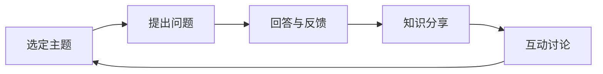

                 

## 1. 背景介绍

### 1.1 问题由来

在当前的科技飞速发展的背景下，知识更新速度加快，对个人和团队的学习能力提出了更高的要求。团队成员需要在工作中不断学习新知识、掌握新技术，以保持竞争力。然而，传统的学习方式往往难以激发学习热情，效果欠佳。

### 1.2 问题核心关键点

费曼提问法（Feynman Technique）由诺贝尔物理学奖得主理查德·费曼（Richard Feynman）提出，是一种以理解知识为核心的学习方法。该方法通过将复杂问题分解为一系列简洁、易于理解的小问题，逐步深入，最终达到完全理解的目的。

### 1.3 问题研究意义

费曼提问法在个人学习、团队协作、教育培训等多个领域都有广泛的应用。应用费曼提问法可以：
- **激发学习动力**：将大问题分解成小问题，使学习过程更有条理、更有成就感。
- **促进深度思考**：通过提问和回答，促使深入思考和理解知识。
- **提高知识掌握度**：明确自己的知识盲点，有针对性地补充学习。
- **增强团队合作**：通过问题交流，促进团队成员间的沟通与协作。

本文聚焦于费曼提问法在促进团队学习与成长中的应用，探讨如何通过该方法提升团队的知识水平、技术能力以及整体战斗力。

## 2. 核心概念与联系

### 2.1 核心概念概述

费曼提问法主要由以下三个步骤构成：
1. **选定主题**：选择一个感兴趣或需要掌握的知识点作为主题。
2. **提出问题**：将主题问题逐步细分为一系列简洁、具体的小问题。
3. **回答与反馈**：逐一回答小问题，并根据回答情况不断调整和优化问题。

此外，结合团队学习，还可以引入：
- **知识分享**：将个人学习成果通过会议、文档等形式分享给团队成员。
- **互动讨论**：通过团队互动，增强问题理解，提升共同认知。

通过以上概念和步骤，可以实现高效、深度、有反馈的学习过程，促进团队整体的成长。

### 2.2 核心概念原理和架构的 Mermaid 流程图

## 3. 核心算法原理 & 具体操作步骤

### 3.1 算法原理概述

费曼提问法的核心在于通过不断提问与回答，逐步深入理解复杂问题。该方法的算法原理可以概括为：
- **分解**：将复杂问题分解为一系列小问题。
- **细化**：对小问题进行进一步细化，使其简洁具体。
- **验证**：通过回答小问题，验证理解程度。
- **调整**：根据回答情况调整问题，确保理解全面。

### 3.2 算法步骤详解

**步骤1：选定主题**
- 确定一个需要掌握或探讨的主题。
- 主题可以是新学习的技术、项目中遇到的问题、行业动态等。

**步骤2：提出问题**
- 将主题分解为一系列简洁具体的小问题。
- 这些问题应以“How do I explain this?”形式表达，即“我如何解释这个问题？”

**步骤3：回答与反馈**
- 逐一回答每个小问题。
- 尝试用简洁明了的语言解释，确保能够回答每个细节。
- 邀请他人复核回答，提供反馈意见，进一步优化问题。

**步骤4：知识分享**
- 将个人的学习成果整理成文档、PPT等形式，分享给团队成员。
- 在团队会议或在线平台上分享学习成果。

**步骤5：互动讨论**
- 邀请团队成员参与讨论，提供不同视角和补充信息。
- 通过讨论，进一步验证和完善回答。

### 3.3 算法优缺点

#### 优点：
- **促进深入理解**：通过不断提问与回答，促使团队成员深入理解问题本质。
- **激发学习兴趣**：将复杂问题分解成小问题，使学习过程更有条理、更有成就感。
- **增强团队协作**：通过知识分享和互动讨论，促进团队成员间的沟通与协作。

#### 缺点：
- **时间消耗**：逐步分解和细化问题需要时间，可能需要较长的准备期。
- **依赖个人**：初始阶段依赖个人问题提出能力，可能影响效率。

### 3.4 算法应用领域

费曼提问法在多个领域都有广泛的应用，主要包括：
- **个人学习**：用于自我提升和掌握新知识。
- **团队培训**：用于提升团队整体技术水平和知识水平。
- **知识传递**：用于将个人学习成果传递给团队。
- **项目协作**：用于项目开发中解决具体问题。

## 4. 数学模型和公式 & 详细讲解 & 举例说明

### 4.1 数学模型构建

费曼提问法虽然主要是以非正式的方式进行，但在某些情况下，可以通过数学模型进行形式化描述。假设问题集合为 $P = \{p_1, p_2, ..., p_n\}$，问题 $p_i$ 的复杂度为 $c_i$，回答 $a_i$ 的准确度为 $a_i \in [0,1]$。则整个问题的理解和掌握程度可以表示为：

$$
G = \frac{1}{n} \sum_{i=1}^n a_i c_i
$$

其中，$G$ 表示问题集 $P$ 的总体理解和掌握程度，$c_i$ 为问题 $p_i$ 的复杂度，$a_i$ 为回答 $a_i$ 的准确度。

### 4.2 公式推导过程

通过上述数学模型，可以推导出以下结论：
- 当 $a_i = 1$，即回答完全准确时，问题 $p_i$ 的贡献最大。
- 当 $c_i$ 较小，即问题 $p_i$ 简洁具体时，问题 $p_i$ 的贡献较大。
- 通过不断调整问题 $p_i$ 的复杂度 $c_i$ 和回答准确度 $a_i$，可以逐步提升 $G$。

### 4.3 案例分析与讲解

假设团队需要掌握深度学习中的卷积神经网络（CNN），可以将问题分解为以下几个小问题：
1. 卷积神经网络的定义是什么？
2. 卷积神经网络的结构有哪些？
3. 卷积神经网络的优势是什么？
4. 如何训练卷积神经网络？

团队成员逐一回答这些问题，并在回答问题时，不断细化和调整问题，确保每个细节都能理解透彻。最终，通过知识分享和讨论，团队成员能够全面掌握卷积神经网络的知识。

## 5. 项目实践：代码实例和详细解释说明

### 5.1 开发环境搭建

为了实践费曼提问法，可以使用以下开发工具：
- **文档工具**：如Confluence、Google Docs等，用于记录和共享问题及回答。
- **协作平台**：如Slack、Microsoft Teams等，用于组织讨论和知识分享。
- **项目管理工具**：如Jira、Trello等，用于跟踪问题的提出和解决进度。

### 5.2 源代码详细实现

假设团队成员A需要掌握Python中的函数式编程（Functional Programming），可以按照以下步骤实践费曼提问法：
1. 选定主题：Python函数式编程。
2. 提出问题：函数式编程的基本概念是什么？
3. 回答与反馈：逐步细化问题，并邀请团队成员B和C进行反馈。
4. 知识分享：将学习成果整理成文档，分享给团队。
5. 互动讨论：在团队会议上，邀请成员讨论函数式编程的应用场景。

### 5.3 代码解读与分析

在实际代码实现中，可以使用Python编写一个简单的“问题与回答”管理系统。具体实现步骤如下：
1. 创建一个问题数据库，用于存储问题和回答。
2. 创建一个Web界面，允许成员输入问题、回答问题，并查看历史问题和回答。
3. 使用协作工具如Jira，记录问题的提出和解决进度，确保问题得到及时解决。

### 5.4 运行结果展示

运行结果展示：
- 问题数据库：保存了所有问题及其回答，可以作为后续学习和知识传承的参考资料。
- Web界面：直观展示问题与回答，方便团队成员随时查看和更新。
- Jira进度：实时跟踪问题的提出和解决进度，确保问题得到及时解决。

## 6. 实际应用场景

### 6.1 软件开发

在软件开发中，费曼提问法可以用于解决具体技术问题。例如，团队成员可以针对新技术、新框架或工具提出问题，并邀请其他成员回答，不断优化问题。通过知识分享和讨论，团队成员可以迅速掌握新技术，提高开发效率和质量。

### 6.2 项目管理

在项目管理中，费曼提问法可以用于制定和优化项目计划。团队成员可以通过提出问题，明确项目的各个环节和技术难点，通过讨论和分享，制定出更为合理和可行的项目计划。

### 6.3 产品设计

在产品设计中，费曼提问法可以用于市场调研和用户需求分析。通过不断提出问题，团队成员可以更深入地理解用户需求和市场趋势，设计出更具竞争力和创新性的产品。

### 6.4 未来应用展望

未来，费曼提问法将在更多领域得到应用，例如：
- **教育培训**：用于学生自主学习、知识传承和教师教学。
- **医疗健康**：用于医疗知识普及、技术培训和临床应用。
- **公共管理**：用于政策制定、公共事务管理和市民教育。
- **科学研究**：用于科学探索、知识传播和跨学科合作。

## 7. 工具和资源推荐

### 7.1 学习资源推荐

为了帮助团队成员系统掌握费曼提问法，推荐以下学习资源：
1. 《费曼物理学讲义》（Richard Feynman）：费曼本人关于物理学和科学方法的系统总结，深入浅出地介绍了科学探究的方法和步骤。
2. 《深度学习入门》（Ian Goodfellow）：介绍深度学习基础和应用，涵盖模型的构建、训练和优化等方面。
3. 《软件开发生命周期管理》（Carl Sandstorm）：讲解软件项目管理、团队协作和知识共享的方法，结合实际案例，深入浅出。
4. 《问题导向的学习与教学》（Eric Mazur）：探讨问题导向学习法的理论基础和实践方法，有助于提升团队成员的学习效果。

### 7.2 开发工具推荐

以下是推荐用于实践费曼提问法的开发工具：
1. **文档工具**：如Confluence、Google Docs、Notion等，用于记录和共享问题及回答。
2. **协作平台**：如Slack、Microsoft Teams、Zoom等，用于组织讨论和知识分享。
3. **项目管理工具**：如Jira、Trello、Asana等，用于跟踪问题的提出和解决进度。
4. **知识管理工具**：如Kanban、Confluence、SharePoint等，用于知识库的构建和管理。

### 7.3 相关论文推荐

为了深入理解费曼提问法的理论基础和应用方法，推荐以下相关论文：
1. "The Art of Problem Solving: An Introduction to Mathematical Problem Solving" by Peter Winkler：探讨了问题解决的基本方法和技巧，适合团队学习。
2. "A Brief History of Problem-Based Learning" by Joanne Calderhead：介绍了问题导向学习法的历史和理论基础，提供了丰富的案例和实践经验。
3. "Practical Problem Solving with Project Management" by Iain Fitter：结合项目管理案例，介绍了问题解决的方法和工具，适合团队实践。

## 8. 总结：未来发展趋势与挑战

### 8.1 研究成果总结

费曼提问法作为一种高效的学习方法，已经在多个领域得到广泛应用。通过不断提问与回答，团队成员可以深入理解问题，激发学习兴趣，增强团队协作。未来，费曼提问法将在更多领域得到应用，进一步推动知识创新和团队成长。

### 8.2 未来发展趋势

未来，费曼提问法的发展趋势可能包括以下几个方面：
1. **自动化与智能化**：结合AI技术，自动生成问题、评估回答效果，进一步提升学习效率。
2. **跨领域应用**：将费曼提问法应用于更多领域，如医疗、教育、公共管理等，提升整体知识水平。
3. **数据驱动**：结合大数据和机器学习，分析学习过程和效果，优化问题提出和回答策略。
4. **知识图谱**：结合知识图谱技术，构建更全面的知识网络，促进知识的传递和共享。

### 8.3 面临的挑战

尽管费曼提问法具有诸多优点，但在推广应用中仍面临以下挑战：
1. **执行难度**：团队成员需要持续投入时间和精力，初期可能遇到困难。
2. **效果评估**：如何量化学习效果，评估问题提出和回答的质量，需要进一步研究。
3. **文化适应**：不同团队文化对费曼提问法的接受程度不同，需要根据实际情况进行调整。

### 8.4 研究展望

未来研究应集中在以下几个方面：
1. **量化评估**：开发自动化的评估工具，量化学习效果，提供有针对性的反馈。
2. **适应性调整**：根据团队特点和任务需求，设计适应性更强的费曼提问法模型。
3. **跨领域应用**：将费曼提问法应用于更多领域，提升各领域的知识水平和创新能力。
4. **知识图谱**：结合知识图谱技术，构建更全面的知识网络，促进知识的传递和共享。

## 9. 附录：常见问题与解答

**Q1：费曼提问法如何与其他学习方法结合？**

A: 费曼提问法可以与其他学习方法结合使用，例如：
- 结合“翻转课堂”，提前让学生自行学习问题，课堂上进行讨论和答疑。
- 结合“项目制学习”，让学生在项目中遇到问题，团队协作进行解答。
- 结合“翻转式教学”，教师先提出问题，学生提前学习，课堂上进行互动讨论。

**Q2：费曼提问法是否适用于所有团队？**

A: 费曼提问法适用于大多数团队，尤其是对知识掌握和学习能力要求较高的团队。但需注意，不同团队文化、团队成员特点和任务需求不同，需要根据实际情况进行调整。

**Q3：如何评估费曼提问法的效果？**

A: 可以通过以下几个方面评估费曼提问法的效果：
1. 问题解决进度：记录问题的提出和解决进度，确保问题得到及时解决。
2. 学习成果质量：评估回答的准确度和详细程度，确保团队成员深入理解问题。
3. 知识掌握度：通过测试和应用，评估团队成员的知识掌握情况。
4. 团队协作效果：评估团队成员的互动频率和质量，提升团队合作能力。

**Q4：费曼提问法的实施步骤是什么？**

A: 费曼提问法的实施步骤如下：
1. 选定主题：确定需要掌握的知识点或问题。
2. 提出问题：将主题分解为一系列简洁、具体的小问题。
3. 回答与反馈：逐一回答小问题，邀请他人复核回答，提供反馈意见。
4. 知识分享：将学习成果整理成文档、PPT等形式，分享给团队成员。
5. 互动讨论：邀请团队成员参与讨论，提供不同视角和补充信息。

通过以上步骤，团队成员可以不断深入理解问题，提升知识水平和团队协作能力。

