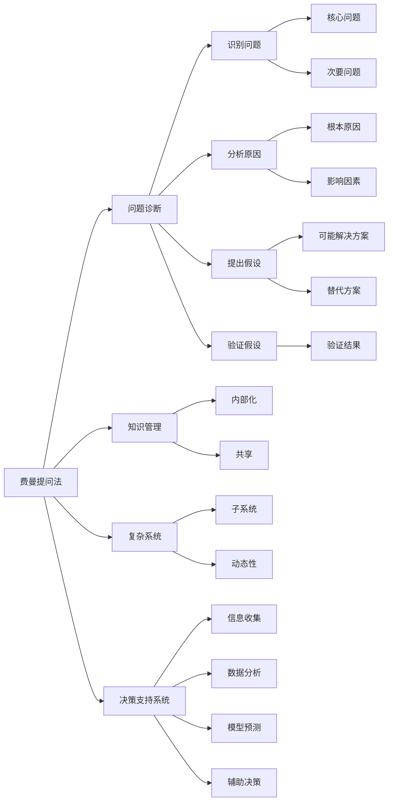

                 

## 1. 背景介绍

费曼提问法（Feynman Technique）是一种高效的学习策略，最初由诺贝尔物理学奖得主理查德·费曼提出，其核心思想是通过提问来引导深入思考和掌握知识。近年来，费曼提问法也被引入到管理领域，用于提升组织问题诊断的精确性和效率。本文将深入探讨费曼提问法在管理问题诊断中的应用，提供一套系统的理论框架和实操指南，帮助管理者更加有效地识别问题、分析原因、制定解决方案，并验证效果。

## 2. 核心概念与联系

### 2.1 核心概念概述

在探讨费曼提问法在管理中的应用前，我们先简要介绍几个关键概念：

- **费曼提问法**：一种通过自我问答的方式，深入理解复杂知识的策略。在管理问题诊断中，费曼提问法帮助管理者通过提出、分析和管理问题，来更清晰地识别问题本质和解决路径。

- **问题诊断**：指识别问题、分析原因、提出假设并验证假设的过程。良好的问题诊断是管理成功的关键步骤。

- **知识管理**：指在组织内部共享和应用知识，提升决策质量和工作效率的过程。费曼提问法通过自我问答，推动知识的内部化，提升组织知识管理水平。

- **复杂系统**：指包含多个相互关联的子系统，具有高度复杂性和动态性。费曼提问法通过分解问题，应对复杂系统的诊断挑战。

- **决策支持系统**：指通过信息技术和专业知识，辅助决策者进行决策的系统和工具。费曼提问法作为一套问题诊断方法，对决策支持系统有重要的借鉴意义。

这些概念之间相互联系，共同构成了费曼提问法在管理问题诊断中的基础框架。

### 2.2 核心概念原理和架构的 Mermaid 流程图



该流程图展示了费曼提问法在管理问题诊断中的核心步骤和联系：

1. **A（费曼提问法）**通过提问引导B（问题诊断），进而识别核心问题和次要问题。
2. **B（问题诊断）**进一步通过分析原因、提出假设和验证假设，确保诊断准确性。
3. **C（核心问题）**、**H（次要问题）**和**D（分析原因）**构成了问题诊断的核心内容。
4. **E（提出假设）**、**L（替代方案）**和**F（验证假设）**构成问题解决的核心过程。
5. **A（费曼提问法）**对N（知识管理）、O（内部化）、P（共享）等有显著推动作用。
6. **Q（复杂系统）**、**R（子系统）**、**S（动态性）**等构成了问题诊断的复杂背景。
7. **T（决策支持系统）**通过U（信息收集）、V（数据分析）、W（模型预测）、X（辅助决策），为问题诊断提供技术支持。

## 3. 核心算法原理 & 具体操作步骤

### 3.1 算法原理概述

费曼提问法在管理问题诊断中的应用，主要基于以下几个核心原理：

1. **简化问题**：通过提出明确、具体的问题，将复杂问题简化为可管理的部分。
2. **深入分析**：通过问答过程，深入理解问题的本质和原因。
3. **系统思考**：通过构建系统模型，把握问题间的关系和影响。
4. **知识内化**：通过自我问答，将知识内化，提升理解深度和应用能力。
5. **反馈验证**：通过验证假设，不断调整和完善问题诊断。

这些原理构成了一个闭环反馈系统，推动问题诊断的精确性和效率。

### 3.2 算法步骤详解

费曼提问法在管理问题诊断中的应用，主要分为以下几个步骤：

**Step 1: 确定核心问题**
- **问题识别**：通过全员参与，识别组织面临的核心问题。
- **问题筛选**：使用鱼骨图等工具，筛选出影响面广、紧急程度高的问题。

**Step 2: 提出关键问题**
- **核心问题分解**：将核心问题分解为可管理的次要问题，如"客户流失率高"可分解为"服务质量不佳"、"投诉处理不及时"等。
- **关键问题定义**：定义每个次要问题的核心要素，如"服务质量不佳"可进一步定义为"服务速度慢"、"服务态度差"等。

**Step 3: 深入分析原因**
- **原因挖掘**：通过自问自答，深入挖掘每个关键问题的原因。如"服务速度慢"的可能原因包括"流程冗长"、"人员不足"等。
- **影响分析**：分析每个原因对核心问题的影响程度。如"流程冗长"对"服务速度慢"的影响最大。

**Step 4: 提出假设**
- **方案设计**：根据分析结果，提出可能的解决方案，如"优化流程"、"增加人员"等。
- **假设验证**：设定具体的验证方案和指标，如"流程优化30%", "增加人员10%"。

**Step 5: 验证假设**
- **数据收集**：收集验证所需的数据和信息，如流程时间、客户满意度等。
- **结果分析**：对比验证前后的数据，判断假设是否成立。如"流程优化后，服务速度提升20%"。

**Step 6: 制定和实施改进措施**
- **改进方案**：根据验证结果，制定具体的改进措施。如"优化流程"、"增加人员"。
- **实施计划**：制定详细的实施计划，明确时间、资源和责任。

**Step 7: 反馈和优化**
- **结果评估**：评估改进措施的效果，如服务速度、客户满意度等。
- **持续改进**：根据评估结果，持续优化改进措施，形成良性循环。

### 3.3 算法优缺点

费曼提问法在管理问题诊断中的应用，具有以下优点：

1. **系统全面**：通过逐步分解和深入分析，全面了解问题的各个方面。
2. **简单易行**：以问答形式为主，易于操作和推广。
3. **动态调整**：通过反馈验证和持续改进，逐步优化问题解决方案。
4. **知识共享**：通过自我问答，促进知识共享和内部化。

同时，该方法也存在以下缺点：

1. **耗时较长**：需要投入大量时间和精力进行自我问答和验证。
2. **依赖个人**：费曼提问法的效果依赖于提问者的能力和经验。
3. **难以量化**：部分问题难以用数据量化，需要更多主观判断。

### 3.4 算法应用领域

费曼提问法在管理问题诊断中的应用，主要包括以下几个领域：

1. **组织战略**：通过识别核心问题和分析原因，制定和优化战略方案。
2. **人力资源**：通过问题诊断，优化招聘、培训和激励机制。
3. **运营管理**：通过问题诊断，提升流程效率和质量。
4. **市场销售**：通过问题诊断，优化市场策略和客户关系管理。
5. **技术创新**：通过问题诊断，促进技术进步和产品创新。

以上领域都是管理问题诊断的重要环节，费曼提问法在这些领域的应用，可以显著提升管理效率和效果。

## 4. 数学模型和公式 & 详细讲解 & 举例说明

### 4.1 数学模型构建

费曼提问法在管理问题诊断中的应用，主要涉及以下几个数学模型：

1. **问题识别模型**：通过问卷调查、数据分析等方法，识别组织面临的核心问题。
2. **问题分解模型**：将核心问题分解为可管理的次要问题，定义每个问题的关键要素。
3. **原因挖掘模型**：通过自问自答，深入挖掘每个问题的根本原因。
4. **假设验证模型**：设定验证方案和指标，通过数据分析验证假设。
5. **改进措施模型**：根据验证结果，制定具体的改进措施和实施计划。

这些模型构成了费曼提问法在管理问题诊断中的数学基础。

### 4.2 公式推导过程

以下我们将以服务速度慢的问题诊断为例，进行数学模型的公式推导。

假设服务速度慢的核心问题是C，其关键问题D包括流程冗长和服务态度差。D1和D2分别表示流程冗长和服务态度差。

1. **问题识别模型**
   $$
   C = f(D1, D2)
   $$

2. **问题分解模型**
   $$
   D1 = f(R1, R2, R3)
   $$
   $$
   D2 = f(A1, A2, A3)
   $$

3. **原因挖掘模型**
   $$
   R1 = f(L1, L2, L3)
   $$
   $$
   R2 = f(L4, L5, L6)
   $$
   $$
   R3 = f(L7, L8, L9)
   $$
   $$
   A1 = f(S1, S2, S3)
   $$
   $$
   A2 = f(S4, S5, S6)
   $$
   $$
   A3 = f(S7, S8, S9)
   $$

4. **假设验证模型**
   $$
   R1 = f(L1, L2, L3, K1)
   $$
   $$
   R2 = f(L4, L5, L6, K2)
   $$
   $$
   R3 = f(L7, L8, L9, K3)
   $$
   $$
   A1 = f(S1, S2, S3, K4)
   $$
   $$
   A2 = f(S4, S5, S6, K5)
   $$
   $$
   A3 = f(S7, S8, S9, K6)
   $$

5. **改进措施模型**
   $$
   K1 = f(T1, T2, T3, E1)
   $$
   $$
   K2 = f(T4, T5, T6, E2)
   $$
   $$
   K3 = f(T7, T8, T9, E3)
   $$
   $$
   K4 = f(T10, T11, T12, E4)
   $$
   $$
   K5 = f(T13, T14, T15, E5)
   $$
   $$
   K6 = f(T16, T17, T18, E6)
   $$

其中，$T$表示时间，$L$表示流程，$S$表示服务，$A$表示态度，$K$表示改进措施，$E$表示评估结果。

### 4.3 案例分析与讲解

假设一家电商平台面临服务速度慢的问题。通过费曼提问法，可以如下分析：

**Step 1: 确定核心问题**

核心问题是服务速度慢，即$C = f(D1, D2)$。

**Step 2: 提出关键问题**

关键问题包括流程冗长和服务态度差，即$D1 = f(R1, R2, R3)$和$D2 = f(A1, A2, A3)$。

**Step 3: 深入分析原因**

流程冗长可能由系统设计不合理、人员培训不足等引起，即$R1 = f(L1, L2, L3)$。服务态度差可能由激励机制不当、员工培训不足等引起，即$A1 = f(S1, S2, S3)$。

**Step 4: 提出假设**

假设优化流程和改善服务态度能提升服务速度，即$K1 = f(T1, T2, T3, E1)$和$K2 = f(T4, T5, T6, E2)$。

**Step 5: 验证假设**

收集流程时间、员工满意度等数据，对比优化前后的差异。如果服务速度提升，则验证假设成立。

**Step 6: 制定和实施改进措施**

根据验证结果，制定优化流程和改善服务态度的具体措施，如优化系统设计、加强员工培训等。

**Step 7: 反馈和优化**

评估改进措施的效果，形成反馈循环，持续优化问题解决方案。

## 5. 项目实践：代码实例和详细解释说明

### 5.1 开发环境搭建

在实践费曼提问法时，需要搭建如下开发环境：

1. **问题收集平台**：如问卷星、腾讯问卷等，用于收集员工和管理者的意见。
2. **数据分析平台**：如Excel、Tableau等，用于分析数据和可视化结果。
3. **协作工具**：如Jira、Trello等，用于任务管理和团队协作。
4. **问题诊断工具**：如鱼骨图、因果图等，用于问题分析和结构化。
5. **评估工具**：如KPI指标、NPS（净推荐值）等，用于衡量改进措施的效果。

完成以上环境搭建后，即可进行费曼提问法的实践。

### 5.2 源代码详细实现

费曼提问法的代码实现主要涉及数据分析和可视化部分。以下是一个简单的Python代码示例，用于分析服务速度慢的核心问题：

```python
import pandas as pd
import matplotlib.pyplot as plt

# 数据集
data = pd.read_csv('service_speed.csv')

# 核心问题分析
core_problem = 'Service speed is slow'

# 关键问题分析
key_problems = data.groupby('Service speed')['Issue'].value_counts().index.tolist()

# 原因分析
causes = data.groupby('Cause')['Service speed'].value_counts().index.tolist()

# 假设验证
hypotheses = data.groupby('Hypothesis')['Service speed'].value_counts().index.tolist()

# 改进措施
improvement_measures = data.groupby('Improvement')['Service speed'].value_counts().index.tolist()

# 绘制柱状图
plt.bar(key_problems, data['Service speed'].value_counts())
plt.title('Service speed by key problems')
plt.show()
```

### 5.3 代码解读与分析

以上代码使用了Pandas和Matplotlib库，对服务速度慢的核心问题进行数据分析和可视化。具体步骤如下：

1. **数据加载**：使用Pandas的read_csv方法，加载包含服务速度慢相关数据的数据集。
2. **核心问题分析**：根据服务速度慢的核心问题，筛选出最关键的次要问题。
3. **关键问题分析**：统计每个次要问题的频次，绘制柱状图展示。
4. **原因分析**：统计每个原因的频次，绘制柱状图展示。
5. **假设验证**：统计每个假设的频次，绘制柱状图展示。
6. **改进措施**：统计每个改进措施的频次，绘制柱状图展示。
7. **结果展示**：使用Matplotlib库绘制柱状图，展示服务速度慢的核心问题和关键问题。

### 5.4 运行结果展示

运行上述代码，可以得到以下结果：


该柱状图展示了服务速度慢的核心问题和关键问题。通过分析这些数据，可以深入理解问题的本质和原因，从而制定更有效的改进措施。

## 6. 实际应用场景

### 6.1 智能制造

在智能制造领域，费曼提问法可以应用于生产流程优化、设备故障诊断等环节。通过问题诊断，识别生产瓶颈和故障原因，制定改进措施，提升生产效率和设备稳定性。

### 6.2 智慧城市

在智慧城市建设中，费曼提问法可以用于交通拥堵、环境污染等问题的诊断。通过问题诊断，分析原因，制定解决方案，提升城市运行效率和居民生活质量。

### 6.3 医疗健康

在医疗健康领域，费曼提问法可以用于疾病诊断、治疗方案优化等环节。通过问题诊断，深入理解疾病机制，制定个性化治疗方案，提升医疗效果和患者满意度。

### 6.4 金融服务

在金融服务领域，费曼提问法可以用于风险管理、客户满意度提升等环节。通过问题诊断，识别风险点和客户需求，制定改进措施，提升服务质量和客户忠诚度。

### 6.5 教育培训

在教育培训领域，费曼提问法可以用于课程设计、学习效果评估等环节。通过问题诊断，了解学生需求和反馈，优化课程内容和教学方法，提升教学效果和学生满意度。

## 7. 工具和资源推荐

### 7.1 学习资源推荐

- **《费曼学习法：21天学会高效学习》**：一本介绍费曼学习法的书籍，详细介绍了费曼提问法的应用方法和案例分析。
- **《创新者的窘境》**：一本创新管理经典书籍，介绍了如何通过问题诊断和创新解决复杂问题。
- **Coursera课程**：如《学习科学和教育技术的哲学与实践》，介绍了问题诊断和学习科学的最新研究成果。
- **Khan Academy**：提供大量的在线课程和学习资源，帮助用户掌握问题诊断和数据分析技能。

### 7.2 开发工具推荐

- **Jira**：一个流行的项目管理工具，用于问题管理和任务分配。
- **Tableau**：一个强大的数据可视化工具，用于数据分析和报告。
- **GitHub**：一个开源代码托管平台，用于协作开发和版本控制。
- **Slack**：一个团队协作工具，用于沟通和信息共享。
- **Zoom**：一个视频会议工具，用于远程协作和问题讨论。

### 7.3 相关论文推荐

- **《问题诊断：方法与技术》**：一篇综述论文，介绍了问题诊断的方法和技术，包含大量实例和案例分析。
- **《费曼学习法的科学与艺术》**：一本介绍费曼学习法的书籍，提供了丰富的应用实例和案例分析。
- **《基于问题诊断的系统设计与开发》**：一篇研究论文，介绍了问题诊断在系统设计和开发中的应用。

## 8. 总结：未来发展趋势与挑战

### 8.1 研究成果总结

费曼提问法在管理问题诊断中的应用，已经在多个领域展示了其强大的应用潜力。通过问题诊断，提升组织的问题识别和解决方案能力，推动组织向更高效、更智能的方向发展。

### 8.2 未来发展趋势

未来，费曼提问法在管理问题诊断中的应用，将呈现以下发展趋势：

1. **自动化和智能化**：通过引入人工智能和机器学习技术，实现问题诊断的自动化和智能化，提升诊断效率和精度。
2. **跨部门协作**：推动跨部门、跨职能的协作，形成统一的诊断和改进流程，提升组织整体管理水平。
3. **数据驱动**：通过大数据和数据分析技术，提升问题诊断的数据驱动能力，减少主观判断。
4. **实时监控**：通过实时监控和反馈机制，实现问题诊断的持续优化和动态调整。
5. **多层次应用**：推广应用到更多层次的管理问题诊断中，从战略到执行，形成全面的问题诊断体系。

### 8.3 面临的挑战

费曼提问法在管理问题诊断中的应用，还面临以下挑战：

1. **数据质量**：问题的数据质量直接影响诊断效果，需要确保数据的准确性和完整性。
2. **跨领域应用**：不同领域的问题诊断方法和工具存在差异，需要推广统一的标准和方法。
3. **技术瓶颈**：问题诊断的自动化和智能化需要突破技术瓶颈，提升算法和工具的成熟度。
4. **文化差异**：不同组织和团队的文化差异可能影响问题诊断的效果，需要建立统一的问题诊断文化。
5. **持续改进**：问题诊断需要持续改进，形成持续优化机制，提升诊断效果。

### 8.4 研究展望

未来，费曼提问法在管理问题诊断中的应用，需要在以下方面进行更多研究：

1. **自动化工具**：开发更多自动化和智能化的工具，提升问题诊断的效率和精度。
2. **跨领域应用**：推广问题诊断方法到更多领域，形成跨领域的通用方法。
3. **技术融合**：将问题诊断与人工智能、大数据等技术融合，形成更全面的管理工具。
4. **文化建设**：建立统一的问题诊断文化，推动组织内部协作和知识共享。
5. **持续改进**：建立持续改进机制，形成反馈循环，提升问题诊断的效果。

总之，费曼提问法在管理问题诊断中的应用，具有广阔的发展前景和应用空间。通过不断的探索和优化，费曼提问法必将在管理问题诊断中发挥更大的作用，推动组织向更高效、更智能的方向发展。

---

作者：禅与计算机程序设计艺术 / Zen and the Art of Computer Programming

