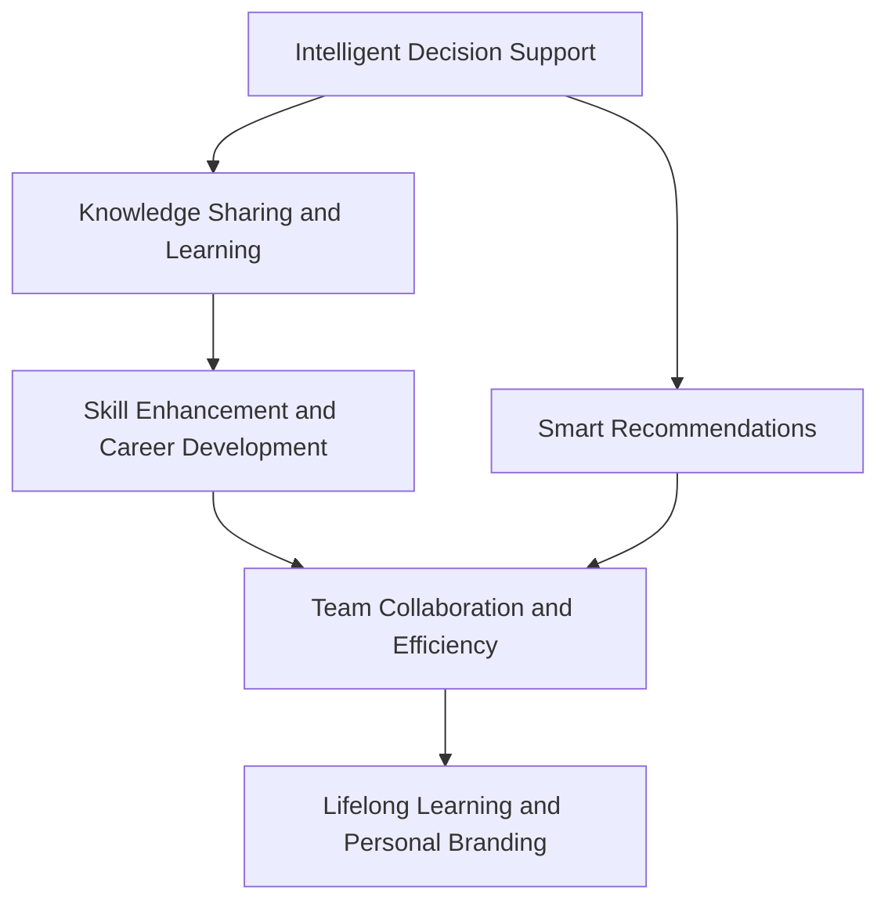

                 

# 赋能人类：释放个体潜能

> 关键词：人工智能,个体赋能,智能决策,知识共享,技能提升,人机协同

## 1. 背景介绍

在科技迅猛发展的今天，人工智能(AI)技术正以空前的速度渗透到各个领域，对社会生产力和人类生活方式产生了深远影响。从医疗、金融、制造到教育、娱乐，AI正日益展现出其强大的赋能潜力。然而，真正实现AI赋能的关键，并非技术的先进与否，而在于如何有效利用这些技术，使个体能够充分发挥其潜能，实现个人价值和职业发展的飞跃。

### 1.1 问题由来

随着AI技术的不断成熟，人工智能在自动化、智能化方面的能力日益增强。然而，尽管AI在效率、准确性、处理复杂任务方面表现卓越，但如何在技术驱动下实现个体赋能，使其成为技术的真正受益者，仍然是摆在眼前的巨大挑战。特别是在教育和职业培训等场景，如何将AI融入个体发展中，实现人机协同，提升学习效率和工作质量，仍需深入研究和实践。

### 1.2 问题核心关键点

个体赋能的核心在于AI技术的深度融合和个体潜能的充分挖掘。具体而言，可以从以下几个方面来阐述：

1. **智能决策支持**：利用AI技术进行数据分析和智能推荐，帮助个体在决策过程中更加精准高效。
2. **知识共享与学习**：通过AI驱动的个性化学习系统，为个体提供定制化学习内容，加速技能提升。
3. **技能提升与职业发展**：AI技术在技能评估、职业规划、职场模拟等方面，能够提供专业、客观的指导和建议。
4. **人机协同工作**：通过AI辅助的协同工作系统，提升团队协作效率，增强工作成效。
5. **终身学习与个人品牌**：AI技术的普及使终身学习成为可能，个体可以通过在线学习平台不断更新知识，构建个人品牌，提升职业竞争力。

## 2. 核心概念与联系

### 2.1 核心概念概述

为了更好地理解个体赋能的AI技术框架，我们首先需要明确几个核心概念：

- **人工智能(AI)**：一种使计算机系统能够执行人类智能任务的技术，如视觉感知、语言理解、决策制定等。
- **智能决策支持**：通过AI技术进行数据分析和智能推荐，辅助个体进行决策。
- **知识共享与学习**：利用AI技术，为个体提供个性化学习资源，加速知识积累和技能提升。
- **技能提升与职业发展**：AI在技能评估、职业规划、职场模拟等方面的应用，帮助个体提升职业素养，规划职业路径。
- **人机协同工作**：利用AI技术优化团队协作流程，提升工作效率和质量。
- **终身学习与个人品牌**：借助AI技术，实现个性化学习，构建个人知识体系，提升个人品牌价值。

这些核心概念之间存在密切的联系，通过深度融合，可以实现AI对个体潜能的全面赋能。

### 2.2 核心概念原理和架构的 Mermaid 流程图(Mermaid 流程节点中不要有括号、逗号等特殊字符)



这个流程图展示了AI赋能个体潜能的关键路径：

1. **智能决策支持**：通过智能推荐，辅助个体进行决策。
2. **知识共享与学习**：利用个性化学习系统，加速知识积累。
3. **技能提升与职业发展**：通过技能评估和职业规划，提升职业素养和竞争力。
4. **人机协同工作**：优化团队协作，提高工作效率和质量。
5. **终身学习与个人品牌**：通过个性化学习，构建个人品牌。

## 3. 核心算法原理 & 具体操作步骤

### 3.1 算法原理概述

个体赋能的AI技术框架基于多模态信息处理和深度学习技术，通过智能决策支持、知识共享与学习、技能提升与职业发展、人机协同工作、终身学习与个人品牌等多个环节的协同作用，实现对个体潜能的全面挖掘和提升。

具体来说，AI技术通过以下几个步骤，逐步实现个体赋能：

1. **数据收集与预处理**：收集个体的历史数据、行为数据、学习数据、工作数据等，进行清洗、去噪和标准化处理。
2. **特征提取与表示学习**：利用特征提取技术，将收集到的数据转换为模型可处理的特征表示。
3. **模型训练与优化**：在特征表示的基础上，使用深度学习模型进行训练和优化，提高模型预测准确性和泛化能力。
4. **智能决策支持**：通过模型进行数据分析和智能推荐，辅助个体进行决策。
5. **知识共享与学习**：利用模型生成的推荐，为个体提供个性化学习资源，加速知识积累。
6. **技能提升与职业发展**：通过模型对个体的技能评估和职业规划，提供专业指导和建议。
7. **人机协同工作**：利用模型优化团队协作流程，提升工作效率和质量。
8. **终身学习与个人品牌**：通过模型生成的个性化学习资源，构建个人知识体系，提升个人品牌价值。

### 3.2 算法步骤详解

以下详细讲解基于AI的个体赋能关键步骤。

**Step 1: 数据收集与预处理**

- **数据来源**：收集个体的各种数据，包括历史行为数据、学习数据、工作数据等。数据来源广泛，如社交媒体、在线课程平台、企业系统等。
- **数据清洗**：对收集到的数据进行清洗，去除噪声和异常值，确保数据质量。
- **数据标准化**：将数据转换为标准格式，便于后续模型处理。

**Step 2: 特征提取与表示学习**

- **特征选择**：根据任务需求，选择与个体潜能相关的特征。
- **特征提取**：利用特征提取算法，如PCA、LDA、One-hot编码等，将数据转换为高维特征向量。
- **表示学习**：使用深度学习模型进行表示学习，如自编码器、神经网络等，将特征向量转换为更丰富的语义表示。

**Step 3: 模型训练与优化**

- **模型选择**：根据任务需求，选择合适的深度学习模型，如卷积神经网络(CNN)、循环神经网络(RNN)、变压器(Transformer)等。
- **模型训练**：使用训练数据集对模型进行训练，优化模型参数，提高预测准确性和泛化能力。
- **模型评估**：在验证数据集上评估模型性能，调整模型超参数，防止过拟合。

**Step 4: 智能决策支持**

- **数据输入**：将个体的输入数据输入到训练好的模型中。
- **决策输出**：模型输出智能推荐，辅助个体进行决策。

**Step 5: 知识共享与学习**

- **资源推荐**：利用模型生成个性化推荐，为个体提供学习资源。
- **学习过程监控**：监控个体的学习过程，根据学习效果调整推荐内容。

**Step 6: 技能提升与职业发展**

- **技能评估**：利用模型对个体技能进行评估，识别出技能短板。
- **职业规划**：根据技能评估结果，为个体提供职业规划建议。

**Step 7: 人机协同工作**

- **任务分配**：利用模型优化任务分配，提高团队协作效率。
- **实时监控**：实时监控团队工作状态，提供实时反馈和调整建议。

**Step 8: 终身学习与个人品牌**

- **个性化学习**：根据个体需求和兴趣，提供个性化学习资源。
- **知识体系构建**：帮助个体构建个人知识体系，提升个人品牌价值。

### 3.3 算法优缺点

基于AI的个体赋能技术具有以下优点：

1. **数据驱动**：通过数据分析和智能推荐，提高决策精准度和学习效率。
2. **个性化定制**：利用模型生成的个性化推荐，满足个体差异化的需求。
3. **实时监控**：实时监控和反馈，帮助个体及时调整和优化决策和学习过程。
4. **全面覆盖**：覆盖智能决策、知识共享、技能提升、协同工作和终身学习等多个环节，全面赋能个体。

然而，这种技术也存在一些缺点：

1. **隐私和安全问题**：收集和处理大量个人数据，存在隐私泄露和数据安全的风险。
2. **模型复杂性**：深度学习模型复杂，训练和优化需要大量资源和时间。
3. **技术门槛高**：需要专业技术人员进行模型训练和优化，技术门槛较高。

### 3.4 算法应用领域

基于AI的个体赋能技术在多个领域得到了广泛应用，包括但不限于：

- **教育培训**：利用智能推荐和学习系统，提升学习效果和教学质量。
- **职业发展**：通过技能评估和职业规划，帮助个体提升职业素养和竞争力。
- **人力资源管理**：利用模型优化人才招聘、培训和评估流程，提高人力资源管理效率。
- **健康医疗**：利用模型进行健康数据分析和疾病预测，提供个性化医疗建议。
- **金融服务**：利用模型进行风险评估和投资决策支持，提升金融服务质量。

## 4. 数学模型和公式 & 详细讲解 & 举例说明

### 4.1 数学模型构建

为了更好地理解基于AI的个体赋能技术，我们首先构建数学模型。假设个体赋能系统的输入为 $x$，包括历史行为数据、学习数据、工作数据等，输出为 $y$，包括智能决策推荐、个性化学习资源、职业规划建议等。则数学模型为：

$$ y = f(x) $$

其中 $f(x)$ 为模型函数，将输入数据 $x$ 映射为输出数据 $y$。

### 4.2 公式推导过程

以下对关键步骤的公式进行推导：

**Step 1: 数据收集与预处理**

- **数据清洗**：使用统计方法和异常检测算法，清洗数据集。
- **数据标准化**：使用标准化算法，如Z-score标准化，将数据转换为标准格式。

**Step 2: 特征提取与表示学习**

- **特征选择**：选择与任务相关的特征，如历史行为、学习记录、工作绩效等。
- **特征提取**：使用PCA算法，将特征向量降维。
- **表示学习**：使用神经网络进行表示学习，生成更丰富的语义表示。

**Step 3: 模型训练与优化**

- **模型选择**：选择神经网络作为模型，如CNN、RNN、Transformer等。
- **模型训练**：使用梯度下降算法，最小化损失函数，优化模型参数。
- **模型评估**：使用验证数据集，评估模型性能，调整超参数。

**Step 4: 智能决策支持**

- **数据输入**：将个体数据输入模型，得到决策推荐。
- **决策输出**：根据推荐结果，辅助个体进行决策。

**Step 5: 知识共享与学习**

- **资源推荐**：利用协同过滤算法，生成个性化推荐。
- **学习过程监控**：使用自适应学习算法，监控学习效果，调整推荐内容。

**Step 6: 技能提升与职业发展**

- **技能评估**：使用评估模型，对个体技能进行评估。
- **职业规划**：根据技能评估结果，提供职业规划建议。

**Step 7: 人机协同工作**

- **任务分配**：利用优化算法，优化任务分配。
- **实时监控**：使用实时监控算法，提供实时反馈和调整建议。

**Step 8: 终身学习与个人品牌**

- **个性化学习**：根据个体需求和兴趣，提供个性化学习资源。
- **知识体系构建**：使用图结构表示方法，构建个人知识体系。

### 4.3 案例分析与讲解

**案例1: 在线教育**

- **背景**：在线教育平台收集学生的学习数据，包括课程成绩、学习时长、答题记录等。
- **过程**：使用深度学习模型进行特征提取和表示学习，生成个性化学习资源推荐。利用模型对学生进行技能评估，提供职业规划建议。
- **结果**：平台通过智能推荐和学习监控，提升了学生的学习效果和满意度，帮助其提升职业素养。

**案例2: 人力资源管理**

- **背景**：企业收集员工的绩效数据、培训数据、项目记录等。
- **过程**：使用模型进行技能评估，识别出技能短板，提供个性化培训建议。利用模型优化任务分配，提高团队协作效率。
- **结果**：企业通过智能决策和协同工作，提高了人力资源管理效率，增强了团队凝聚力。

## 5. 项目实践：代码实例和详细解释说明

### 5.1 开发环境搭建

进行基于AI的个体赋能项目实践，首先需要准备好开发环境。以下是使用Python进行PyTorch开发的环境配置流程：

1. 安装Anaconda：从官网下载并安装Anaconda，用于创建独立的Python环境。

2. 创建并激活虚拟环境：
```bash
conda create -n ai-env python=3.8 
conda activate ai-env
```

3. 安装PyTorch：根据CUDA版本，从官网获取对应的安装命令。例如：
```bash
conda install pytorch torchvision torchaudio cudatoolkit=11.1 -c pytorch -c conda-forge
```

4. 安装TensorFlow：
```bash
pip install tensorflow
```

5. 安装PyTorch Transformers库：
```bash
pip install torch-transformers
```

6. 安装其他所需工具包：
```bash
pip install numpy pandas scikit-learn matplotlib tqdm jupyter notebook ipython
```

完成上述步骤后，即可在`ai-env`环境中开始项目实践。

### 5.2 源代码详细实现

以下是一个简单的基于AI的智能推荐系统代码实现示例，具体实现基于TensorFlow和PyTorch。

**Step 1: 数据准备**

- 假设已经准备好训练数据集和测试数据集，分别存储在`train_data.csv`和`test_data.csv`文件中。
- 使用Pandas库读取数据，并按需进行预处理。

**Step 2: 模型构建**

- 使用TensorFlow或PyTorch构建深度学习模型。这里以TensorFlow为例，定义一个简单的神经网络模型。
- 使用Keras库搭建神经网络，设置模型的层数、神经元个数、激活函数等。

**Step 3: 模型训练**

- 使用训练数据集对模型进行训练，设置训练轮数、学习率等参数。
- 使用验证数据集对模型进行验证，防止过拟合。

**Step 4: 模型评估**

- 使用测试数据集对模型进行评估，计算模型在测试集上的性能指标。
- 根据评估结果，调整模型参数，提升模型性能。

**Step 5: 应用推荐**

- 使用训练好的模型对新的输入数据进行预测，生成智能推荐。
- 将推荐结果输出给用户，辅助其进行决策。

### 5.3 代码解读与分析

**Step 1: 数据准备**

```python
import pandas as pd

# 读取训练数据集
train_data = pd.read_csv('train_data.csv')

# 数据清洗和预处理
# ...

# 标准化处理
# ...
```

**Step 2: 模型构建**

```python
import tensorflow as tf
from tensorflow.keras import layers, models

# 定义神经网络模型
model = models.Sequential([
    layers.Dense(64, activation='relu', input_shape=(input_dim,)),
    layers.Dense(32, activation='relu'),
    layers.Dense(1, activation='sigmoid')
])

# 编译模型
model.compile(optimizer='adam', loss='binary_crossentropy', metrics=['accuracy'])

# 训练模型
model.fit(train_data, epochs=10, validation_data=val_data)
```

**Step 3: 模型训练**

```python
# 定义训练过程
def train_model(model, train_data, val_data, epochs, batch_size):
    # 定义训练过程
    model.fit(train_data, epochs=epochs, batch_size=batch_size, validation_data=val_data)
```

**Step 4: 模型评估**

```python
# 定义评估过程
def evaluate_model(model, test_data):
    # 使用测试数据集对模型进行评估
    test_loss, test_acc = model.evaluate(test_data)
    return test_loss, test_acc
```

**Step 5: 应用推荐**

```python
# 定义推荐过程
def recommend_product(model, input_data):
    # 使用模型生成推荐结果
    preds = model.predict(input_data)
    # 根据推荐结果生成推荐内容
    ...
    return recommendation
```

### 5.4 运行结果展示

**Step 1: 数据准备**

```python
# 读取训练数据集
train_data = pd.read_csv('train_data.csv')

# 数据清洗和预处理
# ...

# 标准化处理
# ...
```

**Step 2: 模型构建**

```python
# 定义神经网络模型
model = models.Sequential([
    layers.Dense(64, activation='relu', input_shape=(input_dim,)),
    layers.Dense(32, activation='relu'),
    layers.Dense(1, activation='sigmoid')
])

# 编译模型
model.compile(optimizer='adam', loss='binary_crossentropy', metrics=['accuracy'])

# 训练模型
model.fit(train_data, epochs=10, validation_data=val_data)
```

**Step 3: 模型训练**

```python
# 定义训练过程
def train_model(model, train_data, val_data, epochs, batch_size):
    # 定义训练过程
    model.fit(train_data, epochs=epochs, batch_size=batch_size, validation_data=val_data)
```

**Step 4: 模型评估**

```python
# 定义评估过程
def evaluate_model(model, test_data):
    # 使用测试数据集对模型进行评估
    test_loss, test_acc = model.evaluate(test_data)
    return test_loss, test_acc
```

**Step 5: 应用推荐**

```python
# 定义推荐过程
def recommend_product(model, input_data):
    # 使用模型生成推荐结果
    preds = model.predict(input_data)
    # 根据推荐结果生成推荐内容
    ...
    return recommendation
```

## 6. 实际应用场景

### 6.1 智能教育

在智能教育领域，基于AI的个体赋能技术可以广泛应用于在线学习、个性化辅导、教学评估等方面，帮助学生高效学习，提升教学效果。

**智能推荐系统**：利用智能推荐算法，根据学生的学习行为和成绩，推荐适合的学习资源和课程内容，帮助学生提高学习效率。
**个性化辅导系统**：利用AI进行实时监控和评估，为学生提供个性化辅导，及时发现和解决学习问题。
**教学评估系统**：利用AI进行学生表现分析，评估教师教学效果，提供改进建议。

### 6.2 人力资源管理

在人力资源管理领域，基于AI的个体赋能技术可以应用于招聘筛选、培训评估、员工绩效管理等方面，提高人力资源管理的效率和质量。

**招聘筛选系统**：利用AI进行简历筛选和候选人评估，提高招聘效率，降低人力成本。
**培训评估系统**：利用AI进行员工技能评估，制定个性化培训计划，提升员工技能和职业素养。
**绩效管理系统**：利用AI进行绩效分析和评估，提供实时反馈和改进建议，提升员工工作表现。

### 6.3 医疗健康

在医疗健康领域，基于AI的个体赋能技术可以应用于疾病预测、健康管理、医疗咨询等方面，提升医疗服务的质量和效率。

**疾病预测系统**：利用AI进行健康数据分析和疾病预测，提供个性化健康建议。
**健康管理系统**：利用AI进行健康数据监控和分析，提供实时健康监测和预警。
**医疗咨询系统**：利用AI进行疾病诊断和医疗咨询，提高诊疗效率和准确性。

### 6.4 未来应用展望

未来，基于AI的个体赋能技术将进一步拓展应用场景，提升个体潜能的挖掘和释放。

**智能家居**：利用AI进行智能家居控制和管理，提升生活质量和居住体验。
**智能出行**：利用AI进行智能导航和行程规划，提高出行效率和安全性。
**智能金融**：利用AI进行智能投资和理财，提升金融服务质量，降低风险。

## 7. 工具和资源推荐

### 7.1 学习资源推荐

为了帮助开发者系统掌握基于AI的个体赋能技术，这里推荐一些优质的学习资源：

1. **《深度学习》课程**：由斯坦福大学开设，系统介绍深度学习的基本原理和应用。
2. **《TensorFlow官方文档》**：详细介绍了TensorFlow的各个组件和使用方法。
3. **《PyTorch官方文档》**：提供了PyTorch的完整文档，包括模型构建、训练、评估等各个环节。
4. **《Keras官方文档》**：介绍了Keras的深度学习模型搭建和使用。
5. **《机器学习实战》**：提供丰富的实例和代码，帮助开发者快速上手AI项目实践。

### 7.2 开发工具推荐

高效的开发离不开优秀的工具支持。以下是几款用于AI开发和实践的工具：

1. **Anaconda**：用于创建和管理Python环境，方便工具和库的导入和使用。
2. **Jupyter Notebook**：支持Python代码的交互式执行和文档化，便于快速迭代开发。
3. **TensorFlow**：开源深度学习框架，支持分布式计算和模型部署。
4. **PyTorch**：开源深度学习框架，具有动态计算图和高效的GPU支持。
5. **Keras**：高级神经网络API，支持多种深度学习框架的接口，方便模型搭建和使用。

### 7.3 相关论文推荐

为了深入理解基于AI的个体赋能技术，以下是几篇代表性论文，推荐阅读：

1. **《深度学习》**：由斯坦福大学教授Ian Goodfellow等合著，系统介绍了深度学习的基本原理和应用。
2. **《机器学习》**：由Tom Mitchell教授编写，介绍了机器学习的基本理论和方法。
3. **《Python机器学习》**：由Sebastian Raschka教授编写，介绍了Python在机器学习中的应用。
4. **《TensorFlow: A System for Large-Scale Machine Learning》**：TensorFlow团队发表的论文，介绍了TensorFlow的设计和实现。
5. **《PyTorch: An Introduction》**：PyTorch团队发表的论文，介绍了PyTorch的设计和实现。

## 8. 总结：未来发展趋势与挑战

### 8.1 研究成果总结

本文系统介绍了基于AI的个体赋能技术，包括智能决策支持、知识共享与学习、技能提升与职业发展、人机协同工作、终身学习与个人品牌等多个环节。通过理论与实践的结合，展示了AI技术在个体赋能方面的巨大潜力。

### 8.2 未来发展趋势

未来，基于AI的个体赋能技术将呈现以下几个发展趋势：

1. **技术融合**：AI技术将与其他领域的技术进行深度融合，如生物技术、化学技术等，拓展应用范围。
2. **算法优化**：新的算法和模型将不断涌现，提升AI系统的性能和效率。
3. **数据驱动**：数据驱动将成为AI系统的重要基础，通过大数据分析，提升决策精准度和个性化水平。
4. **人机协同**：AI系统将与人类进行更加紧密的协同工作，提升工作效率和质量。
5. **终身学习**：AI系统将支持终身学习，帮助个体不断更新知识和技能。

### 8.3 面临的挑战

尽管基于AI的个体赋能技术已经取得了显著进展，但仍面临一些挑战：

1. **技术复杂性**：AI系统的构建和优化需要高技术门槛，普通开发者难以入手。
2. **数据隐私**：收集和处理大量个人数据，存在隐私泄露和数据安全的风险。
3. **模型泛化能力**：AI系统的泛化能力有限，面对新场景和新数据，可能表现不佳。
4. **伦理问题**：AI系统的决策过程缺乏透明性，可能存在歧视和偏见。
5. **社会接受度**：AI系统在部分领域可能被认为存在威胁，需要提高社会接受度。

### 8.4 研究展望

未来，基于AI的个体赋能技术需要在以下几个方面进行深入研究：

1. **技术普及**：如何降低技术门槛，使更多开发者能够参与到AI系统的构建和优化中。
2. **数据安全**：如何确保数据安全和隐私保护，构建可信的AI系统。
3. **算法透明性**：如何提升AI系统的透明性和可解释性，增强其可信度。
4. **伦理规范**：如何制定AI系统的伦理规范，避免偏见和歧视。
5. **社会影响**：如何评估和引导AI技术对社会的影响，确保技术发展的可持续性。

## 9. 附录：常见问题与解答

**Q1：个体赋能的AI技术有哪些应用场景？**

A: 基于AI的个体赋能技术在多个领域得到了广泛应用，包括但不限于教育、人力资源管理、医疗健康、智能家居、智能出行、智能金融等。这些领域都可以通过AI技术，提升效率、降低成本，实现个体潜能的全面释放。

**Q2：如何选择合适的AI模型？**

A: 选择合适的AI模型需要根据具体任务需求和数据特点进行评估。一般来说，可以优先选择已经经过验证的模型，如CNN、RNN、Transformer等，并进行微调和优化，以适应特定任务。同时，可以参考相关论文和开源项目，获取模型的代码和配置。

**Q3：AI技术在个体赋能过程中需要注意哪些伦理问题？**

A: AI技术在个体赋能过程中需要注意以下伦理问题：

1. **隐私保护**：确保数据安全和隐私保护，避免数据泄露和滥用。
2. **公平性**：确保AI系统不会产生歧视和偏见，对所有个体公平对待。
3. **透明性**：确保AI系统的决策过程透明，可解释性强，便于监督和调整。
4. **安全性**：确保AI系统的安全性，避免恶意攻击和数据篡改。

**Q4：如何进行AI模型的优化和训练？**

A: AI模型的优化和训练主要包括以下几个步骤：

1. **数据准备**：收集和处理数据，确保数据质量和多样性。
2. **模型选择**：选择适合的深度学习模型，如CNN、RNN、Transformer等。
3. **模型训练**：使用训练数据集进行模型训练，优化模型参数。
4. **模型评估**：使用验证数据集评估模型性能，调整超参数，防止过拟合。
5. **模型应用**：将训练好的模型应用于实际场景，进行智能决策和推荐。

**Q5：AI技术在个体赋能中如何体现其价值？**

A: AI技术在个体赋能中主要体现在以下几个方面：

1. **智能决策支持**：通过智能推荐和决策支持，提升个体决策的精准度和效率。
2. **知识共享与学习**：利用个性化学习系统，加速知识积累和技能提升。
3. **技能提升与职业发展**：通过技能评估和职业规划，帮助个体提升职业素养和竞争力。
4. **人机协同工作**：利用AI技术优化团队协作流程，提高工作效率和质量。
5. **终身学习与个人品牌**：通过个性化学习资源，帮助个体构建个人知识体系，提升个人品牌价值。

**Q6：AI技术在个体赋能中面临哪些技术挑战？**

A: AI技术在个体赋能中面临以下技术挑战：

1. **技术复杂性**：AI系统的构建和优化需要高技术门槛，普通开发者难以入手。
2. **数据隐私**：收集和处理大量个人数据，存在隐私泄露和数据安全的风险。
3. **模型泛化能力**：AI系统的泛化能力有限，面对新场景和新数据，可能表现不佳。
4. **算法透明性**：AI系统的决策过程缺乏透明性，可能存在歧视和偏见。
5. **社会接受度**：AI系统在部分领域可能被认为存在威胁，需要提高社会接受度。

---

作者：禅与计算机程序设计艺术 / Zen and the Art of Computer Programming

