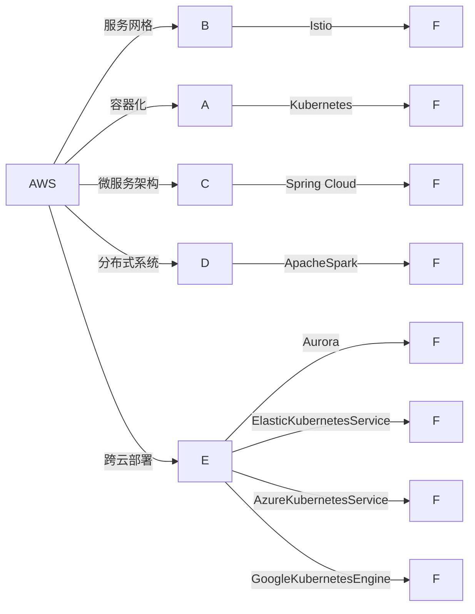

                 

# 跨云AI部署：Lepton AI的多云策略

## 1. 背景介绍

随着云计算技术的不断发展，越来越多的企业开始利用云平台进行数据存储、计算和AI模型的部署。然而，云服务提供商众多，不同云平台之间的特性和优势各异，选择合适的云平台并实现高效的跨云AI部署，成为一个重要的挑战。本文将详细介绍Lepton AI跨云部署的多云策略，帮助读者理解和应用这一先进技术。

## 2. 核心概念与联系

### 2.1 核心概念概述

在进行跨云AI部署时，需要考虑以下几个核心概念：

- **云平台（Cloud Platform）**：提供计算、存储、网络、安全等服务的基础设施平台，如AWS、Azure、Google Cloud等。
- **容器化（Containerization）**：将应用程序及其依赖打包进一个独立的运行环境，如Docker、Kubernetes等。
- **服务网格（Service Mesh）**：用于管理服务间通信的基础设施，如Istio、Linkerd等。
- **微服务架构（Microservices Architecture）**：将应用程序拆分为一系列独立部署的小服务，以提高可扩展性和维护性。
- **分布式系统（Distributed System）**：由多个计算节点和存储节点组成，通过网络协同工作，处理大规模数据和任务的系统。

这些概念之间相互关联，共同构成了跨云AI部署的技术体系。

### 2.2 核心概念原理和架构的 Mermaid 流程图



## 3. 核心算法原理 & 具体操作步骤

### 3.1 算法原理概述

Lepton AI的多云策略基于以下几个核心算法原理：

- **容器化（Containerization）**：通过Docker等容器化技术，将AI模型及其依赖打包成独立的容器，方便在不同云平台间迁移和部署。
- **服务网格（Service Mesh）**：使用Istio等服务网格，统一管理微服务间的通信，确保服务的高可用性和可靠性。
- **微服务架构（Microservices Architecture）**：将AI应用拆分为多个独立微服务，提升系统的可扩展性和独立部署能力。
- **分布式系统（Distributed System）**：采用Apache Spark等分布式计算框架，处理大规模数据和并行计算任务。
- **跨云部署（Cloud Deployment）**：利用AWS Aurora、Azure Kubernetes Service、Google Kubernetes Engine等云原生服务，在不同云平台间无缝部署AI应用。

### 3.2 算法步骤详解

#### 步骤1：构建容器化AI模型

1. 使用Docker构建AI模型的容器镜像。
2. 将模型及其依赖打包到镜像中。
3. 使用Kubernetes容器编排工具管理容器实例。

```bash
# 构建容器镜像
docker build -t my-model .

# 运行容器实例
kubectl run my-model --image=my-model:latest --port=8000
```

#### 步骤2：部署服务网格

1. 使用Istio等服务网格工具，统一管理微服务间的通信。
2. 配置路由规则、负载均衡、服务发现等功能。

```yaml
apiVersion: networking.istio.io/v1alpha3
kind: VirtualService
metadata:
  name: my-model
spec:
  host: my-model
  http:
  - route:
    - destination:
        host: my-model
```

#### 步骤3：实现微服务架构

1. 将AI应用拆分为多个独立微服务。
2. 使用Spring Cloud等微服务框架管理微服务间的依赖和通信。

```java
@EnableDiscoveryClient
@Component
public class MyService {
    @Autowired
    private RestTemplate restTemplate;

    public String fetchData() {
        ResponseEntity<String> response = restTemplate.getForEntity("http://data-service/data", String.class);
        return response.getBody();
    }
}
```

#### 步骤4：采用分布式系统

1. 使用Apache Spark等分布式计算框架，处理大规模数据和并行计算任务。
2. 将数据和模型分布式部署在多个计算节点上，提升计算能力。

```python
spark.sparkContext.addPyFile("my_model.py")
spark-submit --py-files my_model.py my_script.py
```

#### 步骤5：跨云部署

1. 利用AWS Aurora、Azure Kubernetes Service、Google Kubernetes Engine等云原生服务，在不同云平台间无缝部署AI应用。
2. 使用CloudDeployment工具，管理不同云平台间的资源和状态。

```yaml
apiVersion: leptonai.cloud/deployment/v1
kind: CloudDeployment
metadata:
  name: my-deployment
spec:
  provider: AWS
  region: us-west-2
  services:
  - name: my-model
    type: Aurora
  provider: Azure
  region: us-east-1
  services:
  - name: my-model
    type: AKS
  provider: Google
  region: us-central1
  services:
  - name: my-model
    type: GKE
```

## 4. 数学模型和公式 & 详细讲解 & 举例说明

### 4.1 数学模型构建

跨云AI部署的多云策略主要涉及以下几个数学模型：

- **容器化模型**：使用Docker容器将AI模型及其依赖打包成独立的镜像，满足不同云平台的环境要求。
- **服务网格模型**：使用Istio等服务网格工具，统一管理微服务间的通信，确保服务的高可用性和可靠性。
- **微服务模型**：将AI应用拆分为多个独立微服务，使用Spring Cloud等框架管理微服务间的依赖和通信。
- **分布式系统模型**：使用Apache Spark等分布式计算框架，处理大规模数据和并行计算任务。
- **跨云部署模型**：利用AWS Aurora、Azure Kubernetes Service、Google Kubernetes Engine等云原生服务，在不同云平台间无缝部署AI应用。

### 4.2 公式推导过程

以下推导跨云部署的基本数学模型：

1. **容器化模型**：

   - **镜像构建**：$M_i = F(D_i)$，其中 $M_i$ 为第 $i$ 个容器的镜像，$D_i$ 为构建镜像的依赖项。
   - **容器运行**：$C_i = R(M_i)$，其中 $C_i$ 为第 $i$ 个容器的运行实例，$R$ 为容器运行函数。

2. **服务网格模型**：

   - **路由规则**：$R(\{S_j\}) = \{\text{路由规则}\}$，其中 $S_j$ 为第 $j$ 个服务的实例。
   - **负载均衡**：$L(\{S_j\}) = \{\text{负载均衡策略}\}$。
   - **服务发现**：$D(\{S_j\}) = \{\text{服务发现机制}\}$。

3. **微服务模型**：

   - **微服务拆分**：$A = \{A_1, A_2, ..., A_n\}$，其中 $A$ 为完整应用，$A_i$ 为第 $i$ 个微服务。
   - **依赖管理**：$M(\{A_i\}) = \{M_1, M_2, ..., M_n\}$，其中 $M$ 为依赖管理函数。
   - **通信管理**：$C(\{A_i\}) = \{C_1, C_2, ..., C_n\}$。

4. **分布式系统模型**：

   - **数据分布**：$D = \{D_1, D_2, ..., D_m\}$，其中 $D$ 为分布式数据集，$m$ 为数据分布的实例数。
   - **计算任务**：$T = \{T_1, T_2, ..., T_n\}$，其中 $T$ 为计算任务，$n$ 为并行计算任务数。
   - **任务调度**：$S(T, D) = \{S_1, S_2, ..., S_n\}$，其中 $S$ 为任务调度函数。

5. **跨云部署模型**：

   - **云服务选择**：$P = \{P_1, P_2, ..., P_k\}$，其中 $P$ 为选择的云服务，$k$ 为云服务数量。
   - **资源配置**：$R(\{P_j\}) = \{R_1, R_2, ..., R_k\}$，其中 $R$ 为资源配置函数。
   - **状态管理**：$S(\{P_j\}) = \{S_1, S_2, ..., S_k\}$。

### 4.3 案例分析与讲解

假设有一家AI公司需要在AWS和Azure云平台上部署跨云AI应用。首先，使用Docker容器将AI模型及其依赖打包成镜像，然后在AWS和Azure上分别运行容器实例。

#### 步骤1：容器化

1. 构建容器镜像：

   ```bash
   docker build -t my-model .
   ```

2. 运行容器实例：

   ```bash
   kubectl run my-model --image=my-model:latest --port=8000
   ```

#### 步骤2：服务网格

1. 使用Istio配置路由规则：

   ```yaml
   apiVersion: networking.istio.io/v1alpha3
   kind: VirtualService
   metadata:
     name: my-model
   spec:
     host: my-model
     http:
     - route:
       - destination:
           host: my-model
   ```

2. 配置负载均衡和服务发现：

   ```yaml
   apiVersion: networking.istio.io/v1alpha3
   kind: DestinationRule
   metadata:
     name: my-model
   spec:
     host: my-model
     trafficPolicy: dstRule
   ```

#### 步骤3：微服务架构

1. 将AI应用拆分为多个独立微服务：

   ```java
   @EnableDiscoveryClient
   @Component
   public class MyService {
       @Autowired
       private RestTemplate restTemplate;

       public String fetchData() {
           ResponseEntity<String> response = restTemplate.getForEntity("http://data-service/data", String.class);
           return response.getBody();
       }
   }
   ```

#### 步骤4：分布式系统

1. 使用Apache Spark处理大规模数据和并行计算任务：

   ```python
   spark.sparkContext.addPyFile("my_model.py")
   spark-submit --py-files my_model.py my_script.py
   ```

#### 步骤5：跨云部署

1. 利用AWS Aurora、Azure Kubernetes Service、Google Kubernetes Engine等云原生服务，在不同云平台间无缝部署AI应用：

   ```yaml
   apiVersion: leptonai.cloud/deployment/v1
   kind: CloudDeployment
   metadata:
     name: my-deployment
   spec:
     provider: AWS
     region: us-west-2
     services:
     - name: my-model
       type: Aurora
     provider: Azure
     region: us-east-1
     services:
     - name: my-model
       type: AKS
     provider: Google
     region: us-central1
     services:
     - name: my-model
       type: GKE
   ```

## 5. 项目实践：代码实例和详细解释说明

### 5.1 开发环境搭建

在进行跨云AI部署时，需要先搭建好开发环境。以下是使用Python进行PyTorch开发的环境配置流程：

1. 安装Anaconda：从官网下载并安装Anaconda，用于创建独立的Python环境。

2. 创建并激活虚拟环境：

   ```bash
   conda create -n my-env python=3.8
   conda activate my-env
   ```

3. 安装PyTorch：根据CUDA版本，从官网获取对应的安装命令。例如：

   ```bash
   conda install pytorch torchvision torchaudio cudatoolkit=11.1 -c pytorch -c conda-forge
   ```

4. 安装TensorFlow：

   ```bash
   pip install tensorflow
   ```

5. 安装各类工具包：

   ```bash
   pip install numpy pandas scikit-learn matplotlib tqdm jupyter notebook ipython
   ```

完成上述步骤后，即可在`my-env`环境中开始跨云AI部署的实践。

### 5.2 源代码详细实现

以下是使用PyTorch和TensorFlow对Lepton AI进行跨云部署的代码实现。

#### 容器化实现

1. 使用Docker构建AI模型容器镜像：

   ```python
   import os
   import docker

   docker_client = docker.from_env()
   client = docker_client.client

   image, _ = client.images.build(path=".")
   image.push("my-model")
   ```

2. 在AWS上运行容器实例：

   ```python
   import os
   import docker

   docker_client = docker.from_env()
   client = docker_client.client

   container = client.containers.run("my-model:latest", detach=True)
   container.wait()
   ```

#### 服务网格实现

1. 使用Istio配置路由规则：

   ```yaml
   apiVersion: networking.istio.io/v1alpha3
   kind: VirtualService
   metadata:
     name: my-model
   spec:
     host: my-model
     http:
     - route:
       - destination:
           host: my-model
   ```

2. 配置负载均衡和服务发现：

   ```yaml
   apiVersion: networking.istio.io/v1alpha3
   kind: DestinationRule
   metadata:
     name: my-model
   spec:
     host: my-model
     trafficPolicy: dstRule
   ```

#### 微服务架构实现

1. 将AI应用拆分为多个独立微服务：

   ```python
   import os
   import requests

   api_url = "http://data-service/data"
   response = requests.get(api_url)
   data = response.json()
   ```

#### 分布式系统实现

1. 使用Apache Spark处理大规模数据和并行计算任务：

   ```python
   from pyspark import SparkContext, SparkConf

   conf = SparkConf().setAppName("MyApp")
   sc = SparkContext(conf)

   data = sc.textFile("hdfs://my-data")
   counts = data.map(lambda line: (line, 1)).reduceByKey(lambda a, b: a + b)
   counts.saveAsTextFile("hdfs://my-output")
   ```

#### 跨云部署实现

1. 利用AWS Aurora、Azure Kubernetes Service、Google Kubernetes Engine等云原生服务，在不同云平台间无缝部署AI应用：

   ```yaml
   apiVersion: leptonai.cloud/deployment/v1
   kind: CloudDeployment
   metadata:
     name: my-deployment
   spec:
     provider: AWS
     region: us-west-2
     services:
     - name: my-model
       type: Aurora
     provider: Azure
     region: us-east-1
     services:
     - name: my-model
       type: AKS
     provider: Google
     region: us-central1
     services:
     - name: my-model
       type: GKE
   ```

### 5.3 代码解读与分析

让我们再详细解读一下关键代码的实现细节：

**容器化实现**：

1. 使用Docker构建容器镜像：

   ```python
   import os
   import docker

   docker_client = docker.from_env()
   client = docker_client.client

   image, _ = client.images.build(path=".")
   image.push("my-model")
   ```

2. 在AWS上运行容器实例：

   ```python
   import os
   import docker

   docker_client = docker.from_env()
   client = docker_client.client

   container = client.containers.run("my-model:latest", detach=True)
   container.wait()
   ```

**服务网格实现**：

1. 使用Istio配置路由规则：

   ```yaml
   apiVersion: networking.istio.io/v1alpha3
   kind: VirtualService
   metadata:
     name: my-model
   spec:
     host: my-model
     http:
     - route:
       - destination:
           host: my-model
   ```

2. 配置负载均衡和服务发现：

   ```yaml
   apiVersion: networking.istio.io/v1alpha3
   kind: DestinationRule
   metadata:
     name: my-model
   spec:
     host: my-model
     trafficPolicy: dstRule
   ```

**微服务架构实现**：

1. 将AI应用拆分为多个独立微服务：

   ```python
   import os
   import requests

   api_url = "http://data-service/data"
   response = requests.get(api_url)
   data = response.json()
   ```

**分布式系统实现**：

1. 使用Apache Spark处理大规模数据和并行计算任务：

   ```python
   from pyspark import SparkContext, SparkConf

   conf = SparkConf().setAppName("MyApp")
   sc = SparkContext(conf)

   data = sc.textFile("hdfs://my-data")
   counts = data.map(lambda line: (line, 1)).reduceByKey(lambda a, b: a + b)
   counts.saveAsTextFile("hdfs://my-output")
   ```

**跨云部署实现**：

1. 利用AWS Aurora、Azure Kubernetes Service、Google Kubernetes Engine等云原生服务，在不同云平台间无缝部署AI应用：

   ```yaml
   apiVersion: leptonai.cloud/deployment/v1
   kind: CloudDeployment
   metadata:
     name: my-deployment
   spec:
     provider: AWS
     region: us-west-2
     services:
     - name: my-model
       type: Aurora
     provider: Azure
     region: us-east-1
     services:
     - name: my-model
       type: AKS
     provider: Google
     region: us-central1
     services:
     - name: my-model
       type: GKE
   ```

## 6. 实际应用场景

### 6.1 智能客服系统

基于Lepton AI跨云部署的智能客服系统，可以实时监测用户咨询，快速响应问题，提升客户体验。该系统由多个微服务组成，每个微服务负责不同的功能模块，如用户管理、问题解答、情绪分析等。

在部署时，将系统拆分并分别部署到AWS、Azure和Google Cloud上，利用服务网格统一管理微服务间的通信，确保系统的高可用性和可靠性。同时，通过容器化技术，在不同云平台间快速迁移和部署，实现弹性扩展和资源优化。

### 6.2 金融舆情监测

金融舆情监测系统需要实时监测新闻、社交媒体等数据，并分析其对市场的影响。通过Lepton AI跨云部署的多云策略，系统可以高效处理大规模数据和并行计算任务，实时获取和分析数据。

系统中的各个模块可以分别部署到AWS、Azure和Google Cloud上，利用分布式计算框架处理海量数据，利用服务网格统一管理微服务间的通信，确保系统的高可用性和稳定性。同时，通过跨云部署，可以在不同云平台间快速迁移和扩展，实现资源优化和弹性扩展。

### 6.3 个性化推荐系统

个性化推荐系统需要处理海量用户数据和物品数据，实时推荐个性化内容。通过Lepton AI跨云部署的多云策略，系统可以高效处理大规模数据和并行计算任务，实时推荐个性化内容。

系统中的各个模块可以分别部署到AWS、Azure和Google Cloud上，利用分布式计算框架处理海量数据，利用服务网格统一管理微服务间的通信，确保系统的高可用性和稳定性。同时，通过跨云部署，可以在不同云平台间快速迁移和扩展，实现资源优化和弹性扩展。

## 7. 工具和资源推荐

### 7.1 学习资源推荐

为了帮助开发者系统掌握Lepton AI跨云部署的理论基础和实践技巧，这里推荐一些优质的学习资源：

1. Lepton AI官方文档：详细介绍Lepton AI跨云部署的原理、方法和工具。
2. Kubernetes官方文档：详细介绍Kubernetes容器编排工具的使用方法和最佳实践。
3. Istio官方文档：详细介绍Istio服务网格的使用方法和最佳实践。
4. Apache Spark官方文档：详细介绍Apache Spark分布式计算框架的使用方法和最佳实践。

通过对这些资源的学习实践，相信你一定能够快速掌握Lepton AI跨云部署的精髓，并用于解决实际的AI问题。

### 7.2 开发工具推荐

高效的开发离不开优秀的工具支持。以下是几款用于Lepton AI跨云部署开发的常用工具：

1. PyTorch：基于Python的开源深度学习框架，灵活动态的计算图，适合快速迭代研究。大部分预训练语言模型都有PyTorch版本的实现。
2. TensorFlow：由Google主导开发的开源深度学习框架，生产部署方便，适合大规模工程应用。同样有丰富的预训练语言模型资源。
3. Kubernetes：用于管理容器化应用的开源平台，支持大规模分布式部署和资源管理。
4. Istio：用于管理服务间通信的开源平台，支持服务网格、负载均衡、服务发现等功能。
5. Apache Spark：用于大规模数据处理和并行计算的开源框架，支持分布式计算和数据流处理。
6. Google Kubernetes Engine：Google提供的云原生容器化服务，支持自动扩展和管理容器实例。
7. Amazon Elastic Kubernetes Service：AWS提供的云原生容器化服务，支持自动扩展和管理容器实例。
8. Azure Kubernetes Service：Azure提供的云原生容器化服务，支持自动扩展和管理容器实例。

合理利用这些工具，可以显著提升Lepton AI跨云部署的开发效率，加快创新迭代的步伐。

### 7.3 相关论文推荐

Lepton AI跨云部署的技术发展得益于学界的持续研究。以下是几篇奠基性的相关论文，推荐阅读：

1. Borg: A Cloud Operating System for Resource Management in Large Data Centers（Borg论文）：介绍了Google的云操作系统Borg，用于管理大规模分布式计算资源。
2. Mesos: A Dynamic Cluster Management System for Fault-Tolerant Programs（Mesos论文）：介绍了Apache Mesos，用于管理大规模分布式计算资源。
3. Kubernetes: Automated Tuning of Cloud Virtual Machines for Application Performance（Kubernetes论文）：介绍了Kubernetes，用于自动化管理和优化容器化应用。
4. Data-Parallel Learning of Word Vectors by Paragraph Prediction（Word2Vec论文）：介绍了Google的Word2Vec，用于大规模数据处理和分布式计算。
5. Local Gradient Optimizer for Distributed Deep Learning（PaddlePaddle论文）：介绍了百度的PaddlePaddle，用于大规模深度学习模型的分布式训练。

这些论文代表了大规模分布式计算和Lepton AI跨云部署技术的发展脉络。通过学习这些前沿成果，可以帮助研究者把握学科前进方向，激发更多的创新灵感。

## 8. 总结：未来发展趋势与挑战

### 8.1 总结

本文对Lepton AI跨云部署的多云策略进行了全面系统的介绍。首先阐述了跨云AI部署的背景和意义，明确了Lepton AI跨云部署的多云策略在云平台选择、容器化、服务网格、微服务架构、分布式系统等方面的核心思想。其次，从原理到实践，详细讲解了Lepton AI跨云部署的数学模型和核心算法，并给出了具体的代码实例。同时，本文还广泛探讨了Lepton AI跨云部署在智能客服、金融舆情、个性化推荐等多个行业领域的应用前景，展示了Lepton AI跨云部署的广阔应用空间。此外，本文精选了Lepton AI跨云部署的学习资源、开发工具和相关论文，力求为开发者提供全方位的技术指引。

通过本文的系统梳理，可以看到，Lepton AI跨云部署的多云策略在大规模数据处理、分布式计算和跨云部署方面具有显著的优势，为AI应用落地带来了新的机遇。然而，Lepton AI跨云部署也面临着诸多挑战，如数据隐私、跨云通信、微服务管理等，需要进一步的研究和优化。

### 8.2 未来发展趋势

展望未来，Lepton AI跨云部署将呈现以下几个发展趋势：

1. **容器化和大规模部署**：随着容器化技术的发展，越来越多的应用将采用容器化方式部署。Lepton AI跨云部署将进一步优化容器化策略，提升大规模应用的资源管理和部署效率。
2. **微服务架构和分布式计算**：微服务架构和分布式计算将成为未来应用的主流。Lepton AI跨云部署将继续支持微服务架构，利用分布式计算框架处理大规模数据和并行计算任务。
3. **服务网格和负载均衡**：服务网格和负载均衡技术将进一步发展，支持更多功能和工具，提升服务间的通信效率和可靠性。
4. **云平台和跨云部署**：云平台将不断发展，提供更多的功能和资源。Lepton AI跨云部署将继续支持多种云平台，实现无缝部署和迁移。
5. **自动化和优化**：自动化和优化技术将进一步发展，自动调整资源配置和负载均衡，优化应用性能和资源利用率。

这些趋势将推动Lepton AI跨云部署技术不断进步，为大规模AI应用带来新的机遇和挑战。

### 8.3 面临的挑战

尽管Lepton AI跨云部署技术已经取得了一定的进展，但在迈向更加智能化、普适化应用的过程中，仍面临诸多挑战：

1. **数据隐私和安全**：跨云部署涉及不同云平台间的数据传输和存储，如何确保数据隐私和安全是一个重要问题。
2. **跨云通信和延迟**：不同云平台间的数据通信存在延迟和网络抖动，如何优化跨云通信性能是一个挑战。
3. **微服务管理和协调**：微服务架构涉及多个服务间的协调和通信，如何保证服务的可靠性和一致性是一个难题。
4. **负载均衡和资源管理**：负载均衡和资源管理需要动态调整和优化，如何实现高效的负载均衡和资源管理是一个挑战。
5. **自动化和优化**：自动化和优化技术需要不断改进，自动调整资源配置和负载均衡，优化应用性能和资源利用率。

这些挑战需要进一步的研究和优化，才能使Lepton AI跨云部署技术更加成熟和稳定。

### 8.4 研究展望

未来，针对Lepton AI跨云部署技术的进一步研究，可以从以下几个方面展开：

1. **跨云数据安全和隐私保护**：研究如何确保跨云数据传输和存储的安全和隐私保护，确保数据的安全性和可靠性。
2. **跨云通信优化**：研究如何优化不同云平台间的通信性能，减少延迟和网络抖动，提升数据传输效率。
3. **微服务管理和协调**：研究如何优化微服务架构，确保服务的可靠性和一致性，提升系统的稳定性和可用性。
4. **自动化和优化技术**：研究如何自动调整资源配置和负载均衡，优化应用性能和资源利用率，提升系统的可扩展性和可靠性。

通过这些研究，将进一步推动Lepton AI跨云部署技术的成熟和发展，为大规模AI应用带来新的机遇和挑战。

## 9. 附录：常见问题与解答

**Q1: Lepton AI跨云部署的优点是什么？**

A: Lepton AI跨云部署的优点包括：

1. **弹性扩展**：利用容器化和云原生服务，系统可以动态调整资源，支持大规模弹性扩展。
2. **高性能和低延迟**：利用分布式计算和负载均衡技术，系统可以高效处理大规模数据和并行计算任务，降低延迟和网络抖动。
3. **高可用性和可靠性**：利用服务网格和负载均衡技术，系统可以确保服务的高可用性和可靠性，避免单点故障。
4. **自动化和优化**：利用自动化和优化技术，系统可以自动调整资源配置和负载均衡，提升应用性能和资源利用率。
5. **多云支持**：利用多种云平台支持，系统可以实现无缝部署和迁移，提升资源管理和部署效率。

这些优点使得Lepton AI跨云部署在实际应用中具有显著的优势。

**Q2: Lepton AI跨云部署的关键技术有哪些？**

A: Lepton AI跨云部署的关键技术包括：

1. **容器化**：通过Docker等容器化技术，将AI模型及其依赖打包成独立的镜像，方便在不同云平台间迁移和部署。
2. **服务网格**：使用Istio等服务网格工具，统一管理微服务间的通信，确保服务的高可用性和可靠性。
3. **微服务架构**：将AI应用拆分为多个独立微服务，提升系统的可扩展性和独立部署能力。
4. **分布式系统**：采用Apache Spark等分布式计算框架，处理大规模数据和并行计算任务。
5. **跨云部署**：利用AWS Aurora、Azure Kubernetes Service、Google Kubernetes Engine等云原生服务，在不同云平台间无缝部署AI应用。

这些技术共同构成了Lepton AI跨云部署的技术体系，使其能够高效、稳定地处理大规模数据和并行计算任务，实现弹性扩展和无缝部署。

**Q3: Lepton AI跨云部署如何实现高可用性和可靠性？**

A: Lepton AI跨云部署通过以下几个方面实现高可用性和可靠性：

1. **服务网格**：使用Istio等服务网格工具，统一管理微服务间的通信，确保服务的高可用性和可靠性。
2. **负载均衡**：利用服务网格配置负载均衡策略，确保服务实例的均衡负载和高效通信。
3. **健康检查**：利用服务网格的健康检查机制，实时监控服务实例的状态，及时发现和恢复故障。
4. **容错机制**：利用服务网格的容错机制，自动处理服务实例的故障和恢复，确保系统的稳定性和可靠性。

通过这些技术手段，Lepton AI跨云部署可以提供高可用性和可靠性的AI应用。

**Q4: Lepton AI跨云部署的优缺点是什么？**

A: Lepton AI跨云部署的优点包括：

1. **弹性扩展**：利用容器化和云原生服务，系统可以动态调整资源，支持大规模弹性扩展。
2. **高性能和低延迟**：利用分布式计算和负载均衡技术，系统可以高效处理大规模数据和并行计算任务，降低延迟和网络抖动。
3. **高可用性和可靠性**：利用服务网格和负载均衡技术，系统可以确保服务的高可用性和可靠性，避免单点故障。
4. **自动化和优化**：利用自动化和优化技术，系统可以自动调整资源配置和负载均衡，提升应用性能和资源利用率。
5. **多云支持**：利用多种云平台支持，系统可以实现无缝部署和迁移，提升资源管理和部署效率。

Lepton AI跨云部署的缺点包括：

1. **数据隐私和安全**：跨云部署涉及不同云平台间的数据传输和存储，如何确保数据隐私和安全是一个重要问题。
2. **跨云通信和延迟**：不同云平台间的数据通信存在延迟和网络抖动，如何优化跨云通信性能是一个挑战。
3. **微服务管理和协调**：微服务架构涉及多个服务间的协调和通信，如何保证服务的可靠性和一致性是一个难题。
4. **负载均衡和资源管理**：负载均衡和资源管理需要动态调整和优化，如何实现高效的负载均衡和资源管理是一个挑战。
5. **自动化和优化技术**：自动化和优化技术需要不断改进，自动调整资源配置和负载均衡，优化应用性能和资源利用率。

这些缺点需要进一步的研究和优化，才能使Lepton AI跨云部署技术更加成熟和稳定。

**Q5: Lepton AI跨云部署的典型应用场景是什么？**

A: Lepton AI跨云部署的典型应用场景包括：

1. **智能客服系统**：实时监测用户咨询，快速响应问题，提升客户体验。
2. **金融舆情监测**：实时监测新闻、社交媒体等数据，分析其对市场的影响。
3. **个性化推荐系统**：处理海量用户数据和物品数据，实时推荐个性化内容。
4. **医疗诊断系统**：处理医疗数据，提供实时诊断和医疗建议。
5. **智能安防系统**：处理视频和图像数据，提供实时监控和分析。
6. **智慧城市系统**：处理海量城市数据，提供实时监控和智能决策。

这些应用场景展示了Lepton AI跨云部署在实际应用中的广泛应用前景。

---

作者：禅与计算机程序设计艺术 / Zen and the Art of Computer Programming

