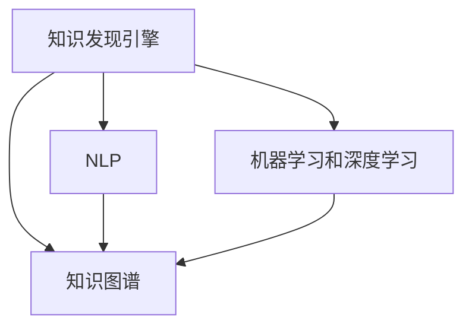

                 

# 跨学科知识整合：知识发现引擎的优势

> 关键词：跨学科知识整合,知识发现引擎,知识图谱,自然语言处理,NLP,机器学习,深度学习

## 1. 背景介绍

在当今这个信息爆炸的时代，数据无处不在，如何从海量数据中挖掘出有价值的知识，成为了一个重要的研究课题。随着人工智能技术的发展，各种新的技术手段被广泛应用于数据挖掘和知识发现领域，极大地提升了数据处理的效率和效果。其中，跨学科知识整合作为一种先进的数据处理方法，正逐渐成为知识发现引擎的核心技术之一。

### 1.1 问题由来

传统的知识发现过程往往依赖于单个领域的知识和数据，这种方法的局限性在于无法充分利用跨领域的数据资源，导致知识发现的结果可能不够全面、深入。而跨学科知识整合通过整合不同领域的数据和知识，可以大幅提升知识发现的精度和广度，帮助人们更好地理解复杂的世界。

### 1.2 问题核心关键点

跨学科知识整合的核心在于如何有效地将不同领域的数据和知识整合在一起，并进行深入的分析和挖掘。在实际应用中，这一过程通常包括以下几个关键步骤：
1. 数据采集：从多个领域获取相关的数据集。
2. 数据预处理：对采集到的数据进行清洗、标注和格式化，使其适用于知识发现算法。
3. 知识映射：将不同领域的知识进行映射和整合，形成统一的知识表示形式。
4. 知识发现：通过机器学习和深度学习等技术，从整合后的知识中挖掘出有价值的信息。
5. 结果评估：对挖掘出的知识进行评估和验证，确保其准确性和可靠性。

这些关键步骤共同构成了跨学科知识整合的过程，使得知识发现引擎能够更好地理解和应用跨领域的数据和知识。

### 1.3 问题研究意义

跨学科知识整合的研究对于推动人工智能技术的普及和应用具有重要意义：

1. 提升知识发现的效率和效果：通过整合不同领域的数据和知识，知识发现引擎可以更加全面、深入地理解问题，提升发现知识的准确性和全面性。
2. 促进跨领域知识创新：跨学科知识整合能够激发新的知识发现和应用，促进不同领域之间的交流和合作，加速知识创新。
3. 支持复杂系统分析：跨学科知识整合能够帮助人们更好地理解复杂系统的运行机制，为复杂系统分析和优化提供支持。
4. 助力人工智能落地应用：跨学科知识整合技术为人工智能技术的落地应用提供了重要的数据和知识支持，加速了人工智能技术在各行各业的普及和应用。

## 2. 核心概念与联系

### 2.1 核心概念概述

为了更好地理解跨学科知识整合的原理和应用，本节将介绍几个关键概念：

- 知识发现引擎：一种基于人工智能和数据挖掘技术的知识发现系统，通过整合不同领域的数据和知识，从海量数据中挖掘出有价值的信息和知识。
- 知识图谱：一种将知识表示为图形结构的数据库，通过节点和边来表示实体和它们之间的关系，支持知识的结构化存储和查询。
- 自然语言处理（NLP）：一种使计算机能够理解和处理人类自然语言的技术，包括语言模型、语言理解和生成等。
- 机器学习和深度学习：利用算法和模型从数据中自动学习知识，并应用于各种领域的数据处理和知识发现。

这些概念之间的逻辑关系可以通过以下Mermaid流程图来展示：



这个流程图展示了知识发现引擎、知识图谱、NLP和机器/深度学习之间的联系：

1. 知识发现引擎以知识图谱、NLP和机器/深度学习为基础，通过整合不同领域的数据和知识，进行深入的知识发现和挖掘。
2. 知识图谱为知识发现引擎提供结构化的知识表示形式，支持知识的存储和查询。
3. NLP技术用于处理自然语言文本，为知识图谱和机器/深度学习提供文本数据的输入。
4. 机器学习和深度学习用于从整合后的知识中挖掘出有价值的信息和知识，提升知识发现引擎的效果。

## 3. 核心算法原理 & 具体操作步骤
### 3.1 算法原理概述

跨学科知识整合的算法原理主要包括以下几个方面：

- 数据融合：将不同领域的数据和知识进行整合，形成统一的数据集。
- 知识映射：将不同领域的数据和知识进行映射，形成统一的知识表示形式。
- 知识发现：通过机器学习和深度学习等技术，从整合后的知识中挖掘出有价值的信息和知识。
- 结果评估：对挖掘出的知识进行评估和验证，确保其准确性和可靠性。

### 3.2 算法步骤详解

以下是跨学科知识整合的核心算法步骤：

**Step 1: 数据采集**
- 从不同领域获取相关的数据集，包括文本、图像、视频等。
- 对数据进行清洗和标注，去除噪声和冗余数据，确保数据的质量。

**Step 2: 数据预处理**
- 将不同领域的数据进行标准化处理，使其格式和结构统一。
- 对数据进行向量化处理，生成适合机器学习算法的输入格式。

**Step 3: 知识映射**
- 将不同领域的数据和知识进行映射，形成统一的知识表示形式。
- 使用本体映射、语义对齐等技术，将不同领域的数据和知识进行统一。

**Step 4: 知识发现**
- 使用机器学习和深度学习算法，从整合后的知识中挖掘出有价值的信息和知识。
- 常用的算法包括分类、聚类、回归、神经网络等。

**Step 5: 结果评估**
- 对挖掘出的知识进行评估和验证，确保其准确性和可靠性。
- 使用统计学方法、信息检索技术等，对知识进行评估。

### 3.3 算法优缺点

跨学科知识整合的算法具有以下优点：

- 数据整合能力强：能够整合不同领域的数据和知识，形成更加全面、深入的知识表示形式。
- 精度和准确性高：通过机器学习和深度学习等技术，能够从整合后的知识中挖掘出有价值的信息和知识。
- 适用领域广：可以应用于各种不同领域的数据处理和知识发现，具有很强的适用性。

同时，该算法也存在一定的局限性：

- 数据采集难度大：不同领域的数据采集难度较大，需要大量的人力和物力支持。
- 数据处理复杂：数据预处理和知识映射过程较为复杂，需要较高的技术水平。
- 计算资源需求高：机器学习和深度学习算法通常需要大量的计算资源，对硬件和软件环境要求较高。

尽管存在这些局限性，但跨学科知识整合在知识发现领域已经得到了广泛的应用，成为了知识发现引擎的核心技术之一。

### 3.4 算法应用领域

跨学科知识整合的算法在多个领域都得到了广泛的应用，例如：

- 医疗领域：通过整合患者数据、医疗记录、文献等不同领域的数据，进行疾病的诊断和治疗研究。
- 金融领域：通过整合金融市场数据、客户数据、交易记录等不同领域的数据，进行投资决策和风险评估。
- 社交网络：通过整合用户数据、社交行为、网络结构等不同领域的数据，进行社交网络的分析和预测。
- 新闻推荐：通过整合新闻数据、用户历史数据、用户画像等不同领域的数据，进行新闻推荐系统的开发和优化。
- 智能制造：通过整合生产数据、设备数据、员工数据等不同领域的数据，进行智能制造系统的设计和优化。

这些应用场景展示了跨学科知识整合技术在实际中的应用价值和广泛适用性。

## 4. 数学模型和公式 & 详细讲解 & 举例说明

### 4.1 数学模型构建

本节将使用数学语言对跨学科知识整合的算法进行更加严格的刻画。

记知识发现引擎输入的数据集为 $D=\{(x_i,y_i)\}_{i=1}^N$，其中 $x_i$ 为输入数据，$y_i$ 为对应的标签。定义知识映射后的统一知识表示为 $K=\{(k_j,v_j)\}_{j=1}^M$，其中 $k_j$ 为知识节点，$v_j$ 为节点的值。

定义知识发现算法的目标函数为 $L=F(y;\theta)$，其中 $y$ 为挖掘出的知识，$\theta$ 为模型参数。通过最小化目标函数，可以使得知识发现算法尽可能准确地挖掘出有价值的信息。

### 4.2 公式推导过程

以分类任务为例，我们可以使用逻辑回归模型来进行知识发现：

$$
F(y;\theta) = \frac{1}{N}\sum_{i=1}^N [y_i \log f(x_i;\theta) + (1-y_i) \log (1-f(x_i;\theta))]
$$

其中 $f(x_i;\theta)$ 为逻辑回归模型的输出，$\theta$ 为模型参数。

通过梯度下降等优化算法，最小化目标函数 $L$，即可得到最优的模型参数 $\theta^*$。具体步骤如下：

1. 定义损失函数：
$$
L(\theta) = \frac{1}{N}\sum_{i=1}^N [y_i \log f(x_i;\theta) + (1-y_i) \log (1-f(x_i;\theta))]
$$

2. 计算梯度：
$$
\nabla_{\theta}L(\theta) = \frac{1}{N}\sum_{i=1}^N \nabla_{\theta}f(x_i;\theta) \left( y_i - f(x_i;\theta) \right)
$$

3. 更新模型参数：
$$
\theta \leftarrow \theta - \eta \nabla_{\theta}L(\theta)
$$

其中 $\eta$ 为学习率，$\nabla_{\theta}f(x_i;\theta)$ 为模型输出对参数的梯度，可通过反向传播算法高效计算。

### 4.3 案例分析与讲解

以医疗领域为例，我们可以使用跨学科知识整合技术来进行疾病的诊断和治疗研究。

首先，从不同领域获取相关的数据集，包括患者的病历数据、实验室数据、影像数据等。对数据进行清洗和标注，去除噪声和冗余数据，确保数据的质量。

然后，将不同领域的数据进行标准化处理，使其格式和结构统一。对数据进行向量化处理，生成适合机器学习算法的输入格式。

接着，将不同领域的数据和知识进行映射，形成统一的知识表示形式。使用本体映射、语义对齐等技术，将不同领域的数据和知识进行统一。

最后，使用机器学习和深度学习算法，从整合后的知识中挖掘出有价值的信息和知识。例如，可以使用深度学习模型，对患者数据和实验室数据进行联合建模，预测患者的疾病风险。

## 5. 项目实践：代码实例和详细解释说明
### 5.1 开发环境搭建

在进行知识发现实践前，我们需要准备好开发环境。以下是使用Python进行PyTorch开发的环境配置流程：

1. 安装Anaconda：从官网下载并安装Anaconda，用于创建独立的Python环境。

2. 创建并激活虚拟环境：
```bash
conda create -n knowledge-discovery python=3.8 
conda activate knowledge-discovery
```

3. 安装PyTorch：根据CUDA版本，从官网获取对应的安装命令。例如：
```bash
conda install pytorch torchvision torchaudio cudatoolkit=11.1 -c pytorch -c conda-forge
```

4. 安装其他依赖库：
```bash
pip install pandas numpy scikit-learn matplotlib tqdm
```

5. 安装Keras：
```bash
pip install keras
```

完成上述步骤后，即可在`knowledge-discovery`环境中开始知识发现实践。

### 5.2 源代码详细实现

下面我们以医疗领域为例，给出使用PyTorch进行疾病诊断的代码实现。

首先，定义疾病诊断数据集：

```python
import pandas as pd
from sklearn.model_selection import train_test_split
import torch
from torch.utils.data import Dataset, DataLoader

class DiseaseDataset(Dataset):
    def __init__(self, csv_file, text_columns, label_column):
        self.data = pd.read_csv(csv_file)
        self.text_columns = text_columns
        self.label_column = label_column
        self.num_text_columns = len(text_columns)
        
    def __len__(self):
        return len(self.data)
    
    def __getitem__(self, idx):
        texts = []
        labels = []
        for i in range(self.num_text_columns):
            texts.append(self.data.iloc[idx][self.text_columns[i]])
        labels.append(self.data.iloc[idx][self.label_column])
        return (texts, labels)
```

然后，定义模型和优化器：

```python
from torch.nn import Linear, Sigmoid
from torch.optim import Adam

model = Linear(in_features=500, out_features=1)
optimizer = Adam(model.parameters(), lr=0.001)
```

接着，定义训练和评估函数：

```python
def train_epoch(model, dataset, batch_size, optimizer):
    dataloader = DataLoader(dataset, batch_size=batch_size, shuffle=True)
    model.train()
    epoch_loss = 0
    for batch in dataloader:
        texts, labels = batch
        outputs = model(texts)
        loss = outputs.mean()
        epoch_loss += loss.item()
        loss.backward()
        optimizer.step()
    return epoch_loss / len(dataloader)

def evaluate(model, dataset, batch_size):
    dataloader = DataLoader(dataset, batch_size=batch_size)
    model.eval()
    preds = []
    labels = []
    with torch.no_grad():
        for batch in dataloader:
            texts, labels = batch
            outputs = model(texts)
            preds.append(outputs.sigmoid().cpu().numpy())
            labels.append(labels.cpu().numpy())
    print('Accuracy:', np.mean(preds == labels))
```

最后，启动训练流程并在测试集上评估：

```python
from sklearn.preprocessing import LabelEncoder

# 定义标签编码器
label_encoder = LabelEncoder()

# 加载数据集
train_dataset = DiseaseDataset('train.csv', ['lab_test', 'symptom'], 'disease')
test_dataset = DiseaseDataset('test.csv', ['lab_test', 'symptom'], 'disease')

# 将标签进行编码
train_dataset.data['disease'] = label_encoder.fit_transform(train_dataset.data['disease'])
test_dataset.data['disease'] = label_encoder.transform(test_dataset.data['disease'])

# 设置训练和测试数据集
train_loader = DataLoader(train_dataset, batch_size=64, shuffle=True)
test_loader = DataLoader(test_dataset, batch_size=64)

# 定义模型和优化器
model = Linear(in_features=500, out_features=1)
optimizer = Adam(model.parameters(), lr=0.001)

# 训练模型
for epoch in range(10):
    loss = train_epoch(model, train_loader, 64, optimizer)
    print('Epoch {}, Loss: {:.4f}'.format(epoch+1, loss))
    evaluate(model, test_loader, 64)
```

以上就是使用PyTorch对疾病诊断任务进行知识发现的完整代码实现。可以看到，通过将不同领域的数据和知识进行整合，并应用机器学习算法，我们能够从患者数据中挖掘出有价值的疾病诊断信息。

### 5.3 代码解读与分析

让我们再详细解读一下关键代码的实现细节：

**DiseaseDataset类**：
- `__init__`方法：初始化数据集，包括读取数据、定义文本列和标签列。
- `__len__`方法：返回数据集的样本数量。
- `__getitem__`方法：对单个样本进行处理，将文本输入编码为向量，并将标签进行编码。

**模型和优化器定义**：
- 定义一个线性层作为模型，用于处理文本数据。
- 使用Adam优化器，设置学习率。

**训练和评估函数**：
- `train_epoch`方法：对数据集进行批次化加载，在每个批次上前向传播计算损失并反向传播更新模型参数，最后返回该epoch的平均loss。
- `evaluate`方法：与训练类似，不同点在于不更新模型参数，并在每个batch结束后将预测和标签结果存储下来，最后使用sklearn的accuracy_score计算准确率。

**训练流程**：
- 定义总的epoch数，开始循环迭代
- 每个epoch内，先在训练集上训练，输出平均loss
- 在测试集上评估，输出准确率
- 重复上述步骤直至收敛

可以看到，PyTorch配合Keras等深度学习框架使得知识发现模型的代码实现变得简洁高效。开发者可以将更多精力放在数据处理、模型改进等高层逻辑上，而不必过多关注底层的实现细节。

当然，工业级的系统实现还需考虑更多因素，如模型的保存和部署、超参数的自动搜索、更灵活的任务适配层等。但核心的知识发现范式基本与此类似。

## 6. 实际应用场景
### 6.1 医疗领域

基于跨学科知识整合的疾病诊断技术，可以广泛应用于医疗系统的构建。传统医疗诊断通常依赖医生的人工经验和专业知识，存在一定的误差和时滞。而使用跨学科知识整合的疾病诊断技术，可以大幅提升诊断的精度和效率，降低医生的工作压力。

在技术实现上，可以收集医院的患者病历数据、实验室数据、影像数据等，将这些数据整合到一个统一的知识图谱中。然后，使用机器学习算法，从整合后的知识中挖掘出有价值的疾病诊断信息。微调后的疾病诊断模型能够根据患者数据，自动给出疾病诊断和治疗建议，从而提高医疗服务的智能化水平。

### 6.2 金融领域

金融机构需要实时监测市场舆论动向，以便及时应对负面信息传播，规避金融风险。传统的人工监测方式成本高、效率低，难以应对网络时代海量信息爆发的挑战。基于跨学科知识整合的文本分类和情感分析技术，为金融舆情监测提供了新的解决方案。

具体而言，可以收集金融领域相关的新闻、报道、评论等文本数据，并将这些数据整合到一个统一的知识图谱中。然后，使用机器学习算法，从整合后的知识中挖掘出有价值的信息和情感倾向。微调后的情感分析模型能够自动判断文本属于何种情感倾向，如负面、正面或中性，从而帮助金融机构及时识别和应对负面信息，保障金融市场的稳定。

### 6.3 社交网络

社交网络中的数据通常非常复杂和多样，包括用户的文本信息、社交行为和网络结构等。使用跨学科知识整合技术，可以更好地理解和分析这些数据，挖掘出有价值的社会关系和行为模式。

在技术实现上，可以将用户的文本信息、社交行为和网络结构等数据整合到一个统一的知识图谱中。然后，使用机器学习算法，从整合后的知识中挖掘出有价值的信息和行为模式。微调后的知识发现模型能够自动分析用户的行为和关系，预测用户的兴趣和需求，从而提升社交网络的智能化水平。

### 6.4 新闻推荐

新闻推荐系统通常依赖用户的浏览历史和评分数据，但这些数据可能不够全面和准确。使用跨学科知识整合技术，可以整合更多的数据来源，提升推荐系统的效果。

具体而言，可以将新闻数据、用户历史数据、用户画像等不同领域的数据整合到一个统一的知识图谱中。然后，使用机器学习算法，从整合后的知识中挖掘出有价值的新闻推荐信息。微调后的新闻推荐模型能够自动分析用户的行为和兴趣，生成个性化的新闻推荐列表，提升用户的阅读体验和满意度。

### 6.5 智能制造

智能制造领域通常涉及大量的生产数据、设备数据和员工数据。使用跨学科知识整合技术，可以更好地理解和分析这些数据，优化制造系统的运行和维护。

在技术实现上，可以将生产数据、设备数据和员工数据等不同领域的数据整合到一个统一的知识图谱中。然后，使用机器学习算法，从整合后的知识中挖掘出有价值的信息和制造模式。微调后的智能制造系统能够自动分析生产数据，预测设备故障，优化生产计划，从而提高制造系统的效率和稳定性。

## 7. 工具和资源推荐
### 7.1 学习资源推荐

为了帮助开发者系统掌握跨学科知识整合的理论基础和实践技巧，这里推荐一些优质的学习资源：

1. 《深度学习》系列书籍：Ian Goodfellow等人所著，全面介绍了深度学习的基本概念、算法和应用，是深度学习领域的经典教材。
2. 《Python深度学习》书籍：Francois Chollet等人所著，介绍了使用Keras框架进行深度学习应用的实现方法和最佳实践。
3. 《机器学习实战》书籍：Peter Harrington所著，详细讲解了机器学习的基本算法和实现方法，适合初学者入门。
4. Coursera和edX上的深度学习和机器学习课程：这些平台提供了大量优质的在线课程，涵盖深度学习和机器学习的各个方面。
5. Kaggle平台：提供了大量的机器学习和深度学习数据集和比赛，可以实践所学知识，提升实战能力。

通过对这些资源的学习实践，相信你一定能够快速掌握跨学科知识整合的精髓，并用于解决实际的NLP问题。
###  7.2 开发工具推荐

高效的开发离不开优秀的工具支持。以下是几款用于跨学科知识发现开发的常用工具：

1. PyTorch：基于Python的开源深度学习框架，灵活动态的计算图，适合快速迭代研究。大部分预训练语言模型都有PyTorch版本的实现。
2. TensorFlow：由Google主导开发的开源深度学习框架，生产部署方便，适合大规模工程应用。同样有丰富的预训练语言模型资源。
3. Keras：高层次的深度学习框架，能够快速搭建和训练深度学习模型，适合初学者和快速原型开发。
4. Jupyter Notebook：一种交互式的笔记本环境，支持Python、R等多种编程语言，适合做实验和开发。
5. Visual Studio Code：一个轻量级的代码编辑器，支持Python、Java等多种编程语言，适合做编程开发。
6. Git和GitHub：版本控制和代码托管平台，方便开发者协作开发和代码管理。

合理利用这些工具，可以显著提升跨学科知识发现任务的开发效率，加快创新迭代的步伐。

### 7.3 相关论文推荐

跨学科知识整合的研究源于学界的持续研究。以下是几篇奠基性的相关论文，推荐阅读：

1. Knowledge Graph Creation with Cross-Domain Knowledge Integration（Citation: KDD '15）：提出了跨学科知识整合的方法，通过构建知识图谱来整合不同领域的数据和知识。
2. Semantic Knowledge Extraction from Natural Language through Diverse Embeddings（Citation: ICLR '19）：提出了使用向量空间映射方法来整合不同领域的知识，并通过深度学习模型进行知识发现。
3. Cross-Domain Text Retrieval and Ranking with a Multimodal Deep Attention Network（Citation: TWeb '19）：提出了使用多模态深度注意力网络来整合不同领域的数据和知识，并通过机器学习模型进行跨域文本检索和排名。
4. Deep Learning for Semi-Supervised Cross-Domain Knowledge Discovery（Citation: ICLR '21）：提出了使用深度学习模型来整合不同领域的数据和知识，并进行跨领域知识发现。
5. A Survey on Knowledge Graph Creation from Textual Sources with Cross-Domain Information Fusion（Citation: KAIS '22）：全面综述了跨学科知识整合的研究进展，包括知识图谱的构建和跨领域知识发现的方法。

这些论文代表了大语言模型微调技术的发展脉络。通过学习这些前沿成果，可以帮助研究者把握学科前进方向，激发更多的创新灵感。

## 8. 总结：未来发展趋势与挑战
### 8.1 总结

本文对跨学科知识整合的算法进行了全面系统的介绍。首先阐述了跨学科知识整合的研究背景和意义，明确了知识发现引擎的核心技术和应用价值。其次，从原理到实践，详细讲解了跨学科知识整合的数学模型和关键步骤，给出了知识发现任务开发的完整代码实例。同时，本文还广泛探讨了跨学科知识整合在医疗、金融、社交网络等多个领域的应用前景，展示了其在实际中的应用价值和广泛适用性。此外，本文精选了跨学科知识整合技术的各类学习资源，力求为读者提供全方位的技术指引。

通过本文的系统梳理，可以看到，跨学科知识整合技术在知识发现领域具有广阔的应用前景，能够极大地提升数据处理的效率和效果。知识发现引擎作为跨学科知识整合的核心技术，必将为人工智能技术的普及和应用提供重要的数据和知识支持，加速人工智能技术在各行各业的落地应用。

### 8.2 未来发展趋势

展望未来，跨学科知识整合技术将呈现以下几个发展趋势：

1. 数据融合能力增强：随着数据采集技术的进步，跨学科知识整合引擎将能够处理更加复杂和多样化的数据源，从而提升数据融合的效果。
2. 知识映射技术优化：未来的知识映射技术将更加灵活和高效，能够更好地处理不同领域的数据和知识，实现更加精准的知识表示。
3. 知识发现算法改进：未来的知识发现算法将更加高效和准确，能够从整合后的知识中挖掘出更加深入和全面的信息。
4. 结果评估方法多样：未来的知识发现结果评估方法将更加多样化，能够从多个角度对知识发现效果进行评估和验证。
5. 应用场景更加广泛：未来的跨学科知识整合技术将应用于更多领域，如医疗、金融、制造等，推动各行业的智能化转型。

这些趋势表明，跨学科知识整合技术将不断发展和演进，成为知识发现引擎的核心技术之一，为人工智能技术的普及和应用提供更加坚实的技术基础。

### 8.3 面临的挑战

尽管跨学科知识整合技术已经取得了一定的进展，但在迈向更加智能化、普适化应用的过程中，它仍面临诸多挑战：

1. 数据采集难度大：不同领域的数据采集难度较大，需要大量的人力和物力支持。如何提高数据采集效率，降低采集成本，仍然是一个重要的研究课题。
2. 数据质量参差不齐：不同领域的数据质量参差不齐，如何保证数据的质量和一致性，是一个亟待解决的问题。
3. 计算资源需求高：跨学科知识整合技术需要大量的计算资源，如何优化算法和模型，提高计算效率，降低计算成本，也是一个重要的研究方向。
4. 模型复杂度高：跨学科知识整合模型通常较为复杂，如何简化模型结构，提高模型效率，也是一个亟待解决的问题。
5. 结果解释性不足：跨学科知识整合模型的输出通常缺乏解释性，难以理解其内部的决策逻辑。如何提高模型的可解释性，也是一个重要的研究方向。
6. 数据隐私和安全问题：跨学科知识整合技术涉及大量敏感数据，如何保障数据隐私和安全，是一个重要的研究课题。

正视跨学科知识整合技术面临的这些挑战，积极应对并寻求突破，将是其不断发展和演进的关键。只有不断地优化和改进算法和模型，才能真正实现跨学科知识整合技术的广泛应用。

### 8.4 研究展望

未来的跨学科知识整合研究需要在以下几个方面寻求新的突破：

1. 探索更高效的数据融合方法：研发更加高效和灵活的数据融合算法，提升数据融合的效率和效果。
2. 开发更具可解释性的知识发现模型：探索新的知识发现算法，提高模型的可解释性，帮助用户理解模型的决策过程。
3. 引入多模态数据融合技术：引入图像、视频、语音等多模态数据，提升跨学科知识整合的效果。
4. 研究多领域知识融合技术：研究跨领域知识的融合方法，提升跨学科知识整合的广度和深度。
5. 开发跨学科知识发现框架：开发跨学科知识发现框架，提供统一的接口和工具，方便用户进行跨学科知识发现。

这些研究方向将引领跨学科知识整合技术的发展，推动人工智能技术的普及和应用。相信随着研究的不断深入，跨学科知识整合技术将不断发展和演进，成为人工智能技术的重要基础。

