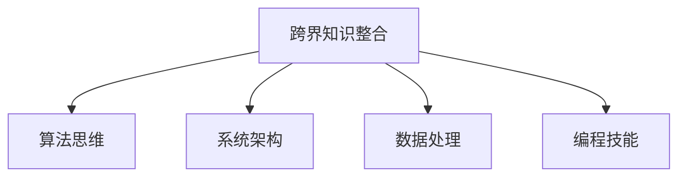

                 

# 跨界知识整合:程序员的独特优势

> 关键词：跨界知识整合,程序员,算法思维,系统架构,数据科学,人工智能

## 1. 背景介绍

### 1.1 问题由来

随着信息技术的发展，程序员在IT领域发挥了不可替代的作用。无论是软件开发、系统架构、数据处理，还是人工智能、机器学习，程序员都是最核心的技术力量。然而，程序员在知识结构上往往存在一定的局限性。传统的计算机科学教育模式，使得程序员偏重于算法与编程技能，而对于其他领域的知识涉猎较少，难以实现跨界知识整合。这种局限性在当前信息爆炸和技术融合的时代背景下，显得愈发突出。

### 1.2 问题核心关键点

跨界知识整合指的是将不同领域的专业知识进行交叉融合，形成新的知识体系和方法论，从而提升技术创新和应用能力。程序员在这一过程中，具有独特的优势和挑战。

优势：
1. **算法思维**：程序员在解决问题的过程中，习惯于使用算法和编程思维，具备很强的逻辑思维和问题分解能力。
2. **系统架构**：程序员了解系统设计和软件架构，能够从整体上把握复杂系统，并将其拆解为可管理的部分。
3. **数据处理**：程序员掌握大量的数据科学工具和库，能够高效处理和分析大量数据，从中提取有价值的信息。
4. **编程技能**：程序员具备强健的编程能力，能够快速实现复杂算法和模型，并将其部署到实际应用中。

挑战：
1. **知识深度不足**：程序员对于某个领域的知识可能不深不广，难以深入理解和应用。
2. **知识更新慢**：程序员的知识结构相对固定，对于新兴技术掌握较慢。
3. **跨界应用难**：将不同领域的知识应用到实际问题中，需要跨领域的理解与实践经验。

### 1.3 问题研究意义

跨界知识整合不仅能够提升程序员的技术能力和竞争力，还能促进跨学科创新，推动技术进步和产业升级。具体来说，跨界知识整合具有以下几方面的研究意义：

1. **技术创新**：通过跨界知识的融合，程序员能够提出新的技术解决方案，推动行业技术的发展。
2. **产业升级**：跨界知识整合能够推动信息技术与实体经济的深度融合，助力传统产业的数字化转型。
3. **人才培养**：跨界知识整合培养了具有多学科背景的复合型人才，为未来技术发展提供人才支撑。
4. **学科交叉**：跨界知识整合促进了不同学科之间的交流与合作，推动了学科交叉与融合。

## 2. 核心概念与联系

### 2.1 核心概念概述

为更好地理解跨界知识整合，本节将介绍几个密切相关的核心概念：

- **跨界知识整合**：将不同领域的专业知识进行交叉融合，形成新的知识体系和方法论。
- **算法思维**：在解决问题的过程中，使用算法和编程思维，具备逻辑思维和问题分解能力。
- **系统架构**：对复杂系统进行整体设计，并拆解为可管理的部分。
- **数据处理**：使用数据科学工具和库，高效处理和分析数据，提取有价值的信息。
- **编程技能**：具备强健的编程能力，能够实现复杂算法和模型，并将其部署到实际应用中。

这些核心概念之间的逻辑关系可以通过以下Mermaid流程图来展示：



这个流程图展示了跨界知识整合的核心概念及其之间的关系：

1. 跨界知识整合是核心目标。
2. 算法思维、系统架构、数据处理、编程技能是实现这一目标的关键手段。
3. 这些关键手段相辅相成，共同支撑跨界知识整合的实现。

## 3. 核心算法原理 & 具体操作步骤
### 3.1 算法原理概述

跨界知识整合的本质是对不同领域的知识进行综合利用和协同优化，以实现更高效的技术创新和应用。其核心思想是：

1. **问题分解**：将复杂问题分解为多个子问题，分别解决。
2. **知识融合**：将不同领域的知识融合，形成新的知识体系。
3. **模型优化**：通过算法和模型优化，提高综合应用的效果。

### 3.2 算法步骤详解

跨界知识整合的过程包括以下几个关键步骤：

**Step 1: 问题分解与需求分析**
- 对复杂问题进行分解，找出核心需求和关键技术点。
- 根据不同领域的知识特点，确定融合方向和应用场景。

**Step 2: 数据收集与预处理**
- 收集不同领域的数据，并进行清洗、归一化等预处理工作。
- 使用数据科学工具进行数据探索和分析，提取关键信息。

**Step 3: 知识融合与模型建立**
- 将不同领域的专业知识进行融合，形成新的知识体系。
- 建立适合的算法和模型，将新知识应用到实际问题中。

**Step 4: 模型优化与验证**
- 使用算法和优化技术，提高模型的准确性和鲁棒性。
- 在实际场景中进行验证，评估模型的效果和可行性。

**Step 5: 应用与迭代**
- 将优化后的模型应用到实际问题中，并不断迭代优化。
- 定期更新知识体系，保持技术的先进性和实用性。

### 3.3 算法优缺点

跨界知识整合具有以下优点：
1. **跨学科创新**：通过不同领域的知识融合，可以提出全新的技术方案，解决复杂问题。
2. **综合应用能力**：将多领域知识整合并应用于实际问题，能够提升系统的整体性能。
3. **知识互补**：不同领域知识相互补充，可以弥补单一领域知识的不足。

同时，该方法也存在一定的局限性：
1. **知识冲突**：不同领域知识可能存在冲突，需要巧妙融合以避免冲突。
2. **资源消耗**：跨界知识整合需要大量的数据和计算资源，成本较高。
3. **知识鸿沟**：不同领域的知识可能存在较大差异，难以直接融合。
4. **应用复杂性**：将跨界知识整合应用于实际问题，可能会增加系统的复杂性。

尽管存在这些局限性，但跨界知识整合依然是当前技术发展的一个重要方向，程序员在这一过程中可以发挥独特的优势。

### 3.4 算法应用领域

跨界知识整合在多个领域具有广泛的应用前景：

- **医疗健康**：将计算机科学、数据科学、医学知识融合，开发智能医疗系统，辅助诊断和治疗。
- **金融科技**：结合数学、统计学、计算机科学，开发智能投顾、风险评估、信用评分等金融应用。
- **智能制造**：融合机械工程、计算机科学、人工智能，实现智能制造和工业4.0。
- **智慧城市**：将城市规划、物联网、人工智能等知识融合，构建智慧城市管理系统。
- **社交媒体**：结合自然语言处理、心理学、社会网络分析等知识，实现智能推荐和情感分析。

这些领域的应用展示了跨界知识整合的巨大潜力，程序员在这一过程中能够发挥关键作用。

## 4. 数学模型和公式 & 详细讲解 & 举例说明

### 4.1 数学模型构建

在跨界知识整合的过程中，数学模型和公式起到了关键作用。这里以智能投顾系统为例，展示如何构建数学模型和公式：

假设我们有N个用户的历史交易数据，每个数据包含k个特征（如买入价格、卖出价格、持有时间等）和1个目标变量（如收益）。我们的目标是构建一个预测模型，根据历史数据预测新交易的收益。

定义用户i在特征向量 $x_i \in \mathbb{R}^k$ 下的收益为 $y_i \in \mathbb{R}$。假设我们使用的是线性回归模型，模型形式为：

$$
y_i = \beta_0 + \beta_1 x_{i1} + \beta_2 x_{i2} + \cdots + \beta_k x_{ik} + \epsilon_i
$$

其中 $\beta_j$ 是特征 $x_{ij}$ 的系数，$\epsilon_i$ 是随机误差项。

### 4.2 公式推导过程

对于上述线性回归模型，我们需要估计参数 $\beta_j$。常用的方法是最小二乘法，目标是最小化预测误差平方和：

$$
\sum_{i=1}^N (y_i - \hat{y}_i)^2 = \sum_{i=1}^N (y_i - \beta_0 - \sum_{j=1}^k \beta_j x_{ij})^2
$$

其中 $\hat{y}_i = \beta_0 + \sum_{j=1}^k \beta_j x_{ij}$ 是模型的预测值。

最小二乘法的解为：

$$
\hat{\beta}_j = \frac{\sum_{i=1}^N (x_{ij}y_i - \sum_{i=1}^N x_{ij}y_i)}{\sum_{i=1}^N (x_{ij}^2) - \sum_{i=1}^N (\sum_{j=1}^k x_{ij})^2}
$$

得到模型参数后，我们可以使用模型对新数据进行预测，评估模型的效果。

### 4.3 案例分析与讲解

以智能投顾系统为例，展示如何将线性回归模型应用于实际问题：

1. **数据收集**：收集用户的交易数据，包括买入价格、卖出价格、持有时间等特征，以及对应的收益。
2. **数据预处理**：对数据进行清洗、归一化等预处理工作。
3. **模型建立**：使用线性回归模型，将特征向量与收益进行线性拟合，得到预测模型。
4. **模型优化**：使用梯度下降等优化算法，最小化预测误差，优化模型参数。
5. **模型验证**：在验证集上评估模型效果，使用AUC、R²等指标进行评估。
6. **应用迭代**：将优化后的模型应用于实际交易中，并不断迭代优化。

通过上述步骤，程序员可以将计算机科学和数据科学的知识整合并应用于金融领域，构建智能投顾系统。

## 5. 项目实践：代码实例和详细解释说明
### 5.1 开发环境搭建

在进行跨界知识整合的实践前，我们需要准备好开发环境。以下是使用Python进行PyTorch开发的环境配置流程：

1. 安装Anaconda：从官网下载并安装Anaconda，用于创建独立的Python环境。

2. 创建并激活虚拟环境：
```bash
conda create -n my_env python=3.7 
conda activate my_env
```

3. 安装PyTorch：根据CUDA版本，从官网获取对应的安装命令。例如：
```bash
conda install pytorch torchvision torchaudio cudatoolkit=11.0 -c pytorch -c conda-forge
```

4. 安装Scikit-Learn：
```bash
pip install scikit-learn
```

5. 安装Matplotlib：
```bash
pip install matplotlib
```

完成上述步骤后，即可在`my_env`环境中开始开发实践。

### 5.2 源代码详细实现

这里以线性回归模型为例，展示如何在智能投顾系统中实现跨界知识整合：

首先，导入必要的库：

```python
import torch
import torch.nn as nn
import torch.optim as optim
import matplotlib.pyplot as plt
from sklearn.datasets import make_regression
from sklearn.model_selection import train_test_split
from sklearn.metrics import mean_squared_error
```

然后，构建线性回归模型：

```python
class LinearRegression(nn.Module):
    def __init__(self, n_features):
        super(LinearRegression, self).__init__()
        self.linear = nn.Linear(n_features, 1)

    def forward(self, x):
        return self.linear(x)
```

接着，训练模型：

```python
# 生成随机数据
X, y = make_regression(n_samples=1000, n_features=5, noise=0.1)

# 划分训练集和验证集
X_train, X_val, y_train, y_val = train_test_split(X, y, test_size=0.2)

# 将数据转换为Tensor
X_train = torch.from_numpy(X_train).float()
y_train = torch.from_numpy(y_train).float()
X_val = torch.from_numpy(X_val).float()
y_val = torch.from_numpy(y_val).float()

# 构建模型
model = LinearRegression(n_features=5)

# 定义损失函数和优化器
criterion = nn.MSELoss()
optimizer = optim.SGD(model.parameters(), lr=0.01)

# 训练模型
epochs = 100
for epoch in range(epochs):
    optimizer.zero_grad()
    outputs = model(X_train)
    loss = criterion(outputs, y_train)
    loss.backward()
    optimizer.step()

    if epoch % 10 == 0:
        val_outputs = model(X_val)
        val_loss = criterion(val_outputs, y_val)
        print(f"Epoch {epoch+1}, train loss: {loss:.4f}, val loss: {val_loss:.4f}")
```

最后，评估模型：

```python
# 使用模型进行预测
test_X = torch.from_numpy(X_test).float()
test_y = torch.from_numpy(y_test).float()
test_outputs = model(test_X)

# 评估模型性能
test_loss = criterion(test_outputs, test_y)
print(f"Test loss: {test_loss:.4f}")

# 绘制预测与真实值对比图
plt.scatter(X_val, y_val, color='blue', label='True')
plt.plot(X_val, test_outputs.cpu().detach().numpy(), color='red', label='Predict')
plt.legend()
plt.show()
```

以上就是使用PyTorch实现线性回归模型的完整代码实现。可以看到，程序员借助数据科学和计算机科学的工具，能够快速实现复杂的算法和模型，并将其应用于实际问题中。

### 5.3 代码解读与分析

让我们再详细解读一下关键代码的实现细节：

**LinearRegression类**：
- `__init__`方法：初始化线性回归模型，包括线性层。
- `forward`方法：前向传播，计算模型输出。

**模型训练过程**：
- 使用`make_regression`函数生成随机数据集。
- 使用`train_test_split`函数划分训练集和验证集。
- 将数据转换为Tensor，方便模型训练。
- 定义模型、损失函数和优化器。
- 在每个epoch中，前向传播计算损失，反向传播更新参数，并记录验证集的损失。
- 通过损失函数的输出，可视化训练过程中的损失变化。

**模型评估过程**：
- 使用模型对测试集进行预测。
- 计算预测值与真实值之间的损失，评估模型性能。
- 使用`matplotlib`绘制预测值与真实值对比图，可视化模型效果。

## 6. 实际应用场景

### 6.1 智能投顾系统

智能投顾系统是跨界知识整合在金融领域的重要应用。通过将计算机科学、数据科学和金融学知识融合，智能投顾系统能够实现智能投资建议和资产管理。

具体来说，智能投顾系统可以自动分析市场数据，识别投资机会，并根据用户的风险偏好和财务状况，给出个性化的投资建议。系统还可以实时监测市场动态，根据用户的行为和反馈进行优化调整，提升投资收益。

### 6.2 医疗诊断系统

医疗诊断系统是跨界知识整合在医疗领域的应用。通过将计算机科学、数据科学和医学知识融合，医疗诊断系统能够实现智能诊断和辅助治疗。

具体来说，医疗诊断系统可以自动分析患者的病历数据、医学影像、基因数据等，识别出潜在的疾病风险。系统还可以根据患者的病情和历史记录，推荐最适合的治疗方案和药物，辅助医生进行决策。

### 6.3 智能制造系统

智能制造系统是跨界知识整合在工业领域的应用。通过将计算机科学、数据科学和机械工程知识融合，智能制造系统能够实现智能生产和质量控制。

具体来说，智能制造系统可以自动分析生产数据，识别出生产中的瓶颈和异常，并根据实时数据进行优化调整，提升生产效率和质量。系统还可以实时监测设备的运行状态，预测维护需求，降低设备故障率。

## 7. 工具和资源推荐

### 7.1 学习资源推荐

为帮助开发者系统掌握跨界知识整合的理论基础和实践技巧，这里推荐一些优质的学习资源：

1. 《Python数据科学手册》：讲解了Python在数据科学中的应用，涵盖数据处理、统计分析、机器学习等方面。
2. 《深度学习入门》：讲解了深度学习的基本原理和实现方法，适合初学者入门。
3. 《数据科学实战》：讲解了数据科学在实际项目中的应用，包含多个案例和实战练习。
4. 《机器学习实战》：讲解了机器学习的基本算法和应用，适合工程实践。
5. Kaggle：提供大量的数据集和竞赛，可以实践数据科学和机器学习技术。

通过对这些资源的学习实践，相信你一定能够快速掌握跨界知识整合的精髓，并用于解决实际的IT问题。

### 7.2 开发工具推荐

高效的开发离不开优秀的工具支持。以下是几款用于跨界知识整合开发的常用工具：

1. Jupyter Notebook：在线的Jupyter Notebook环境，可以方便地进行代码编写和数据可视化。
2. TensorBoard：TensorFlow配套的可视化工具，可以实时监测模型训练状态，提供丰富的图表呈现方式。
3. Weights & Biases：模型训练的实验跟踪工具，可以记录和可视化模型训练过程中的各项指标。
4. PyTorch：基于Python的开源深度学习框架，灵活动态的计算图，适合快速迭代研究。
5. Scikit-Learn：Python的数据科学库，包含大量的机器学习算法和工具。
6. Matplotlib：Python的数据可视化库，可以绘制各种类型的图表。

合理利用这些工具，可以显著提升跨界知识整合的开发效率，加快创新迭代的步伐。

### 7.3 相关论文推荐

跨界知识整合的研究源于学界的持续研究。以下是几篇奠基性的相关论文，推荐阅读：

1. "Integrating Knowledge from Different Domains: A Survey"：总结了跨界知识整合的研究进展和应用案例。
2. "Cross-Domain Transfer Learning: An Overview and Tutorial"：介绍了跨域迁移学习的基本概念和实现方法。
3. "Knowledge Integration and Transfer Learning for Business Intelligence"：探讨了跨界知识整合在商业智能中的应用。
4. "AI for Financial Services: An Overview"：介绍了人工智能在金融服务中的应用，包含多个跨界知识整合的案例。
5. "Advances in Medical Data Mining and Statistical Learning"：介绍了医疗数据挖掘和统计学习的研究进展和应用案例。

这些论文代表了大跨界知识整合的发展脉络。通过学习这些前沿成果，可以帮助研究者把握学科前进方向，激发更多的创新灵感。

## 8. 总结：未来发展趋势与挑战

### 8.1 总结

本文对跨界知识整合的过程进行了全面系统的介绍。首先阐述了跨界知识整合的背景和研究意义，明确了跨界知识整合在提升技术创新和应用能力方面的重要价值。其次，从原理到实践，详细讲解了跨界知识整合的数学模型和操作步骤，给出了具体的代码实现。同时，本文还广泛探讨了跨界知识整合在金融、医疗、制造等多个领域的应用前景，展示了跨界知识整合的巨大潜力。最后，本文精选了跨界知识整合的学习资源、开发工具和相关论文，力求为读者提供全方位的技术指引。

通过本文的系统梳理，可以看到，跨界知识整合在当前信息爆炸和技术融合的时代背景下，具有重要的研究意义和实际价值。程序员在这一过程中，可以发挥独特的算法思维、系统架构、数据处理和编程技能，实现跨界知识的高效整合和应用。未来，随着技术的不断进步，跨界知识整合将发挥更加重要的作用，为IT行业带来更多的创新和突破。

### 8.2 未来发展趋势

展望未来，跨界知识整合将呈现以下几个发展趋势：

1. **深度融合**：跨界知识整合将更加深入地融合，涵盖更多领域和更多技术。
2. **数据驱动**：跨界知识整合将更多地依赖数据驱动，提高知识融合的准确性和效果。
3. **跨模态融合**：跨界知识整合将涵盖多模态数据，实现视觉、语音、文本等数据的协同应用。
4. **智能辅助**：跨界知识整合将更多地结合人工智能技术，实现自动化和智能化的知识融合。
5. **多领域应用**：跨界知识整合将在更多领域得到应用，如医疗、金融、制造等，提升各领域的技术水平和创新能力。

以上趋势凸显了跨界知识整合的未来发展方向。这些方向的探索发展，必将进一步提升跨界知识整合的效果和应用范围，为IT行业带来更多的创新和突破。

### 8.3 面临的挑战

尽管跨界知识整合具有广阔的前景，但在实现过程中，仍面临诸多挑战：

1. **知识鸿沟**：不同领域的知识存在较大差异，难以直接融合。
2. **数据不足**：跨界知识整合需要大量高质量的数据，数据获取和标注成本较高。
3. **算法复杂性**：跨界知识整合涉及多种算法和模型，算法复杂度较高。
4. **应用复杂性**：将跨界知识整合应用于实际问题，可能会增加系统的复杂性。
5. **伦理问题**：跨界知识整合可能涉及隐私保护、数据安全等问题，需要严格遵循伦理规范。

尽管存在这些挑战，但跨界知识整合依然是当前技术发展的一个重要方向，程序员在这一过程中可以发挥独特的优势。

### 8.4 研究展望

面对跨界知识整合所面临的挑战，未来的研究需要在以下几个方面寻求新的突破：

1. **数据获取**：探索高效的数据获取和标注方法，降低数据获取和标注成本。
2. **算法优化**：开发更加高效、鲁棒的算法，降低算法复杂度。
3. **应用简化**：探索简化跨界知识整合的方法，降低应用复杂性。
4. **伦理规范**：制定跨界知识整合的伦理规范，保障数据安全、隐私保护。
5. **多学科合作**：加强跨学科的合作，共同推动跨界知识整合的研究和发展。

这些研究方向将推动跨界知识整合技术的不断进步，为IT行业带来更多的创新和突破。总之，跨界知识整合需要不断突破技术瓶颈，才能实现更广泛的应用和发展。

## 9. 附录：常见问题与解答

**Q1: 程序员在跨界知识整合过程中需要注意哪些问题？**

A: 程序员在跨界知识整合过程中需要注意以下问题：

1. **知识边界**：明确不同领域知识的特点和边界，避免知识冲突和误用。
2. **数据质量**：确保数据的准确性和完整性，避免因数据质量问题影响模型效果。
3. **算法选择**：选择合适的算法和模型，确保算法的高效性和准确性。
4. **系统架构**：设计合理的系统架构，确保系统的可扩展性和稳定性。
5. **伦理规范**：遵循伦理规范，保障数据安全和隐私保护。

**Q2: 如何降低跨界知识整合的复杂性？**

A: 降低跨界知识整合的复杂性，可以从以下几个方面入手：

1. **简化模型**：使用更加简单、高效的模型，减少算法复杂性。
2. **模块化设计**：将系统模块化设计，方便各个模块的独立开发和维护。
3. **逐步迭代**：采用迭代式开发方法，逐步优化和改进模型和系统。
4. **自动化工具**：使用自动化工具进行数据处理、模型训练和系统部署，减少人工干预。

**Q3: 如何保障跨界知识整合的应用效果？**

A: 保障跨界知识整合的应用效果，可以从以下几个方面入手：

1. **数据驱动**：确保数据质量和多样性，使用大量高质量的数据进行模型训练。
2. **模型优化**：使用模型优化技术和算法改进方法，提升模型效果。
3. **系统评估**：定期评估模型和系统的效果，及时发现和解决潜在问题。
4. **用户反馈**：收集用户反馈，不断优化和改进模型和系统。

**Q4: 跨界知识整合在实际应用中需要注意哪些问题？**

A: 跨界知识整合在实际应用中需要注意以下问题：

1. **数据获取**：确保数据的合法性和安全性，避免侵犯隐私。
2. **算法鲁棒性**：确保算法的鲁棒性和稳定性，避免在实际应用中产生偏差。
3. **系统可扩展性**：确保系统的可扩展性和适应性，支持未来数据的增加和变化。
4. **伦理规范**：遵循伦理规范，确保应用符合法律和道德标准。

这些问题的解决需要跨学科的合作和技术创新，才能实现跨界知识整合的全面应用。

---

作者：禅与计算机程序设计艺术 / Zen and the Art of Computer Programming

