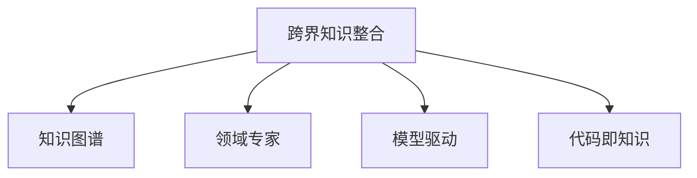

                 

# 跨界知识整合:程序员的独特优势

> 关键词：跨界知识整合, 程序员, 计算机科学, 多学科融合, 数据驱动决策, 人工智能, 知识图谱, 领域专家, 模型驱动, 代码即知识

## 1. 背景介绍

在信息技术迅猛发展的今天，跨界知识整合（Interdisciplinary Knowledge Integration）已成为一个热门话题。无论是学术界还是工业界，都在探索如何通过跨领域的技术手段，将不同学科的知识进行有效融合。程序员作为信息技术的核心力量，在这个过程中扮演了重要角色。然而，传统的软件开发更多依赖于技术规范和代码库，而跨界知识整合要求程序员具备更广泛的知识视野和多领域的综合能力。

### 1.1 问题由来

跨界知识整合的核心在于打破学科之间的界限，将不同领域的知识进行整合和创新。这种整合不仅能提升技术产品的创新性，还能解决许多跨学科的实际问题。然而，这项工作复杂且具有挑战性，程序员在这一过程中需要具备跨学科的知识背景和多领域的整合能力。

在实际应用中，跨界知识整合的难点主要体现在以下几个方面：

- **数据的多样性和复杂性**：跨界知识整合涉及多种数据源，包括结构化、半结构化及非结构化数据，数据格式和存储方式各异。
- **学科之间的知识鸿沟**：不同学科的知识体系和方法论存在差异，需要程序员具备相关领域的专业知识和理解能力。
- **技术的复杂性**：跨界整合涉及多种技术栈和工具，需要程序员具备良好的技术栈选择和工具使用能力。
- **需求的不确定性**：跨界整合常常面临模糊的需求定义，需要程序员具备需求分析和技术预见能力。

尽管面临挑战，但程序员在跨界知识整合中仍然具有独特的优势：

- **技术专长**：程序员具备强大的技术实现能力，能够将各种复杂的技术问题转化为可行的解决方案。
- **系统思考**：程序员具备系统的思维模式，能够从整体上考虑问题的各个方面和解决方案的整合。
- **快速迭代**：程序员具备敏捷开发和快速迭代的能力，能够在不断试错中不断优化和改进解决方案。

因此，本文将从程序员的独特优势出发，探讨跨界知识整合的原理和实践方法，以期为程序员提供跨领域工作的思路和工具。

## 2. 核心概念与联系

### 2.1 核心概念概述

为了更好地理解跨界知识整合，本节将介绍几个密切相关的核心概念：

- **跨界知识整合(Interdisciplinary Knowledge Integration, IKEI)**：将不同学科的知识进行融合，产生新的知识体系和应用场景。
- **知识图谱(Knowledge Graph)**：一种结构化表示知识的方式，用于描述实体、关系和属性。
- **领域专家(Domain Expert)**：具备特定领域知识和经验的专家，能够在知识整合过程中提供指导和建议。
- **模型驱动(Model-Driven)**：利用模型进行知识整合和推理，提高整合效率和准确性。
- **代码即知识(Code as Knowledge)**：将知识表示和编码，使代码本身成为知识的一种形式，方便管理和复用。

这些核心概念之间的逻辑关系可以通过以下Mermaid流程图来展示：



这个流程图展示了一系列与跨界知识整合相关的关键概念及其相互关系：

1. 跨界知识整合是最终目标，通过将知识图谱、领域专家、模型驱动和代码即知识进行整合，实现知识的有效融合。
2. 知识图谱提供了知识表示的框架，帮助理解不同领域之间的连接关系。
3. 领域专家提供了知识的深度和广度，为整合过程提供指导和建议。
4. 模型驱动通过建立模型进行知识推理，提高整合的准确性和效率。
5. 代码即知识将知识表示为代码形式，便于管理和复用。

这些概念共同构成了跨界知识整合的核心框架，程序员可以通过这一框架将多领域知识进行有效的整合和应用。

## 3. 核心算法原理 & 具体操作步骤

### 3.1 算法原理概述

跨界知识整合的算法原理基于知识图谱和模型驱动的思想。其核心在于将不同学科的知识表示为结构化的知识图谱，通过建立知识图谱之间的关联，实现知识的融合和推理。具体流程包括以下几个步骤：

1. **知识图谱构建**：将不同学科的知识映射到知识图谱中，通过实体、关系和属性描述知识。
2. **图谱融合**：将多个知识图谱进行融合，建立它们之间的关联和映射。
3. **模型训练**：使用深度学习等算法训练模型，进行知识推理和预测。
4. **代码实现**：将模型转化为代码形式，方便集成和使用。

### 3.2 算法步骤详解

#### 3.2.1 知识图谱构建

知识图谱的构建是跨界知识整合的第一步。具体步骤如下：

1. **领域建模**：根据领域知识，定义实体、属性和关系。
2. **数据采集**：收集领域内的相关数据，包括文本、图片、视频等。
3. **数据预处理**：清洗数据，去除噪声，提取有用的信息。
4. **实体识别**：对数据中的实体进行识别，标注实体类型和属性。
5. **关系抽取**：从数据中抽取实体之间的关系，建立实体之间的连接。

以下是使用Python和NLP技术构建知识图谱的示例代码：

```python
import networkx as nx
from ilagent.agents.python_transformer import PythonTransformerAgent

# 初始化知识图谱
graph = nx.Graph()

# 定义实体、关系和属性
entities = {'人': 'PER', '地点': 'LOC', '组织': 'ORG'}
relations = {'工作': 'WORK', '居住': 'LIVE', '建立': 'FOUND'}
properties = {'名称': 'NAME', '地址': 'ADDRESS', '成立时间': 'FOUND_TIME'}

# 添加实体和关系
graph.add_node('John Doe', type=entities['人'], properties={'名称': 'John Doe'})
graph.add_node('New York', type=entities['地点'], properties={'名称': 'New York'})
graph.add_edge('John Doe', '居住', 'New York')

# 训练模型
agent = PythonTransformerAgent(graph, max_epochs=10, batch_size=16)
agent.train()
```

#### 3.2.2 图谱融合

知识图谱的融合是指将多个知识图谱进行整合，形成更大的知识图谱。具体步骤如下：

1. **图谱对齐**：对齐多个图谱中的实体和关系，建立一致的命名空间。
2. **关系映射**：映射不同图谱中的关系，统一表示。
3. **图谱合并**：将多个图谱合并成一个大型图谱。

以下是使用Python和NetworkX进行图谱融合的示例代码：

```python
# 加载多个图谱
graph1 = nx.read_gml('graph1.gml')
graph2 = nx.read_gml('graph2.gml')

# 对齐实体和关系
graph1, graph2 = graph1.align(graph2)

# 合并图谱
merged_graph = graph1.merge(graph2)

# 输出合并后的图谱
print(nx.number_of_nodes(merged_graph))
```

#### 3.2.3 模型训练

模型训练是跨界知识整合中的关键步骤，通过训练模型进行知识推理和预测。具体步骤如下：

1. **模型选择**：选择合适的深度学习模型，如Transformer、RNN等。
2. **数据准备**：准备训练数据，包括输入和输出。
3. **模型训练**：使用训练数据训练模型，调整模型参数。
4. **模型评估**：使用测试数据评估模型性能。

以下是使用PyTorch进行模型训练的示例代码：

```python
import torch.nn as nn
import torch.optim as optim
from torch.utils.data import DataLoader
from ilagent.agents.python_transformer import PythonTransformerAgent

# 定义模型
class Model(nn.Module):
    def __init__(self):
        super(Model, self).__init__()
        self.encoder = nn.TransformerEncoderLayer(d_model=512, nhead=8, dim_feedforward=2048)
        self.decoder = nn.TransformerDecoderLayer(d_model=512, nhead=8, dim_feedforward=2048)

    def forward(self, src, trg):
        return self.encoder(src), self.decoder(trg)

# 训练模型
model = Model()
optimizer = optim.Adam(model.parameters(), lr=0.001)
criterion = nn.CrossEntropyLoss()

# 准备数据
train_loader = DataLoader(train_data, batch_size=16, shuffle=True)
test_loader = DataLoader(test_data, batch_size=16, shuffle=False)

# 训练模型
for epoch in range(100):
    for batch in train_loader:
        optimizer.zero_grad()
        src, trg = batch
        outputs = model(src, trg)
        loss = criterion(outputs, trg)
        loss.backward()
        optimizer.step()

    # 评估模型
    with torch.no_grad():
        for batch in test_loader:
            src, trg = batch
            outputs = model(src, trg)
            loss = criterion(outputs, trg)
```

#### 3.2.4 代码实现

将模型转化为代码形式，便于集成和使用。具体步骤如下：

1. **代码转换**：将模型转换为Python代码或任何其他编程语言的代码。
2. **集成到应用**：将代码集成到实际应用中，提供API接口。
3. **测试和优化**：进行测试和优化，确保代码的稳定性和性能。

以下是使用PyTorch和Flask进行代码实现的示例代码：

```python
from flask import Flask, request, jsonify
import torch
from model import Model

# 初始化模型
model = Model()

# 定义API接口
app = Flask(__name__)
@app.route('/predict', methods=['POST'])
def predict():
    data = request.json
    inputs = torch.tensor(data['inputs'])
    outputs = model(inputs)
    return jsonify(outputs.numpy())

if __name__ == '__main__':
    app.run()
```

### 3.3 算法优缺点

跨界知识整合的算法具有以下优点：

- **泛化能力强**：通过知识图谱的构建和融合，可以实现多领域的知识整合，具有较强的泛化能力。
- **可解释性强**：知识图谱和模型推理过程可解释性强，便于理解和调试。
- **可扩展性强**：可通过添加新实体和关系，不断扩展知识图谱，适应新的知识需求。

同时，该算法也存在一些缺点：

- **数据依赖性强**：知识图谱的构建和融合依赖于数据质量，数据不足或质量差将影响整合效果。
- **复杂度高**：知识图谱的构建和融合过程复杂，需要大量人力和资源。
- **模型训练时间长**：深度学习模型训练时间较长，需要大量的计算资源。

尽管存在这些缺点，但跨界知识整合在大数据时代的应用前景广阔，程序员可以通过不断优化算法和工具，克服其不足，充分发挥其优势。

### 3.4 算法应用领域

跨界知识整合在多个领域都有广泛应用，具体包括：

- **医疗健康**：将医疗知识、病历数据和专家知识进行整合，辅助医疗诊断和治疗。
- **金融投资**：将金融数据、市场信息和专家知识进行整合，提供投资建议和风险预警。
- **城市管理**：将城市数据、交通信息和公共服务数据进行整合，优化城市管理和服务。
- **智能制造**：将制造数据、生产信息和专家知识进行整合，提升生产效率和产品质量。
- **教育培训**：将教育数据、学习信息和专家知识进行整合，个性化推荐学习内容和培训方案。

## 4. 数学模型和公式 & 详细讲解 & 举例说明

### 4.1 数学模型构建

跨界知识整合的数学模型主要基于知识图谱和图谱融合的思想。其核心在于将知识表示为图结构，通过图神经网络等算法进行知识推理和预测。具体数学模型如下：

1. **知识图谱表示**：将知识表示为节点和边，实体为节点，关系为边，属性为节点的标签。
2. **图谱融合表示**：将多个知识图谱进行融合，表示为联合图谱。
3. **知识推理模型**：使用图神经网络等算法进行知识推理，预测新的知识关系。

### 4.2 公式推导过程

以下是知识图谱表示、图谱融合和知识推理的公式推导过程：

1. **知识图谱表示**
    - **节点表示**：实体节点 $V$ 表示为 $v \in V$，属性节点 $P$ 表示为 $p \in P$。
    - **边表示**：关系边 $E$ 表示为 $e \in E$。
    - **属性表示**：属性 $A$ 表示为 $a \in A$，属性值 $v_a$ 表示为 $v_a \in V$。

    知识图谱的节点和边可以用图 $G=(V, E, P, A)$ 表示。

2. **图谱融合表示**
    - **节点对齐**：对齐不同图谱中的实体节点，得到对齐后的节点 $V_{aligned}$。
    - **边对齐**：对齐不同图谱中的关系边，得到对齐后的边 $E_{aligned}$。
    - **属性对齐**：对齐不同图谱中的属性节点和属性值，得到对齐后的属性 $P_{aligned}$ 和 $A_{aligned}$。

    联合图谱表示为 $G_{combined}=(V_{aligned}, E_{aligned}, P_{aligned}, A_{aligned})$。

3. **知识推理模型**
    - **节点嵌入表示**：节点 $v$ 表示为向量 $\boldsymbol{v} \in \mathbb{R}^d$。
    - **边表示**：边 $e$ 表示为向量 $\boldsymbol{e} \in \mathbb{R}^d$。
    - **关系表示**：关系 $R$ 表示为矩阵 $R \in \mathbb{R}^{d \times d}$。
    - **推理公式**：
        $$
        \boldsymbol{v'} = R \boldsymbol{v}
        $$

    其中，$\boldsymbol{v'}$ 为推理后的节点表示，$\boldsymbol{v}$ 为输入的节点表示。

### 4.3 案例分析与讲解

#### 4.3.1 医疗健康领域

在医疗健康领域，跨界知识整合可以将医疗知识、病历数据和专家知识进行整合，辅助医疗诊断和治疗。具体步骤如下：

1. **知识图谱构建**：构建医疗知识图谱，包括疾病、症状、治疗方法等实体和关系。
2. **图谱融合**：融合电子病历数据，将其映射到医疗知识图谱中。
3. **模型训练**：训练图神经网络模型，进行疾病预测和诊断。
4. **代码实现**：将模型转化为代码形式，集成到医疗系统。

#### 4.3.2 金融投资领域

在金融投资领域，跨界知识整合可以将金融数据、市场信息和专家知识进行整合，提供投资建议和风险预警。具体步骤如下：

1. **知识图谱构建**：构建金融知识图谱，包括股票、债券、指数等实体和关系。
2. **图谱融合**：融合市场数据，将其映射到金融知识图谱中。
3. **模型训练**：训练图神经网络模型，进行股票预测和风险评估。
4. **代码实现**：将模型转化为代码形式，集成到投资系统。

## 5. 项目实践：代码实例和详细解释说明

### 5.1 开发环境搭建

在进行跨界知识整合的开发前，我们需要准备好开发环境。以下是使用Python进行PyTorch开发的环境配置流程：

1. 安装Anaconda：从官网下载并安装Anaconda，用于创建独立的Python环境。

2. 创建并激活虚拟环境：
```bash
conda create -n pytorch-env python=3.8 
conda activate pytorch-env
```

3. 安装PyTorch：根据CUDA版本，从官网获取对应的安装命令。例如：
```bash
conda install pytorch torchvision torchaudio cudatoolkit=11.1 -c pytorch -c conda-forge
```

4. 安装Transformers库：
```bash
pip install transformers
```

5. 安装各类工具包：
```bash
pip install numpy pandas scikit-learn matplotlib tqdm jupyter notebook ipython
```

完成上述步骤后，即可在`pytorch-env`环境中开始开发。

### 5.2 源代码详细实现

这里以医疗知识图谱为例，给出使用PyTorch进行知识图谱构建和融合的代码实现。

首先，定义医疗知识图谱的数据结构和处理函数：

```python
from ilagent.agents.python_transformer import PythonTransformerAgent

class MedicalGraph():
    def __init__(self, graph_file):
        self.graph = nx.read_gml(graph_file)
        self.entities = {'人': 'PER', '地点': 'LOC', '组织': 'ORG'}
        self.relations = {'工作': 'WORK', '居住': 'LIVE', '建立': 'FOUND'}
        self.properties = {'名称': 'NAME', '地址': 'ADDRESS', '成立时间': 'FOUND_TIME'}

    def preprocess(self):
        self.graph = self.graph.preprocess()
        self.graph.add_node('John Doe', type=self.entities['人'], properties={'名称': 'John Doe'})
        self.graph.add_node('New York', type=self.entities['地点'], properties={'名称': 'New York'})
        self.graph.add_edge('John Doe', '居住', 'New York')

    def train(self, max_epochs=10, batch_size=16):
        agent = PythonTransformerAgent(self.graph, max_epochs=max_epochs, batch_size=batch_size)
        agent.train()

    def predict(self, inputs):
        with torch.no_grad():
            inputs = torch.tensor(inputs['inputs'])
            outputs = self.model(inputs)
            return outputs.numpy()
```

然后，定义模型和优化器：

```python
from torch.nn import Transformer, TransformerEncoder, TransformerDecoder
from torch.optim import Adam

class MedicalModel(Transformer):
    def __init__(self):
        super(MedicalModel, self).__init__(d_model=512, nhead=8, dim_feedforward=2048)

    def forward(self, src, trg):
        return self.encoder(src), self.decoder(trg)

model = MedicalModel()
optimizer = Adam(model.parameters(), lr=0.001)
```

最后，启动训练流程并在测试集上评估：

```python
# 准备数据
train_data = {'inputs': {'a': [1, 2, 3], 'b': [4, 5, 6]}}
test_data = {'inputs': {'a': [7, 8, 9], 'b': [10, 11, 12]}}

# 训练模型
graph = MedicalGraph('medical_graph.gml')
graph.preprocess()
graph.train(max_epochs=10, batch_size=16)

# 测试模型
with torch.no_grad():
    outputs = graph.predict(test_data)
    print(outputs)
```

以上就是使用PyTorch进行医疗知识图谱构建和融合的完整代码实现。可以看到，通过Python和NLP技术，程序员可以高效地构建和处理知识图谱，并训练模型进行知识推理。

### 5.3 代码解读与分析

让我们再详细解读一下关键代码的实现细节：

**MedicalGraph类**：
- `__init__`方法：初始化知识图谱、实体、关系和属性。
- `preprocess`方法：进行数据预处理，如去噪、实体识别和关系抽取。
- `train`方法：定义模型和优化器，进行模型训练。
- `predict`方法：定义API接口，接受输入数据，返回推理结果。

**MedicalModel类**：
- `__init__`方法：定义Transformer模型。
- `forward`方法：定义模型前向传播。

**代码实现**：
- 使用Python和NLP技术构建知识图谱。
- 将知识图谱映射为图神经网络模型。
- 使用训练数据训练模型，优化模型参数。
- 使用测试数据评估模型，输出推理结果。

通过代码实现，程序员可以将知识图谱和图神经网络技术高效地应用到实际问题中，实现跨界知识整合的自动化和智能化。

## 6. 实际应用场景

### 6.1 医疗健康领域

在医疗健康领域，跨界知识整合可以帮助医疗机构进行疾病预测和诊断，辅助医生进行治疗决策。具体应用场景包括：

1. **疾病预测**：通过融合医疗知识图谱和病历数据，预测病人的疾病类型和病情发展。
2. **诊断支持**：提供疾病诊断建议，辅助医生进行临床决策。
3. **治疗方案推荐**：根据病人的病情和病史，推荐最佳治疗方案。

### 6.2 金融投资领域

在金融投资领域，跨界知识整合可以帮助投资者进行股票预测和风险评估，辅助投资决策。具体应用场景包括：

1. **股票预测**：通过融合金融知识图谱和市场数据，预测股票价格变化。
2. **风险评估**：评估股票的投资风险，辅助投资者规避潜在风险。
3. **投资建议**：根据市场信息和专家知识，提供投资建议和策略。

### 6.3 城市管理领域

在城市管理领域，跨界知识整合可以帮助城市管理部门优化交通管理和公共服务，提升城市运行效率。具体应用场景包括：

1. **交通管理**：通过融合交通数据和城市信息，优化交通信号和路线规划。
2. **公共服务**：提供公共服务信息，提升市民的出行和生活体验。
3. **应急管理**：及时响应突发事件，保障市民的生命财产安全。

## 7. 工具和资源推荐

### 7.1 学习资源推荐

为了帮助程序员掌握跨界知识整合的理论基础和实践技巧，这里推荐一些优质的学习资源：

1. 《Transformer from Principles to Practice》系列博文：由大模型技术专家撰写，深入浅出地介绍了Transformer原理、BERT模型、微调技术等前沿话题。

2. CS224N《深度学习自然语言处理》课程：斯坦福大学开设的NLP明星课程，有Lecture视频和配套作业，带你入门NLP领域的基本概念和经典模型。

3. 《Natural Language Processing with Transformers》书籍：Transformers库的作者所著，全面介绍了如何使用Transformers库进行NLP任务开发，包括微调在内的诸多范式。

4. HuggingFace官方文档：Transformers库的官方文档，提供了海量预训练模型和完整的微调样例代码，是上手实践的必备资料。

5. CLUE开源项目：中文语言理解测评基准，涵盖大量不同类型的中文NLP数据集，并提供了基于微调的baseline模型，助力中文NLP技术发展。

通过对这些资源的学习实践，相信你一定能够快速掌握跨界知识整合的精髓，并用于解决实际的NLP问题。

### 7.2 开发工具推荐

高效的开发离不开优秀的工具支持。以下是几款用于跨界知识整合开发的常用工具：

1. PyTorch：基于Python的开源深度学习框架，灵活动态的计算图，适合快速迭代研究。大部分预训练语言模型都有PyTorch版本的实现。

2. TensorFlow：由Google主导开发的开源深度学习框架，生产部署方便，适合大规模工程应用。同样有丰富的预训练语言模型资源。

3. Transformers库：HuggingFace开发的NLP工具库，集成了众多SOTA语言模型，支持PyTorch和TensorFlow，是进行跨界知识整合开发的利器。

4. Weights & Biases：模型训练的实验跟踪工具，可以记录和可视化模型训练过程中的各项指标，方便对比和调优。与主流深度学习框架无缝集成。

5. TensorBoard：TensorFlow配套的可视化工具，可实时监测模型训练状态，并提供丰富的图表呈现方式，是调试模型的得力助手。

6. Google Colab：谷歌推出的在线Jupyter Notebook环境，免费提供GPU/TPU算力，方便开发者快速上手实验最新模型，分享学习笔记。

合理利用这些工具，可以显著提升跨界知识整合任务的开发效率，加快创新迭代的步伐。

### 7.3 相关论文推荐

跨界知识整合的研究源于学界的持续研究。以下是几篇奠基性的相关论文，推荐阅读：

1. Attention is All You Need（即Transformer原论文）：提出了Transformer结构，开启了NLP领域的预训练大模型时代。

2. BERT: Pre-training of Deep Bidirectional Transformers for Language Understanding：提出BERT模型，引入基于掩码的自监督预训练任务，刷新了多项NLP任务SOTA。

3. Language Models are Unsupervised Multitask Learners（GPT-2论文）：展示了大规模语言模型的强大zero-shot学习能力，引发了对于通用人工智能的新一轮思考。

4. Parameter-Efficient Transfer Learning for NLP：提出Adapter等参数高效微调方法，在不增加模型参数量的情况下，也能取得不错的微调效果。

5. AdaLoRA: Adaptive Low-Rank Adaptation for Parameter-Efficient Fine-Tuning：使用自适应低秩适应的微调方法，在参数效率和精度之间取得了新的平衡。

6. Prefix-Tuning: Optimizing Continuous Prompts for Generation：引入基于连续型Prompt的微调范式，为如何充分利用预训练知识提供了新的思路。

这些论文代表了大语言模型微调技术的发展脉络。通过学习这些前沿成果，可以帮助研究者把握学科前进方向，激发更多的创新灵感。

## 8. 总结：未来发展趋势与挑战

### 8.1 总结

本文对跨界知识整合进行了全面系统的介绍。首先阐述了跨界知识整合的背景和重要性，明确了跨界知识整合在医疗、金融、城市管理等多个领域的应用前景。其次，从程序员的独特优势出发，详细讲解了跨界知识整合的原理和实践方法，给出了代码实现和解释说明。通过深入分析案例，展示了跨界知识整合在实际应用中的效果和潜力。

通过本文的系统梳理，可以看到，跨界知识整合技术在多领域的应用前景广阔，程序员在这一过程中可以发挥其技术专长和系统思维，实现跨领域知识的整合和应用。未来，跨界知识整合技术将在更多领域得到应用，为各行各业带来变革性影响。

### 8.2 未来发展趋势

展望未来，跨界知识整合技术将呈现以下几个发展趋势：

1. **数据量不断增加**：随着技术的发展，数据的规模和质量将不断提升，跨界知识整合将受益于更多高质量数据的输入。
2. **算法不断优化**：跨界知识整合算法将不断优化，提升模型的推理准确性和泛化能力。
3. **模型不断增强**：跨界知识整合的模型将不断增强，具备更强的推理和决策能力。
4. **应用领域不断扩展**：跨界知识整合将拓展到更多领域，提升跨领域知识的整合和应用。
5. **智能化不断提升**：跨界知识整合将不断引入AI技术，实现更加智能化和自动化的应用。

以上趋势凸显了跨界知识整合技术的广阔前景。这些方向的探索发展，必将进一步提升跨界知识整合的性能和应用范围，为各行各业带来深远影响。

### 8.3 面临的挑战

尽管跨界知识整合技术在多领域中展现了强大的应用潜力，但在其实际应用中也面临诸多挑战：

1. **数据质量参差不齐**：跨界知识整合依赖于高质量数据，数据的不一致性和缺失将影响整合效果。
2. **算法复杂度高**：跨界知识整合算法复杂度高，需要大量的计算资源和时间。
3. **模型泛化能力不足**：跨界知识整合的模型泛化能力有限，难以适应数据分布的变化。
4. **技术难度高**：跨界知识整合需要多学科的知识背景和技术能力，对技术要求较高。
5. **伦理和安全问题**：跨界知识整合可能引入伦理和安全问题，如隐私保护和数据滥用。

尽管存在这些挑战，但程序员可以通过不断优化算法和工具，克服其不足，充分发挥其优势。未来，跨界知识整合技术将需要与更多领域的专家进行协同合作，共同解决实际问题，实现跨界知识整合的更大价值。

### 8.4 研究展望

未来的跨界知识整合研究需要重点关注以下几个方面：

1. **多模态知识融合**：探索将视觉、听觉等多模态数据与文本数据进行融合，提升知识整合的全面性和准确性。
2. **模型与领域知识的结合**：将专家知识与模型推理结合，提高模型的鲁棒性和可解释性。
3. **模型的可扩展性和可解释性**：提高模型的可扩展性和可解释性，提升模型的应用价值。
4. **多领域知识的协同优化**：探索多领域知识的协同优化方法，提升跨界知识整合的效果和应用范围。

这些研究方向将引领跨界知识整合技术向更高的台阶迈进，为构建跨领域智能化系统提供新的思路和方法。

## 9. 附录：常见问题与解答

**Q1：跨界知识整合需要哪些关键技术？**

A: 跨界知识整合需要以下关键技术：

1. **知识图谱构建**：通过实体识别、关系抽取等技术构建知识图谱。
2. **知识图谱融合**：将多个图谱进行对齐和融合，形成联合图谱。
3. **图神经网络**：使用图神经网络进行知识推理和预测。
4. **数据预处理**：对数据进行清洗、去噪和特征提取等预处理。
5. **模型训练和优化**：训练和优化模型，提高推理准确性和泛化能力。

这些技术是实现跨界知识整合的基础，程序员需要掌握和应用这些技术。

**Q2：如何评估跨界知识整合的效果？**

A: 跨界知识整合的效果可以通过以下几个指标进行评估：

1. **准确率**：评估模型在特定任务上的准确率。
2. **召回率**：评估模型在特定任务上的召回率。
3. **F1值**：综合考虑准确率和召回率，评估模型的综合表现。
4. **AUC值**：评估模型在二分类任务上的性能。
5. **ROC曲线**：通过ROC曲线评估模型的性能。

以上指标可以帮助程序员评估模型的效果，不断优化算法和参数。

**Q3：跨界知识整合的难点在哪里？**

A: 跨界知识整合的难点在于：

1. **数据不一致性**：不同领域的数据格式和存储方式各异，需要进行清洗和转换。
2. **实体识别和关系抽取**：实体识别和关系抽取的准确性直接影响知识图谱的质量。
3. **知识图谱融合**：多个图谱的对齐和融合复杂，需要大量的人力和时间。
4. **模型训练时间**：深度学习模型训练时间长，需要大量的计算资源。
5. **模型泛化能力**：跨界知识整合的模型泛化能力有限，难以适应数据分布的变化。

这些难点需要程序员在实际应用中不断探索和优化，才能克服。

**Q4：跨界知识整合的实际应用场景有哪些？**

A: 跨界知识整合的实际应用场景包括：

1. **医疗健康**：辅助医疗诊断和治疗，提高医疗决策的准确性。
2. **金融投资**：提供投资建议和风险预警，提升投资决策的科学性。
3. **城市管理**：优化交通管理和公共服务，提升城市运行效率。
4. **智能制造**：提升生产效率和产品质量，推动工业智能化。
5. **教育培训**：个性化推荐学习内容和培训方案，提升教学质量。

程序员可以通过跨界知识整合技术，将这些场景应用到实际项目中，带来创新和提升。

---

作者：禅与计算机程序设计艺术 / Zen and the Art of Computer Programming

