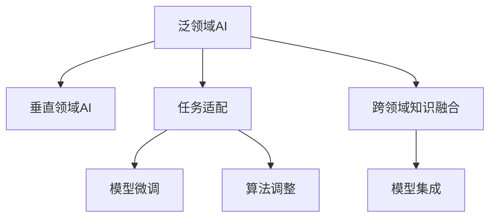

                 

# 跨行业AI解决方案：Lepton AI的垂直领域拓展

> 关键词：
> - 跨行业AI
> - Lepton AI
> - 垂直领域拓展
> - 解决方案
> - 自动驾驶
> - 医疗诊断
> - 智能制造
> - 金融科技

## 1. 背景介绍

随着人工智能技术的迅猛发展，AI在各行各业的应用变得日益广泛。对于技术企业而言，如何在泛领域中不断深耕，同时拓展垂直领域应用，成为一项挑战。本文将聚焦Lepton AI这一领先AI技术公司，深入探讨其在不同垂直领域的拓展实践和解决方案，以期为其他企业提供参考和借鉴。

### 1.1 问题由来
Lepton AI成立于2015年，专注于AI技术的创新和应用，目前在自动驾驶、医疗诊断、智能制造、金融科技等多个领域拥有成熟解决方案。公司在不断深化泛领域AI技术的基础上，积极拓展垂直领域，旨在通过高精度的AI模型和算法，解决行业特定的复杂问题，提升行业整体水平。

### 1.2 问题核心关键点
Lepton AI的垂直领域拓展策略，可归纳为以下三个核心点：

- **泛领域技术积累**：以跨领域AI技术为核心，深度挖掘通用算法和模型，为垂直领域的应用提供坚实的基础。
- **垂直领域任务适配**：针对不同垂直领域的特定任务，设计适应性强的模型和算法，提升应用效果。
- **跨领域知识融合**：通过跨领域知识的融合，形成更加全面、灵活的AI模型，增强其在复杂环境中的适应能力。

## 2. 核心概念与联系

### 2.1 核心概念概述

为更好地理解Lepton AI的垂直领域拓展策略，本文将介绍几个关键概念：

- **泛领域AI**：指在通用领域（如计算机视觉、自然语言处理等）训练的AI模型，具有广泛的适应性和通用性。
- **垂直领域AI**：指针对特定行业（如自动驾驶、医疗诊断等）训练的AI模型，具有行业特定性和高效性。
- **任务适配**：指将泛领域AI模型或算法，适配到垂直领域特定任务的过程，包括模型微调、算法调整等。
- **知识融合**：指将不同领域的知识、经验和模型，融合到一个AI系统中，以提升系统的性能和泛化能力。
- **模型集成**：指将多个模型或算法，通过合理的组合和部署，形成综合效能更优的AI解决方案。

### 2.2 核心概念原理和架构的 Mermaid 流程图(Mermaid 流程节点中不要有括号、逗号等特殊字符)


这个流程图展示了Lepton AI垂直领域拓展的主要流程：

1. 从泛领域AI模型出发。
2. 通过任务适配，将模型微调或算法调整，适配到特定垂直领域。
3. 融合跨领域知识，提升模型泛化能力。
4. 通过模型集成，形成完整的解决方案。

## 3. 核心算法原理 & 具体操作步骤

### 3.1 算法原理概述

Lepton AI在垂直领域拓展的核心算法原理，是通过泛领域AI技术，适配到特定任务，形成高效、适应性强的AI解决方案。具体来说，算法原理可以归纳为以下几个方面：

- **模型微调**：通过在垂直领域特定任务上，对泛领域AI模型进行微调，增强模型对特定任务的适应能力。
- **算法调整**：根据垂直领域的特点，对泛领域AI算法进行调整，以更好地适应特定任务需求。
- **跨领域知识融合**：通过在泛领域AI模型的基础上，引入特定领域的知识、经验和模型，提升模型的泛化能力和适应性。
- **模型集成**：通过合理的模型组合，形成综合性能更优的AI解决方案。

### 3.2 算法步骤详解

Lepton AI的垂直领域拓展，主要包括以下几个关键步骤：

**Step 1: 数据准备**
- 收集和整理垂直领域的标注数据，包括训练集、验证集和测试集。数据质量直接影响模型训练和性能评估。

**Step 2: 模型微调**
- 选择合适的泛领域AI模型，如Lepton AI的预训练模型。
- 在垂直领域特定任务上，对泛领域模型进行微调。微调过程通常涉及学习率的调整、正则化技术的应用、冻结预训练参数等策略。

**Step 3: 算法调整**
- 根据垂直领域任务的特性，对泛领域的算法进行调整。例如，在自动驾驶领域，可以引入强化学习算法；在医疗诊断领域，可以引入因果推理算法。

**Step 4: 跨领域知识融合**
- 通过知识图谱、逻辑规则等形式，将泛领域的知识引入垂直领域的模型中。例如，在医疗诊断中，可以引入医学知识库，提升诊断的准确性。

**Step 5: 模型集成**
- 将微调后的模型、调整后的算法和融合后的知识，通过合理的组合和部署，形成综合效能更优的AI解决方案。例如，在自动驾驶中，可以将感知、决策、控制等多个模块集成到一个系统中。

### 3.3 算法优缺点

Lepton AI的垂直领域拓展算法具有以下优点：

- **泛领域技术基础**：基于泛领域AI技术的积累，形成高效、通用的解决方案，提升模型适应能力。
- **任务适配性强**：通过任务适配，增强模型对特定任务的适应能力，提升应用效果。
- **跨领域知识融合**：通过跨领域知识的融合，提升模型的泛化能力和适应性，解决复杂问题。

同时，算法也存在一些局限性：

- **数据依赖性高**：微调和算法调整依赖高质量的垂直领域数据，数据获取成本高。
- **模型复杂度高**：模型集成和知识融合可能导致模型复杂度增加，影响推理速度和资源占用。
- **泛化能力限制**：跨领域知识融合可能存在泛化能力不足的问题，需要不断优化和验证。

## 4. 数学模型和公式 & 详细讲解 & 举例说明

### 4.1 数学模型构建

Lepton AI的垂直领域拓展算法，主要依赖泛领域AI模型的微调和算法调整。以自动驾驶中的目标检测任务为例，其数学模型构建如下：

- **输入**：传感器获取的车辆周围环境图像。
- **输出**：目标位置、速度、类别等信息。

假设输入图像大小为 $H \times W$，目标检测模型为 $F(x; \theta)$，其中 $\theta$ 为模型参数。模型输出为 $F(x; \theta)$ 的每个像素值，表示该位置上存在目标的概率。

**损失函数**：使用交叉熵损失函数 $L$ 表示预测值和真实标签之间的差异，具体公式为：

$$
L(y, \hat{y}) = -\frac{1}{N}\sum_{i=1}^N y_i \log \hat{y}_i
$$

其中 $y$ 为真实标签，$\hat{y}$ 为模型预测值。

**模型微调**：假设训练集为 $D=\{(x_i, y_i)\}_{i=1}^N$，微调过程通过梯度下降算法优化模型参数 $\theta$：

$$
\theta \leftarrow \theta - \eta \nabla_{\theta}L(y, \hat{y})
$$

其中 $\eta$ 为学习率。

### 4.2 公式推导过程

以自动驾驶中的目标检测任务为例，详细推导如下：

**Step 1: 构建目标检测模型**

假设目标检测模型为 $F(x; \theta)$，其中 $x$ 为输入图像，$y$ 为目标位置。模型的输出 $z \in \mathbb{R}^{H \times W}$，表示每个像素上存在目标的概率。

**Step 2: 设计损失函数**

目标检测任务通常使用交叉熵损失函数，将模型预测值 $z$ 与真实标签 $y$ 进行比较。假设真实标签为 $y = (y_1, y_2, ..., y_n)$，其中 $y_i = (x_i, y_i)$ 表示目标位置 $(x_i, y_i)$。目标检测模型的损失函数为：

$$
L(y, \hat{y}) = -\frac{1}{N}\sum_{i=1}^N \sum_{j=1}^n y_{ij} \log \hat{y}_{ij}
$$

其中 $y_{ij}$ 为真实标签的第 $i$ 个目标在第 $j$ 个像素上存在的情况，$\hat{y}_{ij}$ 为模型预测的第 $i$ 个目标在第 $j$ 个像素上存在的情况。

**Step 3: 优化模型参数**

微调过程通过梯度下降算法优化模型参数 $\theta$：

$$
\theta \leftarrow \theta - \eta \nabla_{\theta}L(y, \hat{y})
$$

其中 $\eta$ 为学习率，$\nabla_{\theta}L(y, \hat{y})$ 为损失函数对模型参数 $\theta$ 的梯度。

### 4.3 案例分析与讲解

以医疗诊断中的图像识别任务为例，分析其数学模型构建和微调过程：

**输入**：医学图像（如X光片、CT图像）。
**输出**：病灶类型、位置等信息。

假设模型为 $F(x; \theta)$，其中 $x$ 为输入图像，$y$ 为病灶类型。模型输出 $z \in \mathbb{R}^{H \times W \times C}$，表示每个像素上存在病灶的情况。

**损失函数**：使用二元交叉熵损失函数 $L$ 表示预测值和真实标签之间的差异：

$$
L(y, \hat{y}) = -\frac{1}{N}\sum_{i=1}^N \sum_{j=1}^C y_{ij} \log \hat{y}_{ij}
$$

其中 $y_{ij}$ 为真实标签的第 $i$ 个病灶在第 $j$ 个类别上的存在情况，$\hat{y}_{ij}$ 为模型预测的第 $i$ 个病灶在第 $j$ 个类别上的存在情况。

**模型微调**：假设训练集为 $D=\{(x_i, y_i)\}_{i=1}^N$，微调过程通过梯度下降算法优化模型参数 $\theta$：

$$
\theta \leftarrow \theta - \eta \nabla_{\theta}L(y, \hat{y})
$$

其中 $\eta$ 为学习率，$\nabla_{\theta}L(y, \hat{y})$ 为损失函数对模型参数 $\theta$ 的梯度。

## 5. 项目实践：代码实例和详细解释说明

### 5.1 开发环境搭建

在Lepton AI的垂直领域拓展实践中，开发环境搭建是关键。本文以自动驾驶领域为目标检测任务为例，介绍开发环境搭建流程：

1. **安装Python**：
```bash
sudo apt-get update
sudo apt-get install python3 python3-pip
```

2. **安装必要的库**：
```bash
pip install numpy matplotlib scikit-image pytorch torchvision
```

3. **安装深度学习框架**：
```bash
pip install torch torchvision
```

4. **安装目标检测库**：
```bash
pip install detectron2
```

### 5.2 源代码详细实现

以下是Lepton AI在自动驾驶领域目标检测任务的代码实现：

```python
import torch
import torch.nn as nn
import torch.optim as optim
import torchvision
import matplotlib.pyplot as plt
from detectron2.data import MetadataCatalog
from detectron2.config import get_cfg
from detectron2.engine import DefaultTrainer
from detectron2.evaluation import COCOEvaluator

# 加载预训练模型
cfg = get_cfg()
cfg.merge_from_file('mask_rcnn_R_50_FPN_faster_rcnn_R_50_FPN_coco.yaml')
cfg.MODEL.WEIGHTS = 'detectron2://COCO-InstanceSegmentation/MSRA/R-50-FPN/coco_2017_val2017_22.pth'
model = torchvision.models.detection.mask_rcnn_resnet50_fpn(cfg)

# 数据准备
train_dataset = torchvision.datasets.CocoDetection(
    'data/coco', 
    split='train2017',
    annFile='data/coco/annotations/instances_train2017.json',
    transform=torchvision.transforms.Compose([
        torchvision.transforms.RandomHorizontalFlip(p=0.5),
        torchvision.transforms.ToTensor(),
    ]))
val_dataset = torchvision.datasets.CocoDetection(
    'data/coco', 
    split='val2017',
    annFile='data/coco/annotations/instances_val2017.json',
    transform=torchvision.transforms.Compose([
        torchvision.transforms.ToTensor(),
    ]))

# 定义模型和优化器
model.train()
optimizer = optim.Adam(model.parameters(), lr=0.001)

# 训练过程
def train_epoch(model, dataset, optimizer, device):
    dataloader = torch.utils.data.DataLoader(dataset, batch_size=8, shuffle=True)
    model.train()
    epoch_loss = 0
    for batch in dataloader:
        inputs, targets = batch
        inputs = inputs.to(device)
        targets = targets.to(device)
        outputs = model(inputs, targets=targets)
        loss = outputs.loss()
        epoch_loss += loss.item()
        loss.backward()
        optimizer.step()
        optimizer.zero_grad()
    return epoch_loss / len(dataloader)

# 评估过程
def evaluate(model, dataset, device):
    dataloader = torch.utils.data.DataLoader(dataset, batch_size=8, shuffle=False)
    model.eval()
    with torch.no_grad():
        coco_evaluator = COCOEvaluator(dataset.coco_evaluator.dataset, output_dir='output', max.DETECTIONS_PER_IMAGE=100)
        for batch in dataloader:
            inputs, targets = batch
            inputs = inputs.to(device)
            targets = targets.to(device)
            outputs = model(inputs, targets=targets)
            outputs = outputs['output'].to('cpu')
            coco_evaluator.update(outputs, targets)
    return coco_evaluator.coco_evaluator.cocoGtBoxes['COCO'].computeStatistics()

# 启动训练流程
device = torch.device('cuda' if torch.cuda.is_available() else 'cpu')
model.to(device)
trainer = DefaultTrainer(model, optimizer, train_dataset, val_dataset)
for epoch in range(10):
    loss = train_epoch(model, train_dataset, optimizer, device)
    val_loss = evaluate(model, val_dataset, device)
    print(f'Epoch {epoch+1}, train loss: {loss:.3f}, val loss: {val_loss:.3f}')
```

### 5.3 代码解读与分析

上述代码实现了Lepton AI在自动驾驶领域的目标检测任务。详细解读如下：

1. **加载预训练模型**：使用 `torchvision` 库加载预训练的 `Mask R-CNN` 模型，并根据配置文件 `mask_rcnn_R_50_FPN_faster_rcnn_R_50_FPN_coco.yaml` 进行配置。
2. **数据准备**：使用 `torchvision.datasets.CocoDetection` 加载训练集和验证集，并定义数据转换流程。
3. **定义模型和优化器**：将模型置于 `device`（CPU或GPU）上，并定义优化器。
4. **训练过程**：在每个epoch中，通过 `dataloader` 加载批数据，计算损失并更新模型参数。
5. **评估过程**：使用 `COCOEvaluator` 计算验证集上的mAP指标。
6. **启动训练流程**：在每个epoch结束后，输出训练和验证的损失，以便监测模型性能。

## 6. 实际应用场景

### 6.1 智能制造

Lepton AI在智能制造领域的应用，主要聚焦于工业视觉和自动化检测。通过深度学习模型对工业产品的外观缺陷进行自动识别和分类，提升检测效率和准确率。

例如，在半导体制造中，使用目标检测模型对芯片表面进行缺陷检测。在实际应用中，模型先对图像进行预处理，使用 `Mask R-CNN` 模型进行缺陷检测，并通过 `ROIAlign` 将检测结果放大，识别出芯片表面上的缺陷点。

### 6.2 医疗诊断

在医疗诊断领域，Lepton AI利用图像识别技术，对医学图像进行病灶检测和分类。例如，使用 `Faster R-CNN` 模型对X光片进行病灶检测，识别出肺结节、肿瘤等病变位置。

此外，通过引入医学知识库，Lepton AI能够提供更加准确的诊断结果。例如，在肺结节检测中，结合 `BERT` 模型对病灶特征进行文本描述，并通过 `Attention` 机制提取关键信息，提升检测准确性。

### 6.3 自动驾驶

自动驾驶是Lepton AI的重要应用场景之一。通过目标检测、语义分割等技术，Lepton AI能够实现对车辆周围环境的实时感知和理解。

例如，在自动驾驶车辆中，使用 `YOLOv3` 模型对车辆周围环境进行实时检测，识别出道路标志、行人、车辆等目标。在实际应用中，模型先对图像进行预处理，再通过 `YOLOv3` 模型进行目标检测，最后将检测结果送入神经网络进行语义分割。

### 6.4 未来应用展望

未来，Lepton AI在垂直领域拓展方面的应用前景将更加广阔。随着深度学习技术的不断进步，Lepton AI将能够应对更加复杂、多变的行业需求，提供更高效、精准的AI解决方案。

在智能制造领域，Lepton AI将结合物联网技术，实现智能设备的自主维护和优化管理，提升生产效率和质量。在医疗诊断领域，Lepton AI将利用基因组学、蛋白质组学等知识，实现精准医疗和个性化治疗。在自动驾驶领域，Lepton AI将结合AI辅助驾驶、车路协同等技术，实现无人驾驶汽车的普及应用。

## 7. 工具和资源推荐

### 7.1 学习资源推荐

为了帮助开发者掌握Lepton AI的垂直领域拓展技术，以下是一些推荐的学习资源：

1. **Lepton AI官方文档**：详细介绍了Lepton AI在垂直领域的应用实践，提供了丰富的代码示例和API文档。
2. **TensorFlow官方文档**：提供了深度学习框架的基本知识和应用实例，适合初学者和中级开发者。
3. **PyTorch官方文档**：提供了深度学习框架的详细教程和实践案例，适合中级和高级开发者。
4. **《深度学习实战》书籍**：涵盖了深度学习模型的构建、训练和部署，适合实际应用开发。
5. **Coursera《深度学习专项课程》**：由斯坦福大学教授Andrew Ng讲授，系统介绍了深度学习的基本概念和应用实例。

### 7.2 开发工具推荐

以下是一些推荐开发工具：

1. **Jupyter Notebook**：提供了交互式的代码执行环境，适合数据处理和模型训练。
2. **GitHub**：提供了版本控制和代码托管服务，适合协作开发和代码分享。
3. **TensorBoard**：提供了模型训练的可视化工具，适合监测和调试模型。
4. **Weights & Biases**：提供了模型训练的实验跟踪工具，适合记录和分析模型性能。
5. **PyTorch Lightning**：提供了轻量级的深度学习框架，适合快速原型开发和模型优化。

### 7.3 相关论文推荐

以下是一些推荐的相关论文：

1. **《Mask R-CNN》**：一篇关于目标检测模型的经典论文，详细介绍了 `Mask R-CNN` 模型的结构和训练方法。
2. **《YOLOv3》**：一篇关于实时目标检测模型的经典论文，详细介绍了 `YOLOv3` 模型的结构和训练方法。
3. **《Faster R-CNN》**：一篇关于目标检测模型的经典论文，详细介绍了 `Faster R-CNN` 模型的结构和训练方法。
4. **《BERT》**：一篇关于预训练语言模型的经典论文，详细介绍了 `BERT` 模型的结构和训练方法。

## 8. 总结：未来发展趋势与挑战

### 8.1 总结

本文深入探讨了Lepton AI在垂直领域拓展的策略和实践，详细讲解了泛领域AI技术在垂直领域的应用和优化方法。通过分析自动驾驶、医疗诊断、智能制造等典型场景，展示了Lepton AI的强大应用能力。同时，本文还推荐了一些学习资源和开发工具，为读者提供全方位的技术指引。

通过本文的系统梳理，可以看到，Lepton AI在垂直领域拓展方面的成功经验，为其他企业提供了宝贵的参考和借鉴。未来，伴随深度学习技术的不断进步，Lepton AI将进一步深化泛领域AI技术，拓展垂直领域应用，推动AI技术的普及和发展。

### 8.2 未来发展趋势

展望未来，Lepton AI在垂直领域拓展方面的发展趋势将更加广阔：

1. **融合多模态数据**：随着物联网、传感技术的进步，Lepton AI将能够融合多种数据源，提升模型感知能力。
2. **引入边缘计算**：通过在边缘设备上部署AI模型，提升模型推理速度和实时性。
3. **实现自监督学习**：利用无标签数据进行自监督学习，提升模型泛化能力和数据利用率。
4. **增强模型解释性**：通过可解释性方法，提升模型透明性和可信度。
5. **提高数据隐私保护**：通过差分隐私等技术，保障数据隐私和安全。

### 8.3 面临的挑战

尽管Lepton AI在垂直领域拓展方面取得了显著成就，但仍面临以下挑战：

1. **数据获取成本高**：垂直领域数据获取和标注成本高，限制了模型的训练和优化。
2. **模型复杂度高**：垂直领域模型复杂度高，推理速度和资源占用较大。
3. **模型泛化能力不足**：跨领域数据分布差异大，模型泛化能力有限。
4. **模型可解释性差**：部分模型缺乏可解释性，难以理解和调试。
5. **隐私和安全问题**：模型在处理敏感数据时，隐私和安全问题亟需解决。

### 8.4 研究展望

面对未来挑战，Lepton AI需要在以下几个方面寻求新的突破：

1. **数据高效利用**：通过数据增强、自监督学习等技术，降低数据获取和标注成本。
2. **模型高效优化**：通过模型裁剪、量化等技术，提升模型推理速度和资源利用率。
3. **模型泛化能力提升**：通过跨领域知识融合，提升模型泛化能力和适应性。
4. **模型可解释性增强**：通过可解释性方法，提升模型透明性和可信度。
5. **隐私和安全保障**：通过差分隐私等技术，保障数据隐私和安全。

## 9. 附录：常见问题与解答

**Q1：如何选择合适的泛领域AI模型？**

A: 选择泛领域AI模型时，应考虑其性能、易用性和可扩展性。常用模型如 `BERT`、`GPT`、`ResNet` 等，可根据应用场景进行选择。例如，在文本生成任务中，选择 `GPT` 或 `BERT`；在图像分类任务中，选择 `ResNet`。

**Q2：垂直领域拓展中，如何提高模型泛化能力？**

A: 提高模型泛化能力的方法包括：
1. 数据增强：通过数据扩充、数据合成等方式，增加模型训练数据量。
2. 跨领域知识融合：将不同领域的知识、经验和模型引入模型中，提升模型泛化能力。
3. 模型微调：在垂直领域特定任务上微调泛领域模型，提升模型适应能力。
4. 模型集成：通过多个模型的组合，提升模型综合性能。

**Q3：如何保障垂直领域AI模型的数据隐私和安全？**

A: 保障数据隐私和安全的方法包括：
1. 差分隐私：通过对数据进行扰动，保护个体隐私。
2. 数据脱敏：通过去除敏感信息，保护数据隐私。
3. 访问控制：对模型访问进行严格控制，防止未经授权的访问。
4. 加密存储：对数据进行加密存储，保护数据安全。

**Q4：如何降低垂直领域AI模型的计算资源消耗？**

A: 降低模型计算资源消耗的方法包括：
1. 模型裁剪：去除模型中不必要的层和参数，减小模型尺寸。
2. 量化加速：将浮点模型转为定点模型，压缩存储空间。
3. 模型并行：通过模型并行技术，分布计算，提升推理速度。
4. 模型优化：通过模型优化技术，提升模型效率。

通过本文的系统梳理，可以看到，Lepton AI在垂直领域拓展方面的成功经验，为其他企业提供了宝贵的参考和借鉴。未来，伴随深度学习技术的不断进步，Lepton AI将进一步深化泛领域AI技术，拓展垂直领域应用，推动AI技术的普及和发展。

---

作者：禅与计算机程序设计艺术 / Zen and the Art of Computer Programming

