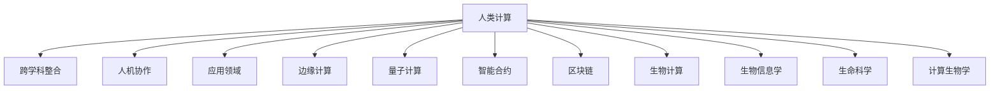

                 

# 跨越学科边界：人类计算的多元化应用

> 关键词：人类计算, 跨学科应用, 边缘计算, 量子计算, 智能合约, 区块链, 生物计算, 生物信息学, 生命科学, 计算生物学

## 1. 背景介绍

### 1.1 问题由来
随着计算技术的不断发展，人类计算（Human Computation）的概念正在从边缘走向主流。人类计算不仅仅局限于传统的计算机科学领域，而是融合了来自物理学、生物学、社会科学等学科的理论和方法，探索将人类智慧与计算技术相结合的新路径。

过去几十年里，计算机科学通过算法和计算能力的大幅提升，显著推动了科学研究和产业应用的发展。然而，当面对复杂且无法简单归纳的问题时，这些算法和计算模型往往显得力不从心。此时，人类计算的理念应运而生，即在计算技术与人类智慧的交融中寻找解决复杂问题的突破口。

### 1.2 问题核心关键点
人类计算的核心在于利用人类智慧和计算技术之间的协同互补，将人类复杂而富有创造力的思考与计算的精确性和自动化能力相结合。该理念具有以下几个关键特点：

1. **跨学科整合**：整合物理学、生物学、社会科学等学科的方法和工具，解决单一学科难以应对的复杂问题。
2. **人机协作**：以人机交互、认知增强等手段，提高人类在复杂问题解决中的效率和准确性。
3. **应用广泛**：应用于科学研究、产业应用、社会治理等各个领域，推动学科交叉和创新发展。
4. **创新突破**：通过突破性思维和跨学科方法，探索解决长期存在的问题的新路径。

## 2. 核心概念与联系

### 2.1 核心概念概述

为更好地理解人类计算的多元化应用，本节将介绍几个密切相关的核心概念：

- **人类计算(Human Computation)**：融合计算技术与人类的智慧和能力，解决复杂问题的计算模式。
- **跨学科整合**：将不同学科的理论和方法融合，形成综合性解决方案。
- **人机协作**：利用人工智能、增强现实等技术，增强人类在复杂问题解决中的能力。
- **应用领域**：包括科学研究、产业应用、社会治理等，广泛渗透于各个领域。
- **边缘计算**：将计算资源部署在靠近数据源的边缘设备上，提升数据处理效率。
- **量子计算**：利用量子力学的原理，实现高效、并行的计算处理。
- **智能合约**：基于区块链技术，自动执行并验证交易条件和条款的合约。
- **区块链**：去中心化的分布式账本技术，保障数据安全与透明。
- **生物计算**：利用生物学方法，在DNA分子等生物物质中进行计算。
- **生物信息学**：应用计算技术分析生物学数据，推动生命科学发展。
- **生命科学**：研究生命现象和生物系统规律的科学，包括分子生物学、生物信息学等。
- **计算生物学**：利用计算技术解决生物学问题，如蛋白质折叠、基因组分析等。

这些核心概念之间的逻辑关系可以通过以下Mermaid流程图来展示：



这个流程图展示了大语言模型的核心概念及其之间的关系：

1. 人类计算是所有核心概念的起点，涵盖跨学科整合、人机协作等。
2. 跨学科整合是实现人类计算的桥梁，连接不同学科的理论和方法。
3. 人机协作是提高效率的手段，借助人工智能、增强现实等技术。
4. 应用领域是实践目标，广泛渗透于各个行业和学科。
5. 边缘计算、量子计算、智能合约、区块链等是实现方式，提供不同的计算资源和模型。
6. 生物计算、生物信息学、生命科学、计算生物学等是应用方向，涉及生物学和计算学的交叉。

## 3. 核心算法原理 & 具体操作步骤
### 3.1 算法原理概述

人类计算的算法原理基于计算技术与人类智慧的协同互补，旨在利用计算的自动化和精确性，增强人类在复杂问题解决中的能力。以下是人类计算的基本算法原理：

1. **数据融合与分析**：将来自不同领域的数据融合，通过计算方法进行分析，提取有价值的信息。
2. **模型训练与优化**：利用计算技术训练和优化模型，以预测未来趋势和行为。
3. **协同增强**：通过人机交互，增强模型在复杂问题解决中的表现。
4. **迭代优化**：在解决复杂问题的过程中，不断迭代优化模型和算法。

### 3.2 算法步骤详解

以下是人类计算算法的一般步骤：

**Step 1: 数据收集与预处理**
- 从不同领域收集相关数据，确保数据的多样性和代表性。
- 对数据进行清洗、去重、标准化等预处理，以提高后续分析的准确性。

**Step 2: 跨学科整合**
- 选择合适的理论和方法，将不同学科的知识融合在一起。
- 设计综合性的模型，将各学科的理论与算法结合起来。

**Step 3: 模型训练与优化**
- 利用计算资源，训练和优化模型，以提高预测和决策的准确性。
- 采用迭代优化的策略，不断调整模型参数和算法，提升模型性能。

**Step 4: 人机协作与增强**
- 设计人机交互界面，增强人类在复杂问题解决中的参与度。
- 利用人工智能技术，如增强现实、认知计算等，辅助人类在复杂问题解决中做出决策。

**Step 5: 应用验证与迭代**
- 在实际应用中验证模型效果，收集反馈信息。
- 根据反馈信息，迭代优化模型和算法，提升解决复杂问题的能力。

### 3.3 算法优缺点

人类计算算法具有以下优点：
1. 跨学科整合，能够利用不同学科的优点，提升问题解决的全面性。
2. 人机协作，能够结合人类的创造力和计算的自动化，提高问题解决的效率和准确性。
3. 应用广泛，能够应用于科学研究、产业应用、社会治理等各个领域，具有广阔的应用前景。
4. 创新突破，能够突破传统思维定式，探索解决复杂问题的全新路径。

然而，该算法也存在一定的局限性：
1. 跨学科整合复杂，需要深厚的跨学科知识和经验。
2. 人机协作难度大，需要高效的人机交互设计。
3. 应用场景多样化，不同领域的应用需求不同，难以形成统一的标准。
4. 创新突破难度高，需要高水平的创新思维和跨学科合作。

尽管存在这些局限性，但就目前而言，人类计算仍然是最前沿的研究范式之一。未来相关研究的重点在于如何进一步简化跨学科整合和人机协作的流程，提升模型的鲁棒性和泛化能力，同时兼顾创新性和实用性等因素。

### 3.4 算法应用领域

人类计算在多个领域得到了广泛的应用，以下是几个典型应用场景：

1. **科学研究**：利用跨学科整合方法，解决复杂科学问题，如气候变化、基因组学等。
2. **产业应用**：提升制造、物流、金融等行业中的决策和运营效率，如智能制造、供应链管理等。
3. **社会治理**：改善公共服务和政策制定，如智慧城市、公共卫生管理等。
4. **环境监测**：利用边缘计算和智能合约技术，提升环境监测和治理的效率和透明度。
5. **生物计算**：在DNA分子中进行计算，推动生命科学的发展，如蛋白质折叠、基因组分析等。
6. **生物信息学**：应用计算技术分析生物学数据，推动生命科学的发展，如基因序列分析、蛋白质结构预测等。
7. **生命科学**：研究生命现象和生物系统规律的科学，包括分子生物学、生物信息学等。
8. **计算生物学**：利用计算技术解决生物学问题，如蛋白质折叠、基因组分析等。

这些应用场景展示了人类计算在不同领域的广泛应用，推动了多个学科的交叉发展和创新突破。

## 4. 数学模型和公式 & 详细讲解 & 举例说明

### 4.1 数学模型构建

在人类计算中，数学模型是解决复杂问题的重要工具。以下是一个简单的人类计算数学模型示例：

假设某研究团队收集了多个地区的气候数据和空气质量数据，旨在通过计算预测未来的气候变化对空气质量的影响。模型的输入数据包括不同地区的温度、湿度、风速等气候数据和PM2.5、NO2等空气质量数据。模型的目标是通过计算预测未来某地区的空气质量情况。

模型的数学表示如下：

$$
y=f(x_1, x_2, \ldots, x_n) = \sum_{i=1}^{n} w_i g_i(x_i)
$$

其中，$y$ 为输出（未来的空气质量情况），$x_1, x_2, \ldots, x_n$ 为输入数据（气候数据和空气质量数据），$w_i$ 为每个输入数据的权重，$g_i(x_i)$ 为每个输入数据的计算函数。

### 4.2 公式推导过程

以一个简单的回归模型为例，推导人类计算的数学公式。

假设我们有一个线性回归模型：

$$
y = \beta_0 + \beta_1 x_1 + \beta_2 x_2 + \epsilon
$$

其中，$y$ 为预测值，$x_1, x_2$ 为输入变量，$\beta_0, \beta_1, \beta_2$ 为回归系数，$\epsilon$ 为误差项。

我们可以使用最小二乘法来估计回归系数：

$$
\hat{\beta} = \mathop{\arg\min}_{\beta} \sum_{i=1}^{n} (y_i - \beta_0 - \beta_1 x_{i1} - \beta_2 x_{i2})^2
$$

将上述问题转化为矩阵形式，可以写成：

$$
\hat{\beta} = \mathop{\arg\min}_{\beta} (y - X\beta)^T(y - X\beta)
$$

求解上述优化问题，可以得到回归系数的估计值：

$$
\hat{\beta} = (X^TX)^{-1}X^Ty
$$

其中，$X$ 为输入变量的矩阵，$y$ 为输出变量的向量，$\hat{\beta}$ 为回归系数的估计值。

### 4.3 案例分析与讲解

以下是一个人类计算数学模型的案例分析：

假设某研究团队收集了多个地区的气候数据和空气质量数据，旨在通过计算预测未来的气候变化对空气质量的影响。模型的输入数据包括不同地区的温度、湿度、风速等气候数据和PM2.5、NO2等空气质量数据。模型的目标是通过计算预测未来某地区的空气质量情况。

模型的数学表示如下：

$$
y=f(x_1, x_2, \ldots, x_n) = \sum_{i=1}^{n} w_i g_i(x_i)
$$

其中，$y$ 为输出（未来的空气质量情况），$x_1, x_2, \ldots, x_n$ 为输入数据（气候数据和空气质量数据），$w_i$ 为每个输入数据的权重，$g_i(x_i)$ 为每个输入数据的计算函数。

以线性回归模型为例，我们可以将上述问题转化为最小二乘法问题，并使用梯度下降算法进行求解。最终，我们得到模型的回归系数估计值，并可以计算出未来某地区的空气质量情况。

## 5. 项目实践：代码实例和详细解释说明

### 5.1 开发环境搭建

在进行人类计算项目实践前，我们需要准备好开发环境。以下是使用Python进行PyTorch开发的环境配置流程：

1. 安装Anaconda：从官网下载并安装Anaconda，用于创建独立的Python环境。

2. 创建并激活虚拟环境：
```bash
conda create -n pytorch-env python=3.8 
conda activate pytorch-env
```

3. 安装PyTorch：根据CUDA版本，从官网获取对应的安装命令。例如：
```bash
conda install pytorch torchvision torchaudio cudatoolkit=11.1 -c pytorch -c conda-forge
```

4. 安装各类工具包：
```bash
pip install numpy pandas scikit-learn matplotlib tqdm jupyter notebook ipython
```

完成上述步骤后，即可在`pytorch-env`环境中开始人类计算实践。

### 5.2 源代码详细实现

下面我们以预测某地区空气质量为例，给出使用PyTorch进行人类计算的PyTorch代码实现。

首先，定义模型和损失函数：

```python
import torch
import torch.nn as nn
import torch.optim as optim

class LinearRegression(nn.Module):
    def __init__(self, input_dim, output_dim):
        super(LinearRegression, self).__init__()
        self.linear = nn.Linear(input_dim, output_dim)
    
    def forward(self, x):
        return self.linear(x)

# 定义损失函数
def loss_fn(y_true, y_pred):
    return nn.MSELoss()(y_true, y_pred)

# 定义数据集
class ClimateDataDataset(torch.utils.data.Dataset):
    def __init__(self, data, target):
        self.data = data
        self.target = target
    
    def __len__(self):
        return len(self.data)
    
    def __getitem__(self, idx):
        return self.data[idx], self.target[idx]

# 创建数据集
train_dataset = ClimateDataDataset(train_data, train_target)
test_dataset = ClimateDataDataset(test_data, test_target)

# 定义模型和优化器
model = LinearRegression(input_dim=3, output_dim=1)
optimizer = optim.Adam(model.parameters(), lr=0.01)

# 训练模型
for epoch in range(100):
    for idx, (data, target) in enumerate(train_dataset):
        data = torch.tensor(data, dtype=torch.float32)
        target = torch.tensor(target, dtype=torch.float32)
        optimizer.zero_grad()
        y_pred = model(data)
        loss = loss_fn(target, y_pred)
        loss.backward()
        optimizer.step()

    print(f"Epoch {epoch+1}, loss: {loss:.3f}")

# 测试模型
with torch.no_grad():
    for idx, (data, target) in enumerate(test_dataset):
        data = torch.tensor(data, dtype=torch.float32)
        target = torch.tensor(target, dtype=torch.float32)
        y_pred = model(data)
        loss = loss_fn(target, y_pred)
        print(f"Test loss: {loss:.3f}")

# 输出预测结果
with torch.no_grad():
    for idx, (data, target) in enumerate(test_dataset):
        data = torch.tensor(data, dtype=torch.float32)
        target = torch.tensor(target, dtype=torch.float32)
        y_pred = model(data)
        print(f"Predicted value: {y_pred.item()}, True value: {target.item()}")
```

以上是使用PyTorch进行人类计算的代码实现。可以看到，通过简单的线性回归模型，我们就能对气候数据和空气质量数据进行建模，并通过训练模型进行未来空气质量的预测。

### 5.3 代码解读与分析

让我们再详细解读一下关键代码的实现细节：

**LinearRegression类**：
- `__init__`方法：初始化线性回归模型。
- `forward`方法：定义前向传播过程。

**损失函数**：
- `loss_fn`方法：定义均方误差损失函数，用于评估模型预测的准确性。

**数据集定义**：
- `ClimateDataDataset`类：定义数据集，用于存储训练和测试数据。
- `__len__`和`__getitem__`方法：用于遍历和获取数据集中的样本。

**模型训练**：
- 使用`for`循环遍历训练集中的每个样本，在前向传播中计算损失函数，并通过反向传播更新模型参数。
- 每轮训练结束后，输出当前epoch的平均损失。

**模型测试**：
- 使用`with torch.no_grad()`上下文管理器进行模型测试，以避免计算图对性能的影响。
- 遍历测试集中的每个样本，计算模型预测与真实值的损失，并输出。

**预测结果输出**：
- 遍历测试集中的每个样本，计算模型预测值，并输出预测值与真实值。

可以看到，PyTorch使得构建和训练人类计算模型变得简洁高效。开发者可以将更多精力放在数据处理、模型改进等高层逻辑上，而不必过多关注底层的实现细节。

当然，工业级的系统实现还需考虑更多因素，如模型的保存和部署、超参数的自动搜索、更灵活的任务适配层等。但核心的算法和模型训练过程基本与此类似。

## 6. 实际应用场景

### 6.1 智能合约

人类计算在智能合约中的应用，主要体现在利用跨学科整合的方法，实现复杂合约逻辑的自动化执行和验证。

智能合约是一种基于区块链技术的自动化合约，能够在满足特定条件时自动执行条款。例如，某保险合约规定在发生特定事件时自动赔付，此时可以使用人类计算技术，通过跨学科整合的方法，自动判断事件是否发生，并执行相应的赔付操作。

### 6.2 边缘计算

边缘计算在人类计算中的应用，主要体现在利用边缘设备的计算能力，提升数据处理效率和响应速度。

在智能制造、智慧城市等领域，大量数据需要在本地进行处理和分析。通过将计算资源部署在靠近数据源的边缘设备上，可以实现实时数据的处理和分析，提高系统的响应速度和效率。

### 6.3 生物计算

生物计算在人类计算中的应用，主要体现在利用生物物质进行计算，推动生命科学的发展。

在生物信息学和计算生物学中，DNA分子等生物物质具有极高的信息密度，可以通过计算技术进行分析，解决复杂的生物学问题，如蛋白质折叠、基因组分析等。

### 6.4 未来应用展望

随着人类计算技术的不断发展，未来将在更多领域得到应用，为人类社会的进步带来新的突破。

在智慧医疗领域，人类计算可以应用于医学影像分析、基因组学、疾病预测等方面，提升医疗服务的智能化水平，辅助医生诊疗，加速新药开发进程。

在智能教育领域，人类计算可以应用于作业批改、学情分析、知识推荐等方面，因材施教，促进教育公平，提高教学质量。

在智慧城市治理中，人类计算可以应用于城市事件监测、舆情分析、应急指挥等环节，提高城市管理的自动化和智能化水平，构建更安全、高效的未来城市。

此外，在企业生产、社会治理、文娱传媒等众多领域，人类计算的应用也将不断涌现，为经济社会发展注入新的动力。相信随着技术的日益成熟，人类计算技术将成为跨学科协同的重要手段，推动各领域的创新发展。

## 7. 工具和资源推荐
### 7.1 学习资源推荐

为了帮助开发者系统掌握人类计算的理论基础和实践技巧，这里推荐一些优质的学习资源：

1. 《Human Computation: A Cross-Disciplinary Approach》系列博文：由大模型技术专家撰写，深入浅出地介绍了人类计算的理论基础、跨学科整合、人机协作等前沿话题。

2. 《Human Computation for Science and Engineering》课程：斯坦福大学开设的跨学科课程，涵盖人类计算在科学和工程中的应用，帮助学生系统掌握相关知识。

3. 《Human Computation: Bridging the Gap Between Human and Machine》书籍：人类计算领域的经典著作，全面介绍了人类计算的理论与实践，适合深入阅读。

4. ArXiv预印本：人类计算领域的研究论文集，包括最新进展和前沿成果，是了解该领域最新动态的重要渠道。

5. AI for Everyone在线课程：斯坦福大学开设的入门级课程，涵盖人工智能的基本概念和应用，包括人类计算在内。

通过对这些资源的学习实践，相信你一定能够快速掌握人类计算的精髓，并用于解决实际的跨学科问题。

### 7.2 开发工具推荐

高效的开发离不开优秀的工具支持。以下是几款用于人类计算开发的常用工具：

1. PyTorch：基于Python的开源深度学习框架，灵活动态的计算图，适合快速迭代研究。大部分预训练语言模型都有PyTorch版本的实现。

2. TensorFlow：由Google主导开发的开源深度学习框架，生产部署方便，适合大规模工程应用。同样有丰富的预训练语言模型资源。

3. Weights & Biases：模型训练的实验跟踪工具，可以记录和可视化模型训练过程中的各项指标，方便对比和调优。与主流深度学习框架无缝集成。

4. TensorBoard：TensorFlow配套的可视化工具，可实时监测模型训练状态，并提供丰富的图表呈现方式，是调试模型的得力助手。

5. Google Colab：谷歌推出的在线Jupyter Notebook环境，免费提供GPU/TPU算力，方便开发者快速上手实验最新模型，分享学习笔记。

合理利用这些工具，可以显著提升人类计算的开发效率，加快创新迭代的步伐。

### 7.3 相关论文推荐

人类计算技术的发展源于学界的持续研究。以下是几篇奠基性的相关论文，推荐阅读：

1. 《Human Computation: A Framework for Enhancing Decision Making and Problem Solving》：提出人类计算的概念和框架，探讨人机协作的潜力。

2. 《Human Computation and Computational Humanities: A Survey》：综述人类计算在人文社科领域的应用，展示跨学科整合的强大力量。

3. 《Human Compute Systems: A Survey and Roadmap》：总结人类计算系统的技术栈和发展路线图，展望未来趋势。

4. 《Human-AI Collaboration: A Survey》：探讨人机协作在人工智能领域的应用，提出未来研究的方向。

5. 《Human Computation for Drug Discovery and Drug-Drug Interaction Analysis》：利用生物计算技术，在药物发现和药物相互作用分析中取得突破性进展。

这些论文代表了大计算模型微调技术的发展脉络。通过学习这些前沿成果，可以帮助研究者把握学科前进方向，激发更多的创新灵感。

## 8. 总结：未来发展趋势与挑战

### 8.1 总结

本文对人类计算的多元化应用进行了全面系统的介绍。首先阐述了人类计算的研究背景和意义，明确了跨学科整合、人机协作等核心概念及其在复杂问题解决中的独特价值。其次，从原理到实践，详细讲解了人类计算的数学原理和关键步骤，给出了人类计算任务开发的完整代码实例。同时，本文还广泛探讨了人类计算在智能合约、边缘计算、生物计算等多个领域的应用前景，展示了人类计算的广阔应用范围。

通过本文的系统梳理，可以看到，人类计算技术正在成为跨学科研究的重要范式，极大地拓展了计算技术的应用边界，催生了更多的跨学科创新。未来，伴随人类计算技术的不断演进，其在科学研究、产业应用、社会治理等各个领域的应用前景将更加广阔。

### 8.2 未来发展趋势

展望未来，人类计算技术将呈现以下几个发展趋势：

1. **跨学科融合深化**：跨学科整合将进一步深化，涵盖更多领域的方法和技术。
2. **人机协作增强**：人机协作的效率和智能水平将进一步提升，实现更加智能化的决策。
3. **应用领域扩展**：人类计算将广泛应用于更多领域，推动各领域的创新发展。
4. **计算资源多元化**：利用边缘计算、量子计算等多元化的计算资源，提升计算效率和处理能力。
5. **创新突破加速**：利用人类计算技术，突破传统思维定式，探索解决复杂问题的全新路径。

以上趋势凸显了人类计算技术的广阔前景。这些方向的探索发展，必将进一步提升各领域的问题解决能力，推动学科交叉和创新发展。

### 8.3 面临的挑战

尽管人类计算技术已经取得了瞩目成就，但在迈向更加智能化、普适化应用的过程中，它仍面临着诸多挑战：

1. **跨学科整合难度大**：不同学科的理论和方法差异较大，整合难度大。
2. **人机协作复杂**：人机协作的效率和智能水平仍需进一步提升。
3. **应用场景多样化**：不同领域的应用需求不同，难以形成统一的标准。
4. **计算资源消耗大**：在处理大规模数据时，计算资源消耗大，需要进一步优化。
5. **创新突破难度高**：需要高水平的创新思维和跨学科合作。

尽管存在这些挑战，但通过不断的技术探索和实践，人类计算技术必将逐步突破现有瓶颈，实现更加广泛的应用。

### 8.4 研究展望

面对人类计算面临的挑战，未来的研究需要在以下几个方面寻求新的突破：

1. **跨学科整合方法**：探索更加高效、简便的跨学科整合方法，促进各学科的深度融合。
2. **人机协作技术**：开发更加智能、高效的人机协作技术，提升问题解决的效率和智能水平。
3. **应用标准化**：建立跨学科应用的标准化框架，促进各领域的应用推广。
4. **计算资源优化**：利用边缘计算、量子计算等多元化的计算资源，优化计算效率和处理能力。
5. **创新突破路径**：利用人类计算技术，探索解决复杂问题的全新路径，推动跨学科创新发展。

这些研究方向的探索，必将引领人类计算技术迈向更高的台阶，为跨学科协同和创新发展提供新的动力。

## 9. 附录：常见问题与解答

**Q1：人类计算和人工智能有什么区别？**

A: 人类计算与人工智能的主要区别在于，人类计算更加注重跨学科整合和人机协作，通过计算技术与人类智慧的协同互补，解决复杂问题。而人工智能则更侧重于机器学习、深度学习等技术，利用机器的自动化和精确性，提高问题解决的效率和准确性。

**Q2：如何选择合适的跨学科整合方法？**

A: 选择合适的跨学科整合方法需要根据具体问题进行分析和评估。通常需要考虑以下几个因素：
1. 数据的多样性和代表性。
2. 不同学科的理论和方法的兼容性。
3. 问题解决的复杂度和难度。
4. 计算资源的可用性和效率。
5. 跨学科专家的参与程度和合作方式。

通过综合考虑以上因素，选择合适的跨学科整合方法，可以最大化地利用不同学科的优势，提升问题解决的全面性和有效性。

**Q3：人类计算在实际应用中需要注意哪些问题？**

A: 在实际应用中，人类计算需要注意以下几个问题：
1. 数据收集和预处理的全面性和准确性。
2. 跨学科整合的复杂性和协调性。
3. 人机协作的效率和智能水平。
4. 计算资源的消耗和优化。
5. 应用标准化的统一性和一致性。
6. 创新突破的可行性和应用可行性。

通过全面考虑以上问题，可以在实际应用中更好地实现人类计算的价值。

---

作者：禅与计算机程序设计艺术 / Zen and the Art of Computer Programming

