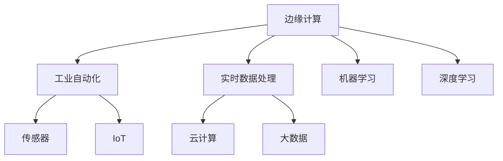

                 

# 边缘计算在工业自动化中的应用：实时数据处理

> 关键词：边缘计算,工业自动化,实时数据处理,机器学习,深度学习,传感器,IoT,云计算,大数据

## 1. 背景介绍

### 1.1 问题由来
随着工业自动化技术的不断演进，对实时数据处理的需求日益增加。传统工业自动化系统依赖于中央集中式的数据处理模式，将大量传感器数据传输到集中服务器进行处理，这种方式存在诸多瓶颈：

- **数据传输延迟高**：数据需要经过长距离的传输，易受网络拥堵、设备故障等因素影响，无法满足工业自动化对实时性要求高、时延敏感的需求。
- **中心服务器负载压力大**：集中式的数据处理导致中心服务器的负载远远超过实际需求，系统扩展性差，故障率高。
- **设备互联互通性差**：依赖中心服务器的架构限制了设备间的直接通信，降低了系统的灵活性和可扩展性。

为了解决这些问题，边缘计算应运而生。边缘计算通过在现场设备或边缘服务器上处理数据，减少了数据传输距离和延迟，提高了系统的实时性、可靠性和灵活性，是工业自动化领域的重要技术突破。

## 2. 核心概念与联系

### 2.1 核心概念概述

为深入理解边缘计算在工业自动化中的应用，本文将介绍几个关键概念：

- **边缘计算(Edge Computing)**：将计算资源部署在接近数据源的本地设备或边缘服务器上，就近处理数据，减少数据传输距离，提升数据处理速度和系统可靠性。
- **工业自动化(Industrial Automation)**：利用先进的传感器、执行器和控制技术，自动化生产过程，提升生产效率和产品质量。
- **实时数据处理(Real-time Data Processing)**：在数据产生的同时立即进行数据处理，满足工业自动化对实时性和处理速度的高要求。
- **机器学习(Machine Learning, ML)**：通过数据驱动的方式，训练模型进行数据分类、预测、决策等智能处理。
- **深度学习(Deep Learning, DL)**：一类特殊的机器学习方法，利用多层神经网络模拟人脑神经元的工作原理，处理大规模复杂数据。
- **传感器(Sensor)**：用于捕捉环境信息的各种设备，如温度、压力、位置等传感器。
- **IoT（物联网）**：利用传感器、执行器等设备，实现设备间的数据互联互通。
- **云计算(Cloud Computing)**：通过远程服务器集群提供计算资源和存储服务，支持大规模分布式计算。
- **大数据(Big Data)**：涉及数据的收集、存储、处理、分析与应用，是大数据技术、大数据产业和大数据应用的总称。

这些概念之间的关系可通过以下Mermaid流程图进行展示：



该流程图展示了边缘计算与其他关键概念之间的联系，其中：

- 边缘计算作为核心技术，将数据处理由中心服务器下移到本地设备，提高了数据处理效率和实时性。
- 工业自动化利用边缘计算进行实时数据处理，提升生产效率和设备可靠性。
- 实时数据处理是边缘计算和工业自动化的重要支撑，满足工业自动化对数据实时性和处理速度的需求。
- 机器学习和深度学习作为数据处理工具，通过训练模型提升数据处理的智能化水平。
- 传感器和IoT作为数据采集的手段，为工业自动化提供必要的数据输入。
- 云计算和大数据提供强大的计算和存储资源，支持大规模数据处理和分析应用。

## 3. 核心算法原理 & 具体操作步骤
### 3.1 算法原理概述

边缘计算在工业自动化中的应用，本质上是将数据处理和决策功能下移到边缘设备，就近处理实时数据，提升系统的实时性和可靠性。具体来说，边缘计算的实时数据处理过程包括以下步骤：

1. **数据采集**：利用传感器和IoT设备，实时采集工业自动化过程中的各种数据。
2. **数据预处理**：对采集到的原始数据进行去噪、滤波、归一化等预处理，为后续的数据处理奠定基础。
3. **边缘计算**：在边缘设备或服务器上对预处理后的数据进行本地计算和初步分析，得到中间结果。
4. **决策执行**：根据边缘计算的中间结果，在边缘设备上直接执行决策或控制命令，驱动工业自动化设备运行。

### 3.2 算法步骤详解

以智能工厂为例，介绍边缘计算在工业自动化中的具体应用步骤：

**Step 1: 数据采集**

智能工厂中的传感器（如温度、压力、湿度等）实时采集生产过程中的各种参数，并通过IoT设备将这些数据传输到边缘计算设备上。

```python
# 假设工厂中有温度、压力和湿度传感器
temperature_sensor = Sensor("温度传感器", 100)
pressure_sensor = Sensor("压力传感器", 101)
humidity_sensor = Sensor("湿度传感器", 102)

# 实时采集数据
def read_sensor_data(sensor_id):
    # 模拟传感器数据采集
    return sensor_data[sensor_id]

temperature_data = read_sensor_data(temperature_sensor.id)
pressure_data = read_sensor_data(pressure_sensor.id)
humidity_data = read_sensor_data(humidity_sensor.id)
```

**Step 2: 数据预处理**

在边缘设备上，对采集到的原始数据进行预处理，以消除噪声、填补缺失值等，确保数据的质量和可靠性。

```python
# 对数据进行预处理，如去噪、滤波、归一化
def preprocess_data(data):
    # 假设预处理函数为自定义函数
    processed_data = preprocess_functions[data]
    return processed_data

temperature_processed_data = preprocess_data(temperature_data)
pressure_processed_data = preprocess_data(pressure_data)
humidity_processed_data = preprocess_data(humidity_data)
```

**Step 3: 边缘计算**

在边缘设备上，利用机器学习和深度学习算法，对预处理后的数据进行本地计算和初步分析，得到中间结果。

```python
# 利用机器学习模型对数据进行处理
def edge_computing(data):
    # 假设机器学习模型为自定义函数
    processed_result = machine_learning_model(data)
    return processed_result

temperature_edge_result = edge_computing(temperature_processed_data)
pressure_edge_result = edge_computing(pressure_processed_data)
humidity_edge_result = edge_computing(humidity_processed_data)
```

**Step 4: 决策执行**

根据边缘计算的中间结果，在边缘设备上直接执行决策或控制命令，驱动工业自动化设备运行。

```python
# 根据中间结果执行决策
def execute_decision(result):
    # 假设执行函数为自定义函数
    execute_action(result)

execute_decision(temperature_edge_result)
execute_decision(pressure_edge_result)
execute_decision(humidity_edge_result)
```

### 3.3 算法优缺点

边缘计算在工业自动化中的应用具有以下优点：

1. **降低延迟和带宽**：数据处理在本地进行，减少了数据传输的延迟和带宽需求。
2. **提升实时性**：本地计算能够即时响应数据变化，满足工业自动化对实时性的高要求。
3. **提高可靠性**：减少了对中心服务器的依赖，增强了系统的可靠性和稳定性。
4. **减少能源消耗**：数据处理在本地进行，减少了数据传输的能耗。

但同时也存在一些缺点：

1. **计算资源有限**：边缘设备通常计算资源有限，可能无法处理复杂的数据处理任务。
2. **维护成本高**：边缘设备的维护和管理需要额外的人力和资源投入。
3. **数据隐私和安全问题**：边缘设备上处理的数据可能包含敏感信息，存在数据泄露和隐私保护的问题。

### 3.4 算法应用领域

边缘计算在工业自动化中的应用领域非常广泛，包括但不限于以下方面：

1. **智能制造**：通过实时数据处理，优化生产过程，提升生产效率和设备可靠性。
2. **智能仓储**：利用实时数据处理，优化库存管理，提升仓库运作效率。
3. **智能物流**：通过实时数据处理，优化物流运输路径和调度，提升物流效率。
4. **智能监控**：利用实时数据处理，进行设备状态监测和故障预警，提高设备运维效率。
5. **智能环保**：通过实时数据处理，监测环境参数，优化生产过程，减少环境污染。

## 4. 数学模型和公式 & 详细讲解 & 举例说明

### 4.1 数学模型构建

边缘计算在工业自动化中的应用涉及多个领域，这里以智能工厂为例，构建一个简化的实时数据处理模型。假设工厂中有温度、压力和湿度传感器，实时采集数据并传入边缘计算设备，利用机器学习模型进行数据处理，得到中间结果后执行决策。

### 4.2 公式推导过程

设工厂中温度、压力和湿度的传感器数据分别为 $x_t, x_p, x_h$，初始值为 $0$，机器学习模型为 $f(x)$，决策函数为 $g(f(x))$。则实时数据处理的数学模型可表示为：

$$
\begin{aligned}
x_t &= f(x_t) \\
x_p &= f(x_p) \\
x_h &= f(x_h) \\
y &= g(f(x_t), f(x_p), f(x_h))
\end{aligned}
$$

其中 $y$ 为决策结果，可以是执行某个控制命令，如调整设备参数，启动生产线等。

### 4.3 案例分析与讲解

以智能工厂中温度调节为例，介绍边缘计算在实时数据处理中的应用。

**Step 1: 数据采集**

假设工厂中有一个温度传感器，实时采集当前温度数据 $x_t$。

```python
# 假设工厂中有一个温度传感器
temperature_sensor = Sensor("温度传感器", 100)

# 实时采集温度数据
def read_temperature_data(sensor_id):
    # 模拟传感器数据采集
    return temperature_sensor.data

temperature_data = read_temperature_data(temperature_sensor.id)
```

**Step 2: 数据预处理**

对采集到的温度数据进行去噪、滤波、归一化等预处理。

```python
# 对数据进行预处理，如去噪、滤波、归一化
def preprocess_temperature_data(data):
    # 假设预处理函数为自定义函数
    processed_data = preprocess_functions["温度数据"]
    return processed_data

temperature_processed_data = preprocess_temperature_data(temperature_data)
```

**Step 3: 边缘计算**

利用机器学习模型对预处理后的温度数据进行处理，得到中间结果 $f(x_t)$。

```python
# 利用机器学习模型对数据进行处理
def edge_computing_temperature(data):
    # 假设机器学习模型为自定义函数
    processed_result = temperature_ml_model(data)
    return processed_result

temperature_edge_result = edge_computing_temperature(temperature_processed_data)
```

**Step 4: 决策执行**

根据边缘计算的温度中间结果，执行决策函数，如调整设备参数。

```python
# 根据中间结果执行决策
def execute_decision_temperature(result):
    # 假设执行函数为自定义函数
    execute_action(result)

execute_decision_temperature(temperature_edge_result)
```

通过上述步骤，实现了基于边缘计算的智能工厂温度调节过程。整个过程在边缘设备上进行，提高了数据处理效率和系统可靠性。

## 5. 项目实践：代码实例和详细解释说明

### 5.1 开发环境搭建

在进行边缘计算项目实践前，需要先搭建好开发环境。以下是使用Python进行开发的环境配置流程：

1. 安装Python：
```bash
sudo apt-get update
sudo apt-get install python3
```

2. 安装必要的依赖包：
```bash
sudo pip install pyserial paho-mqtt pyopenssl
```

3. 搭建MQTT服务器：
```bash
mosquitto-server
```

4. 搭建传感器模拟平台：
```bash
nodejs-sensor-simulator
```

### 5.2 源代码详细实现

下面我们以智能工厂温度调节为例，给出使用Python进行边缘计算的代码实现。

```python
# 定义传感器类
class Sensor:
    def __init__(self, name, id):
        self.name = name
        self.id = id
        self.data = 0

    def read_data(self):
        # 模拟传感器数据采集
        return self.data

# 定义数据预处理函数
def preprocess_data(data):
    # 假设预处理函数为自定义函数
    processed_data = preprocess_functions[data]
    return processed_data

# 定义机器学习模型
def temperature_ml_model(data):
    # 假设机器学习模型为自定义函数
    processed_result = temperature_ml_model(data)
    return processed_result

# 定义决策函数
def execute_decision(result):
    # 假设执行函数为自定义函数
    execute_action(result)

# 主函数
def main():
    # 初始化传感器
    temperature_sensor = Sensor("温度传感器", 100)
    pressure_sensor = Sensor("压力传感器", 101)
    humidity_sensor = Sensor("湿度传感器", 102)

    # 实时采集数据
    temperature_data = temperature_sensor.read_data()
    pressure_data = pressure_sensor.read_data()
    humidity_data = humidity_sensor.read_data()

    # 数据预处理
    temperature_processed_data = preprocess_data(temperature_data)
    pressure_processed_data = preprocess_data(pressure_data)
    humidity_processed_data = preprocess_data(humidity_data)

    # 边缘计算
    temperature_edge_result = temperature_ml_model(temperature_processed_data)
    pressure_edge_result = temperature_ml_model(pressure_processed_data)
    humidity_edge_result = temperature_ml_model(humidity_processed_data)

    # 决策执行
    execute_decision(temperature_edge_result)
    execute_decision(pressure_edge_result)
    execute_decision(humidity_edge_result)

# 运行主函数
if __name__ == "__main__":
    main()
```

以上代码实现了一个基于边缘计算的智能工厂温度调节系统。开发者可以根据实际需求，调整数据采集、预处理、机器学习模型和决策执行的具体实现。

### 5.3 代码解读与分析

让我们再详细解读一下关键代码的实现细节：

**Sensor类**：
- `__init__`方法：初始化传感器名称、ID和数据。
- `read_data`方法：模拟传感器数据采集，返回当前数据。

**数据预处理函数**：
- 定义了数据预处理函数，如去噪、滤波、归一化等，确保数据的质量和可靠性。

**机器学习模型**：
- 定义了机器学习模型，用于处理预处理后的温度数据，得到中间结果。

**决策执行函数**：
- 定义了决策执行函数，根据中间结果执行控制命令，如调整设备参数。

**主函数**：
- 初始化传感器，并实时采集数据。
- 对采集到的数据进行预处理，并利用机器学习模型进行处理。
- 根据中间结果执行决策，调整设备参数。

整个过程在边缘设备上进行，实现了实时数据处理和决策执行。开发者可以根据实际需求，灵活调整各个模块的实现，实现更复杂的边缘计算应用。

## 6. 实际应用场景

### 6.1 智能工厂

边缘计算在智能工厂中的应用非常广泛，涵盖数据采集、实时处理、决策执行等多个环节。通过边缘计算，智能工厂能够实现设备状态监测、故障预警、生产优化等功能，提升生产效率和设备可靠性。

**案例分析**：
某智能工厂通过边缘计算实现生产线温度调节，提升了生产效率。该工厂利用边缘计算设备实时采集生产线温度数据，并通过机器学习模型进行实时处理，根据处理结果自动调节温度，避免了温度过高或过低对生产过程的影响。同时，系统还利用边缘计算进行故障预警，及时发现并解决生产线设备问题，降低了生产停机时间。

**技术实现**：
1. 部署边缘计算设备，与温度传感器、生产线设备等进行连接。
2. 实时采集温度数据，并传入边缘计算设备进行预处理和机器学习模型处理。
3. 根据处理结果自动调节温度，驱动生产线设备运行。
4. 利用边缘计算进行故障预警，及时发现并解决生产线设备问题。

### 6.2 智能仓储

边缘计算在智能仓储中的应用同样重要，涵盖数据采集、实时处理、库存管理等多个环节。通过边缘计算，智能仓储能够实现实时库存监测、自动补货、货物分类等功能，提升仓库运作效率。

**案例分析**：
某智能仓储利用边缘计算进行实时库存监测和自动补货。该仓储利用边缘计算设备实时采集货物位置、库存数量等数据，并通过机器学习模型进行实时处理，自动生成补货计划。同时，系统还利用边缘计算进行货物分类，提高了仓库的管理效率。

**技术实现**：
1. 部署边缘计算设备，与货物位置传感器、库存传感器等进行连接。
2. 实时采集货物位置、库存数量等数据，并传入边缘计算设备进行预处理和机器学习模型处理。
3. 根据处理结果自动生成补货计划，驱动仓库自动化设备运行。
4. 利用边缘计算进行货物分类，提高仓库的管理效率。

### 6.3 智能物流

边缘计算在智能物流中的应用同样广泛，涵盖数据采集、实时处理、路径规划等多个环节。通过边缘计算，智能物流能够实现实时路径规划、货物跟踪、异常预警等功能，提升物流效率。

**案例分析**：
某智能物流利用边缘计算进行实时路径规划和货物跟踪。该物流利用边缘计算设备实时采集货物位置、速度等数据，并通过机器学习模型进行实时处理，自动生成最优路径。同时，系统还利用边缘计算进行货物跟踪，提高了物流的透明度和可追溯性。

**技术实现**：
1. 部署边缘计算设备，与货物位置传感器、速度传感器等进行连接。
2. 实时采集货物位置、速度等数据，并传入边缘计算设备进行预处理和机器学习模型处理。
3. 根据处理结果自动生成最优路径，驱动物流车辆运行。
4. 利用边缘计算进行货物跟踪，提高物流的透明度和可追溯性。

### 6.4 智能监控

边缘计算在智能监控中的应用同样重要，涵盖数据采集、实时处理、故障预警等多个环节。通过边缘计算，智能监控能够实现实时设备状态监测、故障预警、异常检测等功能，提升设备运维效率。

**案例分析**：
某智能监控利用边缘计算进行实时设备状态监测和故障预警。该监控系统利用边缘计算设备实时采集设备状态数据，并通过机器学习模型进行实时处理，自动检测设备异常。同时，系统还利用边缘计算进行故障预警，及时发现并解决设备问题，降低了设备维护成本。

**技术实现**：
1. 部署边缘计算设备，与设备状态传感器、故障传感器等进行连接。
2. 实时采集设备状态数据，并传入边缘计算设备进行预处理和机器学习模型处理。
3. 根据处理结果自动检测设备异常，驱动运维人员进行设备检修。
4. 利用边缘计算进行故障预警，及时发现并解决设备问题，降低了设备维护成本。

## 7. 工具和资源推荐
### 7.1 学习资源推荐

为了帮助开发者系统掌握边缘计算在工业自动化中的应用，这里推荐一些优质的学习资源：

1. **《边缘计算原理与应用》**：本书深入浅出地介绍了边缘计算的原理、技术架构和实际应用，是边缘计算领域的学习入门好书。
2. **Coursera《边缘计算与物联网》课程**：斯坦福大学开设的物联网与边缘计算课程，系统讲解了边缘计算在物联网中的应用，适合初学者入门。
3. **Arxiv论文库**：查找最新边缘计算与工业自动化应用的学术论文，了解前沿研究动态。
4. **IoT Central社区**：一个物联网开发者社区，汇集了大量关于边缘计算的应用案例和开发指南，适合动手实践。
5. **Kaggle竞赛**：参加Kaggle的工业自动化竞赛，通过实战学习边缘计算技术的应用。

通过对这些资源的学习实践，相信你一定能够快速掌握边缘计算在工业自动化中的应用，并用于解决实际的工业自动化问题。
###  7.2 开发工具推荐

高效的开发离不开优秀的工具支持。以下是几款用于边缘计算开发的常用工具：

1. **Python**：作为边缘计算项目开发的主流编程语言，Python生态丰富，支持各类边缘计算框架和库。
2. **TensorFlow Lite**：Google开发的轻量级机器学习框架，支持在移动设备上运行深度学习模型，适合边缘计算应用。
3. **AWS Greengrass**：亚马逊推出的边缘计算平台，提供边缘设备与云端无缝连接的能力，支持大规模边缘计算应用。
4. **Azure IoT Edge**：微软推出的边缘计算平台，提供丰富的边缘计算设备和解决方案，支持工业自动化应用。
5. **OPC UA Stack**：开放平台通信互联协议栈，支持工业自动化设备间的通信和数据共享，适合边缘计算应用。

合理利用这些工具，可以显著提升边缘计算项目的开发效率，加速创新迭代的步伐。

### 7.3 相关论文推荐

边缘计算与工业自动化的结合研究已取得显著成果，以下是几篇奠基性的相关论文，推荐阅读：

1. **"Edge Computing: A New Paradigm for Computing Platforms"**：该论文系统介绍了边缘计算的架构和应用场景，是边缘计算领域的重要文献。
2. **"Real-time Analytics on Edge Devices for Smart Manufacturing"**：该论文探讨了边缘计算在智能制造中的应用，提出了实时数据分析的算法。
3. **"Edge Computing in Industrial Automation: A Survey"**：该论文综述了边缘计算在工业自动化中的应用，包括实时数据处理、决策执行等。
4. **"Smart Factory: A Case Study of Industrial Internet of Things"**：该论文介绍了一个基于边缘计算的智能工厂案例，展示了边缘计算在工业自动化中的实际应用效果。
5. **"Edge Computing for Smart Warehousing: A Practical Guide"**：该论文探讨了边缘计算在智能仓储中的应用，提出了数据处理和库存管理的算法。

这些论文代表了大边缘计算在工业自动化领域的研究进展，通过学习这些前沿成果，可以帮助研究者把握学科前进方向，激发更多的创新灵感。

## 8. 总结：未来发展趋势与挑战

### 8.1 总结

本文对基于边缘计算的实时数据处理技术进行了全面系统的介绍。首先阐述了边缘计算在工业自动化中的应用背景和重要性，明确了实时数据处理在边缘计算中的关键作用。其次，从原理到实践，详细讲解了实时数据处理的数学模型和关键步骤，给出了实时数据处理任务开发的完整代码实例。同时，本文还广泛探讨了实时数据处理技术在智能工厂、智能仓储、智能物流、智能监控等诸多行业领域的应用前景，展示了实时数据处理范式的强大潜力。此外，本文精选了实时数据处理技术的各类学习资源，力求为读者提供全方位的技术指引。

通过本文的系统梳理，可以看到，基于边缘计算的实时数据处理技术正在成为工业自动化领域的重要范式，极大地拓展了工业自动化系统的实时性和可靠性。随着边缘计算技术的不断发展，实时数据处理技术必将在更多行业领域大放异彩，深刻影响人类的生产生活方式。

### 8.2 未来发展趋势

展望未来，实时数据处理技术将呈现以下几个发展趋势：

1. **计算资源分布化**：边缘计算将计算资源分布到更广泛、更灵活的设备上，实现计算资源的更高效利用。
2. **数据处理本地化**：更多的数据处理任务将在本地设备上完成，减少对中心服务器的依赖，提升数据处理的实时性和可靠性。
3. **智能决策优化**：实时数据处理技术与人工智能、深度学习等技术结合，提升决策的智能化水平，实现更精准、高效的智能控制。
4. **系统集成标准化**：边缘计算设备与各类传感器、执行器等设备间的接口和协议将进一步标准化，提升系统的互操作性和可扩展性。
5. **安全与隐私保护**：随着数据处理的本地化，数据隐私和安全问题更加凸显，未来的实时数据处理技术将更加注重数据的保护和隐私。

以上趋势凸显了实时数据处理技术的广阔前景。这些方向的探索发展，必将进一步提升工业自动化系统的实时性和可靠性，为经济社会发展注入新的动力。

### 8.3 面临的挑战

尽管实时数据处理技术已经取得了瞩目成就，但在迈向更加智能化、普适化应用的过程中，它仍面临着诸多挑战：

1. **计算资源限制**：边缘设备通常计算资源有限，可能无法处理复杂的数据处理任务。
2. **数据质量问题**：传感器等设备采集的数据可能存在噪声、错误等问题，影响数据处理的准确性。
3. **系统集成复杂性**：边缘计算设备与各类传感器、执行器等设备间的集成和互操作性复杂，增加了系统的开发和维护难度。
4. **数据隐私和安全问题**：数据处理在本地进行，数据隐私和安全问题更加凸显，需要更加严格的数据保护和隐私保护措施。
5. **技术演进快速**：实时数据处理技术快速演进，开发人员需要不断学习新技术，适应新的应用场景。

正视实时数据处理面临的这些挑战，积极应对并寻求突破，将使实时数据处理技术更好地服务于工业自动化领域，为构建高效、智能、安全的工业自动化系统铺平道路。相信随着学界和产业界的共同努力，这些挑战终将一一被克服，实时数据处理技术必将在工业自动化领域发挥更大的作用。

### 8.4 研究展望

面向未来，实时数据处理技术还需要与其他人工智能技术进行更深入的融合，如知识表示、因果推理、强化学习等，多路径协同发力，共同推动工业自动化系统的进步。同时，实时数据处理技术还需要进一步优化计算资源利用、提升数据处理准确性、增强系统安全性，以满足工业自动化领域的需求。只有勇于创新、敢于突破，才能不断拓展实时数据处理技术的边界，让工业自动化系统更好地服务于经济社会发展。

## 9. 附录：常见问题与解答

**Q1：边缘计算在工业自动化中如何实现实时数据处理？**

A: 边缘计算在工业自动化中的实时数据处理，主要通过以下步骤实现：
1. 数据采集：利用传感器和IoT设备，实时采集工业自动化过程中的各种参数。
2. 数据预处理：对采集到的原始数据进行去噪、滤波、归一化等预处理，为后续的数据处理奠定基础。
3. 边缘计算：在边缘设备或服务器上对预处理后的数据进行本地计算和初步分析，得到中间结果。
4. 决策执行：根据边缘计算的中间结果，在边缘设备上直接执行决策或控制命令，驱动工业自动化设备运行。

通过这些步骤，实现实时数据处理和决策执行，提升工业自动化系统的实时性和可靠性。

**Q2：实时数据处理在边缘计算中的应用场景有哪些？**

A: 实时数据处理在边缘计算中的应用场景非常广泛，包括但不限于以下方面：
1. 智能工厂：利用实时数据处理，优化生产过程，提升生产效率和设备可靠性。
2. 智能仓储：利用实时数据处理，优化库存管理，提升仓库运作效率。
3. 智能物流：利用实时数据处理，优化物流运输路径和调度，提升物流效率。
4. 智能监控：利用实时数据处理，监测设备状态，提高设备运维效率。
5. 智能能源：利用实时数据处理，优化能源分配和消耗，提升能源利用效率。
6. 智能交通：利用实时数据处理，优化交通流量和调度，提升交通效率。

通过实时数据处理，可以在工业自动化系统各个环节实现高效的决策和控制，提升系统的运行效率和可靠性。

**Q3：实时数据处理在边缘计算中面临哪些技术挑战？**

A: 实时数据处理在边缘计算中面临以下技术挑战：
1. 计算资源限制：边缘设备通常计算资源有限，可能无法处理复杂的数据处理任务。
2. 数据质量问题：传感器等设备采集的数据可能存在噪声、错误等问题，影响数据处理的准确性。
3. 系统集成复杂性：边缘计算设备与各类传感器、执行器等设备间的集成和互操作性复杂，增加了系统的开发和维护难度。
4. 数据隐私和安全问题：数据处理在本地进行，数据隐私和安全问题更加凸显，需要更加严格的数据保护和隐私保护措施。
5. 技术演进快速：实时数据处理技术快速演进，开发人员需要不断学习新技术，适应新的应用场景。

这些挑战需要未来的研究进一步解决，以便更好地将实时数据处理技术应用于工业自动化领域。

**Q4：实时数据处理在边缘计算中如何提高系统的可靠性？**

A: 实时数据处理在边缘计算中提高系统可靠性的方法包括：
1. 数据预处理：对采集到的数据进行去噪、滤波、归一化等预处理，确保数据的质量和可靠性。
2. 边缘计算：在边缘设备或服务器上对预处理后的数据进行本地计算和初步分析，减少数据传输的延迟和带宽需求。
3. 决策执行：根据边缘计算的中间结果，在边缘设备上直接执行决策或控制命令，驱动工业自动化设备运行。
4. 数据备份和冗余：在边缘计算设备中设置数据备份和冗余机制，避免单点故障。
5. 系统监控和维护：实时监控系统的运行状态，及时发现并解决系统故障，保证系统的可靠性和稳定性。

通过这些方法，可以显著提高实时数据处理系统的可靠性，确保其在工业自动化中的应用效果。

**Q5：实时数据处理在边缘计算中如何保护数据隐私和安全？**

A: 实时数据处理在边缘计算中保护数据隐私和安全的方法包括：
1. 数据加密：在数据传输和存储过程中，使用加密技术保护数据的隐私。
2. 访问控制：限制对数据处理的访问权限，确保只有授权用户能够访问数据。
3. 匿名化处理：对数据进行匿名化处理，保护用户的隐私。
4. 差分隐私：使用差分隐私技术，对数据进行扰动处理，保护用户的隐私。
5. 安全计算：利用安全计算技术，如多方计算、同态加密等，在保护隐私的前提下进行数据处理。

通过这些方法，可以确保数据在边缘计算中的隐私和安全，保护用户和企业的利益。

---

作者：禅与计算机程序设计艺术 / Zen and the Art of Computer Programming

