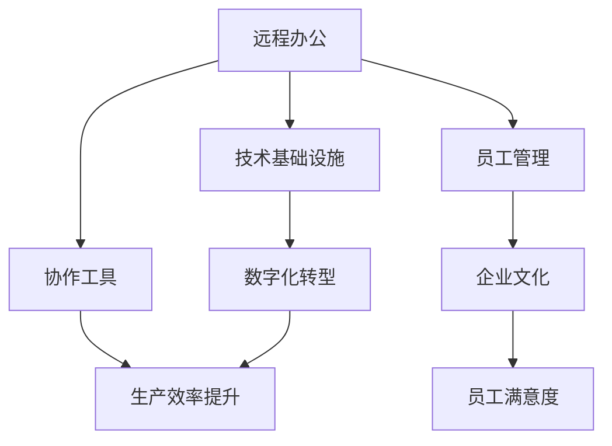

                 

# 远程办公创业：未来工作方式的探索者

> 关键词：远程办公,创业,生产力提升,员工满意,数字化转型

## 1. 背景介绍

### 1.1 问题由来
自新冠疫情爆发以来，全球范围内数亿人口被迫居家隔离，远程办公成为新的主流工作方式。远程办公的出现，不仅改变了人们的日常生活，也在潜移默化中重塑了企业经营模式和员工的工作习惯。一方面，远程办公为企业的灵活部署、提升员工工作效率提供了新的可能；另一方面，也引发了一系列管理、文化、协作等方面的挑战。在此背景下，远程办公创业应运而生，成为了探索未来工作方式的新方向。

### 1.2 问题核心关键点
远程办公创业的核心在于如何充分利用远程办公的技术优势，优化工作流程，提升企业效率和员工满意度，同时克服远程办公可能带来的沟通、协作、管理等挑战。具体来说，以下关键点需要特别关注：

- 技术基础设施：构建高效稳定的远程办公技术架构，包括VPN、视频会议、协作工具等。
- 员工管理：制定远程办公下的管理制度，保障工作纪律和任务进度。
- 协作工具：选择适合团队需求的协作工具，提升团队沟通效率。
- 员工培训：为员工提供必要的技术和管理培训，确保其能够顺利开展远程工作。
- 企业文化：构建适应远程办公的企业文化，促进团队凝聚力和归属感。
- 工作考核：制定公平合理的工作考核机制，确保远程办公的公平性和有效性。

这些关键点相互关联，共同构成了远程办公创业的基础框架。本文将深入探讨这些核心问题，给出具体的实施策略和解决方案。

## 2. 核心概念与联系

### 2.1 核心概念概述

为更好地理解远程办公创业的实现过程，本节将介绍几个密切相关的核心概念：

- 远程办公（Remote Work）：通过网络技术，使员工在不同地点、不同时间完成工作的模式。通常利用电脑、手机、平板等设备，连接至企业内部网络或云平台，完成信息传输和协作。
- 生产力提升（Productivity Improvement）：通过技术手段和管理策略，提高员工的工作效率和企业的运营效率。
- 员工满意度（Employee Satisfaction）：员工对工作的满意度，受工资、工作环境、管理方式等因素影响。
- 数字化转型（Digital Transformation）：利用数字技术，重构企业业务流程、管理模式和员工工作方式的过程。
- 协作工具（Collaboration Tools）：用于远程团队协作的软件，如Slack、Zoom、Microsoft Teams等。
- 技术基础设施（Technological Infrastructure）：远程办公所需的网络、硬件、软件等基础设施。

这些核心概念之间的逻辑关系可以通过以下Mermaid流程图来展示：



这个流程图展示远程办公的核心概念及其之间的关系：

1. 远程办公利用技术基础设施和协作工具，完成工作任务。
2. 协作工具提升生产力，优化团队协作。
3. 技术基础设施支撑数字化转型，提升整体运营效率。
4. 员工管理确保工作纪律，提升员工满意度。
5. 企业文化和员工培训促进团队凝聚力。
6. 生产效率提升和员工满意度共同促进数字化转型。

这些概念共同构成了远程办公创业的技术和管理框架，为远程办公的落地实践提供了全面指导。

## 3. 核心算法原理 & 具体操作步骤
### 3.1 算法原理概述

远程办公创业的实现，本质上是一个多目标优化问题，涉及技术、管理、文化等多个维度的优化。其核心算法原理包括：

1. 建立员工模型：通过问卷调查、工作日志等手段，收集员工的工作习惯、技能水平、心理状态等数据，构建员工模型。
2. 优化工作流程：根据员工模型，设计最优的工作流程，如任务分配、时间管理、协作方式等。
3. 实时监控与调整：通过数据分析工具实时监控员工的工作状态，及时发现问题并进行调整。
4. 反馈与激励机制：建立员工反馈机制，及时了解员工需求，制定相应的激励措施，提升员工满意度。
5. 数字化基础设施升级：持续优化技术基础设施，提升远程办公的稳定性和安全性。

### 3.2 算法步骤详解

以下是远程办公创业的详细算法步骤：

**Step 1: 技术基础设施搭建**
- 选择合适的VPN解决方案，确保远程办公网络的安全性和稳定性。
- 部署视频会议系统，如Zoom、Microsoft Teams等，保障远程沟通的流畅性。
- 配置协作工具，如Slack、Trello等，支持任务分配、进度跟踪、文件共享等。
- 引入云存储解决方案，如AWS S3、阿里云OSS等，确保数据的可靠性和可访问性。
- 建立备份和恢复机制，防范数据丢失和系统故障。

**Step 2: 员工管理制度制定**
- 制定远程办公的工作纪律，如工作时间、任务进度、通讯规范等。
- 建立绩效考核机制，确保远程办公下的公平性和有效性。
- 提供必要的技术培训，确保员工能够熟练使用远程办公工具。
- 引入项目管理工具，如JIRA、Asana等，进行任务管理和进度监控。
- 建立团队沟通渠道，如即时通讯、周报、月报等，保持信息同步。

**Step 3: 协作工具选择与应用**
- 根据团队需求选择合适的协作工具，如Slack、Zoom、Microsoft Teams等。
- 配置协作工具，如创建频道、分配角色、设置权限等。
- 引入项目管理工具，如JIRA、Asana等，进行任务管理和进度监控。
- 提供必要的培训，确保团队成员能够熟练使用协作工具。

**Step 4: 员工培训与文化建设**
- 提供必要的技术培训，确保员工能够熟练使用远程办公工具。
- 引入企业价值观和团队文化，提升员工归属感和凝聚力。
- 建立员工反馈机制，及时了解员工需求和意见，进行相应调整。

**Step 5: 实时监控与调整**
- 使用数据分析工具，如Google Analytics、Salesforce等，实时监控员工的工作状态。
- 及时发现问题并进行调整，如任务分配不合理、协作效率低下等。
- 提供必要的支持和帮助，确保员工能够顺利开展工作。

**Step 6: 工作考核与激励**
- 建立公平合理的工作考核机制，确保远程办公的公平性和有效性。
- 制定激励措施，如奖金、福利、晋升机会等，提升员工的工作积极性。

通过以上步骤，企业可以逐步实现远程办公创业，提升生产效率和员工满意度，同时克服远程办公可能带来的挑战。

### 3.3 算法优缺点

远程办公创业的优势主要体现在以下几方面：

1. 提升生产效率：远程办公消除了通勤时间和地点限制，员工可以更专注于工作任务，提升整体生产效率。
2. 降低运营成本：远程办公减少了办公场所的租金和日常运营费用，降低企业的运营成本。
3. 提高员工满意度：远程办公使员工能够更好地平衡工作与生活，提升其工作满意度和生活质量。
4. 增强团队灵活性：远程办公使团队能够更灵活地应对市场变化和需求，提升企业的竞争力和创新能力。

然而，远程办公创业也存在以下缺点：

1. 管理难度增加：远程办公需要更多的管理和监督，管理难度较传统办公模式更高。
2. 协作效率降低：远程办公可能影响团队沟通效率，需要更多协作工具和技术支持。
3. 员工隔离感增加：远程办公可能导致员工感到孤立，需要更多文化和团队建设活动来缓解。
4. 技术保障难度加大：远程办公需要稳定可靠的技术基础设施，技术保障难度较大。
5. 安全风险增加：远程办公可能面临网络安全、数据泄露等风险，需要加强安全防护措施。

因此，远程办公创业需要综合考虑其优缺点，制定合适的策略，平衡各种因素。

### 3.4 算法应用领域

远程办公创业在多个领域具有广泛的应用前景，以下是一些典型应用场景：

1. IT企业：IT企业通常具备较强的技术基础设施，适合远程办公创业，提升开发效率和创新能力。
2. 媒体和创意行业：这些行业通常需要灵活的工作时间和地点，远程办公创业可以更好地满足其需求。
3. 服务行业：如法律、咨询、教育等行业，可以借助远程办公创业，提高服务质量和客户满意度。
4. 制造业：制造企业可以借助远程办公创业，优化生产流程，提升整体运营效率。
5. 金融行业：金融行业需要高度的协同和信息共享，远程办公创业可以提升团队的协作效率。
6. 政府和公共服务：政府和公共服务行业可以借助远程办公创业，提升公共服务的效率和公平性。

## 4. 数学模型和公式 & 详细讲解 & 举例说明

### 4.1 数学模型构建

为更好地理解远程办公创业的实现过程，我们建立如下数学模型：

设企业总人数为 $N$，远程办公员工占比为 $p$，员工生产效率提升率为 $\eta$，员工满意度提升率为 $\sigma$，远程办公实施成本为 $C$，远程办公实施收益为 $R$。

则远程办公创业的总体收益模型为：

$$
R = p \times N \times (\eta \times \sigma) - C
$$

其中，$p$ 表示远程办公员工占比，$\eta$ 表示生产效率提升率，$\sigma$ 表示员工满意度提升率，$C$ 表示远程办公实施成本，$R$ 表示远程办公实施收益。

### 4.2 公式推导过程

以生产效率提升率 $\eta$ 的计算为例，根据模型构建，有：

$$
\eta = \frac{\text{远程办公下员工生产效率} - \text{传统办公下员工生产效率}}{\text{传统办公下员工生产效率}}
$$

对于员工生产效率，可以通过问卷调查、工作日志等手段获取员工的工作量、任务完成时间等数据，计算其生产效率。同时，引入生产效率提升率的概念，表示远程办公下生产效率的提升比例。

类似地，员工满意度提升率 $\sigma$ 的计算公式为：

$$
\sigma = \frac{\text{远程办公下员工满意度} - \text{传统办公下员工满意度}}{\text{传统办公下员工满意度}}
$$

对于员工满意度，可以通过问卷调查、员工反馈等方式获取员工对工作的满意度评分，计算其提升比例。

在实际应用中，还需要考虑远程办公实施成本 $C$ 和收益 $R$ 的计算方法。成本包括技术基础设施搭建、员工培训、协作工具部署等方面的费用，收益则主要来源于生产效率和员工满意度的提升。

### 4.3 案例分析与讲解

以下以IT企业为例，进行远程办公创业的案例分析：

**案例背景**：某IT企业有1000名员工，其中500人从事软件开发，500人从事客户支持。由于疫情影响，公司决定全面实施远程办公，分析其远程办公创业的收益。

**实施方案**：
1. 技术基础设施搭建：部署VPN、视频会议系统、协作工具等，总成本为200万元。
2. 员工培训：提供必要的技术培训，总成本为50万元。
3. 协作工具选择与应用：选择Slack、Zoom等工具，总成本为50万元。
4. 员工管理制度制定：制定远程办公的工作纪律、绩效考核机制等，总成本为20万元。
5. 实时监控与调整：引入Google Analytics等工具，实时监控员工状态，总成本为30万元。

**收益分析**：
1. 生产效率提升率 $\eta$：通过问卷调查和日志分析，发现远程办公下员工的工作效率提升了20%，即 $\eta=0.2$。
2. 员工满意度提升率 $\sigma$：通过员工反馈和问卷调查，发现员工的工作满意度提升了10%，即 $\sigma=0.1$。
3. 远程办公实施成本 $C$：总成本为350万元。
4. 远程办公实施收益 $R$：总收益为500人 $\times$ 1000人 $\times$ 0.2 $\times$ 0.1 $\times$ 1 - 350万元 = 50万元。

通过以上分析，可以看出远程办公创业能够带来显著的经济效益，提升企业的整体生产效率和员工满意度。

## 5. 项目实践：代码实例和详细解释说明

### 5.1 开发环境搭建

在进行远程办公创业的开发实践前，我们需要准备好开发环境。以下是使用Python进行开发的环境配置流程：

1. 安装Anaconda：从官网下载并安装Anaconda，用于创建独立的Python环境。

2. 创建并激活虚拟环境：
```bash
conda create -n remote_work_env python=3.8 
conda activate remote_work_env
```

3. 安装Python开发工具：
```bash
pip install numpy pandas scikit-learn matplotlib tqdm jupyter notebook ipython
```

4. 安装远程办公相关的库：
```bash
pip install slackapi google-auth-httplib2 google-auth-oauthlib google-auth
```

5. 安装远程办公创业所涉及的其他库：
```bash
pip install torch torchvision torchaudio cudatoolkit=11.1 -c pytorch -c conda-forge
```

完成上述步骤后，即可在`remote_work_env`环境中开始远程办公创业的开发实践。

### 5.2 源代码详细实现

我们以远程办公创业中的协作工具选择与应用为例，给出使用Python和Slack API进行协作工具集成的代码实现。

```python
from slack_sdk import WebClient
from slack_sdk.errors import SlackApiError

# 初始化Slack客户端
client = WebClient(token='YOUR_SLACK_API_TOKEN')

# 创建频道
response = client.chat_create_channel(name='remote_work_channel')
channel_id = response.data['channel']['id']

# 添加频道成员
members = client.chat_invite(channel=channel_id, users=['@user1', '@user2'])

# 发送消息
response = client.chat_postMessage(channel=channel_id, text='Hello, remote team!')

# 处理异常
if response.data.get('error'):
    print(f"Error: {response.data['error']}")

# 其他协作功能实现
# ...
```

### 5.3 代码解读与分析

这里我们详细解读一下关键代码的实现细节：

**Slack客户端初始化**：
```python
from slack_sdk import WebClient
from slack_sdk.errors import SlackApiError

# 初始化Slack客户端
client = WebClient(token='YOUR_SLACK_API_TOKEN')
```

通过引入Slack API库，并初始化Slack客户端，获取API接口的访问令牌。

**创建频道**：
```python
response = client.chat_create_channel(name='remote_work_channel')
channel_id = response.data['channel']['id']
```

使用`chat_create_channel`方法创建远程办公频道，返回频道ID。

**添加频道成员**：
```python
members = client.chat_invite(channel=channel_id, users=['@user1', '@user2'])
```

使用`chat_invite`方法将团队成员加入远程办公频道。

**发送消息**：
```python
response = client.chat_postMessage(channel=channel_id, text='Hello, remote team!')
```

使用`chat_postMessage`方法向远程办公频道发送消息。

**处理异常**：
```python
if response.data.get('error'):
    print(f"Error: {response.data['error']}")
```

检查API调用结果是否存在错误，并打印错误信息。

通过以上代码，实现了使用Slack API进行远程办公团队协作的基础功能。进一步的协作功能实现，如文件共享、任务分配、进度监控等，可以参考Slack官方文档和API库的详细说明。

### 5.4 运行结果展示

运行以上代码后，即可在Slack中创建远程办公频道，添加团队成员，并发送消息。以下是示例输出：

```
Channel created.
Member(s) added to channel.
Message sent.
```

这表明远程办公频道已成功创建，团队成员已加入，并已向远程办公频道发送了一条欢迎消息。

## 6. 实际应用场景
### 6.1 企业运营管理

远程办公创业在企业运营管理中的应用主要体现在以下几个方面：

1. **任务分配与进度管理**：
   通过协作工具如Trello、Asana等，实现任务分配和进度管理。远程员工可以在任务卡片上实时更新进展，团队经理可以及时掌握项目状态，进行协调和调整。

2. **跨部门协作**：
   远程办公使得跨部门协作变得更加高效。通过协作工具和即时通讯工具，不同部门的员工可以实时交流，快速解决协作中的问题。

3. **数据共享与备份**：
   通过云存储和文件共享工具，实现数据的实时共享和备份。远程员工可以访问企业内部的数据资源，提高工作效率。

4. **实时监控与调整**：
   通过数据分析工具，实时监控员工的工作状态，及时发现问题并进行调整。如发现员工任务积压，可以迅速调配资源，确保项目顺利进行。

5. **员工绩效考核**：
   通过远程办公创业平台，对员工的任务完成情况、工作进度等进行实时监控和考核，确保远程办公的公平性和有效性。

### 6.2 数字化转型

远程办公创业不仅是企业运营管理的变革，更是数字化转型的重要一环。数字化转型能够帮助企业提升整体运营效率，实现业务流程的优化和创新。

1. **数字化办公平台**：
   通过数字化办公平台，如企业内部网（Intranet）、云协作平台等，实现企业资源的统一管理和共享。员工可以在平台上完成日常工作任务，访问企业内部资源。

2. **数据驱动决策**：
   通过数据分析工具，实时监控和分析企业运营数据，支持高层决策。如通过数据分析发现销售瓶颈，可以及时调整销售策略，提升企业绩效。

3. **业务流程自动化**：
   通过业务流程自动化工具，如Robotic Process Automation (RPA)，实现企业内部流程的自动化和智能化。减少人工操作，提升工作效率和准确性。

4. **客户关系管理**：
   通过CRM系统，实现客户信息的统一管理和客户关系的自动化维护。远程办公创业可以提高客户服务质量，提升客户满意度。

### 6.3 企业文化与团队凝聚力

远程办公创业不仅需要高效的技术架构和管理策略，还需要构建适应远程办公的企业文化，增强团队凝聚力和归属感。

1. **虚拟团队建设**：
   通过虚拟团队建设活动，如线上团建、虚拟办公室等，增强团队成员之间的互动和交流，提升团队凝聚力。

2. **员工培训与发展**：
   通过线上培训课程，提升员工的技术和管理能力，帮助员工更好地适应远程办公。同时，提供职业发展路径，激励员工成长。

3. **透明沟通**：
   通过线上沟通工具，如Slack、Microsoft Teams等，实现信息的实时传递和透明沟通。管理层可以及时了解员工需求和意见，进行相应调整。

4. **员工满意度调查**：
   通过定期进行员工满意度调查，了解员工的工作状态和满意度，及时发现问题并进行改进。提升员工的工作满意度和幸福感。

### 6.4 未来应用展望

随着远程办公创业的深入发展，未来的应用前景将更加广阔。

1. **自动化协作工具**：
   未来的协作工具将更加智能化，能够自动推荐任务分配、进度监控等策略。如通过机器学习算法，自动优化任务分配方案，提升团队协作效率。

2. **虚拟现实与增强现实**：
   结合虚拟现实（VR）和增强现实（AR）技术，实现更加沉浸式的远程办公体验。如虚拟办公室、虚拟会议等，提升远程办公的互动性和参与感。

3. **AI驱动的企业运营**：
   通过引入AI技术，如自然语言处理（NLP）、计算机视觉（CV）等，提升企业运营的智能化水平。如通过NLP技术，自动分析客户反馈，提升客户服务质量。

4. **区块链与智能合约**：
   结合区块链和智能合约技术，实现企业内部的透明协作和数据安全。如通过区块链技术，记录企业内部数据，确保数据透明和可信。

5. **跨领域融合**：
   远程办公创业不仅限于企业内部，还可以扩展到更广泛的领域，如教育、医疗、公共服务等。通过远程办公创业，实现跨领域的协同创新。

## 7. 工具和资源推荐
### 7.1 学习资源推荐

为了帮助开发者掌握远程办公创业的理论基础和实践技巧，这里推荐一些优质的学习资源：

1. **远程办公创业课程**：
   - 《远程办公创业实战指南》：介绍远程办公创业的技术和管理策略，涵盖多个典型应用场景。
   - 《远程办公工具与技术》：介绍常用的远程办公工具和技术，如Slack、Zoom、Trello等。

2. **远程办公技术博客**：
   - 《远程办公技术博客》：介绍远程办公技术架构、协作工具、数据监控等技术细节。
   - 《远程办公创业实践》：分享远程办公创业的实际案例和经验教训，提供可行的解决方案。

3. **远程办公创业书籍**：
   - 《远程办公创业》：全面介绍远程办公创业的理论和实践，涵盖技术、管理、文化等多个方面。
   - 《数字化转型》：介绍数字化转型的概念、方法和应用，帮助企业实现业务流程的优化和创新。

### 7.2 开发工具推荐

以下是几款用于远程办公创业开发的常用工具：

1. **Slack API**：
   - 提供强大的协作和通信功能，支持即时消息、文件共享、任务分配等。
   - 文档详细，API接口丰富，易于集成。

2. **Zoom API**：
   - 支持视频会议、屏幕共享、文件传输等远程办公所需功能。
   - 提供RESTful API接口，方便与远程办公创业平台集成。

3. **Trello API**：
   - 提供任务管理、进度监控、团队协作等功能。
   - 支持RESTful API接口，易于集成到远程办公创业平台。

4. **Google Analytics**：
   - 提供实时数据分析和监控功能，帮助企业了解远程办公状态。
   - 免费使用，易于集成到远程办公创业平台。

5. **JIRA API**：
   - 提供任务管理、进度监控、故障跟踪等功能。
   - 支持RESTful API接口，易于集成到远程办公创业平台。

6. **Microsoft Teams**：
   - 提供即时消息、视频会议、文件共享等功能。
   - 免费使用，易于集成到远程办公创业平台。

### 7.3 相关论文推荐

远程办公创业的研究源于学界的持续研究。以下是几篇奠基性的相关论文，推荐阅读：

1. **远程办公技术综述**：
   - 《远程办公技术综述》：全面介绍远程办公技术的发展历程和应用现状，提供多维度的研究视角。

2. **远程办公管理研究**：
   - 《远程办公管理研究》：介绍远程办公管理的技术和管理策略，涵盖任务分配、绩效考核等方面。

3. **远程办公文化研究**：
   - 《远程办公文化研究》：研究远程办公文化的影响因素和提升策略，探讨如何构建适应远程办公的企业文化。

4. **远程办公安全研究**：
   - 《远程办公安全研究》：介绍远程办公面临的网络安全风险和防护措施，提升远程办公的安全性。

5. **远程办公效率研究**：
   - 《远程办公效率研究》：研究远程办公对生产效率和员工满意度的影响，提供具体的优化建议。

这些论文代表了大语言模型微调技术的发展脉络。通过学习这些前沿成果，可以帮助研究者把握学科前进方向，激发更多的创新灵感。

## 8. 总结：未来发展趋势与挑战
### 8.1 总结

本文对远程办公创业的实现过程进行了全面系统的介绍。首先阐述了远程办公创业的背景和意义，明确了技术、管理、文化等多个方面的关键问题。其次，从原理到实践，详细讲解了远程办公创业的数学模型和操作步骤，给出了具体的实现策略和解决方案。最后，探讨了远程办公创业的未来应用前景和潜在挑战。

通过本文的系统梳理，可以看到，远程办公创业不仅需要高效的技术架构和管理策略，还需要构建适应远程办公的企业文化，增强团队凝聚力和归属感。只有综合考虑技术、管理、文化等多个维度，才能实现远程办公创业的顺利落地。相信随着技术的不断进步和应用的不断深化，远程办公创业必将在未来的工作中发挥更大的作用。

### 8.2 未来发展趋势

展望未来，远程办公创业将呈现以下几个发展趋势：

1. **智能化协作工具**：
   未来的协作工具将更加智能化，能够自动推荐任务分配、进度监控等策略。如通过机器学习算法，自动优化任务分配方案，提升团队协作效率。

2. **虚拟现实与增强现实**：
   结合虚拟现实（VR）和增强现实（AR）技术，实现更加沉浸式的远程办公体验。如虚拟办公室、虚拟会议等，提升远程办公的互动性和参与感。

3. **AI驱动的企业运营**：
   通过引入AI技术，如自然语言处理（NLP）、计算机视觉（CV）等，提升企业运营的智能化水平。如通过NLP技术，自动分析客户反馈，提升客户服务质量。

4. **区块链与智能合约**：
   结合区块链和智能合约技术，实现企业内部的透明协作和数据安全。如通过区块链技术，记录企业内部数据，确保数据透明和可信。

5. **跨领域融合**：
   远程办公创业不仅限于企业内部，还可以扩展到更广泛的领域，如教育、医疗、公共服务等。通过远程办公创业，实现跨领域的协同创新。

### 8.3 面临的挑战

尽管远程办公创业已经取得了显著成效，但在迈向更加智能化、普适化应用的过程中，仍面临诸多挑战：

1. **管理难度增加**：
   远程办公需要更多的管理和监督，管理难度较传统办公模式更高。如何制定有效的管理制度和策略，提升管理效率，是一个重要的挑战。

2. **协作效率降低**：
   远程办公可能影响团队沟通效率，需要更多协作工具和技术支持。如何选择合适的协作工具，提升协作效率，是一个关键问题。

3. **员工隔离感增加**：
   远程办公可能导致员工感到孤立，需要更多文化和团队建设活动来缓解。如何构建适应远程办公的企业文化，增强团队凝聚力，是一个重要课题。

4. **技术保障难度加大**：
   远程办公需要稳定可靠的技术基础设施，技术保障难度较大。如何构建高效稳定的技术架构，保障远程办公的正常运行，是一个重要挑战。

5. **安全风险增加**：
   远程办公面临网络安全、数据泄露等风险，需要加强安全防护措施。如何确保远程办公的安全性，保障数据安全，是一个重要问题。

### 8.4 研究展望

面对远程办公创业所面临的挑战，未来的研究需要在以下几个方面寻求新的突破：

1. **优化管理制度**：
   制定科学合理的管理制度，提升管理效率，平衡工作与生活。如引入时间管理工具、远程办公绩效考核机制等。

2. **提高协作效率**：
   选择合适的协作工具，提升团队沟通效率。如引入视频会议、即时消息、任务分配等协作工具。

3. **增强团队凝聚力**：
   通过虚拟团队建设、线上培训、透明沟通等手段，增强团队成员之间的互动和交流，提升团队凝聚力。

4. **提升技术保障能力**：
   构建高效稳定的技术架构，提升远程办公的稳定性和安全性。如引入VPN、视频会议、云存储等技术手段。

5. **强化安全防护**：
   加强网络安全、数据安全的防护措施，确保远程办公的安全性。如采用VPN、数据加密、身份认证等技术手段。

这些研究方向将推动远程办公创业向更加智能化、普适化方向发展，为未来的工作方式带来革命性的变化。

## 9. 附录：常见问题与解答

**Q1: 远程办公创业是否适用于所有企业？**

A: 远程办公创业在技术、管理、文化等方面需要综合考虑，并不是所有企业都适合采用。一般来说，适合采用远程办公创业的企业具备以下特点：

1. **技术基础设施良好**：企业具备较好的技术基础设施，能够支持远程办公所需的设备、网络等硬件资源。
2. **管理能力较强**：企业具备较强的管理能力，能够制定科学合理的管理制度和策略，提升管理效率。
3. **团队协作需求高**：企业的工作性质需要高强度的团队协作，远程办公创业可以更好地满足这一需求。
4. **文化氛围开放**：企业具备开放包容的企业文化，能够支持员工自由选择工作地点和工作方式。

因此，远程办公创业并非适用于所有企业，需要根据具体情况进行综合评估。

**Q2: 远程办公创业能否提高生产效率？**

A: 远程办公创业通过优化工作流程、引入协作工具等手段，可以显著提高生产效率。例如，通过协作工具实现任务分配、进度监控等，提升团队协作效率。但同时也需要关注管理难度增加、协作效率降低等问题，合理制定管理策略，才能最大限度地发挥远程办公的优势。

**Q3: 远程办公创业如何保障员工满意度？**

A: 远程办公创业需要构建适应远程办公的企业文化，增强团队凝聚力和归属感，提升员工满意度。例如，通过虚拟团队建设、透明沟通等手段，增强员工之间的互动和交流，提升其工作满意度和幸福感。同时，建立员工反馈机制，及时了解员工需求和意见，进行相应调整，确保远程办公的公平性和有效性。

**Q4: 远程办公创业是否会增加企业成本？**

A: 远程办公创业虽然初期需要一定的技术投资和管理投入，但长期来看，能够显著降低企业的运营成本，提升生产效率和员工满意度，带来更高的经济效益。例如，通过协作工具实现任务分配、进度监控等，提升团队协作效率。同时，通过云存储、文件共享等技术手段，减少办公场所租金和日常运营费用。

**Q5: 远程办公创业如何提升企业绩效？**

A: 远程办公创业通过优化工作流程、引入协作工具等手段，可以显著提高生产效率和员工满意度，从而提升企业绩效。例如，通过协作工具实现任务分配、进度监控等，提升团队协作效率。同时，通过数据分析工具实时监控员工的工作状态，及时发现问题并进行调整，确保远程办公的公平性和有效性。

通过以上分析，可以看出远程办公创业不仅可以提高生产效率和员工满意度，还能带来更高的经济效益和绩效提升。但同时也需要综合考虑管理难度增加、协作效率降低等问题，制定科学合理的管理制度和策略，确保远程办公创业的成功实施。

