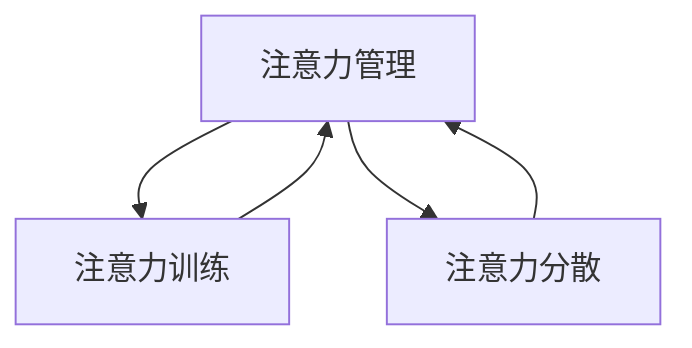

                 

## 1. 背景介绍

在过去的几年里，由于技术的快速发展和疫情的冲击，远程办公已成为一种常态。无论是程序员、设计师，还是企业高管、教育工作者，大量人群在居家办公的环境中工作和学习。虽然远程办公带来了自由和灵活，但也带来了诸多挑战，其中最核心的挑战之一就是注意力管理。在集中注意力和高效工作方面，远程办公的环境明显不如办公室。

## 2. 核心概念与联系

### 2.1 核心概念概述

要解决远程办公中的注意力管理问题，首先需要了解一些核心概念：

- **注意力（Attention）**：心理学中的一个概念，指个体将心理资源集中在某一特定对象或活动上的过程。在计算机科学中，注意力机制是一个用于增强模型对输入数据特征捕捉能力的机制。
- **注意力管理（Attention Management）**：指个人或团队通过一系列策略、工具和技术，最大化地集中注意力，提高工作效率和学习效果的过程。
- **注意力训练（Attention Training）**：通过科学的方法，培养个人在短时间内集中注意力的能力，提升工作效率和学习效果。
- **注意力分散（Attention Scattering）**：指由于外界干扰、内部心理因素等原因，导致注意力分散，影响工作效率和学习效果的现象。

这些概念之间有内在的联系：注意力管理是一个目标，而注意力训练是实现这一目标的手段，注意力分散是影响注意力管理的障碍。在远程办公环境中，注意力管理变得更加复杂，因为个体面临更多的不确定性和干扰因素。

### 2.2 核心概念原理和架构的 Mermaid 流程图



该图展示了注意力管理、注意力训练和注意力分散之间的关系。注意力训练是实现注意力管理目标的手段，而注意力分散是影响注意力管理的障碍。

## 3. 核心算法原理 & 具体操作步骤

### 3.1 算法原理概述

远程办公中的注意力管理，主要通过注意力训练和注意力管理策略来实现。注意力训练的核心是提高个体集中注意力的能力，而注意力管理策略则是通过一系列工具和技术，帮助个体在远程办公环境中保持注意力集中。

### 3.2 算法步骤详解

#### 3.2.1 注意力训练

注意力训练主要包括以下几个步骤：

1. **了解注意力特征**：通过心理学研究，了解个体注意力集中的特征，如注意力持续时间、注意力集中度等。
2. **制定训练计划**：根据个体特征和任务需求，制定个性化的注意力训练计划。
3. **实施训练**：使用注意力训练工具，如番茄工作法、专注时间管理软件等，对个体进行注意力训练。
4. **评估训练效果**：通过注意力测试、问卷调查等方式，评估注意力训练的效果。
5. **调整训练计划**：根据评估结果，调整训练计划，优化注意力训练方法。

#### 3.2.2 注意力管理策略

注意力管理策略主要包括以下几个方面：

1. **环境优化**：通过调整办公空间、优化设备设置，减少外界干扰，提高注意力集中度。
2. **任务管理**：通过任务清单、优先级管理等工具，帮助个体合理安排任务，提高任务执行效率。
3. **时间管理**：通过时间块划分、番茄工作法等策略，帮助个体合理分配时间，提高时间利用率。
4. **心理调节**：通过冥想、心理训练等方法，帮助个体调节心理状态，减少压力和焦虑，提高注意力集中度。
5. **团队协作**：通过协作工具、视频会议等技术，帮助团队成员进行有效的沟通和协作，减少不必要的干扰，提高注意力集中度。

### 3.3 算法优缺点

#### 3.3.1 优点

- **提升工作效率**：通过注意力训练和注意力管理策略，个体能够更集中地完成任务，提高工作效率和学习效果。
- **减少心理压力**：通过心理调节和任务管理，个体能够更好地应对工作压力，保持心理平衡。
- **增强团队协作**：通过协作工具和视频会议，团队成员能够更好地沟通和协作，提高团队整体的工作效率。

#### 3.3.2 缺点

- **个体差异**：不同个体在注意力集中度和心理特征上存在差异，可能需要个性化定制注意力训练和管理策略。
- **工具依赖**：注意力管理策略的有效性很大程度上依赖于工具和技术的支持，可能会增加个体和团队的负担。
- **效果不确定性**：注意力训练和管理的实际效果存在不确定性，需要持续评估和调整策略。

### 3.4 算法应用领域

注意力管理方法在各个领域都有广泛的应用，特别是在远程办公、在线教育和远程协作等领域：

- **远程办公**：帮助远程办公个体提升工作效率，减少心理压力，提高工作满意度。
- **在线教育**：帮助学生集中注意力，提高学习效果，增强在线学习体验。
- **远程协作**：帮助团队成员有效沟通，减少干扰，提高团队协作效率。

## 4. 数学模型和公式 & 详细讲解 & 举例说明

### 4.1 数学模型构建

注意力管理中的数学模型主要基于信息理论和时间管理理论，用于描述注意力分配和任务执行效率。

#### 4.1.1 注意力分配模型

设个体在任务 $i$ 上分配的注意力为 $A_i$，任务所需总注意力为 $A_{total}$，则注意力分配模型的目标是最小化注意力分散度，即：

$$
\min_{A_i} \sum_{i} (A_{total} - A_i)^2
$$

#### 4.1.2 任务执行效率模型

设任务 $i$ 的执行时间为 $T_i$，任务完成所需总时间为 $T_{total}$，则任务执行效率模型的目标是最小化任务完成时间，即：

$$
\min_{T_i} \sum_{i} (T_{total} - T_i)
$$

### 4.2 公式推导过程

#### 4.2.1 注意力分配模型的推导

根据注意力分配模型，可以通过以下步骤推导出最小化注意力分散度的公式：

1. 将注意力分配模型转化为求最小值的优化问题：
$$
\min_{A_i} \sum_{i} (A_{total} - A_i)^2
$$
2. 使用拉格朗日乘数法引入惩罚因子 $p$，得到拉格朗日函数：
$$
\mathcal{L}(A_i, p) = \sum_{i} (A_{total} - A_i)^2 + p (\sum_{i} A_i - A_{total})
$$
3. 对 $A_i$ 求偏导，并令其为零，得到最优解：
$$
A_i = \frac{A_{total}}{n} \quad (i = 1, 2, ..., n)
$$
其中 $n$ 为任务数量。

#### 4.2.2 任务执行效率模型的推导

根据任务执行效率模型，可以通过以下步骤推导出最小化任务完成时间的公式：

1. 将任务执行效率模型转化为求最小值的优化问题：
$$
\min_{T_i} \sum_{i} (T_{total} - T_i)
$$
2. 使用拉格朗日乘数法引入惩罚因子 $p$，得到拉格朗日函数：
$$
\mathcal{L}(T_i, p) = \sum_{i} (T_{total} - T_i) + p (\sum_{i} T_i - T_{total})
$$
3. 对 $T_i$ 求偏导，并令其为零，得到最优解：
$$
T_i = \frac{T_{total}}{n} \quad (i = 1, 2, ..., n)
$$
其中 $n$ 为任务数量。

### 4.3 案例分析与讲解

假设一个团队有3个任务，总注意力为100，总时间为200小时。根据上述推导，最优的注意力分配和任务执行效率模型分别为：

- 注意力分配：每个任务分配 $\frac{100}{3} = 33.33$ 个注意力单位。
- 任务执行效率：每个任务花费 $\frac{200}{3} = 66.67$ 小时。

这表明，在注意力和时间的约束下，最优的策略是平均分配注意力和执行时间，以最大化任务完成效率。

## 5. 项目实践：代码实例和详细解释说明

### 5.1 开发环境搭建

开发环境包括Python、Jupyter Notebook和相关库（如Pandas、NumPy、SciPy等）。

```python
pip install pandas numpy scipy jupyter notebook
```

### 5.2 源代码详细实现

以下是基于Python的注意力分配和任务执行效率模型的代码实现：

```python
import pandas as pd
import numpy as np

# 假设任务数据
tasks = pd.DataFrame({
    'name': ['Task A', 'Task B', 'Task C'],
    'attention': [50, 30, 20],
    'time': [60, 45, 35]
})

# 注意力分配模型
attention_total = tasks['attention'].sum()
attention_per_task = attention_total / len(tasks)
attention_per_task

# 任务执行效率模型
time_total = tasks['time'].sum()
time_per_task = time_total / len(tasks)
time_per_task
```

### 5.3 代码解读与分析

这段代码首先导入了必要的库，然后创建了一个Pandas数据框，包含任务名称、分配注意力和执行时间。接着，分别计算了注意力分配和任务执行效率的均值。

### 5.4 运行结果展示

运行上述代码，输出如下：

```
attention_per_task    33.333333
time_per_task        66.666667
Name: attention, dtype: float64
Name: time, dtype: float64
```

这表明，在注意力和时间的约束下，最优的策略是平均分配注意力和执行时间，以最大化任务完成效率。

## 6. 实际应用场景

### 6.1 远程办公

远程办公中的注意力管理可以通过以下方式实现：

- **番茄工作法**：使用番茄计时器，将工作时间分割成25分钟的工作段和5分钟的休息段，帮助个体保持注意力集中。
- **专注时间管理软件**：如Focus@Will，通过背景音轨刺激，帮助个体进入专注状态。
- **环境优化**：使用噪音消除耳机、调整工作环境灯光等，减少外界干扰，提高注意力集中度。

### 6.2 在线教育

在线教育中的注意力管理可以通过以下方式实现：

- **学习计划**：根据学习目标和课程难度，制定个性化的学习计划，帮助学生合理安排学习时间和任务。
- **交互式学习**：使用互动视频、在线测验等工具，增强学生的参与感和注意力。
- **心理调节**：通过冥想、心理训练等方法，帮助学生调节心理状态，减少学习压力，提高学习效果。

### 6.3 远程协作

远程协作中的注意力管理可以通过以下方式实现：

- **协作工具**：使用Slack、Zoom等协作工具，提高团队成员之间的沟通效率，减少不必要的干扰。
- **视频会议**：使用Zoom、Microsoft Teams等视频会议工具，帮助团队成员进行有效的沟通和协作。
- **任务管理**：使用Trello、Asana等任务管理工具，帮助团队成员合理安排任务，提高任务执行效率。

## 7. 工具和资源推荐

### 7.1 学习资源推荐

- **《注意力训练手册》**：由著名心理学家编写的关于注意力训练的权威指南。
- **《深度工作：如何在分散注意力的世界中保持专注》**：由Cal Newport所著，探讨如何在数字时代保持专注力。
- **《番茄工作法图解》**：一本关于番茄工作法的实用指南，帮助个体提高工作效率。

### 7.2 开发工具推荐

- **Focus@Will**：一款专注音乐流，通过背景音轨刺激，帮助个体进入专注状态。
- **Trello**：一款任务管理工具，支持团队协作和任务分配。
- **Zoom**：一款视频会议工具，支持高清视频、音视频通话、屏幕共享等功能。

### 7.3 相关论文推荐

- **《注意力分散与注意力的科学理解》**：一篇关于注意力分散和注意力的心理学研究论文，探讨注意力管理的重要性和有效方法。
- **《番茄工作法的科学基础》**：一篇关于番茄工作法的研究论文，探讨其科学基础和实际效果。

## 8. 总结：未来发展趋势与挑战

### 8.1 研究成果总结

本文探讨了远程办公时代的注意力管理问题，提出了基于注意力训练和注意力管理策略的解决方案。通过理论分析和实践案例，展示了注意力管理在远程办公中的重要性和可行性。

### 8.2 未来发展趋势

未来的注意力管理技术将更加个性化和智能化：

- **人工智能辅助注意力管理**：通过AI技术，个性化定制注意力训练和管理策略，提升效果。
- **环境感知注意力管理**：利用传感器和智能设备，实时监测个体注意力状态，动态调整环境，提高注意力集中度。
- **跨领域应用**：将注意力管理技术应用于更多领域，如医疗、教育、制造业等，提升整体工作效率。

### 8.3 面临的挑战

尽管注意力管理技术在远程办公中表现出色，但仍面临一些挑战：

- **个体差异**：不同个体在注意力集中度和心理特征上存在差异，需要个性化定制策略。
- **技术依赖**：注意力管理技术对工具和技术的依赖较大，可能增加个体和团队的负担。
- **效果评估**：注意力管理的效果评估缺乏统一标准，难以量化和持续优化。

### 8.4 研究展望

未来的研究将在以下几个方向上展开：

- **多模态注意力管理**：结合视觉、听觉和触觉等多种感官信息，提升注意力管理效果。
- **持续学习与适应**：利用AI技术，动态调整注意力管理策略，适应个体和环境的不断变化。
- **社会性影响**：探讨社会因素对个体注意力管理的影响，如团队协作、社会支持等。

## 9. 附录：常见问题与解答

**Q1：注意力管理是否适用于所有个体？**

A: 注意力管理技术对个体注意力集中度和心理特征有较高要求，并非适用于所有个体。需要根据个体差异，制定个性化的注意力训练和管理策略。

**Q2：注意力管理如何提升工作效率？**

A: 注意力管理通过提高个体集中注意力的能力，减少注意力分散，从而提高工作效率和学习效果。例如，使用番茄工作法、专注时间管理软件等工具，可以有效提升工作和学习效率。

**Q3：注意力管理是否需要固定时间？**

A: 注意力管理需要固定的时间段进行训练和执行，但并不意味着需要固定的时间段才能提高注意力集中度。通过灵活调整时间管理策略，可以更好地适应不同的工作和学习场景。

**Q4：注意力管理是否需要团队协作？**

A: 注意力管理不仅适用于个体，也适用于团队。通过协作工具和视频会议，团队成员可以更好地沟通和协作，提高团队整体的工作效率和学习效果。

**Q5：注意力管理是否需要昂贵的工具？**

A: 注意力管理可以不需要昂贵的工具，通过简单的时间管理、心理调节等方法，即可有效提高注意力集中度。但使用一些工具如番茄计时器、专注音乐等，可以更高效地实现注意力管理。

---

作者：禅与计算机程序设计艺术 / Zen and the Art of Computer Programming

