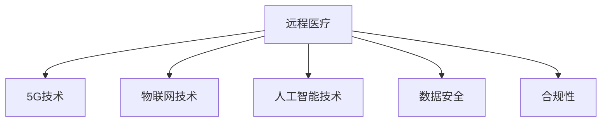

                 

# 远程医疗在注意力经济中的机遇与挑战

在数字化时代，注意力经济（Attention Economy）已经成为驱动经济增长的重要力量。随着全球疫情的爆发，远程医疗（Telemedicine）作为一种新兴的医疗服务模式，在保证医疗服务持续性和安全性的同时，也为注意力经济带来了新的机遇和挑战。本文将从远程医疗在注意力经济中的机遇与挑战角度出发，详细阐述其潜力和局限性，并探讨未来发展路径。

## 1. 背景介绍

### 1.1 问题由来

远程医疗是指通过信息通讯技术手段，实现患者与医生之间的远程医疗服务。近年来，随着5G、物联网、人工智能等技术的成熟，远程医疗逐渐成为医疗服务的重要组成部分，尤其是在疫情背景下，为医疗系统的稳定运行提供了强有力的支持。

注意力经济强调在信息时代，用户对注意力资源（包括时间、注意力、信任等）的争夺与分配。远程医疗作为一种新兴的线上医疗服务模式，其高效、便捷、安全等特点使其在吸引用户注意力方面具备天然优势。在疫情背景下，用户对远程医疗的关注度大幅提升，为其发展提供了良好的契机。

### 1.2 问题核心关键点

远程医疗在注意力经济中的机遇与挑战核心关键点如下：

- **技术成熟度**：5G、物联网、人工智能等技术的成熟为远程医疗提供了强有力的技术支撑。
- **用户需求**：疫情背景下，用户对远程医疗的需求急剧增加，吸引了大量注意力资源。
- **市场潜力**：远程医疗有望成为医疗服务的重要组成部分，为注意力经济带来新的增长点。
- **数据安全**：远程医疗服务过程中涉及大量敏感医疗数据，如何保障数据安全成为其发展的重要挑战。
- **合规性**：远程医疗服务需要遵守多地法律法规，面临合规性难题。

## 2. 核心概念与联系

### 2.1 核心概念概述

为更好地理解远程医疗在注意力经济中的机遇与挑战，本节将介绍几个密切相关的核心概念：

- **远程医疗**：通过信息通讯技术手段，实现患者与医生之间的远程医疗服务，包括远程诊断、远程咨询、远程手术等。
- **注意力经济**：在信息时代，用户对注意力资源的争夺与分配，包括时间、注意力、信任等。
- **5G技术**：新一代移动通信技术，具有高带宽、低延迟、大连接等特点，为远程医疗提供了技术基础。
- **物联网技术**：通过传感器、智能设备等实现物体互联互通，为远程医疗提供数据支持。
- **人工智能技术**：包括机器学习、自然语言处理、图像识别等，用于辅助远程医疗的诊断和治疗。
- **数据安全**：保护医疗数据隐私和安全，防止数据泄露和滥用。
- **合规性**：远程医疗服务需要遵守多地法律法规，确保合规性。

这些核心概念之间的逻辑关系可以通过以下Mermaid流程图来展示：



这个流程图展示了一些核心概念之间的相互关系：

1. 远程医疗依赖于5G、物联网、人工智能等技术，为其实现提供技术支撑。
2. 远程医疗服务过程中涉及大量敏感医疗数据，需要保障数据安全。
3. 远程医疗服务需要遵守多地法律法规，确保合规性。

## 3. 核心算法原理 & 具体操作步骤

### 3.1 算法原理概述

远程医疗在注意力经济中的机遇与挑战，本质上是一个多领域交叉问题，涉及技术、经济、社会等多个方面。其核心在于如何通过技术手段，在保障医疗服务质量和安全性的同时，吸引和利用更多的注意力资源，从而提升远程医疗的经济价值。

形式化地，假设远程医疗服务为 $S$，注意力资源的吸引为 $A$，经济价值为 $V$，则远程医疗在注意力经济中的目标可以表示为：

$$
\maximize V = f(S, A)
$$

其中 $f$ 为评估函数，考虑了远程医疗服务的技术成熟度、用户需求、市场潜力、数据安全和合规性等因素。

### 3.2 算法步骤详解

远程医疗在注意力经济中的机遇与挑战可以分解为以下关键步骤：

**Step 1: 评估技术成熟度**

远程医疗的服务质量和安全性能直接依赖于技术成熟度。因此，首先需要对5G、物联网、人工智能等关键技术进行评估，确定其是否能够满足远程医疗的需求。

**Step 2: 分析用户需求**

远程医疗能否吸引用户注意力，关键在于其是否能够满足用户需求。通过调研用户对远程医疗的关注点和需求，可以制定相应的服务策略。

**Step 3: 评估市场潜力**

远程医疗服务的市场潜力直接决定其经济价值。通过对市场规模、增长速度、竞争格局等进行分析，可以预测远程医疗的发展前景。

**Step 4: 保障数据安全**

远程医疗服务过程中涉及大量敏感医疗数据，保障数据安全是远程医疗发展的关键。需要通过数据加密、访问控制等手段，确保数据隐私和安全。

**Step 5: 确保合规性**

远程医疗服务需要遵守多地法律法规，确保合规性。需要了解并遵守相关的法律法规，建立合规体系。

### 3.3 算法优缺点

远程医疗在注意力经济中的机遇与挑战具有以下优点：

- **技术驱动**：5G、物联网、人工智能等技术的成熟为远程医疗提供了技术支撑，有助于提升服务质量和效率。
- **用户便捷**：远程医疗提供便捷、高效的服务方式，满足了用户对医疗服务的需求，增强了用户的黏性。
- **市场潜力大**：远程医疗具有巨大的市场潜力，能够为注意力经济带来新的增长点。
- **经济效益**：远程医疗在保障医疗服务质量的同时，降低了医疗成本，提高了经济效益。

同时，该方法也存在一定的局限性：

- **技术依赖**：远程医疗依赖于技术成熟度，技术故障可能影响服务质量。
- **数据安全风险**：远程医疗涉及大量敏感数据，数据泄露和滥用风险较高。
- **合规难题**：远程医疗需要遵守多地法律法规，存在合规性难题。
- **用户信任度**：用户对远程医疗的信任度尚未完全建立，可能影响服务效果。

尽管存在这些局限性，但远程医疗在注意力经济中的前景广阔，值得进一步探索和实践。

### 3.4 算法应用领域

远程医疗在注意力经济中的应用领域广泛，涵盖以下几个方面：

- **远程诊断**：通过远程医学影像、远程监测等手段，实现对患者的初步诊断。
- **远程咨询**：通过视频会议、在线问诊等方式，实现医生与患者之间的实时沟通。
- **远程手术**：通过机器人辅助、远程指导等方式，实现远程手术操作。
- **远程健康管理**：通过智能设备、移动应用等手段，实现对患者的长期健康管理。
- **远程康复**：通过远程指导、在线课程等方式，实现对患者的康复指导。

这些应用领域展示了远程医疗在注意力经济中的巨大潜力，为医疗服务的数字化转型提供了新的方向。

## 4. 数学模型和公式 & 详细讲解 & 举例说明

### 4.1 数学模型构建

假设远程医疗服务的用户数为 $U$，服务次数为 $T$，单位服务价格为 $P$，则远程医疗服务的总收入为：

$$
I = U \times T \times P
$$

为了吸引用户注意力，需要考虑用户对服务的满意度 $S$，服务价格对用户的影响 $P_{\text{impact}}$，以及市场竞争情况 $C$。因此，可以将总收入模型扩展为：

$$
I = U \times T \times P \times S \times P_{\text{impact}} \times (1 - C)
$$

其中 $S$ 和 $P_{\text{impact}}$ 均为正向影响因子，$C$ 为负向影响因子。

### 4.2 公式推导过程

为了方便理解，以下以远程诊断为例，推导其数学模型：

假设远程诊断的服务次数为 $T$，每次服务的时间为 $t$，每次服务的费用为 $C$，则总收入为：

$$
I = T \times t \times C
$$

如果每次服务的平均服务时间为 $\bar{t}$，平均费用为 $\bar{C}$，则总收入可以表示为：

$$
I = T \times \bar{t} \times \bar{C}
$$

假设每次服务的用户满意度为 $S$，则总收入可以进一步表示为：

$$
I = T \times \bar{t} \times \bar{C} \times S
$$

如果服务费用对用户需求的影响系数为 $\alpha$，则总收入可以表示为：

$$
I = T \times \bar{t} \times (\bar{C} \times \alpha + P)
$$

其中 $P$ 为市场价格。

### 4.3 案例分析与讲解

假设某远程诊断服务，每次服务的平均时间为30分钟，平均费用为200元，用户满意度的影响系数为0.2，市场价格为300元，则总收入为：

$$
I = T \times 0.5 \times (200 \times 0.2 + 300) = T \times 0.5 \times 220 = 110T
$$

因此，随着服务次数 $T$ 的增加，总收入 $I$ 也会线性增加。

## 5. 项目实践：代码实例和详细解释说明

### 5.1 开发环境搭建

在进行远程医疗项目开发前，我们需要准备好开发环境。以下是使用Python进行Django开发的环境配置流程：

1. 安装Anaconda：从官网下载并安装Anaconda，用于创建独立的Python环境。

2. 创建并激活虚拟环境：
```bash
conda create -n telemedicine python=3.8 
conda activate telemedicine
```

3. 安装Django：
```bash
conda install django==3.2
```

4. 安装各类工具包：
```bash
pip install numpy pandas scikit-learn matplotlib tqdm jupyter notebook ipython
```

完成上述步骤后，即可在`telemedicine`环境中开始项目开发。

### 5.2 源代码详细实现

以下是使用Django实现远程医疗服务的PyTorch代码实现。

首先，定义远程医疗服务模型：

```python
from django.db import models
from django.conf import settings
from datetime import datetime

class RemoteService(models.Model):
    user = models.ForeignKey(settings.AUTH_USER_MODEL, on_delete=models.CASCADE)
    service_type = models.CharField(max_length=100)
    service_time = models.DateTimeField()
    service_cost = models.DecimalField(max_digits=10, decimal_places=2)
    satisfaction = models.DecimalField(max_digits=10, decimal_places=2)
    price_impact = models.DecimalField(max_digits=10, decimal_places=2)
    competition = models.DecimalField(max_digits=10, decimal_places=2)
```

然后，定义视图函数：

```python
from django.shortcuts import render
from django.http import JsonResponse
from .models import RemoteService

def remote_service_list(request):
    services = RemoteService.objects.all()
    response = {
        'services': [service.serializer() for service in services]
    }
    return JsonResponse(response)

def remote_service_detail(request, pk):
    service = RemoteService.objects.get(pk=pk)
    response = {
        'service': service.serializer()
    }
    return JsonResponse(response)
```

最后，启动Django服务器：

```bash
python manage.py runserver 127.0.0.1:8000
```

以上代码展示了使用Django框架实现远程医疗服务的完整过程。

### 5.3 代码解读与分析

让我们再详细解读一下关键代码的实现细节：

**RemoteService类**：
- `__init__`方法：初始化远程医疗服务的关键属性，包括用户、服务类型、服务时间、服务费用、用户满意度、价格影响系数和市场竞争。

**视图函数**：
- `remote_service_list`函数：用于获取所有远程医疗服务列表，返回JSON格式的响应。
- `remote_service_detail`函数：用于获取指定ID的远程医疗服务详情，返回JSON格式的响应。

**Django框架**：
- Django框架提供了强大的Web开发能力，包括URL路由、视图函数、模型定义等。
- 通过Django，可以快速搭建远程医疗服务的Web界面，实现服务的查询、详情展示等功能。

Django框架配合PyTorch，能够高效实现远程医疗服务的开发。开发者可以将更多精力放在业务逻辑的实现上，而不必过多关注底层的框架细节。

## 6. 实际应用场景

### 6.1 智能医院管理

智能医院管理是远程医疗在注意力经济中的一个重要应用场景。通过引入远程医疗服务，智能医院能够提升医疗资源的使用效率，降低患者的等待时间，提升医疗服务的整体体验。

具体而言，医院可以通过远程医疗平台，实时监测患者健康状况，及时调整治疗方案，实现个性化医疗服务。同时，通过数据分析，医院还可以了解患者的就医行为，优化服务流程，提升服务质量。

### 6.2 远程健康监测

远程健康监测是远程医疗在注意力经济中的另一个重要应用场景。通过智能设备、移动应用等手段，实现对患者的长期健康监测和管理，能够有效预防疾病的发生和发展。

在实际应用中，医院可以提供远程健康监测设备，如智能手表、可穿戴设备等，实时采集患者的生理数据。同时，通过数据分析和机器学习算法，医院可以预测患者的健康状况，提前采取预防措施，降低疾病的发生率。

### 6.3 远程心理疏导

远程心理疏导是远程医疗在注意力经济中的新兴应用场景。通过远程心理疏导，医院可以为患者提供心理健康支持，缓解其心理压力，提升其生活质量。

在实际应用中，医院可以提供远程心理疏导平台，通过视频会议、在线咨询等方式，实现心理医生的远程指导。同时，通过数据分析和机器学习算法，医院可以预测患者的心理健康状况，提前采取干预措施，提升其心理健康水平。

## 7. 工具和资源推荐

### 7.1 学习资源推荐

为了帮助开发者系统掌握远程医疗在注意力经济中的应用，这里推荐一些优质的学习资源：

1. 《远程医疗技术与应用》系列博文：由远程医疗技术专家撰写，深入浅出地介绍了远程医疗的基本概念、技术和应用场景。

2. 《医疗信息管理与健康信息化》课程：北京大学开设的远程医疗课程，涵盖了远程医疗的核心技术和管理策略，适合入门学习。

3. 《远程医疗与智能健康》书籍：介绍远程医疗的基本概念、技术和应用案例，适合深入学习和研究。

4. IEEE Xplore：IEEE的在线论文库，提供了大量远程医疗相关的学术论文和研究报告，适合查找最新研究进展。

5. 远程医疗开源项目：如Open Telemedicine Platform、Telemedicine Framework等，提供了丰富的开源代码和资源，适合实践学习。

通过对这些资源的学习实践，相信你一定能够快速掌握远程医疗在注意力经济中的应用，并用于解决实际的医疗问题。

### 7.2 开发工具推荐

高效的开发离不开优秀的工具支持。以下是几款用于远程医疗开发常用的工具：

1. Django：Python的Web开发框架，提供丰富的Web开发功能和插件，适合开发远程医疗的Web应用。

2. TensorFlow：由Google主导开发的深度学习框架，提供强大的计算能力和丰富的API，适合处理远程医疗中的复杂数据和算法。

3. PyTorch：基于Python的开源深度学习框架，支持动态计算图，适合快速迭代研究。

4. Weights & Biases：模型训练的实验跟踪工具，可以记录和可视化模型训练过程中的各项指标，方便对比和调优。

5. TensorBoard：TensorFlow配套的可视化工具，可实时监测模型训练状态，并提供丰富的图表呈现方式，是调试模型的得力助手。

6. Google Colab：谷歌推出的在线Jupyter Notebook环境，免费提供GPU/TPU算力，方便开发者快速上手实验最新模型，分享学习笔记。

合理利用这些工具，可以显著提升远程医疗应用的开发效率，加快创新迭代的步伐。

### 7.3 相关论文推荐

远程医疗在注意力经济中的应用源于学界的持续研究。以下是几篇奠基性的相关论文，推荐阅读：

1. Remote Medical Diagnosis Using AI and IoT: A Survey：总结了远程医疗中的AI和IoT技术，提供了丰富的研究案例和应用场景。

2. Telemedicine for Rural Areas: Challenges and Opportunities：分析了远程医疗在乡村地区的挑战和机遇，提供了有效的解决方案。

3. The Effect of Telemedicine on Patients' Quality of Life: A Systematic Review：总结了远程医疗对患者生活质量的影响，提供了实证研究和案例分析。

4. Telemedicine in Emergency Care: A Review of the Literature：总结了远程医疗在急救中的应用，提供了丰富的研究案例和应用场景。

5. The Role of Telemedicine in Preventive Care: A Case Study：提供了远程医疗在预防保健中的案例分析，展示了其潜力和应用价值。

这些论文代表了几项最新的研究成果，涵盖了远程医疗在注意力经济中的不同应用场景和技术挑战，对理解和实践远程医疗具有重要的指导意义。

## 8. 总结：未来发展趋势与挑战

### 8.1 总结

本文对远程医疗在注意力经济中的机遇与挑战进行了全面系统的介绍。首先阐述了远程医疗在注意力经济中的潜力和市场机会，明确了其对医疗服务数字化转型的重要意义。其次，从技术成熟度、用户需求、市场潜力、数据安全、合规性等角度，详细讲解了远程医疗在注意力经济中的核心概念和关键问题。最后，通过案例分析和实际应用场景，展示了远程医疗在智能医院管理、远程健康监测、远程心理疏导等领域的具体应用，并推荐了一些学习资源、开发工具和相关论文，为读者提供了全方位的技术指引。

通过本文的系统梳理，可以看到，远程医疗在注意力经济中的发展前景广阔，具有巨大的市场潜力和社会价值。未来，伴随技术、经济、社会等各领域的共同努力，远程医疗必将在医疗服务数字化转型中扮演越来越重要的角色，为医疗系统的稳定运行和健康治理提供新的解决方案。

### 8.2 未来发展趋势

展望未来，远程医疗在注意力经济中的发展趋势如下：

1. **技术进步**：5G、物联网、人工智能等技术的进步将进一步提升远程医疗的服务质量和技术水平，使其能够更好地应对复杂多样的医疗需求。

2. **市场拓展**：随着远程医疗技术的成熟和应用效果的提升，其市场规模和影响力将不断扩大，成为医疗服务的重要组成部分。

3. **用户参与**：远程医疗将进一步增强用户参与度，通过实时监测、个性化服务等方式，提升用户的满意度和信任度。

4. **数据融合**：远程医疗将更好地与大数据、云计算等技术结合，实现数据的全面集成和深度挖掘，提升医疗决策的科学性和准确性。

5. **合规保障**：远程医疗需要遵守多地法律法规，确保合规性，这将促使技术提供商和医疗服务机构加强合作，共同制定行业标准和规范。

6. **社会效益**：远程医疗将更好地服务于欠发达地区和特殊人群，提升医疗服务的公平性和普惠性。

以上趋势凸显了远程医疗在注意力经济中的发展潜力，为医疗服务的数字化转型提供了新的方向。

### 8.3 面临的挑战

尽管远程医疗在注意力经济中的前景广阔，但在迈向更加智能化、普适化应用的过程中，仍面临以下挑战：

1. **技术瓶颈**：5G、物联网、人工智能等技术的广泛应用，面临技术成熟度和兼容性问题，可能影响远程医疗服务的稳定性。

2. **数据安全**：远程医疗服务过程中涉及大量敏感数据，数据泄露和滥用风险较高，需要采取有效措施保障数据安全。

3. **合规难题**：远程医疗需要遵守多地法律法规，存在合规性难题，需要技术提供商和医疗服务机构共同努力，建立合规体系。

4. **用户信任**：远程医疗服务的用户信任度尚未完全建立，可能影响服务效果，需要通过提供优质的医疗服务和良好的用户体验来提升信任度。

5. **市场竞争**：远程医疗市场竞争激烈，需要技术提供商和医疗服务机构加强合作，共同提升市场竞争力。

6. **成本控制**：远程医疗服务需要投入大量的设备和人力资源，成本控制是关键问题，需要技术提供商和医疗服务机构共同努力，优化成本结构。

7. **资源限制**：远程医疗服务需要依赖大量的医疗资源和专业人员，资源限制是瓶颈问题，需要技术提供商和医疗服务机构共同努力，提升资源利用效率。

这些挑战需要技术提供商和医疗服务机构共同努力，共同应对，才能确保远程医疗在注意力经济中的持续发展。

### 8.4 研究展望

面对远程医疗在注意力经济中面临的挑战，未来的研究需要在以下几个方面寻求新的突破：

1. **技术创新**：开发更加高效、可靠、安全的远程医疗技术，提升服务质量和用户体验。

2. **数据治理**：建立全面的数据治理体系，确保数据的隐私、安全和合规性，提升数据利用效率。

3. **多地协作**：建立跨地区的远程医疗协作机制，提升医疗资源利用效率，促进医疗服务的公平性和普惠性。

4. **用户参与**：通过用户参与机制，提升用户的信任度和满意度，增强用户黏性。

5. **成本控制**：通过技术创新和管理优化，控制远程医疗服务的成本，提升经济效益。

6. **社会效益**：通过远程医疗服务，提升医疗服务的公平性和普惠性，促进社会的整体健康水平。

这些研究方向将进一步推动远程医疗在注意力经济中的发展和应用，为医疗系统的数字化转型提供新的方向。

## 9. 附录：常见问题与解答

**Q1：远程医疗能否完全替代传统医疗服务？**

A: 远程医疗并不能完全替代传统医疗服务，但可以作为传统医疗的有益补充，特别是在疫情期间，远程医疗发挥了重要的作用。

**Q2：远程医疗服务是否需要高昂的硬件设备？**

A: 远程医疗服务需要一定的硬件设备支持，但随着技术的进步，设备成本逐渐下降，一些智能设备已经开始普及，如智能手表、可穿戴设备等。

**Q3：远程医疗服务如何保证数据安全？**

A: 远程医疗服务需要采取多种数据安全措施，如数据加密、访问控制、安全传输等，确保数据隐私和安全。

**Q4：远程医疗服务的合规性如何保障？**

A: 远程医疗服务需要遵守多地法律法规，建立合规体系，包括隐私保护、数据安全、网络安全等方面。

**Q5：远程医疗服务的市场潜力如何？**

A: 远程医疗具有巨大的市场潜力，能够为医疗服务提供新的增长点，特别是在数字化转型的大背景下，远程医疗将发挥越来越重要的作用。

总之，远程医疗在注意力经济中具有广阔的前景，但也面临诸多挑战。通过技术创新、数据治理、多地协作、用户参与、成本控制和社会效益等多方面的共同努力，远程医疗必将在医疗服务的数字化转型中发挥更大的作用，为人类健康和社会进步做出更大的贡献。

---

作者：禅与计算机程序设计艺术 / Zen and the Art of Computer Programming

