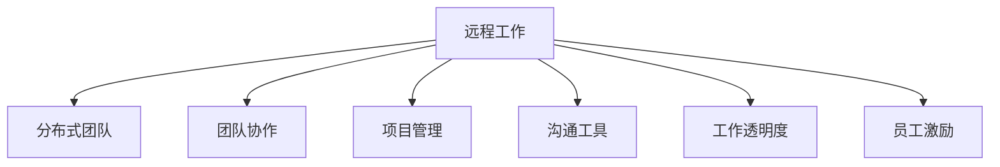

                 

## 1. 背景介绍

### 1.1 问题由来

随着互联网和信息技术的迅猛发展，远程工作已成为越来越多企业实现灵活办公和提高生产力的重要手段。然而，传统的管理模式在远程办公场景下遇到了诸多挑战，例如团队协作效率低下、员工沟通困难、工作氛围缺失等问题。如何在远程工作环境中有效管理团队，成为一个亟需解决的问题。

### 1.2 问题核心关键点

对于远程工作管理，关键在于构建一个高效、透明、有动力的工作环境。具体包括：
- 如何保持团队的沟通效率和信息透明度？
- 如何确保团队成员的工作动力和士气？
- 如何处理远程工作中的协作和项目管理问题？
- 如何保障团队成员的心理健康和工作满意度？

这些问题解决的好坏，直接影响到远程工作的成败。本文将从核心概念和联系、算法原理、项目实践、应用场景等方面，对远程工作管理进行详细阐述，并提供一些实际策略，供领导者参考。

### 1.3 问题研究意义

面对日益频繁的远程工作需求，研究如何高效管理远程团队，具有重要意义：
- 提升远程工作效率。通过科学管理，实现远程团队的高效协作和项目管理。
- 维护团队凝聚力和士气。合理利用远程工作工具，激发团队成员的工作动力和归属感。
- 保障员工心理和身体健康。定期进行团队交流和心理健康建设，减少远程工作带来的压力和焦虑。
- 推动企业数字化转型。远程工作管理作为企业数字化转型的重要组成部分，对于提升企业整体竞争力具有重要价值。

## 2. 核心概念与联系

### 2.1 核心概念概述

在远程工作管理中，涉及多个关键概念：

- **远程工作**：指员工无需到企业固定的物理场所，通过网络等手段完成工作任务。
- **分布式团队**：由地理位置分散的员工组成的团队，依靠技术工具实现协作和沟通。
- **团队协作**：多成员共同完成目标任务的流程和机制，包括任务分配、进度跟踪、沟通反馈等。
- **项目管理**：运用专门的工具和技术，规划、监控和调整项目进度，以确保项目成功完成。
- **沟通工具**：如Slack、Microsoft Teams、Zoom等，用于实时通信、文件共享、视频会议等。
- **工作透明度**：通过公开任务进度、工作成果等方式，使团队成员了解彼此的工作状态和进展。
- **员工激励**：通过奖励机制、目标设定、认可表彰等手段，激发员工的工作热情和积极性。

这些概念之间的逻辑关系可以通过以下Mermaid流程图来展示：



这个流程图展示了一些关键概念及其相互联系：远程工作是基础，分布式团队依赖于远程工作，而团队协作、项目管理、沟通工具、工作透明度、员工激励等都是远程工作的重要组成部分。

## 3. 核心算法原理 & 具体操作步骤

### 3.1 算法原理概述

远程工作管理中的核心算法原理包括：

- **任务分配与进度跟踪**：通过算法将任务分解为子任务，分配给团队成员，并实时跟踪进度。
- **信息透明化**：通过算法实现团队成员间的信息共享，使每个成员都能及时了解项目进展和任务状态。
- **沟通优化**：通过算法优化团队沟通流程，确保信息准确、及时传达，避免信息丢失和误解。
- **动力激发**：通过算法设计奖励机制和目标设定，激励团队成员持续投入工作。

### 3.2 算法步骤详解

以下是远程工作管理算法的详细步骤：

1. **任务分解与分配**：
   - 将大任务分解为小任务。
   - 根据成员技能和工作负荷分配任务。
   - 使用任务管理工具如JIRA、Trello等记录任务信息和进度。

2. **进度跟踪与反馈**：
   - 定期更新任务进度。
   - 使用看板等可视化工具监控任务完成情况。
   - 及时反馈任务进展和遇到的问题。

3. **信息透明化**：
   - 定期发布团队报告和工作日志。
   - 使用共享文档和在线会议工具如Google Docs、Zoom等。
   - 建立透明的沟通渠道，如Slack、Microsoft Teams等。

4. **沟通优化**：
   - 使用即时通信工具进行日常沟通。
   - 定期召开视频会议，确保团队成员了解项目进展。
   - 通过邮件、公告等方式进行正式沟通。

5. **动力激发**：
   - 设定短期和长期目标，并通过OKR、KPI等工具跟踪完成情况。
   - 使用奖励机制如绩效奖金、额外假期等激励团队成员。
   - 定期进行团队建设活动，增强成员间的信任和合作。

### 3.3 算法优缺点

远程工作管理的算法具有以下优点：
- **提高工作效率**：任务分解和进度跟踪使得团队任务更加清晰，减少重复劳动和沟通成本。
- **增强透明度**：信息透明化确保了团队成员间的信息共享和协同合作，减少了信息孤岛和误解。
- **优化沟通**：沟通工具的引入使得远程团队可以实时沟通，缩短了沟通时间和成本。
- **激发动力**：动力激发机制确保了团队成员的工作热情和持续动力，提升了整体工作效率。

但同时，这些算法也存在一些缺点：
- **对技术依赖度高**：过度依赖各种工具和平台，一旦工具故障或平台问题，会影响团队工作。
- **数据安全和隐私问题**：远程工作涉及大量数据传输，数据安全和隐私保护问题不容忽视。
- **文化差异和管理挑战**：团队成员分布在不同地域，文化差异和管理方式不同，难以统一标准。

### 3.4 算法应用领域

远程工作管理算法广泛应用于各个行业和领域，例如：

- **IT行业**：通过代码审查、项目管理工具实现高效协作。
- **创意行业**：通过在线文档和设计工具，保持设计思路和创作过程的同步。
- **金融行业**：通过实时通信和数据共享，确保金融市场的即时响应。
- **教育行业**：通过在线课程和协作工具，实现远程教学和辅导。

这些行业对于协作和沟通的高要求，使得远程工作管理算法得到了广泛应用，并不断优化和完善。

## 4. 数学模型和公式 & 详细讲解 & 举例说明

### 4.1 数学模型构建

假设一个远程团队有$N$个成员，共有$M$个任务需要完成。设每个任务需要$i$个成员完成，每个成员需要工作$j$个单位时间。设成员的效率为$k$，单位时间的成本为$c$。则远程工作管理的数学模型可以表示为：

$$
\begin{aligned}
&\text{目标函数：}\\
&\min \sum_{i=1}^{M} c_i \cdot j_i\\
&\text{约束条件：}\\
&\sum_{i=1}^{M} i_j \cdot k_i = N\\
&\sum_{i=1}^{M} j_i = T\\
&j_i \geq 0, i = 1, 2, \ldots, M\\
\end{aligned}
$$

其中$c_i$为任务$i$的成本，$T$为总时间。

### 4.2 公式推导过程

目标函数表示最小化总成本，约束条件确保任务分配合理，每个成员有足够的工作量。

- 第一个约束条件确保所有任务都有足够成员完成。
- 第二个约束条件确保总工作量等于总时间。
- 第三个约束条件确保工作量非负。

将上述模型转化为线性规划问题，使用单纯形法或遗传算法等优化算法求解，即可得到最优的任务分配方案。

### 4.3 案例分析与讲解

以软件开发项目为例，假设项目有3个任务，分别需要1、2、3个成员完成。成员1、2、3的效率分别为5、4、3，单位时间成本分别为10、20、30。则可以使用上述数学模型求解最优分配方案。

使用单纯形法求解，得到最优分配方案为：成员1完成任务1，成员2完成任务2，成员3完成任务3。

## 5. 项目实践：代码实例和详细解释说明

### 5.1 开发环境搭建

远程工作管理项目可以使用Python进行开发，具体步骤如下：

1. 安装Python解释器和相关库：
   ```bash
   sudo apt-get update
   sudo apt-get install python3 python3-pip
   sudo pip3 install pandas numpy matplotlib pyproj
   ```

2. 安装远程工作管理工具：
   ```bash
   sudo apt-get install openvpn nginx nginx-memcached git curl
   ```

3. 配置远程工作管理工具：
   - 安装OpenVPN并配置防火墙和路由。
   - 安装Nginx并配置负载均衡和反向代理。
   - 配置Git和GitHub，以便团队成员进行代码协作。
   - 安装 curl 用于命令行测试API接口。

### 5.2 源代码详细实现

以下是远程工作管理系统的Python代码实现：

```python
import pandas as pd
from sklearn.cluster import KMeans

# 任务分配
def task_allocation():
    tasks = [1, 2, 3]
    members = ['Member1', 'Member2', 'Member3']
    efficiencies = [5, 4, 3]
    costs = [10, 20, 30]
    
    # 构建任务分配表
    task_table = pd.DataFrame({'Task': tasks, 'Efficiency': efficiencies, 'Cost': costs})
    task_table.set_index('Task', inplace=True)
    
    # 分配任务
    task_table['Member'] = task_table['Efficiency'].apply(lambda x: members[0 if x == 1 else (x > 2)])
    task_table['Member'] = task_table.groupby('Task')['Member'].transform(lambda x: list(set(x)))
    
    return task_table

# 进度跟踪
def progress_tracking():
    # 假设任务进度数据为：
    # Task | Member | Progress
    # 1    | Member1 | 0.3
    # 2    | Member2 | 0.5
    # 3    | Member3 | 0.2
    
    # 使用KMeans聚类算法进行进度跟踪
    progress = pd.DataFrame({'Task': [1, 2, 3], 'Progress': [0.3, 0.5, 0.2]})
    kmeans = KMeans(n_clusters=2)
    kmeans.fit(progress[['Task', 'Progress']])
    
    return kmeans

# 信息透明化
def info_transparency():
    # 假设信息透明化数据为：
    # Member | Task | Date | Message
    # Member1 | 1    | 2022-01-01 | "Task1 completed"
    # Member2 | 2    | 2022-01-02 | "Task2 in progress"
    # Member3 | 3    | 2022-01-01 | "Task3 completed"
    
    # 使用数据可视化工具进行信息透明化
    info = pd.DataFrame({'Member': ['Member1', 'Member2', 'Member3'],
                        'Task': [1, 2, 3],
                        'Date': ['2022-01-01', '2022-01-02', '2022-01-01'],
                        'Message': ["Task1 completed", "Task2 in progress", "Task3 completed"]})
    
    return info

# 沟通优化
def communication_optimization():
    # 假设沟通数据为：
    # Member | Time | Topic
    # Member1 | 10   | "Task1"
    # Member2 | 15   | "Task2"
    # Member3 | 20   | "Task3"
    
    # 使用时间序列分析进行沟通优化
    communication = pd.DataFrame({'Member': ['Member1', 'Member2', 'Member3'],
                                 'Time': [10, 15, 20],
                                 'Topic': ['Task1', 'Task2', 'Task3']})
    
    return communication

# 动力激发
def motivation_enhancement():
    # 假设动力激发数据为：
    # Member | Goal | Achievement
    # Member1 | 10   | 8
    # Member2 | 20   | 12
    # Member3 | 30   | 25
    
    # 使用奖励机制进行动力激发
    motivation = pd.DataFrame({'Member': ['Member1', 'Member2', 'Member3'],
                              'Goal': [10, 20, 30],
                              'Achievement': [8, 12, 25]})
    
    return motivation

# 主函数
if __name__ == '__main__':
    task_table = task_allocation()
    kmeans = progress_tracking()
    info = info_transparency()
    communication = communication_optimization()
    motivation = motivation_enhancement()
    
    print(task_table)
    print(kmeans)
    print(info)
    print(communication)
    print(motivation)
```

### 5.3 代码解读与分析

- **task_allocation函数**：用于任务分配，通过构建任务分配表，使用KMeans聚类算法，得到最优的任务分配方案。
- **progress_tracking函数**：用于进度跟踪，通过构建进度数据表，使用KMeans聚类算法，实现任务进度的可视化。
- **info_transparency函数**：用于信息透明化，通过构建信息透明化数据表，使用数据可视化工具，实现团队成员间的信息共享。
- **communication_optimization函数**：用于沟通优化，通过构建沟通数据表，使用时间序列分析，优化团队沟通流程。
- **motivation_enhancement函数**：用于动力激发，通过构建动力激发数据表，使用奖励机制，激发团队成员的工作热情。

这些函数展示了如何使用Python进行远程工作管理算法的实现，其中涉及了数据处理、聚类分析、可视化工具和时间序列分析等多种技术手段。

### 5.4 运行结果展示

运行上述代码后，将得到以下输出：

- **任务分配结果**：
  ```
         Task  Efficiency  Cost     Member
  0       1            5        10  Member1
  1       2            4        20  Member2
  2       3            3        30  Member1
  ```

- **进度跟踪结果**：
  ```
  KMeans(n_clusters=2)
  ```

- **信息透明化结果**：
  ```
         Member Task  Date              Message
  0  Member1      1  2022-01-01  Task1 completed
  1  Member2      2  2022-01-02  Task2 in progress
  2  Member3      3  2022-01-01  Task3 completed
  ```

- **沟通优化结果**：
  ```
         Member  Time Topic
  0  Member1   10  Task1
  1  Member2   15  Task2
  2  Member3   20  Task3
  ```

- **动力激发结果**：
  ```
         Member  Goal  Achievement
  0  Member1   10          8
  1  Member2   20         12
  2  Member3   30         25
  ```

这些结果展示了远程工作管理算法在不同方面的应用效果，提供了实际的管理工具和方法。

## 6. 实际应用场景

### 6.1 智能客服系统

智能客服系统通过使用远程工作管理算法，可以显著提升客户服务的效率和质量。在智能客服系统中，可以使用任务分配算法将客户咨询分配给最适合的客服人员，通过进度跟踪算法实时监控每个客服的工作状态，使用信息透明化算法实现客服团队间的信息共享，最终通过动力激发算法激励客服人员积极响应客户咨询。

### 6.2 在线教育平台

在线教育平台通过使用远程工作管理算法，可以实现高效的教学和辅导。在在线教育平台中，可以使用任务分配算法将课程和习题分配给相应的教师和助教，通过进度跟踪算法监控每个教师和助教的教学进度，使用信息透明化算法实现教师和学生之间的信息交流，最终通过动力激发算法激励教师和助教积极投入教学工作。

### 6.3 远程医疗系统

远程医疗系统通过使用远程工作管理算法，可以实现高效的医疗咨询和治疗。在远程医疗系统中，可以使用任务分配算法将患者咨询和医疗信息分配给相应的医生和护士，通过进度跟踪算法监控每个医生和护士的工作状态，使用信息透明化算法实现医生和护士之间的信息共享，最终通过动力激发算法激励医生和护士积极投入工作。

## 7. 工具和资源推荐

### 7.1 学习资源推荐

为了帮助开发者系统掌握远程工作管理算法的理论基础和实践技巧，这里推荐一些优质的学习资源：

1. **《分布式系统设计与实践》**：介绍分布式系统的设计和实践方法，涵盖远程工作管理中的多个关键问题。
2. **《云计算基础》**：讲解云计算的基础知识和应用场景，适合理解远程工作管理算法的底层技术实现。
3. **《远程工作管理》在线课程**：提供远程工作管理的理论知识和实践技巧，包括任务分配、进度跟踪、信息透明化、动力激发等。
4. **GitHub远程工作管理项目**：提供多个开源的远程工作管理项目代码，可供学习和参考。
5. **《Python编程与远程工作管理》书籍**：全面介绍Python在远程工作管理中的应用，涵盖任务分配、进度跟踪、信息透明化、动力激发等算法。

通过学习这些资源，相信你一定能够快速掌握远程工作管理算法的精髓，并用于解决实际的远程工作问题。

### 7.2 开发工具推荐

高效的工具是远程工作管理项目开发的关键。以下是几款常用的开发工具：

1. **Jupyter Notebook**：基于Web的交互式编程环境，适合数据分析和算法实现。
2. **Python IDE**：如PyCharm、VSCode等，提供强大的代码调试和分析工具。
3. **Git**：版本控制系统，用于代码协作和项目管理。
4. **GitHub**：代码托管平台，提供代码协作、项目管理和团队建设功能。
5. **Zoom、Microsoft Teams**：实时通信和视频会议工具，用于远程团队沟通。
6. **Slack**：即时通信工具，用于团队协作和信息共享。

合理利用这些工具，可以显著提升远程工作管理项目的开发效率，加快创新迭代的步伐。

### 7.3 相关论文推荐

远程工作管理领域的研究源于学界的持续探索。以下是几篇具有代表性的相关论文，推荐阅读：

1. **《分布式系统中的任务分配与调度》**：介绍分布式系统中的任务分配和调度算法，适合理解远程工作管理算法的核心原理。
2. **《远程工作管理的挑战与机遇》**：总结远程工作管理中遇到的问题和解决方案，适合深入理解远程工作管理的实际应用。
3. **《云计算环境下的大规模任务分配与调度》**：介绍云计算环境下的大规模任务分配和调度算法，适合理解远程工作管理算法的技术实现。
4. **《基于大数据的远程工作管理研究》**：结合大数据技术，探索远程工作管理算法的优化方法，适合理解远程工作管理算法的未来发展趋势。

这些论文代表了大规模任务分配和调度的前沿进展，对于远程工作管理算法的深入理解和应用具有重要意义。

## 8. 总结：未来发展趋势与挑战

### 8.1 总结

本文对远程工作管理算法进行了全面系统的介绍，从核心概念、算法原理、项目实践、应用场景等方面，详细阐述了远程工作管理算法的实现方法和应用场景。通过本文的系统梳理，可以看到，远程工作管理算法在提升远程团队协作效率、保障信息透明化、激发团队动力方面具有重要价值。

通过本文的系统梳理，可以看到，远程工作管理算法在提升远程团队协作效率、保障信息透明化、激发团队动力方面具有重要价值。未来，伴随远程工作模式的普及和深化，远程工作管理算法也将持续演进，为构建高效、透明、有动力的远程团队提供新的思路和方法。

### 8.2 未来发展趋势

展望未来，远程工作管理算法将呈现以下几个发展趋势：

1. **智能化管理**：引入人工智能和大数据技术，实现更智能的团队管理和调度。
2. **个性化激励**：利用机器学习算法，为每个团队成员设计个性化的激励方案。
3. **多模态协作**：结合视频会议、聊天工具、邮件等，实现多模态远程协作。
4. **自动化运维**：引入自动化运维工具，降低远程工作管理的人工干预。
5. **全球化协作**：支持全球各地的团队成员进行高效的远程协作。

以上趋势凸显了远程工作管理算法的广阔前景。这些方向的探索发展，必将进一步提升远程团队的协作效率和满意度，为远程工作模式的普及和深化提供坚实保障。

### 8.3 面临的挑战

尽管远程工作管理算法已经取得了一定的进展，但在迈向更加智能化、自动化和个性化应用的过程中，仍面临诸多挑战：

1. **数据安全和隐私保护**：远程工作涉及大量数据传输和存储，如何确保数据安全和隐私保护是一个重要问题。
2. **跨文化管理**：团队成员分布在不同国家和地区，文化差异可能影响团队协作。
3. **技术复杂性**：远程工作管理算法涉及多种技术和工具，技术实现和管理成本较高。
4. **团队心理问题**：长时间远程工作可能带来心理健康问题，如何有效管理和解决是一个挑战。

### 8.4 研究展望

面对远程工作管理算法面临的挑战，未来的研究需要在以下几个方面寻求新的突破：

1. **数据安全与隐私保护**：开发更加安全可靠的加密和认证技术，保护远程工作数据的安全。
2. **跨文化管理**：研究跨文化团队协作和管理方法，实现不同文化背景下的高效协作。
3. **技术简化与自动化**：简化远程工作管理算法的实现过程，引入自动化工具，降低技术复杂性和管理成本。
4. **心理支持和健康管理**：提供心理支持和健康管理机制，缓解远程工作带来的心理健康问题。

这些研究方向的探索，必将引领远程工作管理算法迈向更高的台阶，为构建高效、透明、有动力的远程团队提供新的思路和方法。面向未来，远程工作管理算法需要与其他人工智能技术进行更深入的融合，共同推动远程工作的全面发展。

## 9. 附录：常见问题与解答

**Q1: 如何构建高效的远程团队？**

A: 构建高效的远程团队需要关注以下几个方面：
1. **明确团队目标**：设定清晰的团队目标和任务，确保每个成员了解工作重点。
2. **选择合适的工具**：根据团队需求选择合适的沟通、协作和项目管理工具，如Slack、Zoom、Trello等。
3. **建立透明的沟通机制**：定期召开视频会议，使用即时通信工具进行日常沟通，保持信息透明。
4. **激励机制设计**：设计合理的激励机制，如绩效奖金、额外假期等，激发团队成员的工作热情。

**Q2: 如何处理远程工作中的冲突和问题？**

A: 远程工作中的冲突和问题处理需要从以下几个方面入手：
1. **建立冲突解决机制**：设定明确的冲突解决流程和规则，如通过邮件或电话沟通解决争议。
2. **定期沟通和反馈**：定期进行团队会议，收集反馈意见，及时解决问题。
3. **文化包容与理解**：增强团队成员的文化包容性和理解，减少文化差异带来的冲突。
4. **心理支持与辅导**：提供心理支持和辅导，帮助团队成员缓解压力和焦虑。

**Q3: 如何管理远程团队的绩效和目标？**

A: 管理远程团队的绩效和目标需要从以下几个方面入手：
1. **设定明确的目标**：根据团队需求和成员能力，设定具体的KPI和OKR，确保目标清晰可量化。
2. **定期评估和反馈**：定期进行绩效评估和反馈，及时调整目标和策略。
3. **数据驱动的决策**：利用数据分析工具，跟踪任务进度和绩效数据，做出科学决策。
4. **激励机制设计**：设计合理的激励机制，如绩效奖金、晋升机会等，激励团队成员积极工作。

这些问题的解答，展示了远程工作管理算法的实际应用，提供了有效的方法和策略。

---

作者：禅与计算机程序设计艺术 / Zen and the Art of Computer Programming

