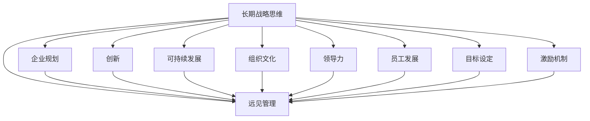

                 

# 远见管理：培养长期战略思维

> 关键词：长期战略思维,远见管理,企业规划,创新,可持续发展,组织文化,领导力,员工发展,目标设定,激励机制

## 1. 背景介绍

### 1.1 问题由来
在当今快速变化的商业环境中，企业面临着前所未有的不确定性和挑战。面对市场竞争加剧、技术迭代加速、消费者需求变化，企业需要具备超越短期盈利目标的长远眼光和战略思考，才能在激烈的市场竞争中保持领先地位，实现可持续发展。如何培养和实现远见管理，是每一个企业管理者和决策者必须认真思考的重要课题。

### 1.2 问题核心关键点
远见管理的关键在于构建长远的战略视角，制定并执行可持续发展战略，确保企业能够在未来保持竞争力。具体来说，包括以下几个核心关键点：

1. **长远目标设定**：明确企业的长期愿景和目标，制定清晰的战略规划，以应对未来的不确定性。
2. **创新驱动**：不断推动技术创新和业务创新，以持续适应市场变化和满足消费者需求。
3. **可持续发展**：关注社会责任和环境影响，制定环境、社会和治理（ESG）战略，确保企业的可持续发展。
4. **组织文化建设**：营造鼓励创新、支持变革的组织文化，提升员工的创造力和归属感。
5. **领导力发展**：培养具备长远视野和战略思维的领导团队，推动企业战略的实施。
6. **员工发展**：提供持续学习和职业发展机会，激励员工参与企业长期目标的实现。
7. **激励机制**：设计合理的激励机制，确保员工的长远贡献得到认可和回报。

### 1.3 问题研究意义
远见管理不仅有助于企业应对当前的挑战，更能在未来不确定的环境中保持竞争优势。通过培养长期战略思维，企业能够：

1. 增强抗风险能力：通过预测未来趋势，制定应对策略，减少不确定性带来的影响。
2. 提升创新能力：通过持续创新，适应市场变化，满足消费者需求，保持竞争优势。
3. 促进可持续发展：通过关注社会责任和环境影响，提升企业声誉和品牌价值。
4. 增强员工凝聚力：通过构建积极的组织文化和激励机制，提升员工满意度和忠诚度。

## 2. 核心概念与联系

### 2.1 核心概念概述

为更好地理解远见管理，本节将介绍几个密切相关的核心概念：

- **长期战略思维**：指企业制定和执行长期战略的能力，包括预见未来趋势、规划长远目标、推动持续创新等。
- **远见管理**：指企业管理者通过培养长远的战略思维，制定和实施可持续发展战略，实现企业的长远发展和价值创造。
- **企业规划**：指企业为实现长期目标而进行的全面规划，包括市场定位、资源配置、业务发展等。
- **创新**：指企业通过技术、产品、服务等方面的创新，持续提升市场竞争力。
- **可持续发展**：指企业在追求经济利益的同时，关注环境、社会和治理的影响，实现长期生存和发展。
- **组织文化**：指企业内部共同遵守的行为准则和价值观，对员工行为和绩效有重要影响。
- **领导力**：指企业领导者通过领导团队、决策执行，推动企业战略目标的实现。
- **员工发展**：指企业提供给员工的学习、培训和职业发展机会，提升员工的个人和团队能力。
- **目标设定**：指企业为实现长远目标，通过设定具体、可衡量的指标，明确任务和方向。
- **激励机制**：指企业通过设计合理的激励措施，鼓励员工为实现企业目标而努力。

这些核心概念之间的逻辑关系可以通过以下Mermaid流程图来展示：



这个流程图展示了几大核心概念及其之间的关系：

1. 长期战略思维是远见管理的基础。
2. 企业规划、创新、可持续发展、组织文化、领导力、员工发展、目标设定、激励机制等都是远见管理的具体实践手段。

## 3. 核心算法原理 & 具体操作步骤

### 3.1 算法原理概述

远见管理通常包括以下几个关键步骤：

1. **市场分析和预测**：通过分析当前市场趋势和消费者需求，预测未来的发展方向。
2. **目标设定和规划**：基于市场预测，制定具体、可衡量的长期目标和战略规划。
3. **资源配置和优化**：合理分配资源，优化业务流程，提升运营效率。
4. **技术创新和应用**：推动技术创新，提升产品和服务质量，满足市场需求。
5. **环境、社会和治理（ESG）战略**：制定并实施ESG战略，提升企业的社会责任感和环境友好度。
6. **组织文化和领导力建设**：营造积极的组织文化，培养具备长远视野的领导团队。
7. **员工发展和激励**：提供职业发展机会，设计激励机制，激发员工的创新潜力和工作积极性。

### 3.2 算法步骤详解

#### 3.2.1 市场分析和预测

市场分析和预测是远见管理的基础。企业需要通过以下步骤进行市场分析：

1. **数据收集**：收集市场数据、消费者数据、竞争对手数据等。
2. **数据分析**：使用统计分析、机器学习等方法，分析市场趋势和消费者需求。
3. **预测建模**：基于历史数据和当前情况，构建预测模型，预测未来市场走向。
4. **情景分析**：通过构建多个情景模型，分析不同市场变化对企业的影响。

具体来说，企业可以使用回归分析、时间序列分析、机器学习等方法进行数据分析和预测。例如，使用线性回归分析市场需求的变化趋势，使用随机森林进行消费者行为预测，使用深度学习进行市场动态变化预测。

#### 3.2.2 目标设定和规划

目标设定和规划是实现远见管理的关键步骤。企业可以通过以下步骤进行目标设定和规划：

1. **愿景和使命**：明确企业的愿景和使命，设定长期发展方向。
2. **SMART原则**：设定具体、可测量、可实现、相关和有时间限制的目标（SMART）。
3. **战略规划**：制定详细的战略规划，包括业务发展、技术创新、市场拓展等。
4. **优先级排序**：根据目标的重要性和紧急程度，确定优先级，制定实施计划。

具体来说，企业可以使用平衡计分卡（Balanced Scorecard）、OKR（Objectives and Key Results）等方法进行目标设定和规划。例如，使用平衡计分卡从财务、客户、内部流程、学习与成长四个维度设定目标，使用OKR设定具体目标和关键结果，明确任务和责任。

#### 3.2.3 资源配置和优化

资源配置和优化是实现远见管理的重要保障。企业可以通过以下步骤进行资源配置和优化：

1. **资源评估**：评估企业现有资源，包括财务资源、人力资源、技术资源等。
2. **优化流程**：优化业务流程，提高运营效率。
3. **资源配置**：根据战略规划，合理配置资源，支持业务发展。
4. **风险管理**：制定风险管理策略，降低不确定性带来的风险。

具体来说，企业可以使用流程改进工具（如BPM、Six Sigma）、项目管理工具（如PMP）进行资源配置和优化。例如，使用BPM优化业务流程，使用Six Sigma改进质量管理，使用PMP进行项目管理。

#### 3.2.4 技术创新和应用

技术创新和应用是实现远见管理的重要驱动力。企业可以通过以下步骤进行技术创新和应用：

1. **技术跟踪**：跟踪行业内的技术发展，了解前沿技术动态。
2. **研发投入**：增加研发投入，推动技术创新。
3. **产品开发**：开发新产品，提升市场竞争力。
4. **技术应用**：将新技术应用到业务中，提升运营效率和客户体验。

具体来说，企业可以使用敏捷开发（Agile Development）、DevOps、人工智能（AI）等方法进行技术创新和应用。例如，使用敏捷开发方法快速响应市场变化，使用DevOps提升研发效率，使用人工智能提升产品智能化水平。

#### 3.2.5 ESG战略

ESG战略是实现远见管理的可持续发展目标。企业可以通过以下步骤进行ESG战略实施：

1. **环境评估**：评估企业的环境影响，制定环境改进措施。
2. **社会责任**：明确企业的社会责任，制定社会责任计划。
3. **治理结构**：优化治理结构，提升治理效率。
4. **ESG报告**：定期发布ESG报告，透明公开企业的ESG表现。

具体来说，企业可以使用ESG评估工具（如GRI、CDSA）、可持续发展目标（SDGs）、ESG报告框架（如SASB、TIS）等方法进行ESG战略实施。例如，使用GRI评估环境影响，使用SDGs设定可持续发展目标，使用SASB制定ESG报告框架。

#### 3.2.6 组织文化和领导力建设

组织文化和领导力建设是实现远见管理的重要保障。企业可以通过以下步骤进行组织文化和领导力建设：

1. **文化建设**：营造积极的组织文化，提升员工归属感。
2. **领导力培养**：培养具备长远视野和战略思维的领导团队。
3. **团队建设**：组建高效的团队，提升团队协作能力。
4. **员工激励**：设计合理的激励机制，激发员工的创新潜力和工作积极性。

具体来说，企业可以使用文化建设工具（如Values Clarification）、领导力培养工具（如领导力发展计划）、团队建设工具（如Tuckman模型）、激励机制设计工具（如Broadbanding）等方法进行组织文化和领导力建设。例如，使用Values Clarification进行文化建设，使用领导力发展计划培养领导力，使用Tuckman模型进行团队建设，使用Broadbanding设计激励机制。

#### 3.2.7 员工发展和激励

员工发展和激励是实现远见管理的重要保障。企业可以通过以下步骤进行员工发展和激励：

1. **培训和发展**：提供持续学习和职业发展机会，提升员工的个人和团队能力。
2. **绩效评估**：设计科学的绩效评估体系，激励员工绩效提升。
3. **晋升机制**：建立公平的晋升机制，激励员工职业发展。
4. **薪酬激励**：设计合理的薪酬激励机制，吸引和保留优秀人才。

具体来说，企业可以使用培训发展工具（如eLearning）、绩效评估工具（如KPI）、晋升机制工具（如 succession planning）、薪酬激励工具（如股票期权）等方法进行员工发展和激励。例如，使用eLearning进行培训和发展，使用KPI设计绩效评估体系，使用succession planning进行晋升机制，使用股票期权进行薪酬激励。

### 3.3 算法优缺点

远见管理具有以下优点：

1. **提升竞争力**：通过制定长远战略和持续创新，提升企业的市场竞争力。
2. **降低风险**：通过预测未来趋势和制定风险管理策略，降低不确定性带来的风险。
3. **可持续发展**：通过关注环境、社会和治理的影响，提升企业的社会责任感和环境友好度。
4. **提高员工满意度**：通过提供职业发展和激励机制，提升员工的满意度和忠诚度。

但同时，远见管理也存在以下缺点：

1. **成本高**：制定和实施远见管理需要大量的资源和时间投入。
2. **复杂度高**：远见管理涉及多个部门和职能，协调和实施难度较大。
3. **短期效益不明显**：远见管理的回报周期较长，短期内可能无法看到明显的效益。
4. **变革阻力大**：远见管理通常需要变革现有的业务流程和管理模式，可能会遇到阻力。

### 3.4 算法应用领域

远见管理已经在多个领域得到了广泛应用，包括但不限于：

- **金融行业**：金融机构通过制定ESG战略，提升社会责任感和市场声誉。
- **高科技行业**：高科技企业通过持续技术创新，保持行业领先地位。
- **制造业**：制造业通过优化生产流程和供应链管理，提升运营效率。
- **零售行业**：零售企业通过数据分析和客户个性化推荐，提升客户体验和销售额。
- **教育行业**：教育机构通过培养创新型教师和课程，提升教学质量和学生满意度。

## 4. 数学模型和公式 & 详细讲解 & 举例说明

### 4.1 数学模型构建

假设企业当前的利润为 $P_0$，市场预测未来 $n$ 年后的利润为 $P_n$。根据市场分析和预测，可以构建以下数学模型：

$$
P_n = P_0 \cdot (1 + r)^n
$$

其中 $r$ 为年化增长率，$n$ 为预测年数。

### 4.2 公式推导过程

根据上述数学模型，可以推导出年化增长率 $r$ 的计算公式：

$$
r = \left(\frac{P_n}{P_0}\right)^{\frac{1}{n}} - 1
$$

例如，如果企业预测未来5年后的利润为100万元，当前利润为50万元，则：

$$
r = \left(\frac{100}{50}\right)^{\frac{1}{5}} - 1 = 0.2 = 20\%
$$

这意味着企业需要以20%的年化增长率实现目标。

### 4.3 案例分析与讲解

假设一家高科技公司当前利润为500万元，市场预测未来5年后的利润为2000万元，计算年化增长率：

$$
r = \left(\frac{2000}{500}\right)^{\frac{1}{5}} - 1 = 0.4983 \approx 49.83\%
$$

这意味着公司需要以49.83%的年化增长率实现目标。企业可以通过技术创新、市场拓展、成本控制等策略，推动年化增长率的实现。

## 5. 项目实践：代码实例和详细解释说明

### 5.1 开发环境搭建

在进行远见管理实践前，我们需要准备好开发环境。以下是使用Python进行Pandas、NumPy开发的环境配置流程：

1. 安装Anaconda：从官网下载并安装Anaconda，用于创建独立的Python环境。

2. 创建并激活虚拟环境：
```bash
conda create -n py-env python=3.8 
conda activate py-env
```

3. 安装Pandas：
```bash
conda install pandas
```

4. 安装NumPy：
```bash
conda install numpy
```

5. 安装各类工具包：
```bash
pip install numpy pandas scikit-learn matplotlib tqdm jupyter notebook ipython
```

完成上述步骤后，即可在`py-env`环境中开始远见管理实践。

### 5.2 源代码详细实现

下面是使用Pandas进行市场分析和目标设定的Python代码实现。

```python
import pandas as pd
import numpy as np

# 市场预测数据
market_data = pd.DataFrame({
    'Year': [2020, 2021, 2022, 2023, 2024],
    'Profit': [5000000, 6000000, 7000000, 8000000, 9000000]
})

# 计算年化增长率
growth_rates = []
for i in range(len(market_data)):
    n = i+1
    P_0 = market_data.iloc[0]['Profit']
    P_n = market_data.iloc[i]['Profit']
    r = (P_n / P_0) ** (1/n) - 1
    growth_rates.append(r)

market_data['Growth Rate'] = growth_rates
print(market_data)
```

### 5.3 代码解读与分析

让我们再详细解读一下关键代码的实现细节：

**市场预测数据**：
- `market_data` DataFrame存储了市场预测数据，包含年份和预测利润。

**计算年化增长率**：
- 通过循环计算每个时间点的年化增长率，并添加到`market_data` DataFrame中。

**输出结果**：
- 打印市场预测数据和计算出的年化增长率。

通过这段代码，我们可以看到如何使用Pandas进行市场分析和目标设定。在实际应用中，可以通过更复杂的数据处理和模型构建，实现更精确的预测和目标设定。

## 6. 实际应用场景

### 6.1 智能制造

智能制造通过自动化、数字化、网络化技术，提升制造效率和产品质量。远见管理在智能制造中的应用场景包括：

- **设备升级**：通过市场分析和预测，制定设备升级计划，提升设备性能和生产效率。
- **工艺优化**：通过数据分析和模型构建，优化生产工艺，降低生产成本。
- **供应链管理**：通过智能化管理，优化供应链流程，提升供应链效率。

### 6.2 智慧城市

智慧城市通过物联网、大数据、人工智能等技术，提升城市管理效率和居民生活质量。远见管理在智慧城市中的应用场景包括：

- **交通管理**：通过预测交通流量，优化交通信号，减少交通拥堵。
- **能源管理**：通过预测能源需求，优化能源供应，提升能源利用效率。
- **公共安全**：通过数据分析和预警，提升公共安全水平，保障居民安全。

### 6.3 健康医疗

健康医疗通过信息化、智能化技术，提升医疗服务质量和效率。远见管理在健康医疗中的应用场景包括：

- **远程医疗**：通过预测患者需求，优化资源配置，提升远程医疗服务水平。
- **疾病预防**：通过数据分析和预测，制定疾病预防策略，提升公共健康水平。
- **医疗设备**：通过技术创新和应用，提升医疗设备性能，改善患者体验。

### 6.4 未来应用展望

随着技术的不断进步，远见管理将在更多领域得到应用，为社会带来更深远的影响。

- **环保科技**：通过远见管理，企业可以制定可持续发展战略，推动环保技术的发展。
- **金融科技**：通过远见管理，金融机构可以制定风险管理策略，提升市场竞争力。
- **教育科技**：通过远见管理，教育机构可以制定人才培养计划，提升教学质量。
- **智能农业**：通过远见管理，农业企业可以制定智能化管理计划，提升农业生产效率。

## 7. 工具和资源推荐

### 7.1 学习资源推荐

为了帮助开发者系统掌握远见管理的技术基础和实践技巧，这里推荐一些优质的学习资源：

1. **《远见管理：构建未来的商业战略》**：一本介绍远见管理的经典书籍，涵盖远见管理的理论基础和实践方法。
2. **Coursera《远见管理与创新》课程**：斯坦福大学开设的商业管理课程，介绍远见管理的理论基础和实践案例。
3. **EDX《创新与远见管理》课程**：哈佛大学开设的创新管理课程，介绍创新和远见管理的最新研究成果。
4. **Udemy《远见管理与领导力》课程**：Udemy平台上系统讲解远见管理和领导力的课程，适合初学者和实践者。
5. **TED Talks《远见管理的力量》**：TED Talks上的演讲视频，介绍远见管理的思想和实践案例。

通过对这些资源的学习实践，相信你一定能够快速掌握远见管理的精髓，并用于解决实际的商业问题。

### 7.2 开发工具推荐

高效的开发离不开优秀的工具支持。以下是几款用于远见管理开发的常用工具：

1. **Pandas**：Python数据分析库，提供强大的数据处理和分析功能。
2. **NumPy**：Python数值计算库，提供高效的数组操作和数学函数。
3. **Jupyter Notebook**：Python交互式编程工具，支持代码编写、数据可视化、结果展示。
4. **GitHub**：代码版本控制系统，支持团队协作和代码共享。
5. **Google Colab**：谷歌提供的免费Jupyter Notebook环境，支持GPU和TPU算力，适合深度学习和大数据处理。

合理利用这些工具，可以显著提升远见管理任务的开发效率，加快创新迭代的步伐。

### 7.3 相关论文推荐

远见管理的研究源于学界的持续探索。以下是几篇奠基性的相关论文，推荐阅读：

1. **《远见管理的理论基础与实践方法》**：介绍远见管理的理论基础和实践方法，涵盖目标设定、资源配置、创新驱动等内容。
2. **《可持续发展战略与远见管理》**：介绍ESG战略和远见管理在可持续发展中的应用，提升企业的社会责任感和环境友好度。
3. **《创新驱动与远见管理》**：介绍创新和远见管理的关系，强调创新在远见管理中的重要性和实现路径。
4. **《组织文化和远见管理》**：介绍组织文化和远见管理的关系，强调组织文化在远见管理中的作用和建设方法。
5. **《领导力与远见管理》**：介绍领导力和远见管理的关系，强调领导力在远见管理中的重要性。

这些论文代表了大语言模型微调技术的发展脉络。通过学习这些前沿成果，可以帮助研究者把握学科前进方向，激发更多的创新灵感。

## 8. 总结：未来发展趋势与挑战

### 8.1 总结

本文对远见管理进行了全面系统的介绍。首先阐述了远见管理的研究背景和意义，明确了远见管理在制定长远战略、推动持续创新、提升可持续发展能力等方面的独特价值。其次，从原理到实践，详细讲解了远见管理的核心步骤和关键技术，给出了市场分析和目标设定的Python代码实例。同时，本文还广泛探讨了远见管理在智能制造、智慧城市、健康医疗等多个领域的应用前景，展示了远见管理的广阔前景。

通过本文的系统梳理，可以看到，远见管理不仅有助于企业应对当前的挑战，更能在未来不确定的环境中保持竞争优势。通过培养长期战略思维，企业能够增强抗风险能力、提升创新能力、促进可持续发展、增强员工凝聚力。

### 8.2 未来发展趋势

展望未来，远见管理将呈现以下几个发展趋势：

1. **数字化转型加速**：数字化转型成为企业的必选项，远见管理将进一步推动企业的数字化升级。
2. **人工智能与远见管理结合**：AI技术在数据分析、预测、决策等方面的应用，将提升远见管理的精准性和预测能力。
3. **全球化与远见管理**：全球化市场环境下，远见管理将更加注重跨文化管理、全球资源配置等。
4. **可持续发展成为主流**：ESG战略将更加普及，远见管理将更加注重社会责任和环境影响。
5. **区块链与远见管理**：区块链技术在数据透明、追溯、共享等方面的应用，将提升远见管理的效率和可信度。

以上趋势凸显了远见管理在数字化、智能化、全球化等方面的重要性和发展潜力。这些方向的探索发展，将推动远见管理向更高的层次迈进，为构建未来社会提供新的动力。

### 8.3 面临的挑战

尽管远见管理已经取得了瞩目成就，但在迈向更加智能化、普适化应用的过程中，它仍面临诸多挑战：

1. **市场变化不确定性**：市场变化的不确定性使得预测和规划更加困难。
2. **资源和成本投入**：远见管理需要大量的资源和成本投入，尤其是数字化转型和AI应用。
3. **文化和变革阻力**：企业内部的文化和变革阻力可能会影响远见管理的实施。
4. **数据安全和隐私**：数据安全和隐私问题需要企业在远见管理中加以重视。
5. **技术复杂性**：AI和大数据技术的复杂性使得远见管理的实施难度增加。

### 8.4 研究展望

面对远见管理所面临的种种挑战，未来的研究需要在以下几个方面寻求新的突破：

1. **市场预测技术提升**：通过深度学习和预测模型提升市场预测的准确性。
2. **资源优化算法创新**：通过优化算法提升资源配置和优化效率。
3. **AI技术应用深化**：深入探索AI技术在远见管理中的应用，提升远见管理的智能化水平。
4. **可持续发展战略优化**：优化ESG战略，提升企业的社会责任感和环境友好度。
5. **组织文化和领导力理论创新**：探索组织文化和领导力的新理论和实践方法，提升远见管理的效果。

这些研究方向的探索，将引领远见管理向更高的层次迈进，为构建未来社会提供新的动力。面向未来，远见管理还需要与其他人工智能技术进行更深入的融合，如知识表示、因果推理、强化学习等，多路径协同发力，共同推动远见管理的进步。

## 9. 附录：常见问题与解答

**Q1：远见管理与短期盈利目标有何区别？**

A: 远见管理着眼于企业长期的可持续发展，通过制定和执行长远战略，提升企业的市场竞争力。而短期盈利目标则更注重当前的经济利益，可能忽视了企业的长期发展和未来风险。

**Q2：如何制定合理的目标和战略规划？**

A: 制定合理的目标和战略规划，需要遵循SMART原则，即具体(Specific)、可测量(Measurable)、可实现(Achievable)、相关(Relevant)、有时间限制(Time-bound)。具体来说，可以通过市场分析和预测，制定明确的长期目标和战略规划，并根据实际情况进行调整和优化。

**Q3：远见管理是否需要大量资源投入？**

A: 远见管理通常需要大量的资源投入，包括财务资源、人力资源、技术资源等。但这些投入可以在长期内带来更大的回报，提升企业的市场竞争力。

**Q4：远见管理是否适合所有企业？**

A: 远见管理适合有一定规模和资源的企业，特别是那些具备远见管理和创新能力的企业。对于小型企业或初创企业，可以先从短期目标和战略规划入手，逐步提升远见管理水平。

**Q5：远见管理如何平衡短期和长期目标？**

A: 远见管理需要平衡短期和长期目标，制定合理的战略规划和资源配置。通过科学的决策机制和激励机制，确保短期目标的实现不会损害长期目标。例如，使用OKR（Objectives and Key Results）方法，将短期目标和长期目标结合起来，设定合理的指标和优先级。

通过这些问题的解答，希望你对远见管理有更全面的了解，并能够将远见管理应用于实际业务中，推动企业实现长期发展目标。

---

作者：禅与计算机程序设计艺术 / Zen and the Art of Computer Programming

