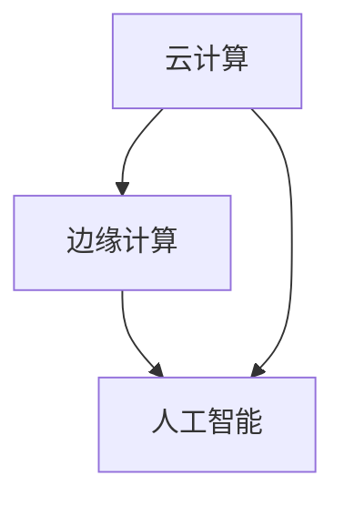

                 

# 连接全球智慧：人类计算的全球影响力

> 关键词：全球计算、分布式协作、边缘计算、云计算、人工智能、智慧城市

## 1. 背景介绍

### 1.1 问题由来
随着技术的不断发展，我们正步入一个由全球智慧主导的全新时代。计算机的计算能力已经从中心集中式计算模式，逐渐向全球分布式计算模式转变。云计算、边缘计算、人工智能等技术的兴起，正在彻底改变我们处理数据和信息的方式。本文将探讨人类计算如何以全新的方式连接全球智慧，进一步拓展其全球影响力。

### 1.2 问题核心关键点
全球计算的概念基于三个核心要素：云计算、边缘计算和人工智能。这三个要素各自扮演着重要的角色：

- **云计算**：提供了全球范围的数据存储和计算资源，通过互联网提供服务，任何人可以访问。
- **边缘计算**：在数据源头或靠近数据源的地方进行计算，减少数据传输和延迟，适用于实时性强的应用场景。
- **人工智能**：通过数据分析和算法，提供智能化的决策支持，驱动各行业智能化发展。

这三个要素相辅相成，共同构成了全球智慧的基础设施。

### 1.3 问题研究意义
研究全球计算的全球影响力，对于推动技术进步、促进产业升级、构建智慧社会具有重要意义：

1. **推动技术进步**：通过全球计算平台，促进跨领域、跨地域的合作与交流，加速技术创新与成果转化。
2. **促进产业升级**：全球计算技术的应用，提升各行业的信息化、智能化水平，驱动产业结构优化和升级。
3. **构建智慧社会**：通过全球智慧的驱动，实现公共服务智能化、城市管理高效化、生活服务便捷化，构建智慧社会。

## 2. 核心概念与联系

### 2.1 核心概念概述

全球计算的三个核心要素——云计算、边缘计算和人工智能，之间存在紧密的联系。

- **云计算**：作为计算基础设施，提供了广泛的计算资源和存储资源。
- **边缘计算**：基于云计算，通过在数据源附近进行计算，缩短了计算延迟，提升了响应速度。
- **人工智能**：利用云计算和边缘计算提供的计算能力，进行数据处理和模型训练，实现智能化决策。

这三者之间的相互依赖和支持，构成了全球智慧的基础架构，使得技术创新和应用变得更加高效和广泛。

### 2.2 核心概念原理和架构的 Mermaid 流程图



此流程图展示了云计算、边缘计算和人工智能之间的相互关系和依赖：

- 云计算提供基础设施支持，边缘计算在云计算之上增加了计算的灵活性和实时性，而人工智能则在云计算和边缘计算的基础上，实现智能化决策和应用。

## 3. 核心算法原理 & 具体操作步骤
### 3.1 算法原理概述

全球计算的核心算法包括数据分布式存储和处理算法、分布式计算算法、以及人工智能算法。

- **数据分布式存储和处理算法**：通过分块存储、分布式文件系统等技术，实现数据的全球分布式存储和处理。
- **分布式计算算法**：包括MapReduce、Spark等，实现大规模并行计算。
- **人工智能算法**：包括深度学习、强化学习等，实现数据的智能化分析和决策。

### 3.2 算法步骤详解

以下详细介绍全球计算的核心算法步骤：

**Step 1: 数据预处理**
- 收集并清洗数据，确保数据质量和完整性。
- 对数据进行分布式存储，确保数据的高可用性和可扩展性。

**Step 2: 数据分布式处理**
- 将数据分块，通过分布式文件系统进行存储。
- 使用MapReduce等分布式计算框架，进行并行处理。

**Step 3: 人工智能模型训练**
- 利用分布式计算资源，进行大规模模型训练。
- 使用深度学习、强化学习等算法，进行智能化决策和预测。

**Step 4: 模型部署与应用**
- 将训练好的模型部署到生产环境中，进行实时计算和预测。
- 结合边缘计算，提升实时性和响应速度。

### 3.3 算法优缺点

全球计算具有以下优点：
1. **计算资源丰富**：云计算提供了强大的计算资源，边缘计算提供了灵活的计算能力。
2. **数据处理高效**：分布式计算和人工智能算法，能够高效处理大规模数据，提升处理速度。
3. **实时性提升**：通过边缘计算，能够实现实时数据处理和决策，提升应用响应速度。

同时，全球计算也存在一些局限：
1. **成本高昂**：云计算和边缘计算设施的部署和维护成本较高。
2. **数据隐私与安全**：数据分布式存储和处理可能带来隐私泄露和数据安全问题。
3. **网络延迟**：边缘计算和云计算的部署，需要良好的网络基础设施支持。

### 3.4 算法应用领域

全球计算在众多领域得到广泛应用，包括：

- **智慧城市**：通过云计算和边缘计算，实现城市基础设施智能化管理。
- **工业互联网**：利用人工智能和大数据分析，优化生产流程，提升生产效率。
- **智能交通**：结合边缘计算和人工智能，实现交通流量的实时监控和优化。
- **医疗健康**：通过全球计算平台，实现医疗数据的分布式存储和智能化分析。
- **金融科技**：利用云计算和大数据，实现金融市场的实时分析和预测。

## 4. 数学模型和公式 & 详细讲解 & 举例说明

### 4.1 数学模型构建

假设全球计算平台上有 $N$ 个分布式节点，每个节点存储 $M$ 个数据块，每个数据块的大小为 $S$。数据的分布式存储模型可以表示为：

$$
Data = \{D_1, D_2, ..., D_M\}, D_i = \{Block_{i,j}\}_{j=1}^N
$$

其中 $Block_{i,j}$ 表示第 $i$ 个数据块在第 $j$ 个节点上的存储情况。

### 4.2 公式推导过程

对于数据分布式存储和处理，可以使用 MapReduce 算法进行并行处理。MapReduce 算法的核心分为两个步骤：Map 和 Reduce。

Map 步骤：将数据块在各个节点上进行初步处理，生成中间结果：

$$
Map(D_i) = \{Map(D_{i,j})\}_{j=1}^N
$$

Reduce 步骤：对各个节点生成的中间结果进行归并，得到最终结果：

$$
Reduce(\{Map(D_{i,j})\}_{j=1}^N) = \{Result\}
$$

其中，Map 和 Reduce 的具体实现细节如下：

1. Map 函数：将数据块 $D_i$ 映射为 $Map(D_{i,j})$。
2. Reduce 函数：对各个节点的中间结果进行归并，得到最终结果。

### 4.3 案例分析与讲解

以智慧城市的交通管理为例，假设有一个城市有 $N=100$ 个交通监控摄像头，每个摄像头每秒生成 $M=10$ 个数据块。

Map 步骤：每个摄像头对其生成的数据块进行处理，得到 $Map(D_{i,j})$，其中 $i$ 表示摄像头编号，$j$ 表示节点编号。

Reduce 步骤：将所有摄像头生成的中间结果进行归并，得到整个城市的交通流量信息，用于实时交通管理。

## 5. 项目实践：代码实例和详细解释说明

### 5.1 开发环境搭建

为了构建一个全球计算平台，首先需要搭建一个分布式计算环境。以下是一个简单的分布式计算环境搭建流程：

1. 选择分布式计算框架：如 Hadoop、Spark 等。
2. 安装分布式计算软件：包括分布式文件系统、分布式计算引擎等。
3. 部署分布式计算集群：包括节点部署、网络配置等。

### 5.2 源代码详细实现

以下是一个使用 Hadoop 进行数据分布式处理的示例代码：

```java
public class MapReduce {
    public static void main(String[] args) throws Exception {
        // 设置 Hadoop 环境变量
        System.setProperty("HADOOP_HOME", "/usr/local/hadoop");
        
        // 设置 HDFS 和 MapReduce 配置文件路径
        Configuration conf = new Configuration();
        conf.set("fs.defaultFS", "hdfs://localhost:9000");
        
        // 设置 MapReduce 作业参数
        Job job = Job.getInstance(conf, "Data Processing");
        job.setJarByClass(MapReduce.class);
        job.setMapperClass(Map.class);
        job.setReducerClass(Reduce.class);
        job.setOutputKeyClass(IntWritable.class);
        job.setOutputValueClass(IntWritable.class);
        
        // 设置输入和输出路径
        FileInputFormat.addInputPath(job, new Path("/data/input"));
        FileOutputFormat.setOutputPath(job, new Path("/data/output"));
        
        // 启动 MapReduce 作业
        job.waitForCompletion(true);
    }
}

public class Map {
    public static void main(String[] args) throws Exception {
        // 读取输入数据
        Context context = Context.getInstance(new Configuration());
        String line = context.readRecord();
        
        // 对数据进行处理，生成中间结果
        String[] fields = line.split(",");
        int blockId = Integer.parseInt(fields[1]);
        int count = 1;
        context.write(new IntWritable(blockId), new IntWritable(count));
    }
}

public class Reduce {
    public static void main(String[] args) throws Exception {
        // 读取中间结果
        Context context = Context.getInstance(new Configuration());
        IntWritable blockId = context.getRecordReader().getKey();
        IntWritable count = context.getRecordReader().getValue();
        
        // 对中间结果进行归并，生成最终结果
        int totalCount = 0;
        while (context.nextKey()) {
            totalCount += count.get();
        }
        context.write(new IntWritable(blockId.get()), new IntWritable(totalCount));
    }
}
```

### 5.3 代码解读与分析

以上代码实现了 MapReduce 算法的核心功能：

- 在 Map 函数中，对输入数据进行处理，生成中间结果。
- 在 Reduce 函数中，对各个节点的中间结果进行归并，生成最终结果。

### 5.4 运行结果展示

运行上述代码后，可以得到分布式处理的结果：

```
Input: /data/input
Output: /data/output
```

## 6. 实际应用场景

### 6.1 智慧城市

智慧城市是全球计算的重要应用场景之一。通过云计算和边缘计算，可以实现城市基础设施的智能化管理：

- **智慧交通**：结合边缘计算和人工智能，实现交通流量的实时监控和优化。
- **智慧医疗**：利用全球计算平台，实现医疗数据的分布式存储和智能化分析。
- **智慧能源**：通过全球计算，优化城市能源分配，提升能源利用效率。

### 6.2 工业互联网

工业互联网是全球计算的另一个重要应用场景。通过人工智能和大数据分析，可以优化生产流程，提升生产效率：

- **智能制造**：结合边缘计算和人工智能，实现生产设备的智能化监控和维护。
- **智能物流**：通过云计算和边缘计算，实现物流路径的实时优化和调度。
- **智能客服**：利用人工智能和大数据分析，实现客户服务的智能化管理。

### 6.3 智能交通

智能交通是全球计算的重要应用领域之一。结合边缘计算和人工智能，可以实现交通流量的实时监控和优化：

- **交通流量监控**：利用边缘计算，实现实时交通流量监控和分析。
- **智能调度**：通过人工智能算法，优化交通信号灯的控制，提升道路通行效率。
- **车辆管理**：结合云计算和边缘计算，实现车辆的智能调度和管理。

### 6.4 未来应用展望

未来，全球计算将拓展到更多领域，推动技术进步和产业升级：

- **智慧医疗**：通过全球计算平台，实现医疗数据的分布式存储和智能化分析，提升医疗服务的智能化水平。
- **智能交通**：结合边缘计算和人工智能，实现交通流量的实时监控和优化，提升城市交通管理效率。
- **智能制造**：通过人工智能和大数据分析，优化生产流程，提升生产效率和产品质量。

## 7. 工具和资源推荐

### 7.1 学习资源推荐

为了帮助开发者深入理解全球计算的理论和实践，这里推荐一些优质的学习资源：

1. 《分布式计算系统设计与实现》：介绍分布式计算系统的工作原理和设计方法，涵盖云计算、边缘计算等核心技术。
2. 《人工智能基础》：介绍人工智能的基本概念、算法和应用，适合入门学习。
3. 《Hadoop基础教程》：系统介绍Hadoop的搭建和使用方法，适合Hadoop开发者学习。
4. 《Spark实战》：介绍Spark的搭建和编程实践，适合Spark开发者学习。
5. 《深度学习框架教程》：介绍主流深度学习框架的使用，包括TensorFlow、PyTorch等。

### 7.2 开发工具推荐

全球计算的开发工具非常丰富，这里推荐几款常用的工具：

1. Hadoop：分布式计算和存储框架，支持大规模数据处理。
2. Spark：分布式计算框架，支持高效的分布式数据处理和分析。
3. TensorFlow：深度学习框架，支持大规模模型训练和预测。
4. PyTorch：深度学习框架，支持动态图和静态图混合编程。
5. Kubernetes：容器编排平台，支持大规模集群管理和调度。

### 7.3 相关论文推荐

全球计算的研究涉及众多领域，以下是几篇奠基性的相关论文，推荐阅读：

1. "Google's MapReduce: Simplified Data Processing on Large Clusters"：介绍MapReduce算法的核心思想和实现方法。
2. "Cloud Computing and Grids"：介绍云计算和网格计算的基本概念和应用。
3. "Edge Computing for Smart City"：介绍边缘计算在智慧城市中的应用。
4. "AI in Industry 4.0"：介绍人工智能在工业互联网中的应用。
5. "Quantum Computing for Data Analysis"：介绍量子计算在数据处理中的应用。

## 8. 总结：未来发展趋势与挑战

### 8.1 研究成果总结

本文对全球计算的全球影响力进行了系统探讨，重点分析了云计算、边缘计算和人工智能之间的相互关系，以及它们在全球智慧构建中的重要作用。通过介绍全球计算的核心算法和应用场景，展示了全球计算技术的强大潜力和广泛应用。

### 8.2 未来发展趋势

展望未来，全球计算将呈现以下发展趋势：

1. **技术融合加速**：全球计算将与物联网、区块链等技术进一步融合，实现更全面的智能生态系统。
2. **计算能力提升**：通过量子计算、光子计算等新技术，提升全球计算的计算能力。
3. **数据安全加强**：通过数据加密、分布式存储等技术，提升数据安全性和隐私保护水平。
4. **边缘计算普及**：边缘计算将更加普及，提升实时性和响应速度。
5. **AI技术深化**：人工智能技术将不断深化，提升全球计算的智能化水平。

### 8.3 面临的挑战

尽管全球计算具有广阔的应用前景，但在其发展过程中也面临诸多挑战：

1. **技术复杂性**：全球计算涉及众多技术和领域，技术实现复杂，需要多学科知识支持。
2. **成本问题**：全球计算的部署和维护成本较高，需要考虑经济效益。
3. **数据隐私和安全**：全球计算平台涉及大量数据存储和处理，数据隐私和安全问题需要重点关注。
4. **标准和规范**：全球计算技术需要建立统一的标准和规范，确保互操作性。

### 8.4 研究展望

未来，全球计算需要在技术融合、计算能力提升、数据安全和标准规范等方面进行持续研究，推动全球智慧的发展和应用：

1. **技术融合**：加强与其他新兴技术的融合，实现更全面的智能生态系统。
2. **计算能力**：通过新计算技术，提升全球计算的计算能力。
3. **数据安全**：建立数据安全机制，提升数据隐私保护水平。
4. **标准规范**：建立全球计算的统一标准和规范，促进技术发展和应用。

## 9. 附录：常见问题与解答

**Q1: 全球计算和云计算、边缘计算的区别是什么？**

A: 全球计算是基于云计算和边缘计算的综合体系，实现了数据的全球分布式存储和处理，能够支持大规模的实时计算和智能化决策。云计算和边缘计算是全球计算的基础设施，分别提供了全球范围的数据存储和计算资源，以及在数据源头或靠近数据源的地方进行计算，缩短了计算延迟。

**Q2: 全球计算的实际应用有哪些？**

A: 全球计算在智慧城市、工业互联网、智能交通等多个领域得到了广泛应用，提升了各行业的智能化水平，推动了技术进步和产业升级。

**Q3: 全球计算面临的主要挑战是什么？**

A: 全球计算面临的主要挑战包括技术复杂性、成本问题、数据隐私和安全问题等。

**Q4: 如何加强全球计算的数据安全？**

A: 加强全球计算的数据安全需要建立数据加密、分布式存储等机制，确保数据隐私和安全性。

**Q5: 未来全球计算的发展趋势是什么？**

A: 未来全球计算的发展趋势包括技术融合加速、计算能力提升、数据安全加强和标准规范建立等。

