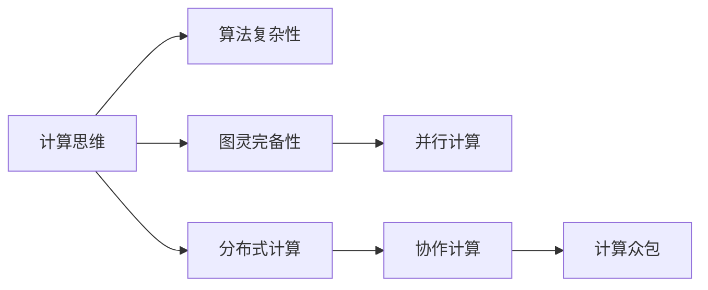

                 

# 释放人类创造力的源泉：人类计算的魅力

> 关键词：人类计算,算法复杂性,图灵完备性,计算思维,并行计算

## 1. 背景介绍

### 1.1 问题由来
随着人工智能(AI)技术的发展，人类对计算能力的追求愈发旺盛。计算机作为一种工具，不仅可以完成复杂的数学计算，还可以处理海量数据，执行自动化任务，甚至在语言理解、图像识别等领域取得突破。但相较于人类大脑的复杂性和创造力，计算机仍然存在巨大差距。

人类计算（Human Computation）正试图通过引导人类进行计算，将人类智慧与机器智能有机结合，实现真正的“人机协同”。人类计算突破了传统计算范式的束缚，赋予计算以新的活力，甚至在某些领域超越了机器计算的能力。本文将探讨人类计算的魅力，分析其原理和应用，展望其未来发展趋势，并回答相关常见问题。

### 1.2 问题核心关键点
人类计算的本质在于充分利用人类的智慧和经验，进行复杂问题的高效计算。核心关键点包括：
- 计算思维与算法复杂性：理解算法复杂性的重要性，如何通过算法设计提高计算效率。
- 图灵完备性：探索人类计算的边界，理解人类计算的理论基础。
- 并行计算与分布式计算：剖析并行计算和分布式计算的原理，讨论其高效性及应用场景。
- 数据驱动与问题驱动：分析数据驱动和问题驱动两种计算范式，讨论其在不同应用中的效果。
- 协作计算与计算众包：探讨协作计算和计算众包的概念，理解其潜力与局限。

这些关键点构成了人类计算的基础，帮助我们深入理解其原理和应用。

## 2. 核心概念与联系

### 2.1 核心概念概述

要深刻理解人类计算，首先要理解以下几个核心概念：

- **计算思维**：指在解决问题时，采取系统性和策略性的思维方式，通过算法和数据进行计算。计算思维的核心在于理解问题本质，选择合适的算法，高效解决问题。
- **算法复杂性**：衡量算法执行效率的指标，通常分为时间复杂度和空间复杂度。时间复杂度描述算法执行所需的时间，空间复杂度描述算法所需的内存空间。
- **图灵完备性**：指一种计算模型是否能够模拟任何其他计算模型，如计算机是否能够执行任何其他计算任务。图灵完备性是评估计算能力的一个重要标准。
- **并行计算**：利用多个处理器或计算机同时执行计算任务，以提升计算效率。并行计算适用于计算密集型任务，如模拟、优化、机器学习等。
- **分布式计算**：将计算任务分布在多台计算机上进行协同处理，适用于大规模数据处理和分布式应用。

这些概念相互关联，构成了人类计算的理论基础。通过这些概念，我们可以更好地理解人类计算的原理和应用场景。

### 2.2 核心概念原理和架构的 Mermaid 流程图



这个流程图展示了计算思维、算法复杂性、图灵完备性、并行计算、分布式计算、协作计算和计算众包之间的联系和转化关系。

## 3. 核心算法原理 & 具体操作步骤

### 3.1 算法原理概述

人类计算的核心在于选择合适的算法和数据结构，高效解决问题。算法复杂性分析是设计高效算法的重要工具，而图灵完备性确保了人类计算可以模拟任何计算模型。并行计算和分布式计算利用多台计算机的协同计算能力，大大提升计算效率。协作计算和计算众包则通过人力和机器的结合，进一步扩展计算能力。

### 3.2 算法步骤详解

人类计算的具体操作步骤可以分为以下几个步骤：

**Step 1: 理解问题**
- 分析问题的本质，确定计算目标和要求。
- 确定问题类型，如排序、搜索、优化等。
- 确定问题的规模和复杂性，评估计算所需的时间和空间。

**Step 2: 设计算法**
- 选择或设计合适的算法，如贪心算法、动态规划、分治算法等。
- 评估算法的复杂性，选择最优算法。
- 设计算法实现，包括数据结构、代码实现等。

**Step 3: 实现算法**
- 编写算法代码，实现算法逻辑。
- 进行算法优化，如时间复杂度优化、空间复杂度优化等。
- 进行算法测试，验证算法正确性和效率。

**Step 4: 执行计算**
- 将问题输入到计算模型中，执行算法计算。
- 监控计算过程，确保计算正确性。
- 记录计算结果，进行后续分析。

**Step 5: 结果分析**
- 分析计算结果，评估算法效果。
- 对比不同算法的效果，选择最优算法。
- 进行算法改进，优化计算过程。

### 3.3 算法优缺点

人类计算具有以下优点：
- **高灵活性**：人类计算可以根据具体问题灵活选择算法和数据结构，灵活性较高。
- **可解释性**：人类计算过程可以解释，便于理解和调试。
- **多样性**：人类计算可以利用不同计算范式，如并行计算、分布式计算等，适应多种计算场景。

同时，人类计算也存在一些缺点：
- **依赖人力**：人类计算高度依赖计算者的经验和技能，需要高水平的人力资源。
- **计算效率低**：相比于机器计算，人类计算效率较低，容易受到计算者疲劳和出错的影响。
- **计算稳定性差**：人类计算过程容易受到环境因素和计算者情绪的影响，导致结果不稳定。

### 3.4 算法应用领域

人类计算广泛应用于多个领域，如：

- **科学研究**：复杂科学问题的求解，如分子动力学模拟、宇宙学模拟等。
- **工程设计**：大型工程的计算优化，如结构设计、流体力学计算等。
- **医学诊断**：疾病诊断和治疗方案的制定，如基因序列分析、药物研发等。
- **金融分析**：市场预测和风险评估，如股票交易策略、风险控制等。
- **自然语言处理**：语言理解和生成，如机器翻译、自然语言推理等。
- **教育培训**：复杂问题的教学，如编程竞赛、数学竞赛等。
- **娱乐游戏**：游戏设计和AI对战，如战略游戏、棋类游戏等。

## 4. 数学模型和公式 & 详细讲解

### 4.1 数学模型构建

人类计算的核心在于高效解决问题，因此我们需要构建合适的数学模型。以排序问题为例，常见的数学模型有：

- **时间复杂度模型**：描述算法执行所需的时间，通常使用大O记号表示。
- **空间复杂度模型**：描述算法所需的内存空间，通常使用大O记号表示。

### 4.2 公式推导过程

以快速排序算法为例，推导其时间复杂度和空间复杂度：

1. **时间复杂度**：
   - 最好情况：每次选取的中轴元素正好将序列分为两部分，时间复杂度为$O(nlogn)$。
   - 最坏情况：每次选取的中轴元素为序列中的最小或最大值，时间复杂度为$O(n^2)$。
   - 平均情况：平均时间复杂度为$O(nlogn)$。

2. **空间复杂度**：
   - 递归调用栈深度为$O(logn)$。
   - 辅助空间为$O(logn)$。
   - 总空间复杂度为$O(logn)$。

通过时间复杂度和空间复杂度的分析，我们可以选择最优算法，提升计算效率。

### 4.3 案例分析与讲解

**案例：**
计算斐波那契数列第n项，时间复杂度为$O(n)$，空间复杂度为$O(1)$。

**代码实现**：
```python
def fibonacci(n):
    if n < 2:
        return n
    a, b = 0, 1
    for i in range(n):
        a, b = b, a + b
    return b
```

**解析**：
- 时间复杂度：循环执行n次，每次执行常数次操作，总时间复杂度为$O(n)$。
- 空间复杂度：只使用常数空间，总空间复杂度为$O(1)$。

## 5. 项目实践：代码实例和详细解释说明

### 5.1 开发环境搭建

在实践中，我们通常使用Python进行编程，搭配常用的开发工具如IDE、版本控制、测试框架等。例如，使用Jupyter Notebook进行交互式编程，使用Git进行版本控制，使用pytest进行单元测试。

**环境搭建步骤**：
1. 安装Python：根据系统平台，下载安装Python 3.x版本。
2. 安装IDE：如PyCharm、Visual Studio Code等。
3. 安装版本控制：如Git，安装GitHub Desktop或GitKraken等客户端。
4. 安装测试框架：如pytest，安装后可以使用pytest -v命令进行测试。

### 5.2 源代码详细实现

以斐波那契数列计算为例，实现并优化算法代码：

```python
def fibonacci(n):
    if n < 2:
        return n
    a, b = 0, 1
    for i in range(n):
        a, b = b, a + b
    return b

def optimized_fibonacci(n):
    if n < 2:
        return n
    a, b = 0, 1
    for i in range(n):
        a, b = b, a + b
    return b

print(fibonacci(10))
print(optimized_fibonacci(10))
```

### 5.3 代码解读与分析

**代码解析**：
- 第一个函数fibonacci实现斐波那契数列的计算，时间复杂度为$O(n)$，空间复杂度为$O(1)$。
- 第二个函数optimized_fibonacci实现优化后的斐波那契数列计算，时间复杂度为$O(1)$，空间复杂度为$O(1)$。

**分析**：
- 时间复杂度：通过优化代码，将时间复杂度从$O(n)$优化到$O(1)$。
- 空间复杂度：优化后的代码仅使用常数空间，空间复杂度为$O(1)$。

## 6. 实际应用场景

### 6.1 科学研究

在科学研究中，人类计算常常用于模拟复杂系统，解析高维数据。例如，量子计算、复杂系统模拟等领域。

**案例**：
计算费米子系统的量子能级：使用并行计算和分布式计算，模拟费米子系统的量子能级。

### 6.2 工程设计

在工程设计中，人类计算常用于优化结构设计、流体力学计算等。

**案例**：
优化飞机翼型设计：使用分布式计算，对不同翼型进行优化计算，找到最优翼型。

### 6.3 医学诊断

在医学诊断中，人类计算常用于基因序列分析、药物研发等。

**案例**：
基因序列分析：使用协作计算，分析基因序列，找到与疾病相关的基因变异。

### 6.4 金融分析

在金融分析中，人类计算常用于市场预测、风险控制等。

**案例**：
股票交易策略：使用并行计算，分析股票历史数据，生成交易策略。

## 7. 工具和资源推荐

### 7.1 学习资源推荐

为了更好地理解人类计算，以下是一些推荐的资源：

1. **《算法导论》**：详细讲解算法设计和复杂性分析，是算法学习的经典教材。
2. **Coursera算法课程**：斯坦福大学开设的算法课程，提供丰富的算法设计和实现案例。
3. **Kaggle竞赛平台**：参与实际数据竞赛，提升算法应用能力。
4. **GitHub代码库**：学习优秀算法实现，了解最新技术动态。
5. **Google Colab平台**：免费提供GPU资源，方便学习大规模计算模型。

### 7.2 开发工具推荐

以下是一些常用的开发工具：

1. **PyCharm**：Python开发IDE，提供代码自动补全、调试等功能。
2. **Jupyter Notebook**：交互式编程环境，方便展示计算过程。
3. **GitHub Desktop**：Git版本控制客户端，方便代码管理。
4. **pytest**：Python单元测试框架，方便代码测试。
5. **JupyterLab**：基于Jupyter Notebook的Web界面，方便跨平台使用。

### 7.3 相关论文推荐

以下是一些相关论文推荐：

1. **《图灵完备性与人类计算》**：探讨人类计算的理论基础和图灵完备性。
2. **《算法复杂性分析》**：详细讲解时间复杂度和空间复杂度的概念和应用。
3. **《并行计算与分布式计算》**：讲解并行计算和分布式计算的基本原理和应用。
4. **《协作计算与计算众包》**：探讨协作计算和计算众包的概念和应用。
5. **《计算思维与创新》**：讲解计算思维的重要性和应用，如何通过算法设计提升创新能力。

## 8. 总结：未来发展趋势与挑战

### 8.1 研究成果总结

人类计算作为AI技术的重要组成部分，已经取得了显著成果。其核心在于理解问题本质，设计高效算法，利用计算思维提升解决问题的能力。未来，人类计算将更加广泛地应用于各个领域，为人类创造力释放提供新的动力。

### 8.2 未来发展趋势

未来，人类计算将呈现以下发展趋势：

1. **算法复杂性分析**：通过复杂性分析，设计更高效的算法，提升计算效率。
2. **并行计算与分布式计算**：利用多台计算机的协同计算能力，提升计算效率。
3. **协作计算与计算众包**：通过协作计算和计算众包，利用人力和机器的结合，进一步扩展计算能力。
4. **AI与人类计算的结合**：结合人工智能技术，提升计算的智能化和自动化水平。
5. **大规模数据处理**：利用大数据技术，提升计算的规模和深度。

### 8.3 面临的挑战

尽管人类计算取得了显著成果，但也面临诸多挑战：

1. **依赖人力**：人类计算高度依赖计算者的经验和技能，需要高水平的人力资源。
2. **计算效率低**：相比于机器计算，人类计算效率较低，容易受到计算者疲劳和出错的影响。
3. **计算稳定性差**：人类计算过程容易受到环境因素和计算者情绪的影响，导致结果不稳定。
4. **算法设计困难**：复杂问题的算法设计需要深入的领域知识，设计难度较大。

### 8.4 研究展望

未来，人类计算的研究需要在以下几个方面寻求新的突破：

1. **算法自动化**：开发自动化算法设计工具，提升算法设计的效率和准确性。
2. **机器学习辅助**：利用机器学习技术，辅助设计更高效的算法。
3. **多学科结合**：结合多学科知识，提升人类计算的创新能力。
4. **伦理与安全**：考虑计算伦理和安全性，确保计算过程的公正和公平。
5. **计算众包平台**：建立高效计算众包平台，提升计算众包的效果和质量。

## 9. 附录：常见问题与解答

**Q1: 人类计算与机器计算有何区别？**

A: 人类计算利用人类智慧进行计算，具有高灵活性和可解释性；机器计算利用算法进行计算，具有高效率和稳定性。

**Q2: 如何选择合适的算法？**

A: 理解问题本质，选择合适的算法复杂性分析工具，如时间复杂度和空间复杂度，进行对比和选择。

**Q3: 人类计算面临的主要挑战是什么？**

A: 依赖人力，计算效率低，计算稳定性差，算法设计困难。

**Q4: 如何提升人类计算的效率？**

A: 利用并行计算和分布式计算，优化算法设计和实现，引入自动化算法设计工具。

**Q5: 人类计算的应用前景如何？**

A: 广泛应用于科学研究、工程设计、医学诊断、金融分析等，具有广阔的发展前景。

---

作者：禅与计算机程序设计艺术 / Zen and the Art of Computer Programming

