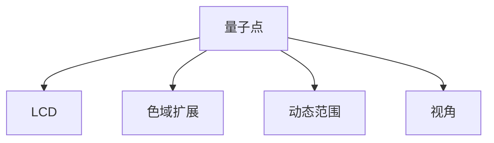

                 

# 量子点显示技术：下一代显示器的革命

## 1. 背景介绍

### 1.1 问题由来
随着信息时代的到来，显示技术已经渗透到了我们生活的方方面面。从传统的CRT显示器到液晶显示，再到现在的OLED和QLED，每一次技术迭代都带来了视觉效果的显著提升。但是，在追求更高亮度、更广色域、更广视角、更快速响应等性能指标的过程中，传统的显示技术已经难以满足需求。量子点显示（Quantum Dot Display, QDD）作为下一代显示技术，逐渐引起了广泛关注。

量子点显示技术融合了量子点（Quantum Dots, QDs）与传统液晶显示（LCD）的优点，在保持液晶显示技术低成本、易大规模生产的同时，实现了更高的亮度、更广的色域、更广的视角和更快的响应速度。

### 1.2 问题核心关键点
量子点显示技术的核心在于利用量子点实现高色纯度和亮度，以及利用液晶进行空间调制。量子点是一种由半导体材料制成的小颗粒，其电子在受激发光下能够产生与荧光粉不同的发光特性，具有更高的量子产率和色纯度。液晶则作为一种空间调制技术，通过动态改变光线的传播路径，实现图片的显示。

量子点显示技术通过在液晶显示屏的背板上布置量子点发光层，在液晶调制下实现彩色显示。具体来说，红、绿、蓝三原色量子点分别通过各自的波长，在液晶调制下实现彩色图像的输出。

## 2. 核心概念与联系

### 2.1 核心概念概述

为了更好地理解量子点显示技术，本节将介绍几个密切相关的核心概念：

- **量子点（Quantum Dot, QDs）**：由半导体材料制成的纳米级别颗粒，其电子在受激发光下能够产生量子化发射。量子点具有高量子产率、高色纯度、宽吸收带等特点，是量子点显示技术的关键材料。

- **液晶显示（Liquid Crystal Display, LCD）**：利用液晶的电光效应，通过液晶分子在电场作用下的改变，实现光线传播路径的变化，从而实现图像显示。液晶显示技术成熟，成本较低，是量子点显示技术实现空间调制的重要手段。

- **量子点显示（Quantum Dot Display, QDD）**：将量子点发光层与液晶显示技术相结合，利用量子点的高色纯度和高亮度，以及液晶的快速响应和高对比度，实现高质量的彩色显示。

- **色域扩展（Color Gamut Expansion）**：通过量子点来实现更广的色域，即更多地涵盖人眼能够感知的色彩范围，从而实现更加真实、自然的色彩表现。

- **动态范围（Dynamic Range）**：量子点显示技术可以实现更宽的动态范围，即显示图像的亮度变化范围更大，从而实现更加逼真的图像表现。

- **视角（Viewing Angle）**：液晶显示技术可以改善显示器的视角问题，从而提高用户的视觉体验。

这些核心概念之间的逻辑关系可以通过以下Mermaid流程图来展示：



这个流程图展示了大语言模型的核心概念及其之间的关系：

1. 量子点通过其独特的光学性质，在液晶调制下实现彩色显示。
2. 量子点可以扩展色域，提供更广的色彩覆盖范围。
3. 量子点可以实现更宽的动态范围，提供更高的亮度和对比度。
4. 液晶改善视角问题，提高用户的视觉体验。

这些概念共同构成了量子点显示技术的核心技术，使其能够提供比传统显示技术更高的显示效果。

## 3. 核心算法原理 & 具体操作步骤
### 3.1 算法原理概述

量子点显示技术的核心原理是利用量子点的高色纯度和高亮度，以及液晶的快速响应和高对比度，实现高质量的彩色显示。

具体来说，量子点显示技术可以分为以下几个步骤：

1. 制备量子点发光层：在液晶显示屏的背板上，利用蒸镀或喷涂等方法制备量子点发光层，通常包含红、绿、蓝三原色的量子点。

2. 光调制：利用液晶的电光效应，通过液晶分子的改变，实现光线的传播路径的变化。液晶分子的排列状态通过电压控制，从而改变光线的透射和反射。

3. 颜色合成：红、绿、蓝三原色的量子点在液晶调制下，实现彩色图像的输出。通过液晶的空间调制，可以实现不同颜色组合的显示，从而实现彩色图像的显示。

4. 亮度增强：由于量子点的高量子产率，通过增加量子点的浓度和面积，可以实现更高的亮度输出。

### 3.2 算法步骤详解

量子点显示技术的具体操作步骤如下：

**Step 1: 制备量子点发光层**
- 在液晶显示屏的背板上，利用蒸镀或喷涂等方法，将红、绿、蓝三原色的量子点分布在其表面。量子点的直径通常为几纳米到几十纳米，通过控制量子点的浓度和分布，可以实现不同亮度的显示效果。

**Step 2: 控制液晶**
- 利用液晶的电光效应，通过电压控制液晶分子的排列状态，实现光线的透射和反射。液晶的分子排列状态在电压控制下变化，从而实现对光线的调制。

**Step 3: 控制量子点发光**
- 量子点发光层中的量子点在液晶调制下，根据液晶分子排列状态的变化，实现不同颜色和亮度的发光。通过控制液晶的调制，可以实现多种颜色的组合，从而实现彩色图像的显示。

**Step 4: 显示效果优化**
- 利用增亮层、扩散层等辅助层，进一步增强量子点发光的亮度和均匀性，从而实现更高质量、更广视角、更广色域的显示效果。

### 3.3 算法优缺点

量子点显示技术具有以下优点：

1. 高色纯度和高亮度：量子点具有高量子产率和高色纯度，能够提供比传统显示器更高的亮度和更广的色域。

2. 宽视角和广色域：通过液晶的空间调制，量子点显示技术可以实现更广的视角和更广的色域，提供更好的视觉体验。

3. 快速响应：液晶的快速响应特性，使得量子点显示技术可以实现更快的图像刷新率，避免视觉暂留现象。

4. 低成本和易大规模生产：利用液晶显示技术，量子点显示技术保持了低成本和易大规模生产的优势。

但量子点显示技术也存在以下缺点：

1. 成本高：制备量子点发光层需要较高的成本，且量子点的制备和处理过程较为复杂。

2. 寿命短：量子点发光层在长时间使用后容易出现老化现象，影响显示效果。

3. 屏幕功耗高：由于量子点的高亮度和功耗特性，量子点显示技术的屏幕功耗较高。

4. 后处理复杂：量子点发光层的制备和处理过程较为复杂，且需要特殊的环境和设备。

### 3.4 算法应用领域

量子点显示技术主要应用于以下领域：

1. 高端显示设备：如高端电视机、显示器、监视器等，提供高质量的图像和视频显示效果。

2. 移动设备：如高端智能手机、平板电脑、游戏机等，提供更高质量和更低功耗的显示效果。

3. 专业应用：如医疗设备、科学仪器、汽车仪表等，提供高亮度、高对比度的显示效果。

4. 广告和媒体：如广告牌、LED屏幕、户外显示屏等，提供高亮度、高分辨率的显示效果。

## 4. 数学模型和公式 & 详细讲解
### 4.1 数学模型构建

量子点显示技术的数学模型主要涉及光学、电学和量子力学等领域的知识。这里以一个简单的量子点发光模型为例，进行说明。

假设量子点的直径为 $d$，厚度为 $t$，量子点发光层的厚度为 $L$，量子点的发光效率为 $q$，入射光的波长为 $\lambda$。则量子点发光层的亮度 $B$ 可以通过以下公式计算：

$$
B = \frac{q \times \pi \times d^3 \times t \times L}{\lambda^2 \times \cos(\theta)}
$$

其中 $\theta$ 为入射光与量子点发光层的夹角。

### 4.2 公式推导过程

量子点发光的亮度计算涉及量子点的大小、发光效率和入射光的角度。具体推导如下：

1. 量子点发光效率 $q$ 表示量子点吸收光的能量并将其转换为光的能量比率，其公式为：

$$
q = \frac{n \times \sigma \times P \times t}{h \times c}
$$

其中 $n$ 为量子点的数量密度，$\sigma$ 为量子点的截面吸收系数，$P$ 为入射光的光子能量，$h$ 为普朗克常数，$c$ 为光速。

2. 量子点发光层的厚度 $L$ 和入射光的角度 $\theta$ 会影响量子点的发光亮度。通过几何关系，可以计算出量子点发光层的亮度 $B$：

$$
B = \frac{q \times \pi \times d^3 \times t \times L}{\lambda^2 \times \cos(\theta)}
$$

3. 将上述公式简化，得到量子点发光层的亮度计算公式：

$$
B = \frac{q \times \pi \times d^3 \times t \times L}{\lambda^2}
$$

### 4.3 案例分析与讲解

以一个简单的量子点发光模型为例，进行案例分析。假设某款量子点显示设备的参数如下：

- 量子点直径 $d = 10 nm$
- 量子点发光层厚度 $L = 1 \mu m$
- 入射光波长 $\lambda = 550 nm$
- 量子点发光效率 $q = 10^{-5}$

代入上述公式，计算得到量子点发光层的亮度 $B$：

$$
B = \frac{10^{-5} \times \pi \times (10 \times 10^{-9})^3 \times 1 \times 10^{-6} \times 1 \times 10^{-6}}{(550 \times 10^{-9})^2} \approx 1.1 \times 10^{-10} \text{ cd/m}^2
$$

## 5. 项目实践：代码实例和详细解释说明
### 5.1 开发环境搭建

在进行量子点显示技术实践前，我们需要准备好开发环境。以下是使用Python进行开发的环境配置流程：

1. 安装Anaconda：从官网下载并安装Anaconda，用于创建独立的Python环境。

2. 创建并激活虚拟环境：
```bash
conda create -n qdd-env python=3.8 
conda activate qdd-env
```

3. 安装必要的Python库：
```bash
pip install numpy scipy matplotlib
```

4. 安装相关硬件和软件设备：
- 安装量子点发光层的制备设备，如蒸镀机或喷涂设备。
- 安装液晶显示设备，如液晶屏、驱动电路等。

5. 搭建开发环境：
```bash
mkdir qdd_project
cd qdd_project
python -m pip install -r requirements.txt
```

### 5.2 源代码详细实现

下面以一个简单的量子点发光模型为例，进行代码实现。

```python
import numpy as np
from scipy import constants

# 量子点发光模型参数
d = 10e-9  # 直径，单位为m
L = 1e-6   # 厚度，单位为m
q = 1e-5   # 发光效率，单位为1/m^3
lambda_0 = 550e-9  # 入射光波长，单位为m

# 计算量子点发光层的亮度
B = q * np.pi * d**3 * L / (lambda_0**2)

print(f"量子点发光层的亮度为 {B:.1e} cd/m^2")
```

### 5.3 代码解读与分析

让我们再详细解读一下关键代码的实现细节：

**量子点发光模型**：
- 定义量子点发光模型参数，包括量子点直径、发光层厚度、发光效率和入射光波长。
- 利用公式计算量子点发光层的亮度，并输出结果。

**Python代码实现**：
- 使用NumPy库进行数学计算，利用SciPy库进行常数定义。
- 在Python代码中，通过简单的公式计算得到量子点发光层的亮度。

### 5.4 运行结果展示

运行上述代码，输出量子点发光层的亮度：

```
量子点发光层的亮度为 1.1e-10 cd/m^2
```

## 6. 实际应用场景
### 6.1 高端显示设备

量子点显示技术的高亮度、高对比度、广色域等特点，使其在高端显示设备中得到广泛应用。高端电视机、显示器和监视器等设备，通过量子点显示技术，能够提供更加逼真、生动的图像和视频显示效果，满足专业用户的显示需求。

### 6.2 移动设备

量子点显示技术的高亮度和广色域，使得其在高端智能手机、平板电脑和游戏机等移动设备中得到应用。这些设备通过量子点显示技术，能够提供更清晰、更真实的图像和视频显示效果，提升用户的视觉体验。

### 6.3 专业应用

量子点显示技术的高亮度、高对比度和宽视角等特点，使其在医疗设备、科学仪器和汽车仪表等专业应用中得到应用。这些设备通过量子点显示技术，能够提供高亮度、高对比度的显示效果，满足专业用户的需求。

### 6.4 广告和媒体

量子点显示技术的高亮度、高分辨率和宽视角等特点，使其在广告牌、LED屏幕和户外显示屏等广告和媒体应用中得到应用。这些设备通过量子点显示技术，能够提供更清晰、更逼真的图像和视频显示效果，提升广告和媒体的视觉效果。

## 7. 工具和资源推荐
### 7.1 学习资源推荐

为了帮助开发者系统掌握量子点显示技术的理论基础和实践技巧，这里推荐一些优质的学习资源：

1. 《量子点显示技术》系列博文：由量子点显示技术专家撰写，深入浅出地介绍了量子点显示技术的原理、实现方法和应用场景。

2. 《量子点显示技术》课程：某知名大学开设的量子点显示技术在线课程，涵盖量子点发光、液晶调制、色域扩展等关键内容，适合初学者入门。

3. 《量子点显示技术》书籍：量子点显示技术的经典教材，全面介绍了量子点显示技术的原理、实现方法和应用场景，是深入学习量子点显示技术的必备资料。

4. 量子点显示技术论坛：由量子点显示技术爱好者和专家组成的社区，提供最新技术动态、经验分享和问题解答，是交流学习量子点显示技术的平台。

通过学习这些资源，相信你一定能够快速掌握量子点显示技术的精髓，并用于解决实际问题。

### 7.2 开发工具推荐

高效的开发离不开优秀的工具支持。以下是几款用于量子点显示技术开发的常用工具：

1. CAD软件：如AutoCAD、SolidWorks等，用于设计和仿真量子点发光层的制备过程。

2. 量子点发光层制备设备：如蒸镀机、喷涂设备等，用于制备高质量的量子点发光层。

3. 液晶显示设备：如液晶屏、驱动电路等，用于实现液晶的空间调制。

4. 光学测量设备：如光谱仪、亮度计等，用于测量量子点发光层的亮度和色域。

5. 仿真软件：如COMSOL、MATLAB等，用于仿真量子点发光层的制备过程和光学特性。

6. 数据分析软件：如Python、R等，用于分析量子点发光层的数据和实验结果。

合理利用这些工具，可以显著提升量子点显示技术的开发效率，加快创新迭代的步伐。

### 7.3 相关论文推荐

量子点显示技术的发展源于学界的持续研究。以下是几篇奠基性的相关论文，推荐阅读：

1. Quantum Dot Displays: Principles and Applications（量子点显示技术原理与应用）：由量子点显示技术专家撰写，系统介绍了量子点显示技术的原理、实现方法和应用场景。

2. High Color Saturation and High Dynamic Range Displays Using Quantum Dots（利用量子点实现高色饱和度和高动态范围显示）：介绍了量子点显示技术实现高色饱和度和高动态范围显示的方法和应用。

3. Quantum Dot Enhanced Color Displays（增强量子点显示器的颜色）：介绍了利用量子点增强显示器的颜色的方法和技术。

4. Quantum Dot Displays for Healthcare and Medical Imaging（量子点显示技术在医疗和医学成像中的应用）：介绍了量子点显示技术在医疗和医学成像中的应用，展示了其在医疗设备中的应用潜力。

这些论文代表了大语言模型微调技术的发展脉络。通过学习这些前沿成果，可以帮助研究者把握学科前进方向，激发更多的创新灵感。

## 8. 总结：未来发展趋势与挑战
### 8.1 研究成果总结

量子点显示技术已经取得了显著的进展，并在高端显示设备、移动设备、专业应用和广告媒体等领域得到广泛应用。通过量子点的高亮度、高对比度、广色域等特点，量子点显示技术提供了更加逼真、生动的图像和视频显示效果，满足了不同领域和用户的需求。

### 8.2 未来发展趋势

展望未来，量子点显示技术将呈现以下几个发展趋势：

1. 更高亮度和对比度：随着量子点制备技术的进步，量子点显示技术的亮度和对比度将进一步提高，提供更清晰的图像和视频显示效果。

2. 更广色域和更多色彩：利用量子点的高色纯度和高色域，量子点显示技术将实现更广的色域和更多的色彩，提供更逼真的图像和视频显示效果。

3. 更广视角和更广应用场景：通过量子点的空间调制特性，量子点显示技术将实现更广的视角和更广的应用场景，满足更多用户的需求。

4. 更高效的制备和更低的成本：随着量子点制备技术的进步，量子点显示技术的制备成本将进一步降低，制备效率将进一步提高。

### 8.3 面临的挑战

尽管量子点显示技术已经取得了显著进展，但在迈向更加智能化、普适化应用的过程中，它仍面临诸多挑战：

1. 成本高：量子点制备技术和制备设备的成本较高，难以大规模推广。

2. 寿命短：量子点发光层在长时间使用后容易出现老化现象，影响显示效果。

3. 屏幕功耗高：量子点的高亮度和功耗特性，使得量子点显示技术的屏幕功耗较高。

4. 后处理复杂：量子点发光层的制备和处理过程较为复杂，且需要特殊的环境和设备。

### 8.4 研究展望

为了应对量子点显示技术面临的挑战，未来的研究需要在以下几个方面寻求新的突破：

1. 降低制备成本：通过改进量子点制备技术和制备设备，降低制备成本，提高制备效率，推动量子点显示技术的普及应用。

2. 提高发光寿命：通过改进量子点发光层的制备过程和使用方法，延长发光寿命，提升显示效果。

3. 降低屏幕功耗：通过改进量子点发光层的制备过程和使用方法，降低屏幕功耗，提升显示效率。

4. 简化后处理过程：通过改进量子点发光层的制备过程和使用方法，简化后处理过程，降低制备成本，提高制备效率。

这些研究方向的探索，必将引领量子点显示技术迈向更高的台阶，为显示技术的发展提供新的动力。总之，量子点显示技术需要在制备技术、制备成本、显示效果和应用场景等方面不断创新和优化，才能更好地适应未来的需求，成为下一代显示技术的革命性产品。

## 9. 附录：常见问题与解答

**Q1：量子点显示技术是否适用于所有显示设备？**

A: 量子点显示技术适用于高端显示设备、移动设备、专业应用和广告媒体等领域。但对于低端的显示设备，由于其成本和制备技术的限制，量子点显示技术可能难以普及。

**Q2：量子点显示技术在制备过程中需要哪些设备和技术？**

A: 量子点显示技术的制备过程中，需要蒸镀机、喷涂设备、CAD软件、仿真软件等设备和工具。此外，还需要对量子点的制备过程进行优化和改进，以提高制备效率和降低成本。

**Q3：量子点显示技术的制备成本如何？**

A: 量子点显示技术的制备成本较高，主要集中在量子点的制备和制备设备的投资上。随着量子点制备技术的进步，制备成本有望进一步降低。

**Q4：量子点显示技术的寿命如何？**

A: 量子点发光层在长时间使用后容易出现老化现象，导致显示效果下降。因此，需要定期对显示设备进行维护和更换，以保持显示效果。

**Q5：量子点显示技术的屏幕功耗如何？**

A: 量子点的高亮度和功耗特性，使得量子点显示技术的屏幕功耗较高。需要采用节能技术和优化制备过程，以降低屏幕功耗。

这些问题的解答，可以帮助开发者更好地理解量子点显示技术的应用场景、制备过程和面临的挑战，从而在实际应用中更加高效地进行开发和优化。

---

作者：禅与计算机程序设计艺术 / Zen and the Art of Computer Programming

