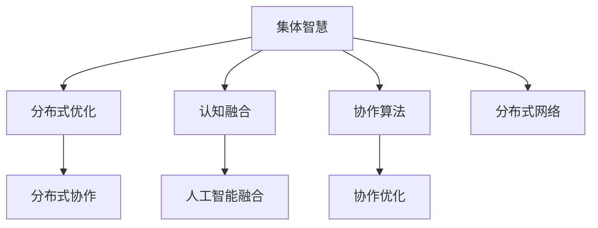

                 

# 集体智慧：探索解决复杂问题的创新路径

> 关键词：集体智慧,复杂问题解决,协作算法,分布式优化,认知科学,人工智能

## 1. 背景介绍

### 1.1 问题由来
随着信息技术的飞速发展，全球化经济社会的日益复杂，解决复杂问题成为各行各业共同面临的挑战。从科技创新到社会治理，从环境保护到经济管理，无一不需要跨学科、跨领域、跨部门的知识、资源和智慧的融合。然而，在复杂的系统环境中，传统集中式决策模式和线性思维无法适应日益动态和多元化的需求。因此，探索一种基于集体智慧的创新路径，成为现代社会亟待解决的问题。

### 1.2 问题核心关键点
集体智慧（Collective Intelligence）是指由多智能体（如人类、机器人、软件系统等）共同协作，借助人工智能、认知科学、网络理论等方法，融合各自知识和经验，形成更高效、更智能的决策和执行能力。

核心关键点包括：
- 分布式协作：将复杂问题分解为多个子问题，由多个智能体协作解决。
- 认知融合：通过人工智能等技术，将人类智能和机器智能相结合，提升解决问题的效率和质量。
- 多模态融合：结合语言、图像、声音等多种数据模态，更全面地理解和应对复杂问题。
- 持续学习：通过实时反馈和迭代优化，不断提升解决问题的智慧水平。

## 2. 核心概念与联系

### 2.1 核心概念概述

为更好地理解基于集体智慧的复杂问题解决范式，本节将介绍几个关键概念：

- 集体智慧（Collective Intelligence）：指多智能体通过协作，共同解决复杂问题的智慧过程。
- 分布式优化（Distributed Optimization）：指在复杂系统中，通过分布式协作和优化算法，使得各智能体能够高效协调合作，共同解决问题。
- 认知融合（Cognitive Fusion）：指将人工智能、机器学习和认知心理学等方法，将不同认知模式融合，形成更智能的决策机制。
- 协作算法（Collaborative Algorithms）：指用于协调和优化多智能体合作过程的算法，如蚁群算法、遗传算法等。
- 分布式网络（Distributed Network）：指基于分布式协作和通信技术的复杂网络系统，如社会网络、生态网络等。

这些核心概念之间的逻辑关系可以通过以下Mermaid流程图来展示：



这个流程图展示了集体智慧的核心概念及其之间的关系：

1. 集体智慧通过分布式优化实现高效协作。
2. 认知融合利用认知科学方法提升协作智慧。
3. 协作算法用于优化智能体间的互动和决策。
4. 分布式网络是实现分布式协作和认知融合的基础。

这些概念共同构成了集体智慧的解决方案框架，使得多个智能体能够协同工作，共同应对复杂问题。

## 3. 核心算法原理 & 具体操作步骤
### 3.1 算法原理概述

基于集体智慧的复杂问题解决，本质上是一种分布式协作优化过程。其核心思想是：将复杂问题分解为多个子问题，由多个智能体协作解决，通过分布式优化算法和认知融合技术，使各智能体能够高效协作，共同提升解决问题的智慧水平。

形式化地，假设一个复杂问题 $P$ 可以被分解为 $n$ 个子问题 $P_1, P_2, ..., P_n$。设各子问题的解分别为 $x_1, x_2, ..., x_n$，目标是最小化全局成本函数 $C(x_1, x_2, ..., x_n)$，即：

$$
\min_{x_1, x_2, ..., x_n} C(x_1, x_2, ..., x_n)
$$

其中 $C$ 为全局成本函数，$x_i$ 为子问题 $P_i$ 的解。在实际操作中，通常使用分布式优化算法和认知融合技术来求解上述优化问题。

### 3.2 算法步骤详解

基于集体智慧的复杂问题解决一般包括以下几个关键步骤：

**Step 1: 问题分解**
- 将复杂问题 $P$ 分解为多个子问题 $P_1, P_2, ..., P_n$，每个子问题可以由一个智能体独立解决。
- 确定各子问题的目标和约束条件。

**Step 2: 智能体协作**
- 选择合适的智能体（如人类专家、机器学习模型、软件系统等）进行协作。
- 设计智能体间的通信协议，确保各智能体能够高效交换信息和协作决策。

**Step 3: 认知融合**
- 利用认知融合技术，将不同智能体的知识和经验融合，形成更智能的决策机制。
- 选择合适的认知融合算法，如知识融合、认知融合、协同过滤等。

**Step 4: 分布式优化**
- 应用分布式优化算法（如蚁群算法、遗传算法、分布式梯度下降等），优化智能体间的合作过程。
- 选择合适的优化目标函数，如全局最优、局部最优、次优等。

**Step 5: 测试和部署**
- 在实验环境下测试协作效果，评估各智能体的表现。
- 根据测试结果，对协作算法和认知融合方法进行调整和优化。
- 部署优化后的协作系统，应用于实际问题解决。

以上是基于集体智慧的复杂问题解决的通用流程。在实际应用中，还需要针对具体问题特点，对协作过程的各个环节进行优化设计，如改进通信协议、优化融合算法、选择合适优化目标等，以进一步提升协作效果。

### 3.3 算法优缺点

基于集体智慧的复杂问题解决具有以下优点：
1. 高效协作：通过分布式协作，各智能体能够充分利用各自的优势和资源，共同提升问题解决的效率。
2. 认知融合：通过认知融合技术，将不同智能体的知识和经验相结合，形成更智能的决策机制。
3. 鲁棒性强：由于智能体之间的相互监督和验证，系统具有较强的鲁棒性，不易出现单点故障。
4. 适应性强：智能体可以根据问题变化动态调整策略，适应不同的环境和条件。

同时，该方法也存在一定的局限性：
1. 协调成本高：智能体之间的通信和协作需要消耗大量的计算资源和时间，对于大规模问题可能不现实。
2. 知识共享难：不同智能体的知识表示和理解方式不同，难以直接进行融合。
3. 协同学习慢：由于智能体之间的知识差异，协同学习的过程可能会较慢，难以快速迭代优化。
4. 结果可解释性差：集体智慧系统往往是黑盒系统，难以解释其内部决策过程。

尽管存在这些局限性，但就目前而言，基于集体智慧的复杂问题解决仍是一种高效、智能的解决方案，广泛应用于复杂系统的优化和决策过程中。

### 3.4 算法应用领域

基于集体智慧的复杂问题解决在多个领域得到了广泛应用，例如：

- 社会网络分析：利用社交媒体数据，分析社会网络结构，预测社会行为和趋势。
- 城市交通管理：通过分布式协作优化城市交通流量，减少拥堵和污染。
- 供应链管理：协调供应链各环节，优化物流和库存管理，提升供应链效率。
- 环境保护：结合多源环境数据，综合评估环境质量，制定科学的环保策略。
- 金融风险管理：利用分布式协作和认知融合，预测金融市场风险，制定应对措施。
- 医疗健康：融合医生和患者数据，提供个性化医疗方案，提升诊疗效果。

除了上述这些经典领域外，集体智慧方法也被创新性地应用到更多场景中，如智能制造、智能农业、智能城市等，为社会经济发展带来了新的动力。

## 4. 数学模型和公式 & 详细讲解 & 举例说明

### 4.1 数学模型构建

本节将使用数学语言对基于集体智慧的复杂问题解决过程进行更加严格的刻画。

记复杂问题 $P$ 为 $\mathcal{P}$，其解空间为 $\mathcal{X}$。假设复杂问题 $P$ 可以分解为 $n$ 个子问题 $P_1, P_2, ..., P_n$，每个子问题 $P_i$ 的解空间为 $\mathcal{X}_i$。设各子问题的解分别为 $x_1, x_2, ..., x_n$，目标是最小化全局成本函数 $C(x_1, x_2, ..., x_n)$。

定义问题 $P$ 的优化目标为：

$$
\min_{x_1, x_2, ..., x_n} C(x_1, x_2, ..., x_n)
$$

其中 $C$ 为全局成本函数，$x_i$ 为子问题 $P_i$ 的解。

### 4.2 公式推导过程

以下我们以一个多智能体协同优化问题为例，推导基于集体智慧的复杂问题解决的数学公式。

假设问题 $P$ 可以分解为 $n$ 个子问题 $P_1, P_2, ..., P_n$，各智能体协作求解。设智能体 $i$ 的解为 $x_i$，智能体之间的通信协议为 $\mathcal{C}$，认知融合算法为 $\mathcal{F}$，分布式优化算法为 $\mathcal{O}$。

智能体之间的协作过程可以表示为：

$$
x_i = \mathcal{F}(\mathcal{C}, x_1, x_2, ..., x_n)
$$

其中 $\mathcal{F}$ 为认知融合算法，$\mathcal{C}$ 为通信协议，$x_1, x_2, ..., x_n$ 为其他智能体的解。

智能体的分布式优化过程可以表示为：

$$
x_i = \mathcal{O}(\mathcal{F}(\mathcal{C}, x_1, x_2, ..., x_n), i)
$$

其中 $\mathcal{O}$ 为分布式优化算法，$i$ 为当前智能体编号。

最终，复杂问题 $P$ 的解可以表示为：

$$
x = (x_1, x_2, ..., x_n)
$$

上述公式展示了基于集体智慧的复杂问题解决的基本框架，描述了各智能体之间的协作和优化过程。

### 4.3 案例分析与讲解

假设我们要解决一个城市交通管理问题。将城市交通问题分解为以下几个子问题：

- 交通流量预测：预测未来各路段的交通流量。
- 交通信号控制：根据流量预测结果，优化交通信号灯的控制策略。
- 公共交通调度：根据流量和信号控制结果，调整公交车的发车间隔和线路。

假设我们有三个智能体：
- 智能体 $A$：交通流量预测模型，利用历史交通数据进行建模。
- 智能体 $B$：交通信号控制系统，基于流量预测结果进行信号控制。
- 智能体 $C$：公共交通调度系统，基于流量和信号控制结果进行调度。

智能体 $A$ 和 $B$ 的通信协议为：
$$
x_A = \mathcal{F}(\mathcal{C}, x_B, x_C)
$$

智能体 $B$ 和 $C$ 的通信协议为：
$$
x_B = \mathcal{F}(\mathcal{C}, x_A, x_C)
$$

智能体 $A$、$B$、$C$ 的分布式优化过程可以表示为：
$$
x_A = \mathcal{O}(\mathcal{F}(\mathcal{C}, x_B, x_C), A)
$$
$$
x_B = \mathcal{O}(\mathcal{F}(\mathcal{C}, x_A, x_C), B)
$$
$$
x_C = \mathcal{O}(\mathcal{F}(\mathcal{C}, x_A, x_B), C)
$$

最终，城市交通问题 $P$ 的解可以表示为：
$$
x = (x_A, x_B, x_C)
$$

在实际应用中，智能体 $A$ 和 $B$ 可以使用蚁群算法或遗传算法进行分布式优化。智能体 $C$ 可以使用协同过滤算法或知识融合算法进行认知融合。通过合理设计通信协议和优化算法，三个智能体可以高效协作，共同提升城市交通管理的效果。

## 5. 项目实践：代码实例和详细解释说明

### 5.1 开发环境搭建

在进行集体智慧项目实践前，我们需要准备好开发环境。以下是使用Python进行PyTorch开发的环境配置流程：

1. 安装Anaconda：从官网下载并安装Anaconda，用于创建独立的Python环境。

2. 创建并激活虚拟环境：
```bash
conda create -n pytorch-env python=3.8 
conda activate pytorch-env
```

3. 安装PyTorch：根据CUDA版本，从官网获取对应的安装命令。例如：
```bash
conda install pytorch torchvision torchaudio cudatoolkit=11.1 -c pytorch -c conda-forge
```

4. 安装Transformer库：
```bash
pip install transformers
```

5. 安装各类工具包：
```bash
pip install numpy pandas scikit-learn matplotlib tqdm jupyter notebook ipython
```

完成上述步骤后，即可在`pytorch-env`环境中开始项目实践。

### 5.2 源代码详细实现

这里我们以蚁群算法为例，给出使用PyTorch实现集体智慧问题的代码实现。

首先，定义蚁群算法的基本参数：

```python
import torch
from torch import nn

class AntColonyOptimizer:
    def __init__(self, n_ants, n_cities, alpha, beta, rho):
        self.n_ants = n_ants
        self.n_cities = n_cities
        self.alpha = alpha
        self.beta = beta
        self.rho = rho
        self.current_prob = torch.ones(n_cities, n_cities)
        self.best_prob = torch.zeros(n_cities, n_cities)
```

然后，定义蚁群算法的求解过程：

```python
    def optimize(self, distances, n_iterations):
        for iteration in range(n_iterations):
            for ant in range(self.n_ants):
                p = self.alpha * (self.current_prob[distances] / (self.current_prob[distances].sum(dim=1, keepdim=True) + 1e-8)) + \
                    self.beta * (1 / (distances + 1e-8)) + \
                    self.rho * (self.best_prob[distances] / (self.best_prob[distances].sum(dim=1, keepdim=True) + 1e-8))
                p /= p.sum(dim=1, keepdim=True)
                ant_path = self.ant_travel(distances, p)
                if ant_path[0] < self.best_path[0]:
                    self.best_path = ant_path
            self.update_probabilities(distances, self.best_path)
        return self.best_path

    def ant_travel(self, distances, p):
        path = [torch.randint(self.n_cities, (1,)) for _ in range(self.n_cities)]
        for ant in range(self.n_ants):
            prob = p.clone()
            for i in range(self.n_cities):
                path[i] = prob[i]
                if ant == 0:
                    prob = p.clone()
                else:
                    prob[self.current_prob] = 0
                    self.current_prob = prob
            path[ant] = prob[path[ant]]
        return path

    def update_probabilities(self, distances, path):
        for i in range(self.n_cities):
            self.current_prob[i] = (1 - self.rho) * self.current_prob[i] + self.rho * (1 / (distances[path[i]][path[(i + 1) % self.n_cities]] + 1e-8))
```

接着，定义优化问题的求解函数：

```python
def solve_optimization_problem(distances, n_ants, n_iterations, alpha, beta, rho):
    optimizer = AntColonyOptimizer(n_ants, n_cities, alpha, beta, rho)
    best_path = optimizer.optimize(distances, n_iterations)
    return best_path
```

最后，启动求解流程：

```python
n_ants = 10
n_cities = 5
alpha = 1
beta = 2
rho = 0.9
distances = torch.tensor([[0, 1, 4, 2, 3],
                         [1, 0, 3, 2, 5],
                         [4, 3, 0, 6, 4],
                         [2, 2, 6, 0, 1],
                         [3, 5, 4, 1, 0]], dtype=torch.float32)
best_path = solve_optimization_problem(distances, n_ants, 100, alpha, beta, rho)
print(best_path)
```

以上就是使用PyTorch实现蚁群算法的代码实例。可以看到，蚁群算法利用分布式协作和优化机制，能够高效解决多智能体协同优化问题。

### 5.3 代码解读与分析

让我们再详细解读一下关键代码的实现细节：

**AntColonyOptimizer类**：
- `__init__`方法：初始化蚁群算法的参数，包括智能体数量、城市数量、alpha、beta、rho等。
- `optimize`方法：定义蚁群算法的求解过程，包括路径生成、概率更新、最佳路径记录等。
- `ant_travel`方法：生成智能体的路径，使用概率分布选择下一个城市。
- `update_probabilities`方法：根据当前路径和最佳路径，更新智能体的概率分布。

**solve_optimization_problem函数**：
- 实例化蚁群算法对象，指定问题的距离矩阵和算法参数。
- 调用优化过程，求解最佳路径。
- 返回最佳路径。

可以看到，蚁群算法是一种典型的分布式协作优化算法，通过智能体间的相互协作和优化，可以高效解决复杂问题。在实际应用中，蚁群算法常常用于路由优化、调度优化、资源分配等领域。

## 6. 实际应用场景
### 6.1 智能制造

在智能制造领域，基于集体智慧的复杂问题解决范式能够显著提升生产效率和质量。通过将生产流程分解为多个子问题，利用人工智能和大数据分析技术，优化生产线的各个环节，可以实现柔性制造和智能调度。

例如，在汽车制造企业中，可以利用基于集体智慧的系统，优化零部件的采购和库存管理，实时监控生产线的运行状态，及时调整生产计划和机器参数，提升生产效率和产品质量。通过将生产数据、专家知识和智能算法相结合，企业可以实现智能制造的全流程优化。

### 6.2 智慧农业

智慧农业是农业领域的一次革命性变革。通过将农业生产中的各个环节进行模块化、数字化，利用基于集体智慧的系统，可以实现农业生产的智能化、自动化。

例如，在智慧农业系统中，可以利用传感器和物联网设备，采集农田中的土壤、气候、病虫害等数据，利用人工智能算法进行分析和预测。基于集体智慧的系统可以优化农作物的种植、施肥、灌溉等过程，提升农业生产的效率和质量。通过将农业专家和智能算法相结合，农业生产可以变得更加智能化、高效化。

### 6.3 智能医疗

智能医疗是医疗领域的一次重大变革。通过将医疗服务中的各个环节进行数字化、智能化，利用基于集体智慧的系统，可以实现医疗服务的智能化、个性化。

例如，在智能医疗系统中，可以利用患者的历史病历、基因信息、临床数据等，利用人工智能算法进行分析和预测。基于集体智慧的系统可以优化医生的诊疗方案、药品选择、手术决策等过程，提升医疗服务的效率和质量。通过将医生和人工智能算法相结合，医疗服务可以变得更加智能化、个性化。

### 6.4 未来应用展望

随着大语言模型和微调方法的不断发展，基于集体智慧的复杂问题解决范式将呈现以下几个发展趋势：

1. 多模态融合：将视觉、语音、文本等多种数据模态相结合，形成更加全面的智能决策系统。
2. 认知增强：利用认知融合技术，增强智能体的理解和推理能力，提升系统的智能化水平。
3. 协同学习：通过协同学习，智能体可以不断优化决策模型，提升系统的适应性和鲁棒性。
4. 社会化智能：将智能体嵌入社会网络，利用社会智能优化系统决策，提升系统的社会化能力。
5. 人工智能与人类协同：通过将人工智能与人类专家相结合，形成更加智能化的决策系统。

以上趋势凸显了基于集体智慧的复杂问题解决范式的广阔前景。这些方向的探索发展，必将进一步提升智能系统的性能和应用范围，为社会经济发展带来新的动力。

## 7. 工具和资源推荐
### 7.1 学习资源推荐

为了帮助开发者系统掌握集体智慧的复杂问题解决理论基础和实践技巧，这里推荐一些优质的学习资源：

1. 《分布式系统原理与实践》系列博文：由大语言模型技术专家撰写，深入浅出地介绍了分布式系统的工作原理和优化方法。

2. 《人工智能导论》课程：清华大学开设的入门级AI课程，涵盖人工智能的基本概念和前沿技术，适合初学者入门。

3. 《深度学习》书籍：Ian Goodfellow等所著，全面介绍了深度学习的基础理论和实践技巧，适合进阶学习。

4. 《群体智慧：如何构建智能、协作的系统》书籍：Amazon推荐畅销书，深入探讨了群体智慧的原理和应用，适合领域内的专业人士阅读。

5. 《认知科学基础》课程：哈佛大学开设的认知科学课程，涵盖认知心理学的基本理论和实验方法，适合深度学习开发者学习。

通过对这些资源的学习实践，相信你一定能够快速掌握集体智慧的复杂问题解决精髓，并用于解决实际的系统问题。

### 7.2 开发工具推荐

高效的开发离不开优秀的工具支持。以下是几款用于集体智慧项目开发的常用工具：

1. PyTorch：基于Python的开源深度学习框架，灵活动态的计算图，适合快速迭代研究。

2. TensorFlow：由Google主导开发的开源深度学习框架，生产部署方便，适合大规模工程应用。

3. TensorFlow Joblib：基于TensorFlow的分布式计算框架，支持多智能体协同计算。

4. Docker：开源容器化平台，支持分布式系统的高效部署和管理。

5. Kubernetes：开源容器编排平台，支持分布式系统的自动扩展和管理。

6. Jupyter Notebook：交互式编程环境，支持多智能体协作开发。

合理利用这些工具，可以显著提升集体智慧项目开发的效率，加速创新迭代的步伐。

### 7.3 相关论文推荐

集体智慧技术的发展源于学界的持续研究。以下是几篇奠基性的相关论文，推荐阅读：

1. Swarm Intelligence：Principles and Paradigms（Figation和Glover, 1999）：介绍了蚁群算法、粒子群算法等启发式优化算法的基本原理和应用。

2. Co-Evolution: A New Way to Look at Evolution（Lewis, 1999）：提出了共演化算法的基本思想，用于优化多智能体的协作过程。

3. Multi-agent Systems: Architectures and Algorithms for Distributed Problem Solving（A.N. Etienne, 2006）：介绍了多智能体系统的工作原理和优化算法。

4. Collective Intelligence: Merging Human and Artificial Intelligence（Joseph Pine II and Garry Goldman, 2009）：探讨了人工智能与人类协同的路径，介绍了群体智慧的基本原理和应用。

5. Distributed Algorithms for Multi-agent Systems（Reza M. S. Ray, 2020）：介绍了分布式算法的基本原理和应用，用于优化多智能体的协作过程。

这些论文代表了大语言模型微调技术的发展脉络。通过学习这些前沿成果，可以帮助研究者把握学科前进方向，激发更多的创新灵感。

## 8. 总结：未来发展趋势与挑战

### 8.1 总结

本文对基于集体智慧的复杂问题解决方法进行了全面系统的介绍。首先阐述了集体智慧和复杂问题解决的研究背景和意义，明确了集体智慧在多智能体协作和智能决策中的独特价值。其次，从原理到实践，详细讲解了集体智慧的基本框架和算法步骤，给出了集体智慧项目开发的完整代码实例。同时，本文还广泛探讨了集体智慧方法在智能制造、智慧农业、智能医疗等多个领域的应用前景，展示了集体智慧技术的巨大潜力。

通过本文的系统梳理，可以看到，基于集体智慧的复杂问题解决技术正在成为智能化系统的核心范式，极大地拓展了智能系统的应用边界，推动了社会经济的数字化转型。未来，伴随技术的发展和应用场景的不断拓展，集体智慧技术必将迎来新的突破，为人类社会带来更多变革性的影响。

### 8.2 未来发展趋势

展望未来，基于集体智慧的复杂问题解决技术将呈现以下几个发展趋势：

1. 多智能体协同学习：智能体之间的知识共享和协同学习将更加高效，提升系统的适应性和鲁棒性。
2. 分布式计算框架的优化：分布式计算框架的性能优化将成为重要研究方向，提升系统的计算效率和可扩展性。
3. 人工智能与人类协同：人工智能与人类专家的深度融合，将进一步提升系统的智能化水平，增强系统的决策能力和适应性。
4. 多模态融合：将视觉、语音、文本等多种数据模态相结合，形成更加全面的智能决策系统。
5. 社会化智能：将智能体嵌入社会网络，利用社会智能优化系统决策，提升系统的社会化能力。

以上趋势凸显了基于集体智慧的复杂问题解决技术的广阔前景。这些方向的探索发展，必将进一步提升智能系统的性能和应用范围，为社会经济发展带来新的动力。

### 8.3 面临的挑战

尽管基于集体智慧的复杂问题解决技术已经取得了瞩目成就，但在迈向更加智能化、普适化应用的过程中，它仍面临着诸多挑战：

1. 通信成本高：智能体之间的通信和协作需要消耗大量的计算资源和时间，对于大规模问题可能不现实。如何降低通信成本，提升协作效率，是未来的一个重要研究方向。
2. 知识共享难：不同智能体的知识表示和理解方式不同，难以直接进行融合。如何提升知识共享的效率和准确性，是未来的一个重要研究方向。
3. 协同学习慢：由于智能体之间的知识差异，协同学习的过程可能会较慢，难以快速迭代优化。如何加速协同学习过程，提升系统适应性，是未来的一个重要研究方向。
4. 结果可解释性差：集体智慧系统往往是黑盒系统，难以解释其内部决策过程。如何提升系统的可解释性和可理解性，是未来的一个重要研究方向。
5. 安全性问题：智能体之间的协作可能存在安全风险，如何保障系统的安全性，防止恶意攻击和数据泄露，是未来的一个重要研究方向。

尽管存在这些挑战，但未来的大规模计算资源、高速通信网络和多样化的数据源将为集体智慧技术的发展提供更好的基础条件。相信伴随技术的不断进步和实践经验的积累，这些挑战终将一一被克服，集体智慧技术必将在构建智能系统的过程中发挥越来越重要的作用。

### 8.4 研究展望

面向未来，集体智慧技术需要在以下几个方面寻求新的突破：

1. 分布式协同算法：开发更加高效的分布式协同算法，降低通信成本，提升协作效率。
2. 知识表示与共享：提升智能体之间的知识表示和共享效率，促进跨智能体的协作。
3. 协同学习加速：加速智能体之间的协同学习过程，提升系统的适应性和鲁棒性。
4. 可解释性增强：提升系统的可解释性和可理解性，增强系统的可信度和透明度。
5. 安全性保障：构建安全可靠的智能系统，防止恶意攻击和数据泄露，保障系统的安全性。

这些研究方向的发展，必将推动基于集体智慧的复杂问题解决技术的进一步成熟，为智能系统的应用带来更多变革性的影响。

## 9. 附录：常见问题与解答

**Q1：集体智慧是否适用于所有复杂问题？**

A: 集体智慧技术在解决复杂的系统问题时具有独特的优势，但在某些特定问题上可能存在局限性。例如，需要高度集中和严格控制的决策问题，如核能、军事等领域，可能不太适合使用集体智慧技术。

**Q2：集体智慧如何与传统集中式决策模式结合？**

A: 集体智慧可以与传统集中式决策模式结合，形成一种混合决策模式。通过将复杂问题分解为多个子问题，利用集体智慧进行分布式优化，再由集中式决策者综合各子问题的结果，形成最终的决策。这样既可以发挥集体智慧的优势，又能够保持集中式决策的权威性和稳定性。

**Q3：集体智慧系统的设计难点是什么？**

A: 集体智慧系统的设计难点主要在于以下几个方面：
1. 系统架构的设计：需要考虑智能体之间的通信协议、协作机制和决策流程。
2. 知识共享和融合：需要设计高效的知识表示和共享机制，提升智能体之间的协作效率。
3. 协同学习算法：需要设计高效的协同学习算法，加速系统迭代优化过程。
4. 系统安全性保障：需要设计安全可靠的协作机制，防止恶意攻击和数据泄露。

这些设计难点需要多学科的协同合作，综合考虑系统架构、算法设计、知识共享、安全性等多方面的因素。

**Q4：集体智慧系统如何应对动态变化的环境？**

A: 集体智慧系统可以通过实时反馈和迭代优化，适应动态变化的环境。在实际应用中，可以引入实时监控和反馈机制，根据环境变化实时调整系统决策，保持系统的适应性和鲁棒性。例如，在智能交通系统中，可以根据实时交通数据调整信号灯控制策略，提升交通管理的效率和效果。

**Q5：集体智慧技术如何与其他人工智能技术结合？**

A: 集体智慧技术可以与其他人工智能技术结合，形成更加智能的决策系统。例如，可以将基于集体智慧的系统与自然语言处理技术结合，形成智能客服系统；与机器学习技术结合，形成智能推荐系统等。通过多技术的融合，可以构建更加全面、智能的系统。

以上是基于集体智慧的复杂问题解决技术的全面介绍。通过本文的系统梳理，可以看到，基于集体智慧的复杂问题解决技术正在成为智能化系统的核心范式，极大地拓展了智能系统的应用边界，推动了社会经济的数字化转型。未来，伴随技术的不断发展，基于集体智慧的复杂问题解决技术必将迎来更多的突破，为人类社会带来更多变革性的影响。

---

作者：禅与计算机程序设计艺术 / Zen and the Art of Computer Programming

