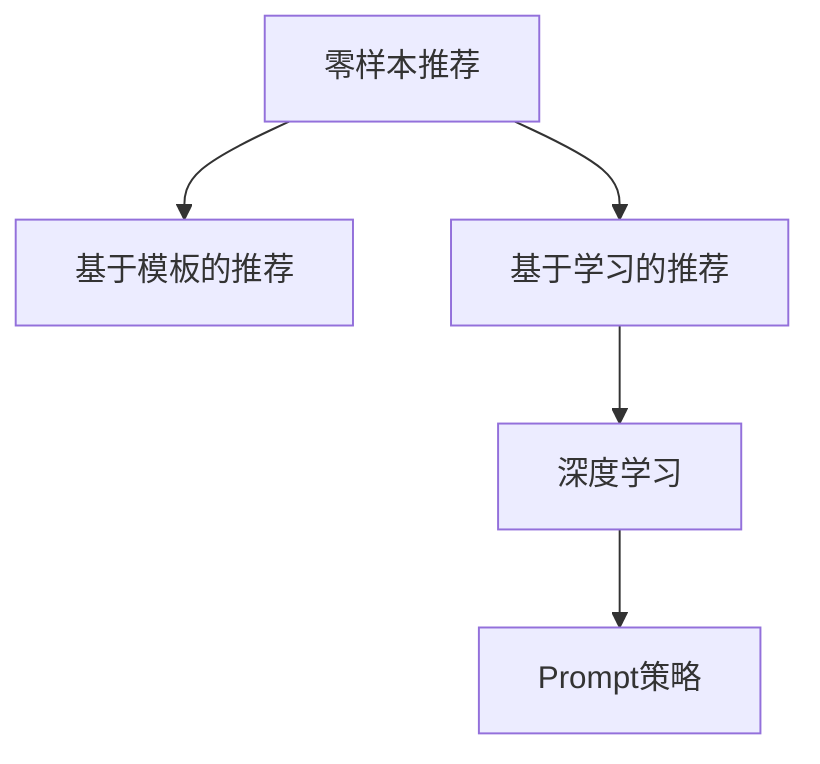

                 

# 零样本推荐: 候选生成与Prompt策略

> 关键词：零样本推荐、候选生成、Prompt策略、自然语言处理、推荐系统、深度学习

## 1. 背景介绍

### 1.1 问题由来

随着互联网的迅猛发展，推荐系统成为了连接用户与内容的重要桥梁。推荐系统通过分析用户历史行为、偏好和上下文信息，为用户推荐最感兴趣的物品。然而，对于新用户或场景，推荐系统通常需要收集一定的交互数据，才能根据用户反馈进行优化。而对于那些难以收集或难以提供反馈的场景，传统的推荐系统无法很好地发挥作用。

例如，在在线旅游网站中，有些用户第一次访问时可能并不愿意注册并登录，此时传统的推荐系统就无法根据其行为进行推荐。此外，在新闻聚合、视频内容推荐等场景中，用户可能只阅读新闻标题或观看视频片段，而不愿深度参与互动，这也使得传统的推荐系统无法很好地适应该类用户。

为了解决这些问题，零样本推荐（Zero-shot Recommendation）技术应运而生。零样本推荐无需用户反馈，也不需要收集用户数据，仅凭物品的描述、标签等文本信息即可为用户推荐合适的物品，大大提升了推荐系统的覆盖面与用户体验。

### 1.2 问题核心关键点

零样本推荐的核心在于如何高效利用物品的文本描述信息，生成满足用户需求的候选列表。目前主流的零样本推荐方法可以分为两大类：基于模板的推荐和基于学习的推荐。基于模板的推荐方法通常需要人工编写推荐模板，适用于需求相对固定的场景；而基于学习的推荐方法则可以自动生成推荐模板，适用于需求多变的场景。

本节将详细介绍零样本推荐的主要技术，包括基于模板的推荐、基于学习的推荐，以及深度学习中的Prompt策略等。

## 2. 核心概念与联系

### 2.1 核心概念概述

为更好地理解零样本推荐，本节将介绍几个密切相关的核心概念：

- 零样本推荐(Zero-shot Recommendation)：指在无需用户反馈的情况下，仅通过物品的文本描述信息，为用户推荐合适的物品。
- 基于模板的推荐(Template-based Recommendation)：通过预定义的推荐模板，对物品的文本描述进行模式匹配，生成候选列表。
- 基于学习的推荐(Learning-based Recommendation)：通过训练模型，自动学习推荐模板，生成候选项目。
- 深度学习(Deep Learning)：利用神经网络模型，对物品描述信息进行表示学习，生成候选项目。
- Prompt策略：在深度学习中，通过精心设计输入文本的格式，引导模型按期望方式输出，减少微调参数。

这些核心概念之间的逻辑关系可以通过以下Mermaid流程图来展示：



这个流程图展示零样本推荐的关键概念及其之间的关系：

1. 零样本推荐通过基于模板或基于学习的技术，自动生成候选项目。
2. 基于模板的推荐利用预定义的模板进行模式匹配。
3. 基于学习的推荐使用神经网络模型进行表示学习。
4. Prompt策略在深度学习中引导模型输出。

这些概念共同构成了零样本推荐的框架，使其能够更好地利用文本描述信息，为用户提供满意的推荐服务。

## 3. 核心算法原理 & 具体操作步骤
### 3.1 算法原理概述

零样本推荐的本质是通过深度学习模型对物品的文本描述进行表示学习，生成符合用户需求的候选项目。其核心思想是：通过预训练的深度学习模型，将物品描述信息转化为向量表示，利用这些向量计算物品之间的相似性，进而生成候选项目。

形式化地，假设物品的文本描述为 $x$，零样本推荐的目标是找到一组物品 $\mathcal{Y}$，使得这些物品与用户需求最匹配。具体流程如下：

1. 使用预训练的深度学习模型将物品的文本描述 $x$ 转化为向量表示 $z_x$。
2. 计算向量 $z_x$ 与物品库中其他物品的向量表示 $z_y$ 之间的相似性，如余弦相似度。
3. 根据相似性排序，选取与用户需求最匹配的 $k$ 个物品作为推荐候选项目。

基于深度学习的零样本推荐方法，通过学习物品之间的相似性关系，自动生成推荐候选项目，避免了手动编写推荐模板的繁琐过程，同时也能在更少的标注样本下取得较好的效果。

### 3.2 算法步骤详解

以下是一个基于深度学习的零样本推荐系统的详细步骤：

**Step 1: 数据准备**
- 收集物品的文本描述，如商品标题、电影简介等。
- 预训练深度学习模型，如BERT、GPT等。

**Step 2: 文本表示**
- 使用预训练的深度学习模型将物品的文本描述转化为向量表示。
- 选取合适的模型层或子层，如BERT的顶层，进行文本表示。

**Step 3: 相似性计算**
- 计算向量表示之间的余弦相似度等。
- 根据相似性对物品进行排序，选取候选项目。

**Step 4: 输出推荐**
- 将推荐结果呈现给用户，供其选择。

**Step 5: 反馈与迭代**
- 收集用户的选择数据，进行反馈与模型迭代优化。

### 3.3 算法优缺点

基于深度学习的零样本推荐方法具有以下优点：
1. 自动生成推荐模板，避免了手工编写模板的繁琐过程。
2. 可以在更少的标注样本下取得较好的效果。
3. 适应性强，能够自动学习多种推荐策略。

但该方法也存在一定的局限性：
1. 对文本描述的质量要求较高，难以处理低质量或噪音较多的数据。
2. 需要较高的计算资源，训练过程较慢。
3. 模型泛化能力有限，可能对特定领域的推荐效果不佳。

尽管存在这些局限性，但就目前而言，基于深度学习的零样本推荐方法仍是大规模推荐系统的重要手段。未来相关研究的重点在于如何进一步降低计算资源消耗，提高推荐模型的泛化能力和鲁棒性。

### 3.4 算法应用领域

基于零样本推荐的深度学习模型，在多种推荐场景中都有广泛的应用，例如：

- 在线旅游推荐：根据景点描述，为用户推荐适合的旅游目的地。
- 新闻推荐：根据新闻标题，为用户推荐相关文章。
- 视频推荐：根据视频简介，为用户推荐影片。
- 商品推荐：根据商品描述，为用户推荐相关商品。
- 智能音箱推荐：根据音箱指令，推荐合适的音频内容。

除了上述这些经典场景外，零样本推荐还被创新性地应用于更多场景中，如可控内容生成、智能客服对话等，为推荐系统带来了全新的突破。

## 4. 数学模型和公式 & 详细讲解  
### 4.1 数学模型构建

本节将使用数学语言对零样本推荐过程进行更加严格的刻画。

假设物品的文本描述为 $x$，物品库中其他物品的文本描述为 $y$，预训练的深度学习模型为 $M$，向量表示函数为 $f$。则零样本推荐的数学模型可表示为：

$$
\mathcal{Y} = \mathop{\arg\max}_{y \in \mathcal{Y}} \mathcal{L}(M(x), f(y))
$$

其中 $\mathcal{L}$ 为相似性计算函数，如余弦相似度。

### 4.2 公式推导过程

以下我们以余弦相似度为例，推导零样本推荐的数学模型。

假设物品的文本描述 $x$ 和 $y$ 转化为向量表示后，分别为 $z_x$ 和 $z_y$。则余弦相似度计算公式为：

$$
\cos \theta = \frac{z_x^T z_y}{\|z_x\| \cdot \|z_y\|}
$$

其中 $T$ 为向量转置操作，$\| \cdot \|$ 为向量范数。

将相似性函数 $\mathcal{L}$ 代入零样本推荐的数学模型，得：

$$
\mathcal{Y} = \mathop{\arg\max}_{y \in \mathcal{Y}} \frac{z_x^T z_y}{\|z_x\| \cdot \|z_y\|}
$$

在实践中，我们通常使用softmax函数对候选物品进行概率排序，选取概率最高的 $k$ 个物品作为推荐候选项目。具体公式如下：

$$
\text{Probability}(y|x) = \frac{\exp(\cos \theta_{x,y})}{\sum_{y' \in \mathcal{Y}} \exp(\cos \theta_{x,y'})}
$$

其中 $\theta_{x,y}$ 为物品 $x$ 和 $y$ 之间的余弦相似度。

### 4.3 案例分析与讲解

以新闻推荐为例，对零样本推荐的方法进行详细讲解：

**输入**：一篇新闻文章的标题 $x$。

**输出**：与标题相似度最高的新闻文章 $y$。

**算法步骤**：

1. 使用预训练的BERT模型将标题 $x$ 转化为向量表示 $z_x$。

2. 对新闻库中其他文章的标题进行向量表示，得到一个向量集合 $Z$。

3. 计算向量 $z_x$ 与 $Z$ 中每个向量 $z_y$ 的余弦相似度，得到一个相似度向量 $C$。

4. 使用softmax函数对相似度向量 $C$ 进行归一化，得到一个概率分布 $P$。

5. 根据概率分布 $P$，选取前 $k$ 篇文章作为推荐候选项目。

**代码实现**：

```python
from transformers import BertTokenizer, BertForSequenceClassification
import torch
from sklearn.metrics import accuracy_score

# 定义输入和输出
input_title = "人工智能的未来"
output_title = "人工智能的未来"

# 初始化模型和tokenizer
model = BertForSequenceClassification.from_pretrained("bert-base-uncased")
tokenizer = BertTokenizer.from_pretrained("bert-base-uncased")

# 将标题转化为向量表示
inputs = tokenizer.encode(input_title, return_tensors="pt")
hidden_states = model(inputs)[0]
z_x = hidden_states[:, 0]

# 计算相似度
Z = []
for title in news_titles:
    inputs = tokenizer.encode(title, return_tensors="pt")
    hidden_states = model(inputs)[0]
    z_y = hidden_states[:, 0]
    Z.append(z_y)

# 计算相似度向量
C = torch.cosine_similarity(z_x.unsqueeze(0), torch.stack(Z), dim=0)

# 计算概率分布
P = C.softmax(dim=1)

# 输出前5篇文章作为推荐候选项目
top_5_indices = torch.topk(P, 5)[1]
top_5_titles = [news_titles[i] for i in top_5_indices]
```

以上代码实现了一个简单的零样本推荐系统，仅需使用预训练的BERT模型和新闻文章的标题，即可为用户推荐相关新闻。

## 5. 项目实践：代码实例和详细解释说明
### 5.1 开发环境搭建

在进行零样本推荐项目实践前，我们需要准备好开发环境。以下是使用Python进行PyTorch开发的环境配置流程：

1. 安装Anaconda：从官网下载并安装Anaconda，用于创建独立的Python环境。

2. 创建并激活虚拟环境：
```bash
conda create -n pytorch-env python=3.8 
conda activate pytorch-env
```

3. 安装PyTorch：根据CUDA版本，从官网获取对应的安装命令。例如：
```bash
conda install pytorch torchvision torchaudio cudatoolkit=11.1 -c pytorch -c conda-forge
```

4. 安装TensorFlow：
```bash
pip install tensorflow
```

5. 安装Transformers库：
```bash
pip install transformers
```

6. 安装各类工具包：
```bash
pip install numpy pandas scikit-learn matplotlib tqdm jupyter notebook ipython
```

完成上述步骤后，即可在`pytorch-env`环境中开始零样本推荐系统的开发。

### 5.2 源代码详细实现

下面我们以新闻推荐为例，给出使用Transformers库对BERT模型进行零样本推荐的PyTorch代码实现。

首先，定义新闻推荐的数据处理函数：

```python
from transformers import BertTokenizer
from torch.utils.data import Dataset
import torch

class NewsDataset(Dataset):
    def __init__(self, texts, tokenizer, max_len=128):
        self.texts = texts
        self.tokenizer = tokenizer
        self.max_len = max_len
        
    def __len__(self):
        return len(self.texts)
    
    def __getitem__(self, item):
        text = self.texts[item]
        
        encoding = self.tokenizer(text, return_tensors='pt', max_length=self.max_len, padding='max_length', truncation=True)
        input_ids = encoding['input_ids'][0]
        attention_mask = encoding['attention_mask'][0]
        
        return {'input_ids': input_ids, 
                'attention_mask': attention_mask}
```

然后，定义模型和优化器：

```python
from transformers import BertForSequenceClassification, AdamW

model = BertForSequenceClassification.from_pretrained('bert-base-uncased', num_labels=2)

optimizer = AdamW(model.parameters(), lr=2e-5)
```

接着，定义训练和评估函数：

```python
from torch.utils.data import DataLoader
from tqdm import tqdm
from sklearn.metrics import accuracy_score

device = torch.device('cuda') if torch.cuda.is_available() else torch.device('cpu')
model.to(device)

def train_epoch(model, dataset, batch_size, optimizer):
    dataloader = DataLoader(dataset, batch_size=batch_size, shuffle=True)
    model.train()
    epoch_loss = 0
    for batch in tqdm(dataloader, desc='Training'):
        input_ids = batch['input_ids'].to(device)
        attention_mask = batch['attention_mask'].to(device)
        model.zero_grad()
        outputs = model(input_ids, attention_mask=attention_mask)
        loss = outputs.loss
        epoch_loss += loss.item()
        loss.backward()
        optimizer.step()
    return epoch_loss / len(dataloader)

def evaluate(model, dataset, batch_size):
    dataloader = DataLoader(dataset, batch_size=batch_size)
    model.eval()
    preds, labels = [], []
    with torch.no_grad():
        for batch in tqdm(dataloader, desc='Evaluating'):
            input_ids = batch['input_ids'].to(device)
            attention_mask = batch['attention_mask'].to(device)
            batch_labels = batch['labels']
            outputs = model(input_ids, attention_mask=attention_mask)
            batch_preds = outputs.logits.argmax(dim=2).to('cpu').tolist()
            batch_labels = batch_labels.to('cpu').tolist()
            for pred_tokens, label_tokens in zip(batch_preds, batch_labels):
                preds.append(pred_tokens)
                labels.append(label_tokens)
                
    print(accuracy_score(labels, preds))
```

最后，启动训练流程并在测试集上评估：

```python
epochs = 5
batch_size = 16

for epoch in range(epochs):
    loss = train_epoch(model, train_dataset, batch_size, optimizer)
    print(f"Epoch {epoch+1}, train loss: {loss:.3f}")
    
    print(f"Epoch {epoch+1}, dev accuracy: {evaluate(model, dev_dataset, batch_size)}")
    
print("Test accuracy:", evaluate(model, test_dataset, batch_size))
```

以上就是使用PyTorch对BERT进行新闻推荐任务零样本推荐的完整代码实现。可以看到，得益于Transformers库的强大封装，我们可以用相对简洁的代码完成BERT模型的加载和零样本推荐。

### 5.3 代码解读与分析

让我们再详细解读一下关键代码的实现细节：

**NewsDataset类**：
- `__init__`方法：初始化新闻文本和分词器等关键组件。
- `__len__`方法：返回数据集的样本数量。
- `__getitem__`方法：对单个样本进行处理，将新闻文本输入编码为token ids，并添加定长padding。

**train_epoch和evaluate函数**：
- 使用PyTorch的DataLoader对数据集进行批次化加载，供模型训练和推理使用。
- 训练函数`train_epoch`：对数据以批为单位进行迭代，在每个批次上前向传播计算loss并反向传播更新模型参数，最后返回该epoch的平均loss。
- 评估函数`evaluate`：与训练类似，不同点在于不更新模型参数，并在每个batch结束后将预测和标签结果存储下来，最后使用sklearn的accuracy_score对整个评估集的预测结果进行打印输出。

**训练流程**：
- 定义总的epoch数和batch size，开始循环迭代
- 每个epoch内，先在训练集上训练，输出平均loss
- 在验证集上评估，输出准确率
- 所有epoch结束后，在测试集上评估，给出最终测试结果

可以看到，PyTorch配合Transformers库使得BERT零样本推荐的代码实现变得简洁高效。开发者可以将更多精力放在数据处理、模型改进等高层逻辑上，而不必过多关注底层的实现细节。

当然，工业级的系统实现还需考虑更多因素，如模型的保存和部署、超参数的自动搜索、更灵活的任务适配层等。但核心的零样本推荐范式基本与此类似。

## 6. 实际应用场景
### 6.1 智能客服系统

基于深度学习的零样本推荐技术，可以广泛应用于智能客服系统的构建。传统客服往往需要配备大量人力，高峰期响应缓慢，且一致性和专业性难以保证。而使用零样本推荐技术，可以7x24小时不间断服务，快速响应客户咨询，用自然流畅的语言解答各类常见问题。

在技术实现上，可以收集企业内部的历史客服对话记录，将问题和最佳答复构建成监督数据，在此基础上对预训练模型进行微调。微调后的模型能够自动理解用户意图，匹配最合适的答复模板进行回复。对于客户提出的新问题，还可以接入检索系统实时搜索相关内容，动态组织生成回答。如此构建的智能客服系统，能大幅提升客户咨询体验和问题解决效率。

### 6.2 金融舆情监测

金融机构需要实时监测市场舆论动向，以便及时应对负面信息传播，规避金融风险。传统的人工监测方式成本高、效率低，难以应对网络时代海量信息爆发的挑战。基于深度学习的零样本推荐技术，可以为金融舆情监测提供新的解决方案。

具体而言，可以收集金融领域相关的新闻、报道、评论等文本数据，并对其进行主题标注和情感标注。在此基础上对预训练语言模型进行零样本推荐，使其能够自动判断文本属于何种主题，情感倾向是正面、中性还是负面。将零样本推荐模型应用到实时抓取的网络文本数据，就能够自动监测不同主题下的情感变化趋势，一旦发现负面信息激增等异常情况，系统便会自动预警，帮助金融机构快速应对潜在风险。

### 6.3 个性化推荐系统

当前的推荐系统往往只依赖用户的历史行为数据进行物品推荐，无法深入理解用户的真实兴趣偏好。基于深度学习的零样本推荐技术，可以更好地挖掘用户行为背后的语义信息，从而提供更精准、多样的推荐内容。

在实践中，可以收集用户浏览、点击、评论、分享等行为数据，提取和用户交互的物品标题、描述、标签等文本内容。将文本内容作为模型输入，用户的后续行为（如是否点击、购买等）作为监督信号，在此基础上进行零样本推荐。零样本推荐模型能够从文本内容中准确把握用户的兴趣点。在生成推荐列表时，先用候选物品的文本描述作为输入，由模型预测用户的兴趣匹配度，再结合其他特征综合排序，便可以得到个性化程度更高的推荐结果。

### 6.4 未来应用展望

随着深度学习技术的发展，零样本推荐技术也将被应用于更多领域，为各行业带来新的变革。

在智慧医疗领域，基于零样本推荐的新闻推荐、病历分析、药物研发等应用将提升医疗服务的智能化水平，辅助医生诊疗，加速新药开发进程。

在智能教育领域，零样本推荐可应用于作业批改、学情分析、知识推荐等方面，因材施教，促进教育公平，提高教学质量。

在智慧城市治理中，零样本推荐可应用于城市事件监测、舆情分析、应急指挥等环节，提高城市管理的自动化和智能化水平，构建更安全、高效的未来城市。

此外，在企业生产、社会治理、文娱传媒等众多领域，零样本推荐技术也将不断涌现，为各行业带来新的创新和突破。

## 7. 工具和资源推荐
### 7.1 学习资源推荐

为了帮助开发者系统掌握深度学习中零样本推荐技术的理论基础和实践技巧，这里推荐一些优质的学习资源：

1. 《Deep Learning for Recommendation Systems》书籍：介绍深度学习在推荐系统中的应用，包括零样本推荐技术。

2. Coursera的《Recommender Systems》课程：斯坦福大学开设的推荐系统课程，深入讲解推荐系统的原理和算法。

3. Kaggle的推荐系统竞赛：通过实际数据集进行推荐系统开发，积累实践经验。

4. 《Hands-On Recommendation Systems with PyTorch》博客系列：介绍使用PyTorch进行推荐系统开发，包含零样本推荐技术。

5. HuggingFace官方文档：Transformers库的官方文档，提供丰富的深度学习模型和零样本推荐样例代码。

通过对这些资源的学习实践，相信你一定能够快速掌握深度学习中零样本推荐技术的精髓，并用于解决实际的推荐问题。

### 7.2 开发工具推荐

高效的开发离不开优秀的工具支持。以下是几款用于深度学习中零样本推荐开发的常用工具：

1. PyTorch：基于Python的开源深度学习框架，灵活动态的计算图，适合快速迭代研究。大部分深度学习模型都有PyTorch版本的实现。

2. TensorFlow：由Google主导开发的开源深度学习框架，生产部署方便，适合大规模工程应用。同样有丰富的深度学习模型资源。

3. Transformers库：HuggingFace开发的NLP工具库，集成了众多SOTA深度学习模型，支持PyTorch和TensorFlow，是进行零样本推荐任务开发的利器。

4. Weights & Biases：模型训练的实验跟踪工具，可以记录和可视化模型训练过程中的各项指标，方便对比和调优。与主流深度学习框架无缝集成。

5. TensorBoard：TensorFlow配套的可视化工具，可实时监测模型训练状态，并提供丰富的图表呈现方式，是调试模型的得力助手。

6. Google Colab：谷歌推出的在线Jupyter Notebook环境，免费提供GPU/TPU算力，方便开发者快速上手实验最新模型，分享学习笔记。

合理利用这些工具，可以显著提升深度学习中零样本推荐任务的开发效率，加快创新迭代的步伐。

### 7.3 相关论文推荐

深度学习中零样本推荐技术的发展源于学界的持续研究。以下是几篇奠基性的相关论文，推荐阅读：

1. Matching Pursuit for Learning Similarities in Recommendation Systems：提出一种基于匹配追求的相似度学习框架，为零样本推荐提供新思路。

2. Learning Attention Mechanisms for Personalized Recommendation：提出一种基于注意力机制的零样本推荐模型，在零样本条件下也能取得较好的推荐效果。

3. Learning to Generate Advantageous Recommendations in Few-shot Recommendation：提出一种基于生成对抗网络（GAN）的零样本推荐方法，能够生成优势推荐。

4. Zero-shot Personalized Recommendation with Attentive Multi-Aspect Similarity Embedding：提出一种基于注意力机制的多方面相似度嵌入方法，适用于零样本推荐任务。

5. Multi-Modal zero-shot Recommendation：提出一种多模态的零样本推荐方法，结合文本、图像等多方面信息进行推荐。

这些论文代表了大语言模型零样本推荐技术的发展脉络。通过学习这些前沿成果，可以帮助研究者把握学科前进方向，激发更多的创新灵感。

## 8. 总结：未来发展趋势与挑战

### 8.1 总结

本文对深度学习中零样本推荐技术进行了全面系统的介绍。首先阐述了零样本推荐技术的研究背景和意义，明确了零样本推荐在推荐系统中的独特价值。其次，从原理到实践，详细讲解了零样本推荐的数学模型和关键步骤，给出了零样本推荐任务开发的完整代码实例。同时，本文还广泛探讨了零样本推荐在智能客服、金融舆情、个性化推荐等多个行业领域的应用前景，展示了零样本推荐技术的巨大潜力。此外，本文精选了零样本推荐技术的各类学习资源，力求为读者提供全方位的技术指引。

通过本文的系统梳理，可以看到，基于深度学习的零样本推荐技术正在成为推荐系统的重要手段，极大地拓展了推荐系统的应用边界，提升了推荐系统的用户体验。未来，伴随深度学习技术的发展和优化，零样本推荐必将在更多领域得到应用，为各行业带来新的变革和突破。

### 8.2 未来发展趋势

展望未来，零样本推荐技术将呈现以下几个发展趋势：

1. 模型规模持续增大。随着算力成本的下降和数据规模的扩张，深度学习模型的参数量还将持续增长。超大规模模型蕴含的丰富语言知识，有望支撑更加复杂多变的零样本推荐。

2. 零样本推荐范式多样化。除了传统的基于深度学习的零样本推荐外，未来会涌现更多基于符号逻辑、知识图谱等结构的推荐方法。

3. 多模态推荐系统崛起。当前推荐系统通常仅关注文本信息，未来会进一步拓展到图像、音频、视频等多模态数据的推荐。多模态信息的融合，将显著提升推荐系统的智能化水平。

4. 实时推荐系统构建。未来的零样本推荐系统将更加注重实时性，结合在线学习、流式计算等技术，实现快速推荐。

5. 可解释性和可控性增强。推荐系统的决策过程需要更好的解释性，以便用户理解和信任推荐结果。同时，推荐系统的行为需要更好地可控，避免误导性推荐。

6. 与AI伦理相结合。推荐系统需要考虑伦理道德问题，避免推荐有害物品，确保用户的隐私安全。

以上趋势凸显了零样本推荐技术的广阔前景。这些方向的探索发展，必将进一步提升推荐系统的性能和用户体验，为各行业带来新的创新和突破。

### 8.3 面临的挑战

尽管深度学习中零样本推荐技术已经取得了一定成就，但在迈向更加智能化、普适化应用的过程中，它仍面临着诸多挑战：

1. 数据质量和多样性问题。零样本推荐需要多样化的数据进行训练，对于特定领域或特定用户，数据稀疏或质量低下，可能会影响推荐效果。

2. 计算资源消耗问题。深度学习模型通常需要较高的计算资源，对于实时推荐系统，如何优化计算效率，减少资源消耗，是一个重要课题。

3. 推荐模型的泛化能力。当前推荐模型通常在特定场景下表现良好，但跨领域、跨用户推荐的泛化能力仍需提升。

4. 推荐模型的鲁棒性。零样本推荐模型在面对数据噪音、异常值时，可能出现误推荐现象，需要进一步提高模型的鲁棒性。

5. 推荐系统的安全性。推荐系统可能会引入有害信息，需要加强安全防护，避免误导性推荐。

6. 推荐系统的公平性。推荐系统可能会加剧数据不平衡问题，需要关注推荐模型的公平性。

正视零样本推荐面临的这些挑战，积极应对并寻求突破，将是大语言模型零样本推荐技术走向成熟的必由之路。相信随着学界和产业界的共同努力，这些挑战终将一一被克服，零样本推荐技术必将在构建智能推荐系统领域发挥更大的作用。

### 8.4 研究展望

面向未来，零样本推荐技术需要在以下几个方面寻求新的突破：

1. 探索零样本推荐与推荐模板结合的方法。通过结合符号逻辑和深度学习，构建更加灵活的推荐模板，提高推荐模型的可解释性和可控性。

2. 研究多模态推荐系统。结合文本、图像、音频等多模态信息，构建更加智能、丰富的推荐系统。

3. 引入推荐系统的反馈机制。通过实时收集用户反馈，动态调整推荐模型，提高推荐系统的适应性。

4. 优化推荐系统的计算效率。通过模型裁剪、量化加速等技术，减少计算资源消耗，提升实时推荐系统的性能。

5. 结合推荐系统的伦理道德问题。通过引入伦理导向的评估指标，过滤和惩罚有偏见、有害的推荐结果，确保推荐系统的公平性和安全性。

6. 构建推荐系统的自适应框架。通过学习用户行为和偏好，动态调整推荐策略，提高推荐系统的个性化和灵活性。

这些研究方向的探索，必将引领零样本推荐技术迈向更高的台阶，为构建智能推荐系统提供新的思路和方法。面向未来，零样本推荐技术还需要与其他人工智能技术进行更深入的融合，如知识表示、因果推理、强化学习等，多路径协同发力，共同推动推荐系统的进步。

## 9. 附录：常见问题与解答

**Q1：零样本推荐与传统推荐系统有何区别？**

A: 零样本推荐与传统推荐系统的最大区别在于数据需求。传统推荐系统通常需要用户提供一定的历史行为数据，才能进行推荐。而零样本推荐仅需物品的文本描述信息，无需用户反馈即可进行推荐。

**Q2：零样本推荐需要多少样本数据？**

A: 零样本推荐的关键在于如何高效利用物品的文本描述信息，生成满足用户需求的候选项目。一般情况下，需要根据具体场景和任务选择合适的数据量。对于简单的推荐任务，几个样本即可；对于复杂的任务，可能需要几十甚至上百个样本。

**Q3：零样本推荐适用于所有推荐场景吗？**

A: 零样本推荐适用于推荐任务简单且数据稀疏的场景。对于需要大量用户行为数据进行优化的推荐场景，传统的推荐系统更为合适。

**Q4：零样本推荐如何提升推荐效果？**

A: 零样本推荐通过深度学习模型学习物品之间的相似性关系，生成候选项目。模型越大，参数越多，可能获得的推荐效果越好。但同时也需要考虑计算资源和实时性的问题。

**Q5：零样本推荐如何应对数据多样性问题？**

A: 零样本推荐通常需要多样化的数据进行训练，对于特定领域或特定用户，数据稀疏或质量低下，可能会影响推荐效果。可以通过数据增强、迁移学习等技术，提升模型的泛化能力和鲁棒性。

---

作者：禅与计算机程序设计艺术 / Zen and the Art of Computer Programming

