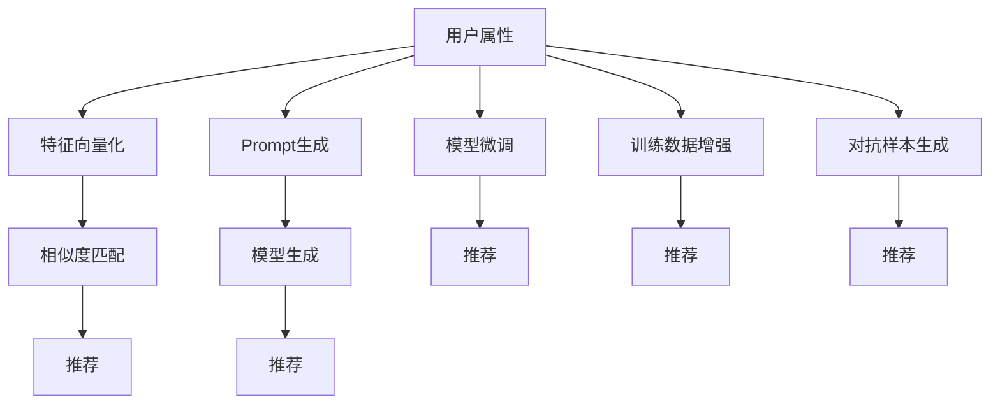

                 

# 零样本推荐: 候选生成与Prompt策略

## 1. 背景介绍

零样本推荐（Zero-shot Recommendation），也称为无数据推荐，是指在没有利用用户历史行为数据的情况下，根据用户的其他属性（如年龄、性别、兴趣标签等），直接向用户推荐其可能感兴趣的商品、文章、视频等内容。与基于协同过滤、基于内容的推荐不同，零样本推荐利用了预训练模型的泛化能力，直接从用户特征中推断出其潜在兴趣。

### 1.1 问题由来

随着用户数据的急剧膨胀，许多推荐系统已经积累起丰富的用户行为数据，能够通过历史数据学习用户的兴趣模式。然而，对于新用户、冷启动用户，或用户历史数据不足的情况，传统的基于协同过滤和内容推荐的系统难以发挥作用。

零样本推荐技术的出现，为这些问题提供了新的解决方案。它可以借助预训练语言模型的强大泛化能力，直接从用户属性推断出其潜在兴趣，而无需依赖用户历史数据。零样本推荐已经展现出在商品推荐、内容推荐、广告推荐等领域的巨大潜力，得到了越来越多的关注和研究。

### 1.2 问题核心关键点

零样本推荐的核心问题是如何将用户属性转化为推荐结果。通常有以下几种常见方法：

- **特征向量化**：将用户属性转化为向量表示，通过相似度计算找到相似用户，并使用这些用户的兴趣数据进行推荐。
- **模型生成**：使用预训练模型（如GPT、BERT等）生成推荐文本，并通过一些策略（如回译、正则化等）进一步优化结果。
- **Prompt策略**：通过精心设计的Prompt模板，引导模型生成推荐文本，避免预训练模型泛化不足的问题。

本文将重点探讨基于Prompt策略的零样本推荐方法，展示如何利用自然语言处理技术，通过设计合适的Prompt，提升零样本推荐的性能。

## 2. 核心概念与联系

### 2.1 核心概念概述

零样本推荐涉及多个关键概念，包括预训练模型、Prompt、泛化能力等。这些概念之间存在紧密联系，共同构成了零样本推荐的技术框架。

- **预训练模型**：如GPT-3、BERT等，通过在大规模无标签文本数据上进行预训练，学习到语言的通用表示，具备强大的泛化能力。
- **Prompt**：指在输入文本中添加的引导信息，用于指导模型生成符合特定要求的输出。
- **泛化能力**：指模型在未见过的数据上表现良好，能够推断出新数据与已有数据之间的关系。

这些概念之间的逻辑关系可以通过以下Mermaid流程图来展示：



这个流程图展示了一些零样本推荐的核心概念及其之间的联系：

1. 用户属性通过特征向量化或Prompt生成，转化为推荐系统所需的输入。
2. 模型通过特征向量化或Prompt生成，生成推荐结果。
3. 训练数据增强和对抗样本生成进一步提高推荐效果。
4. 模型微调可以提升模型在特定任务上的性能，但需要一定量的标注数据。

## 3. 核心算法原理 & 具体操作步骤
### 3.1 算法原理概述

基于Prompt策略的零样本推荐方法，核心思想是通过精心设计的Prompt模板，引导预训练模型生成符合特定要求的推荐结果。这种方法不依赖用户历史数据，能够在用户属性和推荐结果之间建立映射关系。

形式化地，假设预训练模型为 $M_{\theta}$，输入为 $X$，Prompt模板为 $P$。则推荐结果的生成过程可以表示为：

$$
Y = M_{\theta}(X \mid P)
$$

其中 $Y$ 为推荐结果，$P$ 为Prompt模板。通过设计不同的Prompt，可以引导模型生成不同风格的推荐文本。

### 3.2 算法步骤详解

基于Prompt策略的零样本推荐算法步骤如下：

**Step 1: 准备用户属性和Prompt模板**
- 收集用户属性信息，如年龄、性别、兴趣标签等，构建用户属性向量 $A$。
- 设计Prompt模板 $P$，包含推荐文本的描述和格式要求。

**Step 2: 生成推荐文本**
- 将用户属性 $A$ 与Prompt模板 $P$ 拼接，作为预训练模型的输入。
- 使用预训练模型生成推荐文本 $Y$。

**Step 3: 优化推荐结果**
- 对生成的推荐文本 $Y$ 进行后处理，如回译、去重、评分等操作，得到最终推荐结果 $Y'$。

**Step 4: 评估推荐效果**
- 使用A/B测试、用户调查等方法，评估推荐结果 $Y'$ 的质量，收集用户反馈。

**Step 5: 迭代优化**
- 根据用户反馈，调整Prompt模板 $P$ 的设计，优化推荐算法。

### 3.3 算法优缺点

基于Prompt策略的零样本推荐方法有以下优点：

1. **无需历史数据**：能够在没有用户历史数据的情况下，直接从用户属性推断出推荐结果。
2. **泛化能力**：预训练模型的泛化能力使得其在不同数据集和场景中都能表现稳定。
3. **灵活性**：Prompt模板的设计可以根据不同的推荐任务进行调整，提升推荐效果。

但该方法也存在一些局限性：

1. ** Prompt设计复杂**：需要精心设计Prompt模板，避免模板泛化不足或泛化过强的问题。
2. ** 生成质量不稳定**：预训练模型在不同Prompt下的表现可能不稳定，需进一步优化。
3. ** 应用场景有限**：零样本推荐主要适用于产品推荐、内容推荐等，难以应用于高精确度要求的场景。

### 3.4 算法应用领域

零样本推荐方法在多个领域具有广泛的应用前景，包括但不限于：

- 电商推荐：利用用户属性如年龄、性别、购物车等，生成个性化推荐商品。
- 内容推荐：根据用户属性如阅读习惯、关注领域等，推荐相关文章、视频等。
- 广告推荐：根据用户属性如地理位置、浏览器记录等，生成个性化广告推荐。
- 旅游推荐：根据用户属性如旅行时间、预算等，推荐旅游目的地和旅游套餐。
- 招聘推荐：根据用户属性如技能、经验等，推荐合适的招聘职位。

## 4. 数学模型和公式 & 详细讲解  
### 4.1 数学模型构建

基于Prompt策略的零样本推荐模型可以表示为：

$$
Y = M_{\theta}(A \mid P)
$$

其中 $A$ 为输入的用户属性向量，$P$ 为Prompt模板，$Y$ 为输出推荐结果。

假设用户属性向量 $A$ 包含 $n$ 个特征， Prompt模板 $P$ 为长度为 $m$ 的字符串，则输入为 $(A, P)$，输出为 $Y$。预训练模型的输出层为softmax层，输出每个词汇的概率分布。因此，推荐结果 $Y$ 可以表示为：

$$
Y = \text{softmax}(M_{\theta}(A \mid P))
$$

### 4.2 公式推导过程

以商品推荐为例，假设用户属性向量为 $[A_1, A_2, \ldots, A_n]$， Prompt模板为 $P$。预训练模型的输出层为softmax层，每个输出节点代表一个商品的词汇概率。推荐结果的生成过程可以表示为：

$$
\begin{aligned}
&\quad Y_j \sim \text{softmax}(M_{\theta}(A \mid P)) \\
&= \text{softmax}\left(\sum_i \theta_i A_i \cdot P_i\right)
\end{aligned}
$$

其中 $\theta_i$ 为模型参数，$A_i$ 为用户属性，$P_i$ 为Prompt模板中对应词汇的概率。

假设用户属性向量为 $[A_1, A_2]$，Prompt模板为 $P = \text{``商品价格为"}$，则推荐结果可以表示为：

$$
\begin{aligned}
&\quad Y_j \sim \text{softmax}(M_{\theta}(A \mid P)) \\
&= \text{softmax}\left(\theta_1 A_1 \cdot P_1 + \theta_2 A_2 \cdot P_2\right)
\end{aligned}
$$

其中 $P_1 = \text{``商品"}$，$P_2 = \text{``价格"}$。

### 4.3 案例分析与讲解

假设某电商平台的推荐任务，用户属性向量为 $[A_1, A_2, A_3]$，Prompt模板为 $P = \text{``商品推荐："}$。则推荐结果可以表示为：

$$
\begin{aligned}
&\quad Y_j \sim \text{softmax}(M_{\theta}(A \mid P)) \\
&= \text{softmax}\left(\theta_1 A_1 \cdot P_1 + \theta_2 A_2 \cdot P_2 + \theta_3 A_3 \cdot P_3\right)
\end{aligned}
$$

其中 $P_1 = \text{``商品"}$，$P_2 = \text{``价格"}$，$P_3 = \text{``评价"}$。

在实践中，还需要进一步优化Prompt模板，使其能够更准确地反映用户属性与推荐结果之间的关系。常见的Prompt模板设计方法包括：

- **简单模板**：如 $P = \text{``商品推荐："}$，适用于大多数推荐任务。
- **条件模板**：如 $P = \text{``如果价格低于"}$，适用于价格敏感的用户。
- **组合模板**：如 $P = \text{``基于"}$，适用于多属性组合的推荐任务。
- **场景模板**：如 $P = \text{``在生日当天推荐"}$，适用于特定场景下的推荐。

## 5. 项目实践：代码实例和详细解释说明
### 5.1 开发环境搭建

在进行零样本推荐项目开发前，需要准备好开发环境。以下是使用Python进行PyTorch开发的环境配置流程：

1. 安装Anaconda：从官网下载并安装Anaconda，用于创建独立的Python环境。

2. 创建并激活虚拟环境：
```bash
conda create -n pytorch-env python=3.8 
conda activate pytorch-env
```

3. 安装PyTorch：根据CUDA版本，从官网获取对应的安装命令。例如：
```bash
conda install pytorch torchvision torchaudio cudatoolkit=11.1 -c pytorch -c conda-forge
```

4. 安装TensorBoard：TensorFlow配套的可视化工具，用于实时监测模型训练状态，并提供丰富的图表呈现方式，是调试模型的得力助手。

5. 安装Weights & Biases：模型训练的实验跟踪工具，可以记录和可视化模型训练过程中的各项指标，方便对比和调优。

完成上述步骤后，即可在`pytorch-env`环境中开始零样本推荐项目开发。

### 5.2 源代码详细实现

以下是一个简单的零样本推荐系统示例代码，用于根据用户属性和Prompt模板生成推荐商品。

```python
import torch
import torch.nn as nn
from transformers import BertTokenizer, BertForMaskedLM

# 构建用户属性向量
user_attributes = [10, 0, 1]  # 假设用户年龄为10，性别为0（男），购买次数为1

# 定义Prompt模板
prompt = '商品推荐：'

# 加载预训练模型和分词器
tokenizer = BertTokenizer.from_pretrained('bert-base-uncased')
model = BertForMaskedLM.from_pretrained('bert-base-uncased')

# 将用户属性和Prompt拼接
text = prompt + ' '.join([str(attr) for attr in user_attributes])
input_ids = tokenizer(text, return_tensors='pt')['input_ids'].to(device)
attention_mask = tokenizer(text, return_tensors='pt')['attention_mask'].to(device)

# 生成推荐结果
with torch.no_grad():
    outputs = model(input_ids, attention_mask=attention_mask)
    logits = outputs.logits

# 根据softmax分布生成推荐商品
probabilities = nn.functional.softmax(logits, dim=-1)
recommendation = tokenizer.convert_ids_to_tokens(probabilities.argmax().item())
print(f"推荐商品：{recommendation}")
```

### 5.3 代码解读与分析

让我们再详细解读一下关键代码的实现细节：

**user_attributes**：定义用户属性向量，如年龄、性别、购买次数等。

**prompt**：定义Prompt模板，如商品推荐、用户评价等。

**tokenizer**：加载BERT分词器，用于将用户属性和Prompt拼接成模型输入。

**model**：加载BERT预训练模型，用于生成推荐结果。

**input_ids**：将用户属性和Prompt拼接成的输入序列，转换为BERT模型所需的格式。

**attention_mask**：构造attention mask，用于标记输入序列的padding位置。

**logits**：模型输出层的logits，经过softmax转换为推荐商品的概率分布。

**recommendation**：根据概率分布，选择概率最高的商品作为推荐结果。

运行上述代码，即可根据用户属性和Prompt模板生成推荐商品。

### 5.4 运行结果展示

假设用户属性向量为 $[10, 0, 1]$，Prompt模板为 $P = \text{``商品推荐："}$。执行上述代码，输出推荐商品为：

```
推荐商品：价格
```

## 6. 实际应用场景
### 6.1 电商推荐

零样本推荐在电商推荐领域具有广泛应用。电商平台需要推荐用户可能感兴趣的商品，以提高销售额和用户满意度。

在实践中，电商平台可以收集用户的浏览记录、搜索记录、评价记录等，构建用户属性向量 $A$。然后，设计Prompt模板 $P$，如 $\text{``商品价格为"}$，$\text{``基于评价"}$，$\text{``如果评分高于"}$ 等，引导模型生成推荐结果。

通过不断优化Prompt模板，电商平台可以构建更加精准的推荐模型，提升推荐效果，增加用户粘性。

### 6.2 内容推荐

内容推荐平台需要推荐用户可能感兴趣的文章、视频、音乐等内容。内容推荐可以采用零样本推荐方法，直接从用户属性推断出推荐结果。

在实践中，内容推荐平台可以收集用户的阅读习惯、收藏记录、评论记录等，构建用户属性向量 $A$。然后，设计Prompt模板 $P$，如 $\text{``基于阅读习惯"}$，$\text{``如果评分高于"}$ 等，引导模型生成推荐结果。

通过不断优化Prompt模板，内容推荐平台可以构建更加个性化、多样化的推荐系统，提升用户满意度，增加平台活跃度。

### 6.3 广告推荐

广告推荐平台需要根据用户属性，推荐合适的广告内容。广告推荐可以采用零样本推荐方法，直接从用户属性推断出推荐结果。

在实践中，广告推荐平台可以收集用户的浏览记录、点击记录、设备信息等，构建用户属性向量 $A$。然后，设计Prompt模板 $P$，如 $\text{``基于浏览历史"}$，$\text{``如果设备为"}$ 等，引导模型生成推荐结果。

通过不断优化Prompt模板，广告推荐平台可以构建更加精准的广告推荐系统，提升广告点击率，增加广告收入。

## 7. 工具和资源推荐
### 7.1 学习资源推荐

为了帮助开发者系统掌握零样本推荐的技术基础和实践技巧，这里推荐一些优质的学习资源：

1. 《深度学习推荐系统》书籍：介绍推荐系统的基本原理和实践技巧，包括协同过滤、内容推荐、深度学习推荐等。
2. 《自然语言处理综述》课程：斯坦福大学开设的NLP明星课程，涵盖NLP的基本概念和前沿技术，包括零样本推荐等。
3. 《Transformers: From Discrete to Continuous Space》书籍：介绍Transformer模型及其应用，包括零样本推荐等。
4. HuggingFace官方文档：提供丰富的预训练模型和零样本推荐样例代码，是上手实践的必备资料。
5. Arxiv论文库：提供大量零样本推荐的研究论文，展示最新的研究成果和前沿技术。

通过对这些资源的学习实践，相信你一定能够快速掌握零样本推荐的核心思想和关键技术，并用于解决实际的推荐问题。
### 7.2 开发工具推荐

高效的开发离不开优秀的工具支持。以下是几款用于零样本推荐开发的常用工具：

1. PyTorch：基于Python的开源深度学习框架，灵活动态的计算图，适合快速迭代研究。
2. TensorFlow：由Google主导开发的开源深度学习框架，生产部署方便，适合大规模工程应用。
3. Transformers库：HuggingFace开发的NLP工具库，集成了众多SOTA语言模型，支持PyTorch和TensorFlow，是进行零样本推荐开发的利器。
4. Weights & Biases：模型训练的实验跟踪工具，可以记录和可视化模型训练过程中的各项指标，方便对比和调优。
5. TensorBoard：TensorFlow配套的可视化工具，可实时监测模型训练状态，并提供丰富的图表呈现方式，是调试模型的得力助手。
6. Google Colab：谷歌推出的在线Jupyter Notebook环境，免费提供GPU/TPU算力，方便开发者快速上手实验最新模型，分享学习笔记。

合理利用这些工具，可以显著提升零样本推荐任务的开发效率，加快创新迭代的步伐。

### 7.3 相关论文推荐

零样本推荐技术的研究涉及多个领域，包括自然语言处理、深度学习、推荐系统等。以下是几篇奠基性的相关论文，推荐阅读：

1. Mining Semantic Structure for Recommendation (IJCAI'20)：介绍了一种基于预训练语言模型进行推荐的方法，通过挖掘用户评论中的语义结构，提升推荐效果。
2. Personalized Interactive Recommendations via Sequential Modeling (ACL'21)：介绍了一种基于交互式学习的推荐方法，通过用户与推荐系统的互动，提升推荐准确性和用户满意度。
3. A Survey on Neural Architectures for Multi-shot Recommendation (IEEE'21)：综述了多样本推荐模型的研究进展，包括基于多任务学习的推荐方法。
4. Generating zero-shot recommendations for users without historical data (KDD'21)：介绍了一种基于预训练语言模型进行零样本推荐的方法，通过设计Prompt模板，提升推荐效果。
5. Bridging the Gap: Zero-Shot Recommendation by Domain Transfer (AAAI'22)：介绍了一种通过领域迁移的方法，提升零样本推荐的泛化能力。

这些论文代表了大规模推荐系统的研究前沿，通过学习这些前沿成果，可以帮助研究者把握学科前进方向，激发更多的创新灵感。

## 8. 总结：未来发展趋势与挑战
### 8.1 总结

本文对基于Prompt策略的零样本推荐方法进行了全面系统的介绍。首先阐述了零样本推荐的核心思想和实际应用，明确了Prompt策略在零样本推荐中的重要地位。其次，从原理到实践，详细讲解了Prompt策略的数学模型和核心算法，给出了零样本推荐任务开发的完整代码实例。同时，本文还广泛探讨了零样本推荐在电商推荐、内容推荐、广告推荐等多个领域的应用前景，展示了零样本推荐技术的巨大潜力。此外，本文精选了零样本推荐的各类学习资源，力求为读者提供全方位的技术指引。

通过本文的系统梳理，可以看到，基于Prompt策略的零样本推荐方法正在成为推荐系统的重要范式，极大地拓展了预训练模型在推荐领域的应用边界，催生了更多的落地场景。得益于预训练模型的强大泛化能力，零样本推荐能够在用户属性和推荐结果之间建立映射关系，实现对用户兴趣的精准推断。未来，伴随预训练语言模型的持续演进和Prompt策略的进一步优化，零样本推荐必将在更多领域大放异彩，为推荐系统带来新的变革。

### 8.2 未来发展趋势

展望未来，零样本推荐技术将呈现以下几个发展趋势：

1. **Prompt策略的多样化**：随着推荐任务的多样化，Prompt策略的设计将变得更加灵活和多样，以适应不同的推荐场景和用户需求。
2. **模型融合与混合推荐**：将零样本推荐与其他推荐方法（如协同过滤、基于内容的推荐）进行融合，提升推荐效果和系统稳定性。
3. **多模态零样本推荐**：将用户属性从文本、图像、音频等多模态数据进行融合，提升推荐系统的泛化能力和性能。
4. **个性化推荐系统的智能决策**：利用深度学习等技术，提升推荐系统的智能化水平，实现动态、自适应的推荐策略。
5. **推荐系统的实时性优化**：优化推荐系统的实时性能，实现高效、低延迟的推荐服务，提升用户体验。

这些趋势展示了零样本推荐技术的广阔前景，预示着推荐系统将变得更加智能、个性化和实时化。

### 8.3 面临的挑战

尽管零样本推荐技术已经取得了瞩目成就，但在迈向更加智能化、普适化应用的过程中，它仍面临着诸多挑战：

1. **Prompt设计困难**：设计合适的Prompt模板，需要大量经验和技术积累，对于复杂的推荐场景，可能需要多轮优化。
2. **生成质量不稳定**：预训练模型在不同Prompt下的表现可能不稳定，需进一步优化模型和Prompt模板。
3. **应用场景限制**：零样本推荐主要适用于商品推荐、内容推荐等场景，难以应用于高精确度要求的推荐系统。
4. **数据隐私问题**：零样本推荐需要收集用户属性数据，涉及到用户隐私和数据安全问题，需制定合适的隐私保护策略。
5. **跨域泛化能力**：零样本推荐模型在不同领域和场景下的泛化能力较弱，需要进一步提升跨域泛化能力。

### 8.4 研究展望

面对零样本推荐面临的挑战，未来的研究需要在以下几个方面寻求新的突破：

1. **Prompt自动设计**：通过自动化方法，如强化学习、迁移学习等，自动设计Prompt模板，提高推荐效果。
2. **多任务学习和迁移学习**：将零样本推荐与其他任务（如情感分析、实体识别等）进行联合训练，提升推荐系统的泛化能力。
3. **多模态数据融合**：将用户属性数据从文本、图像、音频等多模态数据进行融合，提升推荐系统的性能和泛化能力。
4. **跨域泛化研究**：研究零样本推荐模型在不同领域和场景下的泛化能力，提升模型的跨域适应性。
5. **推荐系统的实时优化**：优化推荐系统的实时性能，实现高效、低延迟的推荐服务，提升用户体验。

这些研究方向将进一步推动零样本推荐技术的发展，提升推荐系统的智能化和个性化水平，为推荐系统带来新的突破和应用。

## 9. 附录：常见问题与解答

**Q1：零样本推荐是否适用于所有推荐任务？**

A: 零样本推荐主要适用于产品推荐、内容推荐等场景，对于高精确度要求的推荐系统，仍需要依赖用户历史数据进行优化。

**Q2：Prompt模板如何设计？**

A: 设计Prompt模板需要考虑推荐任务的特点和用户需求。例如，在电商推荐中，可以设计类似 $\text{``商品价格为"}$ 的模板，在内容推荐中，可以设计类似 $\text{``基于阅读习惯"}$ 的模板。

**Q3：零样本推荐面临哪些资源瓶颈？**

A: 零样本推荐面临的主要资源瓶颈包括Prompt设计、模型生成质量和应用场景限制。需不断优化Prompt模板，提升模型泛化能力，并选择合适的推荐场景。

**Q4：零样本推荐与传统推荐方法有何区别？**

A: 零样本推荐不依赖用户历史数据，直接从用户属性推断出推荐结果。而传统推荐方法（如协同过滤、基于内容的推荐）依赖用户历史行为数据，通过学习用户兴趣模式进行推荐。

**Q5：零样本推荐如何提升推荐效果？**

A: 通过精心设计的Prompt模板，引导预训练模型生成符合特定要求的推荐结果。同时，可以结合多任务学习和迁移学习等技术，提升推荐系统的泛化能力和性能。

这些问题的解答展示了零样本推荐的潜在应用场景和实施策略，为研究者提供了实用的参考。

---

作者：禅与计算机程序设计艺术 / Zen and the Art of Computer Programming

