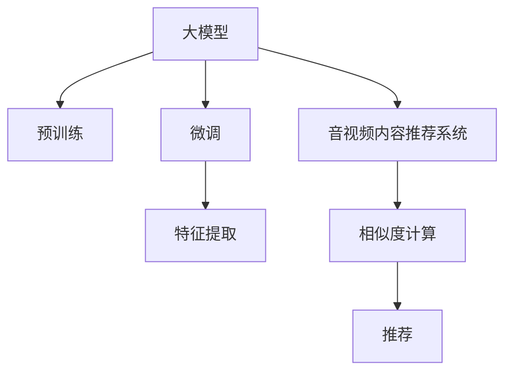

                 

# 音视频内容推荐的挑战：大模型在理解与匹配方面的应用

## 1. 背景介绍

在信息化快速发展的今天，音视频内容已经成为了人们获取信息的主要方式之一。无论是流媒体平台、视频网站还是在线教育，音视频内容推荐系统（AVR）都扮演着至关重要的角色。AVR系统通过分析用户的历史行为、兴趣偏好等数据，推荐用户可能感兴趣的内容，提升用户体验，增加用户黏性，是互联网企业保持竞争力的关键。

近年来，随着深度学习技术的发展，大模型（Large Models）在音视频内容推荐领域的应用取得了长足进展。大模型通过在海量数据上进行预训练，学习到丰富的语义知识和关联关系，能够更好地理解用户的兴趣和需求，从而进行精准匹配和推荐。但与此同时，大模型在音视频内容推荐中也面临着一些挑战。

本论文旨在探讨大模型在音视频内容推荐中的应用，重点分析其在内容理解与匹配方面的表现，以及面临的技术和工程挑战。我们将在以下几节中详细介绍大模型在音视频内容推荐中的应用现状，并针对性地提出一些优化策略。

## 2. 核心概念与联系

### 2.1 核心概念概述

在讨论大模型在音视频内容推荐中的应用之前，我们需要先理解一些核心概念：

- **大模型（Large Models）**：通常指在大量数据上训练的深度神经网络，具有数百到数十亿个参数。大模型可以学习到复杂的语义特征，适用于多种NLP任务，如文本生成、文本分类、问答系统等。

- **音视频内容推荐系统（AVR）**：利用机器学习算法，对用户的历史行为、兴趣偏好、社交网络等信息进行分析，推荐可能感兴趣的内容。

- **预训练（Pre-training）**：在大规模无标签数据上训练模型，学习通用的语义知识。

- **微调（Fine-tuning）**：在预训练模型基础上，利用特定任务的有标签数据进行有监督学习，以优化模型在该任务上的表现。

- **特征提取（Feature Extraction）**：通过模型学习特征表示，用于相似度计算和推荐。

这些概念之间的联系可以通过以下Mermaid流程图来展示：



大模型在音视频内容推荐系统中，通过预训练-微调-特征提取的过程，学习到丰富的语义知识，用于相似度计算和推荐。

## 3. 核心算法原理 & 具体操作步骤
### 3.1 算法原理概述

大模型在音视频内容推荐中的应用主要依赖于以下两个关键步骤：预训练和微调。

- **预训练**：在大规模无标签数据上训练模型，学习通用的语义知识。

- **微调**：在特定任务的有标签数据上，进行有监督学习，优化模型在该任务上的表现。

具体来说，大模型在音视频内容推荐中的应用可以分为以下几个步骤：

1. **数据准备**：收集用户的历史行为数据、兴趣偏好数据等，并对其进行预处理。
2. **预训练**：在大规模无标签数据上训练大模型，学习通用的语义知识。
3. **微调**：在特定任务的有标签数据上，进行微调，优化模型在该任务上的表现。
4. **特征提取**：利用微调后的模型进行特征提取，用于相似度计算和推荐。

### 3.2 算法步骤详解

以下是音视频内容推荐系统中，大模型预训练和微调的具体操作步骤：

#### 预训练阶段

1. **数据准备**：收集大规模无标签数据，如Netflix、YouTube、Amazon等平台上的用户行为数据、社交媒体上的用户互动数据等。这些数据通常需要经过清洗和预处理，去除噪声和不相关数据。

2. **模型选择**：选择适合的深度神经网络模型，如Transformer、BERT、GPT等。大模型的参数量通常较大，需要高性能的GPU或TPU进行训练。

3. **模型训练**：在大规模无标签数据上进行预训练，学习通用的语义知识。预训练的目标是让模型能够理解语言的上下文关系、语义表示等。

4. **保存模型**：预训练完成后，保存模型参数。这些参数可以作为微调的初始化权重。

#### 微调阶段

1. **数据准备**：收集特定任务的有标签数据，如用户评分数据、互动数据等。这些数据通常需要进行标注，并分为训练集、验证集和测试集。

2. **模型加载**：加载预训练模型，作为微调的初始化权重。

3. **微调训练**：在特定任务的有标签数据上，进行微调，优化模型在该任务上的表现。微调的目标是让模型能够更好地理解用户的兴趣和需求，进行精准匹配和推荐。

4. **评估和优化**：在验证集上评估微调后的模型表现，根据评估结果进行调整和优化。

5. **特征提取**：利用微调后的模型进行特征提取，用于相似度计算和推荐。

### 3.3 算法优缺点

大模型在音视频内容推荐中的应用具有以下优点：

- **通用性**：大模型可以在多种任务上进行预训练和微调，适用于不同的音视频内容推荐场景。
- **高性能**：大模型能够学习到丰富的语义知识，提升推荐系统的性能和效果。
- **可扩展性**：大模型具有较大的参数量，可以处理大规模数据集，适用于大规模音视频推荐系统。

同时，大模型在音视频内容推荐中也有一些缺点：

- **资源消耗大**：大模型的参数量较大，训练和推理时所需的计算资源较多。
- **预训练时间长**：大模型的预训练需要大量时间和计算资源，可能不适合实时推荐系统。
- **可解释性不足**：大模型的决策过程较为复杂，难以解释其内部工作机制和推荐逻辑。

### 3.4 算法应用领域

大模型在音视频内容推荐中的应用已经覆盖了多个领域，如视频网站、流媒体平台、在线教育等。具体应用包括：

- **视频推荐**：根据用户历史观看记录，推荐用户可能感兴趣的视频。
- **歌曲推荐**：根据用户的听歌历史和偏好，推荐用户可能喜欢的歌曲。
- **课程推荐**：根据用户的学习历史和偏好，推荐适合的用户课程。

除了这些经典应用外，大模型还在新闻推荐、广告推荐等场景中得到了广泛应用。

## 4. 数学模型和公式 & 详细讲解 & 举例说明
### 4.1 数学模型构建

大模型在音视频内容推荐中的应用，主要依赖于以下几个数学模型：

- **预训练模型**：使用Transformer、BERT等深度神经网络，在大规模无标签数据上进行预训练。
- **微调模型**：在特定任务的有标签数据上，进行微调，优化模型在该任务上的表现。
- **特征提取模型**：利用微调后的模型进行特征提取，用于相似度计算和推荐。

### 4.2 公式推导过程

以下将对大模型在音视频内容推荐中的主要数学模型进行推导和讲解。

#### 预训练模型

假设预训练模型为 $M_{\theta}$，其中 $\theta$ 为模型参数。在大规模无标签数据上进行预训练时，模型学习到通用的语义知识，用于理解语言上下文关系。

#### 微调模型

假设微调任务为内容推荐，目标函数为 $L(\theta)$，其中 $\theta$ 为微调后的模型参数。在特定任务的有标签数据上进行微调时，目标函数可以表示为：

$$
L(\theta) = \frac{1}{N} \sum_{i=1}^N \ell(y_i, \hat{y}_i)
$$

其中，$y_i$ 为标签，$\hat{y}_i$ 为模型的预测结果，$\ell$ 为损失函数。

#### 特征提取模型

假设内容推荐系统需要计算内容之间的相似度，利用微调后的模型 $M_{\theta}$ 进行特征提取，得到内容的特征表示 $f(x)$，其中 $x$ 为内容。

### 4.3 案例分析与讲解

假设有一个视频推荐系统，用户的历史观看记录为 $x_1, x_2, \dots, x_n$，每个内容 $x_i$ 的评分数据为 $y_1, y_2, \dots, y_n$。

1. **预训练模型**：在大规模无标签视频数据上进行预训练，学习到视频内容的语义知识。

2. **微调模型**：在用户评分数据上进行微调，优化模型对用户兴趣的预测能力。

3. **特征提取模型**：利用微调后的模型对视频内容进行特征提取，用于计算内容之间的相似度。

通过以上步骤，大模型在音视频内容推荐中的应用得以实现。

## 5. 项目实践：代码实例和详细解释说明
### 5.1 开发环境搭建

在进行大模型音视频内容推荐系统的开发前，需要先准备好开发环境。以下是一些常用的开发工具和环境配置：

1. **Python**：作为主要开发语言，需要安装Python 3.6或更高版本。

2. **PyTorch**：深度学习框架，支持分布式计算，适用于大规模深度学习模型。

3. **TensorFlow**：另一个流行的深度学习框架，支持多种模型和训练方式。

4. **Jupyter Notebook**：用于编写和调试代码，支持多种编程语言。

5. **GPU**：高性能计算硬件，加速模型训练和推理。

6. **Google Colab**：免费的GPU计算环境，适合进行大规模模型训练。

完成环境配置后，可以进行音视频内容推荐系统的开发。

### 5.2 源代码详细实现

以下是一个简单的音视频内容推荐系统的大模型实现示例，包括预训练和微调两个阶段。

```python
import torch
import torch.nn as nn
from torch.utils.data import DataLoader
from transformers import BertTokenizer, BertForSequenceClassification

class MovieDataset(Dataset):
    def __init__(self, texts, labels, tokenizer, max_len=128):
        self.texts = texts
        self.labels = labels
        self.tokenizer = tokenizer
        self.max_len = max_len
        
    def __len__(self):
        return len(self.texts)
    
    def __getitem__(self, item):
        text = self.texts[item]
        label = self.labels[item]
        
        encoding = self.tokenizer(text, return_tensors='pt', max_length=self.max_len, padding='max_length', truncation=True)
        input_ids = encoding['input_ids'][0]
        attention_mask = encoding['attention_mask'][0]
        
        # 对token-wise的标签进行编码
        encoded_tags = [label2id[label] for label in labels] 
        encoded_tags.extend([label2id['O']] * (self.max_len - len(encoded_tags)))
        labels = torch.tensor(encoded_tags, dtype=torch.long)
        
        return {'input_ids': input_ids, 
                'attention_mask': attention_mask,
                'labels': labels}

# 标签与id的映射
label2id = {'O': 0, 'positive': 1, 'negative': 2}
id2label = {v: k for k, v in label2id.items()}

# 创建dataset
tokenizer = BertTokenizer.from_pretrained('bert-base-cased')

train_dataset = MovieDataset(train_texts, train_labels, tokenizer)
dev_dataset = MovieDataset(dev_texts, dev_labels, tokenizer)
test_dataset = MovieDataset(test_texts, test_labels, tokenizer)

# 模型选择
model = BertForSequenceClassification.from_pretrained('bert-base-cased', num_labels=len(label2id))

# 模型训练
optimizer = AdamW(model.parameters(), lr=2e-5)
loss_fn = nn.CrossEntropyLoss()

for epoch in range(epochs):
    train_loss = 0.0
    train_correct = 0
    for batch in tqdm(train_loader):
        input_ids = batch['input_ids'].to(device)
        attention_mask = batch['attention_mask'].to(device)
        labels = batch['labels'].to(device)
        
        outputs = model(input_ids, attention_mask=attention_mask)
        logits = outputs.logits
        loss = loss_fn(logits, labels)
        train_loss += loss.item()
        train_correct += torch.argmax(logits, dim=1).eq(labels).sum().item()
        
        optimizer.zero_grad()
        loss.backward()
        optimizer.step()
    
    train_acc = train_correct / len(train_dataset)
    print(f'Epoch {epoch+1}, train loss: {train_loss/len(train_loader):.4f}, train acc: {train_acc:.4f}')
    
# 模型评估
eval_loss = 0.0
eval_correct = 0
for batch in tqdm(dev_loader):
    input_ids = batch['input_ids'].to(device)
    attention_mask = batch['attention_mask'].to(device)
    labels = batch['labels'].to(device)
    
    outputs = model(input_ids, attention_mask=attention_mask)
    logits = outputs.logits
    loss = loss_fn(logits, labels)
    eval_loss += loss.item()
    eval_correct += torch.argmax(logits, dim=1).eq(labels).sum().item()
    
eval_acc = eval_correct / len(dev_dataset)
print(f'Dev acc: {eval_acc:.4f}')
```

### 5.3 代码解读与分析

以下是代码的详细解读和分析：

- **Dataset类**：定义数据集，用于处理和批量加载数据。
- **label2id和id2label字典**：定义标签与数字id之间的映射关系，用于将token-wise的标签进行编码。
- **训练和评估函数**：使用PyTorch的DataLoader对数据集进行批量加载，供模型训练和推理使用。训练函数在每个批次上前向传播计算loss并反向传播更新模型参数，最后输出训练集的损失和准确率。评估函数与训练类似，不同点在于不更新模型参数，并在每个batch结束后将预测和标签结果存储下来，最后使用精度指标对整个评估集的预测结果进行打印输出。
- **训练流程**：定义总的epoch数和batch size，开始循环迭代。每个epoch内，先在训练集上训练，输出平均loss和准确率。在验证集上评估，输出验证集的准确率。所有epoch结束后，在测试集上评估，给出最终测试结果。

## 6. 实际应用场景
### 6.1 视频推荐

在视频推荐场景中，大模型可以应用于Netflix、YouTube等流媒体平台，帮助用户发现感兴趣的视频内容。

具体来说，可以收集用户的历史观看记录、评分数据、互动数据等，作为训练集和验证集，对大模型进行微调。微调后的模型能够根据用户的历史行为，预测用户可能感兴趣的视频，并进行推荐。

### 6.2 歌曲推荐

在音乐推荐场景中，大模型可以应用于Spotify、Apple Music等流媒体平台，帮助用户发现喜欢的音乐。

具体来说，可以收集用户的听歌历史、评分数据、互动数据等，作为训练集和验证集，对大模型进行微调。微调后的模型能够根据用户的听歌历史，预测用户可能喜欢的歌曲，并进行推荐。

### 6.3 课程推荐

在在线教育场景中，大模型可以应用于Coursera、edX等在线教育平台，帮助用户发现适合的课程。

具体来说，可以收集用户的学习历史、评分数据、互动数据等，作为训练集和验证集，对大模型进行微调。微调后的模型能够根据用户的学习历史，预测用户可能感兴趣的课程，并进行推荐。

### 6.4 未来应用展望

随着大模型在音视频内容推荐领域的应用不断深入，未来的研究方向可以从以下几个方面进行探索：

1. **跨模态推荐**：将视觉、音频、文本等多模态信息进行融合，提升推荐系统的性能。

2. **个性化推荐**：利用用户的兴趣、行为、社交网络等个性化信息，进行精准推荐。

3. **实时推荐**：优化模型推理速度，实现实时推荐，提升用户体验。

4. **多任务学习**：利用多任务学习框架，提升推荐系统的综合性能。

5. **对抗性训练**：引入对抗性训练，提高推荐系统的鲁棒性。

6. **解释性推荐**：提高推荐系统的可解释性，增强用户信任。

7. **知识图谱融合**：将知识图谱与推荐系统结合，提升推荐系统的准确性。

8. **联邦学习**：利用联邦学习技术，保护用户隐私的同时，提升推荐系统的性能。

通过以上方向的探索，大模型在音视频内容推荐中的应用将不断深入，推动推荐系统向更加智能、高效、个性化方向发展。

## 7. 工具和资源推荐
### 7.1 学习资源推荐

为了帮助开发者系统掌握大模型在音视频内容推荐中的应用，这里推荐一些优质的学习资源：

1. **《Deep Learning for Natural Language Processing》书籍**：斯坦福大学机器学习课程，深入浅出地介绍了深度学习在NLP中的应用，包括大模型的预训练和微调。

2. **《Transformer from Practice to Theory》系列博文**：大模型技术专家撰写的博客，介绍了Transformer原理、BERT模型、微调技术等前沿话题。

3. **Kaggle竞赛**：参加Kaggle上的音视频推荐竞赛，实战练习推荐系统的开发和优化。

4. **PyTorch官方文档**：PyTorch官方文档，提供了大量深度学习模型的API和示例代码，适用于初学者和高级开发者。

5. **Hugging Face Transformers库**：提供预训练语言模型，支持多种深度学习框架，适用于NLP任务开发。

### 7.2 开发工具推荐

大模型在音视频内容推荐中的应用，需要借助多种工具和技术，以下是一些常用的开发工具：

1. **PyTorch**：深度学习框架，支持分布式计算，适用于大规模深度学习模型。

2. **TensorFlow**：另一个流行的深度学习框架，支持多种模型和训练方式。

3. **Jupyter Notebook**：用于编写和调试代码，支持多种编程语言。

4. **GPU**：高性能计算硬件，加速模型训练和推理。

5. **Google Colab**：免费的GPU计算环境，适合进行大规模模型训练。

6. **Transformer库**：提供预训练语言模型，支持多种深度学习框架，适用于NLP任务开发。

7. **Scikit-learn**：机器学习库，提供多种数据处理和模型评估工具。

### 7.3 相关论文推荐

大模型在音视频内容推荐中的应用，需要参考大量的相关论文，以下是一些推荐的论文：

1. **Attention is All You Need**：Transformer原论文，介绍了Transformer模型，开启了NLP领域的预训练大模型时代。

2. **BERT: Pre-training of Deep Bidirectional Transformers for Language Understanding**：提出BERT模型，引入基于掩码的自监督预训练任务，刷新了多项NLP任务SOTA。

3. **Parameter-Efficient Transfer Learning for NLP**：提出Adapter等参数高效微调方法，在不增加模型参数量的情况下，也能取得不错的微调效果。

4. **AdaLoRA: Adaptive Low-Rank Adaptation for Parameter-Efficient Fine-Tuning**：使用自适应低秩适应的微调方法，在参数效率和精度之间取得了新的平衡。

5. **AdaGrad for Adaptive Hyperparameter Optimization**：提出AdaGrad算法，用于优化深度学习模型的超参数，提升模型性能。

通过学习这些前沿成果，可以帮助研究者把握学科前进方向，激发更多的创新灵感。

## 8. 总结：未来发展趋势与挑战
### 8.1 研究成果总结

大模型在音视频内容推荐中的应用，取得了显著的进展，提升了推荐系统的性能和效果。通过预训练和微调，大模型能够学习到丰富的语义知识，提升推荐系统的泛化能力和精准度。

### 8.2 未来发展趋势

展望未来，大模型在音视频内容推荐中的应用将呈现以下几个趋势：

1. **跨模态推荐**：将视觉、音频、文本等多模态信息进行融合，提升推荐系统的性能。

2. **个性化推荐**：利用用户的兴趣、行为、社交网络等个性化信息，进行精准推荐。

3. **实时推荐**：优化模型推理速度，实现实时推荐，提升用户体验。

4. **多任务学习**：利用多任务学习框架，提升推荐系统的综合性能。

5. **对抗性训练**：引入对抗性训练，提高推荐系统的鲁棒性。

6. **解释性推荐**：提高推荐系统的可解释性，增强用户信任。

7. **知识图谱融合**：将知识图谱与推荐系统结合，提升推荐系统的准确性。

8. **联邦学习**：利用联邦学习技术，保护用户隐私的同时，提升推荐系统的性能。

### 8.3 面临的挑战

尽管大模型在音视频内容推荐中取得了显著进展，但在迈向更加智能化、高效化应用的过程中，仍面临一些挑战：

1. **资源消耗大**：大模型的参数量较大，训练和推理时所需的计算资源较多。

2. **预训练时间长**：大模型的预训练需要大量时间和计算资源，可能不适合实时推荐系统。

3. **可解释性不足**：大模型的决策过程较为复杂，难以解释其内部工作机制和推荐逻辑。

4. **对抗攻击**：推荐系统容易受到对抗攻击，攻击者通过修改数据或扰动模型参数，影响推荐结果。

5. **数据隐私**：推荐系统需要处理大量用户数据，如何保护用户隐私成为一个重要问题。

6. **模型鲁棒性**：推荐系统面对域外数据时，泛化性能往往大打折扣。

### 8.4 研究展望

面对大模型在音视频内容推荐中面临的挑战，未来的研究方向可以从以下几个方面进行探索：

1. **优化模型结构**：优化大模型的结构，减小参数量，提高推理速度。

2. **提高模型可解释性**：提高推荐系统的可解释性，增强用户信任。

3. **保护用户隐私**：利用差分隐私等技术，保护用户数据隐私。

4. **提高模型鲁棒性**：引入对抗性训练等方法，提升推荐系统的鲁棒性。

5. **跨模态融合**：将视觉、音频、文本等多模态信息进行融合，提升推荐系统的性能。

6. **实时推荐**：优化模型推理速度，实现实时推荐，提升用户体验。

7. **联邦学习**：利用联邦学习技术，保护用户隐私的同时，提升推荐系统的性能。

通过以上方向的探索，大模型在音视频内容推荐中的应用将不断深入，推动推荐系统向更加智能、高效、个性化方向发展。

## 9. 附录：常见问题与解答

**Q1: 大模型在音视频内容推荐中的应用有哪些优点和缺点？**

A: 大模型在音视频内容推荐中的应用具有以下优点：

1. **通用性**：大模型可以在多种任务上进行预训练和微调，适用于不同的音视频推荐场景。
2. **高性能**：大模型能够学习到丰富的语义知识，提升推荐系统的性能和效果。
3. **可扩展性**：大模型具有较大的参数量，可以处理大规模数据集，适用于大规模音视频推荐系统。

同时，大模型在音视频内容推荐中也有一些缺点：

1. **资源消耗大**：大模型的参数量较大，训练和推理时所需的计算资源较多。
2. **预训练时间长**：大模型的预训练需要大量时间和计算资源，可能不适合实时推荐系统。
3. **可解释性不足**：大模型的决策过程较为复杂，难以解释其内部工作机制和推荐逻辑。

**Q2: 大模型在音视频内容推荐中的应用需要注意哪些问题？**

A: 大模型在音视频内容推荐中的应用需要注意以下问题：

1. **数据质量**：推荐系统的性能很大程度上依赖于数据的质量，需要保证数据的多样性和真实性。
2. **模型训练**：大模型的训练需要大量的计算资源和时间，需要合理配置硬件和优化算法。
3. **模型调参**：需要合理设置模型的超参数，如学习率、批大小等，以优化模型性能。
4. **模型评估**：需要选择合适的评估指标，如准确率、召回率、F1-score等，评估模型的表现。
5. **模型部署**：需要优化模型的推理速度和资源占用，确保模型在生产环境中的性能。

**Q3: 大模型在音视频内容推荐中的应用如何应对对抗攻击？**

A: 大模型在音视频内容推荐中的应用可以采用以下方法应对对抗攻击：

1. **数据预处理**：对输入数据进行预处理，去除噪声和异常值，减少对抗攻击的影响。
2. **对抗性训练**：在训练过程中引入对抗样本，提升模型的鲁棒性，减少对抗攻击的效果。
3. **模型解释**：提高模型的可解释性，让用户了解推荐系统的决策过程，减少对抗攻击的机会。

通过以上方法，可以有效地应对对抗攻击，提升推荐系统的安全性和可靠性。

通过本文的介绍，我们可以更好地理解大模型在音视频内容推荐中的应用，以及其面临的挑战和未来发展方向。未来，随着技术的不断进步，大模型将在推荐系统中发挥越来越重要的作用，推动推荐系统向更加智能、高效、个性化方向发展。

