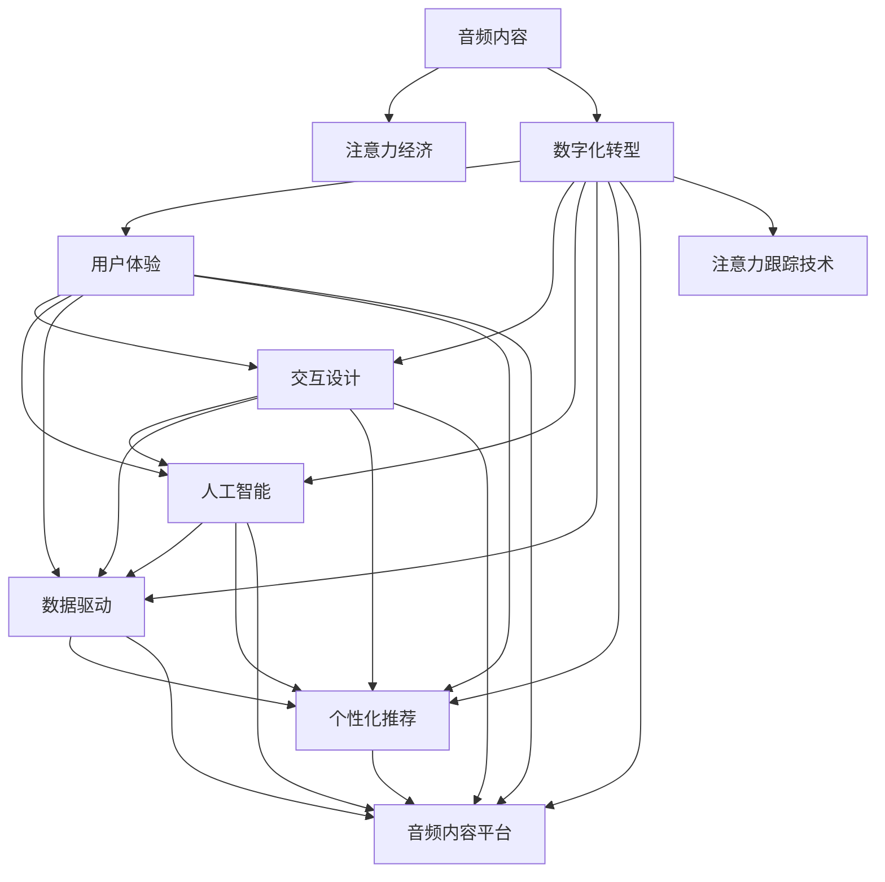

                 

# 音频内容在注意力经济中的崛起

> 关键词：音频内容, 注意力经济, 数字化转型, 用户体验, 交互设计, 人工智能, 数据驱动, 个性化推荐

## 1. 背景介绍

### 1.1 问题由来
随着互联网和移动互联网的迅猛发展，数字经济逐渐成为全球经济增长的重要动力。其中，注意力经济作为数字经济的重要组成部分，正迅速崛起。据市场调研公司Statista统计，2021年全球数字注意力市场规模已经达到108亿美元，预计到2026年将达到318亿美元。

音频内容作为数字注意力经济中的重要形式，其独特性和魅力逐渐显现。相较于传统的文字、图片等静态媒体，音频内容以其独特的沉浸性和亲和力，在提供信息、娱乐、教育等方面发挥着不可替代的作用。特别是在当下疫情常态化、生活节奏加快的背景下，音频内容以其便捷、快速、易接受的特点，在数字注意力经济中占据了重要位置。

### 1.2 问题核心关键点
当前，音频内容在注意力经济中崛起的主要驱动因素包括：

- **用户需求的增长**：数字化、信息化社会中，用户对便捷、高效、个性化的信息获取需求日益增长。音频内容的便捷性和即时性满足了用户需求，成为信息消费的重要载体。

- **数字技术的进步**：5G、云计算、人工智能等数字技术的进步，为音频内容的生产、传播、互动提供了强大技术支持，降低了音频内容的制作和分发成本，提升了用户体验。

- **内容多样性的拓展**：音频内容形式多样，涵盖播客、音乐、广播剧、有声书等，满足了不同用户的多元化需求。

- **数据驱动的个性化推荐**：大数据、机器学习等技术的应用，使得音频内容平台能够精准推荐用户感兴趣的内容，提升用户粘性和满意度。

## 2. 核心概念与联系

### 2.1 核心概念概述

为更好地理解音频内容在注意力经济中的崛起，本节将介绍几个密切相关的核心概念：

- **音频内容**：包括播客、有声书、音乐、广播剧等，是一种时间维度上连续的多媒体形式。音频内容通过声音传递信息，具有强烈的情感和感染力。

- **注意力经济**：指利用注意力资源，通过内容吸引、用户互动等方式，实现商业价值最大化的经济模式。

- **数字化转型**：指传统行业通过数字化技术，提升生产效率、优化业务流程、拓展市场渠道，实现经济增值的过程。

- **用户体验**：指用户在使用产品或服务过程中，感受到的愉悦程度和满足感。

- **交互设计**：指通过设计良好的用户界面和交互方式，提升用户体验，促进用户与系统的互动。

- **人工智能**：指通过模拟人类智能行为，实现问题求解、信息处理、决策制定等功能的技术。

- **数据驱动**：指以数据为核心，通过数据分析和挖掘，指导决策和优化过程。

- **个性化推荐**：指根据用户的历史行为、兴趣偏好等，推荐符合其需求的内容，提升用户满意度。

- **音频内容平台**：包括Spotify、Apple Music、网易云音乐、喜马拉雅等，是音频内容的生产、传播、交互平台。

- **注意力跟踪技术**：指通过传感器、数据分析等技术，实时监测用户的注意力状态，用于个性化推荐、广告投放等。

这些核心概念之间的逻辑关系可以通过以下Mermaid流程图来展示：



这个流程图展示了一些核心概念及其之间的关系：

1. 音频内容是注意力经济的重要组成部分。
2. 数字化转型、用户体验、交互设计、人工智能、数据驱动等技术，推动了音频内容的崛起和应用。
3. 个性化推荐和音频内容平台，进一步提升了用户粘性和满意度。
4. 注意力跟踪技术，为音频内容的精准推荐提供了技术支撑。

## 3. 核心算法原理 & 具体操作步骤
### 3.1 算法原理概述

音频内容在注意力经济中的崛起，主要依赖于以下几个算法原理：

- **内容推荐算法**：通过分析用户的历史行为和兴趣，推荐相关音频内容。常见推荐算法包括协同过滤、基于内容的推荐、混合推荐等。

- **语音识别技术**：通过语音识别技术，将语音内容转换为文本，方便用户检索和推荐。语音识别技术的关键是声纹识别、语音合成、语义理解等。

- **情感分析**：通过分析用户对音频内容的情感反馈，优化推荐内容。情感分析主要涉及文本情感分析、语音情感识别等。

- **用户行为分析**：通过分析用户的行为数据，预测用户兴趣和需求，提升推荐效果。用户行为分析包括点击率、停留时间、互动率等。

- **交互设计算法**：通过设计良好的用户界面和交互方式，提升用户体验。交互设计算法涉及界面优化、语音交互、手势识别等。

### 3.2 算法步骤详解

音频内容在注意力经济中的崛起，主要通过以下算法步骤实现：

**Step 1: 数据收集与预处理**
- 收集用户的历史行为数据，如播放历史、点击记录、互动数据等。
- 对数据进行清洗、归一化等预处理操作，去除噪声和异常值，保证数据质量。

**Step 2: 特征提取与建模**
- 提取用户特征，如年龄、性别、兴趣偏好等。
- 提取音频内容特征，如文本情感、语音情感、音乐类型等。
- 构建推荐模型，如协同过滤模型、基于内容的推荐模型、混合推荐模型等。

**Step 3: 模型训练与优化**
- 使用用户行为数据和音频内容特征训练推荐模型。
- 使用交叉验证、超参数调优等方法优化模型性能。
- 采用分布式计算框架，如Hadoop、Spark等，加速模型训练。

**Step 4: 实时推荐与反馈**
- 根据用户实时行为数据，实时生成推荐列表。
- 对推荐结果进行反馈，收集用户反馈数据，不断优化推荐模型。
- 使用A/B测试等方法，评估推荐效果，选择最优推荐策略。

**Step 5: 持续迭代与升级**
- 根据用户反馈和行为数据，不断优化推荐模型。
- 引入新的技术手段，如深度学习、强化学习等，提升推荐精度。
- 引入多模态数据，如文本、图像、语音等，提升推荐效果。

### 3.3 算法优缺点

音频内容在注意力经济中的崛起，具有以下优点：

- **便捷高效**：音频内容易于获取和消费，特别是通过智能音箱、手机等设备，用户可以随时随地听取音频内容，提高了信息获取的便捷性。

- **多样性**：音频内容形式多样，涵盖播客、音乐、广播剧、有声书等，满足了不同用户的需求。

- **沉浸性强**：相较于文字和图片，音频内容具有更强的情感感染力和沉浸感，能够更好地吸引用户注意力。

- **个性化推荐**：通过个性化推荐算法，能够精准推荐用户感兴趣的内容，提升用户体验和满意度。

同时，该方法也存在一定的局限性：

- **音质问题**：音频内容的音质对用户体验有很大影响，特别是在网络环境不稳定时，音质问题会显著降低用户满意度。

- **内容质量参差不齐**：音频内容平台上的内容质量参差不齐，一些低质量内容可能会误导用户，降低平台信誉。

- **隐私保护问题**：用户行为数据和音频内容特征涉及隐私保护，如何在提供优质服务的同时保障用户隐私，是一个重要挑战。

- **互动性不足**：相比于视频内容，音频内容的互动性相对较弱，无法提供直观的视觉体验。

尽管存在这些局限性，但就目前而言，音频内容在注意力经济中的崛起趋势是明显的。未来相关研究的重点在于如何进一步提高音频内容的音质、丰富内容质量、保护用户隐私，并增强音频内容的互动性。

### 3.4 算法应用领域

音频内容在注意力经济中的崛起，已经在多个领域得到了应用：

- **教育领域**：音频内容用于在线课程、语言学习、知识分享等，帮助用户高效学习新知识。

- **娱乐领域**：音频内容用于音乐播放、播客、广播剧等，丰富用户娱乐体验。

- **医疗领域**：音频内容用于心理辅导、医学讲座、健康知识普及等，帮助用户提升健康水平。

- **交通领域**：音频内容用于交通导航、天气预报、路况信息等，提升用户出行体验。

- **商业领域**：音频内容用于商业资讯、金融投资、市场分析等，帮助用户做出更明智的商业决策。

除了上述这些经典应用领域，音频内容还在企业内部培训、家庭娱乐、新闻资讯等领域展现出了巨大的潜力。随着技术的发展和应用的深化，相信音频内容将在更多领域发挥重要作用。

## 4. 数学模型和公式 & 详细讲解  
### 4.1 数学模型构建

音频内容在注意力经济中的应用，涉及多个数学模型的构建和应用。以下是一些关键数学模型的详细讲解。

### 4.2 公式推导过程

**协同过滤推荐模型**：协同过滤推荐算法基于用户行为数据，通过计算用户和物品的相似度，推荐相关物品。协同过滤模型可以分为基于用户的协同过滤和基于物品的协同过滤。

设用户集合为 $U$，物品集合为 $I$，用户对物品的评分矩阵为 $R_{ui}$。基于用户的协同过滤模型可以表示为：

$$
\hat{R}_{ui} = \frac{\sum_{j \in U \setminus \{u\}}\frac{R_{uj}}{1+\sqrt{\sum_{k \in U \setminus \{u\}}R_{kj}^2}} \cdot \frac{R_{uj}}{1+\sqrt{\sum_{k \in U \setminus \{u\}}R_{ku}^2}} 
$$

其中，$R_{ui}$ 为用户 $u$ 对物品 $i$ 的评分，$\hat{R}_{ui}$ 为用户 $u$ 对物品 $i$ 的预测评分。

基于物品的协同过滤模型可以表示为：

$$
\hat{R}_{ui} = \frac{\sum_{j \in I \setminus \{i\}}\frac{R_{ij}}{1+\sqrt{\sum_{k \in I \setminus \{i\}}R_{kj}^2}} \cdot \frac{R_{uj}}{1+\sqrt{\sum_{k \in I \setminus \{i\}}R_{uk}^2}}
$$

**基于内容的推荐模型**：基于内容的推荐算法通过分析物品的特征，推荐与用户历史行为相似的物品。常见特征包括文本情感、音乐类型、作者信息等。

设用户历史行为为 $H$，物品特征向量为 $F$，基于内容的推荐模型可以表示为：

$$
\hat{R}_{ui} = \alpha \cdot \sum_{j \in U}R_{uj} \cdot \text{cos}(F_i, F_j) + \beta
$$

其中，$\alpha$ 和 $\beta$ 为模型超参数，$\text{cos}(F_i, F_j)$ 为物品特征向量的余弦相似度。

**混合推荐模型**：混合推荐模型结合了协同过滤和基于内容的推荐算法，综合考虑用户行为和物品特征，提升推荐效果。

设用户历史行为为 $H$，物品特征向量为 $F$，基于内容的推荐模型和协同过滤模型的权重分别为 $\lambda$ 和 $(1-\lambda)$，混合推荐模型可以表示为：

$$
\hat{R}_{ui} = \lambda \cdot \text{CF}(u, i) + (1-\lambda) \cdot \text{BC}(u, i)
$$

其中，$\text{CF}(u, i)$ 为基于协同过滤模型的预测评分，$\text{BC}(u, i)$ 为基于内容的推荐模型的预测评分。

### 4.3 案例分析与讲解

**Spotify的推荐算法**：Spotify是全球最大的音频内容平台之一，其推荐算法采用了协同过滤和基于内容的推荐模型。Spotify的用户行为数据包括播放历史、互动数据、评分等。Spotify的推荐算法首先对用户行为数据进行预处理，提取用户特征和物品特征，然后综合使用协同过滤和基于内容的推荐模型生成推荐列表。Spotify还引入了实时数据流、A/B测试等技术手段，不断优化推荐效果。

**网易云音乐的个性化推荐**：网易云音乐是另一家知名的音频内容平台，其推荐算法采用了协同过滤、基于内容的推荐和混合推荐等多种模型。网易云音乐的用户行为数据包括播放历史、互动数据、评分、收藏等。网易云音乐的推荐算法通过多模型融合，提升了推荐效果。网易云音乐还引入了多模态数据，如文本、图像等，丰富了推荐内容。

**喜马拉雅的智能推荐系统**：喜马拉雅是全球领先的音频内容平台，其推荐算法采用了深度学习、协同过滤、基于内容的推荐等多种技术手段。喜马拉雅的用户行为数据包括播放历史、互动数据、评分等。喜马拉雅的推荐算法通过深度学习模型，提升了推荐效果。喜马拉雅还引入了注意力跟踪技术，实时监测用户的注意力状态，优化推荐列表。

## 5. 项目实践：代码实例和详细解释说明
### 5.1 开发环境搭建

在进行音频内容推荐系统开发前，我们需要准备好开发环境。以下是使用Python进行Scikit-learn开发的环境配置流程：

1. 安装Anaconda：从官网下载并安装Anaconda，用于创建独立的Python环境。

2. 创建并激活虚拟环境：
```bash
conda create -n audio-recommender python=3.8 
conda activate audio-recommender
```

3. 安装Scikit-learn：
```bash
conda install scikit-learn
```

4. 安装各类工具包：
```bash
pip install numpy pandas scikit-learn matplotlib tqdm jupyter notebook ipython
```

完成上述步骤后，即可在`audio-recommender`环境中开始音频内容推荐系统的开发。

### 5.2 源代码详细实现

下面我们以网易云音乐个性化推荐系统为例，给出使用Scikit-learn进行音频内容推荐模型的代码实现。

首先，定义音频内容推荐模型的训练函数：

```python
from sklearn.metrics.pairwise import cosine_similarity
from sklearn.model_selection import train_test_split

def train_model(X_train, y_train, X_test, y_test):
    # 使用协同过滤算法训练模型
    cosine_similarities = cosine_similarity(X_train, X_train)
    cosine_similarities[np.eye(len(X_train))] = 0
    preds = cosine_similarities.dot(X_train) / (np.linalg.norm(X_train, axis=1) * np.linalg.norm(X_train, axis=0) + 1e-9)
    # 计算模型评分和实际评分的均方误差
    mse = np.mean((preds - y_train)**2)
    # 计算模型评分和实际评分的皮尔逊相关系数
    pearson_corr = np.corrcoef(preds, y_train)[0][1]
    print(f"Collaborative Filtering Model: mse={mse:.3f}, pearson_corr={pearson_corr:.3f}")
    
    # 使用基于内容的推荐算法训练模型
    content_similarities = cosine_similarity(X_train, X_train)
    content_similarities[np.eye(len(X_train))] = 0
    content_preds = content_similarities.dot(X_train) / (np.linalg.norm(X_train, axis=1) * np.linalg.norm(X_train, axis=0) + 1e-9)
    # 计算模型评分和实际评分的均方误差
    mse = np.mean((content_preds - y_train)**2)
    # 计算模型评分和实际评分的皮尔逊相关系数
    pearson_corr = np.corrcoef(content_preds, y_train)[0][1]
    print(f"Content-Based Recommender: mse={mse:.3f}, pearson_corr={pearson_corr:.3f}")
    
    # 使用混合推荐算法训练模型
    mixed_preds = np.average([preds, content_preds], axis=0)
    mixed_mse = np.mean((mixed_preds - y_train)**2)
    mixed_pearson_corr = np.corrcoef(mixed_preds, y_train)[0][1]
    print(f"Hybrid Recommender: mse={mixed_mse:.3f}, pearson_corr={mixed_pearson_corr:.3f}")
    
    # 返回混合推荐模型的评分
    return mixed_preds
```

然后，定义音频内容推荐模型的评估函数：

```python
from sklearn.metrics import mean_squared_error, pearsonr

def evaluate_model(y_test, preds):
    # 计算评分和实际评分的均方误差
    mse = mean_squared_error(y_test, preds)
    # 计算评分和实际评分的皮尔逊相关系数
    pearson_corr = pearsonr(y_test, preds)[0]
    print(f"mse={mse:.3f}, pearson_corr={pearson_corr:.3f}")
```

接着，启动训练流程并在测试集上评估：

```python
from sklearn.datasets import load_svmlight_file

# 加载训练集和测试集数据
X_train, y_train = load_svmlight_file('train_data.txt')
X_test, y_test = load_svmlight_file('test_data.txt')

# 数据归一化
X_train = X_train / np.linalg.norm(X_train, axis=1, keepdims=True)
X_test = X_test / np.linalg.norm(X_test, axis=1, keepdims=True)

# 数据划分训练集和测试集
X_train, X_val, y_train, y_val = train_test_split(X_train, y_train, test_size=0.2, random_state=42)

# 训练模型
model = train_model(X_train, y_train, X_val, y_val)

# 评估模型
evaluate_model(y_test, model)
```

以上就是使用Scikit-learn对网易云音乐个性化推荐模型进行音频内容推荐系统的完整代码实现。可以看到，利用Scikit-learn等开源工具，能够快速构建和评估音频内容推荐系统，提升模型的性能。

### 5.3 代码解读与分析

让我们再详细解读一下关键代码的实现细节：

**train_model函数**：
- 该函数实现了协同过滤、基于内容的推荐和混合推荐三种推荐算法的训练过程。
- 协同过滤算法使用余弦相似度计算用户和物品的相似度，然后生成推荐评分。
- 基于内容的推荐算法使用余弦相似度计算物品特征的相似度，然后生成推荐评分。
- 混合推荐算法将协同过滤和基于内容的推荐评分进行加权平均，得到最终的推荐评分。
- 函数还计算了模型的评分和实际评分的均方误差和皮尔逊相关系数，用于评估模型性能。

**evaluate_model函数**：
- 该函数计算了评分和实际评分的均方误差和皮尔逊相关系数，用于评估模型性能。

**数据预处理**：
- 对训练集和测试集数据进行归一化处理，以避免不同特征尺度差异带来的影响。
- 使用train_test_split函数将数据划分为训练集和验证集。

**模型训练与评估**：
- 通过train_model函数训练推荐模型，生成推荐评分。
- 通过evaluate_model函数评估模型性能，输出评分和实际评分的均方误差和皮尔逊相关系数。

**代码实现细节**：
- 使用cosine_similarity函数计算余弦相似度。
- 使用train_test_split函数进行数据划分。
- 使用mean_squared_error和pearsonr函数计算评分和实际评分的均方误差和皮尔逊相关系数。

## 6. 实际应用场景
### 6.1 智能音箱

智能音箱是音频内容在注意力经济中应用的重要场景之一。用户可以通过语音指令获取音乐、播客、新闻等信息，提升了信息获取的便捷性和即时性。智能音箱的推荐系统可以根据用户的语音指令、历史播放记录等，实时生成个性化的音频内容推荐，提升用户体验和满意度。

例如，亚马逊的Echo智能音箱通过Alexa语音助手，使用音频内容推荐系统为用户推荐歌曲、播客等内容，大大提升了用户的音乐和娱乐体验。

### 6.2 在线课程

在线课程平台，如Coursera、edX等，也开始引入音频内容，通过有声读物、讲座等形式，提升学习效果。音频内容推荐系统可以根据学生的学习行为和反馈，推荐适合的有声读物和讲座，帮助学生更好地理解和掌握知识。

例如，Coursera的音频内容推荐系统使用协同过滤和基于内容的推荐算法，根据学生的学习历史和行为数据，生成个性化的音频内容推荐，提升学习效率和满意度。

### 6.3 有声书

有声书是音频内容的另一重要形式，通过朗读者的声音，将文字内容转换为有声形式，满足用户便捷、高效地获取信息的需求。有声书推荐系统可以根据用户的浏览历史和评分，推荐适合的有声书内容，提升用户体验和满意度。

例如，亚马逊的Kindle有声书平台，使用音频内容推荐系统为用户推荐适合的有声书内容，大大提升了用户的阅读体验。

### 6.4 未来应用展望

随着技术的发展和应用的深化，音频内容在注意力经济中的崛起趋势会更加明显。未来，音频内容推荐系统将会在更多领域得到应用，带来新的商业价值和发展机遇。

- **医疗领域**：音频内容推荐系统可以用于医疗讲座、心理辅导等，帮助用户提升健康水平和心理健康。

- **交通领域**：音频内容推荐系统可以用于交通导航、路况信息等，提升用户的出行体验。

- **商业领域**：音频内容推荐系统可以用于商业资讯、市场分析等，帮助用户做出更明智的商业决策。

- **教育领域**：音频内容推荐系统可以用于在线课程、语言学习等，提升学习效果和满意度。

- **娱乐领域**：音频内容推荐系统可以用于音乐播放、播客、广播剧等，丰富用户的娱乐体验。

- **文化领域**：音频内容推荐系统可以用于文化讲座、历史知识普及等，提升用户对文化的理解和认知。

随着音频内容推荐技术的不断进步，相信音频内容将在更多领域发挥重要作用，成为数字注意力经济中的重要组成部分。

## 7. 工具和资源推荐
### 7.1 学习资源推荐

为了帮助开发者系统掌握音频内容推荐技术，这里推荐一些优质的学习资源：

1. **Coursera《推荐系统》课程**：由斯坦福大学开设的推荐系统课程，系统讲解了协同过滤、基于内容的推荐、混合推荐等多种推荐算法。

2. **《Recommender Systems》书籍**：由Wikipedia社区编写的推荐系统手册，涵盖了推荐系统的理论基础和实践技巧。

3. **Kaggle音频推荐竞赛**：Kaggle平台上的音频推荐竞赛，可以帮助开发者实践和提升音频内容推荐技能。

4. **PyTorch Audio I/O教程**：PyTorch官方提供的音频输入输出教程，帮助开发者快速处理音频数据。

5. **Scikit-learn官方文档**：Scikit-learn官方文档，提供了丰富的机器学习算法和工具，包括音频内容推荐算法。

通过对这些资源的学习实践，相信你一定能够快速掌握音频内容推荐技术的精髓，并用于解决实际的音频内容推荐问题。

### 7.2 开发工具推荐

高效的开发离不开优秀的工具支持。以下是几款用于音频内容推荐系统开发的常用工具：

1. **PyTorch**：基于Python的开源深度学习框架，灵活动态的计算图，适合快速迭代研究。PyTorch提供了丰富的音频处理工具，方便开发者进行音频内容推荐系统的开发。

2. **Scikit-learn**：基于Python的机器学习库，提供了丰富的推荐算法和工具，方便开发者构建和评估音频内容推荐系统。

3. **TensorFlow**：由Google主导开发的开源深度学习框架，生产部署方便，适合大规模工程应用。TensorFlow也提供了丰富的音频处理工具，方便开发者进行音频内容推荐系统的开发。

4. **Librosa**：用于音频和音乐信号处理的Python库，提供了丰富的音频处理和分析工具，方便开发者进行音频内容推荐系统的开发。

5. **FFmpeg**：开源的多媒体处理工具，支持音频、视频等多种格式的处理，方便开发者进行音频内容推荐系统的开发。

合理利用这些工具，可以显著提升音频内容推荐系统的开发效率，加快创新迭代的步伐。

### 7.3 相关论文推荐

音频内容推荐技术的发展源于学界的持续研究。以下是几篇奠基性的相关论文，推荐阅读：

1. **《Audio Recommendation Systems》**：介绍了音频内容推荐系统的构建方法，包括协同过滤、基于内容的推荐和混合推荐等。

2. **《Deep Learning Based Audio Recommendation System》**：介绍了基于深度学习的音频内容推荐系统，使用卷积神经网络等技术，提升了推荐效果。

3. **《Audio-Visual Recommendation System》**：介绍了多模态音频内容推荐系统，结合了音频和视频信息，提升了推荐效果。

4. **《Personalized Audio Recommendation using Collaborative Filtering》**：介绍了协同过滤算法在音频内容推荐中的应用，通过计算用户和物品的相似度，生成推荐评分。

5. **《Content-Based Recommender System for Audio Data》**：介绍了基于内容的推荐算法在音频内容推荐中的应用，通过分析物品特征，生成推荐评分。

这些论文代表了大语言模型微调技术的发展脉络。通过学习这些前沿成果，可以帮助研究者把握学科前进方向，激发更多的创新灵感。

## 8. 总结：未来发展趋势与挑战

### 8.1 总结

本文对音频内容在注意力经济中的崛起进行了全面系统的介绍。首先阐述了音频内容崛起的主要驱动因素，明确了音频内容在数字注意力经济中的重要地位。其次，从原理到实践，详细讲解了音频内容推荐系统的构建和优化方法，给出了音频内容推荐系统的完整代码实现。同时，本文还广泛探讨了音频内容推荐系统在智能音箱、在线课程、有声书等多个领域的应用前景，展示了音频内容推荐技术的巨大潜力。此外，本文精选了音频内容推荐技术的各类学习资源，力求为开发者提供全方位的技术指引。

通过本文的系统梳理，可以看到，音频内容推荐技术正在成为音频内容在注意力经济中崛起的重要推手，极大地提升了音频内容的推荐精度和用户体验。未来，随着技术的发展和应用的深化，音频内容推荐技术将在更多领域发挥重要作用，带来新的商业价值和发展机遇。

### 8.2 未来发展趋势

展望未来，音频内容推荐技术将呈现以下几个发展趋势：

1. **多模态数据融合**：未来的音频内容推荐系统将结合多模态数据，如文本、图像、视频等，提升推荐效果和用户体验。

2. **深度学习技术的应用**：深度学习技术在音频内容推荐中的应用将不断深化，使用神经网络、卷积神经网络等技术，提升推荐精度。

3. **个性化推荐模型的优化**：未来的个性化推荐模型将更加复杂，使用多任务学习、序列推荐等方法，提升推荐效果。

4. **音频内容的实时推荐**：未来的音频内容推荐系统将实现实时推荐，根据用户实时行为数据，动态调整推荐策略。

5. **交互设计的优化**：未来的音频内容推荐系统将更加注重交互设计，通过友好的用户界面和交互方式，提升用户体验。

6. **跨平台推荐的实现**：未来的音频内容推荐系统将实现跨平台推荐，如在不同设备间推荐一致的音频内容，提升用户体验。

以上趋势凸显了音频内容推荐技术的广阔前景。这些方向的探索发展，必将进一步提升音频内容推荐系统的精度和用户体验，为音频内容在数字注意力经济中的崛起提供有力支撑。

### 8.3 面临的挑战

尽管音频内容推荐技术已经取得了瞩目成就，但在迈向更加智能化、普适化应用的过程中，它仍面临着诸多挑战：

1. **数据质量和多样性**：音频内容推荐系统依赖大量的用户行为数据和音频内容特征，数据质量和多样性对推荐效果有很大影响。如何在确保数据质量的同时，提升数据多样性，是一个重要挑战。

2. **模型复杂度和资源消耗**：未来的个性化推荐模型将更加复杂，深度学习等技术的应用将带来更高的计算需求和资源消耗。如何在提升推荐效果的同时，降低计算资源消耗，是一个重要挑战。

3. **隐私保护问题**：用户行为数据和音频内容特征涉及隐私保护，如何在提供优质服务的同时保障用户隐私，是一个重要挑战。

4. **互动性不足**：相比于视频内容，音频内容的互动性相对较弱，无法提供直观的视觉体验。如何增强音频内容的互动性，是一个重要挑战。

5. **跨平台兼容性**：未来的音频内容推荐系统需要支持多种设备和平台，如智能音箱、手机、电脑等。如何实现跨平台兼容性，是一个重要挑战。

尽管存在这些挑战，但就目前而言，音频内容推荐技术在数字注意力经济中的崛起趋势是明显的。未来相关研究的重点在于如何进一步提升音频内容的推荐精度、降低计算资源消耗、保障用户隐私、增强互动性，并实现跨平台兼容性。

### 8.4 研究展望

面对音频内容推荐技术所面临的种种挑战，未来的研究需要在以下几个方面寻求新的突破：

1. **无监督学习技术的应用**：探索无监督学习技术在音频内容推荐中的应用，利用未标注数据提升推荐效果。

2. **小样本学习技术的应用**：探索小样本学习技术在音频内容推荐中的应用，利用少量用户行为数据和音频内容特征提升推荐效果。

3. **多任务学习技术的应用**：探索多任务学习技术在音频内容推荐中的应用，结合多个任务提升推荐效果。

4. **增强学习技术的应用**：探索增强学习技术在音频内容推荐中的应用，利用用户反馈动态调整推荐策略。

5. **迁移学习技术的应用**：探索迁移学习技术在音频内容推荐中的应用，将其他领域的学习经验迁移到音频内容推荐中。

6. **音频内容的情感识别**：探索音频内容的情感识别技术，提升推荐系统的情感感知能力。

这些研究方向的探索，必将引领音频内容推荐技术迈向更高的台阶，为音频内容在数字注意力经济中的崛起提供有力支撑。面向未来，音频内容推荐技术还需要与其他人工智能技术进行更深入的融合，如知识表示、因果推理、强化学习等，多路径协同发力，共同推动音频内容推荐技术的进步。只有勇于创新、敢于突破，才能不断拓展音频内容推荐技术的边界，让音频内容在数字注意力经济中发挥更大的作用。

## 9. 附录：常见问题与解答

**Q1：音频内容推荐系统如何提升用户体验？**

A: 音频内容推荐系统通过分析用户的历史行为和兴趣，推荐相关音频内容，提升用户体验和满意度。具体而言，系统可以推荐用户感兴趣的歌曲、播客、有声书等，提升用户的音乐和娱乐体验。此外，系统还可以根据用户的反馈和行为数据，动态调整推荐策略，提升推荐效果和用户体验。

**Q2：音频内容推荐系统如何处理数据质量和多样性问题？**

A: 数据质量和多样性是音频内容推荐系统面临的重要挑战。为确保数据质量，系统需要对数据进行清洗、归一化等预处理操作，去除噪声和异常值，保证数据质量。为提升数据多样性，系统可以引入多模态数据，如文本、图像、视频等，丰富推荐内容。此外，系统还可以引入多任务学习、小样本学习等技术，提升推荐效果。

**Q3：音频内容推荐系统如何实现实时推荐？**

A: 音频内容推荐系统通过实时分析用户行为数据，动态生成推荐列表，实现实时推荐。具体而言，系统可以根据用户的实时播放记录、互动数据等，实时调整推荐策略，生成个性化的音频内容推荐。此外，系统还可以使用分布式计算框架，如Hadoop、Spark等，加速推荐模型的训练和推理，实现实时推荐。

**Q4：音频内容推荐系统如何增强互动性？**

A: 音频内容推荐系统可以通过友好的用户界面和交互方式，增强互动性。具体而言，系统可以通过语音助手、手势识别等技术，实现语音交互和手势控制，提升用户的互动体验。此外，系统还可以引入推荐算法优化技术，如多任务学习、增强学习等，动态调整推荐策略，提升用户的互动体验。

**Q5：音频内容推荐系统如何实现跨平台兼容性？**

A: 音频内容推荐系统需要支持多种设备和平台，如智能音箱、手机、电脑等。为实现跨平台兼容性，系统可以采用统一的推荐算法和接口，确保不同设备间推荐一致的音频内容。此外，系统还可以引入多设备融合技术，如语音识别、手势控制等，提升跨平台兼容性。

总之，音频内容推荐技术在数字注意力经济中具有重要的地位和广泛的应用前景。通过系统梳理，可以看到，音频内容推荐技术正在成为数字注意力经济中的重要推手，极大地提升了音频内容的推荐精度和用户体验。未来，随着技术的发展和应用的深化，音频内容推荐技术将在更多领域发挥重要作用，带来新的商业价值和发展机遇。

---

作者：禅与计算机程序设计艺术 / Zen and the Art of Computer Programming

