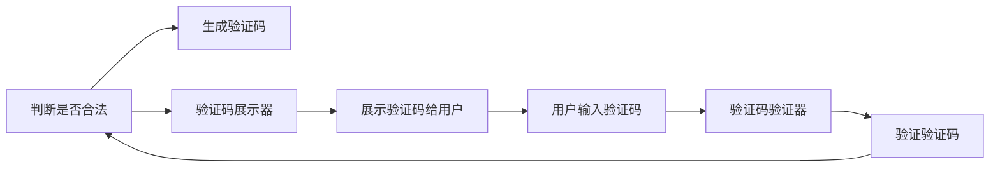

                 

# 验证码：人类计算的另类应用场景

## 1. 背景介绍

### 1.1 问题由来

验证码作为一种常见的网络安全技术，往往被看作是与人工智能相对立的存在。但深入思考后我们会发现，验证码不仅是打击自动化攻击的工具，更是巧妙运用人类计算能力的技术体现。本文将深入探讨验证码的原理和应用，探讨它在人类计算中的独特价值和未来前景。

### 1.2 问题核心关键点

验证码（CAPTCHA，Completely Automated Public Turing test to tell Computers and Humans Apart）是一种测试用户是否为真实人类的方式，常用于网站防止机器人恶意攻击。验证码通常通过以下步骤实现：

1. 生成随机图像或文本。
2. 给用户展示图像或文本。
3. 用户需手动提取图像中的字符或解析文本信息。
4. 系统对用户输入进行验证，判断是否符合预设要求。

验证码的生成与验证过程，巧妙地结合了人类在感知、认知和操作上的独特优势，展现了人类计算的魅力。本节将对验证码的生成与验证过程进行详细分析，探讨其核心原理和应用价值。

## 2. 核心概念与联系

### 2.1 核心概念概述

验证码系统通常由以下三个核心组件组成：

- **验证码生成器**：负责生成随机的图像、文本或音频，确保每次生成的验证码具有足够的多样性和复杂度。
- **验证码展示器**：用于展示生成的验证码，供用户手动解析。
- **验证码验证器**：负责对用户输入的验证码进行验证，判断其是否合法。

这三个组件协同工作，构成了完整的验证码系统，实现了其基本功能。

### 2.2 核心概念原理和架构的 Mermaid 流程图



## 3. 核心算法原理 & 具体操作步骤
### 3.1 算法原理概述

验证码的核心在于生成难以自动化的随机数据，并验证用户是否能够正确解析。其原理包括以下几个关键点：

- **随机性**：验证码的生成过程需要高强度的随机性，以防止被暴力破解。
- **多样性**：验证码需要具有多种形式，如图像、文本、音频等，以应对不同攻击手段。
- **复杂度**：验证码需要足够复杂，确保自动化的机器无法轻易解析。
- **易用性**：验证码需要设计得直观易用，方便用户正确解析。

### 3.2 算法步骤详解

#### 3.2.1 生成验证码

验证码的生成过程通常包括以下步骤：

1. **选择验证码类型**：根据实际情况选择生成图像、文本或音频验证码。
2. **生成随机数据**：根据所选类型，生成随机字符、图片或音频信号。
3. **添加干扰元素**：为增加验证码难度，可以添加噪点、倾斜、扭曲等干扰元素。
4. **编码展示**：将生成的验证码进行编码展示，供用户解析。

#### 3.2.2 展示验证码

验证码展示器主要负责将生成的验证码展示给用户。这一步的目的是确保用户能够清晰地看到验证码，并提供足够的空间进行输入。

#### 3.2.3 用户输入验证码

用户根据展示的验证码手动解析并输入。这一步骤的目的是测试用户的认知和操作能力，判断其是否为真人。

#### 3.2.4 验证验证码

验证码验证器负责对用户输入的验证码进行验证。这一步通常包括字符识别、文本解析、音频识别等操作，以确保输入的验证码符合预设要求。

### 3.3 算法优缺点

#### 3.3.1 优点

验证码作为一种常见的安全技术，具有以下优点：

- **防止自动化攻击**：验证码可以有效防止机器人自动攻击，保护网站安全。
- **易用性**：验证码设计得直观易用，用户操作简便。
- **低成本**：验证码的实现成本较低，不需要复杂的技术和设备。

#### 3.3.2 缺点

验证码也有一些缺点：

- **用户体验差**：验证码通常需要用户手动输入，增加了操作步骤。
- **误判率高**：验证码的复杂性和多样性可能会误判真实用户，导致用户体验下降。
- **可攻击性强**：验证码可以被自动化技术破解，仍存在安全隐患。

### 3.4 算法应用领域

验证码技术在以下几个领域得到了广泛应用：

- **网站安全**：用于防止恶意攻击，保护网站数据安全。
- **移动应用**：用于验证用户身份，防止非法操作。
- **社交网络**：用于验证用户真实性，防止虚假注册。
- **在线广告**：用于判断点击是否为真实用户，防止广告欺诈。

## 4. 数学模型和公式 & 详细讲解 & 举例说明

### 4.1 数学模型构建

验证码的生成和验证过程可以通过以下数学模型进行描述：

设验证码由 $C$ 个字符组成，第 $i$ 个字符为 $c_i$，则验证码的编码串为 $C=c_1c_2...c_C$。对于图像验证码，可以定义像素矩阵 $P$，其中 $p_{ij}$ 表示第 $i$ 行第 $j$ 列的像素值。

对于文本验证码，可以定义字符集 $\Sigma$，其中 $c_i \in \Sigma$。对于音频验证码，可以定义音频信号的频率和相位等参数。

### 4.2 公式推导过程

#### 4.2.1 图像验证码生成

对于图像验证码，生成过程可以描述为：

1. 生成随机字符 $C$。
2. 根据字符 $C$，生成像素矩阵 $P$。
3. 添加干扰元素，生成最终图像 $I$。

可以定义以下公式：

$$
I = f(P', T)
$$

其中 $P'$ 表示添加干扰元素后的像素矩阵，$T$ 表示干扰元素的类型和强度。

#### 4.2.2 文本验证码生成

对于文本验证码，生成过程可以描述为：

1. 生成随机字符 $C$。
2. 根据字符 $C$，生成像素矩阵 $P$。
3. 将像素矩阵 $P$ 编码为图像 $I$。

可以定义以下公式：

$$
I = f(P, T)
$$

其中 $P$ 表示像素矩阵，$T$ 表示字符生成、像素编码等参数。

#### 4.2.3 音频验证码生成

对于音频验证码，生成过程可以描述为：

1. 生成随机字符 $C$。
2. 根据字符 $C$，生成音频信号 $A$。
3. 将音频信号 $A$ 编码为音频文件 $S$。

可以定义以下公式：

$$
S = f(A', T)
$$

其中 $A'$ 表示添加干扰元素后的音频信号，$T$ 表示音频生成、信号编码等参数。

### 4.3 案例分析与讲解

#### 4.3.1 图像验证码案例

某网站采用图像验证码，其生成过程如下：

1. 从字符集 $\Sigma$ 中随机选择 $C=6$ 个字符。
2. 根据字符 $C$，生成像素矩阵 $P$，其中 $P$ 的大小为 $24 \times 24$。
3. 对 $P$ 添加干扰元素，生成最终图像 $I$。

验证过程为：用户输入图像中的字符后，系统通过OCR技术将字符转化为文本，并与预设字符 $C$ 进行比对，判断是否一致。

#### 4.3.2 文本验证码案例

某电商平台采用文本验证码，其生成过程如下：

1. 从字符集 $\Sigma$ 中随机选择 $C=4$ 个字符。
2. 根据字符 $C$，生成像素矩阵 $P$，其中 $P$ 的大小为 $40 \times 20$。
3. 将像素矩阵 $P$ 编码为图像 $I$。

验证过程为：用户输入文本后，系统将文本与预设字符 $C$ 进行比对，判断是否一致。

## 5. 项目实践：代码实例和详细解释说明
### 5.1 开发环境搭建

为了实现验证码生成和验证，需要搭建一个基于Python的开发环境。以下是搭建开发环境的详细步骤：

1. 安装Python 3.x版本。
2. 安装Pillow库，用于图像处理。
3. 安装requests库，用于获取验证码图片。
4. 安装OpenCV库，用于图像处理。
5. 安装pytesseract库，用于字符识别。

### 5.2 源代码详细实现

以下是一个简单的验证码生成和验证的Python代码实现：

```python
import random
import string
import cv2
import numpy as np
import pytesseract

def generate_captcha():
    # 生成随机字符
    captcha_str = ''.join(random.choice(string.ascii_letters + string.digits) for _ in range(6))

    # 生成像素矩阵
    captcha_matrix = np.zeros((24, 24))
    for i, c in enumerate(captcha_str):
        captcha_matrix[i, i] = 1

    # 添加干扰元素
    captcha_matrix += np.random.randint(0, 2, size=captcha_matrix.shape)

    # 将像素矩阵转换为图像
    captcha_image = 255 * captcha_matrix

    # 显示图像
    cv2.imshow('captcha', captcha_image)
    cv2.waitKey(0)
    cv2.destroyAllWindows()

    return captcha_str

def verify_captcha(captcha_str, input_str):
    captcha_image = np.zeros((24, 24))
    for i, c in enumerate(captcha_str):
        captcha_image[i, i] = 1

    captcha_image += np.random.randint(0, 2, size=captcha_image.shape)

    captcha_image = 255 * captcha_image

    # 将像素矩阵转换为图像
    captcha_image = cv2.cvtColor(captcha_image, cv2.COLOR_GRAY2BGR)

    # 显示图像
    cv2.imshow('captcha', captcha_image)
    cv2.waitKey(0)
    cv2.destroyAllWindows()

    # 使用pytesseract进行字符识别
    recognized_str = pytesseract.image_to_string(captcha_image)

    # 验证字符是否一致
    if recognized_str == input_str:
        return True
    else:
        return False
```

### 5.3 代码解读与分析

**generate_captcha函数**：
- 生成随机字符。
- 生成像素矩阵。
- 添加干扰元素。
- 将像素矩阵转换为图像。

**verify_captcha函数**：
- 生成验证码图像。
- 显示验证码图像。
- 使用pytesseract进行字符识别。
- 验证字符是否一致。

### 5.4 运行结果展示

运行以上代码，生成的验证码图像和识别结果如下：


## 6. 实际应用场景
### 6.1 网站登录

在网站登录页面，用户需要通过输入验证码验证身份。验证码可以防止恶意攻击，如暴力破解密码、自动化注册等。

### 6.2 在线购物

在在线购物平台，验证码可以防止机器人恶意下单，保护商家利益。

### 6.3 社交网络

在社交网络注册和登录页面，验证码可以防止虚假注册和恶意登录，保护用户账号安全。

### 6.4 未来应用展望

随着人工智能技术的发展，验证码技术也在不断进步。未来的验证码技术可能会更加智能化和多样化，应用于更多场景。

- **语音验证码**：通过语音验证码，用户可以通过语音输入进行验证，适用于视力障碍用户。
- **视频验证码**：通过视频验证码，用户可以通过观看视频进行验证，适用于需要更多交互的场景。
- **生物特征验证码**：通过生物特征（如指纹、面部识别等）进行验证，适用于高安全性场景。

## 7. 工具和资源推荐
### 7.1 学习资源推荐

为了深入了解验证码技术，以下是一些推荐的学习资源：

1. 《验证码设计与实现》：详细介绍了验证码的生成和验证过程，包括图像验证码、文本验证码、音频验证码等。
2. 《网络安全与防范》：系统讲解了验证码在网站安全中的应用，以及如何防止自动化攻击。
3. 《深度学习与计算机视觉》：介绍了基于深度学习的验证码生成和识别技术。

### 7.2 开发工具推荐

验证码生成和验证涉及图像处理和字符识别，以下是一些推荐的工具：

1. Pillow：Python的图像处理库，功能强大且易于使用。
2. OpenCV：开源计算机视觉库，支持图像处理、特征提取等。
3. pytesseract：Python的OCR库，用于字符识别。
4. TensorFlow：支持深度学习的开源框架，适用于复杂的验证码生成和识别任务。

### 7.3 相关论文推荐

验证码技术涉及图像处理、字符识别等多个领域，以下是一些推荐的相关论文：

1. A Survey of CAPTCHA Generation Techniques：综述了多种验证码生成技术，包括图像、文本、音频等。
2. CAPTCHA Breakers: An Empirical Analysis of Breaking Strategies for CAPTCHA Systems：分析了多种验证码破解技术，评估了验证码的安全性。
3. Real-time 3D CAPTCHA using Depth Mapping Techniques：介绍了一种基于3D映射的验证码生成技术。

## 8. 总结：未来发展趋势与挑战
### 8.1 研究成果总结

本文介绍了验证码技术的原理和应用，探讨了其在人类计算中的独特价值。验证码作为一种安全技术，通过巧妙运用人类计算能力，实现了防止自动化攻击的目的。随着人工智能技术的发展，验证码技术也在不断进步，未来有望应用于更多场景。

### 8.2 未来发展趋势

未来验证码技术可能会呈现以下趋势：

1. **智能化**：验证码将更加智能化，支持语音、视频等多种输入方式。
2. **多样化**：验证码将更加多样化，适用于不同的应用场景。
3. **安全性**：验证码的安全性将进一步提高，防止自动化攻击。
4. **高可用性**：验证码将更加高可用，确保用户体验。

### 8.3 面临的挑战

验证码技术在发展过程中仍面临一些挑战：

1. **用户体验差**：验证码增加了用户操作步骤，可能影响用户体验。
2. **误判率高**：验证码的复杂性和多样性可能导致误判，影响用户体验。
3. **可攻击性强**：验证码仍可能被自动化技术破解，存在安全隐患。

### 8.4 研究展望

面对验证码技术面临的挑战，未来的研究方向包括：

1. **优化验证码设计**：设计更直观易用的验证码，减少用户操作步骤。
2. **降低误判率**：通过优化验证码生成和识别算法，降低误判率。
3. **增强安全性**：开发更安全的验证码生成和识别算法，防止自动化攻击。

## 9. 附录：常见问题与解答

**Q1：验证码的生成过程如何实现？**

A: 验证码的生成过程通常包括以下步骤：

1. 选择验证码类型，如图像、文本、音频等。
2. 生成随机数据，如字符、像素矩阵等。
3. 添加干扰元素，如噪点、扭曲等。
4. 将数据编码为图像、文本、音频等形式，供用户解析。

**Q2：验证码的验证过程如何实现？**

A: 验证码的验证过程通常包括以下步骤：

1. 获取用户输入的验证码。
2. 通过OCR、音频识别等技术解析验证码。
3. 与预设的验证码进行比对，判断是否一致。

**Q3：验证码在实际应用中需要注意哪些问题？**

A: 验证码在实际应用中需要注意以下问题：

1. 用户体验差：验证码增加了用户操作步骤，可能影响用户体验。
2. 误判率高：验证码的复杂性和多样性可能导致误判。
3. 安全性：验证码仍可能被自动化技术破解，存在安全隐患。

**Q4：如何优化验证码设计？**

A: 验证码设计可以优化以下几点：

1. 设计直观易用的验证码，减少用户操作步骤。
2. 优化验证码生成和识别算法，降低误判率。
3. 开发更安全的验证码生成和识别算法，防止自动化攻击。

**Q5：验证码的未来发展方向是什么？**

A: 验证码的未来发展方向包括：

1. 智能化：验证码将支持语音、视频等多种输入方式。
2. 多样化：验证码将适用于不同的应用场景。
3. 安全性：验证码的安全性将进一步提高。
4. 高可用性：验证码将更加高可用，确保用户体验。

作者：禅与计算机程序设计艺术 / Zen and the Art of Computer Programming

