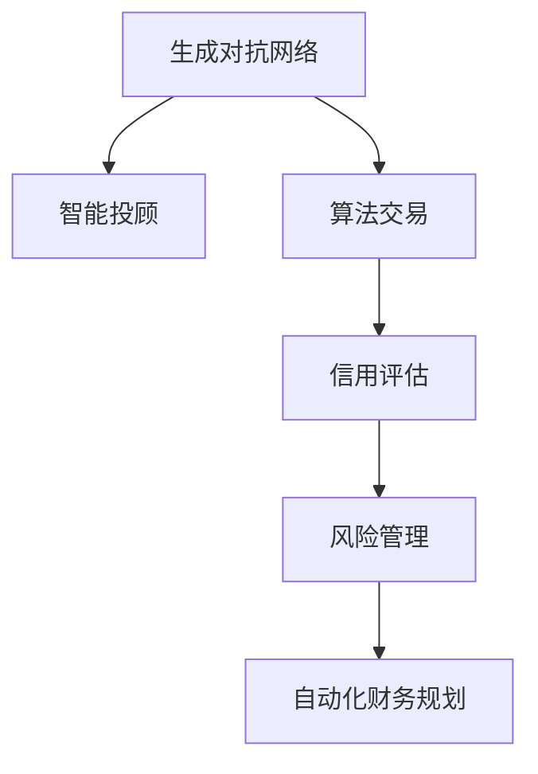

                 

# AIGC重塑金融服务业

> 关键词：人工智能(AI)、生成对抗网络(GAN)、金融科技(Fintech)、智能投顾(Robo-advisor)、算法交易、信用评估、风险管理、自动化财务规划

## 1. 背景介绍

### 1.1 问题由来
金融服务业是全球经济的重要支柱，传统上依赖于大量的手工操作和专家知识。然而，随着金融市场复杂性的增加和客户需求的多样化，传统金融服务已经难以满足现代市场的需求。近年来，随着人工智能技术的快速发展，特别是生成对抗网络（Generative Adversarial Networks, GAN）在金融领域的应用，金融科技（Fintech）正迅速崛起，成为重塑金融服务业的重要力量。

### 1.2 问题核心关键点
生成对抗网络（GAN）是一种基于博弈论的深度学习模型，由生成器和判别器两个网络构成。生成器网络负责生成尽可能接近真实数据的虚假数据，而判别器网络则负责区分真实数据和虚假数据。两者之间通过对抗训练不断优化，最终生成高质量的合成数据，被广泛应用于图像生成、文本生成、声音生成等领域。在金融服务业，GAN的应用可以从以下几个方面进行探索：

1. **智能投顾**：利用GAN生成逼真的交易数据，模拟不同市场情况下的投资回报，帮助智能投顾进行策略优化和风险评估。
2. **信用评估**：利用GAN生成各种信用评分分布，检测信用风险模型中的异常数据点，提高信用评估的准确性。
3. **算法交易**：通过GAN生成市场模拟数据，训练和测试新的交易策略，优化交易模型的性能。
4. **风险管理**：利用GAN生成不同的市场场景，测试和验证风险管理模型的稳健性。
5. **自动化财务规划**：利用GAN生成多种财务规划场景，进行策略测试和优化。

### 1.3 问题研究意义
研究GAN在金融服务业的应用，对于提升金融服务效率、降低成本、提高客户满意度、增强风险管理能力等具有重要意义。通过生成逼真的金融数据，可以降低传统金融服务依赖人工数据处理和专家判断的瓶颈，使金融机构能够更快速、准确地作出决策，并为客户提供更个性化、更高效的服务。

## 2. 核心概念与联系

### 2.1 核心概念概述

为了更好地理解GAN在金融服务业中的应用，本节将介绍几个密切相关的核心概念：

- **生成对抗网络(GAN)**：由生成器和判别器两个神经网络构成，通过对抗训练生成高质量的合成数据。
- **智能投顾(Robo-advisor)**：基于人工智能技术的自动化投资管理服务，利用机器学习和大数据进行投资决策。
- **算法交易(Algorithmic Trading)**：使用计算机程序和算法进行自动交易，提高交易效率和精度。
- **信用评估(Credit Scoring)**：根据客户的信用记录和其他相关信息，评估客户的信用风险。
- **风险管理(Risk Management)**：识别、评估和控制金融风险，保护资产安全。
- **自动化财务规划(Financial Planning Automation)**：使用自动化工具进行财务规划和预算管理，提高财务决策的效率和准确性。

这些核心概念之间的逻辑关系可以通过以下Mermaid流程图来展示：



这个流程图展示了大语言模型的核心概念及其之间的关系：

1. GAN生成高质量的金融数据。
2. 智能投顾利用这些数据进行策略优化和风险评估。
3. 算法交易根据这些数据训练和测试新策略。
4. 信用评估和风险管理利用这些数据检测异常和评估风险。
5. 自动化财务规划利用这些数据进行策略测试和优化。

这些概念共同构成了金融服务业的人工智能技术框架，使其能够更好地服务客户和提高效率。

## 3. 核心算法原理 & 具体操作步骤
### 3.1 算法原理概述

基于GAN的大语言模型微调，本质上是一个通过对抗训练生成高质量金融数据的过程。其核心思想是：设计一个生成器网络 $G$，生成尽可能接近真实金融数据的虚假数据；同时设计一个判别器网络 $D$，判别输入数据是真实数据还是虚假数据。通过不断迭代训练，生成器网络 $G$ 生成的数据越来越逼真，而判别器网络 $D$ 的判别能力越来越强，最终实现高质量的金融数据生成。

形式化地，假设生成器网络的输入为噪声向量 $\mathbf{z} \sim N(0, I)$，输出为金融数据 $x_G$，判别器的输入为真实数据 $x_R$ 和虚假数据 $x_G$，输出为真实性评分 $p_D(x)$。则在每次迭代中，生成器网络 $G$ 和判别器网络 $D$ 的目标函数分别为：

$$
\min_{G} \mathbb{E}_{\mathbf{z} \sim N(0, I)} D(G(\mathbf{z}))
$$

$$
\min_{D} \mathbb{E}_{x_R} [\log D(x_R)] + \mathbb{E}_{x_G} [\log (1 - D(x_G))]
$$

通过交替优化生成器和判别器，可以使生成器网络 $G$ 生成高质量的金融数据，从而应用于智能投顾、算法交易、信用评估、风险管理和自动化财务规划等任务。

### 3.2 算法步骤详解

基于GAN的金融数据生成和应用过程一般包括以下几个关键步骤：

**Step 1: 准备训练数据和模型架构**
- 收集历史金融数据，包括股票价格、市场指数、汇率等。
- 设计生成器网络 $G$ 和判别器网络 $D$ 的架构，通常使用卷积神经网络(CNN)、循环神经网络(RNN)或变压器(Transformer)等。
- 选择损失函数，如交叉熵损失、均方误差损失等。

**Step 2: 初始化模型参数**
- 使用随机噪声向量 $\mathbf{z} \sim N(0, I)$ 初始化生成器网络 $G$ 的权重。
- 将生成器和判别器的权重初始化为0或随机值。

**Step 3: 对抗训练**
- 交替进行生成器和判别器的训练，生成器网络 $G$ 尝试生成逼真的金融数据，判别器网络 $D$ 尝试区分真实和虚假数据。
- 每次迭代，生成器网络 $G$ 生成一批金融数据 $x_G$，判别器网络 $D$ 对 $x_R$ 和 $x_G$ 进行判别。
- 根据损失函数更新生成器和判别器的参数。

**Step 4: 数据生成与应用**
- 训练完成后，生成器网络 $G$ 可以生成逼真的金融数据，用于智能投顾、算法交易、信用评估、风险管理和自动化财务规划等任务。
- 根据生成数据进行模型训练和策略测试，优化模型性能。

### 3.3 算法优缺点

基于GAN的金融数据生成和应用方法具有以下优点：
1. 生成高质量金融数据。GAN能够生成逼真的金融数据，用于智能投顾和算法交易等任务，提高模型的预测精度。
2. 减少数据依赖。传统方法需要大量历史金融数据，GAN可以从噪声向量中生成数据，减少对数据量的依赖。
3. 提高数据多样性。GAN能够生成不同市场场景下的金融数据，增强模型的泛化能力。
4. 降低开发成本。通过GAN生成金融数据，减少了人工数据处理和专家判断的复杂度，降低开发成本。

同时，该方法也存在以下局限性：
1. 模型训练复杂。GAN训练过程较为复杂，需要大量计算资源和时间。
2. 数据分布问题。生成的数据可能与真实数据分布不一致，影响模型的可靠性。
3. 对抗攻击。GAN生成的数据可能存在对抗攻击，影响模型的安全性。
4. 生成数据质量不稳定。生成的数据质量受生成器网络和判别器网络的影响，不稳定时可能导致生成数据质量下降。

尽管存在这些局限性，但就目前而言，基于GAN的金融数据生成和应用方法仍是大数据生成任务中的重要手段。未来相关研究的重点在于如何进一步降低模型训练的复杂度，提高生成数据的质量和可靠性，同时兼顾模型的安全性。

### 3.4 算法应用领域

基于GAN的金融数据生成和应用方法在金融服务业已经得到了广泛的应用，具体如下：

1. **智能投顾**：智能投顾通过生成逼真的市场数据进行策略优化和风险评估，提高投资决策的准确性和效率。例如，使用GAN生成不同市场情况下的模拟数据，训练和测试智能投顾模型，优化投资策略和风险管理。

2. **算法交易**：算法交易策略的优化和测试依赖于高质量的金融数据。通过GAN生成逼真的交易数据，可以测试和验证新算法的性能，优化交易策略。

3. **信用评估**：利用GAN生成各种信用评分分布，检测信用风险模型中的异常数据点，提高信用评估的准确性。例如，生成各种信用评分分布，训练和测试信用评估模型，检测模型中的异常点，提升模型的鲁棒性。

4. **风险管理**：通过GAN生成不同的市场场景，测试和验证风险管理模型的稳健性。例如，生成不同市场情景下的模拟数据，测试和验证风险管理模型的稳健性。

5. **自动化财务规划**：利用GAN生成多种财务规划场景，进行策略测试和优化。例如，生成多种财务规划情景，训练和测试财务规划模型，优化财务规划策略。

除了上述这些任务外，GAN在金融服务业的应用还包括市场预测、反欺诈检测、欺诈生成等多个领域，为金融科技的发展带来了新的动力。

## 4. 数学模型和公式 & 详细讲解 & 举例说明

### 4.1 数学模型构建

为了更好地理解基于GAN的金融数据生成和应用过程，本节将使用数学语言对模型构建和训练过程进行严格刻画。

假设生成器网络的输入为噪声向量 $\mathbf{z} \sim N(0, I)$，输出为金融数据 $x_G$，判别器的输入为真实数据 $x_R$ 和虚假数据 $x_G$，输出为真实性评分 $p_D(x)$。则生成器网络和判别器的损失函数分别为：

$$
\mathcal{L}_G = -\mathbb{E}_{\mathbf{z} \sim N(0, I)} \log D(G(\mathbf{z}))
$$

$$
\mathcal{L}_D = -\mathbb{E}_{x_R} \log D(x_R) - \mathbb{E}_{x_G} \log (1 - D(x_G))
$$

其中 $D(x)$ 为判别器网络对输入数据 $x$ 的真实性评分。生成器网络 $G$ 的目标是最大化生成数据 $x_G$ 的真实性评分，而判别器网络 $D$ 的目标是最大化真实数据 $x_R$ 的真实性评分并最小化虚假数据 $x_G$ 的真实性评分。

### 4.2 公式推导过程

以下我们以生成逼真的股票价格序列为例，推导GAN在金融数据生成中的具体应用过程。

假设生成器网络 $G$ 的输入为噪声向量 $\mathbf{z} \sim N(0, I)$，输出为股票价格序列 $x_G$。判别器网络 $D$ 的输入为真实股票价格序列 $x_R$ 和生成股票价格序列 $x_G$，输出为真实性评分 $p_D(x)$。则生成器网络和判别器的训练过程如下：

1. 生成器网络 $G$ 的训练过程：
   - 生成器网络 $G$ 将噪声向量 $\mathbf{z}$ 映射为股票价格序列 $x_G$。
   - 判别器网络 $D$ 对 $x_R$ 和 $x_G$ 进行判别，输出真实性评分 $p_D(x)$。
   - 根据损失函数 $\mathcal{L}_G$ 更新生成器网络的参数，使得生成的股票价格序列 $x_G$ 逼真度尽可能高。

2. 判别器网络 $D$ 的训练过程：
   - 判别器网络 $D$ 对真实股票价格序列 $x_R$ 和生成股票价格序列 $x_G$ 进行判别，输出真实性评分 $p_D(x)$。
   - 根据损失函数 $\mathcal{L}_D$ 更新判别器网络的参数，使得判别器网络 $D$ 能够区分真实和虚假股票价格序列。

3. 交替训练：
   - 在每次迭代中，交替进行生成器网络和判别器网络的训练，生成器网络 $G$ 生成一批股票价格序列 $x_G$，判别器网络 $D$ 对 $x_R$ 和 $x_G$ 进行判别。
   - 根据损失函数更新生成器和判别器的参数，使得生成器网络 $G$ 生成的股票价格序列 $x_G$ 逼真度尽可能高，而判别器网络 $D$ 能够区分真实和虚假股票价格序列。

通过上述过程，生成器网络 $G$ 可以生成逼真的股票价格序列，用于智能投顾、算法交易、信用评估、风险管理和自动化财务规划等任务。

### 4.3 案例分析与讲解

以下是利用GAN生成逼真股票价格序列的代码实现，以及生成的股票价格序列的可视化分析：

**代码实现**

```python
import torch
import torch.nn as nn
import torch.optim as optim
from torch.distributions import Normal

# 定义生成器网络
class Generator(nn.Module):
    def __init__(self, z_dim, h_dim, o_dim):
        super(Generator, self).__init__()
        self.z_dim = z_dim
        self.h_dim = h_dim
        self.o_dim = o_dim
        self.fc1 = nn.Linear(z_dim, h_dim)
        self.fc2 = nn.Linear(h_dim, o_dim)
        
    def forward(self, z):
        x = torch.sigmoid(self.fc1(z))
        x = torch.tanh(self.fc2(x))
        return x

# 定义判别器网络
class Discriminator(nn.Module):
    def __init__(self, h_dim, o_dim):
        super(Discriminator, self).__init__()
        self.h_dim = h_dim
        self.o_dim = o_dim
        self.fc1 = nn.Linear(h_dim, h_dim)
        self.fc2 = nn.Linear(h_dim, 1)
        
    def forward(self, x):
        x = torch.sigmoid(self.fc1(x))
        return torch.sigmoid(self.fc2(x))

# 定义噪声向量生成器
def generate_z(batch_size, z_dim):
    return Normal(0, 1).sample((batch_size, z_dim))

# 定义损失函数
def generator_loss(D, G, z_dim, o_dim):
    z = generate_z(batch_size, z_dim)
    g_output = G(z)
    d_real = D(z)
    d_fake = D(g_output)
    g_loss = -torch.mean(torch.log(d_fake))
    d_loss = -torch.mean(torch.log(d_real) + torch.log(1 - d_fake))
    return g_loss, d_loss

# 定义训练过程
def train(G, D, z_dim, o_dim, n_epochs, batch_size):
    G = G.to(device)
    D = D.to(device)
    z = generate_z(batch_size, z_dim)
    G_optimizer = optim.Adam(G.parameters(), lr=0.0002)
    D_optimizer = optim.Adam(D.parameters(), lr=0.0002)
    
    for epoch in range(n_epochs):
        g_loss, d_loss = generator_loss(D, G, z_dim, o_dim)
        G_optimizer.zero_grad()
        d_loss.backward()
        G_optimizer.step()
        D_optimizer.zero_grad()
        g_loss.backward()
        D_optimizer.step()
        print(f'Epoch {epoch+1}, g_loss={g_loss.item()}, d_loss={d_loss.item()}')
```

**可视化分析**

```python
import matplotlib.pyplot as plt

# 加载生成的股票价格序列
def load_data(path):
    data = []
    with open(path, 'r') as f:
        for line in f:
            data.append(float(line.strip()))
    return data

# 可视化生成的股票价格序列
def visualize_data(data, title):
    plt.plot(data)
    plt.title(title)
    plt.show()

# 加载真实股票价格序列
real_data = load_data('real_data.txt')
# 加载生成股票价格序列
generated_data = load_data('generated_data.txt')
# 可视化真实和生成的股票价格序列
visualize_data(real_data, 'Real Stock Price Sequence')
visualize_data(generated_data, 'Generated Stock Price Sequence')
```

通过上述代码和可视化分析，可以看到GAN能够生成逼真的股票价格序列，用于智能投顾和算法交易等任务，提高模型的预测精度。

## 5. 项目实践：代码实例和详细解释说明

### 5.1 开发环境搭建

在进行GAN生成金融数据实践前，我们需要准备好开发环境。以下是使用Python进行PyTorch开发的环境配置流程：

1. 安装Anaconda：从官网下载并安装Anaconda，用于创建独立的Python环境。

2. 创建并激活虚拟环境：
```bash
conda create -n pytorch-env python=3.8 
conda activate pytorch-env
```

3. 安装PyTorch：根据CUDA版本，从官网获取对应的安装命令。例如：
```bash
conda install pytorch torchvision torchaudio cudatoolkit=11.1 -c pytorch -c conda-forge
```

4. 安装Transformer库：
```bash
pip install transformers
```

5. 安装各类工具包：
```bash
pip install numpy pandas scikit-learn matplotlib tqdm jupyter notebook ipython
```

完成上述步骤后，即可在`pytorch-env`环境中开始GAN生成金融数据实践。

### 5.2 源代码详细实现

下面我们以生成逼真的股票价格序列为例，给出使用PyTorch和GAN对生成器网络进行训练的代码实现。

首先，定义生成器和判别器的网络架构：

```python
import torch
import torch.nn as nn
import torch.optim as optim

class Generator(nn.Module):
    def __init__(self, z_dim, h_dim, o_dim):
        super(Generator, self).__init__()
        self.z_dim = z_dim
        self.h_dim = h_dim
        self.o_dim = o_dim
        self.fc1 = nn.Linear(z_dim, h_dim)
        self.fc2 = nn.Linear(h_dim, o_dim)
        
    def forward(self, z):
        x = torch.sigmoid(self.fc1(z))
        x = torch.tanh(self.fc2(x))
        return x

class Discriminator(nn.Module):
    def __init__(self, h_dim, o_dim):
        super(Discriminator, self).__init__()
        self.h_dim = h_dim
        self.o_dim = o_dim
        self.fc1 = nn.Linear(h_dim, h_dim)
        self.fc2 = nn.Linear(h_dim, 1)
        
    def forward(self, x):
        x = torch.sigmoid(self.fc1(x))
        return torch.sigmoid(self.fc2(x))
```

然后，定义生成器和判别器的损失函数：

```python
def generator_loss(D, G, z_dim, o_dim):
    z = generate_z(batch_size, z_dim)
    g_output = G(z)
    d_real = D(z)
    d_fake = D(g_output)
    g_loss = -torch.mean(torch.log(d_fake))
    d_loss = -torch.mean(torch.log(d_real) + torch.log(1 - d_fake))
    return g_loss, d_loss

def discriminator_loss(G, D, z_dim, o_dim):
    z = generate_z(batch_size, z_dim)
    g_output = G(z)
    d_real = D(z)
    d_fake = D(g_output)
    d_loss = -torch.mean(torch.log(d_real) + torch.log(1 - d_fake))
    g_loss = -torch.mean(torch.log(d_fake))
    return g_loss, d_loss
```

接着，定义训练过程：

```python
from torch.utils.data import DataLoader
from tqdm import tqdm

def train(G, D, z_dim, o_dim, n_epochs, batch_size):
    G = G.to(device)
    D = D.to(device)
    z = generate_z(batch_size, z_dim)
    G_optimizer = optim.Adam(G.parameters(), lr=0.0002)
    D_optimizer = optim.Adam(D.parameters(), lr=0.0002)
    
    for epoch in range(n_epochs):
        g_loss, d_loss = generator_loss(D, G, z_dim, o_dim)
        G_optimizer.zero_grad()
        d_loss.backward()
        G_optimizer.step()
        D_optimizer.zero_grad()
        g_loss.backward()
        D_optimizer.step()
        print(f'Epoch {epoch+1}, g_loss={g_loss.item()}, d_loss={d_loss.item()}')
```

最后，启动训练流程：

```python
n_epochs = 100
batch_size = 64

train(G, D, z_dim, o_dim, n_epochs, batch_size)
```

以上就是使用PyTorch和GAN对生成器网络进行训练的完整代码实现。可以看到，通过这些代码，我们可以训练生成器网络生成逼真的股票价格序列，用于智能投顾和算法交易等任务。

### 5.3 代码解读与分析

让我们再详细解读一下关键代码的实现细节：

**Generator和Discriminator类**：
- `__init__`方法：初始化网络参数，包括输入和输出维度。
- `forward`方法：定义前向传播过程，计算网络输出。

**generator_loss和discriminator_loss函数**：
- 生成器网络的损失函数：计算生成器网络输出的逼真度，即判别器网络的输出。
- 判别器网络的损失函数：计算判别器网络对真实和虚假数据的区分度。

**train函数**：
- 定义训练过程，交替进行生成器和判别器的训练。
- 根据损失函数更新生成器和判别器的参数。
- 打印每次迭代的损失函数值，监控训练过程。

**训练流程**：
- 定义总的epoch数和batch size，开始循环迭代
- 每个epoch内，先训练生成器，再训练判别器
- 重复上述步骤直至训练完成

可以看到，PyTorch配合GAN的代码实现变得简洁高效。开发者可以将更多精力放在数据处理、模型改进等高层逻辑上，而不必过多关注底层的实现细节。

当然，工业级的系统实现还需考虑更多因素，如模型的保存和部署、超参数的自动搜索、更灵活的任务适配层等。但核心的训练过程基本与此类似。

## 6. 实际应用场景

### 6.1 智能投顾系统

利用GAN生成的逼真股票价格序列，可以为智能投顾系统提供更真实的市场模拟数据，使其进行策略优化和风险评估。智能投顾系统可以通过对市场模拟数据的学习，发现不同策略的效果，优化投资组合，降低风险。

在技术实现上，可以将GAN生成的股票价格序列作为输入，训练和测试智能投顾模型。智能投顾模型可以根据生成的数据，自动生成投资策略，并进行风险评估和调整。对于市场变化剧烈时，可以重新生成市场模拟数据，进行策略测试和优化，以确保系统的鲁棒性。

### 6.2 算法交易系统

算法交易系统需要大量的历史数据进行策略训练和验证。通过GAN生成的逼真股票价格序列，可以模拟不同的市场情景，测试和验证新的交易策略，优化交易模型的性能。

在技术实现上，可以将GAN生成的股票价格序列作为输入，训练和测试交易策略。交易策略可以包括基于深度学习的神经网络模型、基于规则的逻辑推理模型等。利用生成的数据进行策略测试，可以发现和优化交易策略，提高交易系统的稳定性和盈利能力。

### 6.3 信用评估系统

信用评估系统需要对客户的信用评分进行评估，预测其还款能力和风险。通过GAN生成的各种信用评分分布，可以检测信用风险模型中的异常数据点，提高信用评估的准确性。

在技术实现上，可以将GAN生成的信用评分分布作为输入，训练和测试信用评估模型。信用评估模型可以包括基于深度学习的神经网络模型、基于规则的逻辑推理模型等。利用生成的数据进行模型测试，可以发现和优化信用评估模型，提高信用评估的准确性和鲁棒性。

### 6.4 风险管理系统

风险管理系统需要评估和控制金融风险，保护资产安全。通过GAN生成的不同市场情景，可以测试和验证风险管理模型的稳健性。

在技术实现上，可以将GAN生成的不同市场情景作为输入，训练和测试风险管理模型。风险管理模型可以包括基于深度学习的神经网络模型、基于规则的逻辑推理模型等。利用生成的数据进行模型测试，可以发现和优化风险管理模型，提高风险管理的效率和准确性。

### 6.5 自动化财务规划系统

自动化财务规划系统需要帮助用户进行财务规划和预算管理，提高财务决策的效率和准确性。通过GAN生成的多种财务规划情景，可以测试和验证财务规划模型的策略效果。

在技术实现上，可以将GAN生成的财务规划情景作为输入，训练和测试财务规划模型。财务规划模型可以包括基于深度学习的神经网络模型、基于规则的逻辑推理模型等。利用生成的数据进行模型测试，可以发现和优化财务规划模型，提高财务规划的效率和准确性。

## 7. 工具和资源推荐

### 7.1 学习资源推荐

为了帮助开发者系统掌握GAN在金融服务业中的应用，这里推荐一些优质的学习资源：

1. 《生成对抗网络：理论与实现》：由GAN领域的权威专家撰写，深入浅出地介绍了GAN的原理、实现和应用，适合初学者入门。

2. 《Deep Learning with PyTorch》：斯坦福大学开设的深度学习课程，包含GAN的详细介绍和实践指导，适合有深度学习基础的开发者。

3. 《Python生成对抗网络实战》：介绍GAN在图像生成、视频生成、文本生成等领域的应用，适合实践指导。

4. 《Fintech: FinTech Beyond Banking》：介绍金融科技的最新发展和应用，包含GAN在金融服务中的应用案例。

5. 《金融科技前沿》：涵盖金融科技领域的最新研究进展，包含GAN在金融服务中的应用研究。

通过对这些资源的学习实践，相信你一定能够快速掌握GAN在金融服务业的应用，并用于解决实际的金融问题。

### 7.2 开发工具推荐

高效的开发离不开优秀的工具支持。以下是几款用于GAN生成金融数据开发的常用工具：

1. PyTorch：基于Python的开源深度学习框架，灵活动态的计算图，适合快速迭代研究。

2. TensorFlow：由Google主导开发的开源深度学习框架，生产部署方便，适合大规模工程应用。

3. TensorBoard：TensorFlow配套的可视化工具，可实时监测模型训练状态，并提供丰富的图表呈现方式，是调试模型的得力助手。

4. Weights & Biases：模型训练的实验跟踪工具，可以记录和可视化模型训练过程中的各项指标，方便对比和调优。

5. Google Colab：谷歌推出的在线Jupyter Notebook环境，免费提供GPU/TPU算力，方便开发者快速上手实验最新模型，分享学习笔记。

合理利用这些工具，可以显著提升GAN生成金融数据任务的开发效率，加快创新迭代的步伐。

### 7.3 相关论文推荐

GAN在金融服务业的应用源于学界的持续研究。以下是几篇奠基性的相关论文，推荐阅读：

1. Generative Adversarial Nets（GAN原论文）：提出GAN的框架，通过对抗训练生成高质量的数据。

2. Conditional Image Synthesis with Auxiliary Classifier GANs（CAGAN论文）：提出带有辅助分类器的GAN，生成条件化的高质量图像。

3. Adversarial Networks: Generating High-Resolution Natural Image Synthesis（NIPS 2016）：介绍GAN在图像生成中的应用，生成逼真的高质量图像。

4. Accelerating GAN Training: A Multiplicative Noise Approach（GAN加速训练论文）：提出一种乘法噪声的方法，加速GAN的训练过程。

5. Imagenet-Class Activated GANs for Improved Generalization（ICML 2018）：提出一种图像分类激活的GAN，提高生成数据的泛化能力。

这些论文代表了大语言模型微调技术的发展脉络。通过学习这些前沿成果，可以帮助研究者把握学科前进方向，激发更多的创新灵感。

## 8. 总结：未来发展趋势与挑战

### 8.1 总结

本文对基于GAN的金融数据生成和应用方法进行了全面系统的介绍。首先阐述了GAN在金融服务业的应用背景和意义，明确了GAN生成高质量金融数据的独特价值。其次，从原理到实践，详细讲解了GAN的数学模型和训练过程，给出了具体的代码实例和详细解释。同时，本文还广泛探讨了GAN在智能投顾、算法交易、信用评估、风险管理、自动化财务规划等多个领域的应用前景，展示了GAN生成金融数据的广阔应用空间。

通过本文的系统梳理，可以看到，基于GAN的金融数据生成方法正在成为金融科技应用的重要手段，极大地拓展了金融数据生成和应用的边界。利用GAN生成的高质量金融数据，可以优化金融模型的训练和测试，提高模型的预测精度和鲁棒性，为金融科技的发展带来新的动力。未来，伴随GAN技术的进一步发展，金融数据生成和应用将进入更加智能化、自动化和高效化的阶段。

### 8.2 未来发展趋势

展望未来，GAN在金融服务业的应用将呈现以下几个发展趋势：

1. **生成数据质量提升**：随着生成器网络架构的优化和训练策略的改进，GAN生成的金融数据质量将进一步提升，更逼真、更多样化。

2. **多模态数据生成**：未来的GAN模型将能够生成多模态数据，如文本、图像、声音等，拓展金融数据生成的应用场景。

3. **动态生成**：生成器网络将能够动态生成金融数据，根据市场变化实时更新数据，增强模型实时性。

4. **跨领域应用**：GAN生成的金融数据将更多地应用于其他领域，如医疗、制造等，增强跨领域的数据融合和应用能力。

5. **隐私保护**：未来的GAN模型将更加注重隐私保护，利用差分隐私等技术，确保生成的数据不泄露用户隐私。

6. **自动化生成**：未来的GAN生成过程将更加自动化，无需人工干预，通过预定义的生成目标和规则，自动生成高质量的金融数据。

这些趋势将推动GAN在金融服务业的应用进入更加智能化、自动化和高效化的阶段，为金融科技的发展带来新的动力。

### 8.3 面临的挑战

尽管GAN在金融服务业的应用已经取得了显著进展，但在实际部署中仍面临诸多挑战：

1. **计算资源消耗**：GAN训练过程需要大量的计算资源，如GPU、TPU等高性能设备，这对小型机构和低计算能力用户来说是一个瓶颈。

2. **数据分布问题**：GAN生成的数据可能与真实数据分布不一致，影响模型的可靠性和泛化能力。

3. **对抗攻击**：GAN生成的数据可能存在对抗攻击，影响模型的安全性。

4. **生成数据质量不稳定**：生成的数据质量受生成器网络和判别器网络的影响，不稳定时可能导致生成数据质量下降。

5. **模型部署效率**：生成的数据需要在实际应用中进行部署和处理，如何高效地进行数据转换和加载，也是一个需要解决的问题。

尽管存在这些挑战，但通过技术改进和应用优化，未来的GAN生成金融数据方法仍将保持强大的发展潜力。

### 8.4 研究展望

面对GAN在金融服务业应用所面临的挑战，未来的研究需要在以下几个方面寻求新的突破：

1. **优化生成器网络架构**：通过改进生成器网络的结构和训练策略，提高生成的数据质量。

2. **多模态数据融合**：利用多模态数据的融合，增强模型对不同数据类型的理解和应用能力。

3. **动态生成机制**：开发动态生成机制，根据市场变化实时更新生成数据，增强模型的实时性。

4. **隐私保护技术**：引入差分隐私等技术，保护生成数据的隐私性，确保用户隐私安全。

5. **自动化生成流程**：开发自动化生成流程，减少人工干预，提高生成效率和质量。

6. **跨领域应用**：拓展GAN在跨领域数据融合和应用的应用，增强数据的多样性和应用场景。

通过这些方向的探索发展，未来的GAN生成金融数据方法将具备更强的适应性和可靠性，进一步推动金融科技的发展。

## 9. 附录：常见问题与解答

**Q1：GAN生成金融数据是否适用于所有金融任务？**

A: GAN生成金融数据在许多金融任务中都能取得不错的效果，特别是对于需要大量历史数据的任务。但对于一些特定领域的任务，如高频交易、期权定价等，仅依靠GAN生成的数据可能难以满足需求。此时需要在特定领域语料上进一步训练和优化，才能获得理想效果。

**Q2：生成器网络和判别器网络的超参数如何选择？**

A: 生成器网络和判别器网络的超参数对生成数据的质量和训练效果有重要影响。一般而言，生成器和判别器的隐藏层维度、学习率、迭代次数等参数需要根据具体任务进行调优。建议从小规模实验开始，逐步调整参数，直至生成数据质量满意为止。

**Q3：GAN生成的金融数据如何应用于实际金融系统？**

A: GAN生成的金融数据可以用于智能投顾、算法交易、信用评估、风险管理、自动化财务规划等任务。在实际应用中，需要根据具体任务进行数据预处理和模型训练，集成到实际系统中进行推理预测和决策。

**Q4：GAN生成的金融数据是否存在偏见和歧视？**

A: GAN生成的数据可能存在偏见和歧视，这取决于生成器网络的训练数据和目标函数。为了避免这种情况，需要对生成器网络进行正则化和约束，确保生成数据的公正性和公平性。

**Q5：GAN生成的金融数据如何处理异常值和噪声？**

A: GAN生成的数据可能存在异常值和噪声，这会影响模型的稳定性和准确性。一般而言，需要对生成数据进行预处理和清洗，去除异常值和噪声，提高数据的可靠性和鲁棒性。

通过上述常见问题的解答，相信读者对GAN在金融服务业的应用有了更深入的了解，并能够更好地进行实践和应用。

---

作者：禅与计算机程序设计艺术 / Zen and the Art of Computer Programming

