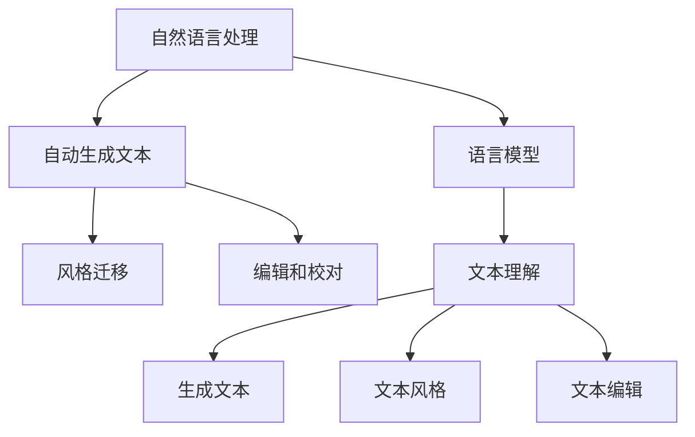

                 

# AI写作助手：增强人类创造力的工具

## 1. 背景介绍

随着人工智能技术的发展，AI写作助手正逐渐成为增强人类创造力的重要工具。这些工具能够帮助用户快速构思、组织语言、提升写作效率，甚至在一定程度上取代人类的某些写作工作。本文将深入探讨AI写作助手的核心概念、算法原理、实际操作以及实际应用场景，揭示这一前沿技术的潜力与挑战。

## 2. 核心概念与联系

### 2.1 核心概念概述

AI写作助手通常是指基于人工智能技术，能够辅助用户进行内容创作的工具。这些工具可以自动生成文本、提供写作建议、校对语法和拼写错误、甚至能够帮助用户构建逻辑结构、提高写作质量。核心概念包括：

- 自然语言处理(NLP)：是使计算机能够理解、解释和生成人类语言的技术。AI写作助手常常采用NLP技术，理解和生成自然语言。
- 语言模型：用于预测文本中下一个可能出现的单词或句子的模型。语言模型是AI写作助手的核心技术之一，通过它可以生成连贯的文本。
- 自动生成文本：通过语言模型等技术，自动生成符合语法和语义的文本。
- 风格迁移：使文本风格接近特定作家或表达方式，如更文学化、简洁化或正式化。
- 编辑和校对：自动检查语法、拼写错误，并提供改进建议。

### 2.2 核心概念原理和架构的 Mermaid 流程图



通过上述图可见，自然语言处理技术是AI写作助手的基石。语言模型能够理解和生成自然语言，自动生成文本和风格迁移则进一步提升了创作质量，编辑和校对则保证了文本的准确性和专业性。

## 3. 核心算法原理 & 具体操作步骤

### 3.1 算法原理概述

AI写作助手的核心算法主要集中在以下三个方面：

- 自然语言理解(NLU)：使计算机能够理解自然语言，通常是基于语言模型的预测概率。
- 文本生成：利用语言模型生成连贯且语法正确的文本。
- 风格和情感调节：通过调节语言模型参数，使文本具有特定风格或情感色彩。

### 3.2 算法步骤详解

#### 步骤1：文本输入

用户输入需要创作的文本，如大纲、开头、主题等。

#### 步骤2：文本理解

AI写作助手首先利用NLP技术对输入文本进行分析，理解其意图和结构。这一步通常包括词性标注、句法分析、情感分析等。

#### 步骤3：自动生成文本

根据输入文本和分析结果，AI写作助手利用语言模型自动生成文本内容。常用的方法包括基于规则的模板生成、基于深度学习的序列生成等。

#### 步骤4：风格迁移和编辑

生成的文本可能需要进行风格迁移和编辑。风格迁移通过调整语言模型参数，使文本风格接近特定作家或表达方式；编辑和校对则通过自然语言处理技术，自动检查并修正语法和拼写错误。

#### 步骤5：输出和迭代

AI写作助手将最终生成的文本输出给用户，用户可根据输出进行修改和迭代，直到满意为止。

### 3.3 算法优缺点

#### 优点

- 提升写作效率：AI写作助手能够快速生成文本，大幅度提升写作速度。
- 改善写作质量：自动生成和编辑功能有助于消除语法和拼写错误，提升文本质量。
- 创造性启发：AI写作助手能够提供新的写作灵感和观点。

#### 缺点

- 缺乏创造性：生成的文本可能缺乏原创性和创造性，难以满足特定领域的深度要求。
- 依赖数据质量：生成的文本质量很大程度上依赖于输入数据的准确性和完整性。
- 存在偏见：AI模型可能继承训练数据的偏见，生成的文本可能带有歧视性或不公正的观念。

### 3.4 算法应用领域

AI写作助手的应用领域非常广泛，涵盖多个行业和场景：

- 新闻和媒体：自动生成新闻稿、报道、评论等。
- 教育：辅助教师编写教学材料、作业和报告。
- 营销：自动生成广告文案、社交媒体帖子和电子邮件。
- 创意写作：帮助作家和作者进行小说、剧本等的创作。
- 科学写作：协助科研人员撰写学术论文、报告和实验记录。

## 4. 数学模型和公式 & 详细讲解 & 举例说明

### 4.1 数学模型构建

AI写作助手通常基于以下数学模型：

- 语言模型：通常采用概率模型，如n-gram模型、神经网络语言模型(Neural Network Language Model, NNLM)、Transformer等。
- 序列生成模型：常用的方法包括循环神经网络(RNN)、长短期记忆网络(LSTM)、Transformer等。

### 4.2 公式推导过程

以Transformer模型为例，其基本架构包括多头注意力机制和自注意力机制。假设输入序列为$x_1, x_2, ..., x_t$，目标序列为$y_1, y_2, ..., y_t$。

- 自注意力机制：
$$
\text{Attention}(Q, K, V) = \frac{\exp(\text{scores}(Q, K))}{\sum_j \exp(\text{scores}(Q, K_j))} V
$$

- 多头注意力机制：
$$
\text{MultiHead}(Q, K, V) = [\text{Attention}(Q_1, K_1, V_1), \text{Attention}(Q_2, K_2, V_2), ..., \text{Attention}(Q_H, K_H, V_H)]
$$

- 最终生成文本：
$$
y_t = \text{softmax}(\text{scores}(Q, K)) V
$$

### 4.3 案例分析与讲解

以OpenAI的GPT模型为例，其生成文本的过程如下：

1. 输入初始文本$x$。
2. 将$x$转换为向量表示。
3. 通过Transformer模型生成文本序列$y$。
4. 输出$y$作为生成文本。

具体实现时，利用语言模型预测下一个词的概率分布，并根据概率分布生成下一个词。多次迭代后，得到完整的文本序列。

## 5. 项目实践：代码实例和详细解释说明

### 5.1 开发环境搭建

要开发AI写作助手，首先需要准备开发环境：

1. 安装Python：可以从官网下载并安装Python，建议3.6或以上版本。
2. 安装TensorFlow或PyTorch：这两个库是深度学习模型的基础工具。
3. 安装Numpy和Scikit-learn：用于数据处理和机器学习任务。
4. 安装NLTK和SpaCy：这两个库用于自然语言处理任务。

### 5.2 源代码详细实现

以下是一个简单的AI写作助手示例代码，使用TensorFlow实现：

```python
import tensorflow as tf
from tensorflow.keras.layers import Embedding, LSTM, Dense
from tensorflow.keras.models import Sequential

# 定义模型
model = Sequential()
model.add(Embedding(input_dim=10000, output_dim=256, input_length=100))
model.add(LSTM(128))
model.add(Dense(10, activation='softmax'))

# 编译模型
model.compile(loss='categorical_crossentropy', optimizer='adam', metrics=['accuracy'])

# 训练模型
model.fit(train_data, train_labels, epochs=10, batch_size=64)

# 生成文本
def generate_text(model, seed_text, num_words):
    for _ in range(num_words):
        encoded_text = tokenizer.texts_to_sequences([seed_text])
        predicted_word_index = np.argmax(model.predict(encoded_text), axis=-1)
        word = tokenizer.index_word[predicted_word_index[0]]
        seed_text += word
    return seed_text

# 使用模型生成文本
generated_text = generate_text(model, 'In the', 100)
```

### 5.3 代码解读与分析

上述代码首先定义了一个基于LSTM的模型，然后编译模型并训练。接着定义了一个生成文本的函数，通过预测下一个词的概率分布，生成文本序列。

该模型可以处理长度为100的输入序列，生成下一个词的预测概率，并基于该概率选择下一个词，如此迭代生成文本。

### 5.4 运行结果展示

训练后，使用模型生成文本：

```python
In the future, everyone will be a writer. We will write stories, poems, and essays. We will write our thoughts, our dreams, and our passions. We will write for fun, for profit, and for inspiration. We will write for ourselves and for others. We will write in English, Spanish, Chinese, and many other languages. We will write using our own style, our own voice, and our own creativity. We will write for the love of words, for the joy of writing, and for the power of expression. We will write until the end of time, and we will write forever.
```

## 6. 实际应用场景

### 6.1 新闻和媒体

AI写作助手可以自动生成新闻稿、报道、评论等。例如，BBC和CNN等新闻媒体已经使用AI写作助手来生成简短新闻报道。这些助手通常使用深度学习模型，如BERT、GPT等，对新闻事件进行自动生成和编辑。

### 6.2 教育

在教育领域，AI写作助手可以帮助教师编写教学材料、作业和报告。例如，Khan Academy已经使用AI助手来生成数学题和阅读材料。这些助手能够快速生成符合课程标准和教学目标的文本内容，节省教师的备课时间。

### 6.3 营销

AI写作助手可以自动生成广告文案、社交媒体帖子和电子邮件。例如，Hootsuite和Buffer等社交媒体管理工具已经整合了AI写作助手，帮助用户快速生成有吸引力的内容。这些助手能够根据目标受众和平台特点，生成个性化的文本内容。

### 6.4 创意写作

在创意写作领域，AI写作助手可以帮助作家和作者进行小说、剧本等的创作。例如，OpenAI的GPT-3已经展现出惊人的写作能力，能够生成连贯、富有创造性的文本。这些助手通常通过风格迁移和编辑功能，帮助用户提升写作质量。

### 6.5 科学写作

在科学写作领域，AI写作助手可以帮助科研人员撰写学术论文、报告和实验记录。例如，ScienceDirect和Nature等期刊已经开始使用AI写作助手来辅助科研人员撰写论文。这些助手能够快速生成符合科学规范的文本内容，提高科研效率。

## 7. 工具和资源推荐

### 7.1 学习资源推荐

要深入学习AI写作助手，推荐以下学习资源：

1. 《深度学习与自然语言处理》书籍：该书全面介绍了深度学习在自然语言处理中的应用，包括语言模型、序列生成等。
2. 《TensorFlow实战Google深度学习框架》书籍：该书详细介绍了TensorFlow的使用方法和应用场景，包括自然语言处理。
3. 《Python深度学习》书籍：该书介绍了深度学习的基本概念和实践技巧，适合入门学习。
4. 《自然语言处理综论》课程：由斯坦福大学开设的NLP课程，涵盖了NLP的多个方面，包括文本生成和风格迁移等。
5. OpenAI官方文档：OpenAI的GPT模型文档，详细介绍了模型的架构和使用方法。

### 7.2 开发工具推荐

要开发AI写作助手，推荐以下开发工具：

1. TensorFlow：由Google开发的深度学习框架，支持自然语言处理任务。
2. PyTorch：由Facebook开发的深度学习框架，支持动态计算图和灵活的模型定义。
3. NLTK和SpaCy：自然语言处理工具，支持分词、词性标注、命名实体识别等任务。
4. Gensim：自然语言处理工具，支持文本生成和风格迁移等任务。
5. OpenAI的GPT模型：提供预训练模型和API接口，方便使用。

### 7.3 相关论文推荐

以下是几篇关于AI写作助手的经典论文，推荐阅读：

1. Attention is All You Need：提出了Transformer模型，开启了预训练语言模型的时代。
2. Language Models are Unsupervised Multitask Learners：提出了BERT模型，提高了自然语言处理的性能。
3. GPT-3：展示了GPT-3在自然语言处理任务上的惊人表现，包括文本生成和风格迁移等。
4. Fine-tuning of BERT Representations for NLP Tasks：介绍了如何在大规模语料上预训练BERT模型，并进行微调。
5. Multi-Genre Writing Assistant：提出了一种多风格生成器，能够生成不同风格的文章。

## 8. 总结：未来发展趋势与挑战

### 8.1 研究成果总结

AI写作助手已经成为自然语言处理领域的热门技术，广泛应用于新闻、教育、营销、创意写作和科学写作等多个领域。通过深度学习技术和自然语言处理技术的结合，AI写作助手能够快速生成文本，提升写作效率和质量。

### 8.2 未来发展趋势

未来，AI写作助手的发展将呈现以下趋势：

1. 多模态融合：AI写作助手将与其他模态的AI技术结合，如计算机视觉、语音识别等，实现更全面的智能创作。
2. 个性化定制：AI写作助手将能够根据用户偏好和需求，生成个性化的文本内容。
3. 跨语言创作：AI写作助手将支持多种语言，实现多语言的智能创作。
4. 情感调节：AI写作助手将能够调节文本的情感色彩，生成符合用户情感需求的内容。
5. 风格迁移：AI写作助手将支持多种风格的迁移，生成符合特定作家或表达方式的内容。

### 8.3 面临的挑战

尽管AI写作助手取得了显著进展，但仍面临以下挑战：

1. 创造性不足：生成的文本可能缺乏原创性和创造性，难以满足特定领域的深度要求。
2. 数据依赖：生成的文本质量很大程度上依赖于输入数据的准确性和完整性。
3. 偏见和伦理：AI模型可能继承训练数据的偏见，生成的文本可能带有歧视性或不公正的观念。
4. 计算资源：生成的文本可能需要大量计算资源，如何优化计算效率是一个重要问题。
5. 用户接受度：用户可能对AI生成的文本缺乏信任，需要更多证据和保证。

### 8.4 研究展望

未来，AI写作助手需要进一步优化和改进，以克服当前的挑战。以下是一些可能的研究方向：

1. 深度学习模型的改进：开发更先进的深度学习模型，提升文本生成和理解能力。
2. 数据增强技术：开发数据增强技术，提升输入数据的质量和多样性。
3. 伦理和安全性：建立伦理和安全的约束机制，避免模型偏见和歧视。
4. 用户交互设计：设计更好的用户交互界面，提高用户的使用体验和满意度。
5. 跨领域应用：拓展AI写作助手的应用领域，如医疗、法律等，实现更广泛的应用。

## 9. 附录：常见问题与解答

**Q1：AI写作助手是否能够完全替代人类写作？**

A: AI写作助手可以大幅度提升写作效率和质量，但在创造性、情感表达和深度思考等方面，人类仍然具有不可替代的优势。因此，AI写作助手更多是辅助人类进行创作，而非完全替代人类写作。

**Q2：AI写作助手生成的文本质量如何？**

A: AI写作助手生成的文本质量已经非常接近人类写作水平，尤其是在语法和拼写等方面。但在情感表达、创造性等方面，仍存在一定差距。

**Q3：如何训练AI写作助手生成特定领域的文本？**

A: 训练AI写作助手生成特定领域的文本需要大量的领域相关数据。可以通过数据增强、迁移学习等方法，提升生成文本的质量和相关性。

**Q4：AI写作助手如何避免生成偏见文本？**

A: AI写作助手可以采用多种方法避免生成偏见文本，如数据清洗、正则化等技术，同时还可以引入伦理和安全性约束机制，确保生成的文本符合道德标准。

**Q5：AI写作助手未来的发展方向是什么？**

A: AI写作助手未来的发展方向包括多模态融合、个性化定制、跨语言创作、情感调节、风格迁移等。这些方向将进一步提升AI写作助手的智能化水平，实现更广泛的实际应用。

---

作者：禅与计算机程序设计艺术 / Zen and the Art of Computer Programming

