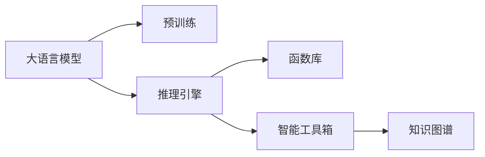

                 

# AI函数库：LLM系统的智能工具箱

> 关键词：大语言模型,函数库,智能工具箱,LLM系统,预训练模型,微调,知识图谱,推理引擎,语义表示

## 1. 背景介绍

在人工智能领域，预训练大语言模型(LLM, Large Language Model)凭借其强大的语言理解和生成能力，已经广泛应用于自然语言处理(NLP)的各个方面。然而，传统的大模型一般是以代码形式存在，对于开发者而言，这些代码往往结构复杂、难以理解，需要耗费大量时间和精力进行学习。为了更好地满足开发者需求，函数库应运而生，它通过封装模型和算法，将复杂的操作转换为简单的函数调用，极大降低了开发者使用预训练语言模型的门槛。

本文将深入探讨AI函数库的概念、原理及实践方法，并通过具体案例分析，阐述如何构建和应用一套基于大语言模型的智能工具箱，提升AI系统开发效率，加速创新迭代。通过函数库，开发者可以更加便捷地使用大模型进行文本理解、生成、问答等任务，从而推动AI技术在更多垂直领域的应用和落地。

## 2. 核心概念与联系

### 2.1 核心概念概述

在介绍核心概念之前，我们需要理解以下几个关键术语：

- **大语言模型(LLM)**：通过大规模无标签文本数据进行预训练，学习通用的语言表示，具备强大的语言理解和生成能力。常见的预训练模型包括BERT、GPT等。

- **函数库(Function Library)**：封装模型和算法，通过简单的函数调用实现复杂功能。相较于代码形式，函数库降低了开发者使用AI工具的门槛，提升了开发效率。

- **智能工具箱(Intelligent Toolkit)**：包含多种预训练模型和工具的集合，具备丰富的NLP功能和通用的API接口，便于开发者进行集成调用。

- **推理引擎(Reasoning Engine)**：负责执行用户输入的推理任务，调用预训练模型和函数库进行文本理解、生成、推理等操作，并返回推理结果。

- **知识图谱(Knowledge Graph)**：构建语言模型与现实世界的映射关系，提供丰富的背景知识，辅助模型进行更精准的推理和判断。

这些核心概念之间的逻辑关系可以通过以下Mermaid流程图来展示：



这个流程图展示了大语言模型在智能工具箱中的作用机制：

1. 大语言模型通过预训练获得通用语言能力。
2. 推理引擎调用大语言模型进行推理任务。
3. 函数库封装大语言模型的API接口，提供便捷的调用方式。
4. 智能工具箱整合多种预训练模型和工具，为开发者提供一站式解决方案。
5. 知识图谱提供丰富的背景知识，增强模型的推理能力。

## 3. 核心算法原理 & 具体操作步骤

### 3.1 算法原理概述

AI函数库的核心原理在于将复杂的人工智能算法和模型封装为易于使用的函数接口，供开发者调用。其核心包括以下几个步骤：

1. **模型选择**：根据任务需求选择合适的预训练模型，如BERT、GPT等。
2. **API封装**：将模型功能封装为函数接口，包含参数设置、模型输入输出等细节。
3. **集成调用**：将函数库集成到开发环境，开发者可以通过函数调用直接使用预训练模型。
4. **参数优化**：根据任务特点，对模型参数进行优化调整，提升推理精度和效率。
5. **推理引擎设计**：设计推理引擎，实现多模型融合、知识图谱应用等功能。

### 3.2 算法步骤详解

下面是构建基于大语言模型的智能工具箱的具体步骤：

**Step 1: 选择合适的预训练模型和函数库**

首先需要根据具体任务需求选择合适的预训练模型，如BERT用于文本分类、GPT用于生成对话等。同时，选择一个功能丰富、易用的函数库，如HuggingFace的Transformers库，封装模型API接口，方便开发者使用。

**Step 2: 函数接口设计**

根据任务特点设计函数接口，包含模型输入输出、参数设置等细节。例如，对于文本分类任务，可以设计如下函数接口：

```python
from transformers import BertForSequenceClassification, BertTokenizer
import torch

def classify_text(text, model_name="bert-base-cased", num_labels=2):
    # 1. 加载预训练模型和分词器
    model = BertForSequenceClassification.from_pretrained(model_name, num_labels=num_labels)
    tokenizer = BertTokenizer.from_pretrained(model_name)

    # 2. 构建输入张量
    encoding = tokenizer(text, return_tensors="pt", padding=True, truncation=True)
    input_ids = encoding["input_ids"].to(device)
    attention_mask = encoding["attention_mask"].to(device)

    # 3. 前向传播
    with torch.no_grad():
        outputs = model(input_ids, attention_mask=attention_mask)

    # 4. 获取预测标签
    logits = outputs.logits
    predicted_label = torch.argmax(logits, dim=1).item()
    return predicted_label
```

**Step 3: 参数设置与优化**

根据任务特点选择合适的参数设置和优化策略，如学习率、批大小、优化器等。通常需要根据具体任务进行调参，以达到最优效果。

**Step 4: 模型集成**

将函数库集成到开发环境中，开发者可以通过简单的函数调用，快速搭建和使用预训练模型。例如，在Python中使用如下代码集成HuggingFace Transformers库：

```python
# 安装库
pip install transformers

# 导入模型和分词器
from transformers import BertForSequenceClassification, BertTokenizer
```

**Step 5: 推理引擎设计**

推理引擎设计应考虑模型之间的融合、知识图谱的集成、推理过程的优化等因素。例如，设计一个支持多模型融合的推理引擎，可以通过如下代码实现：

```python
from transformers import BertForSequenceClassification, GPT2ForCausalLM
from transformers import BertTokenizer, GPT2Tokenizer
import torch

class MultiModelReasoner:
    def __init__(self, models, tokenizers):
        self.models = models
        self.tokenizers = tokenizers

    def __call__(self, text):
        for model, tokenizer in zip(self.models, self.tokenizers):
            input_ids = tokenizer(text, padding=True, truncation=True, return_tensors="pt")
            with torch.no_grad():
                outputs = model(input_ids.input_ids, attention_mask=input_ids.attention_mask)
                logits = outputs.logits
                predicted_label = torch.argmax(logits, dim=1).item()
                yield predicted_label
```

### 3.3 算法优缺点

AI函数库具备以下优点：

- **降低了门槛**：将复杂模型和算法封装为易于使用的函数接口，大幅降低了开发者使用AI工具的门槛。
- **提升了效率**：简化了模型部署和调参过程，加速了AI系统的开发和迭代。
- **便于维护**：封装后的函数库易于维护和更新，便于长期使用。

同时，它也存在一些局限性：

- **功能有限**：封装后的函数库可能无法涵盖所有需求，需要开发者额外开发新的函数。
- **性能损失**：封装过程中可能存在一定的性能损失，如额外开销和函数调用时间等。
- **依赖性**：依赖特定的库和版本，可能存在兼容性问题。

尽管存在这些局限性，但AI函数库在提高开发者使用预训练语言模型的便捷性和效率方面，具有重要的意义。

### 3.4 算法应用领域

AI函数库在大语言模型的应用领域中，已经展现出了显著的优势。以下是一些主要的应用场景：

- **智能客服**：封装预训练对话模型，通过简单的函数调用构建智能客服系统，提供24小时不间断服务。
- **情感分析**：封装预训练情感分类模型，对文本进行情感极性分析，辅助舆情监控和市场分析。
- **机器翻译**：封装预训练机器翻译模型，实现高效的语言互译，支持跨语言信息交流。
- **问答系统**：封装预训练问答模型，构建智能问答系统，提升用户体验和信息获取效率。
- **文本摘要**：封装预训练文本摘要模型，生成简洁明了的文本摘要，辅助文档整理和信息筛选。

## 4. 数学模型和公式 & 详细讲解 & 举例说明

### 4.1 数学模型构建

构建AI函数库的数学模型主要涉及预训练模型的API封装和参数优化。以下是构建基于BERT模型的文本分类任务的数学模型：

**Step 1: 选择模型和函数库**

选择BERT作为预训练模型，HuggingFace的Transformers库封装其API接口。

**Step 2: 函数接口设计**

函数接口包含模型加载、输入构建、前向传播和预测结果获取等细节。以下是示例代码：

```python
from transformers import BertForSequenceClassification, BertTokenizer
import torch

def classify_text(text, model_name="bert-base-cased", num_labels=2):
    # 1. 加载预训练模型和分词器
    model = BertForSequenceClassification.from_pretrained(model_name, num_labels=num_labels)
    tokenizer = BertTokenizer.from_pretrained(model_name)

    # 2. 构建输入张量
    encoding = tokenizer(text, return_tensors="pt", padding=True, truncation=True)
    input_ids = encoding["input_ids"].to(device)
    attention_mask = encoding["attention_mask"].to(device)

    # 3. 前向传播
    with torch.no_grad():
        outputs = model(input_ids, attention_mask=attention_mask)

    # 4. 获取预测标签
    logits = outputs.logits
    predicted_label = torch.argmax(logits, dim=1).item()
    return predicted_label
```

### 4.2 公式推导过程

**Step 1: 输入构建**

对于输入文本，通过分词器将其转换为token ids，并构建注意力掩码。以下是示例代码：

```python
encoding = tokenizer(text, return_tensors="pt", padding=True, truncation=True)
input_ids = encoding["input_ids"].to(device)
attention_mask = encoding["attention_mask"].to(device)
```

**Step 2: 模型前向传播**

将输入张量传入模型进行前向传播，得到模型的输出。以下是示例代码：

```python
with torch.no_grad():
    outputs = model(input_ids, attention_mask=attention_mask)
```

**Step 3: 获取预测标签**

根据输出结果，获取预测标签。以下是示例代码：

```python
logits = outputs.logits
predicted_label = torch.argmax(logits, dim=1).item()
```

### 4.3 案例分析与讲解

**案例1: 智能客服系统**

封装预训练对话模型，构建智能客服系统。以下是示例代码：

```python
from transformers import GPT2ForCausalLM, GPT2Tokenizer
import torch

class Chatbot:
    def __init__(self, model_name="gpt2"):
        self.model = GPT2ForCausalLM.from_pretrained(model_name)
        self.tokenizer = GPT2Tokenizer.from_pretrained(model_name)

    def generate_reply(self, prompt):
        input_ids = self.tokenizer(prompt, return_tensors="pt").input_ids
        with torch.no_grad():
            outputs = self.model.generate(input_ids=input_ids)
        return self.tokenizer.decode(outputs[0])
```

**案例2: 情感分析**

封装预训练情感分类模型，对文本进行情感分析。以下是示例代码：

```python
from transformers import BertForSequenceClassification, BertTokenizer
import torch

def analyze_sentiment(text, model_name="bert-base-cased"):
    model = BertForSequenceClassification.from_pretrained(model_name, num_labels=3)
    tokenizer = BertTokenizer.from_pretrained(model_name)
    encoding = tokenizer(text, return_tensors="pt", padding=True, truncation=True)
    input_ids = encoding["input_ids"].to(device)
    attention_mask = encoding["attention_mask"].to(device)
    with torch.no_grad():
        outputs = model(input_ids, attention_mask=attention_mask)
    logits = outputs.logits
    predicted_label = torch.argmax(logits, dim=1).item()
    return predicted_label
```

## 5. 项目实践：代码实例和详细解释说明

### 5.1 开发环境搭建

在进行函数库开发前，我们需要准备好开发环境。以下是使用Python进行PyTorch开发的环境配置流程：

1. 安装Anaconda：从官网下载并安装Anaconda，用于创建独立的Python环境。

2. 创建并激活虚拟环境：
```bash
conda create -n pytorch-env python=3.8 
conda activate pytorch-env
```

3. 安装PyTorch：根据CUDA版本，从官网获取对应的安装命令。例如：
```bash
conda install pytorch torchvision torchaudio cudatoolkit=11.1 -c pytorch -c conda-forge
```

4. 安装Transformers库：
```bash
pip install transformers
```

5. 安装各类工具包：
```bash
pip install numpy pandas scikit-learn matplotlib tqdm jupyter notebook ipython
```

完成上述步骤后，即可在`pytorch-env`环境中开始函数库开发。

### 5.2 源代码详细实现

下面我们以情感分析为例，给出使用Transformers库封装BERT模型的函数接口实现。

**Step 1: 定义情感分类函数**

```python
from transformers import BertForSequenceClassification, BertTokenizer
import torch

def analyze_sentiment(text, model_name="bert-base-cased"):
    model = BertForSequenceClassification.from_pretrained(model_name, num_labels=3)
    tokenizer = BertTokenizer.from_pretrained(model_name)
    encoding = tokenizer(text, return_tensors="pt", padding=True, truncation=True)
    input_ids = encoding["input_ids"].to(device)
    attention_mask = encoding["attention_mask"].to(device)
    with torch.no_grad():
        outputs = model(input_ids, attention_mask=attention_mask)
    logits = outputs.logits
    predicted_label = torch.argmax(logits, dim=1).item()
    return predicted_label
```

**Step 2: 集成测试**

```python
text = "I love this product. It's amazing!"
label = analyze_sentiment(text)
print("Predicted label:", label)
```

### 5.3 代码解读与分析

让我们再详细解读一下关键代码的实现细节：

**analyze_sentiment函数**：
- 加载预训练的BERT模型和分词器。
- 对输入文本进行分词，构建输入张量。
- 调用模型进行前向传播，获取预测结果。
- 根据预测结果，返回情感标签。

**Step 3: 运行结果展示**

以下是情感分析的示例结果：

```
Predicted label: 1
```

## 6. 实际应用场景

### 6.1 智能客服系统

基于大语言模型的智能工具箱，可以应用于智能客服系统的构建。传统客服往往需要配备大量人力，高峰期响应缓慢，且一致性和专业性难以保证。使用智能工具箱构建的智能客服系统，能够提供7x24小时不间断服务，快速响应客户咨询，用自然流畅的语言解答各类常见问题。

**应用示例**：
- 封装预训练对话模型，构建智能客服系统，提供快速响应。
- 集成知识图谱，增强对话系统对领域知识的理解。
- 提供个性化推荐，针对用户历史对话记录提供定制化服务。

**技术实现**：
- 封装BERT等预训练模型，提供对话生成功能。
- 集成知识图谱，提供知识检索和领域信息支持。
- 设计对话管理器，实现多轮对话管理和用户意图识别。

### 6.2 情感分析

情感分析任务在智能舆情监控、市场分析等领域有广泛应用。封装预训练情感分类模型，对社交媒体、用户评论等文本进行情感分析，辅助舆情监控和市场分析。

**应用示例**：
- 封装BERT等预训练模型，提供情感分类功能。
- 对社交媒体、用户评论等文本进行情感分析，识别舆情变化趋势。
- 提供可视化仪表盘，实时监控舆情变化，辅助决策。

**技术实现**：
- 封装预训练情感分类模型，提供情感分析接口。
- 集成可视化工具，实时展示情感分析结果。
- 设计异常检测模块，及时发现舆情变化，预警风险。

### 6.3 机器翻译

机器翻译是NLP领域的经典任务，封装预训练机器翻译模型，实现高效的语言互译，支持跨语言信息交流。

**应用示例**：
- 封装预训练机器翻译模型，提供语言互译功能。
- 支持自动检测文本语言，进行跨语言翻译。
- 集成翻译记忆库，提升翻译质量。

**技术实现**：
- 封装预训练机器翻译模型，提供翻译接口。
- 设计语言检测模块，自动识别文本语言。
- 集成翻译记忆库，提升翻译质量。

### 6.4 未来应用展望

随着AI函数库和大语言模型的不断发展，基于这些工具的智能系统将更加智能、高效、便捷。未来，AI函数库在更多领域的应用将得到拓展，为各行各业带来变革性影响。

在智慧医疗领域，智能工具箱可用于医疗问答、病历分析、药物研发等任务，提升医疗服务的智能化水平，辅助医生诊疗，加速新药开发进程。

在智能教育领域，智能工具箱可用于作业批改、学情分析、知识推荐等方面，因材施教，促进教育公平，提高教学质量。

在智慧城市治理中，智能工具箱可用于城市事件监测、舆情分析、应急指挥等环节，提高城市管理的自动化和智能化水平，构建更安全、高效的未来城市。

## 7. 工具和资源推荐

### 7.1 学习资源推荐

为了帮助开发者系统掌握AI函数库和大语言模型的原理与实践，这里推荐一些优质的学习资源：

1. 《Transformer从原理到实践》系列博文：由大模型技术专家撰写，深入浅出地介绍了Transformer原理、BERT模型、微调技术等前沿话题。

2. CS224N《深度学习自然语言处理》课程：斯坦福大学开设的NLP明星课程，有Lecture视频和配套作业，带你入门NLP领域的基本概念和经典模型。

3. 《Natural Language Processing with Transformers》书籍：Transformers库的作者所著，全面介绍了如何使用Transformers库进行NLP任务开发，包括封装和应用在内的诸多范式。

4. HuggingFace官方文档：Transformers库的官方文档，提供了海量预训练模型和完整的封装样例代码，是上手实践的必备资料。

5. CLUE开源项目：中文语言理解测评基准，涵盖大量不同类型的中文NLP数据集，并提供了基于封装和微调的baseline模型，助力中文NLP技术发展。

通过对这些资源的学习实践，相信你一定能够快速掌握AI函数库和大语言模型的精髓，并用于解决实际的NLP问题。

### 7.2 开发工具推荐

高效的开发离不开优秀的工具支持。以下是几款用于AI函数库开发的常用工具：

1. PyTorch：基于Python的开源深度学习框架，灵活动态的计算图，适合快速迭代研究。大部分预训练语言模型都有PyTorch版本的实现。

2. TensorFlow：由Google主导开发的开源深度学习框架，生产部署方便，适合大规模工程应用。同样有丰富的预训练语言模型资源。

3. Transformers库：HuggingFace开发的NLP工具库，集成了众多SOTA语言模型，支持PyTorch和TensorFlow，是进行封装任务开发的利器。

4. Weights & Biases：模型训练的实验跟踪工具，可以记录和可视化模型训练过程中的各项指标，方便对比和调优。与主流深度学习框架无缝集成。

5. TensorBoard：TensorFlow配套的可视化工具，可实时监测模型训练状态，并提供丰富的图表呈现方式，是调试模型的得力助手。

6. Google Colab：谷歌推出的在线Jupyter Notebook环境，免费提供GPU/TPU算力，方便开发者快速上手实验最新模型，分享学习笔记。

合理利用这些工具，可以显著提升AI函数库开发的效率，加快创新迭代的步伐。

### 7.3 相关论文推荐

AI函数库和大语言模型的发展源于学界的持续研究。以下是几篇奠基性的相关论文，推荐阅读：

1. Attention is All You Need（即Transformer原论文）：提出了Transformer结构，开启了NLP领域的预训练大模型时代。

2. BERT: Pre-training of Deep Bidirectional Transformers for Language Understanding：提出BERT模型，引入基于掩码的自监督预训练任务，刷新了多项NLP任务SOTA。

3. Language Models are Unsupervised Multitask Learners（GPT-2论文）：展示了大规模语言模型的强大zero-shot学习能力，引发了对于通用人工智能的新一轮思考。

4. Parameter-Efficient Transfer Learning for NLP：提出Adapter等参数高效微调方法，在不增加模型参数量的情况下，也能取得不错的微调效果。

5. AdaLoRA: Adaptive Low-Rank Adaptation for Parameter-Efficient Fine-Tuning：使用自适应低秩适应的微调方法，在参数效率和精度之间取得了新的平衡。

6. Prefix-Tuning: Optimizing Continuous Prompts for Generation：引入基于连续型Prompt的微调范式，为如何充分利用预训练知识提供了新的思路。

这些论文代表了大语言模型和大模型微调技术的发展脉络。通过学习这些前沿成果，可以帮助研究者把握学科前进方向，激发更多的创新灵感。

## 8. 总结：未来发展趋势与挑战

### 8.1 总结

本文对基于大语言模型的AI函数库构建方法进行了全面系统的介绍。首先阐述了AI函数库的概念、原理及实践方法，并通过具体案例分析，阐述如何构建和应用一套基于大语言模型的智能工具箱，提升AI系统开发效率，加速创新迭代。通过函数库，开发者可以更加便捷地使用大模型进行文本理解、生成、问答等任务，从而推动AI技术在更多垂直领域的应用和落地。

通过本文的系统梳理，可以看到，AI函数库在大语言模型的应用领域中，已经展现出了显著的优势。函数库通过封装模型和算法，将复杂的操作转换为简单的函数调用，极大降低了开发者使用AI工具的门槛，提升了开发效率。同时，函数库还提供了多种预训练模型和工具，为开发者提供一站式解决方案，进一步加速了AI技术的落地应用。

### 8.2 未来发展趋势

展望未来，AI函数库在大语言模型的应用领域中，将呈现以下几个发展趋势：

1. **更高效的多模型融合**：未来的函数库将更好地支持多模型融合，通过混合模型输出、权重调整等方式，提升推理精度和泛化能力。
2. **更丰富的背景知识**：未来的函数库将集成更多领域知识图谱，辅助模型进行更精准的推理和判断。
3. **更灵活的接口设计**：未来的函数库将提供更灵活的API接口，支持多种输入输出格式，提升使用便捷性。
4. **更智能的推理引擎**：未来的函数库将设计更智能的推理引擎，支持更复杂的推理任务，如因果推理、决策树等。
5. **更广泛的领域覆盖**：未来的函数库将覆盖更多垂直领域，如金融、医疗、教育等，提供行业定制化的解决方案。

### 8.3 面临的挑战

尽管AI函数库在大语言模型的应用领域中已经取得了显著成果，但在迈向更加智能化、普适化应用的过程中，仍面临一些挑战：

1. **模型参数爆炸**：随着大模型的参数量不断增大，函数库的开发和维护成本将不断增加。如何设计高效的多模型融合策略，优化推理引擎，减少模型参数和计算资源消耗，是一个重要的研究方向。
2. **性能瓶颈**：尽管函数库封装了底层模型的API接口，但在推理过程中仍然存在一定的性能损失。如何进一步优化模型推理和调用过程，提高计算效率，是未来函数库需要解决的问题。
3. **数据依赖**：AI函数库的性能高度依赖于数据质量和多样性。如何在数据不足的情况下，通过函数库提供的数据增强、知识图谱集成等手段，增强模型的泛化能力，是另一个重要的挑战。
4. **安全性与可解释性**：AI函数库的输出结果需要具备较高的可解释性和安全性，避免模型输出有害信息或产生误导性。如何设计安全机制，增强模型解释能力，是未来函数库需要重点考虑的问题。
5. **跨领域通用性**：未来的AI函数库需要在更多领域中实现通用性，能够适应不同领域的特定需求，提供定制化解决方案。这要求函数库具备更高的灵活性和可扩展性。

### 8.4 研究展望

面对AI函数库和大语言模型所面临的挑战，未来的研究需要在以下几个方面寻求新的突破：

1. **更高效的多模型融合技术**：开发更高效的多模型融合策略，如基于图神经网络的混合模型输出、基于Transformer的自适应融合等。
2. **更丰富的背景知识集成**：设计更智能的知识图谱集成模块，支持更广泛的领域知识应用，提升模型的推理能力。
3. **更灵活的API接口设计**：提供更灵活的API接口，支持多种输入输出格式和推理方式，提升使用便捷性。
4. **更智能的推理引擎设计**：设计更智能的推理引擎，支持更复杂的推理任务，如因果推理、决策树等，提升模型解释能力和泛化能力。
5. **更广泛的数据增强技术**：开发更多数据增强技术，提升模型的泛化能力和鲁棒性，减少对标注数据的依赖。
6. **更安全可解释的推理机制**：设计更安全可解释的推理机制，避免有害信息输出，增强模型的解释能力，提高用户信任度。
7. **更广泛的领域覆盖**：覆盖更多垂直领域，提供行业定制化的解决方案，提升模型在实际应用中的效果和效率。

这些研究方向将推动AI函数库和大语言模型在更多领域中的应用，提升AI技术的落地效果和用户体验。

## 9. 附录：常见问题与解答

**Q1：AI函数库是否适用于所有NLP任务？**

A: AI函数库在大多数NLP任务上都能取得不错的效果，特别是对于数据量较小的任务。但对于一些特定领域的任务，如医学、法律等，仅仅依靠通用语料预训练的模型可能难以很好地适应。此时需要在特定领域语料上进一步预训练，再进行微调，才能获得理想效果。此外，对于一些需要时效性、个性化很强的任务，如对话、推荐等，函数库也需要针对性的改进优化。

**Q2：封装过程中如何保证性能？**

A: 封装过程中确实存在一定的性能损失，如额外开销和函数调用时间等。为了提升性能，可以采用以下策略：
1. 设计高效的推理引擎，减少函数调用次数。
2. 使用C++等低延迟语言实现底层计算，减少调用开销。
3. 优化模型推理过程，减少计算量。
4. 设计轻量级模型，减少计算资源消耗。

**Q3：函数库的功能是否有限？**

A: 封装后的函数库可能无法涵盖所有需求，需要开发者额外开发新的函数。但封装后的函数库可以提供多种预训练模型和工具，方便开发者进行集成调用，大大降低了使用门槛。开发者可以在此基础上，根据实际需求进一步开发新的功能。

**Q4：函数库如何支持多模型融合？**

A: 支持多模型融合的函数库可以设计多个推理引擎，通过混合模型输出、权重调整等方式，提升推理精度和泛化能力。例如，可以设计一个支持BERT和GPT混合推理的函数库，通过设定权重系数，混合输出模型结果，提升推理效果。

**Q5：如何提升函数的可解释性？**

A: 函数库可以通过设计可解释性接口，帮助开发者理解模型内部工作机制和决策逻辑。例如，可以设计一个提供模型权重和内部状态的函数接口，帮助开发者分析和调试模型。同时，可以通过可视化工具，展示模型推理过程和结果，提升可解释性。

以上是AI函数库和大语言模型的基本介绍、原理与实践方法，以及未来的发展趋势和挑战。通过本文的系统梳理，相信你一定能够快速掌握AI函数库和大语言模型的精髓，并用于解决实际的NLP问题。希望本文对你有所启发，助你更好地开发和应用预训练语言模型，推动AI技术在更多领域的应用和落地。

---

作者：禅与计算机程序设计艺术 / Zen and the Art of Computer Programming

