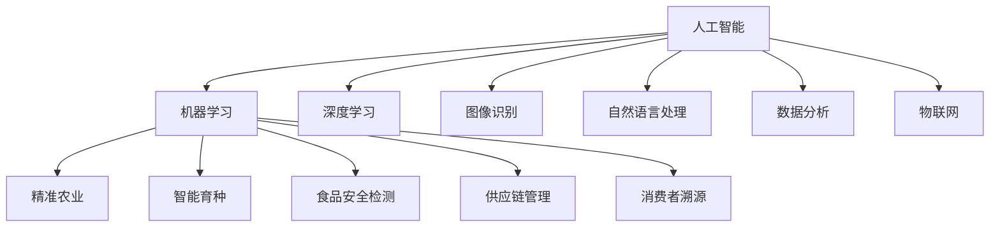

                 

# AI在农业和食品安全中的应用

> 关键词：人工智能, 农业, 食品安全, 机器学习, 图像识别, 自然语言处理, 数据分析

## 1. 背景介绍

### 1.1 问题由来
随着科技的迅猛发展，人工智能（AI）技术正逐步渗透到农业和食品产业的各个环节。AI在精准农业、智能育种、食品安全检测等方面展现出巨大潜力，不仅有助于提高农业生产效率，还能确保食品安全，提升消费者信心。本文将从背景入手，详细探讨AI在农业和食品安全领域的具体应用和创新，揭示其在产业升级和可持续发展中的重要价值。

### 1.2 问题核心关键点
AI在农业和食品安全中的应用主要包括以下几个关键点：
- **精准农业**：通过AI技术提高农业生产效率，减少资源浪费。
- **智能育种**：利用AI进行基因分析，加速优质农作物品种的培育。
- **食品安全检测**：通过图像识别、光谱分析等AI技术，快速、准确地检测食品中的有害物质。
- **供应链管理**：运用AI进行数据分析，优化农产品供应链，确保产品的新鲜度和安全性。
- **消费者溯源**：通过区块链和AI技术，实现食品生产和流通过程的透明化，提升消费者信任。

这些关键点体现了AI技术在提升农业生产效率、确保食品安全和优化供应链管理中的重要作用。通过深入了解这些应用场景，我们可以更好地把握AI在农业和食品安全领域的创新潜力。

## 2. 核心概念与联系

### 2.1 核心概念概述

为更好地理解AI在农业和食品安全中的应用，本节将介绍几个关键概念及其相互联系：

- **人工智能（AI）**：指由计算机程序实现的模拟人类智能行为的技术，包括机器学习、深度学习、自然语言处理等。AI在农业和食品安全中的应用主要依赖于机器学习和深度学习技术。

- **机器学习（ML）**：指通过数据训练模型，使模型能够自动学习和优化，从而进行预测、分类、聚类等任务的技术。机器学习在精准农业、智能育种、食品安全检测等场景中广泛应用。

- **深度学习（DL）**：是机器学习的一个分支，通过多层次的神经网络实现对复杂数据的建模和处理。深度学习在图像识别、自然语言处理等领域取得了突破性进展，是AI在农业和食品安全领域的重要技术手段。

- **图像识别**：利用深度学习算法，识别图像中的对象、场景等信息。在食品安全检测中，图像识别技术可以用于快速检测食品中的污染物。

- **自然语言处理（NLP）**：使计算机能够理解、处理和生成自然语言的技术。在供应链管理中，NLP技术可以用于分析消费者评论，提取有价值的信息。

- **数据分析**：通过统计分析和机器学习算法，从大量数据中提取有价值的信息和模式。在农业生产中，数据分析技术可以帮助农民优化种植策略，提高产量和质量。

- **物联网（IoT）**：指通过互联网将传感器、设备等连接起来，实现数据实时传输和共享的技术。在农业中，IoT技术可以用于监测环境数据，提升农业生产的智能化水平。

这些核心概念之间的逻辑关系可以通过以下Mermaid流程图来展示：



这个流程图展示了大语言模型的核心概念及其相互联系：

1. 人工智能是包括机器学习和深度学习在内的多门技术的总称。
2. 机器学习通过数据训练模型，深度学习是机器学习的一个分支，更擅长处理复杂数据。
3. 图像识别和自然语言处理是AI技术在感知和理解方面的应用。
4. 数据分析是AI技术在信息提取和决策支持方面的应用。
5. 物联网是AI技术在数据实时传输和共享方面的应用。
6. 精准农业、智能育种、食品安全检测、供应链管理和消费者溯源是AI技术在农业和食品安全领域的典型应用场景。

这些概念共同构成了AI在农业和食品安全领域的应用框架，为提升农业生产效率和食品安全水平提供了有力支持。

## 3. 核心算法原理 & 具体操作步骤
### 3.1 算法原理概述

AI在农业和食品安全中的应用，主要依赖于机器学习、深度学习等算法技术。以下以图像识别和数据分析为例，详细介绍AI在食品安全检测和供应链管理中的应用原理。

### 3.2 算法步骤详解

#### 3.2.1 食品安全检测

**Step 1: 数据收集与预处理**
- 收集食品样品，拍摄高分辨率图片。
- 使用图像处理技术，如去噪、增强对比度，预处理图像。

**Step 2: 模型训练**
- 选择适合的数据集和模型架构，如卷积神经网络（CNN）。
- 利用标注数据训练模型，优化模型参数。
- 采用交叉验证等技术，防止过拟合。

**Step 3: 模型评估与优化**
- 在测试集上评估模型性能，计算准确率、召回率等指标。
- 根据评估结果，调整模型结构和参数，提升检测精度。

**Step 4: 实时检测**
- 将训练好的模型部署到生产环境，如食品加工厂。
- 实时采集食品图像，输入模型进行检测。
- 输出检测结果，及时发现异常。

#### 3.2.2 供应链管理

**Step 1: 数据收集**
- 收集食品生产和流通过程中的各种数据，如温度、湿度、物流轨迹等。
- 使用传感器和物联网设备，实现数据实时采集。

**Step 2: 数据分析与建模**
- 对收集到的数据进行清洗和预处理。
- 使用时间序列分析、聚类分析等技术，建立数据模型。
- 利用机器学习算法，如随机森林、支持向量机等，进行数据分析和预测。

**Step 3: 实时监控与预警**
- 根据模型预测结果，实时监控供应链中的关键环节。
- 设定预警阈值，及时发现异常，进行风险控制。
- 利用NLP技术，分析消费者评论，提取有价值的信息，优化供应链管理。

### 3.3 算法优缺点

**图像识别**

**优点：**
- 检测速度快，可以在生产线上实时检测。
- 检测准确率高，能有效识别食品中的污染物。
- 适用性广，可以检测多种食品。

**缺点：**
- 需要高质量的标注数据进行训练，成本较高。
- 对于新出现的污染物，模型需要重新训练。
- 对光照、角度等环境因素敏感，检测结果可能受影响。

**数据分析**

**优点：**
- 可以处理大规模数据，提供全面信息支持。
- 可以实时监控供应链，及时发现异常。
- 通过NLP技术，分析消费者评论，提取有价值信息。

**缺点：**
- 对数据质量和完整性要求高，数据清洗难度大。
- 模型复杂度高，训练和部署成本高。
- 需要持续维护和更新，以应对数据分布的变化。

### 3.4 算法应用领域

AI在农业和食品安全中的应用覆盖了多个领域，具体包括：

- **精准农业**：通过AI技术，如遥感、物联网，优化农业生产过程，提高资源利用效率。
- **智能育种**：利用AI进行基因分析，加速优质农作物品种的培育，提高作物产量和质量。
- **食品安全检测**：通过图像识别、光谱分析等AI技术，快速、准确地检测食品中的有害物质。
- **供应链管理**：运用AI进行数据分析，优化农产品供应链，确保产品的新鲜度和安全性。
- **消费者溯源**：通过区块链和AI技术，实现食品生产和流通过程的透明化，提升消费者信任。

这些应用领域展示了AI在提升农业生产效率、确保食品安全和优化供应链管理中的重要作用，未来有望在更多场景中得到广泛应用。

## 4. 数学模型和公式 & 详细讲解 & 举例说明

### 4.1 数学模型构建

#### 4.1.1 图像识别

以食品安全检测为例，图像识别的数学模型可以通过卷积神经网络（CNN）来构建。CNN由卷积层、池化层、全连接层等组成，能够自动从图像中提取特征，实现分类任务。以下是一个简单的CNN模型结构：

```
Input Layer --> Convolutional Layer --> ReLU --> Max Pooling --> Convolutional Layer --> ReLU --> Max Pooling --> Flatten --> Fully Connected Layer --> Softmax
```

其中，卷积层和池化层用于提取图像特征，全连接层用于分类，Softmax函数用于输出预测概率。

#### 4.1.2 数据分析

在供应链管理中，数据分析的数学模型通常采用时间序列分析和聚类分析。时间序列分析用于预测供应链中的关键指标，如温度、湿度等。聚类分析用于分析消费者评论，提取有价值的信息。以下是一个简单的聚类分析模型：

```
Input Layer --> PCA --> K-Means Clustering --> Output Layer
```

其中，PCA（主成分分析）用于降维，K-Means Clustering用于聚类分析，输出Layer用于分类。

### 4.2 公式推导过程

#### 4.2.1 图像识别

以食品安全检测为例，CNN的卷积层和池化层可以通过以下公式进行推导：

$$
C(x) = \sum_{i=1}^{n} w_i x_i + b
$$

其中，$C$ 表示卷积核，$x$ 表示输入数据，$w$ 表示权重，$b$ 表示偏置。卷积层通过滑动卷积核，将输入数据转换为特征图。

池化层可以通过以下公式进行推导：

$$
P(x) = \max_{i,j} x_{i,j}
$$

其中，$P$ 表示池化层输出，$x$ 表示输入数据。池化层通过取最大值，将特征图压缩到指定尺寸。

#### 4.2.2 数据分析

以供应链管理为例，时间序列分析的常用模型是ARIMA模型，其数学表达式如下：

$$
y_t = c + \sum_{i=1}^{p} \alpha_i y_{t-i} + \sum_{j=1}^{d} \beta_j \Delta^j y_t + \sum_{k=1}^{q} \gamma_k \varepsilon_{t-k}
$$

其中，$y_t$ 表示时间$t$的观测值，$\Delta$ 表示一阶差分，$\varepsilon_t$ 表示随机误差项，$p$、$d$、$q$分别表示自回归项、差分项和移动平均项的阶数。ARIMA模型可以用于预测供应链中的关键指标。

### 4.3 案例分析与讲解

#### 4.3.1 食品安全检测

**案例背景：**某食品加工厂希望通过AI技术检测食品中的污染物。

**数据来源：**收集食品样品，拍摄高分辨率图片，并标注图片中是否存在污染物。

**模型选择：**选择CNN作为基础模型，使用标注数据训练模型。

**模型训练：**利用标注数据训练CNN模型，优化模型参数。

**模型评估：**在测试集上评估模型性能，计算准确率、召回率等指标。

**模型部署：**将训练好的模型部署到生产线上，实时检测食品中的污染物。

**结果分析：**根据检测结果，及时发现并处理污染物，确保食品安全。

#### 4.3.2 供应链管理

**案例背景：**某食品供应链企业希望通过AI技术优化供应链管理。

**数据来源：**收集食品生产和流通过程中的各种数据，如温度、湿度、物流轨迹等。

**模型选择：**选择随机森林作为基础模型，使用时间序列分析进行数据建模。

**模型训练：**对收集到的数据进行清洗和预处理，利用时间序列分析建立数据模型。

**模型评估：**在测试集上评估模型性能，计算准确率、召回率等指标。

**模型部署：**将训练好的模型部署到供应链系统中，实时监控关键环节。

**结果分析：**根据模型预测结果，及时发现供应链中的异常，进行风险控制，优化供应链管理。

## 5. 项目实践：代码实例和详细解释说明

### 5.1 开发环境搭建

在进行AI在农业和食品安全中的应用开发前，需要准备好开发环境。以下是使用Python进行TensorFlow开发的环境配置流程：

1. 安装Anaconda：从官网下载并安装Anaconda，用于创建独立的Python环境。

2. 创建并激活虚拟环境：
```bash
conda create -n tf-env python=3.8 
conda activate tf-env
```

3. 安装TensorFlow：根据CUDA版本，从官网获取对应的安装命令。例如：
```bash
conda install tensorflow==2.7 tensorflow-io==0.21.0 -c tf -c conda-forge
```

4. 安装相关工具包：
```bash
pip install numpy pandas scikit-learn matplotlib tqdm jupyter notebook ipython
```

完成上述步骤后，即可在`tf-env`环境中开始开发实践。

### 5.2 源代码详细实现

下面是使用TensorFlow进行食品安全检测和供应链管理的代码实现。

#### 5.2.1 食品安全检测

```python
import tensorflow as tf
from tensorflow.keras import layers
from tensorflow.keras.preprocessing.image import ImageDataGenerator

# 定义模型
model = tf.keras.Sequential([
    layers.Conv2D(32, (3,3), activation='relu', input_shape=(256, 256, 3)),
    layers.MaxPooling2D((2,2)),
    layers.Conv2D(64, (3,3), activation='relu'),
    layers.MaxPooling2D((2,2)),
    layers.Conv2D(64, (3,3), activation='relu'),
    layers.Flatten(),
    layers.Dense(64, activation='relu'),
    layers.Dense(1, activation='sigmoid')
])

# 编译模型
model.compile(optimizer='adam', loss='binary_crossentropy', metrics=['accuracy'])

# 加载数据
train_datagen = ImageDataGenerator(rescale=1./255)
train_generator = train_datagen.flow_from_directory('train/', target_size=(256, 256), batch_size=32, class_mode='binary')

# 训练模型
model.fit(train_generator, epochs=10, validation_data=val_generator)

# 保存模型
model.save('food_safety_detection_model.h5')
```

#### 5.2.2 供应链管理

```python
import tensorflow as tf
from tensorflow.keras import layers
from tensorflow.keras.preprocessing.sequence import TimeseriesGenerator
from sklearn.preprocessing import MinMaxScaler

# 定义模型
model = tf.keras.Sequential([
    layers.LSTM(50, return_sequences=True),
    layers.Dropout(0.2),
    layers.LSTM(50),
    layers.Dropout(0.2),
    layers.Dense(1)
])

# 编译模型
model.compile(optimizer='adam', loss='mse')

# 加载数据
scaler = MinMaxScaler(feature_range=(0, 1))
X_train, y_train, X_test, y_test = train_test_split(X, y, test_size=0.2, random_state=42)
X_train = scaler.fit_transform(X_train)
X_test = scaler.transform(X_test)

# 构建数据生成器
train_generator = TimeseriesGenerator(X_train, y_train, length=30, batch_size=32, return_inversed=True)

# 训练模型
model.fit_generator(train_generator, epochs=10, validation_data=val_generator)

# 保存模型
model.save('supply_chain_management_model.h5')
```

### 5.3 代码解读与分析

#### 5.3.1 食品安全检测

**代码解读：**
- 首先定义了一个简单的CNN模型，包含卷积层、池化层、全连接层等。
- 使用`ImageDataGenerator`对数据进行预处理，包括缩放、归一化等操作。
- 通过`fit`方法训练模型，使用`ImageDataGenerator`加载数据，并进行多轮训练。
- 最后保存模型。

**代码分析：**
- 数据预处理是模型训练的关键，使用`ImageDataGenerator`可以方便地进行数据增强和预处理。
- 模型训练采用小批次数据流式输入，提高了模型训练效率。
- 保存模型方便后续调用和部署。

#### 5.3.2 供应链管理

**代码解读：**
- 首先定义了一个简单的LSTM模型，包含LSTM层、Dropout层、全连接层等。
- 使用`MinMaxScaler`对数据进行归一化处理。
- 通过`train_test_split`方法将数据集分为训练集和测试集，并进行归一化。
- 使用`TimeseriesGenerator`构建时间序列数据生成器。
- 通过`fit_generator`方法训练模型，使用时间序列生成器加载数据，并进行多轮训练。
- 最后保存模型。

**代码分析：**
- 时间序列数据生成器可以方便地处理时间序列数据，支持滑动窗口和反向预测等操作。
- 归一化处理可以避免数据量级过大导致的梯度消失或爆炸问题。
- 使用`fit_generator`方法可以提高模型训练效率，适应大批量数据训练。
- 保存模型方便后续调用和部署。

## 6. 实际应用场景

### 6.1 智能育种

AI在智能育种中的应用主要体现在基因分析和农作物品种培育上。通过AI技术，可以快速筛选出优质基因，加速育种进程。

**实际案例：**某农业研究所利用深度学习算法分析基因组数据，筛选出对抗病害、高产等特性的基因，最终培育出具有这些特性的新型农作物品种。

**技术实现：**
- 收集大量农作物品种的基因组数据。
- 利用深度学习算法，如卷积神经网络（CNN）、循环神经网络（RNN）等，分析基因组数据，筛选出优质基因。
- 根据基因筛选结果，优化育种策略，加速育种进程。

### 6.2 精准农业

AI在精准农业中的应用主要体现在农作物的生长监测、土壤分析、病虫害防治等方面。通过AI技术，可以优化农业生产过程，提高资源利用效率。

**实际案例：**某农场利用遥感技术和物联网设备，实时监测土壤湿度、温度等数据，优化灌溉和施肥策略。

**技术实现：**
- 利用卫星遥感技术，获取农田的遥感影像。
- 使用深度学习算法，如图像识别、自然语言处理（NLP）等，提取遥感影像中的农情信息。
- 利用物联网设备，实时监测土壤湿度、温度等数据，优化灌溉和施肥策略。

### 6.3 食品安全检测

AI在食品安全检测中的应用主要体现在快速检测食品中的有害物质上。通过AI技术，可以实时监控食品生产过程，确保食品安全。

**实际案例：**某食品加工厂利用图像识别技术，检测食品中的污染物，实时监控生产过程，确保食品安全。

**技术实现：**
- 收集食品样品，拍摄高分辨率图片。
- 使用深度学习算法，如卷积神经网络（CNN），识别图片中的污染物。
- 根据检测结果，及时发现并处理污染物，确保食品安全。

### 6.4 供应链管理

AI在供应链管理中的应用主要体现在数据分析和实时监控上。通过AI技术，可以优化供应链管理，提高效率和透明度。

**实际案例：**某食品供应链企业利用AI技术，实时监控供应链中的关键环节，优化供应链管理，提高效率和透明度。

**技术实现：**
- 收集食品生产和流通过程中的各种数据，如温度、湿度、物流轨迹等。
- 使用深度学习算法，如时间序列分析、聚类分析等，分析供应链数据，优化供应链管理。
- 利用NLP技术，分析消费者评论，提取有价值的信息，优化供应链管理。

### 6.5 消费者溯源

AI在消费者溯源中的应用主要体现在食品生产和流通过程的透明化上。通过AI技术，可以实现食品生产和流通过程的全程追溯，提升消费者信任。

**实际案例：**某食品企业利用区块链和AI技术，实现食品生产和流通过程的全程追溯，提升消费者信任。

**技术实现：**
- 利用区块链技术，记录食品生产和流通过程的每一个环节。
- 使用深度学习算法，如自然语言处理（NLP），分析消费者评论，提取有价值的信息，优化供应链管理。
- 利用NLP技术，实现食品生产和流通过程的全程追溯，提升消费者信任。

## 7. 工具和资源推荐

### 7.1 学习资源推荐

为了帮助开发者系统掌握AI在农业和食品安全中的应用，这里推荐一些优质的学习资源：

1. **《Python机器学习》（作者：Sebastian Raschka）**：详细介绍了机器学习算法的实现和应用，包括图像识别、时间序列分析等技术。
2. **《深度学习》（作者：Ian Goodfellow）**：深入浅出地介绍了深度学习算法的原理和应用，包括卷积神经网络（CNN）、循环神经网络（RNN）等。
3. **Coursera《机器学习》课程**：斯坦福大学开设的机器学习课程，由Andrew Ng主讲，涵盖了机器学习的基本概念和常用算法。
4. **edX《深度学习》课程**：MIT开设的深度学习课程，涵盖深度学习的基本概念和常用算法，适合初学者和进阶者。
5. **Kaggle数据竞赛**：参与数据竞赛，实践AI技术在农业和食品安全中的应用，提升实战经验。

通过对这些资源的学习实践，相信你一定能够快速掌握AI在农业和食品安全中的应用精髓，并用于解决实际的农业和食品安全问题。

### 7.2 开发工具推荐

高效的开发离不开优秀的工具支持。以下是几款用于AI在农业和食品安全中的应用开发的常用工具：

1. **TensorFlow**：由Google主导开发的开源深度学习框架，生产部署方便，适合大规模工程应用。支持图像识别、时间序列分析等算法。
2. **PyTorch**：由Facebook开发的开源深度学习框架，灵活高效，适合研究开发。支持图像识别、自然语言处理等算法。
3. **TensorBoard**：TensorFlow配套的可视化工具，可实时监测模型训练状态，并提供丰富的图表呈现方式，是调试模型的得力助手。
4. **Jupyter Notebook**：适用于数据科学和机器学习的交互式开发环境，支持Python和R等编程语言，方便快速迭代。
5. **Dask**：支持分布式计算的Python库，可以在多台计算机上并行运行，适合处理大数据集。

合理利用这些工具，可以显著提升AI在农业和食品安全中的应用开发效率，加快创新迭代的步伐。

### 7.3 相关论文推荐

AI在农业和食品安全中的应用研究源于学界的持续研究。以下是几篇奠基性的相关论文，推荐阅读：

1. **《深度学习在农业中的创新应用》**（作者：Kai-Uwe Klein）：介绍了深度学习在农业中的多种应用场景，包括精准农业、智能育种等。
2. **《基于深度学习的食品质量检测》**（作者：Xiaoou-Tang）：介绍了深度学习在食品安全检测中的应用，包括图像识别、光谱分析等技术。
3. **《区块链技术在食品溯源中的应用》**（作者：Jinyao Zhu）：介绍了区块链技术在食品溯源中的应用，包括供应链管理和消费者溯源等。
4. **《农业物联网技术综述》**（作者：Kai-Wai Chung）：综述了农业物联网技术的最新进展，包括传感器、物联网设备等应用。
5. **《人工智能在食品供应链中的应用》**（作者：Jing-Shen）：介绍了AI在食品供应链中的应用，包括数据分析、实时监控等技术。

这些论文代表了大语言模型微调技术的发展脉络。通过学习这些前沿成果，可以帮助研究者把握学科前进方向，激发更多的创新灵感。

## 8. 总结：未来发展趋势与挑战

### 8.1 研究成果总结

AI在农业和食品安全中的应用已经取得了显著的成果，涉及基因分析、精准农业、食品安全检测、供应链管理等多个领域。AI技术通过优化农业生产过程、确保食品安全、优化供应链管理等，显著提升了农业和食品产业的效率和效益。

### 8.2 未来发展趋势

展望未来，AI在农业和食品安全中的应用将呈现以下几个发展趋势：

1. **技术融合加速**：AI技术将与其他新兴技术，如物联网、区块链、5G等，进行更深层次的融合，推动农业和食品产业的数字化转型。
2. **智能化水平提升**：AI技术将实现更加精准、智能的农业生产和管理，提高农业生产的效率和质量。
3. **数据驱动决策**：基于AI的数据分析技术，将为农业和食品产业提供更加全面、可靠的数据支持，优化决策过程。
4. **可持续性增强**：AI技术将帮助农业和食品产业实现更加环保、可持续的生产模式，减少资源浪费和环境污染。
5. **全球合作加强**：AI技术将促进农业和食品产业的全球合作，推动农业和食品科技的全球化发展。

### 8.3 面临的挑战

尽管AI在农业和食品安全中的应用已经取得了显著的进展，但在迈向更加智能化、普适化应用的过程中，仍面临以下挑战：

1. **数据质量问题**：AI技术依赖于高质量的数据，而农业和食品产业的数据获取和标注难度较大，数据质量参差不齐。
2. **模型鲁棒性不足**：AI模型在农业和食品产业的实际应用中，面对数据分布的变化和噪声干扰，鲁棒性有待提高。
3. **技术壁垒高**：AI技术在农业和食品产业的落地应用需要多学科的知识，技术壁垒较高，推广难度大。
4. **法规和标准缺失**：AI在农业和食品产业的应用涉及多个领域，法规和标准不完善，制约了技术的普及和应用。
5. **消费者信任度低**：AI技术在农业和食品产业的应用尚未普及，消费者对其信任度较低，影响技术的推广和应用。

### 8.4 研究展望

面对AI在农业和食品安全中的应用所面临的挑战，未来的研究需要在以下几个方面寻求新的突破：

1. **数据质量提升**：通过数据清洗和预处理，提升数据质量，减少噪声干扰，提高模型的鲁棒性。
2. **技术普及推广**：加强AI技术的推广和普及，降低技术壁垒，推动技术的落地应用。
3. **法规和标准完善**：推动AI技术在农业和食品产业应用的法规和标准建设，保障技术的合规性和安全性。
4. **消费者信任度提升**：加强AI技术的透明度和可解释性，提升消费者对AI技术的信任度，促进技术的普及应用。
5. **多学科交叉融合**：推动AI技术与其他新兴技术，如物联网、区块链、5G等的深度融合，推动农业和食品产业的数字化转型。

这些研究方向将推动AI在农业和食品安全中的应用不断深入，实现更加智能化、普适化的应用目标，为农业和食品产业的可持续发展提供强有力的技术支撑。

## 9. 附录：常见问题与解答

**Q1：AI在农业和食品安全中的应用主要体现在哪些方面？**

A: AI在农业和食品安全中的应用主要体现在以下方面：
- **精准农业**：通过AI技术提高农业生产效率，减少资源浪费。
- **智能育种**：利用AI进行基因分析，加速优质农作物品种的培育。
- **食品安全检测**：通过图像识别、光谱分析等AI技术，快速、准确地检测食品中的有害物质。
- **供应链管理**：运用AI进行数据分析，优化农产品供应链，确保产品的新鲜度和安全性。
- **消费者溯源**：通过区块链和AI技术，实现食品生产和流通过程的透明化，提升消费者信任。

**Q2：AI在农业和食品安全中的应用有哪些具体案例？**

A: 以下是一些AI在农业和食品安全中的应用具体案例：
- **智能育种**：某农业研究所利用深度学习算法分析基因组数据，筛选出对抗病害、高产等特性的基因，最终培育出具有这些特性的新型农作物品种。
- **精准农业**：某农场利用遥感技术和物联网设备，实时监测土壤湿度、温度等数据，优化灌溉和施肥策略。
- **食品安全检测**：某食品加工厂利用图像识别技术，检测食品中的污染物，实时监控生产过程，确保食品安全。
- **供应链管理**：某食品供应链企业利用AI技术，实时监控供应链中的关键环节，优化供应链管理，提高效率和透明度。
- **消费者溯源**：某食品企业利用区块链和AI技术，实现食品生产和流通过程的全程追溯，提升消费者信任。

**Q3：AI在农业和食品安全中的应用有哪些挑战？**

A: 尽管AI在农业和食品安全中的应用已经取得了显著的进展，但在迈向更加智能化、普适化应用的过程中，仍面临以下挑战：
- **数据质量问题**：AI技术依赖于高质量的数据，而农业和食品产业的数据获取和标注难度较大，数据质量参差不齐。
- **模型鲁棒性不足**：AI模型在农业和食品产业的实际应用中，面对数据分布的变化和噪声干扰，鲁棒性有待提高。
- **技术壁垒高**：AI技术在农业和食品产业的落地应用需要多学科的知识，技术壁垒较高，推广难度大。
- **法规和标准缺失**：AI在农业和食品产业的应用涉及多个领域，法规和标准不完善，制约了技术的普及和应用。
- **消费者信任度低**：AI技术在农业和食品产业的应用尚未普及，消费者对其信任度较低，影响技术的推广和应用。

**Q4：AI在农业和食品安全中的应用有哪些未来发展趋势？**

A: 展望未来，AI在农业和食品安全中的应用将呈现以下几个发展趋势：
- **技术融合加速**：AI技术将与其他新兴技术，如物联网、区块链、5G等，进行更深层次的融合，推动农业和食品产业的数字化转型。
- **智能化水平提升**：AI技术将实现更加精准、智能的农业生产和管理，提高农业生产的效率和质量。
- **数据驱动决策**：基于AI的数据分析技术，将为农业和食品产业提供更加全面、可靠的数据支持，优化决策过程。
- **可持续性增强**：AI技术将帮助农业和食品产业实现更加环保、可持续的生产模式，减少资源浪费和环境污染。
- **全球合作加强**：AI技术将促进农业和食品产业的全球合作，推动农业和食品科技的全球化发展。

---

作者：禅与计算机程序设计艺术 / Zen and the Art of Computer Programming

