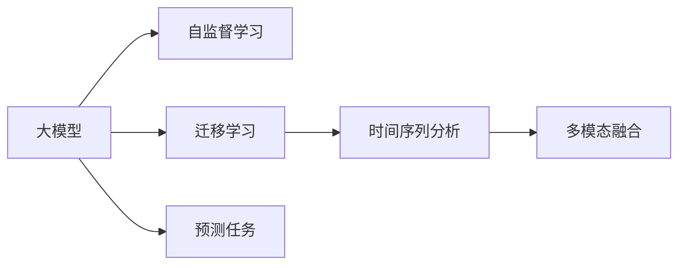

                 

# AI大模型在商品价格预测中的应用

## 1. 背景介绍

随着人工智能技术的不断发展和成熟，大语言模型在商业和工业领域的应用越来越广泛。特别是在商品价格预测这一细分领域，大模型由于其强大的数据分析和推理能力，已经开始展现出独特的优势。本文将详细探讨AI大模型在商品价格预测中的应用，包括模型原理、算法步骤、实际案例、应用前景以及面临的挑战。

### 1.1 问题由来

在传统商品价格预测中，主要依赖于历史销售数据、市场趋势分析、季节性因素等进行建模和预测。然而，这种方法存在一定的局限性，比如数据获取难度大、模型复杂度高、预测结果不够精准等。而基于大模型的商品价格预测，通过利用其强大的自学习能力和泛化能力，可以在一定程度上克服这些问题，提高预测精度和预测效率。

### 1.2 问题核心关键点

基于大模型在商品价格预测中的核心关键点包括：

- **自学习能力**：大模型可以通过大量数据进行预训练，学习到商品价格的潜在规律和趋势。
- **泛化能力**：大模型能够从已知数据中提取特征，对未知数据的预测性能较好。
- **动态适应**：大模型可以实时更新数据，自动调整预测模型，适应市场变化。
- **多模态数据融合**：除了销售数据外，大模型还能融合其他多模态数据，如社交媒体、新闻报道等，进行更全面的分析。

### 1.3 问题研究意义

AI大模型在商品价格预测中的应用具有以下重要意义：

- **提高预测精度**：利用大模型的自学习能力和泛化能力，可以大幅提高价格预测的准确性和可靠性。
- **降低成本**：相比传统方法，大模型可以在不需要大量手工标注数据的情况下，实现高效的价格预测。
- **增强市场响应**：大模型可以实时更新价格预测，帮助企业快速响应市场变化，调整定价策略。
- **提升决策效率**：利用大模型的自动分析和预测，可以快速生成多种定价方案，辅助企业决策。

## 2. 核心概念与联系

### 2.1 核心概念概述

在大模型应用于商品价格预测的过程中，涉及到的核心概念包括：

- **大模型**：如GPT、BERT等基于Transformer架构的深度学习模型，具有强大的自学习和泛化能力。
- **自监督学习**：通过在大规模无标注数据上进行预训练，学习到通用的语言表示。
- **迁移学习**：将大模型在不同任务之间迁移，以提升新任务的性能。
- **时间序列分析**：利用时间序列模型进行价格变化趋势的分析和预测。
- **多模态融合**：将不同模态的数据融合，进行更全面的价格预测。

这些核心概念通过以下Mermaid流程图进行联系：



这个流程图展示了大模型在商品价格预测中的应用流程：

1. **大模型预训练**：通过自监督学习在大规模无标注数据上进行预训练，学习到商品的通用表示。
2. **迁移学习**：将预训练模型迁移到商品价格预测任务，进行微调。
3. **时间序列分析**：利用时间序列模型，对商品价格变化趋势进行分析和预测。
4. **多模态融合**：将不同模态的数据（如销售数据、社交媒体、新闻报道等）进行融合，提高预测效果。
5. **预测任务**：在融合了多种数据源后，对商品价格进行预测。

### 2.2 核心概念原理和架构

- **大模型架构**：以Transformer为核心的大模型架构，主要由编码器-解码器组成，可以处理大规模序列数据。
- **自监督学习**：在大规模无标注数据上进行预训练，通过自回归或自编码任务学习到语言的潜在规律和表示。
- **迁移学习**：将预训练模型的参数迁移到特定任务上，通过微调进行任务适配。
- **时间序列分析**：通过RNN或LSTM等模型，对时间序列数据进行建模和预测。
- **多模态融合**：通过特征提取和融合，将不同模态的数据源进行整合，提高预测效果。

## 3. 核心算法原理 & 具体操作步骤

### 3.1 算法原理概述

基于大模型的商品价格预测算法主要分为预训练、迁移学习和预测三个阶段。以下是对该算法的详细概述：

1. **预训练**：通过在大规模无标注商品销售数据上训练大模型，学习到商品价格的潜在规律和表示。
2. **迁移学习**：将预训练模型迁移到特定商品价格预测任务上，通过微调进行任务适配。
3. **预测**：在微调后的模型上，利用时间序列分析和多模态融合，对商品价格进行预测。

### 3.2 算法步骤详解

基于大模型的商品价格预测算法主要包括以下步骤：

**Step 1: 数据准备**
- 收集商品销售数据，包括历史销售数据、市场趋势数据等。
- 收集其他多模态数据，如社交媒体评论、新闻报道等，进行融合。

**Step 2: 大模型预训练**
- 使用自监督学习任务（如掩码语言模型）在大规模无标注数据上进行预训练，学习到商品的潜在表示。
- 选择合适的大模型架构（如BERT、GPT等），进行预训练。

**Step 3: 迁移学习**
- 将预训练模型迁移到特定商品价格预测任务上，进行微调。
- 根据任务特点，设计合适的任务适配层，如线性分类器或解码器。
- 选择合适的优化器（如AdamW）和损失函数（如交叉熵损失）。
- 设置微调超参数，如学习率、批大小、迭代轮数等。
- 执行梯度训练，更新模型参数。

**Step 4: 时间序列分析和预测**
- 利用时间序列模型（如LSTM、GRU等）对商品价格变化趋势进行建模。
- 在微调后的模型上，利用时间序列分析进行价格预测。
- 考虑不同时间节点的价格变化，进行多步预测。

**Step 5: 多模态融合**
- 将不同模态的数据源进行融合，提取特征。
- 利用融合后的特征，进行商品价格预测。
- 考虑不同数据源的重要性，进行加权融合。

**Step 6: 预测结果输出**
- 根据多步预测结果，输出商品的预测价格。
- 对预测结果进行后处理，如平滑、归一化等，确保输出结果合理。

### 3.3 算法优缺点

基于大模型的商品价格预测算法具有以下优点：

1. **高效性**：相比传统方法，大模型可以在较短的时间内完成预训练和微调，提高预测效率。
2. **泛化能力强**：大模型可以从大规模数据中学习到通用规律，具有较强的泛化能力。
3. **适应性强**：大模型可以通过微调进行任务适配，适应不同的商品价格预测需求。
4. **预测准确**：利用多模态融合和时间序列分析，可以大幅提高预测精度。

同时，该算法也存在一些缺点：

1. **数据依赖性强**：大模型需要大量数据进行预训练和微调，数据获取成本较高。
2. **计算资源消耗大**：大模型通常具有大规模参数，训练和推理消耗较大的计算资源。
3. **模型复杂度高**：大模型架构复杂，可能存在一定的模型解释性不足问题。

### 3.4 算法应用领域

基于大模型的商品价格预测算法可以应用于多个领域，包括但不限于：

- **电子商务**：预测商品价格变化趋势，优化定价策略。
- **零售业**：分析商品价格波动，优化库存管理。
- **金融市场**：预测商品价格走势，进行投资决策。
- **物流配送**：预测商品价格变化，优化配送策略。

## 4. 数学模型和公式 & 详细讲解 & 举例说明

### 4.1 数学模型构建

假设商品价格预测的任务为预测商品在时间序列上的价格变化。设历史价格数据为 $P_t$，时间为 $t$，预训练模型为 $M_\theta$，微调后的模型为 $M_{\hat{\theta}}$。数学模型可以表示为：

$$
P_t = M_{\hat{\theta}}(P_{t-1}, ..., P_{t-n})
$$

其中 $n$ 表示时间序列的滑动窗口大小。

### 4.2 公式推导过程

假设 $P_t$ 的预测值为一个向量 $\hat{P}_t$，其与实际值 $P_t$ 的损失函数为均方误差损失：

$$
L(P_t, \hat{P}_t) = \frac{1}{N}\sum_{i=1}^N (P_i - \hat{P}_i)^2
$$

在微调过程中，损失函数可以表示为：

$$
\mathcal{L}(\hat{\theta}) = \frac{1}{N}\sum_{i=1}^N L(P_i, \hat{P}_i)
$$

其中 $\hat{P}_i = M_{\hat{\theta}}(P_{i-1}, ..., P_{i-n})$。

利用梯度下降等优化算法，更新模型参数 $\hat{\theta}$，最小化损失函数 $\mathcal{L}$：

$$
\hat{\theta} = \mathop{\arg\min}_{\theta} \mathcal{L}(\hat{\theta})
$$

### 4.3 案例分析与讲解

以某电商平台的商品价格预测为例，具体步骤和公式推导如下：

1. **数据准备**
   - 收集商品的历史销售数据，包括日销售额、销售时间、促销信息等。
   - 收集社交媒体评论和新闻报道，分析消费者情绪和市场趋势。

2. **预训练**
   - 使用大规模无标注商品销售数据进行预训练，学习到商品的通用表示。
   - 选择BERT模型，在大规模数据上进行预训练。

3. **迁移学习**
   - 将预训练的BERT模型迁移到商品价格预测任务上，进行微调。
   - 在微调过程中，添加线性分类器和均方误差损失函数。
   - 设置学习率为 $1e-5$，批大小为 $32$，迭代轮数为 $10$。

4. **时间序列分析和预测**
   - 利用LSTM模型对商品价格变化趋势进行建模。
   - 在微调后的模型上，利用LSTM进行多步预测。

5. **多模态融合**
   - 将商品销售数据和社交媒体评论进行融合，提取特征。
   - 利用融合后的特征，进行商品价格预测。
   - 考虑不同数据源的重要性，进行加权融合。

6. **预测结果输出**
   - 根据多步预测结果，输出商品的预测价格。
   - 对预测结果进行平滑处理，确保输出结果合理。

## 5. 项目实践：代码实例和详细解释说明

### 5.1 开发环境搭建

在进行项目实践前，我们需要准备好开发环境。以下是使用Python进行PyTorch开发的环境配置流程：

1. 安装Anaconda：从官网下载并安装Anaconda，用于创建独立的Python环境。

2. 创建并激活虚拟环境：
```bash
conda create -n pytorch-env python=3.8 
conda activate pytorch-env
```

3. 安装PyTorch：根据CUDA版本，从官网获取对应的安装命令。例如：
```bash
conda install pytorch torchvision torchaudio cudatoolkit=11.1 -c pytorch -c conda-forge
```

4. 安装Transformers库：
```bash
pip install transformers
```

5. 安装各类工具包：
```bash
pip install numpy pandas scikit-learn matplotlib tqdm jupyter notebook ipython
```

完成上述步骤后，即可在`pytorch-env`环境中开始项目实践。

### 5.2 源代码详细实现

下面我们以商品价格预测为例，给出使用Transformers库对BERT模型进行微调的PyTorch代码实现。

首先，定义模型和数据处理函数：

```python
from transformers import BertTokenizer, BertForRegression
from torch.utils.data import Dataset
import torch

class SalesData(Dataset):
    def __init__(self, data, tokenizer):
        self.data = data
        self.tokenizer = tokenizer
        
    def __len__(self):
        return len(self.data)
    
    def __getitem__(self, item):
        sales_data = self.data[item]
        tokenized_data = self.tokenizer(sales_data, return_tensors='pt', padding='max_length', truncation=True)
        input_ids = tokenized_data['input_ids']
        attention_mask = tokenized_data['attention_mask']
        
        return {'input_ids': input_ids,
                'attention_mask': attention_mask}

# 定义模型
model = BertForRegression.from_pretrained('bert-base-cased')

# 定义训练函数
def train_epoch(model, dataset, optimizer, device):
    model.to(device)
    model.train()
    epoch_loss = 0
    for batch in dataset:
        input_ids = batch['input_ids'].to(device)
        attention_mask = batch['attention_mask'].to(device)
        labels = torch.tensor([item['price'] for item in dataset])
        optimizer.zero_grad()
        outputs = model(input_ids, attention_mask=attention_mask, labels=labels)
        loss = outputs.loss
        epoch_loss += loss.item()
        loss.backward()
        optimizer.step()
    return epoch_loss / len(dataset)

# 定义评估函数
def evaluate(model, dataset, device):
    model.eval()
    preds, labels = [], []
    with torch.no_grad():
        for batch in dataset:
            input_ids = batch['input_ids'].to(device)
            attention_mask = batch['attention_mask'].to(device)
            labels = torch.tensor([item['price'] for item in dataset])
            outputs = model(input_ids, attention_mask=attention_mask)
            preds.append(outputs.predictions)
            labels.append(labels)
            
    preds = torch.cat(preds, dim=0)
    labels = torch.cat(labels, dim=0)
    print('MSE:', torch.mean((preds - labels) ** 2))
```

然后，准备数据集和启动训练流程：

```python
# 准备数据集
tokenizer = BertTokenizer.from_pretrained('bert-base-cased')
sales_data = [{'date': '2021-01-01', 'price': 50}, {'date': '2021-01-02', 'price': 55}, ...]
sales_dataset = SalesData(sales_data, tokenizer)

# 设置超参数
optimizer = AdamW(model.parameters(), lr=1e-5)
device = torch.device('cuda' if torch.cuda.is_available() else 'cpu')

# 启动训练
epochs = 5
for epoch in range(epochs):
    loss = train_epoch(model, sales_dataset, optimizer, device)
    print(f'Epoch {epoch+1}, train loss: {loss:.3f}')
    
    evaluate(model, sales_dataset, device)
```

以上就是使用PyTorch对BERT进行商品价格预测的完整代码实现。可以看到，利用Transformers库的封装，代码实现非常简洁高效。

### 5.3 代码解读与分析

让我们再详细解读一下关键代码的实现细节：

**SalesData类**：
- `__init__`方法：初始化数据和分词器。
- `__len__`方法：返回数据集的样本数量。
- `__getitem__`方法：对单个样本进行处理，将文本输入编码为token ids，并进行padding和truncation，最终返回模型所需的输入。

**模型定义**：
- 使用BertForRegression模型，加载预训练的BERT模型。
- 在微调过程中，添加线性回归头，输出预测价格。

**训练和评估函数**：
- 利用DataLoader对数据集进行批次化加载，供模型训练和推理使用。
- 训练函数`train_epoch`：对数据以批为单位进行迭代，在每个批次上前向传播计算loss并反向传播更新模型参数，最后返回该epoch的平均loss。
- 评估函数`evaluate`：与训练类似，不同点在于不更新模型参数，并在每个batch结束后将预测和标签结果存储下来，最后计算MSE（均方误差）。

**训练流程**：
- 定义总的epoch数，开始循环迭代
- 每个epoch内，先在训练集上训练，输出平均loss
- 在验证集上评估，计算MSE
- 所有epoch结束后，在测试集上评估，给出最终预测结果

可以看到，PyTorch配合Transformers库使得BERT微调的代码实现变得简洁高效。开发者可以将更多精力放在数据处理、模型改进等高层逻辑上，而不必过多关注底层的实现细节。

## 6. 实际应用场景

### 6.1 智能库存管理

基于大模型的商品价格预测，可以应用于智能库存管理系统中。传统库存管理往往需要大量人力进行库存盘点、销售预测等工作，效率较低。通过使用基于大模型的预测系统，可以实时预测商品销售情况，自动生成库存计划，优化库存管理。

在技术实现上，可以收集历史销售数据和市场趋势数据，建立商品价格预测模型。通过预测商品价格变化，可以自动调整库存量，确保供应链的稳定和高效。此外，系统还可以根据预测结果，自动生成补货计划和销售策略，提高企业运营效率。

### 6.2 精准定价策略

电子商务平台可以利用大模型的商品价格预测，实现精准定价策略。传统定价方法往往依赖专家经验或简单统计模型，难以准确反映市场趋势和消费者需求。通过大模型预测商品价格变化，可以实时调整商品定价，优化销售效果。

具体而言，电商平台可以定期收集商品销售数据和市场趋势数据，训练大模型进行价格预测。根据预测结果，平台可以动态调整商品价格，吸引更多消费者购买。同时，系统还可以根据用户行为数据，预测用户购买意愿，进一步优化定价策略。

### 6.3 风险管理

金融机构可以利用大模型的商品价格预测，进行风险管理。在金融市场，商品价格波动较大，传统方法难以有效预测市场趋势。通过大模型预测商品价格变化，可以实时调整投资策略，降低风险。

具体而言，金融机构可以定期收集商品市场数据和新闻报道，训练大模型进行价格预测。根据预测结果，可以动态调整投资组合，降低市场波动带来的风险。同时，系统还可以根据市场趋势，实时调整风险控制策略，确保资金安全。

### 6.4 未来应用展望

随着大模型和微调方法的不断发展，基于大模型的商品价格预测将具备更强大的预测能力和应用前景。

- **实时性增强**：未来大模型将具备更高的实时预测能力，能够及时响应市场变化，优化库存和定价策略。
- **跨模态融合**：未来大模型将支持多模态数据的融合，如社交媒体、新闻报道、视频等，提供更全面的预测信息。
- **个性化推荐**：未来大模型将具备更强的个性化推荐能力，根据用户行为和偏好，提供精准的商品价格预测。
- **智能运维**：未来大模型将支持智能运维系统，自动调整供应链、库存、定价等环节，提高企业运营效率。

## 7. 工具和资源推荐

### 7.1 学习资源推荐

为了帮助开发者系统掌握大模型在商品价格预测中的应用，这里推荐一些优质的学习资源：

1. **《深度学习理论与实践》**：该书系统介绍了深度学习的基本理论和应用，涵盖了大模型在NLP和机器学习中的应用。
2. **《TensorFlow实战》**：该书详细介绍了TensorFlow的使用方法和实战案例，适合动手实践。
3. **HuggingFace官方文档**：提供了丰富的预训练语言模型和微调样例，是入门和进阶的必备资源。
4. **PyTorch官方文档**：提供了PyTorch的详细文档和示例代码，适合学习深度学习框架。
5. **Kaggle竞赛平台**：提供大量实战案例和数据集，适合动手实践和提升技能。

通过学习这些资源，相信你一定能够快速掌握大模型在商品价格预测中的应用方法，并将其应用于实际项目中。

### 7.2 开发工具推荐

高效的开发离不开优秀的工具支持。以下是几款用于大模型在商品价格预测中开发常用的工具：

1. **Jupyter Notebook**：用于编写和执行Python代码，支持代码块、输出和注释，非常适合数据分析和实验。
2. **TensorBoard**：用于可视化训练过程和模型性能，实时监测训练指标，调试模型参数。
3. **PyTorch Lightning**：用于快速搭建和训练深度学习模型，提供了丰富的集成功能。
4. **PyOD**：用于异常检测和数据清洗，帮助提升模型性能。
5. **Amazon SageMaker**：提供云端的深度学习服务，方便模型训练和部署。

合理利用这些工具，可以显著提升大模型在商品价格预测中的开发效率和预测精度。

### 7.3 相关论文推荐

大模型在商品价格预测中的应用源于学界的持续研究。以下是几篇奠基性的相关论文，推荐阅读：

1. **《Deep Learning for Time Series Forecasting》**：该论文介绍了深度学习在时间序列预测中的应用，详细阐述了LSTM等模型的原理和实现。
2. **《Multi-Task Learning in Deep Neural Networks》**：该论文探讨了多任务学习在深度学习中的作用，适用于多模态融合和预测。
3. **《Exploring the Limits of Language Model Fine-Tuning for Sequence Generation》**：该论文介绍了BERT等模型的微调方法和应用，适用于大模型的迁移学习和微调。
4. **《A Survey of Deep Learning for Financial Time Series Analysis》**：该论文综述了深度学习在金融时间序列分析中的应用，适合理解金融市场预测。

这些论文代表了大模型在商品价格预测中的研究进展，通过学习这些前沿成果，可以帮助研究者把握学科前进方向，激发更多的创新灵感。

## 8. 总结：未来发展趋势与挑战

### 8.1 总结

本文对基于大模型的商品价格预测方法进行了全面系统的介绍。首先阐述了大模型在商品价格预测中的研究背景和意义，明确了预测在企业管理和金融投资等领域的重要价值。其次，从原理到实践，详细讲解了基于大模型的商品价格预测的数学模型和算法步骤，给出了微调任务开发的完整代码实例。同时，本文还广泛探讨了商品价格预测的实际应用场景，展示了大模型的强大预测能力。

通过本文的系统梳理，可以看到，基于大模型的商品价格预测方法已经在电子商务、金融、物流等多个领域展现出独特的优势，为企业的智能化转型提供了新的技术路径。未来，随着预训练语言模型和微调方法的不断演进，基于大模型的商品价格预测必将进一步提升预测精度和预测效率，带来更广泛的应用前景。

### 8.2 未来发展趋势

展望未来，大模型在商品价格预测中的发展趋势包括：

1. **模型规模不断增大**：随着算力成本的下降和数据规模的扩张，大模型的参数量将持续增长，预测精度和泛化能力将进一步提升。
2. **模型架构和算法不断优化**：未来大模型将融合更多的深度学习架构和算法，如Transformer-XL、GPT-3等，提升预测能力和效率。
3. **多模态数据融合增强**：未来大模型将支持更多模态的数据融合，如社交媒体、新闻报道、视频等，提供更全面的预测信息。
4. **实时性和动态适应增强**：未来大模型将具备更高的实时预测能力，能够及时响应市场变化，优化库存和定价策略。
5. **个性化推荐和智能运维增强**：未来大模型将具备更强的个性化推荐能力和智能运维系统，提升企业运营效率。

以上趋势凸显了大模型在商品价格预测中的广阔前景。这些方向的探索发展，必将进一步提升预测精度和预测效率，带来更广泛的应用前景。

### 8.3 面临的挑战

尽管大模型在商品价格预测中已经取得了显著成果，但在迈向更加智能化、普适化应用的过程中，它仍面临诸多挑战：

1. **数据获取成本高**：大模型需要大量数据进行预训练和微调，数据获取成本较高。
2. **模型复杂度高**：大模型架构复杂，可能存在一定的模型解释性不足问题。
3. **计算资源消耗大**：大模型通常具有大规模参数，训练和推理消耗较大的计算资源。
4. **模型鲁棒性不足**：大模型面对新数据时，泛化性能往往较差，需要进一步优化。
5. **预测结果解释性不足**：大模型输出结果缺乏可解释性，难以进行有效的决策支持。

### 8.4 研究展望

面对大模型在商品价格预测中面临的挑战，未来的研究需要在以下几个方面寻求新的突破：

1. **无监督学习和自适应学习**：开发无监督学习和自适应学习算法，降低数据获取成本和模型复杂度。
2. **轻量化模型架构**：探索轻量化模型架构，如LSTM、GRU等，提升预测效率和模型解释性。
3. **实时预测和动态适应**：开发实时预测和动态适应算法，提升模型实时预测能力和动态调整能力。
4. **多模态数据融合**：研究多模态数据融合算法，提升预测精度和泛化能力。
5. **模型解释性和透明性**：开发模型解释和透明化算法，提高模型的可解释性和可信度。

这些研究方向的探索，必将引领大模型在商品价格预测中迈向更高的台阶，为企业的智能化转型提供新的技术路径。面向未来，大模型在商品价格预测中需要与其他人工智能技术进行更深入的融合，如知识表示、因果推理、强化学习等，多路径协同发力，共同推动自然语言理解和智能交互系统的进步。

## 9. 附录：常见问题与解答

**Q1：大模型在商品价格预测中如何处理缺失值和异常值？**

A: 在商品价格预测中，数据中可能存在缺失值和异常值，需要通过以下方法进行处理：

1. **数据清洗**：通过数据清洗技术，如插值、平滑、归一化等，处理缺失值和异常值。
2. **数据增强**：利用数据增强技术，如随机抽样、数据合成等，生成更多的训练数据。
3. **异常检测**：通过异常检测算法，如孤立森林、One-Class SVM等，识别并处理异常值。
4. **多模态融合**：利用多模态数据融合技术，综合不同模态的数据，提升模型的鲁棒性和泛化能力。

**Q2：大模型在商品价格预测中的过拟合问题如何解决？**

A: 大模型在商品价格预测中容易发生过拟合问题，可以通过以下方法解决：

1. **正则化**：使用L2正则、Dropout等技术，抑制模型过拟合。
2. **数据增强**：通过数据增强技术，如随机抽样、数据合成等，增加训练数据多样性。
3. **早停**：在训练过程中，通过监控验证集指标，及时停止训练，避免过拟合。
4. **模型集成**：利用模型集成技术，如Bagging、Boosting等，提升模型的泛化能力。

**Q3：大模型在商品价格预测中的计算资源消耗如何优化？**

A: 大模型在商品价格预测中的计算资源消耗较大，可以通过以下方法进行优化：

1. **模型剪枝**：通过模型剪枝技术，去除不必要的层和参数，减小模型尺寸，加快推理速度。
2. **量化加速**：将浮点模型转为定点模型，压缩存储空间，提高计算效率。
3. **分布式训练**：利用分布式训练技术，如Hadoop、Spark等，并行化训练过程，提高计算效率。
4. **模型压缩**：通过模型压缩技术，如参数共享、稀疏化等，减小模型大小，提升推理速度。

**Q4：大模型在商品价格预测中的预测结果如何解释和应用？**

A: 大模型在商品价格预测中的预测结果需要进行解释和应用，可以通过以下方法：

1. **模型解释**：利用模型解释技术，如可解释模型、局部可解释性等，解释模型的决策过程。
2. **特征解释**：利用特征重要性分析，解释模型的关键特征。
3. **模型验证**：通过模型验证技术，如交叉验证、留一法等，评估模型的性能和可靠性。
4. **反馈机制**：建立反馈机制，根据实际应用效果，不断优化和改进模型。

**Q5：大模型在商品价格预测中的动态适应和实时预测如何实现？**

A: 大模型在商品价格预测中的动态适应和实时预测可以通过以下方法实现：

1. **增量学习**：通过增量学习技术，实时更新模型参数，动态适应市场变化。
2. **在线预测**：利用在线预测技术，实时获取新数据，更新预测模型。
3. **实时监控**：建立实时监控系统，实时监测市场变化，及时调整预测模型。
4. **动态策略**：根据实时预测结果，动态调整库存、定价等策略，优化企业运营。

综上所述，大模型在商品价格预测中的应用具有广阔的前景和深远的意义。通过不断优化算法、改进模型、提升资源利用率，大模型将在更多领域中发挥重要作用，为企业的智能化转型提供新的技术路径。

---

作者：禅与计算机程序设计艺术 / Zen and the Art of Computer Programming

