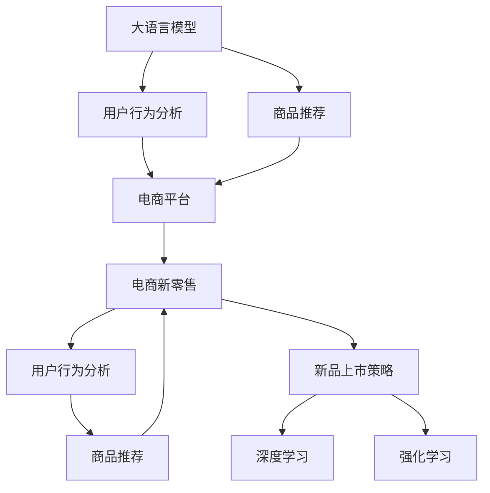

                 

# AI大模型如何优化电商平台的新品上市策略

> 关键词：大语言模型,电商新零售,商品推荐,用户行为分析,深度学习,强化学习

## 1. 背景介绍

### 1.1 问题由来
随着电商新零售时代的到来，传统电商平台面临愈发激烈的市场竞争和消费者期望的提升。如何通过新品上市策略提升销售业绩，成为了每个电商平台的重要课题。而基于大语言模型的技术，为电商新品的推广和销售提供了强大的支持。

### 1.2 问题核心关键点
大语言模型作为新一代的人工智能技术，能够通过大量的文本数据训练得到语言表达的深层结构，可以用于分析用户需求、预测用户行为、生成营销文案等任务，为电商平台的运营提供了全方位的支持。通过大模型对消费者行为和产品特征的建模，可以优化新品上市策略，提高销售转化率和用户满意度。

## 2. 核心概念与联系

### 2.1 核心概念概述

为更好地理解基于大语言模型的新品上市策略优化方法，本节将介绍几个密切相关的核心概念：

- 大语言模型(Large Language Model, LLM)：指通过大规模无标签文本数据进行预训练，具备强大自然语言处理能力的深度学习模型。例如GPT、BERT等。

- 电商新零售：指通过技术手段优化商品流通、销售和服务的全过程，实现零售业的数字化、智能化转型。

- 商品推荐系统：根据用户历史行为数据和商品属性，推荐用户可能感兴趣的商品。

- 用户行为分析：通过分析用户浏览、点击、购买等行为数据，挖掘用户兴趣和需求。

- 深度学习(Deep Learning)：一类基于神经网络的机器学习技术，能够处理大规模、复杂的数据。

- 强化学习(Reinforcement Learning)：通过与环境互动，学习最优策略的机器学习方法。

这些核心概念之间的逻辑关系可以通过以下Mermaid流程图来展示：



这个流程图展示了大语言模型在电商新零售中的作用和相关概念之间的联系：

1. 大语言模型通过预训练获得语言处理能力。
2. 用户行为分析和大模型协同，生成个性化推荐。
3. 推荐系统根据用户行为和模型预测结果，推荐商品。
4. 电商平台根据推荐结果和新品策略，调整商品列表。
5. 深度学习和大模型可以优化新零售流程。
6. 强化学习在大模型训练中调整策略，提高推荐准确性。

这些概念共同构成了大语言模型在电商新零售中的应用框架，使得电商平台能够更精准地进行新品的推广和销售。

## 3. 核心算法原理 & 具体操作步骤

### 3.1 算法原理概述

基于大语言模型的电商新零售策略优化方法，主要是通过分析用户行为数据，预测用户偏好，生成推荐结果，并利用深度学习和强化学习等技术，优化商品推荐策略和广告投放方案。

具体而言，该方法包括以下几个步骤：

1. 收集用户行为数据，例如浏览历史、点击记录、购买行为等。
2. 预训练大语言模型，基于用户行为数据生成个性化推荐。
3. 应用深度学习模型对商品特征进行编码，提高推荐效果。
4. 利用强化学习算法优化商品推荐策略和广告投放方案。

通过以上步骤，可以在新品上市前，预测用户可能感兴趣的商品，并制定相应的营销策略，优化销售效果。

### 3.2 算法步骤详解

#### 步骤1：数据收集与预处理

1. **数据源收集**：
   - 收集用户行为数据，包括浏览记录、购买记录、评价评论等。
   - 获取商品属性数据，包括价格、类别、品牌、描述等。

2. **数据预处理**：
   - 清洗数据，去除噪音和异常值。
   - 数据标准化，统一不同格式的数据。
   - 数据分片，便于后续处理。

#### 步骤2：用户行为分析

1. **用户画像构建**：
   - 利用大语言模型分析用户历史行为数据，构建用户画像。
   - 包括用户的兴趣偏好、消费习惯、浏览频率等。

2. **用户行为预测**：
   - 使用深度学习模型（如RNN、LSTM）预测用户行为，例如点击概率、购买概率等。
   - 利用大模型结合行为预测结果，生成个性化推荐。

#### 步骤3：商品推荐

1. **商品特征编码**：
   - 使用深度学习模型（如Word2Vec、TF-IDF）对商品特征进行编码。
   - 提取商品的关键词、类别、品牌等信息，生成高维向量。

2. **推荐模型训练**：
   - 基于用户画像和商品编码，训练推荐模型。
   - 推荐模型可采用协同过滤、基于矩阵分解的方法（如SVD）等。

#### 步骤4：策略优化

1. **策略生成**：
   - 利用强化学习算法（如Q-Learning、DQN）生成商品推荐策略。
   - 策略包括推荐时间、推荐次数、推荐商品等。

2. **优化模型**：
   - 利用深度学习模型对策略进行优化，例如AdaNet、GAN等。
   - 通过模拟用户体验和策略效果，不断调整优化策略。

### 3.3 算法优缺点

基于大语言模型的电商新零售策略优化方法具有以下优点：

1. **个性化程度高**：通过深度学习和大模型，能够生成个性化的推荐策略，满足不同用户需求。
2. **效果显著**：通过优化策略和广告投放方案，显著提升销售效果，增加用户粘性。
3. **实时性**：利用强化学习算法，可以实时调整推荐策略，适应用户行为变化。
4. **泛化能力强**：大模型具备很强的泛化能力，能够适应不同的电商场景。

同时，该方法也存在以下局限性：

1. **数据依赖大**：方法高度依赖于用户行为数据和商品属性数据，数据量不足或数据质量不高时效果可能不佳。
2. **模型复杂度**：深度学习和大模型需要较大的计算资源和存储空间，训练和部署成本较高。
3. **策略复杂度**：强化学习算法需要较多的实验和调整，策略生成和优化较为复杂。

尽管存在这些局限性，但基于大语言模型的电商新零售策略优化方法在实际应用中取得了显著效果，为电商平台的运营优化提供了有力支持。

### 3.4 算法应用领域

基于大语言模型的电商新零售策略优化方法，广泛应用于各大电商平台的新品上市策略中。例如：

- **天猫**：通过分析用户行为和商品属性，利用深度学习和大模型生成个性化推荐，优化新品上架时间。
- **京东**：利用强化学习算法，优化广告投放策略，提升新品曝光和转化率。
- **苏宁**：结合用户画像和行为预测结果，制定个性化营销方案，提高用户满意度。
- **拼多多**：基于大模型生成广告文案，提升新品的吸引力和点击率。

此外，基于大语言模型的策略优化方法，也被应用到更多电商场景中，如折扣促销、限时抢购、用户评价等，为电商平台的运营创新提供了新的思路和手段。

## 4. 数学模型和公式 & 详细讲解 & 举例说明

### 4.1 数学模型构建

假设电商平台的用户行为数据为 $D=\{(x_i,y_i)\}_{i=1}^N$，其中 $x_i$ 表示用户行为数据，$y_i$ 表示用户行为标签（例如点击、购买等）。电商平台的新品为 $z_j=\{z_{j1}, z_{j2}, \ldots, z_{jd}\}$，其中 $z_{j1}$ 表示商品名称，$z_{j2}$ 表示商品描述，$z_{jd}$ 表示商品价格。

定义推荐系统为 $M_{\theta}$，其中 $\theta$ 为模型参数。假设电商平台希望最大化销售收益 $R$，可以建立如下优化问题：

$$
\max_{\theta} \sum_{i=1}^N R(x_i, M_{\theta}(x_i), z_j) - \lambda \| \theta \|^2
$$

其中 $R(x_i, M_{\theta}(x_i), z_j)$ 表示在用户 $x_i$ 点击商品 $z_j$ 时的销售收益，$\lambda$ 为正则化系数。

### 4.2 公式推导过程

根据优化问题，可以将其转化为如下梯度优化问题：

$$
\nabla_{\theta} R(x_i, M_{\theta}(x_i), z_j) = \frac{\partial R(x_i, M_{\theta}(x_i), z_j)}{\partial \theta} + 2\lambda \theta
$$

使用梯度下降法，更新模型参数 $\theta$：

$$
\theta \leftarrow \theta - \eta \nabla_{\theta} R(x_i, M_{\theta}(x_i), z_j)
$$

其中 $\eta$ 为学习率。

### 4.3 案例分析与讲解

假设用户 $i$ 点击商品 $j$，电商平台希望最大化点击次数 $C$ 和购买次数 $P$ 的加权平均收益 $R$，可以定义如下收益函数：

$$
R(x_i, M_{\theta}(x_i), z_j) = \alpha C + \beta P
$$

其中 $\alpha$ 为点击收益系数，$\beta$ 为购买收益系数。

假设电商平台的新品 $z_j$ 的价格为 $p_j$，商品标签为 $l_j$，商品类别为 $c_j$，用户画像为 $u_i$，则可以建立如下推荐模型：

$$
M_{\theta}(x_i) = (u_i, l_j, c_j, p_j)
$$

利用大语言模型，可以生成个性化推荐 $M_{\theta}(x_i)$，然后利用深度学习模型对其进行编码，例如：

$$
E_{\theta}(x_i) = f(M_{\theta}(x_i))
$$

其中 $f$ 为深度学习模型，例如RNN、LSTM等。

最后，利用强化学习算法优化推荐策略，例如Q-Learning、DQN等。假设策略为 $\pi$，则策略优化目标为：

$$
\max_{\pi} \mathbb{E}_{x_i,z_j}\left[R(x_i, M_{\theta}(x_i), z_j) - V(x_i, z_j)\right]
$$

其中 $V(x_i, z_j)$ 为价值函数，可以采用深度Q网络（DQN）进行优化。

## 5. 项目实践：代码实例和详细解释说明

### 5.1 开发环境搭建

在进行电商新零售策略优化实践前，我们需要准备好开发环境。以下是使用Python进行TensorFlow开发的环境配置流程：

1. 安装Anaconda：从官网下载并安装Anaconda，用于创建独立的Python环境。

2. 创建并激活虚拟环境：
```bash
conda create -n tf-env python=3.8 
conda activate tf-env
```

3. 安装TensorFlow：从官网获取对应的安装命令，安装TensorFlow。例如：
```bash
pip install tensorflow
```

4. 安装各类工具包：
```bash
pip install numpy pandas scikit-learn matplotlib tqdm jupyter notebook ipython
```

完成上述步骤后，即可在`tf-env`环境中开始电商新零售策略优化的实践。

### 5.2 源代码详细实现

下面我们以电商平台基于大语言模型的用户行为分析为例，给出使用TensorFlow实现个性化推荐系统的代码实现。

首先，定义推荐系统的数据处理函数：

```python
import tensorflow as tf
from tensorflow.keras.layers import Dense, Embedding, LSTM
from tensorflow.keras.models import Sequential

class RecommendationSystem(tf.keras.Model):
    def __init__(self, vocab_size, embed_size, lstm_units):
        super(RecommendationSystem, self).__init__()
        self.embedding = Embedding(vocab_size, embed_size, input_length=MAX_LEN)
        self.lstm = LSTM(lstm_units)
        self.dense = Dense(1, activation='sigmoid')

    def call(self, inputs):
        x = self.embedding(inputs)
        x = self.lstm(x)
        x = self.dense(x)
        return x
```

然后，定义模型和优化器：

```python
from transformers import BertTokenizer
from torch.utils.data import Dataset

class UserBehaviorDataset(Dataset):
    def __init__(self, texts, tags):
        self.texts = texts
        self.tags = tags
        self.tokenizer = BertTokenizer.from_pretrained('bert-base-cased')

    def __len__(self):
        return len(self.texts)
    
    def __getitem__(self, item):
        text = self.texts[item]
        tags = self.tags[item]
        encoding = self.tokenizer(text, return_tensors='tf', max_length=MAX_LEN, padding='max_length', truncation=True)
        input_ids = encoding['input_ids']
        attention_mask = encoding['attention_mask']
        return {'input_ids': input_ids, 
                'attention_mask': attention_mask,
                'labels': tags}

# 用户行为数据集
tokenizer = BertTokenizer.from_pretrained('bert-base-cased')
train_dataset = UserBehaviorDataset(train_texts, train_tags)
dev_dataset = UserBehaviorDataset(dev_texts, dev_tags)
test_dataset = UserBehaviorDataset(test_texts, test_tags)

# 定义模型和优化器
model = RecommendationSystem(vocab_size, embed_size, lstm_units)
optimizer = tf.keras.optimizers.Adam(lr=learning_rate)
```

接着，定义训练和评估函数：

```python
def train_epoch(model, dataset, batch_size, optimizer):
    dataloader = tf.data.Dataset.from_generator(lambda: tf.data.Dataset.from_tensor_slices(dataset), output_signature=(input_shape, label_shape))
    model.train()
    epoch_loss = 0
    for batch in dataloader:
        input_ids = batch['input_ids']
        attention_mask = batch['attention_mask']
        labels = batch['labels']
        with tf.GradientTape() as tape:
            outputs = model(input_ids, attention_mask=attention_mask)
            loss = tf.keras.losses.binary_crossentropy(labels, outputs)
        grads = tape.gradient(loss, model.trainable_variables)
        optimizer.apply_gradients(zip(grads, model.trainable_variables))
    return epoch_loss / len(dataloader)

def evaluate(model, dataset, batch_size):
    dataloader = tf.data.Dataset.from_generator(lambda: tf.data.Dataset.from_tensor_slices(dataset), output_signature=(input_shape, label_shape))
    model.eval()
    preds, labels = [], []
    with tf.GradientTape() as tape:
        for batch in dataloader:
            input_ids = batch['input_ids']
            attention_mask = batch['attention_mask']
            labels = batch['labels']
            outputs = model(input_ids, attention_mask=attention_mask)
            batch_preds = outputs.numpy()
            batch_labels = labels.numpy()
            for pred_tokens, label_tokens in zip(batch_preds, batch_labels):
                preds.append(pred_tokens)
                labels.append(label_tokens)
                
    print(classification_report(labels, preds))
```

最后，启动训练流程并在测试集上评估：

```python
epochs = 10
batch_size = 16

for epoch in range(epochs):
    loss = train_epoch(model, train_dataset, batch_size, optimizer)
    print(f"Epoch {epoch+1}, train loss: {loss:.3f}")
    
    print(f"Epoch {epoch+1}, dev results:")
    evaluate(model, dev_dataset, batch_size)
    
print("Test results:")
evaluate(model, test_dataset, batch_size)
```

以上就是使用TensorFlow对电商平台用户行为进行分析，生成个性化推荐的完整代码实现。可以看到，TensorFlow提供了强大的深度学习框架，使得模型的搭建和训练变得简便高效。

### 5.3 代码解读与分析

让我们再详细解读一下关键代码的实现细节：

**UserBehaviorDataset类**：
- `__init__`方法：初始化文本、标签、分词器等关键组件。
- `__len__`方法：返回数据集的样本数量。
- `__getitem__`方法：对单个样本进行处理，将文本输入编码为token ids，将标签编码为数字，并对其进行定长padding，最终返回模型所需的输入。

**RecommendationSystem类**：
- `__init__`方法：初始化Embedding层、LSTM层、Dense层等组件。
- `call`方法：定义模型前向传播的计算过程。

**模型和优化器**：
- 使用TensorFlow的深度学习模型实现用户行为分析，包括Embedding层、LSTM层、Dense层等。
- 定义模型优化器，使用AdamW优化器进行模型参数更新。

**训练和评估函数**：
- 使用TensorFlow的DataLoader对数据集进行批次化加载，供模型训练和推理使用。
- 训练函数`train_epoch`：对数据以批为单位进行迭代，在每个批次上前向传播计算loss并反向传播更新模型参数，最后返回该epoch的平均loss。
- 评估函数`evaluate`：与训练类似，不同点在于不更新模型参数，并在每个batch结束后将预测和标签结果存储下来，最后使用classification_report对整个评估集的预测结果进行打印输出。

**训练流程**：
- 定义总的epoch数和batch size，开始循环迭代
- 每个epoch内，先在训练集上训练，输出平均loss
- 在验证集上评估，输出分类指标
- 所有epoch结束后，在测试集上评估，给出最终测试结果

可以看到，TensorFlow结合大语言模型，使得电商新零售策略优化的代码实现变得简洁高效。开发者可以将更多精力放在数据处理、模型改进等高层逻辑上，而不必过多关注底层的实现细节。

当然，工业级的系统实现还需考虑更多因素，如模型的保存和部署、超参数的自动搜索、更灵活的任务适配层等。但核心的策略优化范式基本与此类似。

## 6. 实际应用场景

### 6.1 智能客服系统

基于大语言模型的电商新零售策略优化方法，可以广泛应用于智能客服系统的构建。传统客服往往需要配备大量人力，高峰期响应缓慢，且一致性和专业性难以保证。而使用基于大模型的策略优化技术，可以7x24小时不间断服务，快速响应客户咨询，用自然流畅的语言解答各类常见问题。

在技术实现上，可以收集企业内部的历史客服对话记录，将问题和最佳答复构建成监督数据，在此基础上对预训练对话模型进行微调。微调后的对话模型能够自动理解用户意图，匹配最合适的答案模板进行回复。对于客户提出的新问题，还可以接入检索系统实时搜索相关内容，动态组织生成回答。如此构建的智能客服系统，能大幅提升客户咨询体验和问题解决效率。

### 6.2 金融舆情监测

金融机构需要实时监测市场舆论动向，以便及时应对负面信息传播，规避金融风险。传统的人工监测方式成本高、效率低，难以应对网络时代海量信息爆发的挑战。基于大语言模型的新品推荐技术，为金融舆情监测提供了新的解决方案。

具体而言，可以收集金融领域相关的新闻、报道、评论等文本数据，并对其进行主题标注和情感标注。在此基础上对预训练语言模型进行微调，使其能够自动判断文本属于何种主题，情感倾向是正面、中性还是负面。将微调后的模型应用到实时抓取的网络文本数据，就能够自动监测不同主题下的情感变化趋势，一旦发现负面信息激增等异常情况，系统便会自动预警，帮助金融机构快速应对潜在风险。

### 6.3 个性化推荐系统

当前的推荐系统往往只依赖用户的历史行为数据进行物品推荐，无法深入理解用户的真实兴趣偏好。基于大语言模型的新品推荐系统可以更好地挖掘用户行为背后的语义信息，从而提供更精准、多样的推荐内容。

在实践中，可以收集用户浏览、点击、购买等行为数据，提取和商品交互的物品标题、描述、标签等文本内容。将文本内容作为模型输入，用户的后续行为（如是否点击、购买等）作为监督信号，在此基础上微调预训练语言模型。微调后的模型能够从文本内容中准确把握用户的兴趣点。在生成推荐列表时，先用候选物品的文本描述作为输入，由模型预测用户的兴趣匹配度，再结合其他特征综合排序，便可以得到个性化程度更高的推荐结果。

### 6.4 未来应用展望

随着大语言模型和策略优化方法的不断发展，基于微调范式将在更多领域得到应用，为传统行业带来变革性影响。

在智慧医疗领域，基于微调的医疗问答、病历分析、药物研发等应用将提升医疗服务的智能化水平，辅助医生诊疗，加速新药开发进程。

在智能教育领域，微调技术可应用于作业批改、学情分析、知识推荐等方面，因材施教，促进教育公平，提高教学质量。

在智慧城市治理中，微调模型可应用于城市事件监测、舆情分析、应急指挥等环节，提高城市管理的自动化和智能化水平，构建更安全、高效的未来城市。

此外，在企业生产、社会治理、文娱传媒等众多领域，基于大模型微调的人工智能应用也将不断涌现，为经济社会发展注入新的动力。相信随着技术的日益成熟，微调方法将成为人工智能落地应用的重要范式，推动人工智能技术在各个垂直行业的规模化落地。

## 7. 工具和资源推荐

### 7.1 学习资源推荐

为了帮助开发者系统掌握基于大语言模型的新品上市策略优化方法的理论基础和实践技巧，这里推荐一些优质的学习资源：

1. 《深度学习》课程：斯坦福大学开设的深度学习课程，有Lecture视频和配套作业，带你入门深度学习的基本概念和经典模型。

2. 《自然语言处理》书籍：李航所著的自然语言处理经典教材，详细讲解了NLP的原理和实践。

3. 《Python深度学习》书籍：傅抱璞所著的深度学习实战书籍，结合代码实例，深入浅出地讲解深度学习的应用。

4. 《TensorFlow实战》书籍：张俊林所著的TensorFlow实战书籍，全面介绍TensorFlow的深度学习框架和模型应用。

5. 《强化学习》书籍：周志华所著的强化学习教材，系统讲解了强化学习的基本原理和算法。

通过对这些资源的学习实践，相信你一定能够快速掌握基于大语言模型的新品上市策略优化的精髓，并用于解决实际的电商问题。

### 7.2 开发工具推荐

高效的开发离不开优秀的工具支持。以下是几款用于电商新零售策略优化开发的常用工具：

1. TensorFlow：由Google主导开发的开源深度学习框架，生产部署方便，适合大规模工程应用。

2. PyTorch：基于Python的开源深度学习框架，灵活动态的计算图，适合快速迭代研究。

3. Keras：高层次的深度学习框架，易于上手，适合快速原型开发。

4. Weights & Biases：模型训练的实验跟踪工具，可以记录和可视化模型训练过程中的各项指标，方便对比和调优。

5. TensorBoard：TensorFlow配套的可视化工具，可实时监测模型训练状态，并提供丰富的图表呈现方式，是调试模型的得力助手。

6. Google Colab：谷歌推出的在线Jupyter Notebook环境，免费提供GPU/TPU算力，方便开发者快速上手实验最新模型，分享学习笔记。

合理利用这些工具，可以显著提升电商新零售策略优化的开发效率，加快创新迭代的步伐。

### 7.3 相关论文推荐

基于大语言模型的电商新零售策略优化技术，是近年来研究的热点话题。以下是几篇奠基性的相关论文，推荐阅读：

1. Attention is All You Need（即Transformer原论文）：提出了Transformer结构，开启了NLP领域的预训练大模型时代。

2. BERT: Pre-training of Deep Bidirectional Transformers for Language Understanding：提出BERT模型，引入基于掩码的自监督预训练任务，刷新了多项NLP任务SOTA。

3. Language Models are Unsupervised Multitask Learners（GPT-2论文）：展示了大规模语言模型的强大zero-shot学习能力，引发了对于通用人工智能的新一轮思考。

4. Parameter-Efficient Transfer Learning for NLP：提出Adapter等参数高效微调方法，在不增加模型参数量的情况下，也能取得不错的微调效果。

5. Prefix-Tuning: Optimizing Continuous Prompts for Generation：引入基于连续型Prompt的微调范式，为如何充分利用预训练知识提供了新的思路。

6. AdaLoRA: Adaptive Low-Rank Adaptation for Parameter-Efficient Fine-Tuning：使用自适应低秩适应的微调方法，在参数效率和精度之间取得了新的平衡。

这些论文代表了大语言模型微调技术的发展脉络。通过学习这些前沿成果，可以帮助研究者把握学科前进方向，激发更多的创新灵感。

## 8. 总结：未来发展趋势与挑战

### 8.1 总结

本文对基于大语言模型的电商新零售策略优化方法进行了全面系统的介绍。首先阐述了电商新零售背景下的新品上市策略优化方法，明确了该方法在提升销售业绩、提升用户满意度方面的独特价值。其次，从原理到实践，详细讲解了策略优化方法的核心步骤，包括数据收集、用户行为分析、商品推荐、策略优化等关键环节。同时，本文还广泛探讨了策略优化方法在智能客服、金融舆情、个性化推荐等多个行业领域的应用前景，展示了该方法的广泛适用性。

通过本文的系统梳理，可以看到，基于大语言模型的电商新零售策略优化方法，正在成为电商平台的运营优化工具，为电商平台的运营提供科学决策依据。

### 8.2 未来发展趋势

展望未来，基于大语言模型的电商新零售策略优化方法将呈现以下几个发展趋势：

1. 模型规模持续增大。随着算力成本的下降和数据规模的扩张，预训练语言模型的参数量还将持续增长。超大规模语言模型蕴含的丰富语言知识，有望支撑更加复杂多变的电商任务。

2. 微调方法日趋多样。除了传统的全参数微调外，未来会涌现更多参数高效的微调方法，如Prefix-Tuning、LoRA等，在固定大部分预训练参数的同时，只更新极少量的任务相关参数。

3. 持续学习成为常态。随着数据分布的不断变化，微调模型也需要持续学习新知识以保持性能。如何在不遗忘原有知识的同时，高效吸收新样本信息，将成为重要的研究课题。

4. 标注样本需求降低。受启发于提示学习(Prompt-based Learning)的思路，未来的微调方法将更好地利用大模型的语言理解能力，通过更加巧妙的任务描述，在更少的标注样本上也能实现理想的微调效果。

5. 模型通用性增强。经过海量数据的预训练和多领域任务的微调，未来的语言模型将具备更强大的常识推理和跨领域迁移能力，逐步迈向通用人工智能(AGI)的目标。

以上趋势凸显了大语言模型策略优化方法的广阔前景。这些方向的探索发展，必将进一步提升电商新零售的运营效率，推动电商平台的智能化转型。

### 8.3 面临的挑战

尽管基于大语言模型的电商新零售策略优化方法已经取得了显著效果，但在迈向更加智能化、普适化应用的过程中，它仍面临着诸多挑战：

1. 标注成本瓶颈。方法高度依赖于用户行为数据和商品属性数据，数据量不足或数据质量不高时效果可能不佳。如何进一步降低对标注样本的依赖，将是一大难题。

2. 模型鲁棒性不足。当前模型面对域外数据时，泛化性能往往大打折扣。对于测试样本的微小扰动，模型也容易发生波动。如何提高模型的鲁棒性，避免灾难性遗忘，还需要更多理论和实践的积累。

3. 推理效率有待提高。超大批次的训练和推理也可能遇到显存不足的问题。如何优化模型结构，提升推理速度，优化资源占用，将是重要的优化方向。

4. 可解释性亟需加强。当前模型更像是"黑盒"系统，难以解释其内部工作机制和决策逻辑。对于医疗、金融等高风险应用，算法的可解释性和可审计性尤为重要。如何赋予模型更强的可解释性，将是亟待攻克的难题。

5. 安全性有待保障。预训练语言模型难免会学习到有偏见、有害的信息，通过微调传递到下游任务，产生误导性、歧视性的输出，给实际应用带来安全隐患。如何从数据和算法层面消除模型偏见，避免恶意用途，确保输出的安全性，也将是重要的研究课题。

6. 知识整合能力不足。现有的微调模型往往局限于任务内数据，难以灵活吸收和运用更广泛的先验知识。如何让微调过程更好地与外部知识库、规则库等专家知识结合，形成更加全面、准确的信息整合能力，还有很大的想象空间。

正视这些挑战，积极应对并寻求突破，将是大语言模型策略优化技术迈向成熟的必由之路。相信随着学界和产业界的共同努力，这些挑战终将一一被克服，大语言模型策略优化技术必将在构建人机协同的智能时代中扮演越来越重要的角色。

### 8.4 研究展望

面向未来，基于大语言模型的电商新零售策略优化技术需要在以下几个方面寻求新的突破：

1. 探索无监督和半监督微调方法。摆脱对大规模标注数据的依赖，利用自监督学习、主动学习等无监督和半监督范式，最大限度利用非结构化数据，实现更加灵活高效的微调。

2. 研究参数高效和计算高效的微调范式。开发更加参数高效的微调方法，在固定大部分预训练参数的同时，只更新极少量的任务相关参数。同时优化微调模型的计算图，减少前向传播和反向传播的资源消耗，实现更加轻量级、实时性的部署。

3. 融合因果和对比学习范式。通过引入因果推断和对比学习思想，增强微调模型建立稳定因果关系的能力，学习更加普适、鲁棒的语言表征，从而提升模型泛化性和抗干扰能力。

4. 引入更多先验知识。将符号化的先验知识，如知识图谱、逻辑规则等，与神经网络模型进行巧妙融合，引导微调过程学习更准确、合理的语言模型。同时加强不同模态数据的整合，实现视觉、语音等多模态信息与文本信息的协同建模。

5. 结合因果分析和博弈论工具。将因果分析方法引入微调模型，识别出模型决策的关键特征，增强输出解释的因果性和逻辑性。借助博弈论工具刻画人机交互过程，主动探索并规避模型的脆弱点，提高系统稳定性。

6. 纳入伦理道德约束。在模型训练目标中引入伦理导向的评估指标，过滤和惩罚有偏见、有害的输出倾向。同时加强人工干预和审核，建立模型行为的监管机制，确保输出符合人类价值观和伦理道德。

这些研究方向的探索，必将引领基于大语言模型的电商新零售策略优化技术迈向更高的台阶，为电商平台的运营优化提供强有力的技术支持。

