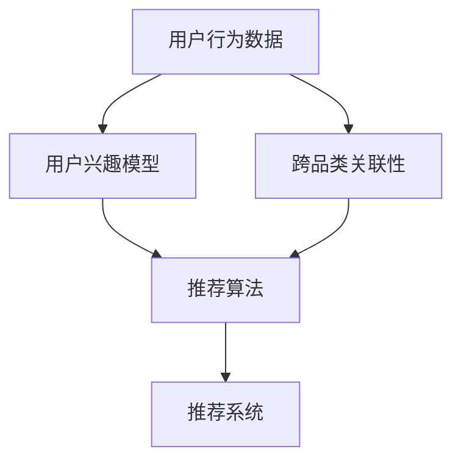

                 

## 1. 背景介绍

### 1.1 问题由来

随着电子商务市场的不断发展，电商平台的推荐系统已经成为支撑用户购物决策的重要工具。推荐系统能够根据用户历史行为和兴趣，实时推荐符合其需求的商品，提升用户体验和平台转化率。然而，传统的推荐系统往往以单一品类为单位进行推荐，难以覆盖用户多样化的需求，容易陷入“信息茧房”。

为了解决这一问题，电商平台开始探索跨品类推荐技术，即通过对用户多品类历史行为数据的建模，发现用户跨品类购买关联性，从而实现跨品类商品推荐。这一方法不仅能够提升用户购物体验，还能大幅增加平台商品的曝光和销量。

### 1.2 问题核心关键点

跨品类推荐的核心在于如何从用户的历史行为数据中挖掘出跨品类关联性，并根据这些关联性进行推荐。具体步骤如下：

1. **数据收集与预处理**：收集用户多品类购买历史数据，并进行清洗和归一化处理。
2. **用户兴趣模型构建**：通过用户行为数据训练模型，发现用户在不同品类间的关系。
3. **跨品类关联性挖掘**：使用大语言模型或深度学习算法，从用户行为数据中挖掘出跨品类关联性。
4. **推荐模型构建**：根据用户兴趣模型和跨品类关联性，构建跨品类推荐模型。
5. **实时推荐**：将用户兴趣模型和推荐模型集成到推荐系统中，实时对用户进行跨品类推荐。

### 1.3 问题研究意义

跨品类推荐技术能够在很大程度上缓解用户的“信息茧房”问题，提升平台的用户体验和销售额。具体来说，它可以：

- **提高用户满意度**：通过跨品类推荐，满足用户的多样化需求，提升用户购物满意度。
- **增加商品曝光**：跨品类推荐使得更多商品能够被用户发现，增加了平台的商品曝光率。
- **提升销量转化**：推荐系统能够识别用户跨品类购买意愿，提升非相关品类的销量转化率。
- **优化资源配置**：通过对用户行为数据的深度挖掘，优化平台商品的库存和促销资源配置。

## 2. 核心概念与联系

### 2.1 核心概念概述

为了更好地理解跨品类推荐技术，本节将介绍几个密切相关的核心概念：

- **用户行为数据**：指用户在电商平台上的所有交互记录，包括浏览、点击、购买、评价等行为。
- **用户兴趣模型**：通过对用户行为数据的建模，发现用户在不同品类间的兴趣偏好。
- **跨品类关联性**：指用户在不同品类间购买行为的相关性，如某用户在购买某品类商品后，继续购买其他品类商品的概率。
- **推荐算法**：根据用户兴趣模型和跨品类关联性，构建推荐模型，实现个性化推荐。
- **推荐系统**：将推荐算法集成到电商平台的推荐模块中，实时对用户进行商品推荐。

这些核心概念之间的逻辑关系可以通过以下Mermaid流程图来展示：



这个流程图展示了这个核心概念框架，即：从用户行为数据出发，构建用户兴趣模型和跨品类关联性，再利用这些信息构建推荐算法，最终通过推荐系统实现实时推荐。

## 3. 核心算法原理 & 具体操作步骤

### 3.1 算法原理概述

跨品类推荐的核心在于发现用户跨品类购买关联性，并据此进行推荐。其核心思想是：通过分析用户在不同品类间的购买行为，构建用户兴趣模型，挖掘出跨品类关联性，并根据这些关联性进行推荐。

形式化地，假设用户行为数据为 $D=\{(x_i,y_i)\}_{i=1}^N$，其中 $x_i$ 为用户行为记录，$y_i$ 为购买品类。跨品类推荐的目标是找到最优的推荐模型 $f$，使得推荐结果 $f(x_i)$ 尽可能符合用户购买品类 $y_i$。

具体的，推荐的优化目标是最小化预测误差：

$$
\min_{f} \sum_{i=1}^N \ell(f(x_i), y_i)
$$

其中 $\ell$ 为损失函数，常用的有均方误差、交叉熵等。

### 3.2 算法步骤详解

跨品类推荐的一般步骤如下：

**Step 1: 数据收集与预处理**

- 收集用户的多品类购买历史数据，包括用户ID、品类ID、购买时间等。
- 对数据进行清洗，去除异常值和缺失值，进行归一化处理。

**Step 2: 用户兴趣模型构建**

- 选择合适的机器学习模型（如协同过滤、内容推荐等），基于用户行为数据训练用户兴趣模型。
- 用户兴趣模型 $f_u$ 可以表示为：
$$
f_u(x_i) = \text{BERT}(\text{UserID}, \text{Context}, x_i)
$$
其中 $\text{UserID}$ 为用户的ID，$\text{Context}$ 为用户行为上下文，$x_i$ 为行为记录。

**Step 3: 跨品类关联性挖掘**

- 使用大语言模型或深度学习算法，从用户行为数据中挖掘出跨品类关联性。
- 常用的深度学习算法包括GRU、LSTM、RNN等，用于对用户行为序列进行建模。
- 常用的深度学习框架包括TensorFlow、PyTorch等，用于实现和训练这些模型。

**Step 4: 推荐模型构建**

- 根据用户兴趣模型和跨品类关联性，构建推荐模型。
- 推荐模型 $f_r$ 可以表示为：
$$
f_r(x_i) = \text{BERT}(\text{UserID}, \text{Context}, x_i, f_u(x_i))
$$
其中 $f_u(x_i)$ 为用户兴趣模型，$f_r(x_i)$ 为推荐模型。

**Step 5: 实时推荐**

- 将用户兴趣模型和推荐模型集成到推荐系统中，实时对用户进行跨品类推荐。
- 推荐系统可以通过实时查询用户兴趣模型和推荐模型，生成推荐列表。

### 3.3 算法优缺点

跨品类推荐的算法具有以下优点：

1. **提升用户体验**：通过跨品类推荐，用户能够发现更多感兴趣的商品，提升购物体验。
2. **增加商品曝光**：跨品类推荐能够将不同品类的商品推荐给同一用户，增加商品的曝光率。
3. **优化资源配置**：通过用户行为数据建模，优化商品库存和促销资源的配置，提升销售效率。

但同时也存在一些缺点：

1. **数据质量依赖高**：跨品类推荐对用户行为数据的完整性和准确性有较高要求，数据质量不佳可能导致推荐效果不佳。
2. **计算资源消耗大**：用户行为数据量大，深度学习算法计算复杂度高，训练和推理过程资源消耗大。
3. **模型可解释性差**：推荐模型通常为黑盒模型，难以解释推荐结果的依据，给用户信任度带来挑战。
4. **隐私问题**：用户行为数据涉及用户隐私，需要确保数据安全和隐私保护。

### 3.4 算法应用领域

跨品类推荐技术在电商领域有广泛的应用前景，具体包括：

- **多品类商品推荐**：在用户浏览或购买某品类商品时，推荐相关其他品类商品。
- **跨品类销售活动**：在节假日或促销活动期间，根据用户历史行为推荐跨品类促销商品。
- **个性化定制推荐**：根据用户的多品类购买历史，生成个性化的跨品类推荐列表。
- **新用户引导**：在用户首次注册或新用户登录时，推荐相关品类商品，提升新用户留存率。

除了电商领域，跨品类推荐技术在其他领域也有潜在应用，如旅游、电影、音乐等，能够帮助平台提升用户粘性和满意度。

## 4. 数学模型和公式 & 详细讲解 & 举例说明

### 4.1 数学模型构建

本节将使用数学语言对跨品类推荐过程进行更加严格的刻画。

假设用户行为数据为 $D=\{(x_i,y_i)\}_{i=1}^N$，其中 $x_i$ 为用户行为记录，$y_i$ 为购买品类。我们希望构建推荐模型 $f_r$，使得 $f_r(x_i)$ 尽可能符合用户购买品类 $y_i$。推荐模型的损失函数为：

$$
\mathcal{L}(f_r) = \frac{1}{N} \sum_{i=1}^N \ell(f_r(x_i), y_i)
$$

其中 $\ell$ 为损失函数，常用的有均方误差、交叉熵等。

### 4.2 公式推导过程

以下我们以交叉熵损失函数为例，推导推荐模型的损失函数。

假设推荐模型 $f_r$ 在输入 $x_i$ 上的输出为 $\hat{y}=f_r(x_i) \in [0,1]$，表示用户购买品类 $y_i$ 的概率。真实标签 $y \in \{0,1\}$。则交叉熵损失函数定义为：

$$
\ell(f_r(x_i),y) = -[y\log \hat{y} + (1-y)\log (1-\hat{y})]
$$

将其代入推荐模型的损失函数公式，得：

$$
\mathcal{L}(f_r) = -\frac{1}{N}\sum_{i=1}^N [y_i\log f_r(x_i)+(1-y_i)\log(1-f_r(x_i))]
$$

在得到推荐模型的损失函数后，即可通过梯度下降等优化算法，最小化损失函数，更新推荐模型的参数，直至收敛。

### 4.3 案例分析与讲解

假设我们有一个电商平台，收集到了用户的多品类购买历史数据。通过用户行为数据训练得到一个用户兴趣模型 $f_u$，用于预测用户对某品类商品的兴趣程度。然后，使用LSTM模型从用户行为数据中挖掘出跨品类关联性，得到推荐模型 $f_r$。最终，将用户兴趣模型和推荐模型集成到推荐系统中，实时对用户进行跨品类推荐。

为了验证推荐效果，我们可以对推荐模型进行评估。假设我们的推荐模型推荐某用户购买A品类商品，但实际上用户购买了B品类商品，此时推荐模型的预测误差为：

$$
\epsilon = \log f_r(x_i) - \log y_i
$$

我们可以通过计算推荐模型在所有测试数据上的平均误差，评估推荐模型的性能。如果平均误差越小，说明推荐模型的效果越好。

## 5. 项目实践：代码实例和详细解释说明

### 5.1 开发环境搭建

在进行跨品类推荐实践前，我们需要准备好开发环境。以下是使用Python进行TensorFlow开发的环境配置流程：

1. 安装Anaconda：从官网下载并安装Anaconda，用于创建独立的Python环境。

2. 创建并激活虚拟环境：
```bash
conda create -n tf-env python=3.8 
conda activate tf-env
```

3. 安装TensorFlow：根据CUDA版本，从官网获取对应的安装命令。例如：
```bash
conda install tensorflow -c tf
```

4. 安装相关库：
```bash
pip install numpy pandas sklearn scikit-learn tensorflow
```

5. 安装必要的工具：
```bash
pip install torch torchtext transformers tqdm
```

6. 安装TFT模型库：
```bash
pip install tensorflow-addons -U
```

完成上述步骤后，即可在`tf-env`环境中开始跨品类推荐实践。

### 5.2 源代码详细实现

下面我们以LSTM模型为例，给出使用TensorFlow对电商平台进行跨品类推荐的任务开发的完整代码实现。

```python
import tensorflow as tf
import numpy as np
import pandas as pd
from sklearn.model_selection import train_test_split
from tensorflow.keras.layers import LSTM, Dense, Embedding
from tensorflow.keras.models import Sequential

# 定义数据加载函数
def load_data():
    # 读取用户行为数据
    data = pd.read_csv('user_behavior.csv')
    # 提取用户ID、品类ID、行为时间等特征
    user_id = data['user_id']
    item_id = data['item_id']
    time = data['time']
    # 将数据划分为训练集和测试集
    train_data, test_data = train_test_split(data, test_size=0.2, shuffle=True)
    return user_id, item_id, time, train_data, test_data

# 定义数据预处理函数
def preprocess_data(user_id, item_id, time, train_data, test_data):
    # 对用户ID、品类ID进行编码
    user_id_dict = {}
    item_id_dict = {}
    user_id = user_id.apply(lambda x: user_id_dict.setdefault(x, len(user_id_dict)))
    item_id = item_id.apply(lambda x: item_id_dict.setdefault(x, len(item_id_dict)))
    # 对用户行为数据进行归一化处理
    train_data['user_id'] = user_id
    train_data['item_id'] = item_id
    train_data['time'] = time
    train_data['user_id'] = train_data['user_id'].astype('int32')
    train_data['item_id'] = train_data['item_id'].astype('int32')
    test_data['user_id'] = user_id
    test_data['item_id'] = item_id
    test_data['time'] = time
    test_data['user_id'] = test_data['user_id'].astype('int32')
    test_data['item_id'] = test_data['item_id'].astype('int32')
    # 构建交叉表，统计用户行为次数
    train_data = pd.crosstab(train_data['user_id'], train_data['item_id'], normalize=True)
    test_data = pd.crosstab(test_data['user_id'], test_data['item_id'], normalize=True)
    # 构建用户行为序列，填充缺失值
    train_data = train_data.fillna(0)
    test_data = test_data.fillna(0)
    return train_data, test_data

# 定义模型构建函数
def build_model(train_data, test_data):
    # 构建用户行为序列模型
    sequence_length = 10
    num_users = len(train_data.index)
    num_items = len(train_data.columns)
    model = Sequential()
    model.add(Embedding(num_users, 100, input_length=sequence_length))
    model.add(LSTM(100))
    model.add(Dense(1, activation='sigmoid'))
    model.compile(loss='binary_crossentropy', optimizer='adam', metrics=['accuracy'])
    return model

# 定义模型训练函数
def train_model(model, train_data, test_data):
    model.fit(train_data, epochs=10, validation_data=test_data)
    return model

# 定义模型评估函数
def evaluate_model(model, test_data):
    test_preds = model.predict(test_data)
    test_preds = np.where(test_preds > 0.5, 1, 0)
    test_labels = np.array(test_data.values)
    return test_preds, test_labels

# 加载数据并预处理
user_id, item_id, time, train_data, test_data = load_data()
train_data, test_data = preprocess_data(user_id, item_id, time, train_data, test_data)

# 构建模型并训练
model = build_model(train_data, test_data)
history = train_model(model, train_data, test_data)

# 评估模型
test_preds, test_labels = evaluate_model(model, test_data)
accuracy = np.mean(test_preds == test_labels)
print('Accuracy:', accuracy)
```

以上代码实现了基于LSTM模型的电商平台跨品类推荐任务。在实践中，用户行为数据预处理、模型构建、训练、评估等步骤都需要结合具体业务需求进行调整。

### 5.3 代码解读与分析

让我们再详细解读一下关键代码的实现细节：

**load_data函数**：
- 从CSV文件中读取用户行为数据。
- 提取用户ID、品类ID、行为时间等特征。
- 将数据划分为训练集和测试集。

**preprocess_data函数**：
- 对用户ID、品类ID进行编码，构建交叉表统计用户行为次数。
- 对用户行为数据进行归一化处理，填充缺失值。

**build_model函数**：
- 构建用户行为序列模型，包括嵌入层、LSTM层、全连接层等。
- 设置损失函数、优化器、评估指标等，编译模型。

**train_model函数**：
- 使用训练集数据对模型进行训练，设置验证集和迭代次数。

**evaluate_model函数**：
- 对测试集数据进行模型预测，计算预测准确率。

这些关键函数在实现过程中，重点在于对用户行为数据的处理和模型架构的设计。在实践中，还需要根据具体业务需求，选择适当的模型架构、超参数配置和优化算法，以达到最优的推荐效果。

## 6. 实际应用场景

### 6.1 智能推荐系统

跨品类推荐技术在智能推荐系统中有着广泛应用。电商平台的推荐系统能够根据用户的历史行为数据，预测用户对某品类商品的兴趣程度，并根据兴趣程度进行跨品类推荐。

具体来说，推荐系统可以对用户的行为数据进行建模，发现用户在不同品类间的购买关联性，并通过这些关联性进行跨品类推荐。例如，在用户浏览某品类商品时，推荐相关其他品类商品；或者在节假日或促销活动期间，推荐用户可能感兴趣的新品类商品。

### 6.2 个性化推荐服务

个性化推荐服务是电商平台提升用户体验的重要手段。通过跨品类推荐技术，推荐系统能够根据用户的多品类购买历史，生成个性化的跨品类推荐列表。这种推荐方法不仅能够满足用户的多样化需求，还能提升用户的购物体验和满意度。

例如，用户在浏览某品类商品时，推荐系统可以基于用户的历史购买记录，推荐用户可能感兴趣的其他品类商品。这种推荐方法不仅能够增加商品的曝光率，还能提升用户的购买意愿和转化率。

### 6.3 新用户引导服务

新用户引导服务是电商平台吸引新用户的重要手段。通过跨品类推荐技术，推荐系统可以在用户首次注册或新用户登录时，推荐相关品类商品，提升新用户的留存率和转化率。

例如，用户在注册时，推荐系统可以根据用户的行为数据，推荐用户可能感兴趣的其他品类商品。这种推荐方法能够帮助新用户更快地找到感兴趣的商品，提升用户的购物体验和满意度，从而提升新用户的留存率和活跃度。

### 6.4 未来应用展望

随着跨品类推荐技术的不断发展，未来在电商、金融、医疗、教育等更多领域将有广泛应用。

在智慧医疗领域，推荐系统可以基于用户的历史健康数据，推荐相关药物、检查等医疗服务，提升用户的健康管理水平。

在智能教育领域，推荐系统可以根据学生的学习行为数据，推荐相关课程、教材等学习资源，提升学生的学习效果和满意度。

在智慧金融领域，推荐系统可以根据用户的理财行为数据，推荐相关理财产品、投资策略等，提升用户的理财效果和满意度。

这些领域的应用前景广阔，跨品类推荐技术将成为提升用户体验和业务效果的重要手段。未来，随着技术的不断演进，推荐系统将更加智能、高效、个性化，为用户带来更好的服务体验。

## 7. 工具和资源推荐

### 7.1 学习资源推荐

为了帮助开发者系统掌握跨品类推荐技术，这里推荐一些优质的学习资源：

1. **《深度学习与推荐系统》**：该书系统介绍了推荐系统的工作原理和推荐算法，适合初学者入门。
2. **《推荐系统实战》**：该书提供了丰富的案例和实践指导，帮助开发者将理论应用到实际项目中。
3. **《自然语言处理与推荐系统》**：该书结合自然语言处理和推荐系统，探讨了跨品类推荐的应用。
4. **TensorFlow官方文档**：提供详细的API文档和示例代码，适合初学者入门。
5. **Kaggle竞赛**：参加跨品类推荐相关的竞赛，实战练习推荐算法，积累经验。

通过对这些资源的学习实践，相信你一定能够快速掌握跨品类推荐技术的精髓，并用于解决实际的推荐问题。

### 7.2 开发工具推荐

高效的开发离不开优秀的工具支持。以下是几款用于跨品类推荐开发的常用工具：

1. **TensorFlow**：Google开发的开源深度学习框架，生产部署方便，适合大规模工程应用。
2. **PyTorch**：Facebook开发的开源深度学习框架，灵活动态的计算图，适合快速迭代研究。
3. **Keras**：基于TensorFlow和Theano的高级神经网络API，方便快速搭建模型。
4. **TensorBoard**：TensorFlow配套的可视化工具，可实时监测模型训练状态，提供丰富的图表呈现方式。
5. **Jupyter Notebook**：开源的交互式笔记本，支持多种编程语言和数据格式，适合数据科学研究和共享。

合理利用这些工具，可以显著提升跨品类推荐任务的开发效率，加快创新迭代的步伐。

### 7.3 相关论文推荐

跨品类推荐技术的发展源于学界的持续研究。以下是几篇奠基性的相关论文，推荐阅读：

1. **《推荐系统的协同过滤》**：介绍了协同过滤算法的原理和实现，是推荐系统中的经典算法之一。
2. **《深度学习与推荐系统》**：讨论了深度学习在推荐系统中的应用，包括神经网络、自编码器等方法。
3. **《用户行为数据分析》**：探讨了用户行为数据的建模和分析，是跨品类推荐的基础。
4. **《跨品类推荐算法》**：介绍了多种跨品类推荐算法，包括协同过滤、深度学习等。
5. **《用户行为序列建模》**：讨论了用户行为序列的建模方法，如LSTM、GRU等。

这些论文代表了大规模推荐系统的研究方向，通过学习这些前沿成果，可以帮助研究者把握学科前进方向，激发更多的创新灵感。

## 8. 总结：未来发展趋势与挑战

### 8.1 总结

本文对基于大模型的跨品类推荐技术进行了全面系统的介绍。首先阐述了跨品类推荐技术的研究背景和意义，明确了其在提升用户体验和业务效果方面的独特价值。其次，从原理到实践，详细讲解了推荐模型的构建、训练、评估等关键步骤，给出了跨品类推荐任务开发的完整代码实例。同时，本文还广泛探讨了跨品类推荐技术在电商、金融、医疗等领域的实际应用场景，展示了跨品类推荐技术的广阔前景。

通过本文的系统梳理，可以看到，基于大模型的跨品类推荐技术能够显著提升用户购物体验和业务效果，在电商领域具有广泛的应用前景。未来，随着推荐系统的不断演进，跨品类推荐技术将成为推动电商、金融、医疗等更多领域业务增长的重要手段。

### 8.2 未来发展趋势

展望未来，跨品类推荐技术将呈现以下几个发展趋势：

1. **模型规模持续增大**：随着算力成本的下降和数据规模的扩张，推荐模型的参数量还将持续增长。超大规模推荐模型蕴含的丰富用户兴趣信息，有望支撑更加复杂多变的推荐需求。
2. **推荐算法多样化**：除了传统的协同过滤和内容推荐，未来会涌现更多深度学习算法，如GRU、LSTM、RNN等，用于对用户行为序列进行建模。
3. **用户行为序列建模**：利用深度学习算法对用户行为序列进行建模，能够发现用户跨品类购买关联性，提升推荐效果。
4. **推荐模型多样化**：除了传统的深度学习模型，未来会引入更多的推荐算法，如基于图的关系网络、基于矩阵分解的推荐等。
5. **跨模态推荐**：结合用户行为数据和外部数据（如知识图谱、用户画像等），进行跨模态推荐，提升推荐效果。
6. **联邦推荐**：通过联邦学习等分布式算法，实现跨品牌、跨平台推荐，保护用户隐私。

以上趋势凸显了跨品类推荐技术的广阔前景。这些方向的探索发展，必将进一步提升推荐系统的效果和覆盖范围，为电商、金融、医疗等更多领域带来变革性影响。

### 8.3 面临的挑战

尽管跨品类推荐技术已经取得了显著成果，但在迈向更加智能化、普适化应用的过程中，它仍面临着诸多挑战：

1. **数据质量依赖高**：推荐系统对用户行为数据的完整性和准确性有较高要求，数据质量不佳可能导致推荐效果不佳。如何保证数据质量，成为推荐系统优化的一大难题。
2. **计算资源消耗大**：用户行为数据量大，深度学习算法计算复杂度高，训练和推理过程资源消耗大。如何优化算法和模型，降低资源消耗，成为推荐系统优化的重要方向。
3. **模型可解释性差**：推荐模型通常为黑盒模型，难以解释推荐结果的依据，给用户信任度带来挑战。如何提升模型可解释性，增强用户信任，成为推荐系统优化的重要方向。
4. **隐私问题**：用户行为数据涉及用户隐私，需要确保数据安全和隐私保护。如何在保证推荐效果的同时，保护用户隐私，成为推荐系统优化的重要方向。

### 8.4 未来突破

面对跨品类推荐面临的种种挑战，未来的研究需要在以下几个方面寻求新的突破：

1. **探索更高效的数据采集与预处理算法**：提高数据采集和预处理的效率和质量，保证推荐系统的数据基础。
2. **开发更高效的推荐算法**：优化推荐算法，降低计算复杂度和资源消耗，提高推荐系统的实时性和稳定性。
3. **提升推荐模型的可解释性**：引入因果分析方法，解释推荐结果的依据，增强用户信任。
4. **引入联邦学习和隐私保护技术**：通过联邦学习等分布式算法，实现跨品牌、跨平台推荐，保护用户隐私。

这些研究方向的探索，必将引领跨品类推荐技术迈向更高的台阶，为构建安全、可靠、可解释、可控的推荐系统铺平道路。面向未来，跨品类推荐技术还需要与其他人工智能技术进行更深入的融合，如知识表示、因果推理、强化学习等，多路径协同发力，共同推动推荐系统的进步。只有勇于创新、敢于突破，才能不断拓展推荐系统的边界，让推荐系统更好地服务用户和业务。

## 9. 附录：常见问题与解答

**Q1：跨品类推荐如何处理用户的多品类购买历史数据？**

A: 跨品类推荐的核心在于从用户的多品类购买历史数据中挖掘出跨品类关联性。处理用户的多品类购买历史数据时，可以从以下几个方面入手：

1. **数据清洗**：对数据进行去重、去噪、填充缺失值等预处理，保证数据的完整性和准确性。
2. **特征提取**：对用户行为数据进行编码，提取用户的ID、品类ID等特征。
3. **序列建模**：利用深度学习算法（如LSTM、GRU等）对用户行为序列进行建模，发现用户跨品类购买关联性。
4. **模型训练**：基于用户行为数据训练推荐模型，生成个性化推荐结果。

**Q2：跨品类推荐如何提高推荐模型的可解释性？**

A: 推荐模型的可解释性是提升用户信任度的关键。提高推荐模型可解释性的方法包括：

1. **引入因果分析方法**：通过因果分析方法，解释推荐结果的因果关系，增强用户对推荐结果的理解。
2. **生成推荐解释**：利用自然语言生成技术，生成推荐结果的解释，帮助用户理解推荐依据。
3. **用户反馈机制**：引入用户反馈机制，收集用户对推荐结果的反馈，不断优化推荐模型。
4. **多模型集成**：通过多模型集成，提高推荐模型的鲁棒性和可解释性。

**Q3：跨品类推荐如何保护用户隐私？**

A: 用户隐私保护是跨品类推荐系统的重要挑战。保护用户隐私的方法包括：

1. **数据匿名化**：对用户行为数据进行匿名化处理，保护用户隐私。
2. **联邦学习**：通过联邦学习等分布式算法，实现跨品牌、跨平台推荐，保护用户隐私。
3. **数据加密**：对用户行为数据进行加密处理，防止数据泄露。
4. **用户同意机制**：在收集用户数据前，征得用户同意，保证数据收集的合法性。

这些方法能够在保护用户隐私的同时，提升推荐系统的效果和覆盖范围，为推荐系统在更多领域的应用提供保障。

---

作者：禅与计算机程序设计艺术 / Zen and the Art of Computer Programming

