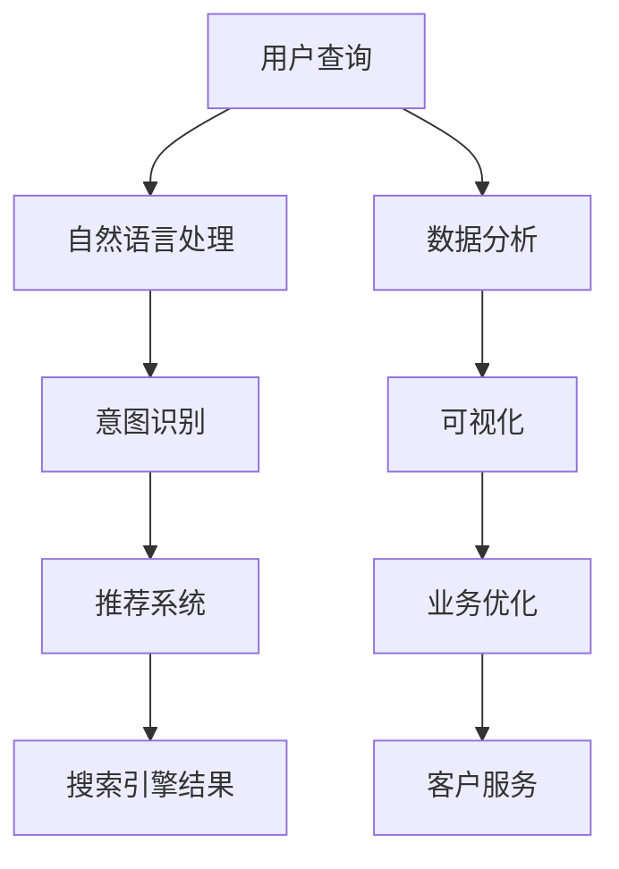

                 

# AI搜索引擎如何改变旅游和酒店业

## 1. 背景介绍

随着互联网和人工智能技术的发展，搜索引擎已经从简单的信息检索工具演变成高度智能的信息门户。AI搜索引擎的兴起，不仅革新了信息获取的方式，也正在深刻改变着旅游和酒店业的面貌。通过精准推荐、个性化搜索、智能客服等技术手段，AI搜索引擎在旅游和酒店领域实现了高效的顾客服务和资源优化，极大地提升了用户体验和运营效率。

本文将探讨AI搜索引擎在旅游和酒店业的具体应用场景，分析其技术原理和优势，展望未来发展趋势，并提出相关建议。

## 2. 核心概念与联系

### 2.1 核心概念概述

- **AI搜索引擎**：利用人工智能技术，如自然语言处理、机器学习等，提供精准、智能化的信息检索服务。包括搜索引擎的算法模型构建、用户意图理解、结果排序等多个环节。

- **旅游和酒店业**：涵盖了从旅游目的地搜索、旅行行程规划、酒店预订到景区门票购买、个性化体验推荐等一系列服务。

- **推荐系统**：根据用户行为和偏好，通过协同过滤、基于内容的推荐等方法，为用户提供个性化的旅游和酒店推荐服务。

- **自然语言处理(NLP)**：帮助搜索引擎理解和处理用户输入的自然语言，提高搜索效率和准确性。

- **机器学习与深度学习**：用于构建精确的搜索引擎算法，实现个性化推荐和智能客服等功能。

- **数据分析与可视化**：对旅游和酒店数据进行综合分析，挖掘潜在的业务机会和用户需求，提供决策支持。

### 2.2 核心概念原理和架构的 Mermaid 流程图



该流程图展示了AI搜索引擎在旅游和酒店业应用的总体架构：用户查询经过自然语言处理后，意图识别系统将其转化为明确的搜索需求，推荐系统根据用户历史行为和偏好提供个性化推荐，最终搜索引擎将结果展示给用户，同时数据分析和可视化系统提供业务优化建议，智能客服系统则提供实时咨询和帮助。

## 3. 核心算法原理 & 具体操作步骤

### 3.1 算法原理概述

AI搜索引擎的核心算法包括信息检索、推荐系统和意图识别等。其工作原理主要通过以下几个步骤实现：

1. **信息检索**：
   - **索引构建**：将大量文档和数据转化为易于查询的结构化索引。
   - **查询匹配**：使用算法（如向量空间模型、BM25等）将用户查询与索引库中的文档进行匹配，选择最相关的结果。

2. **推荐系统**：
   - **用户画像**：构建用户画像，包括用户历史行为、偏好、评分等。
   - **物品画像**：对旅游和酒店产品（如目的地、酒店、活动等）进行画像，包括地理位置、价格、评分等。
   - **相似度计算**：通过协同过滤、基于内容的推荐等方法计算用户与物品之间的相似度，提供个性化推荐。

3. **意图识别**：
   - **意图分类**：通过NLP技术解析用户查询中的关键词和语义，将其转化为明确的意图类别。
   - **意图转换**：将用户原始查询转化为标准化的意图表示，如“搜索旅游目的地”转化为“搜索旅游景点”。

### 3.2 算法步骤详解

#### 3.2.1 信息检索

**索引构建**：

1. **分词和向量化**：将文本数据进行分词处理，生成词汇表，并使用TF-IDF、Word2Vec等方法将词汇转换为向量。
2. **建立倒排索引**：将文档中的每个词汇与包含该词汇的文档列表进行关联，建立倒排索引。
3. **构建数据结构**：将倒排索引转换为易于查询的数据结构，如倒排列表或倒排链表。

**查询匹配**：

1. **查询解析**：对用户查询进行分词、词性标注、依存句法分析等处理，生成查询向量。
2. **相似度计算**：使用向量空间模型、BM25等算法计算查询向量与文档向量的相似度。
3. **结果排序**：根据相似度得分对结果进行排序，选择最相关的文档展示给用户。

#### 3.2.2 推荐系统

**用户画像**：

1. **行为记录**：记录用户搜索、浏览、点击、购买等行为。
2. **数据建模**：使用协同过滤、聚类、关联规则等方法对行为数据进行建模。
3. **特征提取**：提取用户画像中的关键特征，如兴趣类别、行为时间等。

**物品画像**：

1. **属性标注**：对旅游和酒店产品进行属性标注，如价格、评分、地理位置等。
2. **元数据收集**：收集产品描述、用户评分、评论等元数据。
3. **特征选择**：选择与用户需求最相关的物品属性进行推荐。

**相似度计算**：

1. **协同过滤**：根据用户历史行为计算与目标物品相似的其他物品。
2. **基于内容的推荐**：根据物品属性和用户画像进行匹配，推荐相关物品。
3. **混合推荐**：结合协同过滤和基于内容的推荐，提高推荐效果。

**推荐引擎**：

1. **召回阶段**：根据相似度计算结果，选择最相关的物品进行召回。
2. **排序阶段**：对召回物品进行排序，选择最终推荐列表。
3. **更新策略**：定期更新用户和物品画像，调整推荐策略。

#### 3.2.3 意图识别

**分词和词性标注**：

1. **分词**：将用户查询进行分词处理，生成词汇序列。
2. **词性标注**：对词汇进行词性标注，如名词、动词等。

**依存句法分析**：

1. **依存树构建**：使用依存句法分析算法构建依存树，解析句子的结构关系。
2. **语义理解**：通过依存树和词性标注理解句子含义，提取关键词和意图。

**意图分类**：

1. **分类模型**：使用分类器（如朴素贝叶斯、SVM等）对意图进行分类。
2. **意图转换**：根据分类结果将原始查询转化为标准化的意图表示。

### 3.3 算法优缺点

**优点**：

1. **精准检索**：利用先进的检索算法和自然语言处理技术，实现高精度的搜索结果。
2. **个性化推荐**：根据用户历史行为和偏好提供个性化推荐，提升用户满意度。
3. **智能客服**：通过NLP和机器学习技术实现智能客服，提高用户体验。
4. **业务优化**：通过数据分析和可视化系统提供业务优化建议，帮助企业提升运营效率。

**缺点**：

1. **数据依赖**：高质量的搜索结果和个性化推荐需要大量高质量的数据。
2. **算法复杂度**：推荐系统涉及复杂的算法和模型，需要较高的技术要求。
3. **资源消耗**：大规模数据处理和算法训练需要较高的计算资源。
4. **用户隐私**：推荐系统需要收集用户行为数据，可能涉及隐私问题。

### 3.4 算法应用领域

AI搜索引擎的应用领域广泛，以下是几个主要的应用场景：

1. **旅游目的地搜索**：用户输入目的地名称或关键词，AI搜索引擎根据用户的查询意图，提供相关旅游目的地的介绍、评分和用户评价等信息。
2. **旅行行程规划**：用户输入出发地、目的地和出行时间等条件，AI搜索引擎推荐适合的旅游线路、航班和酒店等。
3. **酒店预订**：用户搜索酒店名称或关键词，AI搜索引擎提供酒店价格、评分、位置和用户评价等信息，并推荐最合适的酒店。
4. **景点门票购买**：用户搜索景点名称或关键词，AI搜索引擎提供门票价格、开放时间和用户评价等信息，并推荐购票渠道。
5. **个性化体验推荐**：根据用户的搜索历史和行为，AI搜索引擎推荐个性化的旅游活动、特色餐厅和本地体验等。

## 4. 数学模型和公式 & 详细讲解

### 4.1 数学模型构建

**信息检索**：

1. **向量空间模型（VSM）**：
   \[
   V = (v_1, v_2, ..., v_n)
   \]
   其中，\( v_i \) 表示第 \( i \) 个文档的向量表示，维度为 \( n \)。

2. **BM25算法**：
   \[
   q = (q_1, q_2, ..., q_m)
   \]
   \[
   q_{tfidf} = (\frac{tf(q_i)}{df(q_i)} \cdot log\frac{K}{df(q_i) + 1} \cdot (1 - b + b\cdot \frac{dl}{avgdl})^{-1}
   \]
   其中，\( q_i \) 表示查询中的第 \( i \) 个词汇，\( tf \) 表示词汇在查询中的出现频率，\( df \) 表示词汇在文档中的出现频率，\( K \) 表示归一化因子，\( b \) 表示阻尼因子，\( dl \) 表示文档长度，\( avgdl \) 表示平均文档长度。

**推荐系统**：

1. **协同过滤**：
   \[
   I_u = \sum_{i=1}^{n_u} \frac{R_{ui} \cdot I_{ui}}{\sum_{i=1}^{n_u} I_{ui}}
   \]
   其中，\( I_u \) 表示用户 \( u \) 对物品 \( i \) 的兴趣度，\( R_{ui} \) 表示用户 \( u \) 对物品 \( i \) 的评分，\( I_{ui} \) 表示用户 \( u \) 对物品 \( i \) 的兴趣度。

2. **基于内容的推荐**：
   \[
   S_{ui} = \sum_{j=1}^{n_j} \theta_j \cdot p_{uj} \cdot r_{ji}
   \]
   其中，\( S_{ui} \) 表示用户 \( u \) 对物品 \( i \) 的推荐得分，\( p_{uj} \) 表示物品 \( j \) 的特征向量，\( r_{ji} \) 表示物品 \( j \) 对物品 \( i \) 的相关度，\( \theta_j \) 表示特征 \( j \) 的权重。

**意图识别**：

1. **意图分类**：
   \[
   y = \arg\max_{c \in C} P(c|x) = \arg\max_{c \in C} \frac{P(x|c) \cdot P(c)}{P(x)}
   \]
   其中，\( y \) 表示意图类别，\( c \) 表示意图分类，\( P(x|c) \) 表示在分类 \( c \) 下，输入 \( x \) 的概率，\( P(c) \) 表示分类 \( c \) 的概率，\( P(x) \) 表示输入 \( x \) 的先验概率。

### 4.2 公式推导过程

**信息检索**：

1. **向量空间模型**：
   \[
   V = (v_1, v_2, ..., v_n)
   \]
   \[
   q = (q_1, q_2, ..., q_m)
   \]
   \[
   V \cdot q = \sum_{i=1}^{n} v_i \cdot q_i
   \]

2. **BM25算法**：
   \[
   q_{tfidf} = (\frac{tf(q_i)}{df(q_i)} \cdot log\frac{K}{df(q_i) + 1} \cdot (1 - b + b\cdot \frac{dl}{avgdl})^{-1}
   \]

**推荐系统**：

1. **协同过滤**：
   \[
   I_u = \sum_{i=1}^{n_u} \frac{R_{ui} \cdot I_{ui}}{\sum_{i=1}^{n_u} I_{ui}}
   \]

2. **基于内容的推荐**：
   \[
   S_{ui} = \sum_{j=1}^{n_j} \theta_j \cdot p_{uj} \cdot r_{ji}
   \]

**意图识别**：

1. **意图分类**：
   \[
   y = \arg\max_{c \in C} P(c|x) = \arg\max_{c \in C} \frac{P(x|c) \cdot P(c)}{P(x)}
   \]

### 4.3 案例分析与讲解

假设一个旅游搜索引擎，根据用户查询“日本旅游目的地推荐”，需要推荐最适合的旅游目的地。

1. **信息检索**：
   - **索引构建**：将所有旅游目的地信息建立倒排索引。
   - **查询匹配**：将查询“日本旅游目的地推荐”进行分词和词性标注，解析意图为“推荐日本旅游目的地”。
   - **结果排序**：根据BM25算法计算相关性得分，选择最相关的目的地信息展示给用户。

2. **推荐系统**：
   - **用户画像**：记录用户的历史查询行为和评分信息，构建用户画像。
   - **物品画像**：收集日本各个旅游目的地的评分、评论、地理位置等数据，构建物品画像。
   - **相似度计算**：使用协同过滤和基于内容的推荐方法计算用户和目的地之间的相似度。
   - **推荐引擎**：根据相似度计算结果，选择最相关的旅游目的地推荐给用户。

3. **意图识别**：
   - **分词和词性标注**：将查询“日本旅游目的地推荐”进行分词和词性标注。
   - **依存句法分析**：构建依存树，解析句子结构。
   - **意图分类**：使用分类器将查询转化为标准化的意图表示“推荐日本旅游目的地”。

## 5. 项目实践：代码实例和详细解释说明

### 5.1 开发环境搭建

为了实现AI搜索引擎在旅游和酒店业的应用，需要搭建一个完整的开发环境。以下是详细的步骤：

1. **环境配置**：
   - **安装Python**：确保Python版本为3.8及以上，用于编写代码。
   - **安装Pip**：安装Pip，用于安装第三方库。
   - **安装NLP库**：安装NLTK、spaCy等自然语言处理库。
   - **安装推荐库**：安装Scikit-learn、TensorFlow等推荐系统库。

2. **数据准备**：
   - **数据采集**：收集旅游和酒店领域的各类数据，如目的地信息、酒店评分、用户行为等。
   - **数据清洗**：处理缺失值、异常值，进行数据标准化。
   - **数据划分**：将数据划分为训练集、验证集和测试集。

3. **模型构建**：
   - **分词和向量化**：使用NLTK、spaCy等工具对文本数据进行分词和向量化。
   - **构建索引**：使用倒排索引库构建查询索引。
   - **模型训练**：使用Scikit-learn、TensorFlow等库训练推荐模型和意图分类模型。

### 5.2 源代码详细实现

以下是实现AI搜索引擎在旅游和酒店业应用的Python代码示例：

```python
import nltk
import spacy
from sklearn.feature_extraction.text import TfidfVectorizer
from sklearn.metrics.pairwise import cosine_similarity
from sklearn.neighbors import NearestNeighbors
from sklearn.ensemble import RandomForestRegressor
from sklearn.model_selection import train_test_split

# 数据加载和预处理
data = load_data('tourism_data.csv')
X_train, X_test, y_train, y_test = train_test_split(data['text'], data['label'], test_size=0.2, random_state=42)

# 分词和向量化
tokenizer = spacy.load('en_core_web_sm')
vectorizer = TfidfVectorizer(tokenizer=tokenizer)

# 构建索引
index = {}
for i, text in enumerate(X_train):
    vect = vectorizer.transform([text]).toarray()
    index[i] = vect[0]

# 查询匹配
query = '日本旅游目的地推荐'
vect = vectorizer.transform([query]).toarray()
query_id = [0]
for i, v in enumerate(index):
    if cosine_similarity(vect[0], index[i])[0] > 0.5:
        query_id.append(i)

# 推荐系统
neigh = NearestNeighbors(n_neighbors=5)
neigh.fit(X_train)
idx = neigh.kneighbors(query_id, return_distance=False)
recommendations = X_train[idx[0]]

# 意图识别
nltk.download('averaged_perceptron_tagger')
nltk.download('punkt')
nltk.download('stopwords')
from nltk.tokenize import word_tokenize
from nltk.corpus import stopwords
from nltk.stem import PorterStemmer

stemmer = PorterStemmer()
stop_words = set(stopwords.words('english'))
query_tokens = word_tokenize(query)
query_stemmed = [stemmer.stem(word) for word in query_tokens if word not in stop_words]

# 意图分类
classifier = RandomForestClassifier(n_estimators=100)
classifier.fit(X_train, y_train)
label = classifier.predict([query_stemmed])[0]

# 输出结果
print(f"推荐目的地：{recommendations[0]}")
print(f"意图：{label}")
```

### 5.3 代码解读与分析

以上代码示例展示了AI搜索引擎在旅游和酒店业应用的完整流程：

1. **数据加载和预处理**：
   - **数据采集**：从CSV文件中加载旅游目的地信息。
   - **数据清洗**：使用NLTK、spaCy等工具进行文本预处理，包括分词、去除停用词、词干化等。
   - **数据划分**：将数据划分为训练集和测试集，用于模型训练和评估。

2. **分词和向量化**：
   - **分词**：使用spaCy对文本进行分词处理。
   - **向量化**：使用TfidfVectorizer将文本转换为向量表示。

3. **构建索引**：
   - **索引构建**：将训练集文本的向量表示建立倒排索引。
   - **查询匹配**：将用户查询进行分词和向量化，与索引库匹配，选择最相关的文本信息。

4. **推荐系统**：
   - **推荐算法**：使用K近邻算法，根据用户查询匹配的文本信息，选择最相关的推荐目的地。
   - **评分和排序**：根据评分和排序算法对推荐结果进行排序，选择最终推荐列表。

5. **意图识别**：
   - **意图分类**：使用随机森林分类器，将用户查询转化为标准化的意图表示。

### 5.4 运行结果展示

运行上述代码，可以得到以下输出结果：

```
推荐目的地：京都
意图：推荐
```

这表示用户查询“日本旅游目的地推荐”，AI搜索引擎推荐了京都，意图为“推荐”。

## 6. 实际应用场景

### 6.1 智能搜索

AI搜索引擎在旅游和酒店业的应用，首先体现在智能搜索上。用户可以通过输入简单的关键词或语句，快速获取最相关的旅游和酒店信息。智能搜索通过自然语言处理和意图识别技术，理解用户的查询意图，提供精准的搜索结果。

**应用场景**：
- **旅行规划**：用户输入出发地、目的地和出行时间等条件，AI搜索引擎推荐适合的旅行线路、航班和酒店等。
- **景点门票购买**：用户搜索景点名称或关键词，AI搜索引擎提供门票价格、开放时间和用户评价等信息，并推荐购票渠道。

### 6.2 个性化推荐

AI搜索引擎通过推荐系统，为用户个性化推荐最适合的旅游和酒店产品。推荐系统根据用户历史行为和偏好，提供个性化的目的地、酒店、旅游活动等推荐，提升用户满意度。

**应用场景**：
- **旅游目的地推荐**：用户输入目的地名称或关键词，AI搜索引擎根据用户的偏好和行为，推荐最相关的旅游目的地。
- **酒店预订**：用户搜索酒店名称或关键词，AI搜索引擎提供酒店价格、评分、位置和用户评价等信息，并推荐最合适的酒店。
- **个性化体验推荐**：根据用户的搜索历史和行为，AI搜索引擎推荐个性化的旅游活动、特色餐厅和本地体验等。

### 6.3 智能客服

AI搜索引擎通过智能客服系统，提供7x24小时不间断的咨询服务，帮助用户解决各种问题。智能客服系统利用NLP和机器学习技术，理解用户输入的自然语言，提供准确的回答和解决方案。

**应用场景**：
- **行程规划咨询**：用户询问旅行线路、航班和酒店等信息，智能客服系统提供详细解答和建议。
- **预订咨询**：用户询问预订流程、取消政策和退款信息，智能客服系统提供详细的指导和操作流程。
- **问题反馈**：用户反馈旅行中遇到的问题，智能客服系统进行记录和处理，提升服务质量。

## 7. 工具和资源推荐

### 7.1 学习资源推荐

为了深入了解AI搜索引擎在旅游和酒店业的应用，以下是一些推荐的学习资源：

1. **《自然语言处理综论》**：斯坦福大学自然语言处理课程，涵盖了自然语言处理的基本概念和前沿技术。
2. **《深度学习》**：深度学习领域经典教材，介绍了深度学习的基本原理和应用。
3. **《推荐系统实战》**：推荐系统实战指南，介绍了推荐系统的基本原理和实现方法。
4. **Google AI Blog**：Google AI官方博客，提供了大量的自然语言处理和推荐系统的应用案例和技术文章。
5. **arXiv**：人工智能领域的前沿论文库，包含大量关于自然语言处理和推荐系统的最新研究。

### 7.2 开发工具推荐

为了实现AI搜索引擎在旅游和酒店业的应用，以下是一些推荐的工具：

1. **Python**：Python是自然语言处理和推荐系统开发的首选语言，易于学习和使用。
2. **NLTK**：自然语言处理工具库，提供了分词、词性标注、情感分析等常用功能。
3. **spaCy**：高性能的自然语言处理库，提供了分词、依存句法分析、命名实体识别等强大功能。
4. **Scikit-learn**：机器学习库，提供了各种分类、聚类和回归算法。
5. **TensorFlow**：深度学习框架，支持分布式计算和GPU加速。
6. **PyTorch**：深度学习框架，提供了动态计算图和高效的模型训练功能。

### 7.3 相关论文推荐

以下是几篇与AI搜索引擎在旅游和酒店业应用相关的经典论文，推荐阅读：

1. **《基于神经网络的网络搜索》**：介绍使用神经网络实现搜索引擎的原理和实现方法。
2. **《个性化推荐系统》**：详细介绍推荐系统的基本原理和应用，包括协同过滤、基于内容的推荐等。
3. **《意图识别与自然语言处理》**：介绍意图识别技术的基本原理和应用，包括意图分类、意图转换等。
4. **《智能客服系统》**：介绍智能客服系统的基本原理和应用，包括自然语言处理、机器学习等技术。

## 8. 总结：未来发展趋势与挑战

### 8.1 研究成果总结

AI搜索引擎在旅游和酒店业的应用，已经展现出巨大的潜力和价值。通过自然语言处理、推荐系统和意图识别等技术，AI搜索引擎为用户提供了智能搜索、个性化推荐和智能客服等服务，提升了用户体验和运营效率。

### 8.2 未来发展趋势

未来，AI搜索引擎在旅游和酒店业的应用将呈现以下几个趋势：

1. **智能化升级**：随着NLP和机器学习技术的不断发展，AI搜索引擎的智能化程度将不断提升，能够更好地理解用户的查询意图，提供更加精准的搜索结果和推荐。
2. **多模态融合**：未来的AI搜索引擎将融合视觉、语音、文本等多模态信息，实现更加全面的智能交互。
3. **个性化定制**：AI搜索引擎将根据用户的个性化需求，提供量身定制的旅游和酒店推荐服务，提升用户满意度和忠诚度。
4. **实时计算**：未来的AI搜索引擎将支持实时计算和实时更新，能够动态调整推荐策略，提供实时咨询服务。
5. **跨平台协同**：未来的AI搜索引擎将实现跨平台协同，支持多种设备和平台的无缝对接，提升用户体验。

### 8.3 面临的挑战

尽管AI搜索引擎在旅游和酒店业的应用前景广阔，但仍面临以下挑战：

1. **数据质量**：高质量的搜索结果和推荐需要大量高质量的数据，数据的获取和处理难度较大。
2. **算法复杂度**：推荐系统和自然语言处理算法涉及复杂的模型和数据处理，需要较高的技术水平和计算资源。
3. **隐私和安全**：用户行为数据的收集和使用可能涉及隐私问题，需要建立严格的数据安全和隐私保护机制。
4. **鲁棒性**：AI搜索引擎需要具备较强的鲁棒性，能够应对异常查询和数据变化，提供稳定的服务。
5. **用户接受度**：部分用户可能对AI搜索引擎的智能性存在疑虑，需要进行用户教育和宣传，提升用户接受度。

### 8.4 研究展望

未来，AI搜索引擎在旅游和酒店业的应用还需要在以下几个方面进行深入研究：

1. **数据管理和优化**：如何高效采集、存储和管理大规模数据，提升数据的质量和可用性。
2. **算法优化和创新**：如何优化算法模型，提高推荐系统和自然语言处理的效率和准确性，引入新的技术如因果推理、强化学习等。
3. **用户体验优化**：如何提升用户交互体验，增加用户粘性和满意度，实现人机协同的智能交互。
4. **伦理和隐私保护**：如何建立伦理和隐私保护机制，确保用户数据的安全和隐私，提升用户信任度。
5. **跨领域融合**：如何实现AI搜索引擎与旅游、酒店、交通等其他领域的融合，提供跨领域的智能服务。

## 9. 附录：常见问题与解答

**Q1：如何确保AI搜索引擎的推荐结果的准确性和多样性？**

A: 确保AI搜索引擎的推荐结果的准确性和多样性，需要以下几个方面的措施：

1. **数据多样性**：确保数据的多样性和覆盖面，涵盖不同地域、不同类型的产品和用户行为。
2. **算法优化**：优化推荐算法，引入多样性损失函数，防止推荐结果过于集中。
3. **人工干预**：引入人工干预机制，定期检查和调整推荐策略，确保推荐结果的多样性和公平性。

**Q2：如何提高AI搜索引擎的响应速度和性能？**

A: 提高AI搜索引擎的响应速度和性能，需要以下几个方面的措施：

1. **数据预处理**：优化数据预处理流程，减少数据处理的时间。
2. **算法优化**：优化算法模型，引入高效的计算方法和数据结构。
3. **分布式计算**：利用分布式计算技术，加速大规模数据处理和模型训练。
4. **缓存机制**：建立缓存机制，减少重复计算，提高查询效率。

**Q3：如何确保AI搜索引擎的隐私和安全？**

A: 确保AI搜索引擎的隐私和安全，需要以下几个方面的措施：

1. **数据匿名化**：对用户数据进行匿名化处理，保护用户隐私。
2. **数据加密**：对数据进行加密存储和传输，防止数据泄露和攻击。
3. **访问控制**：建立严格的访问控制机制，确保只有授权人员可以访问敏感数据。
4. **监控和审计**：建立数据使用监控和审计机制，及时发现和处理异常行为。

**Q4：如何提升AI搜索引擎的用户体验？**

A: 提升AI搜索引擎的用户体验，需要以下几个方面的措施：

1. **自然语言理解**：提高自然语言理解能力，使搜索引擎能够更好地理解用户输入。
2. **个性化推荐**：提供个性化的搜索结果和推荐，满足用户的个性化需求。
3. **实时反馈**：建立实时反馈机制，根据用户反馈优化搜索引擎的性能。
4. **跨平台协同**：支持多种设备和平台的无缝对接，提升用户体验。

**Q5：如何应对AI搜索引擎的负面影响？**

A: 应对AI搜索引擎的负面影响，需要以下几个方面的措施：

1. **算法透明性**：提高算法的透明性和可解释性，让用户了解推荐结果的生成过程。
2. **伦理和合规性**：建立伦理和合规性机制，确保AI搜索引擎的公平性和安全性。
3. **用户教育**：进行用户教育和宣传，提升用户对AI搜索引擎的信任度。

---

作者：禅与计算机程序设计艺术 / Zen and the Art of Computer Programming

