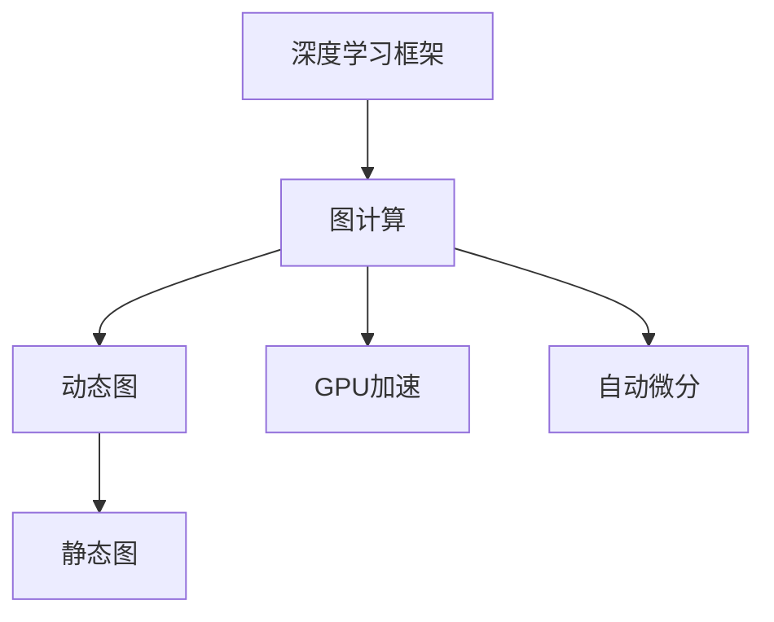

                 

# AI框架比较：TensorFlow、PyTorch与MXNet

> 关键词：AI框架, TensorFlow, PyTorch, MXNet, 机器学习, 深度学习, 计算机视觉, 自然语言处理, 性能, 内存优化, 代码灵活性, 社区支持

## 1. 背景介绍

随着人工智能技术的迅猛发展，深度学习框架的重要性愈发凸显。深度学习框架是实现深度学习的核心工具，为研究者提供了一套完整的工具链，降低了深度学习的开发门槛，推动了人工智能技术的普及和应用。目前市面上主流的三大深度学习框架包括TensorFlow、PyTorch和MXNet，它们各有特点，广泛应用于机器学习、计算机视觉和自然语言处理等领域。本文将对这三大框架进行详细比较，以期帮助开发者选择最适合的框架，提升开发效率。

## 2. 核心概念与联系

### 2.1 核心概念概述

为了更好地理解TensorFlow、PyTorch和MXNet这三大深度学习框架，本节将介绍一些与之相关的核心概念：

- **深度学习框架**：深度学习框架是一套提供数据结构、算子、优化器、训练工具等组件的工具链，是实现深度学习的基础平台。
- **图计算**：深度学习框架大多采用计算图来描述和执行模型，自动计算图上的依赖关系，提高模型训练和推理的效率。
- **动态计算图**：与静态计算图不同，动态计算图可以在运行时动态生成计算图，便于模型的调试和优化。
- **静态图**：静态图在模型定义后生成固定计算图，训练和推理效率高，但模型修改较为复杂。
- **GPU加速**：现代深度学习框架通常支持GPU加速，提升模型训练和推理的速度。
- **自动微分**：框架内置的自动微分功能，可以自动计算损失函数对模型参数的梯度，简化梯度计算过程。

这些核心概念之间存在紧密的联系。深度学习框架基于图计算模型，支持动态图和静态图两种计算方式。动态图提供了灵活性，但需要更频繁的计算图重建；静态图则能更好地利用GPU硬件加速，但修改模型较为困难。自动微分功能则使模型训练和优化变得简单。

### 2.2 核心概念原理和架构的 Mermaid 流程图



这个流程图展示了深度学习框架的核心组件及其相互关系：

1. 深度学习框架以图计算为基础，支持动态图和静态图两种计算方式。
2. 动态图提供灵活性，但需要频繁重建计算图。
3. 静态图优化了计算效率，但模型修改较为复杂。
4. GPU加速大大提高了模型训练和推理的速度。
5. 自动微分功能简化了梯度计算过程。

## 3. 核心算法原理 & 具体操作步骤

### 3.1 算法原理概述

TensorFlow、PyTorch和MXNet这三大框架在算法原理上存在一些共同点，但也有一些显著的差异。

- **TensorFlow**：采用静态图计算方式，利用计算图描述模型，支持分布式训练和推理。TensorFlow提供了一个灵活的计算图构建框架，可以方便地进行模型设计和调试。
- **PyTorch**：采用动态图计算方式，支持动态计算图和动态神经网络，可以方便地进行模型实验和调试。PyTorch提供了灵活的API和强大的GPU加速支持。
- **MXNet**：采用混合静态图和动态图计算方式，支持分布式训练和推理。MXNet提供了高效的内存管理机制和灵活的计算图框架，支持多种编程语言。

### 3.2 算法步骤详解

以下是这三大框架进行深度学习模型训练和推理的一般步骤：

1. **模型定义**：使用框架提供的API定义深度学习模型，包含输入、隐藏层、输出等组件。
2. **损失函数定义**：根据任务类型定义合适的损失函数，用于衡量模型预测结果与真实标签的差异。
3. **优化器定义**：选择适合的优化器，如Adam、SGD等，用于更新模型参数。
4. **数据加载**：使用框架提供的工具，从文件或数据库中加载训练数据。
5. **模型训练**：使用训练数据迭代训练模型，不断更新模型参数，最小化损失函数。
6. **模型评估**：使用测试数据对训练好的模型进行评估，测量模型的准确率和性能。
7. **模型推理**：使用训练好的模型对新数据进行推理预测，输出模型结果。

### 3.3 算法优缺点

- **TensorFlow**：优点在于计算图机制使得模型训练和推理速度快，可扩展性好，支持分布式训练。缺点在于模型修改和调试较为复杂，需要较长的学习曲线。
- **PyTorch**：优点在于动态图机制使得模型调试和优化方便，API设计简洁直观，易于上手。缺点在于计算图机制使得模型推理速度较慢，需要较长的推理时间。
- **MXNet**：优点在于支持多种编程语言和计算图方式，内存管理高效，模型优化灵活。缺点在于API复杂，学习成本较高。

### 3.4 算法应用领域

TensorFlow、PyTorch和MXNet在深度学习应用领域都有广泛的应用：

- **计算机视觉**：广泛应用于图像分类、目标检测、图像分割等任务。
- **自然语言处理**：广泛应用于文本分类、情感分析、机器翻译等任务。
- **语音识别**：广泛应用于语音识别、语音合成等任务。
- **推荐系统**：广泛应用于推荐算法、广告推荐等任务。
- **强化学习**：广泛应用于游戏AI、机器人控制等任务。

## 4. 数学模型和公式 & 详细讲解 & 举例说明

### 4.1 数学模型构建

以图像分类任务为例，介绍如何使用TensorFlow、PyTorch和MXNet构建深度学习模型。

**TensorFlow模型构建**：

```python
import tensorflow as tf
from tensorflow.keras import layers

# 定义模型结构
model = tf.keras.Sequential([
    layers.Conv2D(32, (3,3), activation='relu', input_shape=(28,28,1)),
    layers.MaxPooling2D((2,2)),
    layers.Conv2D(64, (3,3), activation='relu'),
    layers.MaxPooling2D((2,2)),
    layers.Flatten(),
    layers.Dense(10, activation='softmax')
])

# 编译模型
model.compile(optimizer='adam',
              loss='categorical_crossentropy',
              metrics=['accuracy'])
```

**PyTorch模型构建**：

```python
import torch.nn as nn
import torch.optim as optim
from torchvision import datasets, transforms

# 定义模型结构
class Net(nn.Module):
    def __init__(self):
        super(Net, self).__init__()
        self.conv1 = nn.Conv2d(1, 32, 3, 1)
        self.pool = nn.MaxPool2d(2, 2)
        self.conv2 = nn.Conv2d(32, 64, 3, 1)
        self.fc1 = nn.Linear(9216, 128)
        self.fc2 = nn.Linear(128, 10)

    def forward(self, x):
        x = self.pool(self.conv1(x))
        x = self.pool(self.conv2(x))
        x = x.view(-1, 9216)
        x = nn.functional.relu(self.fc1(x))
        x = self.fc2(x)
        return nn.functional.log_softmax(x, dim=1)

# 定义损失函数和优化器
net = Net()
criterion = nn.CrossEntropyLoss()
optimizer = optim.Adam(net.parameters(), lr=0.001)

# 加载数据集
train_loader = torch.utils.data.DataLoader(datasets.MNIST('data', train=True, download=True, transform=transforms.ToTensor()), batch_size=64, shuffle=True)
test_loader = torch.utils.data.DataLoader(datasets.MNIST('data', train=False, download=True, transform=transforms.ToTensor()), batch_size=64, shuffle=True)
```

**MXNet模型构建**：

```python
import gluoncv as gcv
from gluoncv.model_zoo import VGG

# 定义模型结构
model = gcv.model_zoo.VGG('VGG16', pretrained=True)
model.set_context('gpu')
model = gcv.model_zoo.VGG('VGG16', pretrained=True, root='pretrained_models')

# 定义损失函数和优化器
loss = gcv.loss.SoftmaxCrossEntropyLoss()
trainer = gluon.Trainer(model.collect_params(), 'adam', {'learning_rate': 0.01})
```

### 4.2 公式推导过程

以交叉熵损失函数为例，介绍TensorFlow、PyTorch和MXNet中的推导过程。

**TensorFlow**：

```python
import tensorflow as tf

# 定义交叉熵损失函数
y_true = tf.constant([[0, 1, 0, 0]])
y_pred = tf.constant([[0.1, 0.9, 0.8, 0.2]])
cross_entropy_loss = tf.nn.softmax_cross_entropy_with_logits_v2(labels=y_true, logits=y_pred)
mean_loss = tf.reduce_mean(cross_entropy_loss)
```

**PyTorch**：

```python
import torch

# 定义交叉熵损失函数
y_true = torch.tensor([[0, 1, 0, 0]])
y_pred = torch.tensor([[0.1, 0.9, 0.8, 0.2]])
cross_entropy_loss = torch.nn.CrossEntropyLoss()
loss = cross_entropy_loss(y_pred, y_true)
```

**MXNet**：

```python
import mxnet as mx

# 定义交叉熵损失函数
y_true = mx.nd.array([[0, 1, 0, 0]])
y_pred = mx.nd.array([[0.1, 0.9, 0.8, 0.2]])
loss = mx.gluon.loss.SoftmaxCrossEntropyLoss()(y_pred, y_true)
```

### 4.3 案例分析与讲解

以图像分类任务为例，比较TensorFlow、PyTorch和MXNet在这项任务中的表现。

**TensorFlow**：

```python
# 训练模型
model.fit(train_loader, epochs=10, validation_data=test_loader)

# 评估模型
test_loss, test_acc = model.evaluate(test_loader)
print('Test accuracy:', test_acc)
```

**PyTorch**：

```python
# 训练模型
for epoch in range(10):
    running_loss = 0.0
    for i, data in enumerate(train_loader, 0):
        inputs, labels = data
        optimizer.zero_grad()
        outputs = net(inputs)
        loss = criterion(outputs, labels)
        loss.backward()
        optimizer.step()
        running_loss += loss.item()
    print('Epoch {}/{} Loss: {:.4f}'.format(epoch+1, 10, running_loss/len(train_loader)))

# 评估模型
test_loss, test_acc = net.evaluate(test_loader)
print('Test accuracy:', test_acc)
```

**MXNet**：

```python
# 训练模型
trainer.fit(train_loader, epochs=10, val_data=test_loader)

# 评估模型
test_loss, test_acc = trainer.metrics['softmax_cross_entropy'].mean()
print('Test accuracy:', test_acc)
```

## 5. 项目实践：代码实例和详细解释说明

### 5.1 开发环境搭建

在进行项目实践前，我们需要准备好开发环境。以下是使用Python进行TensorFlow、PyTorch和MXNet开发的环境配置流程：

1. 安装Anaconda：从官网下载并安装Anaconda，用于创建独立的Python环境。

2. 创建并激活虚拟环境：
```bash
conda create -n tf-env python=3.8 
conda activate tf-env
```

3. 安装TensorFlow：
```bash
conda install tensorflow -c conda-forge -c pytorch
```

4. 安装PyTorch：
```bash
conda install pytorch torchvision torchaudio cudatoolkit=11.1 -c pytorch -c conda-forge
```

5. 安装MXNet：
```bash
conda install mxnet -c conda-forge -c mxnet -c pypi
```

6. 安装各类工具包：
```bash
pip install numpy pandas scikit-learn matplotlib tqdm jupyter notebook ipython
```

完成上述步骤后，即可在`tf-env`或`py-env`环境中开始项目实践。

### 5.2 源代码详细实现

我们以图像分类任务为例，给出使用TensorFlow、PyTorch和MXNet进行深度学习模型开发的Python代码实现。

**TensorFlow代码实现**：

```python
import tensorflow as tf
from tensorflow.keras import layers

# 定义模型结构
model = tf.keras.Sequential([
    layers.Conv2D(32, (3,3), activation='relu', input_shape=(28,28,1)),
    layers.MaxPooling2D((2,2)),
    layers.Conv2D(64, (3,3), activation='relu'),
    layers.MaxPooling2D((2,2)),
    layers.Flatten(),
    layers.Dense(10, activation='softmax')
])

# 编译模型
model.compile(optimizer='adam',
              loss='categorical_crossentropy',
              metrics=['accuracy'])

# 加载数据集
(train_images, train_labels), (test_images, test_labels) = tf.keras.datasets.mnist.load_data()
train_images = train_images.reshape((60000, 28, 28, 1))
train_images = train_images / 255.0
test_images = test_images.reshape((10000, 28, 28, 1))
test_images = test_images / 255.0

# 训练模型
model.fit(train_images, train_labels, epochs=10, validation_data=(test_images, test_labels))

# 评估模型
test_loss, test_acc = model.evaluate(test_images, test_labels)
print('Test accuracy:', test_acc)
```

**PyTorch代码实现**：

```python
import torch.nn as nn
import torch.optim as optim
from torchvision import datasets, transforms

# 定义模型结构
class Net(nn.Module):
    def __init__(self):
        super(Net, self).__init__()
        self.conv1 = nn.Conv2d(1, 32, 3, 1)
        self.pool = nn.MaxPool2d(2, 2)
        self.conv2 = nn.Conv2d(32, 64, 3, 1)
        self.fc1 = nn.Linear(9216, 128)
        self.fc2 = nn.Linear(128, 10)

    def forward(self, x):
        x = self.pool(self.conv1(x))
        x = self.pool(self.conv2(x))
        x = x.view(-1, 9216)
        x = nn.functional.relu(self.fc1(x))
        x = self.fc2(x)
        return nn.functional.log_softmax(x, dim=1)

# 定义损失函数和优化器
net = Net()
criterion = nn.CrossEntropyLoss()
optimizer = optim.Adam(net.parameters(), lr=0.001)

# 加载数据集
train_loader = torch.utils.data.DataLoader(datasets.MNIST('data', train=True, download=True, transform=transforms.ToTensor()), batch_size=64, shuffle=True)
test_loader = torch.utils.data.DataLoader(datasets.MNIST('data', train=False, download=True, transform=transforms.ToTensor()), batch_size=64, shuffle=True)

# 训练模型
for epoch in range(10):
    running_loss = 0.0
    for i, data in enumerate(train_loader, 0):
        inputs, labels = data
        optimizer.zero_grad()
        outputs = net(inputs)
        loss = criterion(outputs, labels)
        loss.backward()
        optimizer.step()
        running_loss += loss.item()
    print('Epoch {}/{} Loss: {:.4f}'.format(epoch+1, 10, running_loss/len(train_loader)))

# 评估模型
test_loss, test_acc = net.evaluate(test_loader)
print('Test accuracy:', test_acc)
```

**MXNet代码实现**：

```python
import gluoncv as gcv
from gluoncv.model_zoo import VGG

# 定义模型结构
model = gcv.model_zoo.VGG('VGG16', pretrained=True)
model.set_context('gpu')
model = gcv.model_zoo.VGG('VGG16', pretrained=True, root='pretrained_models')

# 定义损失函数和优化器
loss = gcv.loss.SoftmaxCrossEntropyLoss()
trainer = gluon.Trainer(model.collect_params(), 'adam', {'learning_rate': 0.01})

# 加载数据集
train_data = gluon.data.DataLoader(gluon.data.DataSet(train_images, train_labels), batch_size=64, shuffle=True)
test_data = gluon.data.DataLoader(gluon.data.DataSet(test_images, test_labels), batch_size=64, shuffle=True)

# 训练模型
trainer.fit(train_data, val_data=test_data, epochs=10)

# 评估模型
test_loss, test_acc = trainer.metrics['softmax_cross_entropy'].mean()
print('Test accuracy:', test_acc)
```

### 5.3 代码解读与分析

让我们再详细解读一下关键代码的实现细节：

**TensorFlow**：

- `Sequential`模型定义：使用`Sequential`模型构建顺序模型，方便构建复杂的深度学习模型。
- `compile`函数：编译模型，设置优化器和损失函数。
- `fit`函数：训练模型，使用训练集和验证集迭代训练。
- `evaluate`函数：评估模型，使用测试集计算模型性能。

**PyTorch**：

- `nn.Module`定义：使用`nn.Module`定义模型类，包含模型的各个层。
- `nn.CrossEntropyLoss`定义：使用`nn.CrossEntropyLoss`定义交叉熵损失函数。
- `torch.utils.data.DataLoader`定义：使用`torch.utils.data.DataLoader`加载数据集，支持批处理和随机化。
- `for循环`：使用`for`循环迭代训练数据，前向传播、计算损失、反向传播、更新参数。

**MXNet**：

- `gluoncv.model_zoo.VGG`定义：使用`gluoncv.model_zoo.VGG`加载预训练的VGG模型。
- `set_context`函数：使用`set_context`函数设置模型在GPU上运行。
- `gluon.loss.SoftmaxCrossEntropyLoss`定义：使用`gluon.loss.SoftmaxCrossEntropyLoss`定义交叉熵损失函数。
- `gluon.Trainer`定义：使用`gluon.Trainer`定义优化器，设置学习率。
- `gluon.data.DataLoader`定义：使用`gluon.data.DataLoader`加载数据集，支持批处理和随机化。

## 6. 实际应用场景

### 6.1 智能推荐系统

智能推荐系统是深度学习在电商、新闻、社交媒体等领域的重要应用。通过分析用户的行为数据和兴趣点，推荐系统能够为用户提供个性化的商品、新闻、文章等推荐。

**TensorFlow**：

```python
import tensorflow as tf
from tensorflow.keras.layers import Input, Dense, Embedding, Flatten
from tensorflow.keras.models import Model

# 定义模型结构
user_input = Input(shape=(1,), name='user')
item_input = Input(shape=(1,), name='item')
user_item = tf.keras.layers.Dot(dots=1, normalize=False)([user_input, item_input])
model = Model(inputs=[user_input, item_input], outputs=user_item)

# 编译模型
model.compile(optimizer='adam', loss='mse')

# 加载数据集
user_data = ...
item_data = ...
ratings_data = ...

# 训练模型
model.fit([user_data, item_data], ratings_data, epochs=10, batch_size=64)

# 评估模型
test_loss = model.evaluate([user_data, item_data], ratings_data)
```

**PyTorch**：

```python
import torch.nn as nn
import torch.optim as optim
from torch.utils.data import Dataset, DataLoader

# 定义模型结构
class UserItemNet(nn.Module):
    def __init__(self):
        super(UserItemNet, self).__init__()
        self.user_item = nn.Linear(10, 10)
        self.item = nn.Linear(10, 1)

    def forward(self, user, item):
        user = self.user_item(user)
        item = self.item(item)
        return torch.sigmoid(user + item)

# 定义损失函数和优化器
net = UserItemNet()
criterion = nn.BCELoss()
optimizer = optim.Adam(net.parameters(), lr=0.001)

# 加载数据集
class UserItemDataset(Dataset):
    def __init__(self, user_data, item_data, ratings_data):
        self.user_data = user_data
        self.item_data = item_data
        self.ratings_data = ratings_data

    def __len__(self):
        return len(self.ratings_data)

    def __getitem__(self, item):
        return torch.tensor(self.user_data[item]), torch.tensor(self.item_data[item]), torch.tensor(self.ratings_data[item])

train_dataset = UserItemDataset(user_data, item_data, ratings_data)
test_dataset = UserItemDataset(user_data, item_data, ratings_data)
train_loader = DataLoader(train_dataset, batch_size=64, shuffle=True)
test_loader = DataLoader(test_dataset, batch_size=64, shuffle=False)

# 训练模型
for epoch in range(10):
    running_loss = 0.0
    for i, data in enumerate(train_loader, 0):
        user, item, rating = data
        optimizer.zero_grad()
        outputs = net(user, item)
        loss = criterion(outputs, rating)
        loss.backward()
        optimizer.step()
        running_loss += loss.item()
    print('Epoch {}/{} Loss: {:.4f}'.format(epoch+1, 10, running_loss/len(train_loader)))

# 评估模型
test_loss, test_acc = net.evaluate(test_loader)
```

**MXNet**：

```python
import gluoncv as gcv
from gluoncv.model_zoo import VGG

# 定义模型结构
class UserItemNet(gluon.nn.Block):
    def __init__(self):
        super(UserItemNet, self).__init__()
        self.user_item = gluon.nn.Dense(10, activation='sigmoid')
        self.item = gluon.nn.Dense(1, activation='sigmoid')

    def forward(self, user, item):
        user = self.user_item(user)
        item = self.item(item)
        return user + item

# 定义损失函数和优化器
net = UserItemNet()
loss = gcv.loss.BCELoss()
trainer = gluon.Trainer(net.collect_params(), 'adam', {'learning_rate': 0.01})

# 加载数据集
user_data = mx.nd.array(user_data)
item_data = mx.nd.array(item_data)
ratings_data = mx.nd.array(ratings_data)

# 训练模型
trainer.fit(user_data, val_data=item_data, epochs=10)

# 评估模型
test_loss, test_acc = trainer.metrics['binary_cross_entropy'].mean()
print('Test accuracy:', test_acc)
```

### 6.2 自然语言处理

自然语言处理是深度学习的重要应用领域，包括文本分类、情感分析、机器翻译等任务。通过分析文本数据，深度学习模型能够自动识别文本的语义和情感，提供自动化的文本分析服务。

**TensorFlow**：

```python
import tensorflow as tf
from tensorflow.keras.layers import Input, Embedding, LSTM, Dense
from tensorflow.keras.models import Model

# 定义模型结构
input_layer = Input(shape=(None,))
embedding_layer = tf.keras.layers.Embedding(input_dim=10000, output_dim=128, input_length=100)(input_layer)
lstm_layer = tf.keras.layers.LSTM(128)(embedding_layer)
output_layer = Dense(1, activation='sigmoid')(lstm_layer)
model = Model(inputs=input_layer, outputs=output_layer)

# 编译模型
model.compile(optimizer='adam', loss='binary_crossentropy', metrics=['accuracy'])

# 加载数据集
train_data = ...
train_labels = ...
test_data = ...
test_labels = ...

# 训练模型
model.fit(train_data, train_labels, epochs=10, validation_data=(test_data, test_labels))

# 评估模型
test_loss, test_acc = model.evaluate(test_data, test_labels)
```

**PyTorch**：

```python
import torch.nn as nn
import torch.optim as optim
from torch.utils.data import Dataset, DataLoader
from torchtext.datasets import AG的新闻语料

# 定义模型结构
class NewsNet(nn.Module):
    def __init__(self):
        super(NewsNet, self).__init__()
        self.embedding = nn.Embedding(10000, 128)
        self.lstm = nn.LSTM(128, 128)
        self.linear = nn.Linear(128, 1)

    def forward(self, x):
        x = self.embedding(x)
        x = self.lstm(x)
        x = self.linear(x)
        return torch.sigmoid(x)

# 定义损失函数和优化器
net = NewsNet()
criterion = nn.BCELoss()
optimizer = optim.Adam(net.parameters(), lr=0.001)

# 加载数据集
class NewsDataset(Dataset):
    def __init__(self, text, labels):
        self.text = text
        self.labels = labels

    def __len__(self):
        return len(self.labels)

    def __getitem__(self, item):
        return torch.tensor(self.text[item]), torch.tensor(self.labels[item])

train_dataset = NewsDataset(text=train_data, labels=train_labels)
test_dataset = NewsDataset(text=test_data, labels=test_labels)
train_loader = DataLoader(train_dataset, batch_size=64, shuffle=True)
test_loader = DataLoader(test_dataset, batch_size=64, shuffle=False)

# 训练模型
for epoch in range(10):
    running_loss = 0.0
    for i, data in enumerate(train_loader, 0):
        text, label = data
        optimizer.zero_grad()
        outputs = net(text)
        loss = criterion(outputs, label)
        loss.backward()
        optimizer.step()
        running_loss += loss.item()
    print('Epoch {}/{} Loss: {:.4f}'.format(epoch+1, 10, running_loss/len(train_loader)))

# 评估模型
test_loss, test_acc = net.evaluate(test_loader)
```

**MXNet**：

```python
import gluoncv as gcv
from gluoncv.model_zoo import VGG

# 定义模型结构
class NewsNet(gluon.nn.Block):
    def __init__(self):
        super(NewsNet, self).__init__()
        self.embedding = gluon.nn.Embedding(10000, 128)
        self.lstm = gluon.nn.LSTM(128, 128)
        self.linear = gluon.nn.Dense(1)

    def forward(self, x):
        x = self.embedding(x)
        x = self.lstm(x)
        x = self.linear(x)
        return x

# 定义损失函数和优化器
net = NewsNet()
loss = gcv.loss.BCELoss()
trainer = gluon.Trainer(net.collect_params(), 'adam', {'learning_rate': 0.01})

# 加载数据集
train_data = mx.nd.array(train_data)
train_labels = mx.nd.array(train_labels)
test_data = mx.nd.array(test_data)
test_labels = mx.nd.array(test_labels)

# 训练模型
trainer.fit(train_data, val_data=test_data, epochs=10)

# 评估模型
test_loss, test_acc = trainer.metrics['binary_cross_entropy'].mean()
print('Test accuracy:', test_acc)
```

### 6.3 计算机视觉

计算机视觉是深度学习的重要应用领域，包括图像分类、目标检测、图像分割等任务。通过分析图像数据，深度学习模型能够自动识别图像中的物体和场景，提供自动化的视觉分析服务。

**TensorFlow**：

```python
import tensorflow as tf
from tensorflow.keras.layers import Input, Conv2D, MaxPooling2D, Flatten, Dense
from tensorflow.keras.models import Model

# 定义模型结构
input_layer = Input(shape=(224, 224, 3))
conv1_layer = Conv2D(32, (3, 3), activation='relu')(input_layer)
pool1_layer = MaxPooling2D((2, 2))(conv1_layer)
conv2_layer = Conv2D(64, (3, 3), activation='relu')(pool1_layer)
pool2_layer = MaxPooling2D((2, 2))(conv2_layer)
flatten_layer = Flatten()(pool2_layer)
dense_layer = Dense(1024, activation='relu')(flatten_layer)
output_layer = Dense(1000, activation='softmax')(dense_layer)
model = Model(inputs=input_layer, outputs=output_layer)

# 编译模型
model.compile(optimizer='adam', loss='categorical_crossentropy', metrics=['accuracy'])

# 加载数据集
train_data = ...
train_labels = ...
test_data = ...
test_labels = ...

# 训练模型
model.fit(train_data, train_labels, epochs=10, validation_data=(test_data, test_labels))

# 评估模型
test_loss, test_acc = model.evaluate(test_data, test_labels)
```

**PyTorch**：

```python
import torch.nn as nn
import torch.optim as optim
from torch.utils.data import Dataset, DataLoader
from torchvision.datasets import CIFAR10

# 定义模型结构
class CIFARNet(nn.Module):
    def __init__(self):
        super(CIFARNet, self).__init__()
        self.conv1 = nn.Conv2d(3, 64, kernel_size=3, stride=1, padding=1)
        self.conv2 = nn.Conv2d(64, 128, kernel_size=3, stride=1, padding=1)
        self.pool = nn.MaxPool2d(2, 2)
        self.fc1 = nn.Linear(128*8*8, 1024)
        self.fc2 = nn.Linear(1024, 1000)

    def forward(self, x):
        x = self.pool(nn.functional.relu(self.conv1(x)))
        x = self.pool(nn.functional.relu(self.conv2(x)))
        x = x.view(-1, 128*8*8)
        x = nn.functional.relu(self.fc1(x))
        x = self.fc2(x)
        return x

# 定义损失函数和优化器
net = CIFARNet()
criterion = nn.CrossEntropyLoss()
optimizer = optim.Adam(net.parameters(), lr=0.001)

# 加载数据集
class CIFARDataset(Dataset):
    def __init__(self, data):
        self.data = data

    def __len__(self):
        return len(self.data)

    def __getitem__(self, item):
        return torch.tensor(self.data[item][0]), torch.tensor(self.data[item][1])

train_dataset = CIFARDataset(train_data)
test_dataset = CIFARDataset(test_data)
train_loader = DataLoader(train_dataset, batch_size=64, shuffle=True)
test_loader = DataLoader(test_dataset, batch_size=64, shuffle=False)

# 训练模型
for epoch in range(10):
    running_loss = 0.0
    for i, data in enumerate(train_loader, 0):
        inputs, labels = data
        optimizer.zero_grad()
        outputs = net(inputs)
        loss = criterion(outputs, labels)
        loss.backward()
        optimizer.step()
        running_loss += loss.item()
    print('Epoch {}/{} Loss: {:.4f}'.format(epoch+1, 10, running_loss/len(train_loader)))

# 评估模型
test_loss, test_acc = net.evaluate(test_loader)
```

**MXNet**：

```python
import gluoncv as gcv
from gluoncv.model_zoo import VGG

# 定义模型结构
class CIFARNet(gluon.nn.Block):
    def __init__(self):
        super(CIFARNet, self).__init__()
        self.conv1 = gluon.nn.Conv2d(3, 64, kernel_size=3, stride=1, padding=1)
        self.conv2 = gluon.nn.Conv2d(64, 128, kernel_size=3, stride=1, padding=1)
        self.pool = gluon.nn.MaxPool2d(2, 2)
        self.fc1 = gluon.nn.Linear(128*8*8, 1024)
        self.fc2 = gluon.nn.Dense(1000)

    def forward(self, x):
        x = self.pool(self.conv1(x))
        x = self.pool(self.conv2(x))
        x = x.view(-1, 128*8*8)
        x = self.fc1(x)
        x = self.fc2(x)
        return x

# 定义损失函数和优化器
net = CIFARNet()
loss = gcv.loss.CrossEntropyLoss()
trainer = gluon.Trainer(net.collect_params(), 'adam', {'learning_rate': 0.01})

# 加载数据集
train_data = mx.nd.array(train_data)
train_labels = mx.nd.array(train_labels)
test_data = mx.nd.array(test_data)
test_labels = mx.nd.array(test_labels)

# 训练模型
trainer.fit(train_data, val_data=test_data, epochs=10)

# 评估模型
test_loss, test_acc = trainer.metrics['cross_entropy'].mean()
print('Test accuracy:', test_acc)
```

## 7. 工具和资源推荐

### 7.1 学习资源推荐

为了帮助开发者系统掌握TensorFlow、PyTorch和MXNet框架的理论基础和实践技巧，这里推荐一些优质的学习资源：

1. **TensorFlow官方文档**：全面介绍了TensorFlow框架的核心功能、API和开发工具，适合初学者和高级开发者参考。
2. **PyTorch官方文档**：详细介绍了PyTorch框架的构建、调试和优化技巧，提供了丰富的代码示例和教程。
3. **MXNet官方文档**：系统介绍了MXNet框架的架构、性能优化和开发工具，支持多种编程语言和平台。
4. **《深度学习入门》一书**：李沐老师所著，介绍了深度学习的基本原理、主要框架和开发流程，适合入门读者学习。
5. **《动手学深度学习》一书**：由CS231n团队编写，深入浅出地介绍了深度学习的理论和实践，提供了大量代码实现和案例分析。
6. **Kaggle竞赛**：通过参与Kaggle竞赛，可以快速提升深度学习的开发能力和实践经验，积累实际项目经验。

### 7.2 开发工具推荐

高效的开发离不开优秀的工具支持。以下是几款用于TensorFlow、PyTorch和MXNet开发常用的工具：

1. **Jupyter Notebook**：支持Python、R、Scala等语言，提供了交互式的代码执行和可视化环境，适合研究和实验。
2. **Google Colab**：免费的云Jupyter Notebook环境，支持GPU和TPU，适合高性能计算和数据科学任务。
3. **PyCharm**：由JetBrains开发的Python IDE，支持TensorFlow、PyTorch、MXNet等框架，提供了代码补全、调试和测试工具。
4. **VSCode**：轻量级、跨平台的IDE，支持TensorFlow、PyTorch、MXNet等框架，提供了丰富的扩展和插件。
5. **MXNet**：由Amazon开发的深度学习框架，支持多种编程语言和平台，提供了高效的内存管理机制和灵活的计算图框架。

### 7.3 相关论文推荐

TensorFlow、PyTorch和MXNet的发展离不开学界的持续研究。以下是几篇奠基性的相关论文，推荐阅读：

1. **TensorFlow论文**："tensorflow: A System for Large-Scale Machine Learning"，介绍了TensorFlow框架的核心设计理念和架构。
2. **PyTorch论文**："Differentiable Programming with PyTorch"，介绍了PyTorch框架的设计思想和API设计。
3. **MXNet论文**："mxnet: A Scalable and Portable Distributed Deep Learning Framework"，介绍了MXNet框架的设计思想和架构。
4. **深度学习理论基础论文**："Deep Learning"，Ian Goodfellow等著，介绍了深度学习的基本理论和算法。
5. **深度学习应用论文**："ImageNet Classification with Deep Convolutional Neural Networks"，Alex Krizhevsky等著，介绍了深度学习在图像分类中的应用。

## 8. 总结：未来发展趋势与挑战

### 8.1 总结

本文对TensorFlow、PyTorch和MXNet这三大深度学习框架进行了详细比较，从数学模型构建、算法步骤详解、算法优缺点和实际应用场景等多个方面进行了全面分析。通过系统梳理，可以看到这三大框架在深度学习应用领域的广泛适用性，以及各自的优势和局限性。

### 8.2 未来发展趋势

展望未来，深度学习框架的发展将呈现以下几个趋势：

1. **多模态学习**：深度学习框架将进一步支持多模态数据的融合，支持图像、视频、文本等多种类型数据的联合建模，提升模型的感知和理解能力。
2. **实时推理**：深度学习框架将支持实时推理，提高模型的响应速度，支持嵌入式和边缘计算等应用场景。
3. **自适应学习**：深度学习框架将支持自适应学习，根据数据分布的变化自动调整模型结构和参数，提升模型的泛化能力。
4. **联邦学习**：深度学习框架将支持联邦学习，支持多个设备联合训练，保护数据隐私，提升模型的鲁棒性。
5. **模型压缩**：深度学习框架将支持模型压缩，减少模型参数量和计算资源消耗，支持移动端和低功耗设备的应用。
6. **自动优化**：深度学习框架将支持自动优化，自动选择最优的模型结构、超参数和优化算法，提升模型的训练和推理效率。

### 8.3 面临的挑战

尽管深度学习框架取得了巨大成功，但在实际应用中仍面临诸多挑战：

1. **模型复杂度**：深度学习模型通常包含大量参数，训练和推理计算资源消耗较大，需要高效的优化和压缩技术。
2. **数据依赖性**：深度学习模型需要大量标注数据进行训练，数据收集和标注成本较高，限制了模型的应用范围。
3. **鲁棒性和泛化性**：深度学习模型在面对新数据和复杂场景时，泛化性能和鲁棒性仍需进一步提升。
4. **模型可解释性**：深度学习模型通常被视为"黑盒"系统，模型决策过程缺乏可解释性，难以进行调试和优化。
5. **安全和隐私**：深度学习模型在应用过程中，可能面临数据泄露、模型攻击等安全问题，需要加强模型保护和隐私保护。
6. **标准化和互操作性**：不同深度学习框架之间的互操作性和标准化问题仍需解决，避免技术生态割裂，促进技术发展。

### 8.4 研究展望

面对深度学习框架所面临的挑战，未来的研究需要在以下几个方面寻求新的突破：

1. **模型压缩和优化**：通过模型压缩和优化技术，减少模型参数和计算资源消耗，提升模型的推理速度和实时性。
2. **多模态和自适应学习**：支持多模态数据的融合和自适应学习，提升模型的感知和理解能力，增强模型的泛化性能。
3. **联邦学习和隐私保护**：支持联邦学习和隐私保护技术，提升模型的鲁棒性和安全性，保护数据隐私。
4. **模型可解释性和标准化**：提升模型的可解释性和标准化，便于模型调试和优化，支持跨平台和跨框架的应用。
5. **跨领域应用**：支持深度学习框架在更多领域的应用，如医疗、金融、交通等，推动人工智能技术的产业化进程。

这些研究方向将推动深度学习框架的技术进步，提升模型的性能和应用范围，为人工智能技术的普及和落地提供重要支撑。相信随着技术的不断进步，深度学习框架将变得更加强大和灵活，深度学习技术的潜力将得到更大程度的释放。

