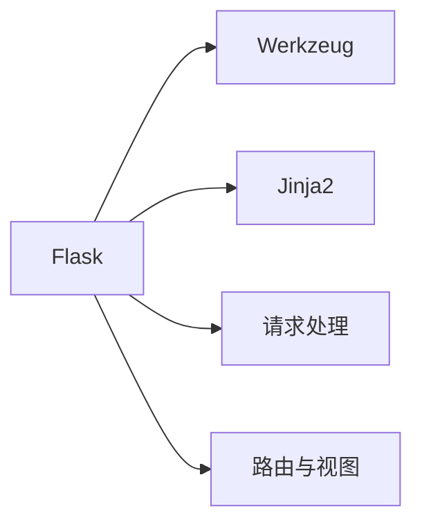

                 

# Flask 框架：微型 Python 框架

> 关键词：Flask, Python, Web 开发, RESTful API, 微服务, Web 应用, 轻量级

## 1. 背景介绍

### 1.1 问题由来
在 Web 开发领域，Python 因其简洁性、可读性和强大的标准库，赢得了广泛的欢迎。特别是在 Web 应用开发方面，Python 框架如 Django、Flask 等，为开发者提供了高效、灵活的开发平台。而 Flask，作为微型 Python 框架，因其轻量级和易用性，在小型 Web 应用、原型设计和 API 开发中尤为适合。

然而，尽管 Flask 具备诸多优势，其在许多初学者和中级开发者中仍然存在误解。本文档旨在深入探讨 Flask 框架的核心概念、设计原理以及实际应用场景，帮助读者全面理解 Flask 框架，并掌握其在 Web 开发中的使用技巧。

### 1.2 问题核心关键点
本文将围绕 Flask 框架展开，具体阐述以下核心关键点：
- Flask 框架的设计理念和架构特点
- Flask 中的核心概念与术语
- 如何使用 Flask 框架构建高效、灵活的 Web 应用
- Flask 框架在实际项目中的具体应用案例

通过这些关键点，我们将帮助读者深入理解 Flask 框架，并在 Web 开发实践中灵活应用其功能。

### 1.3 问题研究意义
深入学习 Flask 框架对于 Web 开发者具有重要意义，主要体现在以下几个方面：
- 了解 Flask 框架的设计哲学，掌握其高效、灵活的 Web 应用构建能力
- 熟悉 Flask 的核心概念和术语，提升 Web 开发的技能和效率
- 学习 Flask 在实际项目中的应用，提高项目开发的质量和速度
- 为更复杂的 Web 框架（如 Django）奠定基础，拓展 Web 开发的能力

## 2. 核心概念与联系

### 2.1 核心概念概述

为了更好地理解 Flask 框架，我们首先介绍一些核心概念：

- **Flask**：轻量级的 Python 微型 Web 框架，基于 Werkzeug 和 Jinja2，支持快速开发和部署 Web 应用。
- **Werkzeug**：一个成熟的 Web 工具包，提供请求和响应处理、路由和视图功能。
- **Jinja2**：一个用于生成动态 HTML 页面和邮件模板的模板引擎。

### 2.2 核心概念原理和架构的 Mermaid 流程图


### 2.3 核心概念联系
Flask 框架主要由以下几个部分组成，它们通过合理的接口设计协同工作，共同实现 Web 应用的高效构建：
- **请求处理**：通过 Werkzeug 实现请求的解析、路由匹配、请求传递等。
- **路由与视图**：通过 Werkzeug 和 Jinja2 配合实现视图的渲染和动态数据绑定。
- **模板引擎**：通过 Jinja2 生成动态 HTML 页面和邮件模板。

## 3. 核心算法原理 & 具体操作步骤

### 3.1 算法原理概述

Flask 框架的核心原理是基于 Werkzeug 和 Jinja2 构建轻量级的 Web 应用。其设计哲学是"Not anOther web framework"，即不是另一个 Web 框架，而是提供了一组灵活的工具，用于构建个性化的 Web 应用。

### 3.2 算法步骤详解

构建 Flask 应用的基本步骤包括：
1. 安装 Flask 库。
2. 创建 Flask 应用实例。
3. 定义路由和视图。
4. 配置模板和静态资源。
5. 运行应用。

### 3.3 算法优缺点
Flask 框架的优点主要包括：
- 轻量级：相比 Django 等大型框架，Flask 提供了更小的代码基础，适合小型应用和快速原型开发。
- 灵活性：Flask 提供丰富的扩展和插件，支持动态添加功能。
- 简单易用：Flask 的 API 设计直观，易于上手，适合初学者。

缺点则包括：
- 不适合大型应用：由于 Flask 的核心库较少，支持的功能相对有限，不适用于大型、高并发的 Web 应用。
- 社区规模：Flask 社区相对较小，寻找第三方插件和解决方案可能需要额外努力。

### 3.4 算法应用领域

Flask 框架广泛适用于以下场景：
- 小型 Web 应用和原型设计
- RESTful API 开发
- 微服务架构下的组件化开发
- 快速响应的小型 Web 服务

## 4. 数学模型和公式 & 详细讲解 & 举例说明

### 4.1 数学模型构建

在 Flask 中，路由和视图是实现请求处理的两个核心组件。假设我们定义了一个简单的路由，用于处理 `/` 路径下的请求：

```python
from flask import Flask, request, render_template

app = Flask(__name__)

@app.route('/')
def index():
    return 'Hello, World!'

if __name__ == '__main__':
    app.run(debug=True)
```

### 4.2 公式推导过程

路由 `/` 的 URL 路径为 `/`，使用 `@app.route` 装饰器定义，`index()` 函数作为视图函数，处理该路径的请求。当请求到达 `/` 路径时，Flask 框架自动将请求传递给 `index()` 函数，并返回字符串 `'Hello, World!'`。

### 4.3 案例分析与讲解

通过上述代码示例，我们可以看到 Flask 框架的基本工作流程：
- 创建 Flask 应用实例 `app = Flask(__name__)`。
- 使用 `@app.route` 装饰器定义路由，即 `/` 路径。
- 实现视图函数 `index()`，处理 `/` 路径的请求。
- 通过 `return` 语句返回处理结果，即字符串 `'Hello, World!'`。

## 5. 项目实践：代码实例和详细解释说明

### 5.1 开发环境搭建

使用 Flask 开发 Web 应用，需要先安装 Flask 库。可以通过以下命令安装：

```bash
pip install Flask
```

### 5.2 源代码详细实现

以下是一个完整的 Flask 应用示例，包括路由、视图、模板渲染和静态资源配置：

```python
from flask import Flask, request, render_template

app = Flask(__name__)

@app.route('/')
def index():
    return 'Hello, World!'

@app.route('/about')
def about():
    return render_template('about.html')

@app.route('/contact')
def contact():
    return render_template('contact.html')

@app.route('/static/<path:filename>')
def static(filename):
    return send_from_directory('static', filename)

if __name__ == '__main__':
    app.run(debug=True)
```

在上述示例中，我们定义了三个路由：
- `/`：返回字符串 `'Hello, World!'`。
- `/about`：返回渲染后的 `about.html` 模板。
- `/contact`：返回渲染后的 `contact.html` 模板。

此外，我们还定义了静态文件路径处理函数 `static()`，用于处理静态文件的请求。

### 5.3 代码解读与分析

在 Flask 中，路由使用 `@app.route` 装饰器定义，路由参数使用 `<variable_name>` 格式，例如 `/<path:filename>`。视图函数根据路由参数自动匹配请求路径，并返回相应的处理结果。使用 `send_from_directory` 函数可以方便地发送静态文件。

### 5.4 运行结果展示

启动应用后，在浏览器中访问 `http://localhost:5000/`，即可显示 `'Hello, World!'`。访问 `http://localhost:5000/about` 和 `http://localhost:5000/contact`，可以显示相应的模板页面。

## 6. 实际应用场景

### 6.1 小型 Web 应用

Flask 最适合构建小型 Web 应用，如个人博客、小型论坛等。其轻量级和易用性使得开发效率大幅提高，同时扩展性和灵活性也保证了应用的可维护性。

### 6.2 RESTful API 开发

由于 Flask 提供了丰富的工具和插件，可以方便地构建 RESTful API，支持 HTTP 请求、响应和路由，满足现代 Web 服务的需求。

### 6.3 微服务架构

在微服务架构下，Flask 的组件化设计使得开发和部署变得灵活高效，每个服务模块可以独立运行和扩展。

### 6.4 未来应用展望

Flask 框架在小型应用和 API 开发中具备不可替代的优势，未来将继续发挥其高效、灵活的特点，为 Web 开发带来更多创新和突破。

## 7. 工具和资源推荐

### 7.1 学习资源推荐

为了帮助开发者深入理解 Flask 框架，以下是一些优质的学习资源：

1. **Flask 官方文档**：[https://flask.palletsprojects.com/](https://flask.palletsprojects.com/)
2. **Flask Mega-Tutorial**：[https://blog.miguelgrinberg.com/post/the-flask-mega-tutorial-part-i-hello-world](https://blog.miguelgrinberg.com/post/the-flask-mega-tutorial-part-i-hello-world)
3. **Flask by Example**：[https://www.packtpub.com/product/flask-by-example/9781785283557](https://www.packtpub.com/product/flask-by-example/9781785283557)
4. **Flask Web Development**：[https://flaskwebdev.com/](https://flaskwebdev.com/)
5. **Flask Cookbook**：[https://flask-cookbook.readthedocs.io/en/latest/](https://flask-cookbook.readthedocs.io/en/latest/)

### 7.2 开发工具推荐

以下是一些常用的 Flask 开发工具：

1. **PyCharm**：Google 开发的全功能 IDE，支持 Flask 开发和调试。
2. **Visual Studio Code**：轻量级的代码编辑器，支持 Flask 扩展和插件。
3. **Flask extensions**：丰富的 Flask 扩展库，如 Flask-SQLAlchemy、Flask-WTF 等。
4. **Jinja2**：动态 HTML 模板引擎，支持 Flask 应用。
5. **WTForms**：Flask 表单扩展，支持数据验证和表单处理。

### 7.3 相关论文推荐

以下是几篇关于 Flask 框架的经典论文，推荐阅读：

1. **"Microframeworks: Startups, Scale-ups, and the art of small design"**：[https://www.smallthings.dk/posts/microframeworks/](https://www.smallthings.dk/posts/microframeworks/)
2. **"Flask in 10 minutes"**：[https://www.educative.io/blog/flask-in-10-minutes](https://www.educative.io/blog/flask-in-10-minutes)
3. **"Flask: A web framework for Python"**：[https://web.archive.org/web/20180302032627/https://miguelgrinberg.com/blog/a-web-framework-for-python](https://web.archive.org/web/20180302032627/https://miguelgrinberg.com/blog/a-web-framework-for-python)

## 8. 总结：未来发展趋势与挑战

### 8.1 总结

本文对 Flask 框架进行了全面系统的介绍，详细阐述了 Flask 的设计理念、核心概念和操作步骤，并通过代码实例展示了其实际应用。通过学习 Flask，读者可以深入理解微型 Web 框架的构建和使用，掌握高效、灵活的 Web 应用开发能力。

### 8.2 未来发展趋势

Flask 框架在小型应用和 API 开发中具备不可替代的优势，未来将继续发挥其高效、灵活的特点，为 Web 开发带来更多创新和突破。

### 8.3 面临的挑战

尽管 Flask 框架具备诸多优势，但在大型应用和高并发场景下仍面临挑战：
- 扩展性有限：相比 Django 等大型框架，Flask 在扩展性和功能支持上有所不足。
- 社区规模：Flask 社区相对较小，寻找第三方插件和解决方案可能需要额外努力。

### 8.4 研究展望

未来，Flask 框架的发展将聚焦于以下几个方向：
- 扩展功能支持：通过引入更多扩展和插件，增强 Flask 的功能性。
- 社区生态建设：促进社区发展，吸引更多开发者加入，共同推动 Flask 的进步。
- 与其他框架的协作：与其他 Web 框架（如 Django）进行更多协作，互补优势。

## 9. 附录：常见问题与解答

**Q1：Flask 和 Django 有什么区别？**

A: Flask 和 Django 都是 Python 的 Web 框架，但 Flask 更加轻量级和灵活，适合小型应用和 API 开发；Django 则功能丰富、稳定性高，适合大型应用。

**Q2：如何配置 Flask 的环境变量？**

A: Flask 支持通过 `app.config` 对象设置环境变量，例如：

```python
app.config['SECRET_KEY'] = 'my_secret_key'
```

**Q3：如何实现 Flask 应用的热更新？**

A: 使用 Flask 扩展如 Flask-DebugToolbar，可以实时显示应用状态和错误信息，帮助开发者快速定位问题。

**Q4：Flask 的路由和视图函数是如何关联的？**

A: 通过 `@app.route` 装饰器定义路由，路由参数使用 `<variable_name>` 格式，路由参数值传递给视图函数。例如：

```python
@app.route('/user/<username>')
def show_user_profile(username):
    return 'User %s' % username
```

**Q5：如何使用 Flask 构建 RESTful API？**

A: Flask 提供了丰富的工具和插件，如 Flask-RESTful，可以快速构建 RESTful API，支持 HTTP 请求、响应和路由。

---

作者：禅与计算机程序设计艺术 / Zen and the Art of Computer Programming

