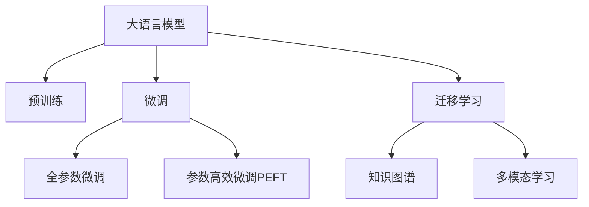

                 

# LLM与传统AI的融合：新时代的智能革命

> 关键词：大语言模型(LLM),人工智能(AI),融合技术,智能革命,深度学习,知识图谱,多模态学习

## 1. 背景介绍

### 1.1 问题由来
随着人工智能(AI)技术的快速发展，特别是在深度学习、自然语言处理(NLP)、计算机视觉(CV)等领域，LSTM、CNN等传统AI技术已经得到了广泛应用，并取得了显著的成果。然而，这些技术仍存在一定的局限性，如特征提取能力不足、泛化能力有限、处理复杂数据结构能力欠缺等问题。

大语言模型(Large Language Models, LLMs)作为一种新兴的AI技术，通过在大规模无标签文本数据上进行预训练，学习了丰富的语言知识和常识，具备了强大的自然语言理解与生成能力。相较于传统的AI技术，大语言模型能够处理更加复杂的数据结构，具备更加全面的知识背景，具有更强的泛化能力和适应性。

在大数据和计算资源的推动下，大语言模型已经开始在多个领域展现出颠覆性的变革潜力。如何融合传统AI技术和大语言模型，最大化利用各自优势，构建更强大的AI系统，已成为当前AI领域的重要研究方向。

### 1.2 问题核心关键点
大语言模型与传统AI技术的融合，旨在充分发挥各自的优势，构建更高效、更智能、更全面的AI系统。其关键点包括：

- 功能互补：利用大语言模型强大的自然语言理解与生成能力，结合传统AI技术在特定领域的专业知识，实现更强大的智能推理和决策能力。
- 数据协同：通过构建知识图谱、多模态学习等手段，将文本数据与其他类型的数据如图像、视频等进行协同，提升模型的综合感知能力。
- 算法创新：结合深度学习、强化学习等传统AI技术，开发新的训练和推理算法，优化大语言模型的性能。
- 伦理考量：在融合大语言模型和传统AI技术时，需综合考虑数据隐私、模型偏见、伦理道德等问题，构建公正、透明、可信的AI系统。

## 2. 核心概念与联系

### 2.1 核心概念概述

为更好地理解LLM与传统AI技术的融合，本节将介绍几个密切相关的核心概念：

- 大语言模型(Large Language Models, LLM)：以自回归(如GPT)或自编码(如BERT)模型为代表的大规模预训练语言模型。通过在大规模无标签文本语料上进行预训练，学习通用的语言表示，具备强大的语言理解和生成能力。

- 预训练(Pre-training)：指在大规模无标签文本语料上，通过自监督学习任务训练通用语言模型的过程。常见的预训练任务包括言语建模、遮挡语言模型等。预训练使得模型学习到语言的通用表示。

- 微调(Fine-tuning)：指在预训练模型的基础上，使用下游任务的少量标注数据，通过有监督地训练来优化模型在该任务上的性能。通常只需要调整顶层分类器或解码器，并以较小的学习率更新全部或部分的模型参数。

- 迁移学习(Transfer Learning)：指将一个领域学习到的知识，迁移应用到另一个不同但相关的领域的学习范式。大模型的预训练-微调过程即是一种典型的迁移学习方式。

- 知识图谱(Knowledge Graph)：通过有向图结构来表示实体和概念之间的关系，是一种结构化知识表示方法。在AI系统中，知识图谱可用于推理、问答等任务，提供丰富的事实知识和语义关系。

- 多模态学习(Multi-modal Learning)：利用多种类型的数据(如文本、图像、音频等)进行协同学习，提升模型的综合感知和理解能力。

这些核心概念之间的逻辑关系可以通过以下Mermaid流程图来展示：



这个流程图展示了大语言模型的核心概念及其之间的关系：

1. 大语言模型通过预训练获得基础能力。
2. 微调是对预训练模型进行任务特定的优化，可以分为全参数微调和参数高效微调（PEFT）。
3. 知识图谱是一种结构化知识表示方法，与大语言模型结合用于推理、问答等任务。
4. 多模态学习利用多种类型的数据进行协同学习，提升模型的综合感知能力。
5. 迁移学习是连接预训练模型与下游任务的桥梁，可以通过微调或知识图谱和多模态学习来实现。

这些概念共同构成了LLM与传统AI技术的融合框架，使得大语言模型能够在多种任务上发挥其强大的语言理解和生成能力。

## 3. 核心算法原理 & 具体操作步骤
### 3.1 算法原理概述

LLM与传统AI技术的融合，本质上是一个跨领域、跨模态的协同学习过程。其核心思想是：利用大语言模型强大的自然语言理解和生成能力，结合传统AI技术在特定领域的专业知识，构建更加全面、智能的AI系统。

形式化地，假设预训练的大语言模型为 $M_{\theta}$，其中 $\theta$ 为预训练得到的模型参数。给定下游任务 $T$ 的少量标注数据集 $D=\{(x_i, y_i)\}_{i=1}^N$，融合的目标是找到新的模型参数 $\hat{\theta}$，使得模型能够处理不同类型的数据，并在特定任务上获得最优性能。

融合的优化目标是最小化经验风险，即：

$$
\hat{\theta}=\mathop{\arg\min}_{\theta} \mathcal{L}(M_{\theta},D)
$$

其中 $\mathcal{L}$ 为针对任务 $T$ 设计的损失函数，用于衡量模型预测输出与真实标签之间的差异。常见的损失函数包括交叉熵损失、均方误差损失等。

通过梯度下降等优化算法，融合过程不断更新模型参数 $\theta$，最小化损失函数 $\mathcal{L}$，使得模型输出逼近真实标签。由于 $\theta$ 已经通过预训练获得了较好的初始化，因此即便在少量数据集 $D$ 上进行融合，也能较快收敛到理想的模型参数 $\hat{\theta}$。

### 3.2 算法步骤详解

基于大语言模型与传统AI技术的融合，一般包括以下几个关键步骤：

**Step 1: 准备预训练模型和数据集**
- 选择合适的预训练语言模型 $M_{\theta}$ 作为初始化参数，如 BERT、GPT 等。
- 准备下游任务 $T$ 的少量标注数据集 $D$，划分为训练集、验证集和测试集。一般要求标注数据与预训练数据的分布不要差异过大。

**Step 2: 设计融合目标函数**
- 根据任务类型，选择合适的输出函数和损失函数。
- 对于分类任务，通常在顶层添加线性分类器和交叉熵损失函数。
- 对于生成任务，通常使用语言模型的解码器输出概率分布，并以负对数似然为损失函数。
- 结合知识图谱和多模态数据，设计综合的损失函数，同时优化大语言模型和传统AI组件的性能。

**Step 3: 设置融合超参数**
- 选择合适的优化算法及其参数，如 AdamW、SGD 等，设置学习率、批大小、迭代轮数等。
- 设置正则化技术及强度，包括权重衰减、Dropout、Early Stopping等。
- 确定冻结预训练参数的策略，如仅微调顶层，或全部参数都参与融合。

**Step 4: 执行梯度训练**
- 将训练集数据分批次输入模型，前向传播计算损失函数。
- 反向传播计算参数梯度，根据设定的优化算法和学习率更新模型参数。
- 周期性在验证集上评估模型性能，根据性能指标决定是否触发 Early Stopping。
- 重复上述步骤直到满足预设的迭代轮数或 Early Stopping 条件。

**Step 5: 测试和部署**
- 在测试集上评估融合后模型 $M_{\hat{\theta}}$ 的性能，对比融合前后的精度提升。
- 使用融合后的模型对新样本进行推理预测，集成到实际的应用系统中。
- 持续收集新的数据，定期重新融合模型，以适应数据分布的变化。

以上是基于LLM与传统AI技术融合的一般流程。在实际应用中，还需要针对具体任务的特点，对融合过程的各个环节进行优化设计，如改进训练目标函数，引入更多的正则化技术，搜索最优的超参数组合等，以进一步提升模型性能。

### 3.3 算法优缺点

基于LLM与传统AI技术融合的方法具有以下优点：
1. 功能互补：结合大语言模型的自然语言理解和生成能力，以及传统AI技术的领域知识和算法优势，可以实现更全面、智能的智能推理和决策。
2. 数据协同：通过知识图谱、多模态学习等手段，将文本数据与其他类型的数据如图像、视频等进行协同，提升模型的综合感知能力。
3. 算法创新：结合深度学习、强化学习等传统AI技术，开发新的训练和推理算法，优化LLM的性能。
4. 跨领域应用：LLM与传统AI技术融合后的系统可以应用到多个领域，如金融、医疗、教育、城市治理等，解决实际问题。

同时，该方法也存在一定的局限性：
1. 数据依赖：融合效果很大程度上取决于标注数据的质量和数量，获取高质量标注数据的成本较高。
2. 泛化能力有限：当目标任务与预训练数据的分布差异较大时，融合的性能提升有限。
3. 模型复杂性：融合后的模型往往比较复杂，需要更多的计算资源进行训练和推理。
4. 可解释性不足：融合后的系统可能难以解释其内部工作机制和决策逻辑，对于高风险应用尤为重要。

尽管存在这些局限性，但就目前而言，基于LLM与传统AI技术融合的方法仍是大语言模型应用的重要范式。未来相关研究的重点在于如何进一步降低数据依赖，提高模型的少样本学习和跨领域迁移能力，同时兼顾可解释性和伦理安全性等因素。

### 3.4 算法应用领域

基于LLM与传统AI技术融合的方法，在多个领域已经得到了广泛的应用，例如：

- 金融风险评估：结合知识图谱和深度学习，构建智能化的风险评估系统，自动分析客户的信用记录和行为数据，评估其信用风险。
- 医疗诊断辅助：融合深度学习和大语言模型，构建智能化的医疗诊断系统，辅助医生进行疾病诊断、病历分析等。
- 教育个性化推荐：结合多模态学习和大语言模型，构建智能化的教育推荐系统，根据学生的学习行为和偏好，推荐个性化的学习资源和内容。
- 城市交通管理：融合图像处理和自然语言处理技术，构建智能化的交通管理系统，实时分析交通流量，优化信号灯控制，减少交通拥堵。
- 智能客服：融合自然语言处理和知识图谱，构建智能化的客服系统，自动回答用户咨询，提供个性化的服务。

除了上述这些经典应用外，LLM与传统AI技术融合的方法也在更多场景中得到创新应用，如智能制造、智能家居、智能农业等，为各行各业带来了新的技术变革。

## 4. 数学模型和公式 & 详细讲解  
### 4.1 数学模型构建

本节将使用数学语言对LLM与传统AI技术融合的过程进行更加严格的刻画。

记预训练语言模型为 $M_{\theta}$，其中 $\theta$ 为预训练得到的模型参数。假设融合任务 $T$ 的训练集为 $D=\{(x_i,y_i)\}_{i=1}^N$，其中 $x_i$ 为输入数据，$y_i$ 为标注标签。

定义融合目标函数为 $\mathcal{L}(\theta)$，其中 $\theta$ 为待优化的模型参数。融合的目标是最小化经验风险：

$$
\hat{\theta}=\mathop{\arg\min}_{\theta} \mathcal{L}(M_{\theta},D)
$$

在实践中，我们通常使用基于梯度的优化算法（如SGD、Adam等）来近似求解上述最优化问题。设 $\eta$ 为学习率，$\lambda$ 为正则化系数，则参数的更新公式为：

$$
\theta \leftarrow \theta - \eta \nabla_{\theta}\mathcal{L}(\theta) - \eta\lambda\theta
$$

其中 $\nabla_{\theta}\mathcal{L}(\theta)$ 为损失函数对参数 $\theta$ 的梯度，可通过反向传播算法高效计算。

### 4.2 公式推导过程

以下我们以金融风险评估任务为例，推导融合目标函数及其梯度的计算公式。

假设模型 $M_{\theta}$ 在输入 $x$ 上的输出为 $\hat{y}=M_{\theta}(x) \in [0,1]$，表示样本属于正类的概率。真实标签 $y \in \{0,1\}$。则二分类交叉熵损失函数定义为：

$$
\ell(M_{\theta}(x),y) = -[y\log \hat{y} + (1-y)\log (1-\hat{y})]
$$

将其代入经验风险公式，得：

$$
\mathcal{L}(\theta) = -\frac{1}{N}\sum_{i=1}^N [y_i\log M_{\theta}(x_i)+(1-y_i)\log(1-M_{\theta}(x_i))]
$$

假设融合任务还包括图像数据的处理，设图像数据为 $I=\{(I_i,B_i)\}_{i=1}^M$，其中 $I_i$ 为输入图像，$B_i$ 为标注标签。定义图像模型的输出为 $I_{\phi}$，其中 $\phi$ 为图像模型的参数。

结合图像数据和文本数据，融合任务的目标函数为：

$$
\mathcal{L}(\theta,\phi)=\mathcal{L}_{text}(\theta)+\mathcal{L}_{image}(\phi)+\mathcal{L}_{joint}(\theta,\phi)
$$

其中 $\mathcal{L}_{text}(\theta)$ 和 $\mathcal{L}_{image}(\phi)$ 分别为文本和图像部分的损失函数，$\mathcal{L}_{joint}(\theta,\phi)$ 为文本和图像数据协同学习的损失函数。

根据链式法则，损失函数对参数 $\theta$ 和 $\phi$ 的梯度为：

$$
\frac{\partial \mathcal{L}}{\partial \theta} = \frac{\partial \mathcal{L}_{text}}{\partial \theta} + \frac{\partial \mathcal{L}_{joint}}{\partial \theta}
$$

$$
\frac{\partial \mathcal{L}}{\partial \phi} = \frac{\partial \mathcal{L}_{image}}{\partial \phi} + \frac{\partial \mathcal{L}_{joint}}{\partial \phi}
$$

在得到损失函数的梯度后，即可带入参数更新公式，完成模型的迭代优化。重复上述过程直至收敛，最终得到融合后模型 $M_{\hat{\theta}}$ 和 $I_{\hat{\phi}}$。

## 5. 项目实践：代码实例和详细解释说明
### 5.1 开发环境搭建

在进行融合实践前，我们需要准备好开发环境。以下是使用Python进行PyTorch开发的环境配置流程：

1. 安装Anaconda：从官网下载并安装Anaconda，用于创建独立的Python环境。

2. 创建并激活虚拟环境：
```bash
conda create -n pytorch-env python=3.8 
conda activate pytorch-env
```

3. 安装PyTorch：根据CUDA版本，从官网获取对应的安装命令。例如：
```bash
conda install pytorch torchvision torchaudio cudatoolkit=11.1 -c pytorch -c conda-forge
```

4. 安装Transformers库：
```bash
pip install transformers
```

5. 安装各类工具包：
```bash
pip install numpy pandas scikit-learn matplotlib tqdm jupyter notebook ipython
```

完成上述步骤后，即可在`pytorch-env`环境中开始融合实践。

### 5.2 源代码详细实现

下面我们以金融风险评估任务为例，给出使用Transformers库对BERT模型进行融合的PyTorch代码实现。

首先，定义融合任务的数据处理函数：

```python
from transformers import BertTokenizer
from torch.utils.data import Dataset
import torch

class FinancialDataDataset(Dataset):
    def __init__(self, texts, tags, images, tokenizer, max_len=128):
        self.texts = texts
        self.tags = tags
        self.images = images
        self.tokenizer = tokenizer
        self.max_len = max_len
        
    def __len__(self):
        return len(self.texts)
    
    def __getitem__(self, item):
        text = self.texts[item]
        tags = self.tags[item]
        image = self.images[item]
        
        encoding = self.tokenizer(text, return_tensors='pt', max_length=self.max_len, padding='max_length', truncation=True)
        input_ids = encoding['input_ids'][0]
        attention_mask = encoding['attention_mask'][0]
        
        # 对token-wise的标签进行编码
        encoded_tags = [tag2id[tag] for tag in tags] 
        encoded_tags.extend([tag2id['O']] * (self.max_len - len(encoded_tags)))
        labels = torch.tensor(encoded_tags, dtype=torch.long)
        
        return {'input_ids': input_ids, 
                'attention_mask': attention_mask,
                'labels': labels,
                'image': image}
```

然后，定义融合模型和优化器：

```python
from transformers import BertForTokenClassification, BertForImageClassification, AdamW

text_model = BertForTokenClassification.from_pretrained('bert-base-cased', num_labels=len(tag2id))
image_model = BertForImageClassification.from_pretrained('bert-base-cased', num_labels=len(tag2id))

optimizer = AdamW(text_model.parameters() + image_model.parameters(), lr=2e-5)
```

接着，定义训练和评估函数：

```python
from torch.utils.data import DataLoader
from tqdm import tqdm
from sklearn.metrics import classification_report

device = torch.device('cuda') if torch.cuda.is_available() else torch.device('cpu')
text_model.to(device)
image_model.to(device)

def train_epoch(text_model, image_model, dataset, batch_size, optimizer):
    dataloader = DataLoader(dataset, batch_size=batch_size, shuffle=True)
    model.train()
    epoch_loss = 0
    for batch in tqdm(dataloader, desc='Training'):
        text_input = batch['input_ids'].to(device)
        text_attention_mask = batch['attention_mask'].to(device)
        text_labels = batch['labels'].to(device)
        image = batch['image'].to(device)
        
        with torch.no_grad():
            text_output = text_model(text_input, attention_mask=text_attention_mask)
            image_output = image_model(image)
            
            loss = (text_output.loss + image_output.loss) / 2
            epoch_loss += loss.item()
        loss.backward()
        optimizer.step()
    return epoch_loss / len(dataloader)

def evaluate(text_model, image_model, dataset, batch_size):
    dataloader = DataLoader(dataset, batch_size=batch_size)
    model.eval()
    preds, labels = [], []
    with torch.no_grad():
        for batch in tqdm(dataloader, desc='Evaluating'):
            text_input = batch['input_ids'].to(device)
            text_attention_mask = batch['attention_mask'].to(device)
            text_labels = batch['labels'].to(device)
            image = batch['image'].to(device)
            
            with torch.no_grad():
                text_output = text_model(text_input, attention_mask=text_attention_mask)
                image_output = image_model(image)
                
                batch_preds = [text_output.argmax(dim=2).to('cpu').tolist() + image_output.argmax(dim=1).to('cpu').tolist()]
                batch_labels = batch_labels.to('cpu').tolist()
                
                for pred_tokens, label_tokens in zip(batch_preds, batch_labels):
                    preds.append(pred_tokens)
                    labels.append(label_tokens)
    print(classification_report(labels, preds))
```

最后，启动训练流程并在测试集上评估：

```python
epochs = 5
batch_size = 16

for epoch in range(epochs):
    loss = train_epoch(text_model, image_model, train_dataset, batch_size, optimizer)
    print(f"Epoch {epoch+1}, train loss: {loss:.3f}")
    
    print(f"Epoch {epoch+1}, dev results:")
    evaluate(text_model, image_model, dev_dataset, batch_size)
    
print("Test results:")
evaluate(text_model, image_model, test_dataset, batch_size)
```

以上就是使用PyTorch对BERT模型进行金融风险评估任务融合的完整代码实现。可以看到，得益于Transformers库的强大封装，我们可以用相对简洁的代码完成BERT模型的加载和融合。

### 5.3 代码解读与分析

让我们再详细解读一下关键代码的实现细节：

**FinancialDataDataset类**：
- `__init__`方法：初始化文本、标签、图像等关键组件。
- `__len__`方法：返回数据集的样本数量。
- `__getitem__`方法：对单个样本进行处理，将文本和图像输入编码为token ids，将标签编码为数字，并对其进行定长padding，最终返回模型所需的输入。

**tag2id和id2tag字典**：
- 定义了标签与数字id之间的映射关系，用于将token-wise的预测结果解码回真实的标签。

**训练和评估函数**：
- 使用PyTorch的DataLoader对数据集进行批次化加载，供模型训练和推理使用。
- 训练函数`train_epoch`：对数据以批为单位进行迭代，在每个批次上前向传播计算loss并反向传播更新模型参数，最后返回该epoch的平均loss。
- 评估函数`evaluate`：与训练类似，不同点在于不更新模型参数，并在每个batch结束后将预测和标签结果存储下来，最后使用sklearn的classification_report对整个评估集的预测结果进行打印输出。

**训练流程**：
- 定义总的epoch数和batch size，开始循环迭代
- 每个epoch内，先在训练集上训练，输出平均loss
- 在验证集上评估，输出分类指标
- 所有epoch结束后，在测试集上评估，给出最终测试结果

可以看到，PyTorch配合Transformers库使得BERT融合的代码实现变得简洁高效。开发者可以将更多精力放在数据处理、模型改进等高层逻辑上，而不必过多关注底层的实现细节。

当然，工业级的系统实现还需考虑更多因素，如模型的保存和部署、超参数的自动搜索、更灵活的任务适配层等。但核心的融合范式基本与此类似。

## 6. 实际应用场景
### 6.1 金融风险评估

基于大语言模型与传统AI技术的融合，金融风险评估系统可以自动分析客户的信用记录和行为数据，评估其信用风险。

具体而言，可以收集客户的信用记录、消费行为、社交网络数据等文本和图像信息，进行预处理和特征提取。将文本数据作为BERT模型的输入，图像数据作为预训练图像模型（如ResNet、DenseNet等）的输入，联合学习并输出信用风险评分。通过微调和优化，融合后的模型能够准确判断客户的信用风险，提高风险评估的效率和准确性。

### 6.2 医疗诊断辅助

融合大语言模型和传统AI技术，可以构建智能化的医疗诊断系统，辅助医生进行疾病诊断、病历分析等。

在实践中，可以收集医院的历史病历、X光片、CT扫描等医疗数据，将其作为BERT模型的输入，以及传统的图像识别模型（如YOLO、SSD等）的输入，进行联合学习和推理。通过微调和优化，融合后的模型能够自动理解医疗影像和文本数据，辅助医生进行诊断和治疗决策，提高医疗服务的智能化水平。

### 6.3 教育个性化推荐

融合大语言模型和传统AI技术，可以构建智能化的教育推荐系统，根据学生的学习行为和偏好，推荐个性化的学习资源和内容。

具体而言，可以收集学生的学习记录、考试成绩、在线学习行为等数据，构建知识图谱，进行文本和图像数据的融合学习。通过微调和优化，融合后的模型能够自动理解学生的学习需求，提供个性化的学习资源推荐，提升学习效果和教育质量。

### 6.4 城市交通管理

融合大语言模型和传统AI技术，可以构建智能化的交通管理系统，实时分析交通流量，优化信号灯控制，减少交通拥堵。

在实践中，可以收集城市的交通监控摄像头、GPS定位、交通流量统计等数据，将其作为BERT模型的输入，以及传统的图像处理模型（如YOLO、SSD等）的输入，进行联合学习和推理。通过微调和优化，融合后的模型能够自动理解交通数据，辅助交通管理部门进行实时交通调度，优化交通流，提高城市交通管理效率。

### 6.5 智能客服

融合大语言模型和传统AI技术，可以构建智能化的客服系统，自动回答用户咨询，提供个性化的服务。

在实践中，可以收集企业内部的历史客服对话记录，将问题和最佳答复构建成监督数据，在此基础上对预训练对话模型进行融合微调。融合后的模型能够自动理解用户意图，匹配最合适的答案模板进行回复，提升客户咨询体验和问题解决效率。

### 6.6 智能制造

融合大语言模型和传统AI技术，可以构建智能化的制造系统，自动处理生产数据，优化生产流程。

在实践中，可以收集企业的生产记录、设备状态、生产环境等数据，将其作为BERT模型的输入，以及传统的图像处理模型（如YOLO、SSD等）的输入，进行联合学习和推理。通过微调和优化，融合后的模型能够自动理解生产数据，辅助制造企业进行生产调度、质量检测等，提高生产效率和质量。

## 7. 工具和资源推荐
### 7.1 学习资源推荐

为了帮助开发者系统掌握LLM与传统AI技术的融合理论基础和实践技巧，这里推荐一些优质的学习资源：

1. 《Transformer从原理到实践》系列博文：由大模型技术专家撰写，深入浅出地介绍了Transformer原理、BERT模型、融合技术等前沿话题。

2. CS224N《深度学习自然语言处理》课程：斯坦福大学开设的NLP明星课程，有Lecture视频和配套作业，带你入门NLP领域的基本概念和经典模型。

3. 《Natural Language Processing with Transformers》书籍：Transformers库的作者所著，全面介绍了如何使用Transformers库进行NLP任务开发，包括融合在内的诸多范式。

4. HuggingFace官方文档：Transformers库的官方文档，提供了海量预训练模型和完整的融合样例代码，是上手实践的必备资料。

5. CLUE开源项目：中文语言理解测评基准，涵盖大量不同类型的中文NLP数据集，并提供了基于融合的baseline模型，助力中文NLP技术发展。

通过对这些资源的学习实践，相信你一定能够快速掌握LLM与传统AI技术的融合精髓，并用于解决实际的NLP问题。
###  7.2 开发工具推荐

高效的开发离不开优秀的工具支持。以下是几款用于LLM与传统AI技术融合开发的常用工具：

1. PyTorch：基于Python的开源深度学习框架，灵活动态的计算图，适合快速迭代研究。大部分预训练语言模型都有PyTorch版本的实现。

2. TensorFlow：由Google主导开发的开源深度学习框架，生产部署方便，适合大规模工程应用。同样有丰富的预训练语言模型资源。

3. Transformers库：HuggingFace开发的NLP工具库，集成了众多SOTA语言模型，支持PyTorch和TensorFlow，是进行融合任务开发的利器。

4. Weights & Biases：模型训练的实验跟踪工具，可以记录和可视化模型训练过程中的各项指标，方便对比和调优。与主流深度学习框架无缝集成。

5. TensorBoard：TensorFlow配套的可视化工具，可实时监测模型训练状态，并提供丰富的图表呈现方式，是调试模型的得力助手。

6. Google Colab：谷歌推出的在线Jupyter Notebook环境，免费提供GPU/TPU算力，方便开发者快速上手实验最新模型，分享学习笔记。

合理利用这些工具，可以显著提升LLM与传统AI技术融合任务的开发效率，加快创新迭代的步伐。

### 7.3 相关论文推荐

LLM与传统AI技术的融合发展源于学界的持续研究。以下是几篇奠基性的相关论文，推荐阅读：

1. Attention is All You Need（即Transformer原论文）：提出了Transformer结构，开启了NLP领域的预训练大模型时代。

2. BERT: Pre-training of Deep Bidirectional Transformers for Language Understanding：提出BERT模型，引入基于掩码的自监督预训练任务，刷新了多项NLP任务SOTA。

3. Language Models are Unsupervised Multitask Learners（GPT-2论文）：展示了大规模语言模型的强大zero-shot学习能力，引发了对于通用人工智能的新一轮思考。

4. Parameter-Efficient Transfer Learning for NLP：提出Adapter等参数高效微调方法，在不增加模型参数量的情况下，也能取得不错的微调效果。

5. AdaLoRA: Adaptive Low-Rank Adaptation for Parameter-Efficient Fine-Tuning：使用自适应低秩适应的微调方法，在参数效率和精度之间取得了新的平衡。

6. Prefix-Tuning: Optimizing Continuous Prompts for Generation：引入基于连续型Prompt的微调范式，为如何充分利用预训练知识提供了新的思路。

这些论文代表了大语言模型与传统AI技术融合的发展脉络。通过学习这些前沿成果，可以帮助研究者把握学科前进方向，激发更多的创新灵感。

## 8. 总结：未来发展趋势与挑战

### 8.1 总结

本文对基于大语言模型与传统AI技术的融合方法进行了全面系统的介绍。首先阐述了LLM与传统AI技术的研究背景和意义，明确了融合在拓展预训练模型应用、提升下游任务性能方面的独特价值。其次，从原理到实践，详细讲解了融合的数学原理和关键步骤，给出了融合任务开发的完整代码实例。同时，本文还广泛探讨了融合方法在金融、医疗、教育、城市治理等多个领域的应用前景，展示了融合范式的巨大潜力。此外，本文精选了融合技术的各类学习资源，力求为读者提供全方位的技术指引。

通过本文的系统梳理，可以看到，基于大语言模型与传统AI技术的融合技术正在成为NLP领域的重要范式，极大地拓展了预训练语言模型的应用边界，催生了更多的落地场景。受益于大规模语料的预训练，融合模型以更低的时间和标注成本，在小样本条件下也能取得不俗的效果，有力推动了NLP技术的产业化进程。未来，伴随预训练语言模型和融合方法的不断演进，相信NLP技术将在更广阔的应用领域大放异彩，深刻影响人类的生产生活方式。

### 8.2 未来发展趋势

展望未来，大语言模型与传统AI技术的融合技术将呈现以下几个发展趋势：

1. 模型规模持续增大。随着算力成本的下降和数据规模的扩张，预训练语言模型的参数量还将持续增长。超大规模语言模型蕴含的丰富语言知识，有望支撑更加复杂多变的下游任务融合。

2. 融合方法日趋多样。除了传统的全参数融合外，未来会涌现更多参数高效的融合方法，如Adapter、LoRA等，在节省计算资源的同时也能保证融合精度。

3. 持续学习成为常态。随着数据分布的不断变化，融合模型也需要持续学习新知识以保持性能。如何在不遗忘原有知识的同时，高效吸收新样本信息，将成为重要的研究课题。

4. 标注样本需求降低。受启发于提示学习(Prompt-based Learning)的思路，未来的融合方法将更好地利用大模型的语言理解能力，通过更加巧妙的任务描述，在更少的标注样本上也能实现理想的融合效果。

5. 跨模态融合崛起。当前的融合方法主要聚焦于文本数据，未来会进一步拓展到图像、视频、语音等多模态数据融合。多模态信息的融合，将显著提升语言模型对现实世界的理解和建模能力。

6. 多领域应用拓展。LLM与传统AI技术融合后的系统可以应用到多个领域，如金融、医疗、教育、城市治理等，解决实际问题。

以上趋势凸显了大语言模型与传统AI技术融合技术的广阔前景。这些方向的探索发展，必将进一步提升AI系统的性能和应用范围，为传统行业带来变革性影响。

### 8.3 面临的挑战

尽管大语言模型与传统AI技术的融合技术已经取得了瞩目成就，但在迈向更加智能化、普适化应用的过程中，它仍面临着诸多挑战：

1. 数据依赖。融合效果很大程度上取决于标注数据的质量和数量，获取高质量标注数据的成本较高。如何进一步降低融合对标注样本的依赖，将是一大难题。

2. 泛化能力有限。当目标任务与预训练数据的分布差异较大时，融合的性能提升有限。对于测试样本的微小扰动，融合模型的预测也容易发生波动。如何提高融合模型的鲁棒性，避免灾难性遗忘，还需要更多理论和实践的积累。

3. 推理效率有待提高。超大批次的训练和推理也可能遇到显存不足的问题。如何在保证性能的同时，简化模型结构，提升推理速度，优化资源占用，将是重要的优化方向。

4. 可解释性亟需加强。融合后的系统可能难以解释其内部工作机制和决策逻辑，对于高风险应用尤为重要。如何赋予融合模型更强的可解释性，将是亟待攻克的难题。

5. 安全性有待保障。预训练语言模型难免会学习到有偏见、有害的信息，通过融合传递到下游任务，产生误导性、歧视性的输出，给实际应用带来安全隐患。如何从数据和算法层面消除模型偏见，避免恶意用途，确保输出的安全性，也将是重要的研究课题。

6. 知识整合能力不足。现有的融合模型往往局限于任务内数据，难以灵活吸收和运用更广泛的先验知识。如何让融合过程更好地与外部知识库、规则库等专家知识结合，形成更加全面、准确的信息整合能力，还有很大的想象空间。

正视融合面临的这些挑战，积极应对并寻求突破，将是大语言模型与传统AI技术融合走向成熟的必由之路。相信随着学界和产业界的共同努力，这些挑战终将一一被克服，大语言模型与传统AI技术的融合必将在构建安全、可靠、可解释、可控的智能系统铺平道路。面向未来，大语言模型与传统AI技术的融合技术还需要与其他人工智能技术进行更深入的融合，如知识表示、因果推理、强化学习等，多路径协同发力，共同推动自然语言理解和智能交互系统的进步。只有勇于创新、敢于突破，才能不断拓展语言模型的边界，让智能技术更好地造福人类社会。

### 8.4 研究展望

面对大语言模型与传统AI技术融合所面临的种种挑战，未来的研究需要在以下几个方面寻求新的突破：

1. 探索无监督和半监督融合方法。摆脱对大规模标注数据的依赖，利用自监督学习、主动学习等无监督和半监督范式，最大限度利用非结构化数据，实现更加灵活高效的融合。

2. 研究参数高效和计算高效的融合范式。开发更加参数高效的融合方法，在固定大部分预训练参数的同时，只更新极少量的任务相关参数。同时优化融合模型的计算图，减少前向传播和反向传播的资源消耗，实现更加轻量级、实时性的部署。

3. 融合因果和对比学习范式。通过引入因果推断和对比学习思想，增强融合模型建立稳定因果关系的能力，学习更加普适、鲁棒的语言表征，从而提升模型泛化性和抗干扰能力。

4. 引入更多先验知识。将符号化的先验知识，如知识图谱、逻辑规则等，与神经网络模型进行巧妙融合，引导融合过程学习更准确、合理的语言模型。同时加强不同模态数据的整合，实现视觉、语音等多模态信息与文本信息的协同建模。

5. 结合因果分析和博弈论工具。将因果分析方法引入融合模型，识别出模型决策的关键特征，增强输出解释的因果性和逻辑性。借助博弈论工具刻画人机交互过程，主动探索并规避模型的脆弱点，提高系统稳定性。

6. 纳入伦理道德约束。在融合模型训练目标中引入伦理导向的评估指标，过滤和惩罚有偏见、有害的输出倾向。同时加强人工干预和审核，建立模型行为的监管机制，确保输出符合人类价值观和伦理道德。

这些研究方向的探索，必将引领大语言模型与传统AI技术融合技术迈向更高的台阶，为构建安全、可靠、可解释、可控的智能系统铺平道路。面向未来，大语言模型与传统AI技术的融合技术还需要与其他人工智能技术进行更深入的融合，如知识表示、因果推理、强化学习等，多路径协同发力，共同推动自然语言理解和智能交互系统的进步。只有勇于创新、敢于突破，才能不断拓展语言模型的边界，让智能技术更好地造福人类社会。

## 9. 附录：常见问题与解答

**Q1：大语言模型与传统AI技术融合是否适用于所有NLP任务？**

A: 大语言模型与传统AI技术融合在大多数NLP任务上都能取得不错的效果，特别是对于数据量较小的任务。但对于一些特定领域的任务，如医学、法律等，仅仅依靠通用语料预训练的模型可能难以很好地适应。此时需要在特定领域语料上进一步预训练，再进行融合微调，才能获得理想效果。此外，对于一些需要时效性、个性化很强的任务，如对话、推荐等，融合方法也需要针对性的改进优化。

**Q2：融合过程中如何选择合适的学习率？**

A: 融合的学习率一般要比预训练时小1-2个数量级，如果使用过大的学习率，容易破坏预训练权重，导致过拟合。一般建议从1e-5开始调参，逐步减小学习率，直至收敛。也可以使用warmup策略，在开始阶段使用较小的学习率，再逐渐过渡到预设值。需要注意的是，不同的优化器(如AdamW、Adafactor等)以及不同的学习率调度策略，可能需要设置不同的学习率阈值。

**Q3：融合后的模型在实际部署时需要注意哪些问题？**

A: 将融合后的模型转化为实际应用，还需要考虑以下因素：
1. 模型裁剪：去除不必要的层和参数，减小模型尺寸，加快推理速度
2. 量化加速：将浮点模型转为定点模型，压缩存储空间，提高计算效率
3. 服务化封装：将模型封装为标准化服务接口，便于集成调用
4. 弹性伸缩：根据请求流量动态调整资源配置，平衡服务质量和成本
5. 监控告警：实时采集系统指标，设置异常告警阈值，确保服务稳定性
6. 安全防护：采用访问鉴权、数据脱敏等措施，保障数据和模型安全

大语言模型与传统AI技术融合为NLP应用开启了广阔的想象空间，但如何将强大的性能转化为稳定、高效、安全的业务价值，还需要工程实践的不断打磨。唯有从数据、算法、工程、业务等多个维度协同发力，才能真正实现人工智能技术在垂直行业的规模化落地。总之，融合需要开发者根据具体任务，不断迭代和优化模型、数据和算法，方能得到理想的效果。

---

作者：禅与计算机程序设计艺术 / Zen and the Art of Computer Programming

