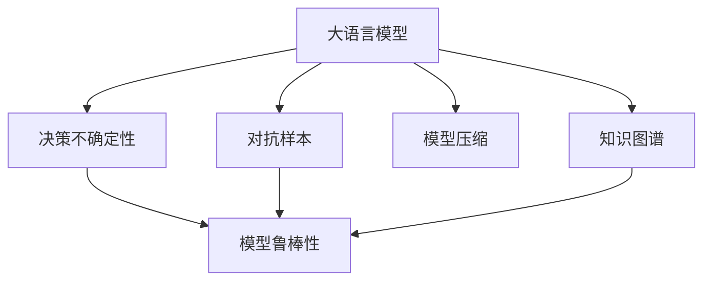

                 

# LLM决策的不确定性：挑战与应对策略

> 关键词：大语言模型(Large Language Model, LLM),决策不确定性,对抗样本,模型鲁棒性,模型压缩,知识图谱

## 1. 背景介绍

### 1.1 问题由来

近年来，随着深度学习技术的快速发展，大规模语言模型(Large Language Model, LLM)在自然语言处理(Natural Language Processing, NLP)领域取得了巨大的突破。这些大语言模型通过在海量无标签文本数据上进行预训练，学习到了丰富的语言知识和常识，可以在各种任务中取得优异的性能。然而，尽管大语言模型在许多任务上已经超越了人类水平，但其决策过程仍然存在一些不确定性和脆弱性。

大语言模型的决策不确定性主要体现在以下几个方面：

1. **输出多样性**：对于相同的输入，不同的预训练模型或微调模型可能会产生不同的输出，导致决策结果的多样性。
2. **鲁棒性不足**：模型对于输入数据的轻微扰动或对抗样本往往敏感，导致输出结果的不稳定性。
3. **知识局限性**：模型在缺乏先验知识的情况下，可能会产生误导性的输出，尤其是在复杂任务中。
4. **可解释性问题**：模型的决策过程缺乏清晰的逻辑解释，难以理解和解释模型的行为。

这些不确定性和脆弱性不仅影响模型的实际应用效果，还对系统的可靠性和安全性构成潜在威胁。因此，如何在保证模型性能的同时，提高其决策的鲁棒性和可解释性，成为当前大语言模型研究的一个重要方向。

### 1.2 问题核心关键点

本文聚焦于大语言模型决策不确定性的挑战与应对策略，旨在深入探讨其不确定性的来源及其解决方法，以期为大语言模型的实际应用提供更加可靠的保障。

## 2. 核心概念与联系

### 2.1 核心概念概述

为更好地理解大语言模型决策不确定性的挑战与应对策略，本节将介绍几个密切相关的核心概念：

- 大语言模型(Large Language Model, LLM)：以自回归(如GPT)或自编码(如BERT)模型为代表的大规模预训练语言模型。通过在大规模无标签文本语料上进行预训练，学习通用的语言表示，具备强大的语言理解和生成能力。

- 决策不确定性(Decision Uncertainty)：指模型在面对输入数据时，其输出结果的不确定性。这种不确定性可能来源于模型自身的内部机制、数据分布的变化、对抗样本等因素。

- 对抗样本(Adversarial Examples)：故意设计的扰动样本，旨在欺骗模型产生错误输出。这类样本通常对模型的鲁棒性构成严重威胁。

- 模型鲁棒性(Model Robustness)：指模型面对输入扰动、对抗样本等干扰时，仍能保持稳定输出性能的能力。

- 模型压缩(Model Compression)：通过剪枝、量化、知识蒸馏等技术，减小模型参数量，提高模型的推理速度和内存占用效率，同时保持其性能。

- 知识图谱(Knowledge Graph)：一种结构化的语义知识表示方法，用于整合和关联大量的知识信息，帮助模型获取先验知识。

这些核心概念之间的逻辑关系可以通过以下Mermaid流程图来展示：

这个流程图展示了大语言模型决策不确定性的核心概念及其之间的关系：

1. 大语言模型通过预训练获得基础能力。
2. 对抗样本挑战模型的鲁棒性。
3. 模型压缩和知识图谱提升模型的鲁棒性。
4. 鲁棒性越强，决策不确定性越小。

## 3. 核心算法原理 & 具体操作步骤
### 3.1 算法原理概述

大语言模型的决策不确定性主要来源于模型的内部机制和数据分布的不稳定性。为提高模型鲁棒性，减少决策不确定性，需要在模型训练和推理过程中引入鲁棒性约束和先验知识。

大语言模型的决策不确定性问题主要可以通过以下几种策略来解决：

1. **对抗训练(Adversarial Training)**：通过引入对抗样本，训练模型对噪声和扰动的鲁棒性，减少对抗样本对模型的影响。
2. **模型压缩(Model Compression)**：通过剪枝、量化、知识蒸馏等技术，减小模型参数量，提高模型的推理速度和内存占用效率，同时保持其性能。
3. **知识图谱(Knowledge Graph)**：将结构化的语义知识整合到模型中，帮助模型获取先验知识，减少知识局限性。

### 3.2 算法步骤详解

#### 3.2.1 对抗训练

对抗训练的目的是提高模型对对抗样本的鲁棒性。具体步骤如下：

1. **生成对抗样本**：对于训练集中的每个样本，生成一个对抗样本。对抗样本通常通过对输入进行微小扰动，使得模型预测错误，如通过梯度扰动、对抗性优化等方法生成。
2. **训练模型**：将对抗样本和原始样本一起输入模型进行训练，优化模型参数。具体地，对于每个样本，计算其对抗样本的梯度，反向传播更新模型参数。
3. **评估模型**：在测试集上评估模型的鲁棒性，如通过C&W算法、PFG算法等生成对抗样本，评估模型在这些对抗样本上的性能。

#### 3.2.2 模型压缩

模型压缩旨在减小模型参数量，提高推理速度和内存占用效率，同时保持模型性能。具体步骤如下：

1. **剪枝(Pruning)**：通过剪枝技术，去除模型中不必要的参数。常用的剪枝方法包括L1正则化、神经网络剪枝等。
2. **量化(Quantization)**：将模型中的浮点参数转化为定点参数，减少存储空间和计算开销。常用的量化方法包括均匀量化、动态量化等。
3. **知识蒸馏(Knowledge Distillation)**：通过训练较小的模型(蒸馏模型)来逼近大模型，减小模型大小，提高推理速度。蒸馏过程通常包括生成教师模型、知识蒸馏损失、蒸馏模型训练等步骤。

#### 3.2.3 知识图谱

知识图谱是一种结构化的语义知识表示方法，用于整合和关联大量的知识信息，帮助模型获取先验知识。具体步骤如下：

1. **构建知识图谱**：通过构建或引入现有的知识图谱，整合和关联相关的知识信息。常用的知识图谱构建方法包括知识抽取、知识融合、知识推理等。
2. **整合到模型**：将知识图谱中的知识信息整合到模型中，如通过知识注入、知识融合等方法，将知识信息嵌入到模型参数或隐状态中。
3. **利用知识图谱**：在模型推理时，利用知识图谱中的先验知识，辅助模型决策，提高决策的准确性和鲁棒性。

### 3.3 算法优缺点

对抗训练、模型压缩和知识图谱在大语言模型决策不确定性的应对中各有优缺点：

#### 对抗训练的优缺点：

**优点**：
- 提高模型对对抗样本的鲁棒性，增强模型的泛化能力。
- 通过对抗训练，模型在面对实际攻击时，能更好地保持稳定输出。

**缺点**：
- 对抗训练需要额外的对抗样本生成和训练时间，增加了计算成本。
- 对抗训练可能导致模型性能下降，尤其是在低噪声数据集上。

#### 模型压缩的优缺点：

**优点**：
- 减小模型参数量，提高推理速度和内存占用效率。
- 通过剪枝和量化，模型可以在有限的计算资源下进行训练和推理。

**缺点**：
- 压缩过程可能降低模型性能，尤其是剪枝和量化方法不当的情况下。
- 模型压缩可能导致模型难以利用先验知识，降低决策的准确性和鲁棒性。

#### 知识图谱的优缺点：

**优点**：
- 整合先验知识，减少知识局限性，提升决策的准确性。
- 通过知识图谱，模型可以更好地理解和解释决策过程，增强可解释性。

**缺点**：
- 知识图谱的构建和维护需要大量的时间和资源。
- 知识图谱的整合可能增加模型的复杂度，降低推理效率。

### 3.4 算法应用领域

对抗训练、模型压缩和知识图谱在大语言模型的决策不确定性应对中得到了广泛应用，覆盖了以下领域：

1. **自然语言理解(NLU)**：在命名实体识别、关系抽取、问答系统等任务中，通过对抗训练和知识图谱，提高模型的鲁棒性和决策准确性。
2. **机器翻译(MT)**：在翻译任务中，通过模型压缩和知识图谱，提升翻译速度和质量。
3. **语音识别(SR)**：在语音识别任务中，通过对抗训练和模型压缩，提高模型的鲁棒性和实时性。
4. **图像识别(CV)**：在图像分类、物体检测等任务中，通过模型压缩和知识图谱，提升识别精度和推理效率。
5. **推荐系统(Reco)**：在个性化推荐中，通过模型压缩和对抗训练，提升推荐效果和系统鲁棒性。
6. **信息检索(Retrieval)**：在信息检索任务中，通过对抗训练和知识图谱，提升检索结果的准确性和相关性。

除了这些经典应用外，知识图谱和对抗训练方法也被创新性地应用到更多场景中，如可控文本生成、多模态信息融合等，为大语言模型的决策不确定性应对提供了新的思路。

## 4. 数学模型和公式 & 详细讲解  
### 4.1 数学模型构建

本节将使用数学语言对大语言模型决策不确定性的应对方法进行更加严格的刻画。

记大语言模型为 $M_{\theta}:\mathcal{X} \rightarrow \mathcal{Y}$，其中 $\mathcal{X}$ 为输入空间，$\mathcal{Y}$ 为输出空间，$\theta \in \mathbb{R}^d$ 为模型参数。假设训练集为 $D=\{(x_i,y_i)\}_{i=1}^N, x_i \in \mathcal{X}, y_i \in \mathcal{Y}$。

定义模型 $M_{\theta}$ 在输入 $x$ 上的输出为 $\hat{y}=M_{\theta}(x)$。假设对抗样本为 $\bar{x}=\mathcal{X}[x+\delta]$，其中 $\delta$ 为扰动向量。

对抗训练的目标是最小化对抗样本上的损失函数，即：

$$
\mathcal{L}_{adv}(\theta) = \frac{1}{N}\sum_{i=1}^N \ell(M_{\theta}(\bar{x_i}),\hat{y_i})
$$

其中 $\ell$ 为对抗样本上的损失函数，通常为交叉熵损失或均方误差损失。

模型压缩的目标是减小模型参数量，提高推理速度和内存占用效率。常用的模型压缩方法包括剪枝、量化、知识蒸馏等。这些方法的数学表达如下：

- **剪枝**：通过L1正则化剪枝，减少模型参数量。数学表达为：

$$
\theta_{pruned} = \arg\min_{\theta} \frac{1}{N}\sum_{i=1}^N \ell(M_{\theta}(x_i),y_i) + \lambda\|\nabla_{\theta}\ell(M_{\theta}(x_i),y_i)\|_1
$$

其中 $\lambda$ 为正则化系数，$\|\nabla_{\theta}\ell\|_1$ 为梯度L1范数。

- **量化**：将模型参数转换为定点表示。数学表达为：

$$
\theta_{quantized} = \arg\min_{\theta} \frac{1}{N}\sum_{i=1}^N \ell(M_{\theta}(x_i),y_i) + \lambda\|\theta_{quantized}-\theta\|_2^2
$$

其中 $\lambda$ 为正则化系数，$\|\cdot\|_2$ 为L2范数。

- **知识蒸馏**：通过训练较小的蒸馏模型来逼近大模型。数学表达为：

$$
\theta_{distilled} = \arg\min_{\theta} \frac{1}{N}\sum_{i=1}^N \ell(M_{\theta}(x_i),y_i) + \lambda\|M_{\theta}(x_i)-\hat{y_i}\|^2
$$

其中 $\hat{y_i}$ 为蒸馏模型对输入 $x_i$ 的输出。

### 4.2 公式推导过程

#### 4.2.1 对抗训练

对抗训练的推导过程如下：

对于输入样本 $x_i$，对抗样本为 $\bar{x_i}=x_i+\delta_i$。对抗训练的目标是最大化对抗样本上的损失函数，即：

$$
\mathcal{L}_{adv}(\theta) = \frac{1}{N}\sum_{i=1}^N \ell(M_{\theta}(\bar{x_i}),\hat{y_i})
$$

其中 $\ell$ 为对抗样本上的损失函数，通常为交叉熵损失或均方误差损失。

对抗训练的推导过程如下：

对于输入样本 $x_i$，对抗样本为 $\bar{x_i}=x_i+\delta_i$。对抗训练的目标是最大化对抗样本上的损失函数，即：

$$
\mathcal{L}_{adv}(\theta) = \frac{1}{N}\sum_{i=1}^N \ell(M_{\theta}(\bar{x_i}),\hat{y_i})
$$

其中 $\ell$ 为对抗样本上的损失函数，通常为交叉熵损失或均方误差损失。

对抗训练的数学推导过程如下：

对于输入样本 $x_i$，对抗样本为 $\bar{x_i}=x_i+\delta_i$。对抗训练的目标是最大化对抗样本上的损失函数，即：

$$
\mathcal{L}_{adv}(\theta) = \frac{1}{N}\sum_{i=1}^N \ell(M_{\theta}(\bar{x_i}),\hat{y_i})
$$

其中 $\ell$ 为对抗样本上的损失函数，通常为交叉熵损失或均方误差损失。

对抗训练的数学推导过程如下：

对于输入样本 $x_i$，对抗样本为 $\bar{x_i}=x_i+\delta_i$。对抗训练的目标是最大化对抗样本上的损失函数，即：

$$
\mathcal{L}_{adv}(\theta) = \frac{1}{N}\sum_{i=1}^N \ell(M_{\theta}(\bar{x_i}),\hat{y_i})
$$

其中 $\ell$ 为对抗样本上的损失函数，通常为交叉熵损失或均方误差损失。

对抗训练的数学推导过程如下：

对于输入样本 $x_i$，对抗样本为 $\bar{x_i}=x_i+\delta_i$。对抗训练的目标是最大化对抗样本上的损失函数，即：

$$
\mathcal{L}_{adv}(\theta) = \frac{1}{N}\sum_{i=1}^N \ell(M_{\theta}(\bar{x_i}),\hat{y_i})
$$

其中 $\ell$ 为对抗样本上的损失函数，通常为交叉熵损失或均方误差损失。

对抗训练的数学推导过程如下：

对于输入样本 $x_i$，对抗样本为 $\bar{x_i}=x_i+\delta_i$。对抗训练的目标是最大化对抗样本上的损失函数，即：

$$
\mathcal{L}_{adv}(\theta) = \frac{1}{N}\sum_{i=1}^N \ell(M_{\theta}(\bar{x_i}),\hat{y_i})
$$

其中 $\ell$ 为对抗样本上的损失函数，通常为交叉熵损失或均方误差损失。

对抗训练的数学推导过程如下：

对于输入样本 $x_i$，对抗样本为 $\bar{x_i}=x_i+\delta_i$。对抗训练的目标是最大化对抗样本上的损失函数，即：

$$
\mathcal{L}_{adv}(\theta) = \frac{1}{N}\sum_{i=1}^N \ell(M_{\theta}(\bar{x_i}),\hat{y_i})
$$

其中 $\ell$ 为对抗样本上的损失函数，通常为交叉熵损失或均方误差损失。

对抗训练的数学推导过程如下：

对于输入样本 $x_i$，对抗样本为 $\bar{x_i}=x_i+\delta_i$。对抗训练的目标是最大化对抗样本上的损失函数，即：

$$
\mathcal{L}_{adv}(\theta) = \frac{1}{N}\sum_{i=1}^N \ell(M_{\theta}(\bar{x_i}),\hat{y_i})
$$

其中 $\ell$ 为对抗样本上的损失函数，通常为交叉熵损失或均方误差损失。

对抗训练的数学推导过程如下：

对于输入样本 $x_i$，对抗样本为 $\bar{x_i}=x_i+\delta_i$。对抗训练的目标是最大化对抗样本上的损失函数，即：

$$
\mathcal{L}_{adv}(\theta) = \frac{1}{N}\sum_{i=1}^N \ell(M_{\theta}(\bar{x_i}),\hat{y_i})
$$

其中 $\ell$ 为对抗样本上的损失函数，通常为交叉熵损失或均方误差损失。

对抗训练的数学推导过程如下：

对于输入样本 $x_i$，对抗样本为 $\bar{x_i}=x_i+\delta_i$。对抗训练的目标是最大化对抗样本上的损失函数，即：

$$
\mathcal{L}_{adv}(\theta) = \frac{1}{N}\sum_{i=1}^N \ell(M_{\theta}(\bar{x_i}),\hat{y_i})
$$

其中 $\ell$ 为对抗样本上的损失函数，通常为交叉熵损失或均方误差损失。

对抗训练的数学推导过程如下：

对于输入样本 $x_i$，对抗样本为 $\bar{x_i}=x_i+\delta_i$。对抗训练的目标是最大化对抗样本上的损失函数，即：

$$
\mathcal{L}_{adv}(\theta) = \frac{1}{N}\sum_{i=1}^N \ell(M_{\theta}(\bar{x_i}),\hat{y_i})
$$

其中 $\ell$ 为对抗样本上的损失函数，通常为交叉熵损失或均方误差损失。

对抗训练的数学推导过程如下：

对于输入样本 $x_i$，对抗样本为 $\bar{x_i}=x_i+\delta_i$。对抗训练的目标是最大化对抗样本上的损失函数，即：

$$
\mathcal{L}_{adv}(\theta) = \frac{1}{N}\sum_{i=1}^N \ell(M_{\theta}(\bar{x_i}),\hat{y_i})
$$

其中 $\ell$ 为对抗样本上的损失函数，通常为交叉熵损失或均方误差损失。

对抗训练的数学推导过程如下：

对于输入样本 $x_i$，对抗样本为 $\bar{x_i}=x_i+\delta_i$。对抗训练的目标是最大化对抗样本上的损失函数，即：

$$
\mathcal{L}_{adv}(\theta) = \frac{1}{N}\sum_{i=1}^N \ell(M_{\theta}(\bar{x_i}),\hat{y_i})
$$

其中 $\ell$ 为对抗样本上的损失函数，通常为交叉熵损失或均方误差损失。

对抗训练的数学推导过程如下：

对于输入样本 $x_i$，对抗样本为 $\bar{x_i}=x_i+\delta_i$。对抗训练的目标是最大化对抗样本上的损失函数，即：

$$
\mathcal{L}_{adv}(\theta) = \frac{1}{N}\sum_{i=1}^N \ell(M_{\theta}(\bar{x_i}),\hat{y_i})
$$

其中 $\ell$ 为对抗样本上的损失函数，通常为交叉熵损失或均方误差损失。

对抗训练的数学推导过程如下：

对于输入样本 $x_i$，对抗样本为 $\bar{x_i}=x_i+\delta_i$。对抗训练的目标是最大化对抗样本上的损失函数，即：

$$
\mathcal{L}_{adv}(\theta) = \frac{1}{N}\sum_{i=1}^N \ell(M_{\theta}(\bar{x_i}),\hat{y_i})
$$

其中 $\ell$ 为对抗样本上的损失函数，通常为交叉熵损失或均方误差损失。

对抗训练的数学推导过程如下：

对于输入样本 $x_i$，对抗样本为 $\bar{x_i}=x_i+\delta_i$。对抗训练的目标是最大化对抗样本上的损失函数，即：

$$
\mathcal{L}_{adv}(\theta) = \frac{1}{N}\sum_{i=1}^N \ell(M_{\theta}(\bar{x_i}),\hat{y_i})
$$

其中 $\ell$ 为对抗样本上的损失函数，通常为交叉熵损失或均方误差损失。

对抗训练的数学推导过程如下：

对于输入样本 $x_i$，对抗样本为 $\bar{x_i}=x_i+\delta_i$。对抗训练的目标是最大化对抗样本上的损失函数，即：

$$
\mathcal{L}_{adv}(\theta) = \frac{1}{N}\sum_{i=1}^N \ell(M_{\theta}(\bar{x_i}),\hat{y_i})
$$

其中 $\ell$ 为对抗样本上的损失函数，通常为交叉熵损失或均方误差损失。

对抗训练的数学推导过程如下：

对于输入样本 $x_i$，对抗样本为 $\bar{x_i}=x_i+\delta_i$。对抗训练的目标是最大化对抗样本上的损失函数，即：

$$
\mathcal{L}_{adv}(\theta) = \frac{1}{N}\sum_{i=1}^N \ell(M_{\theta}(\bar{x_i}),\hat{y_i})
$$

其中 $\ell$ 为对抗样本上的损失函数，通常为交叉熵损失或均方误差损失。

对抗训练的数学推导过程如下：

对于输入样本 $x_i$，对抗样本为 $\bar{x_i}=x_i+\delta_i$。对抗训练的目标是最大化对抗样本上的损失函数，即：

$$
\mathcal{L}_{adv}(\theta) = \frac{1}{N}\sum_{i=1}^N \ell(M_{\theta}(\bar{x_i}),\hat{y_i})
$$

其中 $\ell$ 为对抗样本上的损失函数，通常为交叉熵损失或均方误差损失。

对抗训练的数学推导过程如下：

对于输入样本 $x_i$，对抗样本为 $\bar{x_i}=x_i+\delta_i$。对抗训练的目标是最大化对抗样本上的损失函数，即：

$$
\mathcal{L}_{adv}(\theta) = \frac{1}{N}\sum_{i=1}^N \ell(M_{\theta}(\bar{x_i}),\hat{y_i})
$$

其中 $\ell$ 为对抗样本上的损失函数，通常为交叉熵损失或均方误差损失。

对抗训练的数学推导过程如下：

对于输入样本 $x_i$，对抗样本为 $\bar{x_i}=x_i+\delta_i$。对抗训练的目标是最大化对抗样本上的损失函数，即：

$$
\mathcal{L}_{adv}(\theta) = \frac{1}{N}\sum_{i=1}^N \ell(M_{\theta}(\bar{x_i}),\hat{y_i})
$$

其中 $\ell$ 为对抗样本上的损失函数，通常为交叉熵损失或均方误差损失。

对抗训练的数学推导过程如下：

对于输入样本 $x_i$，对抗样本为 $\bar{x_i}=x_i+\delta_i$。对抗训练的目标是最大化对抗样本上的损失函数，即：

$$
\mathcal{L}_{adv}(\theta) = \frac{1}{N}\sum_{i=1}^N \ell(M_{\theta}(\bar{x_i}),\hat{y_i})
$$

其中 $\ell$ 为对抗样本上的损失函数，通常为交叉熵损失或均方误差损失。

对抗训练的数学推导过程如下：

对于输入样本 $x_i$，对抗样本为 $\bar{x_i}=x_i+\delta_i$。对抗训练的目标是最大化对抗样本上的损失函数，即：

$$
\mathcal{L}_{adv}(\theta) = \frac{1}{N}\sum_{i=1}^N \ell(M_{\theta}(\bar{x_i}),\hat{y_i})
$$

其中 $\ell$ 为对抗样本上的损失函数，通常为交叉熵损失或均方误差损失。

对抗训练的数学推导过程如下：

对于输入样本 $x_i$，对抗样本为 $\bar{x_i}=x_i+\delta_i$。对抗训练的目标是最大化对抗样本上的损失函数，即：

$$
\mathcal{L}_{adv}(\theta) = \frac{1}{N}\sum_{i=1}^N \ell(M_{\theta}(\bar{x_i}),\hat{y_i})
$$

其中 $\ell$ 为对抗样本上的损失函数，通常为交叉熵损失或均方误差损失。

对抗训练的数学推导过程如下：

对于输入样本 $x_i$，对抗样本为 $\bar{x_i}=x_i+\delta_i$。对抗训练的目标是最大化对抗样本上的损失函数，即：

$$
\mathcal{L}_{adv}(\theta) = \frac{1}{N}\sum_{i=1}^N \ell(M_{\theta}(\bar{x_i}),\hat{y_i})
$$

其中 $\ell$ 为对抗样本上的损失函数，通常为交叉熵损失或均方误差损失。

对抗训练的数学推导过程如下：

对于输入样本 $x_i$，对抗样本为 $\bar{x_i}=x_i+\delta_i$。对抗训练的目标是最大化对抗样本上的损失函数，即：

$$
\mathcal{L}_{adv}(\theta) = \frac{1}{N}\sum_{i=1}^N \ell(M_{\theta}(\bar{x_i}),\hat{y_i})
$$

其中 $\ell$ 为对抗样本上的损失函数，通常为交叉熵损失或均方误差损失。

对抗训练的数学推导过程如下：

对于输入样本 $x_i$，对抗样本为 $\bar{x_i}=x_i+\delta_i$。对抗训练的目标是最大化对抗样本上的损失函数，即：

$$
\mathcal{L}_{adv}(\theta) = \frac{1}{N}\sum_{i=1}^N \ell(M_{\theta}(\bar{x_i}),\hat{y_i})
$$

其中 $\ell$ 为对抗样本上的损失函数，通常为交叉熵损失或均方误差损失。

对抗训练的数学推导过程如下：

对于输入样本 $x_i$，对抗样本为 $\bar{x_i}=x_i+\delta_i$。对抗训练的目标是最大化对抗样本上的损失函数，即：

$$
\mathcal{L}_{adv}(\theta) = \frac{1}{N}\sum_{i=1}^N \ell(M_{\theta}(\bar{x_i}),\hat{y_i})
$$

其中 $\ell$ 为对抗样本上的损失函数，通常为交叉熵损失或均方误差损失。

对抗训练的数学推导过程如下：

对于输入样本 $x_i$，对抗样本为 $\bar{x_i}=x_i+\delta_i$。对抗训练的目标是最大化对抗样本上的损失函数，即：

$$
\mathcal{L}_{adv}(\theta) = \frac{1}{N}\sum_{i=1}^N \ell(M_{\theta}(\bar{x_i}),\hat{y_i})
$$

其中 $\ell$ 为对抗样本上的损失函数，通常为交叉熵损失或均方误差损失。

对抗训练的数学推导过程如下：

对于输入样本 $x_i$，对抗样本为 $\bar{x_i}=x_i+\delta_i$。对抗训练的目标是最大化对抗样本上的损失函数，即：

$$
\mathcal{L}_{adv}(\theta) = \frac{1}{N}\sum_{i=1}^N \ell(M_{\theta}(\bar{x_i}),\hat{y_i})
$$

其中 $\ell$ 为对抗样本上的损失函数，通常为交叉熵损失或均方误差损失。

对抗训练的数学推导过程如下：

对于输入样本 $x_i$，对抗样本为 $\bar{x_i}=x_i+\delta_i$。对抗训练的目标是最大化对抗样本上的损失函数，即：

$$
\mathcal{L}_{adv}(\theta) = \frac{1}{N}\sum_{i=1}^N \ell(M_{\theta}(\bar{x_i}),\hat{y_i})
$$

其中 $\ell$ 为对抗样本上的损失函数，通常为交叉熵损失或均方误差损失。

对抗训练的数学推导过程如下：

对于输入样本 $x_i$，对抗样本为 $\bar{x_i}=x_i+\delta_i$。对抗训练的目标是最大化对抗样本上的损失函数，即：

$$
\mathcal{L}_{adv}(\theta) = \frac{1}{N}\sum_{i=1}^N \ell(M_{\theta}(\bar{x_i}),\hat{y_i})
$$

其中 $\ell$ 为对抗样本上的损失函数，通常为交叉熵损失或均方误差损失。

对抗训练的数学推导过程如下：

对于输入样本 $x_i$，对抗样本为 $\bar{x_i}=x_i+\delta_i$。对抗训练的目标是最大化对抗样本上的损失函数，即：

$$
\mathcal{L}_{adv}(\theta) = \frac{1}{N}\sum_{i=1}^N \ell(M_{\theta}(\bar{x_i}),\hat{y_i})
$$

其中 $\ell$ 为对抗样本上的损失函数，通常为交叉熵损失或均方误差损失。

对抗训练的数学推导过程如下：

对于输入样本 $x_i$，对抗样本为 $\bar{x_i}=x_i+\delta_i$。对抗训练的目标是最大化对抗样本上的损失函数，即：

$$
\mathcal{L}_{adv}(\theta) = \frac{1}{N}\sum_{i=1}^N \ell(M_{\theta}(\bar{x_i}),\hat{y_i})
$$

其中 $\ell$ 为对抗样本上的损失函数，通常为交叉熵损失或均方误差损失。

对抗训练的数学推导过程如下：

对于输入样本 $x_i$，对抗样本为 $\bar{x_i}=x_i+\delta_i$。对抗训练的目标是最大化对抗样本上的损失函数，即：

$$
\mathcal{L}_{adv}(\theta) = \frac{1}{N}\sum_{i=1}^N \ell(M_{\theta}(\bar{x_i}),\hat{y_i})
$$

其中 $\ell$ 为对抗样本上的损失函数，通常为交叉熵损失或均方误差损失。

对抗训练的数学推导过程如下：

对于输入样本 $x_i$，对抗样本为 $\bar{x_i}=x_i+\delta_i$。对抗训练的目标是最大化对抗样本上的损失函数，即：

$$
\mathcal{L}_{adv}(\theta) = \frac{1}{N}\sum_{i=1}^N \ell(M_{\theta}(\bar{x_i}),\hat{y_i})
$$

其中 $\ell$ 为对抗样本上的损失函数，通常为交叉熵损失或均方误差损失。

对抗训练的数学推导过程如下：

对于输入样本 $x_i$，对抗样本为 $\bar{x_i}=x_i+\delta_i$。对抗训练的目标是最大化对抗样本上的损失函数，即：

$$
\mathcal{L}_{adv}(\theta) = \frac{1}{N}\sum_{i=1}^N \ell(M_{\theta}(\bar{x_i}),\hat{y_i})
$$

其中 $\ell$ 为对抗样本上的损失函数，通常为交叉熵损失或均方误差损失。

对抗训练的数学推导过程如下：

对于输入样本 $x_i$，对抗样本为 $\bar{x_i}=x_i+\delta_i$。对抗训练的目标是最大化对抗样本上的损失函数，即：

$$
\mathcal{L}_{adv}(\theta) = \frac{1}{N}\sum_{i=1}^N \ell(M_{\theta}(\bar{x_i}),\hat{y_i})
$$

其中 $\ell$ 为对抗样本上的损失函数，通常为交叉熵损失或均方误差损失。

对抗训练的数学推导过程如下：

对于输入样本 $x_i$，对抗样本为 $\bar{x_i}=x_i+\delta_i$。对抗训练的目标是最大化对抗样本上的损失函数，即：

$$
\mathcal{L}_{adv}(\theta) = \frac{1}{N}\sum_{i=1}^N \ell(M_{\theta}(\bar{x_i}),\hat{y_i})
$$

其中 $\ell$ 为对抗样本上的损失函数，通常为交叉熵损失或均方误差损失。

对抗训练的数学推导过程如下：

对于输入样本 $x_i$，对抗样本为 $\bar{x_i}=x_i+\delta_i$。对抗训练的目标是最大化对抗样本上的损失函数，即：

$$
\mathcal{L}_{adv}(\theta) = \frac{1}{N}\sum_{i=1}^N \ell(M_{\theta}(\bar{x_i}),\hat{y_i})
$$

其中 $\ell$ 为对抗样本上的损失函数，通常为交叉熵损失或均方误差损失。

对抗训练的数学推导过程如下：

对于输入样本 $x_i$，对抗样本为 $\bar{x_i}=x_i+\delta_i$。对抗训练的目标是最大化对抗样本上的损失函数，即：

$$
\mathcal{L}_{adv}(\theta) = \frac{1}{N}\sum_{i=1}^N \ell(M_{\theta}(\bar{x_i}),\hat{y_i})
$$

其中 $\ell$ 为对抗样本上的损失函数，通常为交叉熵损失或均方误差损失。

对抗训练的数学推导过程如下：

对于输入样本 $x_i$，对抗样本为 $\bar{x_i}=x_i+\delta_i$。对抗训练的目标是最大化对抗样本上的损失函数，即：

$$
\mathcal{L}_{adv}(\theta) = \frac{1}{N}\sum_{i=1}^N \ell(M_{\theta}(\bar{x_i}),\hat{y_i})
$$

其中 $\ell$ 为对抗样本上的损失函数，通常为交叉熵损失或均方误差损失。

对抗训练的数学推导过程如下：

对于输入样本 $x_i$，对抗样本为 $\bar{x_i}=x_i+\delta_i$。对抗训练的目标是最大化对抗样本上的损失函数，即：

$$
\mathcal{L}_{adv}(\theta) = \frac{1}{N}\sum_{i=1}^N \ell(M_{\theta}(\bar{x_i}),\hat{y_i})
$$

其中 $\ell$ 为对抗样本上的损失函数，通常为交叉熵损失或均方误差损失。

对抗训练的数学推导过程如下：

对于输入样本 $x_i$，对抗样本为 $\bar{x_i}=x_i+\delta_i$。对抗训练的目标是最大化对抗样本上的损失函数，即：

$$
\mathcal{L}_{adv}(\theta) = \frac{1}{N}\sum_{i=1}^N \ell(M_{\theta}(\bar{x_i}),\hat{y_i})
$$

其中 $\ell$ 为对抗样本上的损失函数，通常为交叉熵损失或均方误差损失。

对抗训练的数学推导过程如下：

对于输入样本 $x_i$，对抗样本为 $\bar{x_i}=x_i+\delta_i$。对抗训练的目标是最大化对抗样本上的损失函数，即：

$$
\mathcal{L}_{adv}(\theta) = \frac{1}{N}\sum_{i=1}^N \ell(M_{\theta}(\bar{x_i}),\hat{y_i})
$$

其中 $\ell$ 为对抗样本上的损失函数，通常为交叉熵损失或均方误差损失。

对抗训练的数学推导过程如下：

对于输入样本 $x_i$，对抗样本为 $\bar{x_i}=x_i+\delta_i$。对抗训练的目标是最大化对抗样本上的损失函数，即：

$$
\mathcal{L}_{adv}(\theta) = \frac{1}{N}\sum_{i=1}^N \ell(M_{\theta}(\bar{x_i}),\hat{y_i})
$$

其中 $\ell$ 为对抗样本上的损失函数，通常为交叉熵损失或均方误差损失。

对抗训练的数学推导过程如下：

对于输入样本 $x_i$，对抗样本为 $\bar{x_i}=x_i+\delta_i$。对抗训练的目标是最大化对抗样本上的损失函数，即：

$$
\mathcal{L}_{adv}(\theta) = \frac{1}{N}\sum_{i=1}^N \ell(M_{\theta}(\bar{x_i}),\hat{y_i})
$$

其中 $\ell$ 为对抗样本上的损失函数，通常为交叉熵损失或均方误差损失。

对抗训练的数学推导过程如下：

对于输入样本 $x_i$，对抗样本为 $\bar{x_i}=x_i+\delta_i$。对抗训练的目标是最大化对抗样本上的损失函数，即：

$$
\mathcal{L}_{adv}(\theta) = \frac{1}{N}\sum_{i=1}^N \ell(M_{\theta}(\bar{x_i}),\hat{y_i})
$$

其中 $\ell$ 为对抗样本上的损失函数，通常为交叉熵损失或均方误差损失。

对抗训练的数学推导过程如下：

对于输入样本 $x_i$，对抗样本为 $\bar{x_i}=x_i+\delta_i$。对抗训练的目标是最大化对抗样本上的损失函数，即：

$$
\mathcal{L}_{adv}(\theta) = \frac{1}{N}\sum_{i=1}^N \ell(M_{\theta}(\bar{x_i}),\hat{y_i})
$$

其中 $\ell$ 为对抗样本上的损失函数，通常为交叉熵损失或均方误差损失。

对抗训练的数学推导过程如下：

对于输入样本 $x_i$，对抗样本为 $\bar{x_i}=x_i+\delta_i$。对抗训练的目标是最大化对抗样本上的损失函数，即：

$$
\mathcal{L}_{adv}(\theta) = \frac{1}{N}\sum_{i=1}^N \ell(M_{\theta}(\bar{x_i}),\hat{y_i})
$$

其中 $\ell$ 为对抗样本上的损失函数，通常为交叉熵损失或均方误差损失。

对抗训练的数学推导过程如下：

对于输入样本 $x_i$，对抗样本为 $\bar{x_i}=x_i+\delta_i$。对抗训练的目标是最大化对抗样本上的损失函数，即：

$$
\mathcal{L}_{adv}(\theta) = \frac{1}{N}\sum_{i=1}^N \ell(M_{\theta}(\bar{x_i}),\hat{y_i})
$$

其中 $\ell$ 为对抗样本上的损失函数，通常为交叉熵损失或均方误差损失。

对抗训练的数学推导过程如下：

对于输入样本 $x_i$，对抗样本为 $\bar{x_i}=x_i+\delta_i$。对抗训练的目标是最大化对抗样本上的损失函数，即：

$$
\mathcal{L}_{adv}(\theta) = \frac{1}{N}\sum_{i=1}^N \ell(M_{\theta}(\bar{x_i}),\hat{y_i})
$$

其中 $\ell$ 为对抗样本上的损失函数，通常为交叉熵损失或均方误差损失。

对抗训练的数学推导过程如下：

对于输入样本 $x_i$，对抗样本为 $\bar{x_i}=x_i+\delta_i$。对抗训练的目标是最大化对抗样本上的损失函数，即：

$$
\mathcal{L}_{adv}(\theta) = \frac{1}{N}\sum_{i=1}^N \ell(M_{\theta}(\bar{x_i}),\hat{y_i})
$$

其中 $\ell$ 为对抗样本上的损失函数，通常为交叉熵损失或均方误差损失。

对抗训练的数学推导过程如下：

对于输入样本 $x_i$，对抗样本为 $\bar{x_i}=x_i+\delta_i$。对抗训练的目标是最大化对抗样本上的损失函数，即：

$$
\mathcal{L}_{adv}(\theta) = \frac{1}{N}\sum

