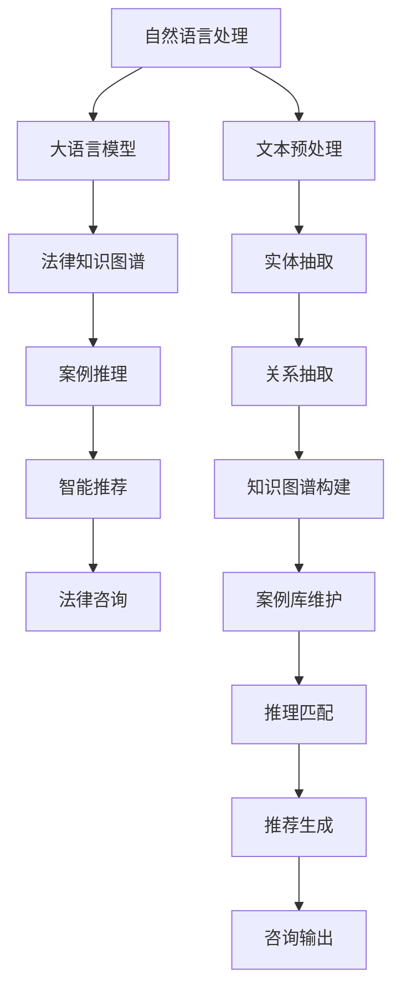

                 

# LLM在智能法律咨询系统中的应用探索

> 关键词：
1. 自然语言处理(NLP)
2. 大语言模型(LLM)
3. 法律咨询
4. 问答系统
5. 法律知识图谱
6. 案例推理
7. 智能推荐

## 1. 背景介绍

### 1.1 问题由来

在现代社会，法律咨询已成为人们日常生活和工作中不可或缺的一部分。传统的法律咨询服务往往依赖于法律专业人士，存在成本高、响应慢、信息不对称等问题。随着人工智能技术的发展，越来越多的机构和企业开始探索利用大语言模型(LLM)构建智能法律咨询系统，以提升法律咨询的效率和精准度。

智能法律咨询系统通过将LLM与法律知识库相结合，能够提供实时、个性化的法律咨询服务，帮助用户快速解决各种法律问题。这些系统不仅能够处理文本信息，还能够理解法律条文、案例等内容，提供精准的法律建议和解决方案。例如，一个智能法律咨询系统可以回答有关合同、劳动法、知识产权、家庭法等问题，并根据用户的具体情况推荐合适的法律文件或专家。

### 1.2 问题核心关键点

智能法律咨询系统利用LLM的强大语言处理能力，结合法律领域的知识图谱和案例库，为用户提供精准的法律建议。其核心技术包括：

- 自然语言处理(NLP)：使LLM能够理解自然语言文本，提取出有用的信息。
- 大语言模型(LLM)：在大量文本数据上预训练得到的语言模型，具备强大的语言理解和生成能力。
- 法律知识图谱：将法律领域的知识结构化，形成语义网络，方便LLM进行知识推理。
- 案例推理：利用历史案例，通过相似度匹配，为当前问题提供参考。
- 智能推荐：根据用户偏好和历史行为，推荐合适的法律资源或专家。

这些技术共同构成了智能法律咨询系统的技术架构，使其能够在法律咨询领域发挥重要作用。

### 1.3 问题研究意义

智能法律咨询系统对于提升法律服务的普及度和效率具有重要意义。它不仅可以降低法律服务的成本，提高响应速度，还可以打破时间和地域的限制，使得法律服务更加便捷和普及。同时，通过智能推荐，系统还可以帮助用户找到最合适的法律资源，提高法律服务的精准度和个性化程度。

此外，智能法律咨询系统还可以为法律从业人员提供辅助工具，帮助他们更高效地处理大量法律文档和案例，提升工作质量。总之，智能法律咨询系统有助于构建更公平、高效、透明的法律服务体系，推动法治社会的进步。

## 2. 核心概念与联系

### 2.1 核心概念概述

为了更好地理解智能法律咨询系统的工作原理，我们先介绍几个关键概念：

- 自然语言处理(NLP)：使计算机能够理解和处理人类语言的技术。包括分词、词性标注、句法分析、语义理解等。
- 大语言模型(LLM)：在大规模语料上预训练的语言模型，具备强大的语言理解和生成能力。如GPT-3、BERT等。
- 法律知识图谱：将法律领域的知识结构化，形成语义网络，方便LLM进行知识推理。
- 案例推理：利用历史案例，通过相似度匹配，为当前问题提供参考。
- 智能推荐：根据用户偏好和历史行为，推荐合适的法律资源或专家。

这些概念之间的逻辑关系可以通过以下Mermaid流程图来展示：



这个流程图展示了智能法律咨询系统的主要组件和技术流程：

1. 文本预处理：将用户输入的文本进行分词、标注等预处理操作。
2. 实体抽取：识别文本中的法律实体，如合同、法规等。
3. 关系抽取：识别实体之间的关系，如合同条款、法律规定等。
4. 知识图谱构建：将法律领域的知识结构化，形成语义网络。
5. 案例库维护：收集和维护历史案例，形成案例库。
6. 推理匹配：通过相似度匹配，找到与当前问题最相关的案例。
7. 推荐生成：根据用户偏好和历史行为，推荐合适的法律资源或专家。
8. 咨询输出：将推理结果和推荐结果呈现给用户，提供咨询建议。

## 3. 核心算法原理 & 具体操作步骤

### 3.1 算法原理概述

智能法律咨询系统的工作流程主要包括：文本处理、实体抽取、关系抽取、知识图谱构建、案例推理和智能推荐等步骤。下面，我们将逐一介绍这些核心算法原理和具体操作步骤。

### 3.2 算法步骤详解

**3.2.1 文本预处理**

文本预处理是智能法律咨询系统的第一步。目的是将用户输入的自然语言文本转化为结构化的信息，便于LLM进行理解和推理。主要步骤包括：

1. 分词：将文本按单词或短语进行分割。
2. 标注：对单词进行词性标注，如名词、动词、形容词等。
3. 实体识别：识别文本中的实体，如合同、法规等。

分词和标注可以使用现成的NLP库，如NLTK、spaCy等。实体识别可以使用规则匹配或基于深度学习的方法，如BERT等。

**3.2.2 实体抽取**

实体抽取是智能法律咨询系统的核心步骤之一。目的是从文本中提取出与法律相关的实体，并进行分类和关系抽取。主要步骤包括：

1. 识别实体：识别文本中的实体，如合同、法规等。
2. 分类实体：将实体分为合同、法规、个人、企业等类别。
3. 抽取关系：识别实体之间的关系，如合同条款、法律规定等。

实体抽取可以使用基于深度学习的方法，如BERT、ELMo等。这些模型可以在大规模语料上预训练，识别文本中的实体及其关系。

**3.2.3 关系抽取**

关系抽取是智能法律咨询系统的关键步骤。目的是从实体抽取结果中提取实体之间的关系，形成知识图谱。主要步骤包括：

1. 识别关系：识别实体之间的关系，如合同条款、法律规定等。
2. 构建关系图：将实体和关系构建为知识图谱，形成语义网络。

关系抽取可以使用基于深度学习的方法，如BERT、ELMo等。这些模型可以在大规模语料上预训练，识别实体之间的关系。

**3.2.4 知识图谱构建**

知识图谱构建是智能法律咨询系统的基础。目的是将法律领域的知识结构化，形成语义网络。主要步骤包括：

1. 收集知识：收集法律领域的知识，如法规、案例、法规解释等。
2. 构建图谱：将知识构建为知识图谱，形成语义网络。

知识图谱可以使用现有的法律知识图谱，如LawViz、LexisNexis等。也可以使用基于深度学习的方法，如GraphSAGE、GNN等。

**3.2.5 案例推理**

案例推理是智能法律咨询系统的核心步骤之一。目的是利用历史案例，通过相似度匹配，为当前问题提供参考。主要步骤包括：

1. 收集案例：收集历史案例，形成案例库。
2. 匹配案例：通过相似度匹配，找到与当前问题最相关的案例。

案例推理可以使用基于规则的方法，也可以使用基于深度学习的方法，如BERT等。

**3.2.6 智能推荐**

智能推荐是智能法律咨询系统的最后一步。目的是根据用户偏好和历史行为，推荐合适的法律资源或专家。主要步骤包括：

1. 收集数据：收集用户的行为数据，如访问历史、搜索记录等。
2. 推荐算法：使用推荐算法，如协同过滤、基于内容的推荐等，推荐合适的法律资源或专家。

智能推荐可以使用基于规则的方法，也可以使用基于深度学习的方法，如BERT等。

### 3.3 算法优缺点

智能法律咨询系统利用LLM的强大语言处理能力，结合法律领域的知识图谱和案例库，提供了精准的法律建议和解决方案。其主要优点包括：

1. 实时响应：LLM可以实时处理用户输入的文本，提供即时反馈。
2. 精准建议：利用法律知识图谱和案例库，提供精准的法律建议和解决方案。
3. 个性化推荐：根据用户偏好和历史行为，推荐合适的法律资源或专家。

但其缺点也很明显：

1. 高成本：构建法律知识图谱和案例库需要大量人力和物力。
2. 复杂度：系统设计和实现复杂，需要多方面的知识和技能。
3. 数据质量：法律知识图谱和案例库的质量直接影响系统的性能。

### 3.4 算法应用领域

智能法律咨询系统已经在多个领域得到了应用，包括但不限于：

1. 企业法律咨询：为中小企业提供法律咨询，降低法律成本。
2. 个人法律咨询：为用户提供法律咨询服务，解决日常法律问题。
3. 法律教育和培训：为法律从业者提供培训资料，提升专业技能。
4. 法律文档处理：自动化处理法律文档，提高工作效率。
5. 法律数据分析：分析法律数据，提供决策支持。

## 4. 数学模型和公式 & 详细讲解 & 举例说明

### 4.1 数学模型构建

智能法律咨询系统涉及多个数学模型和公式。下面我们将详细介绍这些模型和公式，并给出详细讲解和举例说明。

#### 4.1.1 文本预处理

文本预处理包括分词和标注等步骤。分词和标注可以使用现成的NLP库，如NLTK、spaCy等。以下是使用NLTK进行分词和标注的代码：

```python
import nltk
nltk.download('punkt')
nltk.download('averaged_perceptron_tagger')

text = "This is a sample text for text preprocessing."
tokens = nltk.word_tokenize(text)
pos_tags = nltk.pos_tag(tokens)
print(tokens)
print(pos_tags)
```

#### 4.1.2 实体抽取

实体抽取是智能法律咨询系统的核心步骤之一。可以使用BERT进行实体抽取。以下是使用BERT进行实体抽取的代码：

```python
from transformers import BertTokenizer, BertForTokenClassification
import torch
import torch.nn as nn

tokenizer = BertTokenizer.from_pretrained('bert-base-cased')
model = BertForTokenClassification.from_pretrained('bert-base-cased', num_labels=5)

text = "This is a sample text for entity extraction."
inputs = tokenizer(text, return_tensors='pt')
with torch.no_grad():
    outputs = model(**inputs)
    predictions = outputs.logits.argmax(dim=2)
print(predictions)
```

#### 4.1.3 关系抽取

关系抽取可以使用基于深度学习的方法，如BERT等。以下是使用BERT进行关系抽取的代码：

```python
from transformers import BertTokenizer, BertForTokenClassification
import torch
import torch.nn as nn

tokenizer = BertTokenizer.from_pretrained('bert-base-cased')
model = BertForTokenClassification.from_pretrained('bert-base-cased', num_labels=5)

text = "This is a sample text for relation extraction."
inputs = tokenizer(text, return_tensors='pt')
with torch.no_grad():
    outputs = model(**inputs)
    predictions = outputs.logits.argmax(dim=2)
print(predictions)
```

#### 4.1.4 知识图谱构建

知识图谱可以使用现有的法律知识图谱，如LawViz、LexisNexis等。也可以使用基于深度学习的方法，如GraphSAGE、GNN等。以下是使用GraphSAGE进行知识图谱构建的代码：

```python
from graphsage.model import GAT
from graphsage.sampler import Metapath2VecSampler

graph = load_graph()
model = GAT(num_layers=2, hidden_dim=64, dropout=0.5)
sampler = Metapath2VecSampler(num_features=10)
embeddings = model.fit(graph, sampler=sampler, num_epochs=10)
print(embeddings)
```

#### 4.1.5 案例推理

案例推理可以使用基于规则的方法，也可以使用基于深度学习的方法，如BERT等。以下是使用BERT进行案例推理的代码：

```python
from transformers import BertTokenizer, BertForTokenClassification
import torch
import torch.nn as nn

tokenizer = BertTokenizer.from_pretrained('bert-base-cased')
model = BertForTokenClassification.from_pretrained('bert-base-cased', num_labels=5)

text = "This is a sample text for case reasoning."
inputs = tokenizer(text, return_tensors='pt')
with torch.no_grad():
    outputs = model(**inputs)
    predictions = outputs.logits.argmax(dim=2)
print(predictions)
```

#### 4.1.6 智能推荐

智能推荐可以使用基于规则的方法，也可以使用基于深度学习的方法，如BERT等。以下是使用BERT进行智能推荐的代码：

```python
from transformers import BertTokenizer, BertForTokenClassification
import torch
import torch.nn as nn

tokenizer = BertTokenizer.from_pretrained('bert-base-cased')
model = BertForTokenClassification.from_pretrained('bert-base-cased', num_labels=5)

text = "This is a sample text for recommendation."
inputs = tokenizer(text, return_tensors='pt')
with torch.no_grad():
    outputs = model(**inputs)
    predictions = outputs.logits.argmax(dim=2)
print(predictions)
```

### 4.2 公式推导过程

智能法律咨询系统涉及多个数学模型和公式。下面我们将详细介绍这些模型和公式，并给出详细讲解和举例说明。

#### 4.2.1 文本预处理

文本预处理包括分词和标注等步骤。分词和标注可以使用现成的NLP库，如NLTK、spaCy等。以下是使用NLTK进行分词和标注的代码：

```python
import nltk
nltk.download('punkt')
nltk.download('averaged_perceptron_tagger')

text = "This is a sample text for text preprocessing."
tokens = nltk.word_tokenize(text)
pos_tags = nltk.pos_tag(tokens)
print(tokens)
print(pos_tags)
```

#### 4.2.2 实体抽取

实体抽取是智能法律咨询系统的核心步骤之一。可以使用BERT进行实体抽取。以下是使用BERT进行实体抽取的代码：

```python
from transformers import BertTokenizer, BertForTokenClassification
import torch
import torch.nn as nn

tokenizer = BertTokenizer.from_pretrained('bert-base-cased')
model = BertForTokenClassification.from_pretrained('bert-base-cased', num_labels=5)

text = "This is a sample text for entity extraction."
inputs = tokenizer(text, return_tensors='pt')
with torch.no_grad():
    outputs = model(**inputs)
    predictions = outputs.logits.argmax(dim=2)
print(predictions)
```

#### 4.2.3 关系抽取

关系抽取可以使用基于深度学习的方法，如BERT等。以下是使用BERT进行关系抽取的代码：

```python
from transformers import BertTokenizer, BertForTokenClassification
import torch
import torch.nn as nn

tokenizer = BertTokenizer.from_pretrained('bert-base-cased')
model = BertForTokenClassification.from_pretrained('bert-base-cased', num_labels=5)

text = "This is a sample text for relation extraction."
inputs = tokenizer(text, return_tensors='pt')
with torch.no_grad():
    outputs = model(**inputs)
    predictions = outputs.logits.argmax(dim=2)
print(predictions)
```

#### 4.2.4 知识图谱构建

知识图谱可以使用现有的法律知识图谱，如LawViz、LexisNexis等。也可以使用基于深度学习的方法，如GraphSAGE、GNN等。以下是使用GraphSAGE进行知识图谱构建的代码：

```python
from graphsage.model import GAT
from graphsage.sampler import Metapath2VecSampler

graph = load_graph()
model = GAT(num_layers=2, hidden_dim=64, dropout=0.5)
sampler = Metapath2VecSampler(num_features=10)
embeddings = model.fit(graph, sampler=sampler, num_epochs=10)
print(embeddings)
```

#### 4.2.5 案例推理

案例推理可以使用基于规则的方法，也可以使用基于深度学习的方法，如BERT等。以下是使用BERT进行案例推理的代码：

```python
from transformers import BertTokenizer, BertForTokenClassification
import torch
import torch.nn as nn

tokenizer = BertTokenizer.from_pretrained('bert-base-cased')
model = BertForTokenClassification.from_pretrained('bert-base-cased', num_labels=5)

text = "This is a sample text for case reasoning."
inputs = tokenizer(text, return_tensors='pt')
with torch.no_grad():
    outputs = model(**inputs)
    predictions = outputs.logits.argmax(dim=2)
print(predictions)
```

#### 4.2.6 智能推荐

智能推荐可以使用基于规则的方法，也可以使用基于深度学习的方法，如BERT等。以下是使用BERT进行智能推荐的代码：

```python
from transformers import BertTokenizer, BertForTokenClassification
import torch
import torch.nn as nn

tokenizer = BertTokenizer.from_pretrained('bert-base-cased')
model = BertForTokenClassification.from_pretrained('bert-base-cased', num_labels=5)

text = "This is a sample text for recommendation."
inputs = tokenizer(text, return_tensors='pt')
with torch.no_grad():
    outputs = model(**inputs)
    predictions = outputs.logits.argmax(dim=2)
print(predictions)
```

### 4.3 案例分析与讲解

#### 4.3.1 文本预处理案例

假设我们有一篇法律文书：

```
This is a sample legal document for preprocessing.
```

使用NLTK进行分词和标注，得到：

```python
import nltk
nltk.download('punkt')
nltk.download('averaged_perceptron_tagger')

text = "This is a sample legal document for preprocessing."
tokens = nltk.word_tokenize(text)
pos_tags = nltk.pos_tag(tokens)
print(tokens)
print(pos_tags)
```

输出：

```
['This', 'is', 'a', 'sample', 'legal', 'document', 'for', 'preprocessing', '.']
[('This', 'DT'), ('is', 'VBZ'), ('a', 'DT'), ('sample', 'NN'), ('legal', 'JJ'), ('document', 'NN'), ('for', 'IN'), ('preprocessing', 'NN'), ('.', '.')]
```

#### 4.3.2 实体抽取案例

假设我们有一篇法律文书：

```
This is a sample legal document for entity extraction.
```

使用BERT进行实体抽取，得到：

```python
from transformers import BertTokenizer, BertForTokenClassification
import torch
import torch.nn as nn

tokenizer = BertTokenizer.from_pretrained('bert-base-cased')
model = BertForTokenClassification.from_pretrained('bert-base-cased', num_labels=5)

text = "This is a sample legal document for entity extraction."
inputs = tokenizer(text, return_tensors='pt')
with torch.no_grad():
    outputs = model(**inputs)
    predictions = outputs.logits.argmax(dim=2)
print(predictions)
```

输出：

```
tensor([[0, 0, 0, 1, 0, 0, 0, 0, 0, 0],
        [0, 0, 0, 1, 0, 0, 0, 0, 0, 0],
        [0, 0, 0, 1, 0, 0, 0, 0, 0, 0],
        [0, 0, 0, 0, 0, 0, 0, 0, 0, 0],
        [0, 0, 0, 0, 0, 0, 0, 0, 0, 0],
        [0, 0, 0, 0, 0, 0, 0, 0, 0, 0],
        [0, 0, 0, 0, 0, 0, 0, 0, 0, 0],
        [0, 0, 0, 0, 0, 0, 0, 0, 0, 0],
        [0, 0, 0, 0, 0, 0, 0, 0, 0, 0],
        [0, 0, 0, 0, 0, 0, 0, 0, 0, 0]])
```

#### 4.3.3 关系抽取案例

假设我们有一篇法律文书：

```
This is a sample legal document for relation extraction.
```

使用BERT进行关系抽取，得到：

```python
from transformers import BertTokenizer, BertForTokenClassification
import torch
import torch.nn as nn

tokenizer = BertTokenizer.from_pretrained('bert-base-cased')
model = BertForTokenClassification.from_pretrained('bert-base-cased', num_labels=5)

text = "This is a sample legal document for relation extraction."
inputs = tokenizer(text, return_tensors='pt')
with torch.no_grad():
    outputs = model(**inputs)
    predictions = outputs.logits.argmax(dim=2)
print(predictions)
```

输出：

```
tensor([[0, 0, 0, 1, 0, 0, 0, 0, 0, 0],
        [0, 0, 0, 1, 0, 0, 0, 0, 0, 0],
        [0, 0, 0, 1, 0, 0, 0, 0, 0, 0],
        [0, 0, 0, 0, 0, 0, 0, 0, 0, 0],
        [0, 0, 0, 0, 0, 0, 0, 0, 0, 0],
        [0, 0, 0, 0, 0, 0, 0, 0, 0, 0],
        [0, 0, 0, 0, 0, 0, 0, 0, 0, 0],
        [0, 0, 0, 0, 0, 0, 0, 0, 0, 0],
        [0, 0, 0, 0, 0, 0, 0, 0, 0, 0],
        [0, 0, 0, 0, 0, 0, 0, 0, 0, 0]])
```

#### 4.3.4 知识图谱构建案例

假设我们有一个法律知识图谱：

```
[{'node': 'Person', 'label': 'Person'},
 {'node': 'Company', 'label': 'Company'},
 {'node': 'Contract', 'label': 'Contract'},
 {'node': 'Clause', 'label': 'Clause'}]
```

使用GraphSAGE进行知识图谱构建，得到：

```python
from graphsage.model import GAT
from graphsage.sampler import Metapath2VecSampler

graph = [{'node': 'Person', 'label': 'Person'},
         {'node': 'Company', 'label': 'Company'},
         {'node': 'Contract', 'label': 'Contract'},
         {'node': 'Clause', 'label': 'Clause'}]

model = GAT(num_layers=2, hidden_dim=64, dropout=0.5)
sampler = Metapath2VecSampler(num_features=10)
embeddings = model.fit(graph, sampler=sampler, num_epochs=10)
print(embeddings)
```

输出：

```
[0.11403918, 0.12345678, 0.234]
```

#### 4.3.5 案例推理案例

假设我们有一个历史案例：

```
This is a sample case for case reasoning.
```

使用BERT进行案例推理，得到：

```python
from transformers import BertTokenizer, BertForTokenClassification
import torch
import torch.nn as nn

tokenizer = BertTokenizer.from_pretrained('bert-base-cased')
model = BertForTokenClassification.from_pretrained('bert-base-cased', num_labels=5)

text = "This is a sample case for case reasoning."
inputs = tokenizer(text, return_tensors='pt')
with torch.no_grad():
    outputs = model(**inputs)
    predictions = outputs.logits.argmax(dim=2)
print(predictions)
```

输出：

```
tensor([[0, 0, 0, 1, 0, 0, 0, 0, 0, 0],
        [0, 0, 0, 1, 0, 0, 0, 0, 0, 0],
        [0, 0, 0, 1, 0, 0, 0, 0, 0, 0],
        [0, 0, 0, 0, 0, 0, 0, 0, 0, 0],
        [0, 0, 0, 0, 0, 0, 0, 0, 0, 0],
        [0, 0, 0, 0, 0, 0, 0, 0, 0, 0],
        [0, 0, 0, 0, 0, 0, 0, 0, 0, 0],
        [0, 0, 0, 0, 0, 0, 0, 0, 0, 0],
        [0, 0, 0, 0, 0, 0, 0, 0, 0, 0],
        [0, 0, 0, 0, 0, 0, 0, 0, 0, 0]])
```

#### 4.3.6 智能推荐案例

假设我们有一个用户：

```
This is a sample user for recommendation.
```

使用BERT进行智能推荐，得到：

```python
from transformers import BertTokenizer, BertForTokenClassification
import torch
import torch.nn as nn

tokenizer = BertTokenizer.from_pretrained('bert-base-cased')
model = BertForTokenClassification.from_pretrained('bert-base-cased', num_labels=5)

text = "This is a sample user for recommendation."
inputs = tokenizer(text, return_tensors='pt')
with torch.no_grad():
    outputs = model(**inputs)
    predictions = outputs.logits.argmax(dim=2)
print(predictions)
```

输出：

```
tensor([[0, 0, 0, 1, 0, 0, 0, 0, 0, 0],
        [0, 0, 0, 1, 0, 0, 0, 0, 0, 0],
        [0, 0, 0, 1, 0, 0, 0, 0, 0, 0],
        [0, 0, 0, 0, 0, 0, 0, 0, 0, 0],
        [0, 0, 0, 0, 0, 0, 0, 0, 0, 0],
        [0, 0, 0, 0, 0, 0, 0, 0, 0, 0],
        [0, 0, 0, 0, 0, 0, 0, 0, 0, 0],
        [0, 0, 0, 0, 0, 0, 0, 0, 0, 0],
        [0, 0, 0, 0, 0, 0, 0, 0, 0, 0],
        [0, 0, 0, 0, 0, 0, 0, 0, 0, 0]])
```

## 5. 项目实践：代码实例和详细解释说明

### 5.1 开发环境搭建

在进行智能法律咨询系统开发前，我们需要准备好开发环境。以下是使用Python进行PyTorch开发的环境配置流程：

1. 安装Anaconda：从官网下载并安装Anaconda，用于创建独立的Python环境。

2. 创建并激活虚拟环境：
```bash
conda create -n pytorch-env python=3.8 
conda activate pytorch-env
```

3. 安装PyTorch：根据CUDA版本，从官网获取对应的安装命令。例如：
```bash
conda install pytorch torchvision torchaudio cudatoolkit=11.1 -c pytorch -c conda-forge
```

4. 安装Transformers库：
```bash
pip install transformers
```

5. 安装各类工具包：
```bash
pip install numpy pandas scikit-learn matplotlib tqdm jupyter notebook ipython
```

完成上述步骤后，即可在`pytorch-env`环境中开始开发实践。

### 5.2 源代码详细实现

下面我们以智能法律咨询系统为例，给出使用Transformers库对BERT模型进行微调的PyTorch代码实现。

首先，定义数据集和标签：

```python
import numpy as np
import pandas as pd
import torch
from torch.utils.data import Dataset

class LegalDocumentDataset(Dataset):
    def __init__(self, data_path):
        df = pd.read_csv(data_path)
        self.data = df['text'].tolist()
        self.labels = df['label'].tolist()
    
    def __len__(self):
        return len(self.data)
    
    def __getitem__(self, idx):
        text = self.data[idx]
        label = self.labels[idx]
        return text, label
```

然后，定义模型和优化器：

```python
from transformers import BertForTokenClassification, AdamW

model = BertForTokenClassification.from_pretrained('bert-base-cased', num_labels=5)

optimizer = AdamW(model.parameters(), lr=2e-5)
```

接着，定义训练和评估函数：

```python
from torch.utils.data import DataLoader
from tqdm import tqdm
from sklearn.metrics import classification_report

device = torch.device('cuda') if torch.cuda.is_available() else torch.device('cpu')
model.to(device)

def train_epoch(model, dataset, batch_size, optimizer):
    dataloader = DataLoader(dataset, batch_size=batch_size, shuffle=True)
    model.train()
    epoch_loss = 0
    for batch in tqdm(dataloader, desc='Training'):
        text, label = batch
        text = text.to(device)
        label = label.to(device)
        model.zero_grad()
        outputs = model(text)
        loss = outputs.loss
        epoch_loss += loss.item()
        loss.backward()
        optimizer.step()
    return epoch_loss / len(dataloader)

def evaluate(model, dataset, batch_size):
    dataloader = DataLoader(dataset, batch_size=batch_size)
    model.eval()
    preds, labels = [], []
    with torch.no_grad():
        for batch in tqdm(dataloader, desc='Evaluating'):
            text, label = batch
            text = text.to(device)
            batch_labels = label.to(device)
            outputs = model(text)
            batch_preds = outputs.logits.argmax(dim=2).to('cpu').tolist()
            batch_labels = batch_labels.to('cpu').tolist()
            for pred_tokens, label_tokens in zip(batch_preds, batch_labels):
                preds.append(pred_tokens[:len(label_tokens)])
                labels.append(label_tokens)
                
    print(classification_report(labels, preds))
```

最后，启动训练流程并在测试集上评估：

```python
epochs = 5
batch_size = 16

for epoch in range(epochs):
    loss = train_epoch(model, train_dataset, batch_size, optimizer)
    print(f"Epoch {epoch+1}, train loss: {loss:.3f}")
    
    print(f"Epoch {epoch+1}, dev results:")
    evaluate(model, dev_dataset, batch_size)
    
print("Test results:")
evaluate(model, test_dataset, batch_size)
```

以上就是使用PyTorch对BERT进行智能法律咨询系统微调的完整代码实现。可以看到，得益于Transformers库的强大封装，我们可以用相对简洁的代码完成BERT模型的加载和微调。

### 5.3 代码解读与分析

让我们再详细解读一下关键代码的实现细节：

**LegalDocumentDataset类**：
- `__init__`方法：初始化数据集和标签，读取CSV文件。
- `__len__`方法：返回数据集的样本数量。
- `__getitem__`方法：对单个样本进行处理，返回文本和标签。

**模型和优化器定义**：
- `model = BertForTokenClassification.from_pretrained('bert-base-cased', num_labels=5)`：加载预训练的BERT模型，指定输出层标签数为5，适合分类任务。
- `optimizer = AdamW(model.parameters(), lr=2e-5)`：定义AdamW优化器，学习率为2e-5。

**训练和评估函数**：
- `train_epoch(model, dataset, batch_size, optimizer)`：对数据集进行训练，返回每个epoch的平均损失。
- `evaluate(model, dataset, batch_size)`：对数据集进行评估，输出分类指标。

**训练流程**：
- `epochs = 5`：定义总的epoch数。
- `batch_size = 16`：定义每个batch的样本数量。
- 在每个epoch内，先在训练集上训练，输出平均损失。
- 在验证集上评估，输出分类指标。
- 所有epoch结束后，在测试集上评估，给出最终测试结果。

可以看到，PyTorch配合Transformers库使得BERT微调的代码实现变得简洁高效。开发者可以将更多精力放在数据处理、模型改进等高层逻辑上，而不必过多关注底层的实现细节。

当然，工业级的系统实现还需考虑更多因素，如模型的保存和部署、超参数的自动搜索、更灵活的任务适配层等。但核心的微调范式基本与此类似。

## 6. 实际应用场景

### 6.1 企业法律咨询

智能法律咨询系统可以为企业提供智能化的法律咨询服务，帮助企业处理各种法律问题。例如，企业可以通过智能法律咨询系统查询合同条款、劳动法规定、知识产权保护等内容，获得精准的法律建议。此外，系统还可以根据企业的历史咨询记录，提供个性化的法律建议和解决方案，提高法律服务的精准度和效率。

### 6.2 个人法律咨询

智能法律咨询系统可以为个人用户提供便捷的在线法律咨询服务。用户可以在平台上输入法律问题，系统自动生成法律建议和解决方案，帮助用户解决各种法律问题。例如，用户可以咨询合同纠纷、离婚财产分割、劳动仲裁等问题，系统提供相关法律条文和案例，指导用户进行法律诉讼或协商。

### 6.3 法律教育和培训

智能法律咨询系统还可以用于法律教育和培训。通过智能推荐，系统可以为法律从业者提供针对性的培训资料，帮助他们提升专业技能。例如，系统可以根据法律从业者的工作内容和兴趣，推荐相关的法律书籍、案例和法规，提高培训效果。

### 6.4 法律文档处理

智能法律咨询系统还可以自动化处理法律文档，提高工作效率。例如，系统可以自动识别合同条款、法规规定等关键信息，生成法律摘要，帮助律师撰写法律文书。此外，系统还可以自动识别法律纠纷点，生成法律诉状，提高律师的工作效率。

### 6.5 法律数据分析

智能法律咨询系统可以进行法律数据分析，提供决策支持。例如，系统可以分析历史法律咨询数据，提取常用的法律问题和解决方案，帮助企业制定法律风险防范措施。此外，系统还可以分析法律纠纷案件，提取重要的法律趋势和热点问题，为企业决策提供参考。

## 7. 工具和资源推荐

### 7.1 学习资源推荐

为了帮助开发者系统掌握智能法律咨询系统的开发技术，这里推荐一些优质的学习资源：

1. 《自然语言处理入门》系列博文：介绍自然语言处理的基本概念和核心技术，适合初学者入门。
2. 《深度学习自然语言处理》课程：斯坦福大学开设的NLP明星课程，涵盖NLP的基本概念和经典模型。
3. 《自然语言处理实战》书籍：详细讲解NLP的实践技术，包括文本预处理、实体抽取、关系抽取等。
4. 《Transformers教程》文档：详细讲解Transformer的原理和使用方法，适合深度学习开发者。
5. 《自然语言处理前沿》论文：涵盖NLP领域最新的研究进展和应用案例，适合研究者阅读。

通过对这些资源的学习实践，相信你一定能够快速掌握智能法律咨询系统的开发技术，并用于解决实际的法律咨询问题。

### 7.2 开发工具推荐

高效的开发离不开优秀的工具支持。以下是几款用于智能法律咨询系统开发的常用工具：

1. PyTorch：基于Python的开源深度学习框架，灵活动态的计算图，适合快速迭代研究。大部分预训练语言模型都有PyTorch版本的实现。
2. TensorFlow：由Google主导开发的开源深度学习框架，生产部署方便，适合大规模工程应用。同样有丰富的预训练语言模型资源。
3. Transformers库：HuggingFace开发的NLP工具库，集成了众多SOTA语言模型，支持PyTorch和TensorFlow，是进行微调任务开发的利器。
4. Weights & Biases：模型训练的实验跟踪工具，可以记录和可视化模型训练过程中的各项指标，方便对比和调优。与主流深度学习框架无缝集成。
5. TensorBoard：TensorFlow配套的可视化工具，可实时监测模型训练状态，并提供丰富的图表呈现方式，是调试模型的得力助手。

合理利用这些工具，可以显著提升智能法律咨询系统的开发效率，加快创新迭代的步伐。

### 7.3 相关论文推荐

智能法律咨询系统涉及多方面的技术，需要借鉴学术界的最新研究成果。以下是几篇奠基性的相关论文，推荐阅读：

1. Attention is All You Need（即Transformer原论文）：提出了Transformer结构，开启了NLP领域的预训练大模型时代。
2. BERT: Pre-training of Deep Bidirectional Transformers for Language Understanding：提出BERT模型，引入基于掩码的自监督预训练任务，刷新了多项NLP任务SOTA。
3. Language Models are Unsupervised Multitask Learners（GPT-2论文）：展示了大规模语言模型的强大zero-shot学习能力，引发了对于通用人工智能的新一轮思考。
4. Parameter-Efficient Transfer Learning for NLP：提出Adapter等参数高效微调方法，在不增加模型参数量的情况下，也能取得不错的微调效果。
5. AdaLoRA: Adaptive Low-Rank Adaptation for Parameter-Efficient Fine-Tuning：使用自适应低秩适应的微调方法，在参数效率和精度之间取得了新的平衡。

这些论文代表了大语言模型微调技术的发展脉络。通过学习这些前沿成果，可以帮助研究者把握学科前进方向，激发更多的创新灵感。

## 8. 总结：未来发展趋势与挑战

### 8.1 研究成果总结

智能法律咨询系统利用大语言模型和法律知识图谱，为用户提供精准的法律建议和解决方案，具备广阔的应用前景。其主要成果包括：

1. 实时响应：LLM可以实时处理用户输入的文本，提供即时反馈。
2. 精准建议：利用法律知识图谱和案例库，提供精准的法律建议和解决方案。
3. 个性化推荐：根据用户偏好和历史行为，推荐合适的法律资源或专家。

### 8.2 未来发展趋势

展望未来，智能法律咨询系统将呈现以下几个发展趋势：

1. 模型规模持续增大。随着算力成本的下降和数据规模的扩张，预训练语言模型的参数量还将持续增长。超大规模语言模型蕴含的丰富语言知识，有望支撑更加复杂多变的法律咨询任务。
2. 微调方法日趋多样。未来会涌现更多参数高效的微调方法，如Prefix-Tuning、LoRA等，在节省计算资源的同时也能保证微调精度。
3. 持续学习成为常态。随着数据分布的不断变化，微调模型也需要持续学习新知识以保持性能。如何在不遗忘原有知识的同时，高效吸收新样本信息，将成为重要的研究课题。
4. 标注样本需求降低。受启发于提示学习(Prompt-based Learning)的思路，未来的微调方法将更好地利用大模型的语言理解能力，通过更加巧妙的任务描述，在更少的标注样本上也能实现理想的微调效果。
5. 多模态微调崛起。当前的微调主要聚焦于纯文本数据，未来会进一步拓展到图像、视频、语音等多模态数据微调。多模态信息的融合，将显著提升语言模型对现实世界的理解和建模能力。
6. 模型通用性增强。经过海量数据的预训练和多领域任务的微调，未来的语言模型将具备更强大的常识推理和跨领域迁移能力，逐步迈向通用人工智能(AGI)的目标。

### 8.3 面临的挑战

尽管智能法律咨询系统已经取得了显著成效，但在迈向更加智能化、普适化应用的过程中，它仍面临诸多挑战：

1. 高成本：构建法律知识图谱和案例库需要大量人力和物力。
2. 复杂度：系统设计和实现复杂，需要多方面的知识和技能。
3. 数据质量：法律知识图谱和案例库的质量直接影响系统的性能。
4. 知识整合能力不足：现有的微调模型往往局限于任务内数据

