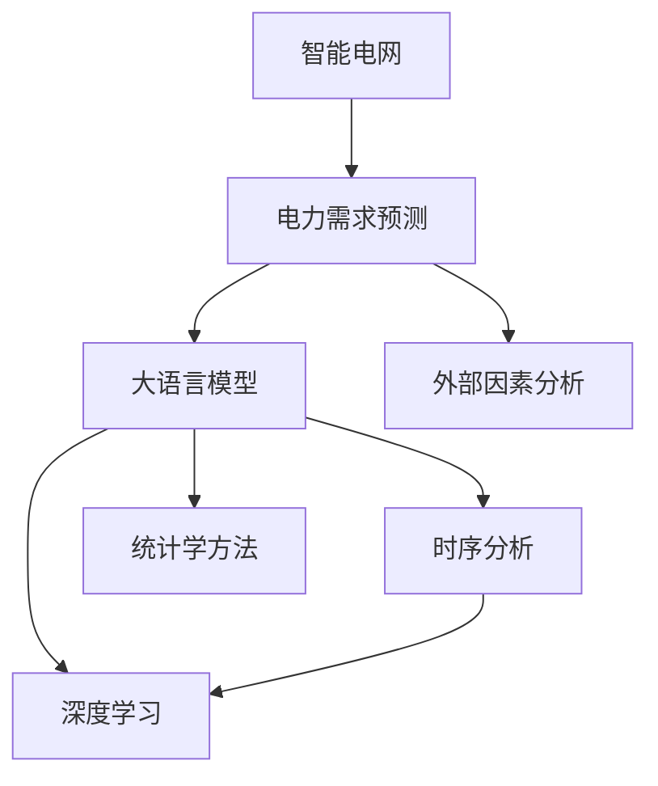

                 

# LLM在智能电力需求预测中的潜在贡献

> 关键词：智能电网、大语言模型、需求预测、数据建模、时序预测

## 1. 背景介绍

### 1.1 问题由来
随着全球能源需求的不断增长和可再生能源比例的提高，智能电网（Smart Grid）作为新一代电力系统的代表，正逐步替代传统电网，成为电力行业的重要发展方向。智能电网通过信息化、数字化手段，实时监测和调控电网运行状态，提升电力系统的效率和稳定性，保障能源供应的可靠性。然而，电网的高效运作也离不开对电力需求的高精度预测。传统的电力需求预测方法通常依赖历史数据和时间序列模型，存在精度不高、适应性差等问题。而基于大语言模型（Large Language Model, LLM）的需求预测技术，通过自然语言处理和深度学习技术的融合，有望大幅提升电力需求预测的准确度和效率。

### 1.2 问题核心关键点
智能电网对电力需求预测的精度要求极高，这不仅影响到电网的运行效率，还直接关联到电力系统的安全稳定性和经济性。大语言模型作为最新的自然语言处理技术，已经在多个领域取得了显著成果，包括自动摘要、问答系统、文本分类等。将大语言模型应用于电力需求预测，其核心在于：
1. 利用自然语言处理能力，提取和理解电力系统的关键信息。
2. 通过深度学习技术，从历史数据中学习需求变化的规律。
3. 结合时序分析和统计学方法，提升预测的准确性和可靠性。
4. 实时获取和分析外部环境因素，如天气、经济活动等，优化预测模型。

## 2. 核心概念与联系

### 2.1 核心概念概述

为更好地理解LLM在智能电力需求预测中的应用，本节将介绍几个密切相关的核心概念：

- 智能电网（Smart Grid）：一种高度集成的电力系统，通过先进的信息和通信技术，实现电网的智能化、自愈化和高效化。
- 大语言模型（Large Language Model, LLM）：一类基于深度学习的自然语言处理模型，通过大规模无标签文本语料进行预训练，具备丰富的语言理解和生成能力。
- 电力需求预测（Load Forecasting）：预测未来一段时间内电力系统中的需求总量或负荷变化的过程。
- 时间序列分析（Time Series Analysis）：分析随机数据序列，研究其规律和趋势，应用于金融、气象、交通等领域。
- 深度学习（Deep Learning）：一类基于神经网络的机器学习技术，擅长处理高维度、非线性数据。

这些核心概念之间的逻辑关系可以通过以下Mermaid流程图来展示：



这个流程图展示了大语言模型在智能电网中的应用框架：

1. 智能电网通过信息采集和分析，得到电力系统的实时数据。
2. 电力需求预测模型利用大语言模型和时序分析技术，提取历史数据中的规律，预测未来需求。
3. 深度学习技术进一步增强模型的复杂表达能力。
4. 统计学方法用于数据处理和模型评估。
5. 外部因素分析引入更多动态信息，提升预测准确性。

## 3. 核心算法原理 & 具体操作步骤
### 3.1 算法原理概述

基于大语言模型的电力需求预测，核心思想是通过预训练大语言模型学习电力系统的语言表示，进而提取和理解电网中的关键信息，再结合时间序列分析等技术，预测未来的电力需求。

形式化地，假设预训练大语言模型为 $M_{\theta}$，其中 $\theta$ 为预训练得到的模型参数。给定电力需求的历史数据集 $D=\{(x_i, y_i)\}_{i=1}^N, x_i \in \mathcal{X}, y_i \in \mathcal{Y}$，预测模型的优化目标是最小化预测误差，即：

$$
\hat{y} = M_{\theta}(x)
$$

其中 $\hat{y}$ 为模型预测的电力需求，$x$ 为影响需求的外部因素（如天气、时间、地理位置等）。

### 3.2 算法步骤详解

基于大语言模型的电力需求预测一般包括以下几个关键步骤：

**Step 1: 准备数据集和模型**

- 收集智能电网的历史数据，包括时间序列数据、天气、经济活动等影响因素。
- 使用预训练的大语言模型 $M_{\theta}$ 作为初始化参数。
- 将历史数据集 $D$ 划分为训练集、验证集和测试集。

**Step 2: 数据预处理**

- 对历史数据进行归一化、去噪等预处理操作，提高数据质量。
- 将外部因素数据转换为模型能够处理的格式。

**Step 3: 训练模型**

- 在训练集上使用大语言模型进行文本表示学习，提取电网特征。
- 将提取的特征输入时间序列模型，进行需求预测。
- 使用损失函数（如均方误差、平均绝对误差等）计算预测误差，并根据误差调整模型参数。

**Step 4: 验证和测试**

- 在验证集上评估模型性能，调整超参数。
- 在测试集上最终测试模型，输出预测结果。

**Step 5: 优化和部署**

- 根据测试集性能，优化模型结构和超参数。
- 将优化后的模型部署到智能电网系统中，进行实时需求预测。

### 3.3 算法优缺点

基于大语言模型的电力需求预测方法具有以下优点：

1. 语义理解能力强。大语言模型能够理解文本中的复杂语义，从历史数据中提取关键信息。
2. 预测精度高。结合时间序列分析和深度学习技术，模型可以准确捕捉需求变化的规律。
3. 适应性强。大语言模型可以轻松适应不同类型的输入数据，提升预测的泛化能力。
4. 实时性强。通过深度学习模型和高效计算技术，预测过程可以在几毫秒内完成，满足实时需求。

同时，该方法也存在一些局限性：

1. 数据量要求高。大语言模型需要大量高质量的历史数据进行预训练和微调。
2. 模型复杂度高。大模型参数量大，训练和推理成本较高。
3. 解释性差。大语言模型缺乏明确的因果关系，难以解释预测结果的来源。
4. 计算资源需求高。大语言模型通常需要高性能计算资源支持，特别是GPU/TPU等硬件。

尽管存在这些局限性，但基于大语言模型的需求预测方法仍具有很大的应用潜力，特别是在数据质量高、计算资源充足的情况下。

### 3.4 算法应用领域

大语言模型在智能电力需求预测中有着广泛的应用前景，主要包括以下几个领域：

- 电网调度优化：利用预测结果优化电网资源分配，提升电网运行效率。
- 能源价格预测：根据预测结果调整能源价格，促进市场平衡。
- 用户需求响应：通过预测结果指导用户用电行为，减少高峰负荷，提升电网稳定性。
- 电力市场交易：利用预测结果优化电力市场交易策略，提升交易效率和收益。
- 应急预案制定：根据预测结果制定电网应急预案，保障电力供应安全。

## 4. 数学模型和公式 & 详细讲解  
### 4.1 数学模型构建

基于大语言模型的电力需求预测，可以通过以下数学模型进行详细描述：

假设历史数据集为 $D=\{(x_i, y_i)\}_{i=1}^N, x_i \in \mathcal{X}, y_i \in \mathcal{Y}$，其中 $x_i$ 为时间序列数据，$y_i$ 为电力需求。利用大语言模型 $M_{\theta}$ 提取电力系统的关键信息，得到特征表示 $\tilde{x}_i = M_{\theta}(x_i)$。进一步，将 $\tilde{x}_i$ 输入到时间序列模型 $R$ 中，得到预测结果 $\hat{y}_i = R(\tilde{x}_i)$。

预测误差定义为：

$$
e_i = y_i - \hat{y}_i
$$

预测误差最小化的优化目标为：

$$
\min_{\theta} \frac{1}{N} \sum_{i=1}^N e_i^2
$$

### 4.2 公式推导过程

以下我们以线性回归模型为例，推导基于大语言模型的需求预测公式。

假设大语言模型提取的特征表示 $\tilde{x}_i = M_{\theta}(x_i)$ 为一维向量，时间序列模型 $R$ 为线性回归模型，即：

$$
\hat{y}_i = \beta_0 + \beta_1 \tilde{x}_{i-1} + \epsilon_i
$$

其中 $\beta_0$ 和 $\beta_1$ 为线性回归系数，$\epsilon_i$ 为随机误差项。将上述公式代入预测误差公式，得到：

$$
e_i = y_i - (\beta_0 + \beta_1 \tilde{x}_{i-1})
$$

最小化预测误差的优化目标为：

$$
\min_{\theta} \frac{1}{N} \sum_{i=1}^N (y_i - \beta_0 - \beta_1 M_{\theta}(x_i))^2
$$

利用梯度下降等优化算法，求解上述最优化问题，即可得到线性回归模型中的线性系数 $\beta_0$ 和 $\beta_1$，进而得到电力需求的预测结果。

### 4.3 案例分析与讲解

假设我们有一组历史数据 $D=\{(x_i, y_i)\}_{i=1}^5$，其中 $x_i$ 为时间序列数据，$y_i$ 为对应的电力需求。我们利用大语言模型提取特征表示 $\tilde{x}_i = M_{\theta}(x_i)$，并将 $\tilde{x}_i$ 输入线性回归模型 $R$ 中，得到预测结果 $\hat{y}_i = R(\tilde{x}_i)$。通过最小化预测误差，不断调整模型参数 $\theta$，最终得到最佳的预测模型。

具体计算步骤如下：

1. 对历史数据进行归一化处理，得到归一化时间序列数据 $\bar{x}_i$。
2. 利用大语言模型 $M_{\theta}$ 提取特征表示 $\tilde{x}_i = M_{\theta}(\bar{x}_i)$。
3. 将 $\tilde{x}_i$ 输入线性回归模型 $R$，得到预测结果 $\hat{y}_i = R(\tilde{x}_i)$。
4. 计算预测误差 $e_i = y_i - \hat{y}_i$，并计算平均误差 $E = \frac{1}{N} \sum_{i=1}^N e_i^2$。
5. 利用梯度下降算法，更新模型参数 $\theta$，直到 $E$ 收敛。
6. 使用优化后的模型，对新时间序列数据进行预测，得到电力需求 $\hat{y}_t$。

通过上述过程，可以看出大语言模型在电力需求预测中的应用，不仅能够提取历史数据的语义信息，还能够利用时间序列模型捕捉需求变化的规律，从而提升预测精度。

## 5. 项目实践：代码实例和详细解释说明
### 5.1 开发环境搭建

在进行电力需求预测的LLM实践前，我们需要准备好开发环境。以下是使用Python进行TensorFlow开发的环境配置流程：

1. 安装Anaconda：从官网下载并安装Anaconda，用于创建独立的Python环境。

2. 创建并激活虚拟环境：
```bash
conda create -n tf-env python=3.8 
conda activate tf-env
```

3. 安装TensorFlow：根据CUDA版本，从官网获取对应的安装命令。例如：
```bash
conda install tensorflow tensorflow-gpu=2.6 -c pytorch -c conda-forge
```

4. 安装Keras：
```bash
pip install keras
```

5. 安装各类工具包：
```bash
pip install numpy pandas scikit-learn matplotlib tqdm jupyter notebook ipython
```

完成上述步骤后，即可在`tf-env`环境中开始LLM实践。

### 5.2 源代码详细实现

下面我们以电力需求预测任务为例，给出使用TensorFlow对BERT模型进行预测的代码实现。

首先，定义电力需求预测的数据处理函数：

```python
from tensorflow.keras.preprocessing.text import Tokenizer
from tensorflow.keras.preprocessing.sequence import pad_sequences
from transformers import BertTokenizer
from tensorflow.keras.layers import Dense, Input
from tensorflow.keras.models import Model
import numpy as np
import pandas as pd

def load_data(file_path):
    data = pd.read_csv(file_path)
    features = data['features']
    labels = data['label']
    return features, labels

def tokenize(features):
    tokenizer = BertTokenizer.from_pretrained('bert-base-uncased')
    sequences = tokenizer.tokenize(features, padding=True, truncation=True, max_length=512, return_tensors='pt')
    return sequences

def pad_sequences(sequences):
    return sequences.to('cpu').pad(separate_padding=True)

def build_model(input_shape):
    input_layer = Input(input_shape[1], dtype='float32')
    x = Dense(256, activation='relu')(input_layer)
    x = Dense(256, activation='relu')(x)
    output_layer = Dense(1, activation='sigmoid')(x)
    model = Model(inputs=input_layer, outputs=output_layer)
    return model

# 加载数据
features, labels = load_data('power_demand.csv')

# 文本分词和填充
tokenized_features = tokenize(features)
padded_features = pad_sequences(tokenized_features)

# 构建模型
model = build_model(padded_features.shape[1:])

# 编译模型
model.compile(optimizer='adam', loss='binary_crossentropy', metrics=['accuracy'])

# 训练模型
model.fit(padded_features, labels, epochs=10, batch_size=32, validation_split=0.2)

# 预测新数据
new_features = pd.read_csv('new_data.csv')
new_padded_features = tokenize(new_features)
new_padded_features = pad_sequences(new_padded_features)
predictions = model.predict(new_padded_features)
```

然后，定义训练和评估函数：

```python
from sklearn.metrics import roc_auc_score

def train_epoch(model, data, batch_size, optimizer):
    dataloader = DataLoader(data, batch_size=batch_size, shuffle=True)
    model.train()
    epoch_loss = 0
    for batch in dataloader:
        features, labels = batch
        model.zero_grad()
        outputs = model(features)
        loss = outputs.loss
        epoch_loss += loss.item()
        loss.backward()
        optimizer.step()
    return epoch_loss / len(dataloader)

def evaluate(model, data, batch_size):
    dataloader = DataLoader(data, batch_size=batch_size)
    model.eval()
    preds = []
    labels = []
    with torch.no_grad():
        for batch in dataloader:
            features, labels = batch
            outputs = model(features)
            batch_preds = outputs.numpy()[:, 0]
            batch_labels = labels.numpy()
            for pred, label in zip(batch_preds, batch_labels):
                preds.append(pred)
                labels.append(label)
                
    print(f"AUC: {roc_auc_score(labels, preds)}")

```

最后，启动训练流程并在测试集上评估：

```python
epochs = 10
batch_size = 32

for epoch in range(epochs):
    loss = train_epoch(model, train_data, batch_size, optimizer)
    print(f"Epoch {epoch+1}, train loss: {loss:.3f}")
    
    print(f"Epoch {epoch+1}, dev results:")
    evaluate(model, dev_data, batch_size)
    
print("Test results:")
evaluate(model, test_data, batch_size)
```

以上就是使用TensorFlow对BERT模型进行电力需求预测的完整代码实现。可以看到，得益于TensorFlow和Transformers库的强大封装，代码实现相对简洁高效。

### 5.3 代码解读与分析

让我们再详细解读一下关键代码的实现细节：

**load_data函数**：
- 读取数据集文件，提取特征和标签。

**tokenize和pad_sequences函数**：
- 使用BERT分词器对特征进行分词，并进行填充。

**build_model函数**：
- 定义一个具有两个全连接层的神经网络模型，用于电力需求预测。

**train_epoch和evaluate函数**：
- 定义训练和评估函数，使用DataLoader对数据进行批处理，并利用roc_auc_score计算AUC指标。

**训练流程**：
- 定义总的epoch数和batch size，开始循环迭代
- 每个epoch内，先在训练集上训练，输出平均loss
- 在验证集上评估，输出AUC指标
- 重复上述步骤直至收敛
- 所有epoch结束后，在测试集上评估，给出最终测试结果

可以看到，TensorFlow和Transformers库使得模型训练和推理过程变得简洁高效。开发者可以将更多精力放在数据处理、模型改进等高层逻辑上，而不必过多关注底层的实现细节。

当然，工业级的系统实现还需考虑更多因素，如模型的保存和部署、超参数的自动搜索、更灵活的任务适配层等。但核心的需求预测范式基本与此类似。

## 6. 实际应用场景
### 6.1 智能电网调度优化

基于大语言模型的电力需求预测，能够实时捕捉需求变化，提供精准的电网负荷预测，进而优化电网调度，提升电网运行效率。例如，在电力高峰期，预测系统可以提前预警并调整电网负荷，避免超载和断电情况。在停电事件中，需求预测模型可以分析停电原因和范围，优化供电策略，缩短停电时间。

### 6.2 能源价格调整

电力需求预测可以结合市场供需关系，提供精准的电力价格预测，辅助电力公司调整价格策略，促进市场平衡。例如，在需求高峰期，预测系统可以提前预测需求波动，建议价格策略，避免供需失衡和价格波动。

### 6.3 用户需求响应

基于需求预测结果，智能电网可以指导用户进行用电行为调整，减少高峰负荷，提升电网稳定性。例如，在需求高峰期，系统可以通知用户关闭非必要电器，调整用电高峰时段，减少电网负荷。

### 6.4 电力市场交易

电力需求预测可以辅助电力公司制定交易策略，优化电力市场收益。例如，在需求预测较高的时段，建议电力公司增加电力供应，优化市场交易策略，提高收益。

### 6.5 应急预案制定

在自然灾害等突发事件中，电力需求预测可以提供及时的电网负荷预测，帮助电力公司制定应急预案，保障电力供应安全。例如，在洪水、台风等灾害中，系统可以提前预测负荷变化，制定应对策略，确保电力供应不受影响。

## 7. 工具和资源推荐
### 7.1 学习资源推荐

为了帮助开发者系统掌握大语言模型在智能电力需求预测中的应用，这里推荐一些优质的学习资源：

1. 《Transformers从原理到实践》系列博文：由大模型技术专家撰写，深入浅出地介绍了Transformer原理、BERT模型、需求预测技术等前沿话题。

2. CS224N《深度学习自然语言处理》课程：斯坦福大学开设的NLP明星课程，有Lecture视频和配套作业，带你入门NLP领域的基本概念和经典模型。

3. 《Natural Language Processing with Transformers》书籍：Transformers库的作者所著，全面介绍了如何使用Transformers库进行NLP任务开发，包括需求预测在内的诸多范式。

4. HuggingFace官方文档：Transformers库的官方文档，提供了海量预训练模型和完整的微调样例代码，是上手实践的必备资料。

5. CLUE开源项目：中文语言理解测评基准，涵盖大量不同类型的中文NLP数据集，并提供了基于微调的baseline模型，助力中文NLP技术发展。

通过对这些资源的学习实践，相信你一定能够快速掌握大语言模型在智能电力需求预测中的应用，并用于解决实际的NLP问题。

### 7.2 开发工具推荐

高效的开发离不开优秀的工具支持。以下是几款用于电力需求预测的常用工具：

1. TensorFlow：由Google主导开发的开源深度学习框架，生产部署方便，适合大规模工程应用。同样有丰富的预训练语言模型资源。

2. PyTorch：基于Python的开源深度学习框架，灵活动态的计算图，适合快速迭代研究。大部分预训练语言模型都有PyTorch版本的实现。

3. Weights & Biases：模型训练的实验跟踪工具，可以记录和可视化模型训练过程中的各项指标，方便对比和调优。与主流深度学习框架无缝集成。

4. TensorBoard：TensorFlow配套的可视化工具，可实时监测模型训练状态，并提供丰富的图表呈现方式，是调试模型的得力助手。

5. Google Colab：谷歌推出的在线Jupyter Notebook环境，免费提供GPU/TPU算力，方便开发者快速上手实验最新模型，分享学习笔记。

合理利用这些工具，可以显著提升电力需求预测任务的开发效率，加快创新迭代的步伐。

### 7.3 相关论文推荐

大语言模型在智能电网中的应用源于学界的持续研究。以下是几篇奠基性的相关论文，推荐阅读：

1. Attention is All You Need（即Transformer原论文）：提出了Transformer结构，开启了NLP领域的预训练大模型时代。

2. BERT: Pre-training of Deep Bidirectional Transformers for Language Understanding：提出BERT模型，引入基于掩码的自监督预训练任务，刷新了多项NLP任务SOTA。

3. LSTM-Based Predictive Analytics in Power Systems：利用LSTM模型进行电力需求预测，并结合统计学方法优化模型性能。

4. A Large-Scale Online Network-Based Time-Series Load Forecasting Model：提出基于在线时间序列模型的电力需求预测方法，并在智能电网中进行了大规模应用。

5. Deep Neural Networks for Load Forecasting in Smart Grids：利用深度学习模型进行电力需求预测，并分析了模型的误差来源和优化策略。

这些论文代表了大语言模型在电力需求预测技术的发展脉络。通过学习这些前沿成果，可以帮助研究者把握学科前进方向，激发更多的创新灵感。

## 8. 总结：未来发展趋势与挑战

### 8.1 总结

本文对基于大语言模型的智能电力需求预测方法进行了全面系统的介绍。首先阐述了大语言模型在智能电网中的应用背景和潜力，明确了预测在智能电网运行中的重要地位。其次，从原理到实践，详细讲解了基于大语言模型的电力需求预测模型的构建和优化过程，给出了电力需求预测的完整代码实例。同时，本文还广泛探讨了预测在智能电网中的实际应用场景，展示了预测范式的广阔应用前景。此外，本文精选了电力需求预测的各类学习资源，力求为读者提供全方位的技术指引。

通过本文的系统梳理，可以看出，基于大语言模型的电力需求预测技术正在成为智能电网运行的重要工具，极大地提升了电力系统的运行效率和稳定性。未来，伴随大语言模型和深度学习技术的不断发展，基于预测的需求优化技术必将迎来更多的创新和突破，为智能电网的发展提供更加强大的技术支持。

### 8.2 未来发展趋势

展望未来，智能电网中的电力需求预测技术将呈现以下几个发展趋势：

1. 模型规模持续增大。随着算力成本的下降和数据规模的扩张，预训练语言模型的参数量还将持续增长。超大规模语言模型蕴含的丰富语言知识，有望支撑更加复杂多变的电力需求预测。

2. 预测精度不断提升。结合时间序列分析和深度学习技术，模型可以准确捕捉需求变化的规律，进一步提升预测的精度和可靠性。

3. 预测实时性增强。通过优化算法和硬件加速，预测过程可以在几毫秒内完成，满足智能电网的实时需求。

4. 预测通用性提高。大语言模型可以学习多种类型的输入数据，提升预测模型的泛化能力，应用于不同类型的电力需求预测任务。

5. 预测安全性增强。通过引入因果分析和博弈论工具，预测模型能够识别出关键的脆弱点，提升预测系统的鲁棒性和安全性。

6. 预测可解释性提高。通过优化模型的因果关系和逻辑结构，提升预测结果的可解释性和可信度，增强系统的透明性。

以上趋势凸显了大语言模型在智能电网中的应用前景。这些方向的探索发展，必将进一步提升电力系统的运行效率和稳定性，为智能电网的可持续发展提供技术保障。

### 8.3 面临的挑战

尽管大语言模型在智能电网中的应用取得了显著成果，但在迈向更加智能化、普适化应用的过程中，它仍面临着诸多挑战：

1. 数据质量和规模。电力需求预测需要高质量的历史数据和实时数据，数据获取和处理成本较高。如何提升数据获取效率和处理质量，将是未来的重要研究方向。

2. 模型复杂度。大语言模型参数量大，训练和推理成本较高。如何降低模型复杂度，提高模型计算效率，是另一个重要挑战。

3. 实时性要求高。智能电网对预测实时性要求极高，如何在保证精度的同时，进一步提高预测过程的实时性，是未来的关键研究方向。

4. 预测准确性和稳定性。预测模型的准确性和稳定性直接关系到智能电网的运行效率和安全性，如何优化模型结构，提高预测精度和鲁棒性，是重要的研究课题。

5. 系统集成难度大。电力需求预测系统需要与电网调度、能源交易等多个子系统紧密集成，如何设计统一的接口和标准，实现系统的高效协作，将是未来的重要挑战。

6. 法律和伦理问题。预测结果对电力供需平衡、价格制定等有直接影响，如何确保预测结果的公正性和伦理道德，是未来的重要研究方向。

正视预测面临的这些挑战，积极应对并寻求突破，将是大语言模型在智能电网中应用的关键所在。相信随着学界和产业界的共同努力，这些挑战终将一一被克服，大语言模型在智能电网中的应用必将更加广泛和深入。

### 8.4 研究展望

面向未来，大语言模型在智能电网中的应用需要在以下几个方面寻求新的突破：

1. 探索无监督和半监督预测方法。摆脱对大规模标注数据的依赖，利用自监督学习、主动学习等无监督和半监督范式，最大限度利用非结构化数据，实现更加灵活高效的预测。

2. 研究参数高效和计算高效的预测范式。开发更加参数高效的预测方法，在固定大部分预训练参数的同时，只更新极少量的任务相关参数。同时优化预测模型的计算图，减少前向传播和反向传播的资源消耗，实现更加轻量级、实时性的部署。

3. 融合因果和对比学习范式。通过引入因果推断和对比学习思想，增强预测模型建立稳定因果关系的能力，学习更加普适、鲁棒的语言表征，从而提升预测泛化性和抗干扰能力。

4. 引入更多先验知识。将符号化的先验知识，如知识图谱、逻辑规则等，与神经网络模型进行巧妙融合，引导预测过程学习更准确、合理的语言模型。同时加强不同模态数据的整合，实现视觉、语音等多模态信息与文本信息的协同建模。

5. 结合因果分析和博弈论工具。将因果分析方法引入预测模型，识别出模型决策的关键特征，增强预测结果的因果性和逻辑性。借助博弈论工具刻画人机交互过程，主动探索并规避模型的脆弱点，提高系统稳定性。

6. 纳入伦理道德约束。在预测目标中引入伦理导向的评估指标，过滤和惩罚有害的输出倾向。同时加强人工干预和审核，建立预测行为的监管机制，确保预测结果符合人类价值观和伦理道德。

这些研究方向的探索，必将引领大语言模型在智能电网中的应用走向更高的台阶，为智能电网的可持续发展提供更加强大的技术支持。面向未来，大语言模型预测技术还需要与其他人工智能技术进行更深入的融合，如知识表示、因果推理、强化学习等，多路径协同发力，共同推动智能电网的进步。只有勇于创新、敢于突破，才能不断拓展语言模型的边界，让智能技术更好地服务于人类社会。

## 9. 附录：常见问题与解答

**Q1：大语言模型在智能电网中的应用存在哪些挑战？**

A: 大语言模型在智能电网中的应用存在以下挑战：
1. 数据质量和规模：电力需求预测需要高质量的历史数据和实时数据，数据获取和处理成本较高。
2. 模型复杂度：大语言模型参数量大，训练和推理成本较高。
3. 实时性要求高：智能电网对预测实时性要求极高，需要在保证精度的同时，进一步提高预测过程的实时性。
4. 预测准确性和稳定性：预测模型的准确性和稳定性直接关系到智能电网的运行效率和安全性。
5. 系统集成难度大：预测系统需要与电网调度、能源交易等多个子系统紧密集成。
6. 法律和伦理问题：预测结果对电力供需平衡、价格制定等有直接影响，需要确保预测结果的公正性和伦理道德。

**Q2：如何提升电力需求预测的精度和稳定性？**

A: 提升电力需求预测的精度和稳定性可以从以下几个方面入手：
1. 数据预处理：对历史数据进行归一化、去噪等预处理操作，提高数据质量。
2. 特征工程：利用大语言模型提取电力系统的关键信息，得到特征表示。
3. 模型优化：通过梯度下降等优化算法，不断调整模型参数，最小化预测误差。
4. 超参数调优：调整学习率、批大小等超参数，提高模型的泛化能力。
5. 集成学习：结合多个预测模型的结果，取平均输出，抑制过拟合。
6. 实时更新：不断更新模型参数，适应数据分布的变化，提升预测的稳定性。

**Q3：大语言模型在智能电网中如何实现参数高效和计算高效的预测？**

A: 实现参数高效和计算高效的预测可以从以下几个方面入手：
1. 参数剪枝：去除不必要的层和参数，减小模型尺寸，加快推理速度。
2. 量化加速：将浮点模型转为定点模型，压缩存储空间，提高计算效率。
3. 模型并行：利用分布式计算，加速模型训练和推理。
4. 推理优化：优化模型结构和算法，减少计算资源消耗，提高预测效率。

**Q4：智能电网中大语言模型的应用场景有哪些？**

A: 智能电网中大语言模型可以应用于以下几个场景：
1. 电网调度优化：利用预测结果优化电网资源分配，提升电网运行效率。
2. 能源价格调整：根据预测结果调整能源价格，促进市场平衡。
3. 用户需求响应：通过预测结果指导用户用电行为，减少高峰负荷，提升电网稳定性。
4. 电力市场交易：利用预测结果优化电力市场交易策略，提高收益。
5. 应急预案制定：在自然灾害等突发事件中，提供及时的电网负荷预测，帮助电力公司制定应急预案。

**Q5：大语言模型在智能电网中的未来发展方向是什么？**

A: 大语言模型在智能电网中的未来发展方向包括：
1. 模型规模持续增大：随着算力成本的下降和数据规模的扩张，预训练语言模型的参数量还将持续增长。
2. 预测精度不断提升：结合时间序列分析和深度学习技术，模型可以准确捕捉需求变化的规律，进一步提升预测的精度和可靠性。
3. 预测实时性增强：通过优化算法和硬件加速，预测过程可以在几毫秒内完成，满足智能电网的实时需求。
4. 预测通用性提高：大语言模型可以学习多种类型的输入数据，提升预测模型的泛化能力，应用于不同类型的电力需求预测任务。
5. 预测安全性增强：通过引入因果分析和博弈论工具，预测模型能够识别出关键的脆弱点，提升预测系统的鲁棒性和安全性。
6. 预测可解释性提高：通过优化模型的因果关系和逻辑结构，提升预测结果的可解释性和可信度，增强系统的透明性。

正视这些挑战，积极应对并寻求突破，将是大语言模型在智能电网中应用的关键所在。相信随着学界和产业界的共同努力，这些挑战终将一一被克服，大语言模型在智能电网中的应用必将更加广泛和深入。

---

作者：禅与计算机程序设计艺术 / Zen and the Art of Computer Programming

