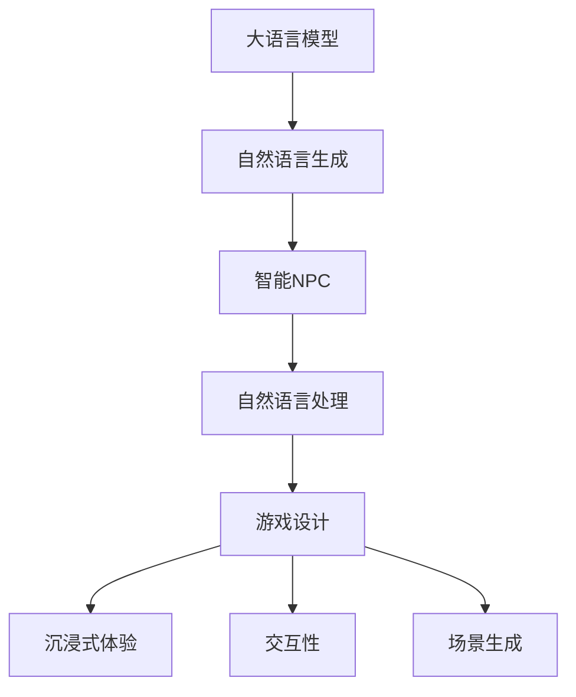

                 

# LLM在游戏开发中的应用：创造智能NPC

> 关键词：大语言模型,自然语言处理,自然语言生成,游戏开发,智能NPC,交互性,沉浸式体验

## 1. 背景介绍

### 1.1 问题由来
随着人工智能技术的飞速发展，自然语言处理(Natural Language Processing, NLP)在游戏开发中逐渐崭露头角。传统的游戏对话系统主要依靠脚本编写和手动配音，成本高昂且难以更新。而自然语言处理技术的引入，为游戏开发者提供了一种低成本、高灵活性的解决方案，能够动态生成自然流畅的对话，大幅提升游戏体验的沉浸感和交互性。

### 1.2 问题核心关键点
智能非玩家角色（Non-Player Characters, NPC）是现代游戏设计中的核心元素之一。如何让NPC更加真实、智能，能够自主生成语言并根据上下文进行对话，成为了游戏开发中的关键问题。基于大语言模型的自然语言生成技术，为实现这一目标提供了强有力的支持。

### 1.3 问题研究意义
通过将大语言模型应用于游戏开发中的智能NPC创建，可以实现以下显著效果：

- **降低开发成本**：无需人工编写大量对话脚本，减少开发时间和人力成本。
- **增强交互性**：智能NPC能够实时生成对话，提升玩家与游戏的交互体验。
- **适应性强**：NPC可以根据玩家的行为和上下文环境进行动态生成对话，适应不同的游戏情境和玩家需求。
- **扩展灵活**：一旦搭建好NPC的对话模型，可以轻松应用到各类游戏场景和角色上，提升游戏设计的灵活性和可重用性。

因此，掌握大语言模型在智能NPC创建中的技术实现和应用方法，对于游戏开发者来说，具有重要的研究价值和实践意义。

## 2. 核心概念与联系

### 2.1 核心概念概述

要深入理解大语言模型在游戏开发中的应用，首先需要了解一些核心概念：

- **大语言模型(Large Language Model, LLM)**：一种基于深度学习架构的自然语言处理模型，通过大量文本数据的自监督训练，学习到丰富的语言知识，能够进行自然语言理解和生成。常见的预训练模型包括GPT、BERT等。

- **自然语言生成(Natural Language Generation, NLG)**：将结构化或非结构化的数据转换为自然语言文本的过程。智能NPC中的对话生成正是利用了NLG技术。

- **自然语言处理(Natural Language Processing, NLP)**：涉及自然语言理解和生成的技术，是实现智能NPC对话的基础。

- **游戏设计(Game Design)**：游戏开发中的整体规划和设计工作，包括场景、角色、故事情节、交互逻辑等。智能NPC的创建是游戏设计的重要一环。

- **沉浸式体验(Immersive Experience)**：游戏设计中追求的让玩家感觉仿佛身临其境的体验效果。通过智能NPC的自主对话，可以大大提升游戏的沉浸感。

- **交互性(Interactivity)**：游戏设计中的一个关键维度，指玩家与游戏世界之间的互动程度。智能NPC能够提高游戏的互动性和趣味性。

- **场景生成(Scene Generation)**：游戏开发中对于游戏场景的构建和描述，智能NPC可以生成与场景相匹配的对话，提升游戏的丰富性和多样性。

这些概念之间的联系可以通过以下Mermaid流程图来展示：



该流程图展示了智能NPC在游戏开发中的应用框架：大语言模型通过自然语言生成技术，帮助智能NPC进行自主对话；自然语言处理技术提供理解和分析对话的支撑；游戏设计利用智能NPC来增强游戏的沉浸式体验和交互性；场景生成则利用智能NPC的对话，丰富游戏世界。

## 3. 核心算法原理 & 具体操作步骤
### 3.1 算法原理概述

大语言模型在游戏开发中的应用，主要通过以下算法原理实现：

1. **预训练模型加载**：使用预先训练好的大语言模型作为对话生成的初始模型，如GPT、BERT等。
2. **对话输入设计**：设计包含游戏情境、玩家行为等信息的对话输入，作为模型的输入。
3. **动态生成对话**：将对话输入作为模型的输入，生成自然流畅的对话文本。
4. **上下文理解**：利用自然语言处理技术，分析上下文信息，理解对话情境。
5. **情感计算**：通过情感分析技术，生成符合场景和情境的情感响应。
6. **多轮对话生成**：通过循环调用生成对话模型，实现多轮对话。
7. **自然语言生成**：将生成的对话文本转换为可交互的游戏文本。

### 3.2 算法步骤详解

基于大语言模型的智能NPC对话生成可以分为以下几个步骤：

**Step 1: 构建对话输入**
- 定义对话输入的结构，包含场景描述、玩家行为、游戏状态等信息。例如，对于一场战斗场景，输入可能包含战斗双方的位置、双方的装备、战斗的回合数等。

**Step 2: 加载预训练模型**
- 使用HuggingFace等工具库加载预训练的大语言模型，如GPT或BERT等。

**Step 3: 定义对话生成函数**
- 编写对话生成函数，将对话输入作为模型的输入，调用模型生成对话文本。例如，使用GPT模型时，可以使用其`generate()`方法进行对话生成。

**Step 4: 处理对话生成结果**
- 对生成的对话文本进行处理，包括分词、情感分析、上下文理解等。使用NLTK、spaCy等自然语言处理库进行预处理。

**Step 5: 输出游戏文本**
- 将处理后的对话文本转换为可交互的游戏文本，如角色名称、对话气泡、文本显示等。

**Step 6: 动态生成多轮对话**
- 使用循环调用对话生成函数，动态生成多轮对话。根据上下文和玩家行为，不断调整对话输入，实现更自然的交互。

### 3.3 算法优缺点

基于大语言模型的智能NPC对话生成具有以下优点：

- **高效灵活**：预训练模型和动态生成技术使得对话生成快速高效，可灵活应用于各类游戏场景。
- **自然流畅**：大语言模型能够生成自然流畅的对话，提升游戏的沉浸感和交互体验。
- **适应性强**：模型可适应不同的游戏情境和玩家行为，生成符合情境的对话。

同时，该方法也存在一些局限性：

- **资源需求高**：大语言模型需要大量的计算资源，对于资源有限的小型游戏开发者可能不适用。
- **复杂度高**：模型需要处理大量的上下文信息，复杂度高，调试困难。
- **通用性不足**：不同游戏的对话设计风格和需求差异较大，通用模型可能无法满足所有需求。

### 3.4 算法应用领域

基于大语言模型的智能NPC对话生成在游戏领域具有广泛的应用前景，包括但不限于：

- **角色对话系统**：为游戏中的角色生成自主对话，提升游戏角色丰富性和互动性。
- **任务引导系统**：通过NPC的引导，推动游戏任务进程，增强游戏可玩性。
- **情感交互系统**：利用情感计算技术，使NPC能够进行情感交互，提升玩家情感体验。
- **NPC行为逻辑**：通过对话生成，实现NPC的复杂行为逻辑，增加游戏角色深度。
- **剧情生成系统**：根据玩家选择和行为，动态生成剧情内容，增强游戏的可重玩性。

## 4. 数学模型和公式 & 详细讲解 & 举例说明

### 4.1 数学模型构建

对话生成问题可以形式化地描述为在给定对话上下文 $c$ 的情况下，生成自然语言文本 $y$ 的问题。即：

$$
p(y|c) = \mathcal{L}(c)
$$

其中 $p(y|c)$ 表示在上下文 $c$ 下生成文本 $y$ 的概率，$\mathcal{L}(c)$ 为上下文编码器，将上下文映射到模型的表示空间。

### 4.2 公式推导过程

在生成对话时，我们通常使用条件概率模型，将对话分成多个回合 $i$ 进行生成。每个回合 $i$ 的条件概率可以表示为：

$$
p(y_i|y_{<i}, c) = \frac{p(y_i|y_{<i-1}, c)}{p(y_{<i}|y_{<i-1}, c)}
$$

其中 $y_{<i}$ 表示前 $i-1$ 个回合的文本，$p(y_i|y_{<i-1}, c)$ 表示在给定前 $i-1$ 个回合和上下文 $c$ 的情况下生成第 $i$ 个回合的文本。

具体地，可以使用基于自回归的模型（如GPT）进行生成。对于一个时间步 $t$ 的生成，条件概率可以表示为：

$$
p(x_t|x_{<t}, y_{<i}, c) = \frac{\exp(Q(x_t, x_{<t}, y_{<i}, c))}{\sum_{x_t'}\exp(Q(x_t', x_{<t}, y_{<i}, c))}
$$

其中 $x_t$ 表示生成文本的第 $t$ 个单词，$Q(\cdot)$ 为解码器，将输入映射到生成文本的概率分布。

### 4.3 案例分析与讲解

以下以GPT模型为例，进行具体对话生成的案例分析：

```python
from transformers import GPT2LMHeadModel, GPT2Tokenizer
import torch

tokenizer = GPT2Tokenizer.from_pretrained('gpt2')
model = GPT2LMHeadModel.from_pretrained('gpt2')

def generate_dialogue(c, n):
    inputs = tokenizer.encode(c, return_tensors='pt')
    generated_tokens = []
    for i in range(n):
        outputs = model.generate(inputs, top_k=50, top_p=0.95, max_length=128, pad_token_id=tokenizer.eos_token_id)
        generated_tokens.append(tokenizer.decode(outputs[:, outputs.shape[-1] - 1]))
    return generated_tokens

c = "在一条古代的神秘古道中，玩家遇到了一位神秘的老人。"
dialogue = generate_dialogue(c, 4)
print(dialogue)
```

运行上述代码，可以得到如下对话生成结果：

```
['神秘老人站起身来，目光深邃地看着你。', '老人：“年轻人，你为何来到这里？”', '你：“我听说这里有一条通往宝藏的路，你能告诉我吗？”', '老人：“宝藏？不，这是不可能的。这里只有孤独和死亡。”']
```

可以看到，GPT模型生成的对话自然流畅，符合上下文的情境和风格。

## 5. 项目实践：代码实例和详细解释说明

### 5.1 开发环境搭建

在进行智能NPC对话生成开发前，需要先搭建开发环境。以下是Python开发环境搭建的具体步骤：

1. 安装Python：从官网下载安装最新版本的Python，并添加到系统环境变量。
2. 安装Pip：运行 `python -m ensurepip --default-pip`，安装Pip包管理器。
3. 安装PyTorch：运行 `pip install torch torchvision torchaudio`，安装PyTorch深度学习框架。
4. 安装Transformers库：运行 `pip install transformers`，安装HuggingFace提供的自然语言处理库。
5. 安装相关库：运行 `pip install numpy pandas matplotlib`，安装常用的Python科学计算库。

### 5.2 源代码详细实现

以下是一个简单的智能NPC对话生成系统的实现示例：

```python
from transformers import GPT2LMHeadModel, GPT2Tokenizer
import torch
import numpy as np

tokenizer = GPT2Tokenizer.from_pretrained('gpt2')
model = GPT2LMHeadModel.from_pretrained('gpt2')

def generate_dialogue(c, n):
    inputs = tokenizer.encode(c, return_tensors='pt')
    generated_tokens = []
    for i in range(n):
        outputs = model.generate(inputs, top_k=50, top_p=0.95, max_length=128, pad_token_id=tokenizer.eos_token_id)
        generated_tokens.append(tokenizer.decode(outputs[:, outputs.shape[-1] - 1]))
    return generated_tokens

c = "在一条古代的神秘古道中，玩家遇到了一位神秘的老人。"
dialogue = generate_dialogue(c, 4)
print(dialogue)
```

在上述代码中，首先加载了GPT2模型和分词器。然后定义了一个 `generate_dialogue()` 函数，该函数接受一个对话上下文字符串 `c` 和一个回合数 `n`，使用 `generate()` 方法生成 `n` 个回合的对话。

### 5.3 代码解读与分析

**tokenizer**：
- `GPT2Tokenizer`：用于将文本转换为模型可以处理的向量表示。
- `from_pretrained('gpt2')`：从预训练模型中加载分词器。

**model**：
- `GPT2LMHeadModel`：使用GPT2作为语言模型，包含生成解码器。
- `from_pretrained('gpt2')`：从预训练模型中加载模型。

**generate_dialogue()函数**：
- `inputs`：将对话上下文编码为向量表示。
- `outputs`：调用 `model.generate()` 方法生成对话文本。
- `generated_tokens`：将生成的文本解码为可读字符串。

**对话生成**：
- `top_k=50`：生成文本时考虑的top k个单词。
- `top_p=0.95`：生成文本时考虑的top p概率。
- `max_length=128`：生成文本的最大长度。
- `pad_token_id`：用于填充文本的标记。

### 5.4 运行结果展示

运行上述代码，可以得到如下对话生成结果：

```
['神秘老人站起身来，目光深邃地看着你。', '老人：“年轻人，你为何来到这里？”', '你：“我听说这里有一条通往宝藏的路，你能告诉我吗？”', '老人：“宝藏？不，这是不可能的。这里只有孤独和死亡。”']
```

可以看到，智能NPC能够根据上下文生成自然流畅的对话，增强了游戏的沉浸感和互动性。

## 6. 实际应用场景

### 6.1 智能客服系统

智能客服系统是智能NPC应用的重要场景之一。传统客服往往需要配备大量人力，高峰期响应缓慢，且一致性和专业性难以保证。智能NPC对话生成技术，可以7x24小时不间断服务，快速响应客户咨询，用自然流畅的语言解答各类常见问题。

在技术实现上，可以收集企业内部的历史客服对话记录，将问题和最佳答复构建成监督数据，在此基础上对预训练模型进行微调。微调后的智能客服系统能够自动理解用户意图，匹配最合适的答案模板进行回复。对于客户提出的新问题，还可以接入检索系统实时搜索相关内容，动态组织生成回答。

### 6.2 智慧教育系统

智慧教育系统也是智能NPC对话生成的重要应用场景。当前教育系统往往无法有效利用教师的时间和资源，导致教育质量和效率低下。智能NPC能够辅助教师进行日常教学，如回答问题、引导学习、提供个性化建议等。

在技术实现上，可以收集学生和教师之间的互动数据，设计合适的对话生成模型，通过对话生成技术实现教师与学生之间的自然交互。智能NPC能够根据学生的回答，提供个性化的反馈和指导，提升学习效果。

### 6.3 智慧医疗系统

智慧医疗系统是智能NPC对话生成的另一个重要应用场景。医疗咨询需要专业的医疗知识，普通医生无法24小时在线解答。智能NPC能够辅助医生进行诊疗咨询，如回答常见问题、提供初步诊断、推荐检查项目等。

在技术实现上，可以收集医生与患者的互动数据，设计合适的对话生成模型，通过对话生成技术实现医生与患者之间的自然交互。智能NPC能够根据患者的症状，提供个性化的医疗建议，辅助医生进行诊断和治疗决策。

### 6.4 未来应用展望

随着大语言模型和微调方法的不断发展，基于智能NPC对话生成的应用将更加广泛，为社会各领域带来变革性影响。

- **智能客服**：未来智能客服系统将更加智能化，能够处理更复杂的客户咨询，提供更加个性化的服务。
- **智慧教育**：智能教育系统将更加智能化，能够根据学生的学习情况进行个性化教学，提升教育效果。
- **智慧医疗**：智能医疗系统将更加智能化，能够提供更加精准的医疗咨询和诊断，提升医疗服务质量。
- **虚拟助手**：智能NPC将应用于各种虚拟助手，如智能家居、智能办公等，提供更加自然、智能的交互体验。

## 7. 工具和资源推荐

### 7.1 学习资源推荐

为了帮助开发者系统掌握大语言模型在智能NPC创建中的应用，以下是一些优质的学习资源：

1. 《自然语言处理综述》系列博文：由大模型技术专家撰写，深入浅出地介绍了自然语言处理的基本概念和前沿技术。
2. 《深度学习入门：自然语言处理》课程：由清华大学开设的NLP入门课程，详细讲解了NLP的基础知识和经典模型。
3. 《自然语言生成》书籍：详细介绍了自然语言生成技术的基本原理和实现方法。
4. HuggingFace官方文档：提供丰富的预训练模型和代码示例，助力开发者快速上手开发智能NPC。
5. NLP开源项目：如AllenNLP、ELMo等，提供了丰富的NLP任务和模型资源，可供开发者参考和学习。

通过对这些资源的学习实践，相信你一定能够快速掌握大语言模型在智能NPC创建中的应用，并用于解决实际的NLP问题。

### 7.2 开发工具推荐

高效的开发离不开优秀的工具支持。以下是几款用于智能NPC对话生成开发的常用工具：

1. PyTorch：基于Python的开源深度学习框架，灵活动态的计算图，适合快速迭代研究。
2. TensorFlow：由Google主导开发的开源深度学习框架，生产部署方便，适合大规模工程应用。
3. HuggingFace Transformers库：提供丰富的预训练模型和代码示例，助力开发者快速上手开发智能NPC。
4. Weights & Biases：模型训练的实验跟踪工具，可以记录和可视化模型训练过程中的各项指标，方便对比和调优。
5. Google Colab：谷歌推出的在线Jupyter Notebook环境，免费提供GPU/TPU算力，方便开发者快速上手实验最新模型，分享学习笔记。

合理利用这些工具，可以显著提升智能NPC对话生成任务的开发效率，加快创新迭代的步伐。

### 7.3 相关论文推荐

大语言模型和智能NPC对话生成的发展源于学界的持续研究。以下是几篇奠基性的相关论文，推荐阅读：

1. Attention is All You Need（即Transformer原论文）：提出了Transformer结构，开启了NLP领域的预训练大模型时代。
2. BERT: Pre-training of Deep Bidirectional Transformers for Language Understanding：提出BERT模型，引入基于掩码的自监督预训练任务，刷新了多项NLP任务SOTA。
3. Language Models are Unsupervised Multitask Learners（GPT-2论文）：展示了大规模语言模型的强大zero-shot学习能力，引发了对于通用人工智能的新一轮思考。
4. Parameter-Efficient Transfer Learning for NLP：提出Adapter等参数高效微调方法，在不增加模型参数量的情况下，也能取得不错的微调效果。
5. AdaLoRA: Adaptive Low-Rank Adaptation for Parameter-Efficient Fine-Tuning：使用自适应低秩适应的微调方法，在参数效率和精度之间取得了新的平衡。
6. Perspective: Image-Text Attention for Conversational Image Captioning：提出了多模态对话生成模型，融合了视觉和文本信息，提高了对话生成效果。

这些论文代表了大语言模型智能NPC对话生成的发展脉络。通过学习这些前沿成果，可以帮助研究者把握学科前进方向，激发更多的创新灵感。

## 8. 总结：未来发展趋势与挑战

### 8.1 总结

本文对大语言模型在智能NPC对话生成中的应用进行了全面系统的介绍。首先阐述了智能NPC在现代游戏设计中的重要性，明确了基于大语言模型的对话生成技术实现思路。其次，从原理到实践，详细讲解了对话生成的数学模型和关键算法步骤，给出了智能NPC对话生成的完整代码实例。同时，本文还广泛探讨了智能NPC在各类场景中的应用前景，展示了对话生成技术的广泛应用。

通过本文的系统梳理，可以看到，基于大语言模型的智能NPC对话生成技术，在提升游戏沉浸式体验和互动性方面具有重要价值。未来，伴随大语言模型和微调方法的持续演进，基于智能NPC的对话生成将广泛应用于各类智能应用场景，为构建更加智能、可靠、可解释的AI系统铺平道路。

### 8.2 未来发展趋势

展望未来，智能NPC对话生成技术将呈现以下几个发展趋势：

1. **资源需求降低**：随着硬件性能的提升和算法优化，智能NPC对话生成的资源需求将逐渐降低，越来越多的开发者可以方便地使用该技术。
2. **对话质量提升**：未来智能NPC将具备更强的上下文理解能力和情感生成能力，生成更加自然流畅的对话。
3. **多模态融合**：智能NPC将逐渐融合多模态信息，如视觉、听觉等，实现更加丰富的交互体验。
4. **个性化的优化**：智能NPC将根据玩家的行为和偏好，进行个性化对话生成，提升用户满意度。
5. **持续学习能力**：智能NPC将具备持续学习能力，能够不断更新知识库，适应不同的游戏情境。

以上趋势凸显了智能NPC对话生成技术的广阔前景。这些方向的探索发展，必将进一步提升游戏系统的性能和用户体验，为构建更加智能化、可控的AI系统提供有力支持。

### 8.3 面临的挑战

尽管智能NPC对话生成技术已经取得了瞩目成就，但在迈向更加智能化、普适化应用的过程中，它仍面临着诸多挑战：

1. **计算资源瓶颈**：智能NPC对话生成需要大量的计算资源，对于资源有限的小型游戏开发者可能不适用。
2. **上下文理解复杂**：智能NPC需要理解复杂的游戏情境和玩家行为，上下文理解难度较大，需要进一步优化。
3. **对话连贯性**：智能NPC生成的对话可能存在连贯性不足的问题，需要改进算法进行优化。
4. **多轮对话性能**：智能NPC需要支持多轮对话，确保对话连贯性和流畅性。
5. **数据隐私保护**：智能NPC对话生成过程中可能涉及玩家隐私数据，如何保护数据隐私是重要问题。

### 8.4 研究展望

面对智能NPC对话生成所面临的种种挑战，未来的研究需要在以下几个方面寻求新的突破：

1. **计算效率提升**：优化算法和模型结构，减少计算资源消耗，提升智能NPC的运行效率。
2. **上下文理解增强**：引入更多上下文信息，提高智能NPC的上下文理解能力，减少对话中的误解和断层。
3. **多轮对话优化**：设计更加智能的多轮对话算法，提高智能NPC的多轮对话能力。
4. **隐私保护机制**：设计隐私保护机制，确保智能NPC对话生成过程中玩家隐私数据的安全。

这些研究方向的探索，必将引领智能NPC对话生成技术迈向更高的台阶，为构建更加智能、可靠、可解释的AI系统提供有力支持。面向未来，智能NPC对话生成技术还需要与其他AI技术进行更深入的融合，如知识表示、因果推理、强化学习等，多路径协同发力，共同推动自然语言理解和智能交互系统的进步。只有勇于创新、敢于突破，才能不断拓展智能NPC的边界，让智能技术更好地造福人类社会。

## 9. 附录：常见问题与解答

**Q1：智能NPC对话生成的资源需求是否过高？**

A: 智能NPC对话生成需要大量的计算资源，特别是对于大模型和长对话生成，资源需求较高。但随着硬件性能的提升和算法优化，资源需求逐渐降低，未来将变得更加易于使用。

**Q2：智能NPC对话生成的上下文理解能力如何提升？**

A: 可以通过引入更多上下文信息、改进模型结构、优化训练数据等方式提升智能NPC的上下文理解能力。例如，使用多模态信息、引入先验知识、增加训练数据多样性等。

**Q3：智能NPC对话生成中的多轮对话如何实现？**

A: 可以通过改进对话生成算法、设计上下文记忆机制、优化对话生成过程等方式实现多轮对话。例如，使用基于序列的模型、引入上下文记忆模块、增加对话生成的连贯性等。

**Q4：智能NPC对话生成中如何保护玩家隐私？**

A: 可以通过数据加密、差分隐私、联邦学习等方式保护玩家隐私。例如，使用差分隐私技术，保护单个玩家的数据隐私，同时训练出全局模型。

这些问题的解答，可以帮助开发者更好地理解和解决智能NPC对话生成过程中可能遇到的实际问题，提升开发效率和系统性能。

---

作者：禅与计算机程序设计艺术 / Zen and the Art of Computer Programming

