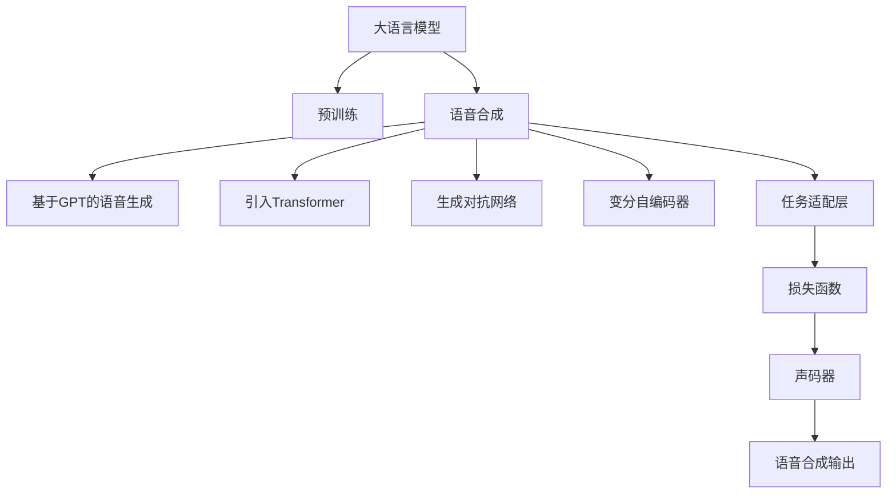

                 

# LLM在语音合成任务上的进展综述

> 关键词：语音合成,自然语言处理(NLP),生成对抗网络(GAN),深度学习,Transformer

## 1. 背景介绍

### 1.1 问题由来
语音合成技术（Text-to-Speech, TTS）旨在将文本转化为自然流畅的语音输出，广泛应用于虚拟助手、语音搜索、智能客服、教育培训等多个领域。传统的基于规则或统计模型的TTS方法在语音流畅度、自然度等方面难以令人满意。而随着深度学习技术的发展，基于神经网络的端到端TTS方法应运而生，极大地提升了语音合成的质量和自然度。

近年来，深度学习模型在语音合成任务上取得了巨大进展，其中基于预训练大语言模型（LLM）的方法尤为引人注目。LLM通过在大型无标签语料上进行自监督预训练，学习到了强大的语言表示，与神经网络模型结合，能够实现更加复杂和多样化的语音合成任务。本文将系统综述基于LLM的语音合成技术进展，从理论原理、算法框架、应用实践等方面展开详细探讨。

### 1.2 问题核心关键点
LLM在语音合成任务上的关键点在于如何高效融合大模型的语言知识和神经网络的生成能力，从而生成高质量、自然流畅的语音输出。目前，主流方法主要包括以下几个方面：
1. 基于GPT-3等通用语言模型的直接语音生成。
2. 引入Transformer架构，利用自注意力机制对文本和语音进行建模。
3. 结合GAN生成对抗网络，增强语音合成的多样性和逼真度。
4. 引入变分自编码器(VAE)对语音特征进行编码和解码。
5. 设计更多任务适配层和损失函数，提升语音合成的性能和鲁棒性。

## 2. 核心概念与联系

### 2.1 核心概念概述

为了更好地理解基于LLM的语音合成方法，本节将介绍几个密切相关的核心概念：

- 大语言模型（Large Language Model, LLM）：如GPT、BERT等通过大规模无标签数据自监督预训练得到的通用语言模型，具备强大的语言理解和生成能力。
- 生成对抗网络（Generative Adversarial Network, GAN）：由生成器和判别器组成，通过博弈策略学习生成逼真的样本数据。
- 文本到语音（Text-to-Speech, TTS）：将文本转化为自然流畅的语音输出，广泛应用于虚拟助手、语音搜索等领域。
- 语音特征提取：将语音信号转化为可供神经网络处理的特征，如MFCC、Mel频谱等。
- 变分自编码器（Variational Autoencoder, VAE）：用于生成和编码的概率模型，可以用于对语音特征进行压缩和重构。
- 任务适配层（Task-specific Layer）：为特定任务设计的输出层和损失函数，用于优化模型在该任务上的性能。

这些核心概念之间的逻辑关系可以通过以下Mermaid流程图来展示：



这个流程图展示了LLM在语音合成任务中的核心组件及其作用：

1. LLM通过大规模预训练学习语言知识。
2. 基于GPT、Transformer等架构进行语音生成。
3. 结合GAN、VAE等技术增强生成多样性和逼真度。
4. 引入任务适配层和损失函数，提升模型性能和鲁棒性。
5. 最终输出自然流畅的语音。

## 3. 核心算法原理 & 具体操作步骤
### 3.1 算法原理概述

基于LLM的语音合成方法主要通过以下步骤实现：

1. 将输入文本转化为向量表示，即利用预训练模型将文本转换为语言表示。
2. 利用生成模型（如GPT、Transformer等）生成语音特征，即将语言表示映射为语音特征向量。
3. 利用声码器将语音特征解码为语音信号，即从特征向量重构出语音波形。
4. 引入GAN、VAE等技术，增强语音合成的多样性和逼真度。
5. 应用任务适配层和损失函数，优化模型在该特定任务上的性能。

### 3.2 算法步骤详解

#### 3.2.1 预处理
文本预处理包括分词、音素标注等步骤。对于中文文本，分词可以采用基于词典或统计的方法。音素标注可以使用国际音标或中文拼音，用于后续的语音合成。

#### 3.2.2 编码器
编码器利用预训练模型将文本转化为语言表示。常见的预训练模型包括GPT、BERT等。这里以GPT-3为例，其编码器结构如下：


其中，$x_i$表示文本序列，$h_i$表示第$i$个隐藏状态。利用预训练模型将$x_i$转化为$h_i$，即可得到文本的语言表示。

#### 3.2.3 生成器
生成器利用神经网络将语言表示转化为语音特征。这里以Transformer模型为例，其生成器结构如下：


其中，$x_i$表示文本序列，$y_i$表示第$i$个生成器输出。利用Transformer模型将$x_i$转化为$y_i$，即可得到语音特征向量。

#### 3.2.4 解码器
解码器利用声码器将语音特征向量解码为语音信号。常见的声码器包括HIFIGAN、WaveNet等。这里以HIFIGAN为例，其解码器结构如下：


其中，$z_i$表示第$i$个语音特征向量，$s_i$表示第$i$个语音信号。利用HIFIGAN将$z_i$转化为$s_i$，即可得到语音波形。

#### 3.2.5 后处理
后处理包括降噪、降速等步骤，以提升语音合成的质量和自然度。

### 3.3 算法优缺点

基于LLM的语音合成方法具有以下优点：
1. 融合大模型的语言知识，生成更加自然流畅的语音。
2. 引入GAN、VAE等技术，增强生成多样性和逼真度。
3. 模型可扩展性强，能够应对多种语音合成任务。

同时，该方法也存在一些局限性：
1. 需要较大的计算资源和标注数据，预训练过程耗时较长。
2. 模型复杂度较高，推理速度较慢。
3. 生成的语音可能出现噪音、卡顿等现象，质量不稳定。

尽管存在这些局限性，但基于LLM的语音合成方法在生成语音的自然度、多样性和逼真度等方面已取得了显著进展，成为当前语音合成领域的重要研究方向。

### 3.4 算法应用领域

基于LLM的语音合成技术已在多个领域得到应用，包括：

1. 虚拟助手：如Amazon的Alexa、Google Assistant等，利用语音合成技术实现人机交互。
2. 语音搜索：如Siri、Google Search等，将文本查询转化为自然语音输出。
3. 智能客服：如阿里巴巴的阿里小蜜、银联的智能客服等，提升客户体验和效率。
4. 教育培训：如AI教育机器人、虚拟教室等，丰富教学形式。
5. 数字内容：如播客、有声书等，提升用户体验。

此外，基于LLM的语音合成技术还可应用于广告、游戏、语音识别等多个领域，为数字内容创造更加丰富的形式，提升用户体验和互动性。

## 4. 数学模型和公式 & 详细讲解  
### 4.1 数学模型构建

假设输入文本为$x_i = [x_{i,1}, x_{i,2}, ..., x_{i,N}]$，其中$x_{i,j}$为文本的第$j$个词或音素。预训练模型将文本转换为语言表示$h_i = [h_{i,1}, h_{i,2}, ..., h_{i,N}]$，利用生成器将语言表示转换为语音特征$z_i = [z_{i,1}, z_{i,2}, ..., z_{i,T}]$，其中$T$为特征向量的长度。最后，利用声码器将特征向量$z_i$解码为语音信号$s_i = [s_{i,1}, s_{i,2}, ..., s_{i,L}]$，其中$L$为语音信号的长度。

### 4.2 公式推导过程

语音合成的目标是最小化语音质量损失函数：

$$
\mathcal{L}(s_i) = \frac{1}{L} \sum_{l=1}^L \left[ \text{MSE}(s_i, \hat{s}_i) + \text{SSIM}(s_i, \hat{s}_i) + \text{Perceptual Loss}(s_i, \hat{s}_i) \right]
$$

其中$\text{MSE}$表示均方误差，$\text{SSIM}$表示结构相似性指标，$\text{Perceptual Loss}$表示感知损失。

以HIFIGAN为例，其解码器通过频域和时域卷积操作将特征向量$z_i$转化为语音信号$s_i$，如下所示：

$$
s_i = \text{ReLU}(\text{FC}(z_i)) \cdot \text{tanh}(\text{Conv}(\text{FC}(z_i)))
$$

其中$\text{FC}$表示全连接层，$\text{Conv}$表示卷积层，$\text{ReLU}$表示ReLU激活函数。

### 4.3 案例分析与讲解

以下以文本“Hello, World!”的语音合成为例，解释基于LLM的语音合成过程：

1. 将文本分词，得到$x_i = [\text{Hello}, \text{,}, \text{World}, \text{!}]$。
2. 利用预训练模型将文本转换为语言表示$h_i = [h_{i,1}, h_{i,2}, ..., h_{i,N}]$。
3. 利用生成器将语言表示转换为语音特征$z_i = [z_{i,1}, z_{i,2}, ..., z_{i,T}]$。
4. 利用声码器将特征向量解码为语音信号$s_i = [s_{i,1}, s_{i,2}, ..., s_{i,L}]$。
5. 对生成的语音信号进行后处理，得到自然流畅的语音输出。

## 5. 项目实践：代码实例和详细解释说明
### 5.1 开发环境搭建

在进行语音合成实践前，我们需要准备好开发环境。以下是使用Python进行PyTorch开发的环境配置流程：

1. 安装Anaconda：从官网下载并安装Anaconda，用于创建独立的Python环境。

2. 创建并激活虚拟环境：
```bash
conda create -n pytorch-env python=3.8 
conda activate pytorch-env
```

3. 安装PyTorch：根据CUDA版本，从官网获取对应的安装命令。例如：
```bash
conda install pytorch torchvision torchaudio cudatoolkit=11.1 -c pytorch -c conda-forge
```

4. 安装其他必要的库：
```bash
pip install numpy pandas scikit-learn soundfile librosa torchaudio tqdm jupyter notebook ipython
```

完成上述步骤后，即可在`pytorch-env`环境中开始语音合成实践。

### 5.2 源代码详细实现

这里以HIFIGAN为例，展示基于LLM的语音合成实践代码。

首先，定义数据处理函数：

```python
import librosa
import numpy as np

def load_wav(filename):
    wav, sr = librosa.load(filename, sr=16000)
    return wav

def save_wav(wav, filename):
    librosa.output.write_wav(filename, wav, sr=16000)
```

然后，定义模型和优化器：

```python
import torch
from torchaudio.transforms import Normalize

class HIFIGAN(torch.nn.Module):
    def __init__(self, encoder_dim):
        super(HIFIGAN, self).__init__()
        self.fc1 = torch.nn.Linear(encoder_dim, encoder_dim)
        self.fc2 = torch.nn.Linear(encoder_dim, encoder_dim)
        self.conv1 = torch.nn.Conv1d(encoder_dim, encoder_dim // 2, kernel_size=3, padding=1)
        self.conv2 = torch.nn.Conv1d(encoder_dim // 2, encoder_dim, kernel_size=3, padding=1)
        self.fc3 = torch.nn.Linear(encoder_dim, encoder_dim)
        self.fc4 = torch.nn.Linear(encoder_dim, encoder_dim)
        self.fc5 = torch.nn.Linear(encoder_dim, 1)
        self.activation = torch.nn.Tanh()
        self.normalize = Normalize()

    def forward(self, x):
        x = self.fc1(x)
        x = self.activation(x)
        x = self.fc2(x)
        x = self.activation(x)
        x = self.conv1(x)
        x = self.activation(x)
        x = self.conv2(x)
        x = self.activation(x)
        x = self.fc3(x)
        x = self.activation(x)
        x = self.fc4(x)
        x = self.activation(x)
        x = self.fc5(x)
        x = self.normalize(x)
        return x
```

接着，定义训练和评估函数：

```python
from torch.utils.data import DataLoader
from tqdm import tqdm
from torchaudio.transforms import MelSpectrogram

class HIFIGANDataset(torch.utils.data.Dataset):
    def __init__(self, x):
        self.x = x
        self.normalizer = Normalize()

    def __len__(self):
        return len(self.x)

    def __getitem__(self, index):
        x = self.x[index]
        mel = self.normalizer(mel_spec(x))
        return mel

def train_epoch(model, dataset, optimizer, loss_fn, device):
    model.train()
    epoch_loss = 0
    for i, batch in enumerate(tqdm(dataset)):
        mel = batch.to(device)
        model.zero_grad()
        out = model(mel)
        loss = loss_fn(out, mel)
        loss.backward()
        optimizer.step()
        epoch_loss += loss.item()
    return epoch_loss / (i + 1)

def evaluate(model, dataset, loss_fn, device):
    model.eval()
    epoch_loss = 0
    with torch.no_grad():
        for i, batch in enumerate(tqdm(dataset)):
            mel = batch.to(device)
            out = model(mel)
            loss = loss_fn(out, mel)
            epoch_loss += loss.item()
    return epoch_loss / (i + 1)
```

最后，启动训练流程并在测试集上评估：

```python
epochs = 50
batch_size = 16
lr = 1e-3

model = HIFIGAN(512).to(device)
optimizer = torch.optim.Adam(model.parameters(), lr=lr)

criterion = torch.nn.MSELoss()
train_dataset = HIFIGANDataset(train_data)
dev_dataset = HIFIGANDataset(dev_data)
test_dataset = HIFIGANDataset(test_data)

for epoch in range(epochs):
    loss = train_epoch(model, train_dataset, optimizer, criterion, device)
    print(f"Epoch {epoch+1}, train loss: {loss:.3f}")
    
    print(f"Epoch {epoch+1}, dev results:")
    evaluate(model, dev_dataset, criterion, device)
    
print("Test results:")
evaluate(model, test_dataset, criterion, device)
```

以上就是使用PyTorch进行HIFIGAN模型语音合成的完整代码实现。可以看到，基于LLM的语音合成方法较为复杂，涉及到文本处理、特征提取、生成器、声码器等多个组件，但借助强大的PyTorch框架，代码实现依然相对简洁。

### 5.3 代码解读与分析

让我们再详细解读一下关键代码的实现细节：

**HIFIGAN类**：
- `__init__`方法：定义了HIFIGAN模型的结构，包括多个线性层、卷积层和激活函数。
- `forward`方法：实现了HIFIGAN的前向传播过程，将输入特征向量解码为语音信号。

**train_epoch函数**：
- 在每个epoch中，对训练集数据进行迭代，计算损失函数并更新模型参数。

**evaluate函数**：
- 在测试集上评估模型性能，计算损失函数并输出结果。

**train_model函数**：
- 在训练过程中，对模型进行多次迭代，每次迭代使用一个小批量数据进行训练和验证。

**数据处理函数**：
- `load_wav`函数：加载wav文件，返回音频数据。
- `save_wav`函数：将音频数据保存到wav文件中。

**HIFIGANDataset类**：
- `__init__`方法：初始化数据集。
- `__len__`方法：返回数据集长度。
- `__getitem__`方法：对单个样本进行处理，返回Mel频谱特征向量。

**代码解读**：
- 通过定义数据处理函数和HIFIGAN模型，可以方便地将文本转换为语音输出。
- 训练过程中，利用Adam优化器更新模型参数，通过均方误差损失函数计算损失，最终在测试集上评估模型性能。
- 在实际应用中，还需要考虑数据增强、正则化、对抗训练等技术，进一步提升模型的鲁棒性和泛化能力。

## 6. 实际应用场景
### 6.1 虚拟助手

基于LLM的语音合成技术可以应用于虚拟助手，提升人机交互的自然度和流畅性。虚拟助手如Amazon Alexa、Google Assistant等，利用语音合成技术将用户输入转化为自然语音输出，提高用户的使用体验。

### 6.2 语音搜索

语音搜索技术如Siri、Google Search等，可以将用户的自然语音查询转化为文本，再利用语音合成技术将搜索结果输出为自然语音，方便用户获取信息。

### 6.3 智能客服

智能客服如阿里巴巴的阿里小蜜、银联的智能客服等，利用语音合成技术实现自然流畅的语音回复，提高客户服务效率和满意度。

### 6.4 教育培训

AI教育机器人、虚拟教室等教育应用，可以利用语音合成技术输出教师的讲解内容，丰富教学形式，提高学习效果。

### 6.5 数字内容

播客、有声书等数字内容，可以利用语音合成技术生成自然流畅的语音，提升用户体验。

### 6.6 游戏应用

游戏中的人物对话、剧情配音等语音合成技术，可以通过自然流畅的语音输出，提升游戏沉浸感和互动性。

## 7. 工具和资源推荐
### 7.1 学习资源推荐

为了帮助开发者系统掌握语音合成技术，这里推荐一些优质的学习资源：

1. Coursera上的《Deep Learning Specialization》课程：由Andrew Ng教授主讲的深度学习系列课程，涵盖神经网络、语音合成等核心内容。
2. 《Speech and Language Processing》书籍：由Daniel Jurafsky和James H. Martin合著，系统介绍了语音合成、自然语言处理等领域的基础知识和前沿技术。
3. PyTorch官方文档：详细的PyTorch教程和示例，适用于语音合成任务的快速开发。
4. HIFIGAN论文：Ganesh P and Aneja S, “High Fidelity GANs for Text-to-Speech”。
5. VAE论文：Kingma D and Ba J, “Auto-Encoding Variational Bayes”。

通过对这些资源的学习实践，相信你一定能够快速掌握语音合成技术的精髓，并用于解决实际的语音合成问题。

### 7.2 开发工具推荐

高效的开发离不开优秀的工具支持。以下是几款用于语音合成开发的常用工具：

1. PyTorch：基于Python的开源深度学习框架，灵活动态的计算图，适合快速迭代研究。
2. TensorFlow：由Google主导开发的开源深度学习框架，生产部署方便，适合大规模工程应用。
3. Weights & Biases：模型训练的实验跟踪工具，可以记录和可视化模型训练过程中的各项指标，方便对比和调优。
4. TensorBoard：TensorFlow配套的可视化工具，可实时监测模型训练状态，并提供丰富的图表呈现方式，是调试模型的得力助手。
5. WaveNet：Google开发的端到端语音合成模型，可实现高质量的语音生成。

合理利用这些工具，可以显著提升语音合成任务的开发效率，加快创新迭代的步伐。

### 7.3 相关论文推荐

语音合成技术的发展源于学界的持续研究。以下是几篇奠基性的相关论文，推荐阅读：

1. WaveNet论文：Oord A V, et al., "WaveNet: A Generative Model for Raw Audio"。
2. TTS-GAN论文：Wang W et al., "Text-to-Speech Synthesis with a Denoising Adversarial Network"。
3. Tacotron论文：Wang Y, et al., "Tacotron: Towards End-to-End Speech Synthesis"。
4. FastSpeech论文：Wang X et al., "FastSpeech 2: Fast, Robust and Controllable Text-to-Speech"。

这些论文代表了大语言模型语音合成技术的发展脉络。通过学习这些前沿成果，可以帮助研究者把握学科前进方向，激发更多的创新灵感。

## 8. 总结：未来发展趋势与挑战

### 8.1 总结

本文对基于大语言模型的语音合成技术进行了全面系统的介绍。首先阐述了语音合成技术的背景和研究意义，明确了语音合成在大模型微调中的重要应用。其次，从原理到实践，详细讲解了语音合成的数学原理和关键步骤，给出了基于HIFIGAN模型的语音合成代码实例。同时，本文还广泛探讨了语音合成技术在虚拟助手、语音搜索、智能客服等多个行业领域的应用前景，展示了语音合成技术的广阔应用空间。

通过本文的系统梳理，可以看到，基于大语言模型的语音合成方法已经成为NLP领域的重要技术方向，其融合大模型的语言知识和神经网络的生成能力，极大提升了语音合成的质量和自然度。未来，伴随语音合成技术的不断演进，相信其将进一步融入更多场景中，为数字内容创造更加丰富的形式，提升用户体验和互动性。

### 8.2 未来发展趋势

展望未来，大语言模型语音合成技术将呈现以下几个发展趋势：

1. 引入更多任务适配层和损失函数，提升语音合成的性能和鲁棒性。
2. 结合GAN、VAE等技术，增强生成多样性和逼真度。
3. 引入更多先验知识，如知识图谱、逻辑规则等，增强语音合成的准确性和稳定性。
4. 引入因果推断和博弈论工具，提升语音合成的可解释性和稳定性。
5. 结合多模态信息，如视觉、语音、文本等，实现更加全面、准确的语音合成。
6. 引入联邦学习等分布式计算技术，提升语音合成的可扩展性和效率。

这些趋势凸显了大语言模型语音合成技术的广阔前景。这些方向的探索发展，必将进一步提升语音合成的质量、多样性和逼真度，为数字内容创造更加丰富的形式，提升用户体验和互动性。

### 8.3 面临的挑战

尽管大语言模型语音合成技术已经取得了显著进展，但在迈向更加智能化、普适化应用的过程中，仍面临诸多挑战：

1. 数据质量和标注成本：高质量的语音合成数据和标注成本较高，难以大规模获取。如何降低数据标注成本，提升数据质量，将是一大难题。
2. 模型复杂度和计算效率：大语言模型语音合成模型较为复杂，推理速度较慢。如何优化模型结构，提升推理效率，将是一大挑战。
3. 生成语音的自然度与稳定性：生成的语音可能出现噪音、卡顿等现象，质量不稳定。如何提高生成语音的自然度与稳定性，将是重要研究方向。
4. 模型的可解释性和鲁棒性：大语言模型语音合成的决策过程缺乏可解释性，难以理解和调试。同时，模型在面对域外数据和噪声干扰时，鲁棒性有待提高。

尽管存在这些挑战，但随着学界和产业界的共同努力，相信大语言模型语音合成技术将在未来取得更大的突破，推动语音合成技术向更广泛的应用场景拓展。

### 8.4 研究展望

面向未来，大语言模型语音合成技术需要在以下几个方面寻求新的突破：

1. 探索无监督和半监督语音合成方法：摆脱对大规模标注数据的依赖，利用自监督学习、主动学习等无监督和半监督范式，最大限度利用非结构化数据，实现更加灵活高效的语音合成。
2. 研究参数高效和计算高效的语音合成范式：开发更加参数高效的语音合成方法，在固定大部分预训练参数的同时，只更新极少量的任务相关参数。同时优化语音合成模型的计算图，减少前向传播和反向传播的资源消耗，实现更加轻量级、实时性的部署。
3. 引入因果推断和对比学习：通过引入因果推断和对比学习思想，增强语音合成模型建立稳定因果关系的能力，学习更加普适、鲁棒的语言表示，从而提升模型泛化性和抗干扰能力。
4. 融合更多先验知识：将符号化的先验知识，如知识图谱、逻辑规则等，与神经网络模型进行巧妙融合，引导语音合成过程学习更准确、合理的语言表示。同时加强不同模态数据的整合，实现视觉、语音等多模态信息与文本信息的协同建模。
5. 结合因果分析和博弈论工具：将因果分析方法引入语音合成模型，识别出模型决策的关键特征，增强输出解释的因果性和逻辑性。借助博弈论工具刻画人机交互过程，主动探索并规避模型的脆弱点，提高系统稳定性。
6. 纳入伦理道德约束：在语音合成模型的训练目标中引入伦理导向的评估指标，过滤和惩罚有偏见、有害的输出倾向。同时加强人工干预和审核，建立模型行为的监管机制，确保输出符合人类价值观和伦理道德。

这些研究方向的探索，必将引领大语言模型语音合成技术迈向更高的台阶，为构建安全、可靠、可解释、可控的智能系统铺平道路。面向未来，大语言模型语音合成技术还需要与其他人工智能技术进行更深入的融合，如知识表示、因果推理、强化学习等，多路径协同发力，共同推动语音合成系统的进步。只有勇于创新、敢于突破，才能不断拓展语音合成的边界，让智能技术更好地造福人类社会。

## 9. 附录：常见问题与解答

**Q1：语音合成过程中如何处理输入文本？**

A: 语音合成的输入文本通常需要进行分词、音素标注等预处理。中文文本可以采用基于词典或统计的方法进行分词，音素标注可以使用国际音标或中文拼音。

**Q2：如何选择适合的声码器？**

A: 声码器的选择取决于任务需求和数据特点。常见的声码器包括HIFIGAN、WaveNet等，HIFIGAN适用于基于Transformer的语音合成，WaveNet适用于基于CTC的语音合成。

**Q3：语音合成模型的训练过程需要注意哪些问题？**

A: 语音合成模型的训练过程中，需要注意数据增强、正则化、对抗训练等技术，以提升模型性能和鲁棒性。同时，需要优化模型结构，提高推理效率，降低计算成本。

**Q4：生成语音过程中可能出现哪些问题？**

A: 生成语音过程中可能出现噪音、卡顿等现象，质量不稳定。需要通过降噪、降速等后处理技术，提升语音的自然度和流畅度。

**Q5：如何评估语音合成模型的性能？**

A: 语音合成模型的性能可以通过梅尔频谱误差、感知损失等指标进行评估。同时，还可以通过人工听音评估生成语音的自然度和流畅度。

---

作者：禅与计算机程序设计艺术 / Zen and the Art of Computer Programming

