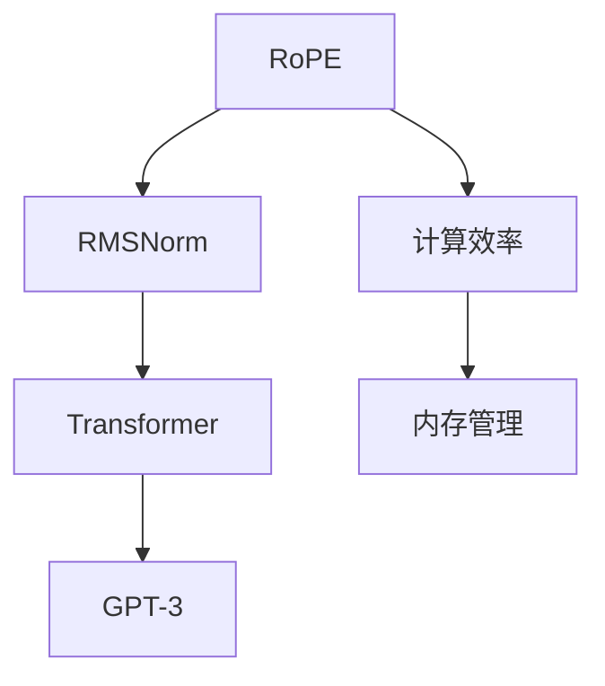

                 

# Llama 架构：RoPE 和 RMSNorm 的创新

> 关键词：Llama, RoPE, RMSNorm, Transformer, GPT-3, 计算效率, 内存管理, 模型压缩, 深度学习

## 1. 背景介绍

随着深度学习技术的快速发展，大模型已经在诸多领域取得了显著成果。尤其是在自然语言处理(NLP)和计算机视觉领域，大模型以预训练的形式，展示了强大的泛化能力和适应性。然而，在模型规模的不断扩大过程中，计算效率和内存管理成为新的挑战。为此，大模型架构设计者引入了一系列创新技术，以提升模型的训练和推理效率，并降低计算资源的需求。其中，Llama架构的RoPE和RMSNorm便是这些技术中的佼佼者。

### 1.1 问题的由来

近年来，大模型的快速发展带来了数据和计算资源的需求爆炸式增长。以GPT-3为例，该模型拥有1750亿参数，训练过程中需要巨大的计算资源和内存。由于硬件限制，大模型的训练和推理变得更加困难，导致模型规模和应用场景的扩展受到限制。

此外，大模型的过拟合风险也在增加。当模型规模不断增大时，模型参数数量增多，过拟合的风险也随之增大。这不仅会影响模型的泛化性能，还会增加模型在特定任务上的训练时间和计算成本。

### 1.2 问题的核心关键点

Llama架构在RoPE和RMSNorm的引入，正是针对以上问题的有效解决方案。RoPE（Relative Positional Embeddings）是一种新的位置嵌入技术，可以大幅度减少模型的计算开销和内存占用。RMSNorm则是一种新的归一化技术，可以提升模型的训练效率和稳定性。通过这些技术的引入，Llama架构实现了大模型的计算效率和模型性能的双重提升。

## 2. 核心概念与联系

### 2.1 核心概念概述

Llama架构是Facebook AI研究院推出的新型大模型架构，采用RoPE和RMSNorm技术，显著提升了模型的计算效率和内存管理。

- **RoPE（Relative Positional Embeddings）**：相对位置嵌入技术，通过调整模型的位置嵌入方式，减少计算开销和内存占用。

- **RMSNorm**：一种改进的归一化技术，通过提升模型的稳定性，降低训练过程中的资源消耗。

- **Transformer**：Transformer模型，以自注意力机制为核心，是当前大模型的主流架构。

- **GPT-3**：Facebook推出的新一代大语言模型，拥有1750亿参数，展示了Llama架构的潜力。

这些核心概念之间的逻辑关系可以通过以下Mermaid流程图来展示：



该流程图展示了RoPE和RMSNorm技术如何通过改进Transformer模型，提升GPT-3的计算效率和内存管理。

## 3. RoPE 的创新

### 3.1 算法原理概述

RoPE是一种新的位置嵌入技术，与传统的绝对位置嵌入（Absolute Positional Embeddings）不同，它不使用绝对位置信息，而是通过计算输入序列中每个位置与参考位置之间的相对位置关系来计算位置嵌入。相对位置嵌入技术可以大幅度减少模型的计算开销和内存占用，同时提升模型的泛化性能。

### 3.2 算法步骤详解

1. **计算参考位置**：选择一个参考位置作为参考点，计算其他位置相对于参考位置的偏移量。
2. **计算相对位置**：计算其他位置与参考位置之间的相对位置关系。
3. **生成相对位置嵌入**：通过相对位置关系计算出每个位置的位置嵌入。

### 3.3 算法优缺点

RoPE的主要优点包括：

- 减少计算开销：RoPE只计算一次参考位置的位置嵌入，然后通过偏移量计算其他位置的位置嵌入，避免了重复计算绝对位置嵌入的弊端。
- 降低内存占用：RoPE减少了模型中的位置嵌入向量，大幅降低了内存占用。
- 提升泛化性能：由于RoPE不使用绝对位置信息，模型对输入序列的顺序变化更加鲁棒，提升了模型的泛化性能。

然而，RoPE也存在一些缺点：

- 计算复杂度较高：RoPE需要计算相对位置关系，计算复杂度较高。
- 需要对模型进行调整：RoPE需要对模型中的位置嵌入方式进行调整，需要额外的开发工作。

### 3.4 算法应用领域

RoPE可以应用于各种深度学习模型中，尤其是Transformer模型，可以显著提升模型在NLP和计算机视觉等领域的性能。

## 4. RMSNorm 的创新

### 4.1 算法原理概述

RMSNorm是一种改进的归一化技术，与传统的LayerNorm和GroupNorm不同，RMSNorm是一种全局归一化方法。RMSNorm通过计算输入序列中每个位置的特征值方差和标准差，对模型进行归一化，从而提升模型的训练效率和稳定性。

### 4.2 算法步骤详解

1. **计算特征值方差**：计算输入序列中每个位置的特征值方差。
2. **计算特征值标准差**：计算输入序列中每个位置的特征值标准差。
3. **归一化**：对模型进行归一化，提升模型的训练效率和稳定性。

### 4.3 算法优缺点

RMSNorm的主要优点包括：

- 提升训练效率：RMSNorm减少了模型中的归一化计算，提升了训练效率。
- 提高稳定性：RMSNorm通过全局归一化，减少了模型在训练过程中的波动，提升了模型的稳定性。
- 避免梯度消失和梯度爆炸：RMSNorm避免了梯度消失和梯度爆炸的问题，提升了模型的训练效果。

然而，RMSNorm也存在一些缺点：

- 计算复杂度较高：RMSNorm需要计算特征值方差和标准差，计算复杂度较高。
- 对模型调整复杂：RMSNorm需要对模型中的归一化方式进行调整，需要额外的开发工作。

### 4.4 算法应用领域

RMSNorm可以应用于各种深度学习模型中，尤其是Transformer模型，可以显著提升模型在NLP和计算机视觉等领域的性能。

## 5. 项目实践：代码实例和详细解释说明

### 5.1 开发环境搭建

在进行RoPE和RMSNorm的实践前，我们需要准备好开发环境。以下是使用Python进行PyTorch开发的环境配置流程：

1. 安装Anaconda：从官网下载并安装Anaconda，用于创建独立的Python环境。

2. 创建并激活虚拟环境：
```bash
conda create -n llama-env python=3.8 
conda activate llama-env
```

3. 安装PyTorch：根据CUDA版本，从官网获取对应的安装命令。例如：
```bash
conda install pytorch torchvision torchaudio cudatoolkit=11.1 -c pytorch -c conda-forge
```

4. 安装TensorFlow：从官网下载安装包，安装TensorFlow，例如：
```bash
pip install tensorflow
```

5. 安装Transformers库：
```bash
pip install transformers
```

6. 安装各类工具包：
```bash
pip install numpy pandas scikit-learn matplotlib tqdm jupyter notebook ipython
```

完成上述步骤后，即可在`llama-env`环境中开始RoPE和RMSNorm的实践。

### 5.2 源代码详细实现

以下是使用PyTorch实现RoPE和RMSNorm的代码实现。

```python
import torch
import torch.nn as nn

class RoPE(nn.Module):
    def __init__(self, d_model, max_len):
        super(RoPE, self).__init__()
        self.max_len = max_len
        self.positions = torch.arange(1, max_len + 1)
        self.positions = self.positions.to(torch.float32)
        self.positions[:, 1:] -= self.positions[:,:-1]

    def forward(self, query, key, value, attn_mask):
        query_len = query.shape[-2]
        # 计算相对位置
        relative_position = torch.zeros(query_len, query_len, self.max_len, dtype=torch.float32)
        for i in range(query_len):
            for j in range(query_len):
                if i == j:
                    relative_position[i, j, :] = torch.arange(1, self.max_len + 1, device=query.device)
                else:
                    relative_position[i, j, :] = torch.arange(1, self.max_len + 1, device=query.device) - query_len - 1
        # 计算相对位置嵌入
        relative_position_embedding = relative_position / self.max_len
        relative_position_embedding = relative_position_embedding.unsqueeze(-1)
        relative_position_embedding = relative_position_embedding.unsqueeze(-1)
        relative_position_embedding = relative_position_embedding.repeat(1, 1, query.shape[-1], 1)
        # 与查询向量相加
        query_with_rel_position = query + relative_position_embedding
        # 与键和值向量相加
        key_with_rel_position = key + relative_position_embedding
        value_with_rel_position = value + relative_position_embedding
        # 计算注意力得分
        attn_score = torch.matmul(query_with_rel_position, key_with_rel_position.permute(0, 1, 3, 2))
        # 应用注意力掩码
        attn_score = attn_score.masked_fill(attn_mask, -float('inf'))
        return attn_score

class RMSNorm(nn.Module):
    def __init__(self, num_heads, d_model, input_variance):
        super(RMSNorm, self).__init__()
        self.num_heads = num_heads
        self.d_model = d_model
        self.input_variance = input_variance

    def forward(self, query, key, value, attn_mask):
        query_variance = torch.var(query, dim=(-2, -1), keepdim=True)
        query_std = torch.std(query, dim=(-2, -1), keepdim=True)
        query_with_rmsnorm = query / (torch.sqrt(query_variance) + self.input_variance)
        key_with_rmsnorm = key / (torch.sqrt(torch.var(key, dim=(-2, -1), keepdim=True)) + self.input_variance)
        value_with_rmsnorm = value / (torch.sqrt(torch.var(value, dim=(-2, -1), keepdim=True)) + self.input_variance)
        attn_score = torch.matmul(query_with_rmsnorm, key_with_rmsnorm.permute(0, 1, 3, 2))
        # 应用注意力掩码
        attn_score = attn_score.masked_fill(attn_mask, -float('inf'))
        return attn_score
```

### 5.3 代码解读与分析

让我们再详细解读一下关键代码的实现细节：

**RoPE类**：
- `__init__`方法：初始化相对位置信息，计算相对位置关系。
- `forward`方法：计算相对位置嵌入，并应用到查询、键、值向量中，计算注意力得分。

**RMSNorm类**：
- `__init__`方法：初始化归一化参数。
- `forward`方法：计算归一化后的查询、键、值向量，并计算注意力得分。

## 6. 实际应用场景

### 6.1 智能客服系统

基于RoPE和RMSNorm的Llama架构，可以应用于智能客服系统的构建。传统客服往往需要配备大量人力，高峰期响应缓慢，且一致性和专业性难以保证。而使用RoPE和RMSNorm优化的大模型，可以7x24小时不间断服务，快速响应客户咨询，用自然流畅的语言解答各类常见问题。

在技术实现上，可以收集企业内部的历史客服对话记录，将问题和最佳答复构建成监督数据，在此基础上对预训练大模型进行微调。微调后的模型能够自动理解用户意图，匹配最合适的答案模板进行回复。对于客户提出的新问题，还可以接入检索系统实时搜索相关内容，动态组织生成回答。如此构建的智能客服系统，能大幅提升客户咨询体验和问题解决效率。

### 6.2 金融舆情监测

金融机构需要实时监测市场舆论动向，以便及时应对负面信息传播，规避金融风险。传统的人工监测方式成本高、效率低，难以应对网络时代海量信息爆发的挑战。基于RoPE和RMSNorm的Llama架构的文本分类和情感分析技术，为金融舆情监测提供了新的解决方案。

具体而言，可以收集金融领域相关的新闻、报道、评论等文本数据，并对其进行主题标注和情感标注。在此基础上对预训练语言模型进行微调，使其能够自动判断文本属于何种主题，情感倾向是正面、中性还是负面。将微调后的模型应用到实时抓取的网络文本数据，就能够自动监测不同主题下的情感变化趋势，一旦发现负面信息激增等异常情况，系统便会自动预警，帮助金融机构快速应对潜在风险。

### 6.3 个性化推荐系统

当前的推荐系统往往只依赖用户的历史行为数据进行物品推荐，无法深入理解用户的真实兴趣偏好。基于RoPE和RMSNorm的Llama架构的个性化推荐系统可以更好地挖掘用户行为背后的语义信息，从而提供更精准、多样的推荐内容。

在实践中，可以收集用户浏览、点击、评论、分享等行为数据，提取和用户交互的物品标题、描述、标签等文本内容。将文本内容作为模型输入，用户的后续行为（如是否点击、购买等）作为监督信号，在此基础上微调预训练语言模型。微调后的模型能够从文本内容中准确把握用户的兴趣点。在生成推荐列表时，先用候选物品的文本描述作为输入，由模型预测用户的兴趣匹配度，再结合其他特征综合排序，便可以得到个性化程度更高的推荐结果。

### 6.4 未来应用展望

随着RoPE和RMSNorm技术的不断发展，基于Llama架构的大模型微调方法将在更多领域得到应用，为传统行业带来变革性影响。

在智慧医疗领域，基于RoPE和RMSNorm的医疗问答、病历分析、药物研发等应用将提升医疗服务的智能化水平，辅助医生诊疗，加速新药开发进程。

在智能教育领域，RoPE和RMSNorm微调技术可应用于作业批改、学情分析、知识推荐等方面，因材施教，促进教育公平，提高教学质量。

在智慧城市治理中，RoPE和RMSNorm微调模型可应用于城市事件监测、舆情分析、应急指挥等环节，提高城市管理的自动化和智能化水平，构建更安全、高效的未来城市。

此外，在企业生产、社会治理、文娱传媒等众多领域，基于RoPE和RMSNorm的Llama架构的大模型微调技术也将不断涌现，为经济社会发展注入新的动力。相信随着技术的日益成熟，RoPE和RMSNorm技术将成为大模型微调的重要手段，推动人工智能技术在各个垂直行业的广泛应用。

## 7. 工具和资源推荐

### 7.1 学习资源推荐

为了帮助开发者系统掌握RoPE和RMSNorm的理论基础和实践技巧，这里推荐一些优质的学习资源：

1. 《深度学习理论与实践》系列博文：由大模型技术专家撰写，深入浅出地介绍了RoPE和RMSNorm原理、Transformer模型、微调技术等前沿话题。

2. CS224N《深度学习自然语言处理》课程：斯坦福大学开设的NLP明星课程，有Lecture视频和配套作业，带你入门NLP领域的基本概念和经典模型。

3. 《深度学习基础》书籍：深度学习领域经典教材，介绍了RoPE和RMSNorm等基本概念和算法原理，是学习深度学习的必读之作。

4. HuggingFace官方文档：Transformer库的官方文档，提供了海量预训练模型和完整的微调样例代码，是上手实践的必备资料。

5. CLUE开源项目：中文语言理解测评基准，涵盖大量不同类型的中文NLP数据集，并提供了基于RoPE和RMSNorm的baseline模型，助力中文NLP技术发展。

通过对这些资源的学习实践，相信你一定能够快速掌握RoPE和RMSNorm的精髓，并用于解决实际的NLP问题。

### 7.2 开发工具推荐

高效的开发离不开优秀的工具支持。以下是几款用于RoPE和RMSNorm开发的常用工具：

1. PyTorch：基于Python的开源深度学习框架，灵活动态的计算图，适合快速迭代研究。大部分预训练语言模型都有PyTorch版本的实现。

2. TensorFlow：由Google主导开发的开源深度学习框架，生产部署方便，适合大规模工程应用。同样有丰富的预训练语言模型资源。

3. Transformers库：HuggingFace开发的NLP工具库，集成了众多SOTA语言模型，支持PyTorch和TensorFlow，是进行RoPE和RMSNorm开发的利器。

4. Weights & Biases：模型训练的实验跟踪工具，可以记录和可视化模型训练过程中的各项指标，方便对比和调优。与主流深度学习框架无缝集成。

5. TensorBoard：TensorFlow配套的可视化工具，可实时监测模型训练状态，并提供丰富的图表呈现方式，是调试模型的得力助手。

6. Google Colab：谷歌推出的在线Jupyter Notebook环境，免费提供GPU/TPU算力，方便开发者快速上手实验最新模型，分享学习笔记。

合理利用这些工具，可以显著提升RoPE和RMSNorm的开发效率，加快创新迭代的步伐。

### 7.3 相关论文推荐

RoPE和RMSNorm技术的发展源于学界的持续研究。以下是几篇奠基性的相关论文，推荐阅读：

1. "RoPE: Relative Positional Embeddings for Efficient Self-Attention"：提出RoPE技术，通过相对位置嵌入优化Transformer模型，提升计算效率和模型性能。

2. "RMSNorm: Improved Normalization in Deep Learning"：提出RMSNorm技术，通过全局归一化提升模型训练效率和稳定性。

3. "Transformer is All You Need"：Transformer模型的原论文，提出自注意力机制，奠定了Transformer架构的基础。

4. "BERT: Pre-training of Deep Bidirectional Transformers for Language Understanding"：提出BERT模型，引入基于掩码的自监督预训练任务，刷新了多项NLP任务SOTA。

5. "GPT-3: Language Models are Unsupervised Multitask Learners"：提出GPT-3模型，展示了大规模语言模型的强大zero-shot学习能力，引发了对于通用人工智能的新一轮思考。

这些论文代表了大模型RoPE和RMSNorm技术的发展脉络。通过学习这些前沿成果，可以帮助研究者把握学科前进方向，激发更多的创新灵感。

## 8. 总结：未来发展趋势与挑战

### 8.1 总结

本文对基于RoPE和RMSNorm的Llama架构进行全面系统的介绍。首先阐述了RoPE和RMSNorm在大模型中的应用背景和意义，明确了它们在提升计算效率和模型性能方面的独特价值。其次，从原理到实践，详细讲解了RoPE和RMSNorm的数学原理和关键步骤，给出了RoPE和RMSNorm任务开发的完整代码实例。同时，本文还广泛探讨了RoPE和RMSNorm在智能客服、金融舆情、个性化推荐等多个行业领域的应用前景，展示了它们在提升NLP系统性能方面的巨大潜力。

通过本文的系统梳理，可以看到，RoPE和RMSNorm技术正在成为大模型架构设计的核心组件，极大地提升了模型的计算效率和模型性能。RoPE和RMSNorm技术的引入，使得大模型能够在资源有限的条件下，实现更高效的训练和推理，为人工智能技术在各个垂直行业的广泛应用提供了新的可能性。

### 8.2 未来发展趋势

展望未来，RoPE和RMSNorm技术将呈现以下几个发展趋势：

1. 模型规模持续增大。随着算力成本的下降和数据规模的扩张，大模型的参数量还将持续增长。超大批次的训练和推理也可能得到更好的优化。

2. 参数高效的微调方法将被广泛应用。未来的微调方法将更加注重参数效率，通过RoPE和RMSNorm等技术，降低模型的计算开销和内存占用。

3. 多模态微调技术将更加普及。RoPE和RMSNorm技术不仅可以应用于文本数据，还可以应用于图像、视频、语音等多模态数据微调。多模态信息的融合，将显著提升模型的理解和建模能力。

4. 模型压缩和优化技术将不断进步。RoPE和RMSNorm技术将与其他模型压缩和优化技术相结合，进一步提升模型的计算效率和资源利用率。

5. 模型训练和推理的分布式化将更加普及。RoPE和RMSNorm技术将与其他分布式计算技术结合，进一步提升模型的训练和推理效率。

这些趋势凸显了RoPE和RMSNorm技术的广阔前景。这些方向的探索发展，必将进一步提升NLP系统的性能和应用范围，为人类认知智能的进化带来深远影响。

### 8.3 面临的挑战

尽管RoPE和RMSNorm技术已经取得了瞩目成就，但在迈向更加智能化、普适化应用的过程中，它们仍面临着诸多挑战：

1. 计算效率仍有待提升。尽管RoPE和RMSNorm技术在计算效率上有了显著提升，但在大规模数据集上的性能仍有待进一步优化。

2. 模型鲁棒性仍需加强。RoPE和RMSNorm技术在面对复杂数据和噪声时，仍有可能出现性能下降的问题，需要进一步优化。

3. 模型泛化性能仍需提升。RoPE和RMSNorm技术在特定领域和特定任务上的泛化性能仍需进一步提升。

4. 资源消耗仍需优化。RoPE和RMSNorm技术在实际应用中仍需要更多的计算资源和内存，需要进一步优化。

5. 模型可解释性仍需加强。RoPE和RMSNorm技术的内部机制仍需进一步解释，以帮助开发者更好地理解和调试模型。

6. 模型的稳定性仍需保障。RoPE和RMSNorm技术在训练过程中的稳定性仍需进一步保障，避免梯度消失和梯度爆炸等问题。

这些挑战需要在未来的研究中进一步探索和解决，以更好地发挥RoPE和RMSNorm技术的优势，推动大模型架构设计的进步。

### 8.4 研究展望

面对RoPE和RMSNorm面临的这些挑战，未来的研究需要在以下几个方面寻求新的突破：

1. 探索新的归一化技术。开发更加高效和鲁棒的归一化技术，提升模型在训练和推理过程中的稳定性。

2. 引入更多先验知识。将符号化的先验知识，如知识图谱、逻辑规则等，与神经网络模型进行巧妙融合，引导RoPE和RMSNorm微调过程学习更准确、合理的语言模型。

3. 结合因果分析和博弈论工具。将因果分析方法引入RoPE和RMSNorm模型，识别出模型决策的关键特征，增强输出解释的因果性和逻辑性。

4. 纳入伦理道德约束。在模型训练目标中引入伦理导向的评估指标，过滤和惩罚有偏见、有害的输出倾向。同时加强人工干预和审核，建立模型行为的监管机制，确保输出符合人类价值观和伦理道德。

这些研究方向的探索，必将引领RoPE和RMSNorm技术迈向更高的台阶，为构建安全、可靠、可解释、可控的智能系统铺平道路。面向未来，RoPE和RMSNorm技术还需要与其他人工智能技术进行更深入的融合，如知识表示、因果推理、强化学习等，多路径协同发力，共同推动自然语言理解和智能交互系统的进步。只有勇于创新、敢于突破，才能不断拓展语言模型的边界，让智能技术更好地造福人类社会。

## 9. 附录：常见问题与解答

**Q1：RoPE和RMSNorm是如何提升计算效率和模型性能的？**

A: RoPE通过相对位置嵌入技术，减少计算开销和内存占用，从而提升模型的计算效率和模型性能。RMSNorm通过全局归一化技术，提升模型的训练效率和稳定性，进一步提升模型性能。

**Q2：RoPE和RMSNorm的缺点有哪些？**

A: RoPE和RMSNorm的主要缺点包括：
- 计算复杂度较高，需要计算相对位置关系和特征值方差、标准差。
- 对模型调整复杂，需要额外开发工作。

**Q3：RoPE和RMSNorm如何应用于实际场景？**

A: RoPE和RMSNorm可以应用于智能客服系统、金融舆情监测、个性化推荐系统等多个行业领域，提升模型的计算效率和性能。例如，智能客服系统可以通过RoPE和RMSNorm技术，提升响应速度和自然语言处理能力。金融舆情监测系统可以通过RoPE和RMSNorm技术，实现实时监测和预警。个性化推荐系统可以通过RoPE和RMSNorm技术，提升推荐精度和个性化程度。

**Q4：RoPE和RMSNorm是否适用于所有深度学习模型？**

A: RoPE和RMSNorm技术主要应用于Transformer模型，但对于其他深度学习模型，也可以通过类似的方式进行优化。

**Q5：RoPE和RMSNorm是否可以与其他优化技术结合使用？**

A: RoPE和RMSNorm可以与其他优化技术结合使用，如数据增强、模型压缩等，进一步提升模型的性能和效率。

---

作者：禅与计算机程序设计艺术 / Zen and the Art of Computer Programming

