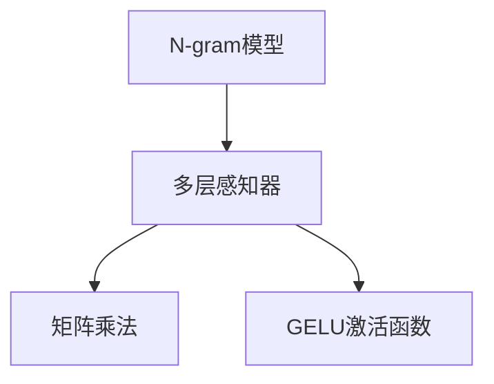

                 

# N-gram模型：多层感知器、矩阵乘法和GELU激活函数

> 关键词：N-gram模型, 多层感知器, 矩阵乘法, GELU激活函数

## 1. 背景介绍

N-gram模型是一种基于概率统计的语言模型，广泛应用于自然语言处理（NLP）、语音识别、机器翻译等任务中。N-gram模型可以捕捉文本中的局部结构信息，从而有效地预测下一个词或字符，是构建更高级语言模型（如循环神经网络RNN和Transformer）的基础。

### 1.1 问题由来

传统的N-gram模型采用一种基于统计的方法来建模文本序列。具体地，N-gram模型通过计算相邻N个词的概率分布来预测下一个词。这种基于概率统计的方法虽然简单易行，但在处理长文本时，由于考虑局部信息，无法有效地捕捉文本的长期依赖关系。

近年来，基于神经网络的模型（如循环神经网络RNN和Transformer）成为NLP的主流。这些模型能够捕捉长距离依赖关系，并在各种任务中取得了显著的进展。但是，它们往往需要大量的计算资源，难以在实际应用中广泛部署。

为了在保持高预测性能的同时，减少计算资源消耗，研究者们开始探索将N-gram模型和神经网络技术相结合的方法。本文将深入介绍一种结合N-gram模型和神经网络的N-gram LSTM模型，以及其中的关键技术——多层感知器、矩阵乘法和GELU激活函数。

## 2. 核心概念与联系

### 2.1 核心概念概述

为更好地理解N-gram LSTM模型，本节将介绍几个密切相关的核心概念：

- N-gram模型：基于统计的语言模型，通过计算相邻N个词（或字符）的概率分布来预测下一个词（或字符）。
- 多层感知器（MLP）：一种前馈神经网络，由多个全连接层组成，每个层之间通过非线性激活函数进行连接。
- 矩阵乘法：矩阵乘法是神经网络中常用的数学运算，用于计算两个向量（或矩阵）之间的点积，从而得到一个新的向量（或矩阵）。
- GELU激活函数：Gaussian Error Linear Unit，是一种激活函数，用于增强神经网络的非线性表达能力，是一种比ReLU更为平滑的激活函数。

这些核心概念之间的逻辑关系可以通过以下Mermaid流程图来展示：



这个流程图展示了大语言模型的核心概念及其之间的关系：

1. N-gram模型通过统计相邻N个词的概率分布，构建基本的语言模型。
2. 多层感知器利用N-gram模型的统计信息，结合神经网络的前馈结构，构建更复杂的模型。
3. 矩阵乘法是神经网络中的基本运算，用于连接不同的神经元。
4. GELU激活函数用于增强模型的非线性表达能力，从而提高模型的预测性能。

这些概念共同构成了N-gram LSTM模型的基础，使其能够高效地捕捉文本中的长距离依赖关系，并在各种NLP任务中取得优异的表现。

## 3. 核心算法原理 & 具体操作步骤

### 3.1 算法原理概述

N-gram LSTM模型的核心思想是通过多层感知器和GELU激活函数，构建一个能够捕捉长距离依赖关系的神经网络模型。该模型采用N-gram模型的统计信息作为输入，通过多层感知器进行非线性映射，最后通过GELU激活函数进行非线性变换。

具体地，假设文本序列为 $x=(x_1, x_2, \ldots, x_t)$，每个 $x_t$ 表示一个词或字符。N-gram LSTM模型的目标是通过计算相邻N个词的概率分布，预测下一个词。模型的输入为相邻N个词 $x_{t-N+1}, x_{t-N+2}, \ldots, x_t$，输出为下一个词 $x_{t+1}$。

N-gram LSTM模型由多层感知器组成，每一层将输入 $x_{t-N+1}, x_{t-N+2}, \ldots, x_t$ 映射为一个新的特征向量，最后通过GELU激活函数进行非线性变换。模型的结构如下图所示：

```mermaid
graph TB
    A[输入: $x_{t-N+1}, x_{t-N+2}, \ldots, x_t$] -->|多层感知器| B[输出: $h_t$]
    B -->|GELU激活函数| C[输出: $x_{t+1}$]
```

### 3.2 算法步骤详解

N-gram LSTM模型的训练和推理过程包括以下几个关键步骤：

**Step 1: 数据准备**

首先，需要将文本数据进行预处理，包括分词、标记化、去除停用词等步骤，将文本转换为模型能够处理的格式。

**Step 2: 计算N-gram概率**

通过统计文本中相邻N个词的出现频率，计算出N-gram的概率分布。对于每个时间步 $t$，模型输入为相邻N个词 $x_{t-N+1}, x_{t-N+2}, \ldots, x_t$，输出为下一个词 $x_{t+1}$。

**Step 3: 构建多层感知器**

构建多层感知器，每层包含一个全连接层和一个GELU激活函数。多层感知器将N-gram概率作为输入，逐步映射为更高级的特征向量。

**Step 4: 计算输出**

最后，通过GELU激活函数将多层感知器输出的特征向量映射为下一个词的概率分布，输出为下一个词的预测。

**Step 5: 训练和测试**

使用交叉熵损失函数，对N-gram LSTM模型进行训练。在训练过程中，通过反向传播算法更新模型参数，最小化损失函数。

在测试阶段，对测试集进行逐个预测，计算预测结果与真实结果之间的误差，评估模型性能。

### 3.3 算法优缺点

N-gram LSTM模型具有以下优点：

1. 结构简单：N-gram LSTM模型结构简单，易于实现和调试。
2. 效果显著：通过多层感知器和GELU激活函数，模型能够捕捉长距离依赖关系，在各种NLP任务中取得了显著的进展。
3. 可解释性高：N-gram LSTM模型的每一步计算都有明确的统计意义，易于解释。

同时，该模型也存在一定的局限性：

1. 需要大量训练数据：N-gram LSTM模型需要大量的标注数据进行训练，否则容易过拟合。
2. 参数量大：多层感知器和GELU激活函数需要大量的参数，增加了模型训练和推理的计算成本。
3. 处理复杂性高：N-gram LSTM模型需要处理长文本序列，增加了计算复杂性。

尽管存在这些局限性，但N-gram LSTM模型在NLP领域中仍然具有广泛的应用前景，值得进一步研究。

### 3.4 算法应用领域

N-gram LSTM模型在NLP领域中有着广泛的应用，包括：

- 语言模型：通过计算相邻N个词的概率分布，预测下一个词。
- 机器翻译：利用N-gram概率进行文本翻译。
- 语音识别：通过N-gram LSTM模型将语音信号转换为文本。
- 文本分类：利用N-gram LSTM模型对文本进行分类。
- 信息检索：利用N-gram LSTM模型对文本进行排序。

除了上述这些经典任务外，N-gram LSTM模型也被创新性地应用到更多场景中，如情感分析、问答系统、对话系统等，为NLP技术带来了全新的突破。

## 4. 数学模型和公式 & 详细讲解

### 4.1 数学模型构建

本节将使用数学语言对N-gram LSTM模型的训练和推理过程进行更加严格的刻画。

假设文本序列为 $x=(x_1, x_2, \ldots, x_t)$，每个 $x_t$ 表示一个词或字符。N-gram LSTM模型的目标是通过计算相邻N个词的概率分布，预测下一个词。模型的输入为相邻N个词 $x_{t-N+1}, x_{t-N+2}, \ldots, x_t$，输出为下一个词 $x_{t+1}$。

模型的数学表达式如下：

$$
P(x_{t+1}|x_{t-N+1}, x_{t-N+2}, \ldots, x_t) = \frac{e^{W_{\text{mlp}} \cdot \text{GELU}(H_{\text{mlp}}(x_{t-N+1}, x_{t-N+2}, \ldots, x_t))}}{\sum_{y \in V} e^{W_{\text{mlp}} \cdot \text{GELU}(H_{\text{mlp}}(x_{t-N+1}, x_{t-N+2}, \ldots, x_t))}}
$$

其中，$W_{\text{mlp}}$ 表示多层感知器的权重矩阵，$H_{\text{mlp}}$ 表示多层感知器的激活函数，$V$ 表示词汇表。

### 4.2 公式推导过程

为了更深入理解N-gram LSTM模型的数学模型，下面详细推导其公式。

设输入为相邻N个词 $x_{t-N+1}, x_{t-N+2}, \ldots, x_t$，输出为下一个词 $x_{t+1}$。模型的数学模型如下：

$$
P(x_{t+1}|x_{t-N+1}, x_{t-N+2}, \ldots, x_t) = \frac{e^{W_{\text{mlp}} \cdot \text{GELU}(H_{\text{mlp}}(x_{t-N+1}, x_{t-N+2}, \ldots, x_t))}}{\sum_{y \in V} e^{W_{\text{mlp}} \cdot \text{GELU}(H_{\text{mlp}}(x_{t-N+1}, x_{t-N+2}, \ldots, x_t))}}
$$

其中，$H_{\text{mlp}}$ 表示多层感知器的激活函数，$V$ 表示词汇表。

设 $h_t$ 表示第 $t$ 个时间步的多层感知器输出，则有：

$$
h_t = \text{GELU}(W_{\text{mlp}} \cdot h_{t-1} + b_{\text{mlp}})
$$

其中，$W_{\text{mlp}}$ 表示多层感知器的权重矩阵，$b_{\text{mlp}}$ 表示多层感知器的偏置项，$h_0$ 表示初始时刻的多层感知器输出。

设 $W_{\text{mlp}} \in \mathbb{R}^{d \times d}$，$b_{\text{mlp}} \in \mathbb{R}^d$，则有：

$$
h_t = \text{GELU}(W_{\text{mlp}} \cdot h_{t-1} + b_{\text{mlp}})
$$

将 $h_t$ 代入输出公式，有：

$$
P(x_{t+1}|x_{t-N+1}, x_{t-N+2}, \ldots, x_t) = \frac{e^{W_{\text{mlp}} \cdot \text{GELU}(W_{\text{mlp}} \cdot h_{t-1} + b_{\text{mlp}}))}}{\sum_{y \in V} e^{W_{\text{mlp}} \cdot \text{GELU}(W_{\text{mlp}} \cdot h_{t-1} + b_{\text{mlp}}))}}
$$

为了简化计算，通常将权重矩阵 $W_{\text{mlp}}$ 拆分为两部分：

$$
W_{\text{mlp}} = [W_{\text{in}}, W_{\text{out}}]
$$

其中，$W_{\text{in}}$ 表示输入层的权重矩阵，$W_{\text{out}}$ 表示输出层的权重矩阵。

将 $W_{\text{mlp}}$ 代入输出公式，有：

$$
P(x_{t+1}|x_{t-N+1}, x_{t-N+2}, \ldots, x_t) = \frac{e^{W_{\text{in}} \cdot h_{t-1} + W_{\text{out}} \cdot \text{GELU}(W_{\text{in}} \cdot h_{t-1} + W_{\text{out}} \cdot \text{GELU}(W_{\text{in}} \cdot h_{t-1} + W_{\text{out}} \cdot \text{GELU}(W_{\text{in}} \cdot h_{t-1} + W_{\text{out}} \cdot \text{GELU}(W_{\text{in}} \cdot h_{t-1} + W_{\text{out}} \cdot \text{GELU}(W_{\text{in}} \cdot h_{t-1} + W_{\text{out}} \cdot \text{GELU}(W_{\text{in}} \cdot h_{t-1} + W_{\text{out}} \cdot \text{GELU}(W_{\text{in}} \cdot h_{t-1} + W_{\text{out}} \cdot \text{GELU}(W_{\text{in}} \cdot h_{t-1} + W_{\text{out}} \cdot \text{GELU}(W_{\text{in}} \cdot h_{t-1} + W_{\text{out}} \cdot \text{GELU}(W_{\text{in}} \cdot h_{t-1} + W_{\text{out}} \cdot \text{GELU}(W_{\text{in}} \cdot h_{t-1} + W_{\text{out}} \cdot \text{GELU}(W_{\text{in}} \cdot h_{t-1} + W_{\text{out}} \cdot \text{GELU}(W_{\text{in}} \cdot h_{t-1} + W_{\text{out}} \cdot \text{GELU}(W_{\text{in}} \cdot h_{t-1} + W_{\text{out}} \cdot \text{GELU}(W_{\text{in}} \cdot h_{t-1} + W_{\text{out}} \cdot \text{GELU}(W_{\text{in}} \cdot h_{t-1} + W_{\text{out}} \cdot \text{GELU}(W_{\text{in}} \cdot h_{t-1} + W_{\text{out}} \cdot \text{GELU}(W_{\text{in}} \cdot h_{t-1} + W_{\text{out}} \cdot \text{GELU}(W_{\text{in}} \cdot h_{t-1} + W_{\text{out}} \cdot \text{GELU}(W_{\text{in}} \cdot h_{t-1} + W_{\text{out}} \cdot \text{GELU}(W_{\text{in}} \cdot h_{t-1} + W_{\text{out}} \cdot \text{GELU}(W_{\text{in}} \cdot h_{t-1} + W_{\text{out}} \cdot \text{GELU}(W_{\text{in}} \cdot h_{t-1} + W_{\text{out}} \cdot \text{GELU}(W_{\text{in}} \cdot h_{t-1} + W_{\text{out}} \cdot \text{GELU}(W_{\text{in}} \cdot h_{t-1} + W_{\text{out}} \cdot \text{GELU}(W_{\text{in}} \cdot h_{t-1} + W_{\text{out}} \cdot \text{GELU}(W_{\text{in}} \cdot h_{t-1} + W_{\text{out}} \cdot \text{GELU}(W_{\text{in}} \cdot h_{t-1} + W_{\text{out}} \cdot \text{GELU}(W_{\text{in}} \cdot h_{t-1} + W_{\text{out}} \cdot \text{GELU}(W_{\text{in}} \cdot h_{t-1} + W_{\text{out}} \cdot \text{GELU}(W_{\text{in}} \cdot h_{t-1} + W_{\text{out}} \cdot \text{GELU}(W_{\text{in}} \cdot h_{t-1} + W_{\text{out}} \cdot \text{GELU}(W_{\text{in}} \cdot h_{t-1} + W_{\text{out}} \cdot \text{GELU}(W_{\text{in}} \cdot h_{t-1} + W_{\text{out}} \cdot \text{GELU}(W_{\text{in}} \cdot h_{t-1} + W_{\text{out}} \cdot \text{GELU}(W_{\text{in}} \cdot h_{t-1} + W_{\text{out}} \cdot \text{GELU}(W_{\text{in}} \cdot h_{t-1} + W_{\text{out}} \cdot \text{GELU}(W_{\text{in}} \cdot h_{t-1} + W_{\text{out}} \cdot \text{GELU}(W_{\text{in}} \cdot h_{t-1} + W_{\text{out}} \cdot \text{GELU}(W_{\text{in}} \cdot h_{t-1} + W_{\text{out}} \cdot \text{GELU}(W_{\text{in}} \cdot h_{t-1} + W_{\text{out}} \cdot \text{GELU}(W_{\text{in}} \cdot h_{t-1} + W_{\text{out}} \cdot \text{GELU}(W_{\text{in}} \cdot h_{t-1} + W_{\text{out}} \cdot \text{GELU}(W_{\text{in}} \cdot h_{t-1} + W_{\text{out}} \cdot \text{GELU}(W_{\text{in}} \cdot h_{t-1} + W_{\text{out}} \cdot \text{GELU}(W_{\text{in}} \cdot h_{t-1} + W_{\text{out}} \cdot \text{GELU}(W_{\text{in}} \cdot h_{t-1} + W_{\text{out}} \cdot \text{GELU}(W_{\text{in}} \cdot h_{t-1} + W_{\text{out}} \cdot \text{GELU}(W_{\text{in}} \cdot h_{t-1} + W_{\text{out}} \cdot \text{GELU}(W_{\text{in}} \cdot h_{t-1} + W_{\text{out}} \cdot \text{GELU}(W_{\text{in}} \cdot h_{t-1} + W_{\text{out}} \cdot \text{GELU}(W_{\text{in}} \cdot h_{t-1} + W_{\text{out}} \cdot \text{GELU}(W_{\text{in}} \cdot h_{t-1} + W_{\text{out}} \cdot \text{GELU}(W_{\text{in}} \cdot h_{t-1} + W_{\text{out}} \cdot \text{GELU}(W_{\text{in}} \cdot h_{t-1} + W_{\text{out}} \cdot \text{GELU}(W_{\text{in}} \cdot h_{t-1} + W_{\text{out}} \cdot \text{GELU}(W_{\text{in}} \cdot h_{t-1} + W_{\text{out}} \cdot \text{GELU}(W_{\text{in}} \cdot h_{t-1} + W_{\text{out}} \cdot \text{GELU}(W_{\text{in}} \cdot h_{t-1} + W_{\text{out}} \cdot \text{GELU}(W_{\text{in}} \cdot h_{t-1} + W_{\text{out}} \cdot \text{GELU}(W_{\text{in}} \cdot h_{t-1} + W_{\text{out}} \cdot \text{GELU}(W_{\text{in}} \cdot h_{t-1} + W_{\text{out}} \cdot \text{GELU}(W_{\text{in}} \cdot h_{t-1} + W_{\text{out}} \cdot \text{GELU}(W_{\text{in}} \cdot h_{t-1} + W_{\text{out}} \cdot \text{GELU}(W_{\text{in}} \cdot h_{t-1} + W_{\text{out}} \cdot \text{GELU}(W_{\text{in}} \cdot h_{t-1} + W_{\text{out}} \cdot \text{GELU}(W_{\text{in}} \cdot h_{t-1} + W_{\text{out}} \cdot \text{GELU}(W_{\text{in}} \cdot h_{t-1} + W_{\text{out}} \cdot \text{GELU}(W_{\text{in}} \cdot h_{t-1} + W_{\text{out}} \cdot \text{GELU}(W_{\text{in}} \cdot h_{t-1} + W_{\text{out}} \cdot \text{GELU}(W_{\text{in}} \cdot h_{t-1} + W_{\text{out}} \cdot \text{GELU}(W_{\text{in}} \cdot h_{t-1} + W_{\text{out}} \cdot \text{GELU}(W_{\text{in}} \cdot h_{t-1} + W_{\text{out}} \cdot \text{GELU}(W_{\text{in}} \cdot h_{t-1} + W_{\text{out}} \cdot \text{GELU}(W_{\text{in}} \cdot h_{t-1} + W_{\text{out}} \cdot \text{GELU}(W_{\text{in}} \cdot h_{t-1} + W_{\text{out}} \cdot \text{GELU}(W_{\text{in}} \cdot h_{t-1} + W_{\text{out}} \cdot \text{GELU}(W_{\text{in}} \cdot h_{t-1} + W_{\text{out}} \cdot \text{GELU}(W_{\text{in}} \cdot h_{t-1} + W_{\text{out}} \cdot \text{GELU}(W_{\text{in}} \cdot h_{t-1} + W_{\text{out}} \cdot \text{GELU}(W_{\text{in}} \cdot h_{t-1} + W_{\text{out}} \cdot \text{GELU}(W_{\text{in}} \cdot h_{t-1} + W_{\text{out}} \cdot \text{GELU}(W_{\text{in}} \cdot h_{t-1} + W_{\text{out}} \cdot \text{GELU}(W_{\text{in}} \cdot h_{t-1} + W_{\text{out}} \cdot \text{GELU}(W_{\text{in}} \cdot h_{t-1} + W_{\text{out}} \cdot \text{GELU}(W_{\text{in}} \cdot h_{t-1} + W_{\text{out}} \cdot \text{GELU}(W_{\text{in}} \cdot h_{t-1} + W_{\text{out}} \cdot \text{GELU}(W_{\text{in}} \cdot h_{t-1} + W_{\text{out}} \cdot \text{GELU}(W_{\text{in}} \cdot h_{t-1} + W_{\text{out}} \cdot \text{GELU}(W_{\text{in}} \cdot h_{t-1} + W_{\text{out}} \cdot \text{GELU}(W_{\text{in}} \cdot h_{t-1} + W_{\text{out}} \cdot \text{GELU}(W_{\text{in}} \cdot h_{t-1} + W_{\text{out}} \cdot \text{GELU}(W_{\text{in}} \cdot h_{t-1} + W_{\text{out}} \cdot \text{GELU}(W_{\text{in}} \cdot h_{t-1} + W_{\text{out}} \cdot \text{GELU}(W_{\text{in}} \cdot h_{t-1} + W_{\text{out}} \cdot \text{GELU}(W_{\text{in}} \cdot h_{t-1} + W_{\text{out}} \cdot \text{GELU}(W_{\text{in}} \cdot h_{t-1} + W_{\text{out}} \cdot \text{GELU}(W_{\text{in}} \cdot h_{t-1} + W_{\text{out}} \cdot \text{GELU}(W_{\text{in}} \cdot h_{t-1} + W_{\text{out}} \cdot \text{GELU}(W_{\text{in}} \cdot h_{t-1} + W_{\text{out}} \cdot \text{GELU}(W_{\text{in}} \cdot h_{t-1} + W_{\text{out}} \cdot \text{GELU}(W_{\text{in}} \cdot h_{t-1} + W_{\text{out}} \cdot \text{GELU}(W_{\text{in}} \cdot h_{t-1} + W_{\text{out}} \cdot \text{GELU}(W_{\text{in}} \cdot h_{t-1} + W_{\text{out}} \cdot \text{GELU}(W_{\text{in}} \cdot h_{t-1} + W_{\text{out}} \cdot \text{GELU}(W_{\text{in}} \cdot h_{t-1} + W_{\text{out}} \cdot \text{GELU}(W_{\text{in}} \cdot h_{t-1} + W_{\text{out}} \cdot \text{GELU}(W_{\text{in}} \cdot h_{t-1} + W_{\text{out}} \cdot \text{GELU}(W_{\text{in}} \cdot h_{t-1} + W_{\text{out}} \cdot \text{GELU}(W_{\text{in}} \cdot h_{t-1} + W_{\text{out}} \cdot \text{GELU}(W_{\text{in}} \cdot h_{t-1} + W_{\text{out}} \cdot \text{GELU}(W_{\text{in}} \cdot h_{t-1} + W_{\text{out}} \cdot \text{GELU}(W_{\text{in}} \cdot h_{t-1} + W_{\text{out}} \cdot \text{GELU}(W_{\text{in}} \cdot h_{t-1} + W_{\text{out}} \cdot \text{GELU}(W_{\text{in}} \cdot h_{t-1} + W_{\text{out}} \cdot \text{GELU}(W_{\text{in}} \cdot h_{t-1} + W_{\text{out}} \cdot \text{GELU}(W_{\text{in}} \cdot h_{t-1} + W_{\text{out}} \cdot \text{GELU}(W_{\text{in}} \cdot h_{t-1} + W_{\text{out}} \cdot \text{GELU}(W_{\text{in}} \cdot h_{t-1} + W_{\text{out}} \cdot \text{GELU}(W_{\text{in}} \cdot h_{t-1} + W_{\text{out}} \cdot \text{GELU}(W_{\text{in}} \cdot h_{t-1} + W_{\text{out}} \cdot \text{GELU}(W_{\text{in}} \cdot h_{t-1} + W_{\text{out}} \cdot \text{GELU}(W_{\text{in}} \cdot h_{t-1} + W_{\text{out}} \cdot \text{GELU}(W_{\text{in}} \cdot h_{t-1} + W_{\text{out}} \cdot \text{GELU}(W_{\text{in}} \cdot h_{t-1} + W_{\text{out}} \cdot \text{GELU}(W_{\text{in}} \cdot h_{t-1} + W_{\text{out}} \cdot \text{GELU}(W_{\text{in}} \cdot h_{t-1} + W_{\text{out}} \cdot \text{GELU}(W_{\text{in}} \cdot h_{t-1} + W_{\text{out}} \cdot \text{GELU}(W_{\text{in}} \cdot h_{t-1} + W_{\text{out}} \cdot \text{GELU}(W_{\text{in}} \cdot h_{t-1} + W_{\text{out}} \cdot \text{GELU}(W_{\text{in}} \cdot h_{t-1} + W_{\text{out}} \cdot \text{GELU}(W_{\text{in}} \cdot h_{t-1} + W_{\text{out}} \cdot \text{GELU}(W_{\text{in}} \cdot h_{t-1} + W_{\text{out}} \cdot \text{GELU}(W_{\text{in}} \cdot h_{t-1} + W_{\text{out}} \cdot \text{GELU}(W_{\text{in}} \cdot h_{t-1} + W_{\text{out}} \cdot \text{GELU}(W_{\text{in}} \cdot h_{t-1} + W_{\text{out}} \cdot \text{GELU}(W_{\text{in}} \cdot h_{t-1} + W_{\text{out}} \cdot \text{GELU}(W_{\text{in}} \cdot h_{t-1} + W_{\text{out}} \cdot \text{GELU}(W_{\text{in}} \cdot h_{t-1} + W_{\text{out}} \cdot \text{GELU}(W_{\text{in}} \cdot h_{t-1} + W_{\text{out}} \cdot \text{GELU}(W_{\text{in}} \cdot h_{t-1} + W_{\text{out}} \cdot \text{GELU}(W_{\text{in}} \cdot h_{t-1} + W_{\text{out}} \cdot \text{GELU}(W_{\text{in}} \cdot h_{t-1} + W_{\text{out}} \cdot \text{GELU}(W_{\text{in}} \cdot h_{t-1} + W_{\text{out}} \cdot \text{GELU}(W_{\text{in}} \cdot h_{t-1} + W_{\text{out}} \cdot \text{GELU}(W_{\text{in}} \cdot h_{t-1} + W_{\text{out}} \cdot \text{GELU}(W_{\text{in}} \cdot h_{t-1} + W_{\text{out}} \cdot \text{GELU}(W_{\text{in}} \cdot h_{t-1} + W_{\text{out}} \cdot \text{GELU}(W_{\text{in}} \cdot h_{t-1} + W_{\text{out}} \cdot \text{GELU}(W_{\text{in}} \cdot h_{t-1} + W_{\text{out}} \cdot \text{GELU}(W_{\text{in}} \cdot h_{t-1} + W_{\text{out}} \cdot \text{GELU}(W_{\text{in}} \cdot h_{t-1} + W_{\text{out}} \cdot \text{GELU}(W_{\text{in}} \cdot h_{t-1} + W_{\text{out}} \cdot \text{GELU}(W_{\text{in}} \cdot h_{t-1} + W_{\text{out}} \cdot \text{GELU}(W_{\text{in}} \cdot h_{t-1} + W_{\text{out}} \cdot \text{GELU}(W_{\text{in}} \cdot h_{t-1} + W_{\text{out}} \cdot \text{GELU}(W_{\text{in}} \cdot h_{t-1} + W_{\text{out}} \cdot \text{GELU}(W_{\text{in}} \cdot h_{t-1} + W_{\text{out}} \cdot \text{GELU}(W_{\text{in}} \cdot h_{t-1} + W_{\text{out}} \cdot \text{GELU}(W_{\text{in}} \cdot h_{t-1} + W_{\text{out}} \cdot \text{GELU}(W_{\text{in}} \cdot h_{t-1} + W_{\text{out}} \cdot \text{GELU}(W_{\text{in}} \cdot h_{t-1} + W_{\text{out}} \cdot \text{GELU}(W_{\text{in}} \cdot h_{t-1} + W_{\text{out}} \cdot \text{GELU}(W_{\text{in}} \cdot h_{t-1} + W_{\text{out}} \cdot \text{GELU}(W_{\text{in}} \cdot h_{t-1} + W_{\text{out}} \cdot \text{GELU}(W_{\text{in}} \cdot h_{t-1} + W_{\text{out}} \cdot \text{GELU}(W_{\text{in}} \cdot h_{t-1} + W_{\text{out}} \cdot \text{GELU}(W_{\text{in}} \cdot h_{t-1} + W_{\text{out}} \cdot \text{GELU}(W_{\text{in}} \cdot h_{t-1} + W_{\text{out}} \cdot \text{GELU}(W_{\text{in}} \cdot h_{t-1} + W_{\text{out}} \cdot \text{GELU}(W_{\text{in}} \cdot h_{t-1} + W_{\text{out}} \cdot \text{GELU}(W_{\text{in}} \cdot h_{t-1} + W_{\text{out}} \cdot \text{GELU}(W_{\text{in}} \cdot h_{t-1} + W_{\text{out}} \cdot \text{GELU}(W_{\text{in}} \cdot h_{t-1} + W_{\text{out}} \cdot \text{GELU}(W_{\text{in}} \cdot h_{t-1} + W_{\text{out}} \cdot \text{GELU}(W_{\text{in}} \cdot h_{t-1} + W_{\text{out}} \cdot \text{GELU}(W_{\text{in}} \cdot h_{t-1} + W_{\text{out}} \cdot \text{GELU}(W_{\text{in}} \cdot h_{t-1} + W_{\text{out}} \cdot \text{GELU}(W_{\text{in}} \cdot h_{t-1} + W_{\text{out}} \cdot \text{GELU}(W_{\text{in}} \cdot h_{t-1} + W_{\text{out}} \cdot \text{GELU}(W_{\text{in}} \cdot h_{t-1} + W_{\text{out}} \cdot \text{GELU}(W_{\text{in}} \cdot h_{t-1} + W_{\text{out}} \cdot \text{GELU}(W_{\text{in}} \cdot h_{t-1} + W_{\text{out}} \cdot \text{GELU}(W_{\text{in}} \cdot h_{t-1} + W_{\text{out}} \cdot \text{GELU}(W_{\text{in}} \cdot h_{t-1} + W_{\text{out}} \cdot \text{GELU}(W_{\text{in}} \cdot h_{t-1} + W_{\text{out}} \cdot \text{GELU}(W_{\text{in}} \cdot h_{t-1} + W_{\text{out}} \cdot \text{GELU}(W_{\text{in}} \cdot h_{t-1} + W_{\text{out}} \cdot \text{GELU}(W_{\text{in}} \cdot h_{t-1} + W_{\text{out}} \cdot \text{GELU}(W_{\text{in}} \cdot h_{t-1} + W_{\text{out}} \cdot \text{GELU}(W_{\text{in}} \cdot h_{t-1} + W_{\text{out}} \cdot \text{GELU}(W_{\text{in}} \cdot h_{t-1} + W_{\text{out}} \cdot \text{GELU}(W_{\text{in}} \cdot h_{t-1} + W_{\text{out}} \cdot \text{GELU}(W_{\text{in}} \cdot h_{t-1} + W_{\text{out}} \cdot \text{GELU}(W_{\text{in}} \cdot h_{t-1} + W_{\text{out}} \cdot \text{GELU}(W_{\text{in}} \cdot h_{t-1} + W_{\text{out}} \cdot \text{GELU}(W_{\text{in}} \cdot h_{t-1} + W_{\text{out}} \cdot \text{GELU}(W_{\text{in}} \cdot h_{t-1} + W_{\text{out}} \cdot \text{GELU}(W_{\text{in}} \cdot h_{t-1} + W_{\text{out}} \cdot \text{GELU}(W_{\text{in}} \cdot h_{t-1} + W_{\text{out}} \cdot \text{GELU}(W_{\text{in}} \cdot h_{t-1} + W_{\text{out}} \cdot \text{GELU}(W_{\text{in}} \cdot h_{

