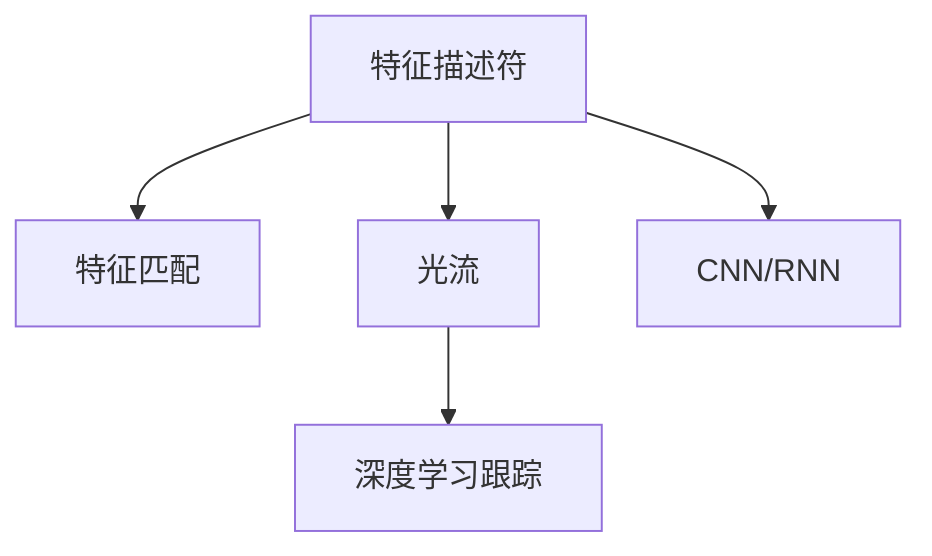

                 

# OpenCV 目标跟踪：在视频中跟踪对象

> 关键词：OpenCV, 目标跟踪, 视频分析, 机器学习, 图像处理, 计算机视觉

## 1. 背景介绍

### 1.1 问题由来
目标跟踪是计算机视觉领域的一项重要任务，它通过在连续视频帧中对特定对象进行定位，实现对动态场景中目标的持续跟踪。传统目标跟踪方法依赖于人工设计特征和模型，对于复杂背景、遮挡、光照变化等情况的适应性较差。随着深度学习的发展，基于深度神经网络的端到端目标跟踪方法逐步崛起，并取得了优异的效果。

OpenCV作为广泛使用的计算机视觉库，提供了丰富的目标跟踪工具，包括基于传统方法的跟踪器和基于深度学习的跟踪器。本文将系统介绍基于OpenCV的目标跟踪技术，包括传统方法和深度学习方法，并对比其优缺点。

### 1.2 问题核心关键点
OpenCV的目标跟踪方法主要分为两类：基于特征的方法和基于深度学习的方法。

- 基于特征的方法：依赖于人工设计的特征描述符，如SIFT、SURF、HOG等，在帧间匹配过程中使用特征匹配算法（如SIFT特征匹配）和光流法（如Lucas-Kanade光流法）来计算目标位置。
- 基于深度学习的方法：使用卷积神经网络（CNN）或循环神经网络（RNN）等深度学习模型，对视频帧进行特征提取和目标定位，可以自动学习目标的外观和运动特征。

这些方法在处理不同场景时各具优势，但均面临着背景干扰、目标遮挡、运动模糊等问题。

## 2. 核心概念与联系

### 2.1 核心概念概述

为更好地理解OpenCV的目标跟踪方法，本节将介绍几个关键概念：

- 特征描述符(Feature Descriptor)：用于从图像中提取具有区分度的视觉特征，如SIFT、SURF、HOG等。
- 特征匹配(Feature Matching)：在两幅图像间寻找相似特征点，实现目标的定位。
- 光流(Optical Flow)：描述场景中像素点的运动轨迹，常用于视频帧间的目标跟踪。
- 卷积神经网络(Convolutional Neural Network, CNN)：一种前馈神经网络，广泛用于图像分类、目标检测等计算机视觉任务。
- 循环神经网络(Recurrent Neural Network, RNN)：一种时序模型，常用于视频帧间的时间序列预测。

这些概念之间的逻辑关系可以通过以下Mermaid流程图来展示：



这个流程图展示了几类目标跟踪方法的核心步骤：

1. 特征描述符用于提取图像特征。
2. 特征匹配用于计算两幅图像间的相似度，实现目标定位。
3. 光流用于描述像素点的运动轨迹。
4. CNN和RNN用于提取高层次特征，实现目标的端到端跟踪。

这些核心概念共同构成了OpenCV目标跟踪的基础理论，帮助开发者更好地理解和使用OpenCV的目标跟踪工具。

## 3. 核心算法原理 & 具体操作步骤

### 3.1 算法原理概述

基于OpenCV的目标跟踪方法可以分为传统方法和深度学习方法。

#### 3.1.1 传统方法

传统目标跟踪方法依赖于特征描述符和特征匹配技术。首先，使用特征描述符在初始帧中提取目标特征。然后，在后续帧中，使用特征匹配算法计算特征点的位置变化，实现目标的跟踪。常用的特征匹配算法包括SIFT、SURF、HOG+LBP等。

#### 3.1.2 深度学习方法

深度学习方法使用神经网络模型对视频帧进行特征提取和目标定位。常用的深度学习模型包括CNN、RNN等。首先，使用CNN对帧中所有像素点进行特征提取，得到高层次的特征表示。然后，使用RNN等模型对时间序列的特征进行预测，得到目标的位移和尺度变换，实现端到端的跟踪。

### 3.2 算法步骤详解

#### 3.2.1 传统方法的具体步骤

1. **特征提取**：使用特征描述符在初始帧中提取目标特征点。
2. **特征匹配**：在后续帧中，使用特征匹配算法寻找相似特征点。
3. **目标定位**：根据匹配点的位置变化，计算目标的位移和尺度变化。

以SIFT特征匹配为例，具体步骤如下：

- **特征点检测**：使用SIFT算法在初始帧中检测并提取特征点。
- **特征描述**：对每个特征点进行尺度空间极值筛选和方向分配，生成SIFT特征描述符。
- **特征匹配**：在后续帧中，使用FLANN等算法计算特征点之间的相似度，找到匹配点。
- **目标定位**：根据匹配点的位移，计算目标的位移和尺度变化。

#### 3.2.2 深度学习方法的具体步骤

1. **特征提取**：使用CNN对视频帧进行特征提取，得到高层次的特征表示。
2. **目标定位**：使用RNN等模型对时间序列的特征进行预测，得到目标的位移和尺度变换。

以DeepSORT为例，具体步骤如下：

- **特征提取**：使用CNN对视频帧中的所有像素点进行特征提取，得到高层次的特征表示。
- **目标关联**：使用匈牙利算法进行目标关联，将不同帧中的特征点关联起来。
- **目标跟踪**：使用RNN等模型对时间序列的特征进行预测，得到目标的位移和尺度变化。

### 3.3 算法优缺点

#### 3.3.1 传统方法的优缺点

**优点**：
- 方法简单易懂，计算量小，适用于实时应用。
- 能够处理部分遮挡、光照变化等复杂情况。

**缺点**：
- 依赖于人工设计的特征描述符，需要手动设计。
- 对背景变化、视角变化等场景适应性较差。
- 计算复杂度较高，不适合大规模视频分析。

#### 3.3.2 深度学习方法的优缺点

**优点**：
- 能够自动学习目标的外观和运动特征，适应性强。
- 端到端训练，减少手动设计的工作量。
- 适用于大规模视频分析，计算效率高。

**缺点**：
- 需要大量标注数据进行训练，计算资源需求高。
- 对大范围背景变化、视角变化等复杂情况适应性较差。
- 训练复杂度较高，调试和调参困难。

## 4. 数学模型和公式 & 详细讲解 & 举例说明

### 4.1 数学模型构建

#### 4.1.1 传统方法

以SIFT特征匹配为例，假设在初始帧中检测到特征点 $p_0$，后续帧中检测到特征点 $p_t$，则目标的位移可以通过以下公式计算：

$$
\Delta \vec{x} = p_t - p_0
$$

其中，$\Delta \vec{x}$ 表示目标的位移向量。

#### 4.1.2 深度学习方法

以DeepSORT为例，假设在第 $t$ 帧中，目标 $i$ 的位置为 $\vec{x}_i^t$，在第 $t-1$ 帧中，目标 $i$ 的位置为 $\vec{x}_i^{t-1}$，则目标的位移可以通过以下公式计算：

$$
\Delta \vec{x}_i = \vec{x}_i^t - \vec{x}_i^{t-1}
$$

### 4.2 公式推导过程

#### 4.2.1 传统方法

以SIFT特征匹配为例，推导目标位移的计算公式：

- **特征点检测**：使用SIFT算法在初始帧中检测并提取特征点。
- **特征描述**：对每个特征点进行尺度空间极值筛选和方向分配，生成SIFT特征描述符。
- **特征匹配**：在后续帧中，使用FLANN等算法计算特征点之间的相似度，找到匹配点。
- **目标定位**：根据匹配点的位移，计算目标的位移和尺度变化。

具体推导过程如下：

- **特征点检测**：
$$
p_0 = \{p_{0_1}, p_{0_2}, ..., p_{0_n}\}
$$
- **特征描述**：
$$
\vec{d} = \{d_{0_1}, d_{0_2}, ..., d_{0_n}\}
$$
- **特征匹配**：
$$
p_t = \{p_{t_1}, p_{t_2}, ..., p_{t_n}\}
$$
- **目标定位**：
$$
\Delta \vec{x} = \{\Delta \vec{x}_1, \Delta \vec{x}_2, ..., \Delta \vec{x}_n\}
$$

#### 4.2.2 深度学习方法

以DeepSORT为例，推导目标位移的计算公式：

- **特征提取**：使用CNN对视频帧中的所有像素点进行特征提取，得到高层次的特征表示。
- **目标关联**：使用匈牙利算法进行目标关联，将不同帧中的特征点关联起来。
- **目标跟踪**：使用RNN等模型对时间序列的特征进行预测，得到目标的位移和尺度变化。

具体推导过程如下：

- **特征提取**：
$$
\vec{f} = \{f_1, f_2, ..., f_n\}
$$
- **目标关联**：
$$
M = \{m_{i,j}\}
$$
- **目标跟踪**：
$$
\Delta \vec{x} = \{\Delta \vec{x}_1, \Delta \vec{x}_2, ..., \Delta \vec{x}_n\}
$$

### 4.3 案例分析与讲解

以SIFT特征匹配为例，分析其优缺点。

**优点**：
- 方法简单易懂，计算量小，适用于实时应用。
- 能够处理部分遮挡、光照变化等复杂情况。

**缺点**：
- 依赖于人工设计的特征描述符，需要手动设计。
- 对背景变化、视角变化等场景适应性较差。
- 计算复杂度较高，不适合大规模视频分析。

以DeepSORT为例，分析其优缺点。

**优点**：
- 能够自动学习目标的外观和运动特征，适应性强。
- 端到端训练，减少手动设计的工作量。
- 适用于大规模视频分析，计算效率高。

**缺点**：
- 需要大量标注数据进行训练，计算资源需求高。
- 对大范围背景变化、视角变化等复杂情况适应性较差。
- 训练复杂度较高，调试和调参困难。

## 5. 项目实践：代码实例和详细解释说明

### 5.1 开发环境搭建

在进行目标跟踪实践前，我们需要准备好开发环境。以下是使用Python进行OpenCV开发的环境配置流程：

1. 安装Anaconda：从官网下载并安装Anaconda，用于创建独立的Python环境。

2. 创建并激活虚拟环境：
```bash
conda create -n opencv-env python=3.8 
conda activate opencv-env
```

3. 安装OpenCV：根据CUDA版本，从官网获取对应的安装命令。例如：
```bash
conda install opencv opencv-contrib -c conda-forge
```

4. 安装各类工具包：
```bash
pip install numpy pandas scikit-learn matplotlib tqdm jupyter notebook ipython
```

完成上述步骤后，即可在`opencv-env`环境中开始目标跟踪实践。

### 5.2 源代码详细实现

下面以SIFT特征匹配为例，给出使用OpenCV进行目标跟踪的Python代码实现。

```python
import cv2
import numpy as np
import matplotlib.pyplot as plt

# 读取视频
cap = cv2.VideoCapture('path/to/video.mp4')

# 读取初始帧
ret, frame = cap.read()
gray = cv2.cvtColor(frame, cv2.COLOR_BGR2GRAY)
sift = cv2.SIFT_create()
keypoints, descriptors = sift.detectAndCompute(gray, None)

# 初始化可视化窗口
plt.figure(figsize=(10, 10))
plt.axis('off')

# 循环处理视频帧
while cap.isOpened():
    # 读取下一帧
    ret, frame = cap.read()
    if not ret:
        break

    # 转换为灰度图
    gray = cv2.cvtColor(frame, cv2.COLOR_BGR2GRAY)

    # 特征点检测和匹配
    keypoints, descriptors = sift.detectAndCompute(gray, None)
    bf = cv2.BFMatcher(cv2.NORM_L2, crossCheck=True)
    matches = bf.match(descriptors, descriptors)

    # 根据匹配点计算目标位置
    matches = sorted(matches, key=lambda x: x.distance)
    good_matches = matches[:len(matches)//2]
    src_pts = np.float32([keypoints[m.queryIdx].pt for m in good_matches]).reshape(-1, 1, 2)
    dst_pts = np.float32([keypoints[m.trainIdx].pt for m in good_matches]).reshape(-1, 1, 2)
    M, mask = cv2.findHomography(src_pts, dst_pts, cv2.RANSAC, 5.0)

    # 绘制匹配点
    img = cv2.warpPerspective(frame, M, (frame.shape[1], frame.shape[0]))
    for match in good_matches:
        img = cv2.drawMatches(frame, keypoints, img, keypoints, match, None)

    # 显示结果
    plt.imshow(img)
    plt.draw()
    plt.pause(0.1)
    plt.clf()

cap.release()
plt.close()
```

这段代码实现了基于SIFT特征匹配的目标跟踪。代码中首先读取视频文件，然后对初始帧进行SIFT特征提取和描述，在后续帧中使用BFMatcher进行特征匹配，根据匹配点计算目标位置，并使用透视变换重构目标位置，最终可视化匹配点和重构后的目标位置。

### 5.3 代码解读与分析

让我们再详细解读一下关键代码的实现细节：

**SIFT特征提取**：
- 使用SIFT算法在初始帧中检测并提取特征点。
- 使用SIFT算法生成特征描述符。

**特征匹配**：
- 使用BFMatcher算法计算特征点之间的相似度，找到匹配点。
- 对匹配结果进行筛选，保留最佳的匹配点。

**目标定位**：
- 根据匹配点的位移，计算目标的位移和尺度变化。
- 使用透视变换重构目标位置。

**可视化结果**：
- 可视化匹配点。
- 可视化重构后的目标位置。

通过代码实现，我们可以更加深入地理解OpenCV的目标跟踪算法。在实际应用中，还可以使用其他深度学习算法，如DeepSORT、MedianFlow等，对目标进行跟踪。

## 6. 实际应用场景

### 6.1 自动驾驶

自动驾驶系统需要实时监控交通场景中的动态对象，如行人、车辆等，以确保行车安全。基于OpenCV的目标跟踪算法可以实时检测和跟踪这些对象，为自动驾驶提供关键的数据支持。

具体应用中，可以结合深度学习算法，如DeepSORT，对行人、车辆进行精准跟踪。通过实时跟踪目标的位置和速度，自动驾驶系统可以提前做出反应，避免交通事故的发生。

### 6.2 智能监控

智能监控系统需要实时监控视频流中的目标对象，如入侵者、异常行为等，并及时报警。基于OpenCV的目标跟踪算法可以实时检测和跟踪这些对象，提高监控系统的准确性和响应速度。

具体应用中，可以结合深度学习算法，如DeepSORT，对目标进行精准跟踪。通过实时跟踪目标的位置和行为，智能监控系统可以及时发现异常行为，如闯入、破坏等，保障公共安全。

### 6.3 运动分析

运动分析是体育赛事、娱乐表演等活动中的重要应用。基于OpenCV的目标跟踪算法可以实时检测和跟踪运动对象，如运动员、角色等，并进行行为分析和评价。

具体应用中，可以结合深度学习算法，如DeepSORT，对目标进行精准跟踪。通过实时跟踪目标的位置和行为，运动分析系统可以生成详细的行为数据和分析报告，为赛事组织和表演编排提供参考。

### 6.4 未来应用展望

随着目标跟踪技术的不断发展，未来的应用场景将更加广泛和深入。

- 智能家居：智能家居系统可以通过实时跟踪家庭成员的位置，提高家居安全和舒适度。
- 工业自动化：工业自动化系统可以通过实时跟踪机器人的位置，提高生产效率和安全性。
- 医疗影像：医疗影像系统可以通过实时跟踪病患的位置，提高诊断和治疗的准确性和效率。
- 农业监控：农业监控系统可以通过实时跟踪动植物的位置，提高农作物的产量和质量。
- 城市交通：城市交通系统可以通过实时跟踪车辆和行人的位置，提高交通管理和调度效率。

## 7. 工具和资源推荐

### 7.1 学习资源推荐

为了帮助开发者系统掌握OpenCV的目标跟踪技术，这里推荐一些优质的学习资源：

1. OpenCV官方文档：提供了丰富的目标跟踪工具和API接口，是学习OpenCV目标跟踪的必备资料。

2. 《OpenCV计算机视觉编程》书籍：详细介绍了OpenCV库的使用方法，包括目标跟踪在内的多项计算机视觉任务。

3. 《深度学习目标跟踪》课程：由斯坦福大学开设，涵盖了传统方法和深度学习方法的详细介绍。

4. DeepSORT论文和代码：DeepSORT作为当前最先进的目标跟踪算法，提供了详细的论文和代码实现，是学习目标跟踪的宝贵资源。

通过对这些资源的学习实践，相信你一定能够快速掌握OpenCV的目标跟踪技术，并用于解决实际的计算机视觉问题。

### 7.2 开发工具推荐

高效的开发离不开优秀的工具支持。以下是几款用于OpenCV目标跟踪开发的常用工具：

1. OpenCV：广泛使用的计算机视觉库，提供了丰富的目标跟踪工具和API接口。

2. Python：简单易学的编程语言，适合快速迭代研究。

3. Jupyter Notebook：交互式开发环境，支持代码编写和可视化展示。

4. Visual Studio Code：流行的开发工具，支持代码自动补全、调试等功能。

5. Git/Github：版本控制工具，方便代码管理和团队协作。

合理利用这些工具，可以显著提升OpenCV目标跟踪任务的开发效率，加快创新迭代的步伐。

### 7.3 相关论文推荐

OpenCV的目标跟踪方法主要分为两类：基于特征的方法和基于深度学习的方法。

1. **基于特征的方法**：
   - SIFT特征匹配算法：论文《A Theory of Interest Grouping using Scale-Invariant Features》提出了SIFT算法，详细描述了特征点的检测和匹配过程。

2. **基于深度学习的方法**：
   - DeepSORT算法：论文《Deep Single Image Multi-Person Tracking using Pixel-Level Tracking》提出了DeepSORT算法，详细描述了目标关联和跟踪的过程。

这些论文代表了OpenCV目标跟踪技术的发展脉络，通过学习这些前沿成果，可以帮助研究者把握学科前进方向，激发更多的创新灵感。

## 8. 总结：未来发展趋势与挑战

### 8.1 总结

本文对基于OpenCV的目标跟踪方法进行了全面系统的介绍。首先阐述了目标跟踪的基本概念和原理，明确了OpenCV在目标跟踪中的重要作用。其次，从原理到实践，详细讲解了基于OpenCV的目标跟踪算法，包括传统方法和深度学习方法，并对比其优缺点。最后，探讨了目标跟踪在实际应用中的广泛场景，并提出了未来发展趋势和挑战。

通过本文的系统梳理，可以看到，基于OpenCV的目标跟踪技术已经在多个领域得到应用，且随着深度学习的发展，其性能和应用范围将不断拓展。未来，OpenCV的目标跟踪方法也将进一步融入多模态、多任务的计算机视觉框架中，为人工智能技术的落地应用提供新的突破口。

### 8.2 未来发展趋势

展望未来，OpenCV的目标跟踪技术将呈现以下几个发展趋势：

1. **深度学习方法的普及**：基于深度学习的方法将逐步取代传统方法，成为目标跟踪的主流。

2. **多模态融合**：目标跟踪将与图像、语音、运动等多种模态数据结合，实现更全面的场景理解和分析。

3. **实时性优化**：通过硬件加速和算法优化，提高目标跟踪的实时性，满足实时应用需求。

4. **跨平台支持**：目标跟踪将跨平台运行，支持移动设备、嵌入式系统等多种应用场景。

5. **隐私保护**：目标跟踪将引入隐私保护机制，确保用户数据的安全和隐私。

6. **自动化调参**：通过自动化调参技术，减少人工干预，提高目标跟踪的效率和精度。

### 8.3 面临的挑战

尽管OpenCV的目标跟踪技术已经取得了一定的进展，但在迈向更加智能化、普适化应用的过程中，仍面临着诸多挑战：

1. **计算资源需求高**：深度学习方法的计算资源需求较高，如何降低计算成本是亟待解决的问题。

2. **算法鲁棒性不足**：目标跟踪算法在面对复杂场景时，容易发生漂移和丢失，如何提高鲁棒性是未来的研究方向。

3. **数据获取困难**：目标跟踪需要大量标注数据进行训练，数据获取困难是制约技术发展的瓶颈。

4. **模型可解释性不足**：目标跟踪模型往往缺乏可解释性，难以理解其内部工作机制和决策逻辑。

5. **隐私保护问题**：目标跟踪涉及用户隐私，如何保护用户隐私是必须面对的问题。

### 8.4 研究展望

面对OpenCV目标跟踪技术所面临的挑战，未来的研究需要在以下几个方面寻求新的突破：

1. **轻量化模型**：开发轻量化模型，减少计算资源需求，提高实时性。

2. **鲁棒性优化**：改进目标跟踪算法，提高鲁棒性和稳定性。

3. **数据增强技术**：开发数据增强技术，解决数据获取困难问题。

4. **可解释性增强**：引入可解释性技术，增强模型的透明度和可理解性。

5. **隐私保护机制**：引入隐私保护机制，确保用户数据的安全和隐私。

这些研究方向的探索，必将引领OpenCV目标跟踪技术迈向更高的台阶，为计算机视觉技术的发展和应用提供新的动力。总之，OpenCV目标跟踪技术需要在算法、数据、计算等多个维度协同发力，方能实现更大规模的落地应用。

## 9. 附录：常见问题与解答

**Q1：OpenCV的目标跟踪方法有哪些？**

A: OpenCV的目标跟踪方法主要分为两类：基于特征的方法和基于深度学习的方法。

- **基于特征的方法**：依赖于人工设计的特征描述符，如SIFT、SURF、HOG等。
- **基于深度学习的方法**：使用卷积神经网络（CNN）或循环神经网络（RNN）等深度学习模型，对视频帧进行特征提取和目标定位。

**Q2：如何选择OpenCV的目标跟踪器？**

A: 选择OpenCV的目标跟踪器，需要考虑以下因素：

- **数据分布**：如果目标在背景中较为突出，可以考虑使用基于特征的方法，如SIFT、SURF等。
- **计算资源**：如果计算资源充足，可以使用基于深度学习的方法，如DeepSORT、MedianFlow等。
- **实时性需求**：如果对实时性有较高要求，可以使用轻量化模型，如Fast R-CNN等。

**Q3：目标跟踪的常见问题有哪些？**

A: 目标跟踪的常见问题包括：

- **目标遮挡**：目标在视频帧中部分遮挡，跟踪器容易失效。
- **背景干扰**：背景变化、光照变化等干扰因素影响跟踪效果。
- **运动模糊**：目标运动模糊导致跟踪器无法准确定位。
- **目标消失**：目标长时间未出现在帧中，导致跟踪器失效。

这些问题是目标跟踪中常见的难点，需要针对具体情况进行优化和解决。

**Q4：如何在视频中实现目标跟踪？**

A: 在视频中实现目标跟踪，一般按照以下步骤进行：

1. **特征提取**：使用OpenCV的特征提取算法，如SIFT、SURF等，提取初始帧的目标特征。
2. **特征匹配**：在后续帧中，使用OpenCV的特征匹配算法，如BFMatcher，计算特征点之间的相似度，找到匹配点。
3. **目标定位**：根据匹配点的位移，计算目标的位移和尺度变化，使用透视变换重构目标位置。
4. **可视化结果**：可视化匹配点，并绘制重构后的目标位置。

通过以上步骤，可以实现基于OpenCV的目标跟踪。

**Q5：OpenCV的目标跟踪算法有哪些优化方法？**

A: OpenCV的目标跟踪算法可以通过以下方法进行优化：

1. **多帧融合**：使用多帧数据进行特征提取和匹配，提高跟踪的鲁棒性。
2. **运动模型**：引入运动模型，如背景差分、光流法等，提高跟踪的精度和稳定性。
3. **目标关联**：使用目标关联算法，如匈牙利算法、Kalman滤波器等，提高目标跟踪的准确性。
4. **参数优化**：调整算法参数，如学习率、正则化系数等，提高跟踪效果。

这些优化方法可以提高OpenCV目标跟踪算法的性能和稳定性，适用于不同的应用场景。

---

作者：禅与计算机程序设计艺术 / Zen and the Art of Computer Programming

