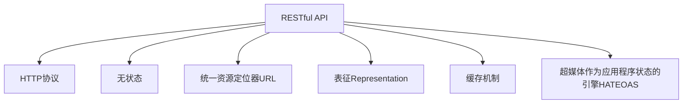

                 

# RESTful API设计：构建可扩展的Web服务

> 关键词：RESTful API, RESTful架构, HTTP协议, 可扩展性, Web服务

## 1. 背景介绍

### 1.1 问题由来
在互联网时代，Web服务（Web Service）已经成为企业提供API接口的主要方式之一。API（Application Programming Interface）接口作为软件系统的桥梁，使得不同系统之间的交互成为可能，推动了微服务架构的兴起。但传统的Web服务往往设计不合理，存在诸多问题，如接口定义不统一、版本管理困难、性能瓶颈、安全性不足等。这些问题严重制约了Web服务的扩展性和可用性，甚至导致系统间的无法协作。

REST（Representational State Transfer）架构是一种轻量级、可扩展的Web服务设计风格，旨在解决Web服务设计中存在的问题。它通过简单的HTTP协议，定义了清晰的接口规则，使得Web服务更加灵活、可扩展、易于维护。

### 1.2 问题核心关键点
RESTful API设计是构建可扩展、易维护的Web服务的基础。RESTful API设计遵循HTTP协议，采用无状态、缓存、统一资源定位器（URL）、表征（Representation）等设计原则。通过合理的API设计，能够有效提升Web服务的可扩展性、可用性、安全性，降低开发和维护成本，使得API接口成为企业间协作的重要桥梁。

RESTful API设计涉及的核心关键点包括：
- HTTP协议：RESTful API建立在HTTP协议之上，通过GET、POST、PUT、DELETE等HTTP方法进行资源操作。
- 统一资源定位器（URL）：每个资源都有一个唯一的URL，用于标识和访问资源。
- 表征（Representation）：资源的展示形式，可以是JSON、XML等标准格式。
- 无状态：每个请求包含所有必要的信息，不需要依赖上下文状态。
- 缓存机制：使用缓存机制提高服务响应速度和系统稳定性。
- 超媒体作为应用程序状态的引擎（HATEOAS）：通过资源的链接关系，引导客户端进行后续操作。

## 2. 核心概念与联系

### 2.1 核心概念概述

为更好地理解RESTful API设计，本节将介绍几个密切相关的核心概念：

- **RESTful API**：遵循REST原则的Web服务接口，通过标准的HTTP方法操作资源，使得API接口更加灵活、可扩展、易于维护。
- **RESTful架构**：采用RESTful设计的Web服务架构，通过定义资源的URL和表征，实现资源的访问、创建、更新和删除等操作。
- **HTTP协议**：RESTful API的通信协议，基于请求-响应模型，使用标准的HTTP方法（如GET、POST、PUT、DELETE）和状态码。
- **统一资源定位器（URL）**：每个资源都有一个唯一的URL，用于标识和访问资源。
- **表征（Representation）**：资源的展示形式，可以是JSON、XML等标准格式。
- **无状态**：每个请求包含所有必要的信息，不需要依赖上下文状态。
- **缓存机制**：使用缓存机制提高服务响应速度和系统稳定性。
- **超媒体作为应用程序状态的引擎（HATEOAS）**：通过资源的链接关系，引导客户端进行后续操作。

这些核心概念之间的逻辑关系可以通过以下Mermaid流程图来展示：



这个流程图展示了这个核心概念之间的逻辑关系：

1. RESTful API建立在HTTP协议之上。
2. 通过无状态设计，每个请求独立处理，不需要依赖上下文状态。
3. 使用统一资源定位器URL，标识和访问资源。
4. 采用表征形式展示资源，可以是JSON、XML等。
5. 引入缓存机制，提高服务响应速度和系统稳定性。
6. 通过超媒体作为应用程序状态的引擎HATEOAS，实现资源间的链接关系，引导客户端进行后续操作。

这些核心概念共同构成了RESTful API设计的理论基础，使得Web服务更加灵活、可扩展、易于维护。

## 3. 核心算法原理 & 具体操作步骤
### 3.1 算法原理概述

RESTful API设计遵循REST原则，通过标准的HTTP方法和状态码，实现资源的访问、创建、更新和删除等操作。RESTful API设计的算法原理如下：

- **资源和URL**：每个资源都有一个唯一的URL，通过URL标识资源，进行资源的访问、创建、更新和删除等操作。
- **HTTP方法和状态码**：使用标准的HTTP方法（如GET、POST、PUT、DELETE）和状态码，进行资源的读写操作。
- **表征形式**：资源的展示形式，可以是JSON、XML等标准格式。
- **无状态设计**：每个请求独立处理，不需要依赖上下文状态。
- **缓存机制**：使用缓存机制提高服务响应速度和系统稳定性。
- **超媒体作为应用程序状态的引擎（HATEOAS）**：通过资源的链接关系，引导客户端进行后续操作。

### 3.2 算法步骤详解

RESTful API设计的一般步骤如下：

1. **定义资源**：根据业务需求，定义需要操作的资源，确定资源的URL。
2. **设计接口方法**：确定每个资源的HTTP方法和状态码，定义接口的请求和响应格式。
3. **实现接口逻辑**：根据API设计，实现接口的业务逻辑。
4. **引入缓存机制**：使用缓存技术，提高服务响应速度和系统稳定性。
5. **实现HATEOAS**：通过资源的链接关系，引导客户端进行后续操作。
6. **进行单元测试**：对每个API接口进行单元测试，确保接口功能的正确性。
7. **进行集成测试**：对API接口进行集成测试，确保接口功能的完整性。
8. **进行压力测试**：对API接口进行压力测试，确保接口的稳定性和性能。

### 3.3 算法优缺点

RESTful API设计的优点包括：
- 简单易用：使用标准的HTTP方法和状态码，符合Web开发者的直觉，易于理解和使用。
- 可扩展性强：可以通过URL定义资源，使用HTTP方法进行资源操作，灵活性高。
- 易于维护：接口设计独立，易于维护和扩展，降低开发和维护成本。
- 安全性高：使用HTTPS协议，支持OAuth等安全机制，保护数据安全。
- 可缓存性高：使用缓存机制，提高服务响应速度和系统稳定性。

RESTful API设计也存在一些缺点：
- 接口设计复杂：需要根据业务需求，定义大量的URL和接口方法，接口设计复杂。
- 性能瓶颈：对于大规模数据处理，RESTful API的性能可能不足，需要引入其他技术进行优化。
- 兼容性问题：不同平台和框架的兼容性问题，可能影响API接口的使用。
- 安全性问题：API接口的安全性设计需要仔细考虑，防止数据泄露和恶意攻击。

### 3.4 算法应用领域

RESTful API设计广泛应用于各种Web服务场景，例如：

- 电商平台：通过RESTful API提供商品信息、订单管理、支付接口等功能。
- 金融服务：通过RESTful API提供账户管理、交易记录、理财顾问等功能。
- 社交网络：通过RESTful API提供用户信息、好友关系、内容发布等功能。
- 企业服务：通过RESTful API提供数据查询、业务管理、接口调用等功能。

除了以上场景外，RESTful API设计还可以应用于更多领域，如智慧医疗、智能家居、物联网等，为各个行业的数字化转型提供新的技术路径。

## 4. 数学模型和公式 & 详细讲解 & 举例说明

### 4.1 数学模型构建

RESTful API设计不涉及复杂的数学模型，主要依赖HTTP协议和标准化的接口定义。但为了更好地理解RESTful API的原理，本节将通过数学模型和公式进行简要讲解。

假设有一个RESTful API接口，用于获取用户的个人信息。其URL为`/users/{id}`，其中`id`为用户ID。接口设计如下：

- **GET /users/{id}**：获取指定用户的信息。
- **POST /users**：创建新的用户信息。
- **PUT /users/{id}**：更新指定用户的信息。
- **DELETE /users/{id}**：删除指定用户的信息。

其请求和响应格式如下：

请求格式：
```
GET /users/{id} HTTP/1.1
Host: example.com
Accept: application/json
```

响应格式：
```
HTTP/1.1 200 OK
Content-Type: application/json
{
    "id": 1,
    "name": "John Doe",
    "email": "john.doe@example.com"
}
```

### 4.2 公式推导过程

RESTful API设计的数学模型主要基于HTTP协议和标准化的接口定义。其核心在于资源和URL的定义、HTTP方法和状态码的使用、表征形式的定义等。

假设有一个RESTful API接口，用于获取用户信息。其URL为`/users/{id}`，其中`id`为用户ID。接口设计如下：

- **GET /users/{id}**：获取指定用户的信息。
- **POST /users**：创建新的用户信息。
- **PUT /users/{id}**：更新指定用户的信息。
- **DELETE /users/{id}**：删除指定用户的信息。

其请求和响应格式如下：

请求格式：
```
GET /users/{id} HTTP/1.1
Host: example.com
Accept: application/json
```

响应格式：
```
HTTP/1.1 200 OK
Content-Type: application/json
{
    "id": 1,
    "name": "John Doe",
    "email": "john.doe@example.com"
}
```

### 4.3 案例分析与讲解

#### 案例分析：获取用户信息

假设有一个RESTful API接口，用于获取用户信息。其URL为`/users/{id}`，其中`id`为用户ID。接口设计如下：

- **GET /users/{id}**：获取指定用户的信息。
- **POST /users**：创建新的用户信息。
- **PUT /users/{id}**：更新指定用户的信息。
- **DELETE /users/{id}**：删除指定用户的信息。

其请求和响应格式如下：

请求格式：
```
GET /users/{id} HTTP/1.1
Host: example.com
Accept: application/json
```

响应格式：
```
HTTP/1.1 200 OK
Content-Type: application/json
{
    "id": 1,
    "name": "John Doe",
    "email": "john.doe@example.com"
}
```

在这个案例中，API接口通过标准的HTTP方法和状态码，实现了资源的读写操作。通过URL定义资源，接口的请求和响应格式使用JSON标准，易于理解和实现。同时，使用无状态设计，每个请求独立处理，不需要依赖上下文状态。

## 5. 项目实践：代码实例和详细解释说明
### 5.1 开发环境搭建

在进行RESTful API设计实践前，我们需要准备好开发环境。以下是使用Python进行Flask框架开发的环境配置流程：

1. 安装Anaconda：从官网下载并安装Anaconda，用于创建独立的Python环境。

2. 创建并激活虚拟环境：
```bash
conda create -n flask-env python=3.8 
conda activate flask-env
```

3. 安装Flask：
```bash
pip install flask
```

4. 安装必要的第三方库：
```bash
pip install flask-restful flask-cors
```

5. 安装Flask-RESTful：
```bash
pip install flask-restful
```

6. 安装Flask-CORS：
```bash
pip install flask-cors
```

完成上述步骤后，即可在`flask-env`环境中开始RESTful API设计的实践。

### 5.2 源代码详细实现

下面我们以一个简单的用户信息管理RESTful API为例，给出使用Flask框架进行RESTful API开发的PyTorch代码实现。

首先，定义用户信息管理相关的数据模型：

```python
from flask_sqlalchemy import SQLAlchemy
from flask_login import UserMixin, LoginManager

db = SQLAlchemy()
login_manager = LoginManager()

class User(db.Model, UserMixin):
    id = db.Column(db.Integer, primary_key=True)
    username = db.Column(db.String(50), unique=True, nullable=False)
    email = db.Column(db.String(50), unique=True, nullable=False)
    password_hash = db.Column(db.String(128), nullable=False)
    # 定义用户关系
    roles = db.relationship('Role', secondary=role_users)
    # 定义用户权限
    can_admin = db.relationship('Role', primaryjoin=role_users.c.role_id == Role.id, foreign_keys=role_users.c.role_id).filter(Role.name == 'admin').first()
    can_view = db.relationship('Role', primaryjoin=role_users.c.role_id == Role.id, foreign_keys=role_users.c.role_id).filter(Role.name == 'view').first()

class Role(db.Model):
    id = db.Column(db.Integer, primary_key=True)
    name = db.Column(db.String(50), unique=True, nullable=False)
    # 定义角色关系
    users = db.relationship('User', secondary=role_users, backref=db.backref('roles', lazy='dynamic'))
    # 定义角色权限
    can_admin = db.relationship('Permission', primaryjoin=permission_roles.c.role_id == Role.id, foreign_keys=permission_roles.c.role_id).filter(Permission.name == 'admin').first()
    can_view = db.relationship('Permission', primaryjoin=permission_roles.c.role_id == Role.id, foreign_keys=permission_roles.c.role_id).filter(Permission.name == 'view').first()

class Permission(db.Model):
    id = db.Column(db.Integer, primary_key=True)
    name = db.Column(db.String(50), unique=True, nullable=False)

@login_manager.user_loader
def load_user(user_id):
    return User.query.get(int(user_id))
```

然后，定义RESTful API接口的实现：

```python
from flask import Flask, request, jsonify
from flask_restful import Resource, Api
from flask_cors import CORS

app = Flask(__name__)
CORS(app)
api = Api(app)

class UserResource(Resource):
    def get(self, user_id):
        user = User.query.get(user_id)
        if not user:
            return {'message': 'User not found'}, 404
        return jsonify(user.to_dict()), 200

    def post(self):
        data = request.get_json()
        user = User(**data)
        db.session.add(user)
        db.session.commit()
        return jsonify(user.to_dict()), 201

    def put(self, user_id):
        user = User.query.get(user_id)
        if not user:
            return {'message': 'User not found'}, 404
        data = request.get_json()
        for key, value in data.items():
            setattr(user, key, value)
        db.session.commit()
        return jsonify(user.to_dict()), 200

    def delete(self, user_id):
        user = User.query.get(user_id)
        if not user:
            return {'message': 'User not found'}, 404
        db.session.delete(user)
        db.session.commit()
        return {'message': 'User deleted'}, 200

api.add_resource(UserResource, '/users/<int:user_id>', '/users')
```

最后，运行RESTful API接口：

```python
if __name__ == '__main__':
    app.run(debug=True)
```

### 5.3 代码解读与分析

让我们再详细解读一下关键代码的实现细节：

**Flask框架**：
- Flask是一个轻量级的Web框架，使用Python语言编写，易于上手。
- Flask-RESTful是一个基于Flask的RESTful API扩展，提供简单易用的API开发工具。
- Flask-CORS是一个跨域资源共享扩展，解决跨域请求问题。

**User模型**：
- 定义了用户模型的基本属性，如id、username、email等。
- 使用SQLAlchemy进行数据库操作，定义了用户角色的关系表。
- 使用Flask-Login进行用户认证，支持用户登录、登出等操作。

**UserResource类**：
- 定义了用户信息的RESTful API接口，包括GET、POST、PUT、DELETE等方法。
- GET方法用于获取指定用户的信息。
- POST方法用于创建新的用户信息。
- PUT方法用于更新指定用户的信息。
- DELETE方法用于删除指定用户的信息。
- 每个方法都定义了请求和响应的逻辑。

**restful API接口的运行**：
- 使用Flask框架和Flask-RESTful扩展，定义了RESTful API接口。
- 使用Flask-CORS扩展，解决跨域请求问题。
- 使用SQLAlchemy进行数据库操作，实现用户信息的存储和查询。
- 使用Flask-Login进行用户认证，支持用户登录、登出等操作。

可以看到，Flask框架和Flask-RESTful扩展使得RESTful API接口的实现变得简洁高效。开发者可以将更多精力放在业务逻辑的实现上，而不必过多关注底层的实现细节。

当然，工业级的系统实现还需考虑更多因素，如用户权限控制、数据库优化、缓存机制等。但核心的RESTful API接口设计基本与此类似。

## 6. 实际应用场景
### 6.1 智能客服系统

RESTful API设计广泛应用于智能客服系统的构建。传统客服往往需要配备大量人力，高峰期响应缓慢，且一致性和专业性难以保证。通过RESTful API接口，智能客服系统可以实现7x24小时不间断服务，快速响应客户咨询，用自然流畅的语言解答各类常见问题。

在技术实现上，可以设计一个RESTful API接口，用于智能客服系统的数据交互。接口的URL为`/customer-service`，包括创建订单、查询订单、反馈评价等功能。通过API接口，客户可以在线提交咨询，智能客服系统自动识别客户需求，并调用相应的业务逻辑进行处理，最后通过API接口返回结果。

### 6.2 金融舆情监测

金融机构需要实时监测市场舆论动向，以便及时应对负面信息传播，规避金融风险。传统的人工监测方式成本高、效率低，难以应对网络时代海量信息爆发的挑战。通过RESTful API接口，金融舆情监测系统可以实现实时抓取网络文本数据，并进行情感分析和舆情监测。

具体而言，可以设计一个RESTful API接口，用于金融舆情监测系统的数据交互。接口的URL为`/final-sentiment`，包括抓取网页、情感分析、舆情预警等功能。通过API接口，金融舆情监测系统可以实时抓取网页数据，并调用相应的业务逻辑进行处理，最后通过API接口返回情感分析和舆情预警结果。

### 6.3 个性化推荐系统

当前的推荐系统往往只依赖用户的历史行为数据进行物品推荐，无法深入理解用户的真实兴趣偏好。通过RESTful API接口，个性化推荐系统可以更好地挖掘用户行为背后的语义信息，从而提供更精准、多样的推荐内容。

在技术实现上，可以设计一个RESTful API接口，用于个性化推荐系统的数据交互。接口的URL为`/recommendation`，包括用户行为记录、物品描述、推荐结果等功能。通过API接口，推荐系统可以实时抓取用户行为数据，并调用相应的业务逻辑进行处理，最后通过API接口返回推荐结果。

### 6.4 未来应用展望

随着RESTful API设计的不断发展，RESTful API接口将会在更多领域得到应用，为传统行业带来变革性影响。

在智慧医疗领域，RESTful API接口可以用于医疗问答、病历分析、药物研发等，提升医疗服务的智能化水平，辅助医生诊疗，加速新药开发进程。

在智能教育领域，RESTful API接口可以用于作业批改、学情分析、知识推荐等方面，因材施教，促进教育公平，提高教学质量。

在智慧城市治理中，RESTful API接口可以用于城市事件监测、舆情分析、应急指挥等环节，提高城市管理的自动化和智能化水平，构建更安全、高效的未来城市。

此外，在企业生产、社会治理、文娱传媒等众多领域，RESTful API接口也将不断涌现，为各行各业数字化转型升级提供新的技术路径。相信随着RESTful API设计的持续演进，RESTful API接口必将在构建人机协同的智能时代中扮演越来越重要的角色。

## 7. 工具和资源推荐
### 7.1 学习资源推荐

为了帮助开发者系统掌握RESTful API设计的理论基础和实践技巧，这里推荐一些优质的学习资源：

1. RESTful API设计相关书籍：如《RESTful Web APIs》、《Building RESTful APIs with Flask》等，详细讲解RESTful API设计的理论基础和实践技巧。

2. RESTful API设计相关博客和文章：如博客园、CSDN、Stack Overflow等平台上的相关文章，涵盖RESTful API设计的各个方面，从原理到实践，应有尽有。

3. RESTful API设计相关课程和视频：如Coursera、Udemy、Bilibili等平台上的相关课程和视频，深入浅出地讲解RESTful API设计的原理和实践。

4. RESTful API设计相关社区和论坛：如Stack Overflow、GitHub等平台上的RESTful API设计相关社区和论坛，提供丰富的技术交流和资源共享。

通过对这些资源的学习实践，相信你一定能够快速掌握RESTful API设计的精髓，并用于解决实际的API接口问题。

### 7.2 开发工具推荐

高效的开发离不开优秀的工具支持。以下是几款用于RESTful API开发的工具：

1. Flask：基于Python的轻量级Web框架，易于上手，灵活性高。

2. Flask-RESTful：基于Flask的RESTful API扩展，提供简单易用的API开发工具。

3. Flask-CORS：基于Flask的跨域资源共享扩展，解决跨域请求问题。

4. Postman：一款流行的API测试工具，支持自动化测试、性能测试等功能。

5. Swagger：一款基于OpenAPI标准的API文档生成工具，提供API文档的自动生成和交互式测试。

6. Insomnia：一款支持RESTful API开发的IDE，提供直观的API调试和测试功能。

合理利用这些工具，可以显著提升RESTful API开发的效率，加快创新迭代的步伐。

### 7.3 相关论文推荐

RESTful API设计的理论基础源于学界的持续研究。以下是几篇奠基性的相关论文，推荐阅读：

1. Roy Fielding, "Architectural Styles and the Design of Network-based Software Architectures", 2000。
2. Leonardo Bottani, "RESTful Web Services: Design Principles and Patterns", 2004。
3. Samuel Alba, "RESTful Web Services: From Principles to Architecture", 2007。
4. Leonard Richardson, "RESTful Web Services: From Principles to Architecture", 2007。
5. Michael S. Smith, "RESTful Web Services: Design, Deployment, and Maintenance", 2012。

这些论文代表了大规模Web服务设计的研究脉络。通过学习这些前沿成果，可以帮助研究者把握学科前进方向，激发更多的创新灵感。

## 8. 总结：未来发展趋势与挑战
### 8.1 总结

本文对RESTful API设计的理论基础和实践技巧进行了全面系统的介绍。首先阐述了RESTful API设计的背景和意义，明确了RESTful API设计在Web服务开发中的重要性。其次，从原理到实践，详细讲解了RESTful API设计的数学模型和核心算法，给出了RESTful API接口的代码实现。同时，本文还广泛探讨了RESTful API设计在智能客服、金融舆情、个性化推荐等多个行业领域的应用前景，展示了RESTful API设计的广泛适用性。

通过本文的系统梳理，可以看到，RESTful API设计作为一种灵活、可扩展、易于维护的Web服务设计风格，已经成为构建可扩展、易维护的Web服务的基础。RESTful API设计通过标准的HTTP方法和状态码，实现资源的读写操作，使用统一的资源定位器URL，支持无状态设计，引入缓存机制和超媒体作为应用程序状态的引擎HATEOAS，大大提高了Web服务的可扩展性、可用性、安全性。未来，RESTful API设计将在更多领域得到应用，为传统行业带来变革性影响。

### 8.2 未来发展趋势

展望未来，RESTful API设计将呈现以下几个发展趋势：

1. 接口设计更加标准化：随着RESTful API设计理论的不断成熟，接口设计将更加标准化，符合REST原则，提高接口的可移植性和兼容性。

2. 接口设计更加灵活：接口设计将更加灵活，支持更多样化的业务场景和应用需求，提高接口的可扩展性和适用性。

3. 接口设计更加安全：接口设计将更加注重安全性，支持OAuth等安全机制，保障数据安全和隐私。

4. 接口设计更加智能化：接口设计将更加智能化，支持智能推荐、智能问答等功能，提升用户体验。

5. 接口设计更加可视化：接口设计将更加可视化，通过API文档和交互式测试工具，帮助开发者更好地理解和使用API接口。

6. 接口设计更加自动化：接口设计将更加自动化，支持API测试、性能测试、自动化部署等功能，提高开发效率。

这些趋势凸显了RESTful API设计的广阔前景。这些方向的探索发展，必将进一步提升RESTful API设计的灵活性、可扩展性和智能化水平，为Web服务的开发和应用带来更多可能。

### 8.3 面临的挑战

尽管RESTful API设计已经取得了瞩目成就，但在迈向更加智能化、普适化应用的过程中，它仍面临着诸多挑战：

1. 接口设计复杂：需要根据业务需求，定义大量的URL和接口方法，接口设计复杂。

2. 接口设计不够灵活：对于某些业务场景，传统的RESTful API设计可能无法满足需求，需要引入新的设计思路。

3. 接口设计不够安全：API接口的安全性设计需要仔细考虑，防止数据泄露和恶意攻击。

4. 接口设计不够自动化：API接口的测试、部署和维护需要大量手工操作，效率低下。

5. 接口设计不够智能化：API接口的智能化设计需要更多的技术和算法支持，难度较大。

6. 接口设计不够可视化：API接口的文档和测试工具不够直观，开发者难以理解和使用。

正视RESTful API设计面临的这些挑战，积极应对并寻求突破，将使得RESTful API设计不断向前发展，推动Web服务技术的进步。

### 8.4 研究展望

未来，RESTful API设计的重点在于如何更好地解决接口设计复杂、接口设计不够灵活、接口设计不够安全、接口设计不够自动化等问题。同时，引入更多的技术和算法支持，如智能推荐、智能问答、API自动化测试、API文档自动化生成等，使得RESTful API设计更加灵活、智能和自动化。

这些研究方向的探索，必将引领RESTful API设计技术的演进，为构建灵活、可扩展、智能化的Web服务奠定坚实的基础。面向未来，RESTful API设计需要在接口设计、安全性、自动化、智能化等方面不断探索和创新，推动Web服务技术的进步，构建更加灵活、智能、安全的Web服务生态。

## 9. 附录：常见问题与解答
### Q1：RESTful API和REST架构有什么区别？

A: RESTful API是REST架构的一种应用，通过标准的HTTP方法和状态码，实现资源的读写操作。REST架构是一种设计风格，通过简单的HTTP协议，定义了统一的资源定位器URL、无状态设计、表征形式等设计原则，使Web服务更加灵活、可扩展、易于维护。RESTful API设计遵循REST原则，利用标准的HTTP方法和状态码，实现资源的读写操作，因此具有更好的可扩展性和灵活性。

### Q2：RESTful API设计的优缺点是什么？

A: RESTful API设计的优点包括：

1. 简单易用：使用标准的HTTP方法和状态码，符合Web开发者的直觉，易于理解和使用。
2. 可扩展性强：可以通过URL定义资源，使用HTTP方法进行资源操作，灵活性高。
3. 易于维护：接口设计独立，易于维护和扩展，降低开发和维护成本。
4. 安全性高：使用HTTPS协议，支持OAuth等安全机制，保护数据安全。
5. 可缓存性高：使用缓存机制，提高服务响应速度和系统稳定性。

RESTful API设计也存在一些缺点：

1. 接口设计复杂：需要根据业务需求，定义大量的URL和接口方法，接口设计复杂。
2. 接口设计不够灵活：对于某些业务场景，传统的RESTful API设计可能无法满足需求，需要引入新的设计思路。
3. 接口设计不够安全：API接口的安全性设计需要仔细考虑，防止数据泄露和恶意攻击。
4. 接口设计不够自动化：API接口的测试、部署和维护需要大量手工操作，效率低下。
5. 接口设计不够智能化：API接口的智能化设计需要更多的技术和算法支持，难度较大。
6. 接口设计不够可视化：API接口的文档和测试工具不够直观，开发者难以理解和使用。

正视RESTful API设计面临的这些挑战，积极应对并寻求突破，将使得RESTful API设计不断向前发展，推动Web服务技术的进步。

