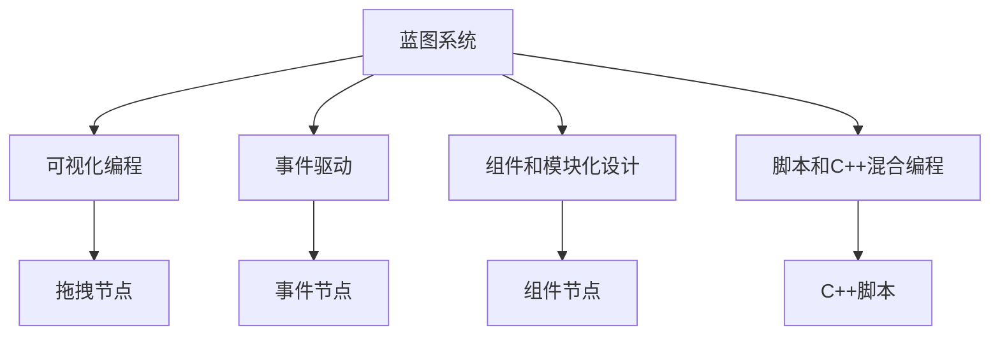

                 

# Unreal Engine 4 蓝图系统：可视化编程

## 1. 背景介绍

随着游戏开发技术不断进步，游戏引擎Unreal Engine 4（UE4）凭借其先进的图形渲染、物理模拟、人工智能等技术，在全球范围内获得了广泛的应用。与此同时，UE4提供的蓝图（Blueprints）系统，作为可视化编程的工具，极大地降低了开发者进入门槛，提高了开发效率，使得更多的非游戏开发者也能轻松上手，快速构建和修改游戏场景。

蓝图系统是UE4提供的图形化编程界面，开发者可以通过拖拽节点来创建逻辑流程、编写函数、连接输入输出等，不需要编写一行代码即可实现复杂的游戏逻辑。本节将对蓝图系统进行深入介绍，并探讨其在UE4中的应用。

## 2. 核心概念与联系

### 2.1 核心概念概述

蓝图系统是基于可视化编程的开发工具，其核心概念主要包括：

- **可视化编程**：通过拖拽节点构建逻辑流程，而不需要编写代码，极大降低了开发难度和门槛。
- **事件驱动**：通过事件系统连接输入和输出，实现程序的控制和响应。
- **组件和模块化设计**：将代码逻辑封装成组件和模块，便于代码复用和扩展。
- **脚本和C++混合编程**：蓝图系统既可以纯可视化编程，也可以混合使用C++进行高级逻辑编写，实现更复杂的任务。

### 2.2 核心概念原理和架构的 Mermaid 流程图



这个流程图展示了蓝图系统各个核心概念之间的逻辑关系：

- 可视化编程：拖拽节点构建逻辑。
- 事件驱动：通过事件节点连接输入输出。
- 组件和模块化设计：将代码逻辑封装成组件。
- 脚本和C++混合编程：纯可视化编程与C++混合使用。

通过这些概念，蓝图系统能够提供一种高效、易用的开发方式，同时保留代码的灵活性和可扩展性。

## 3. 核心算法原理 & 具体操作步骤

### 3.1 算法原理概述

蓝图系统基于事件驱动的编程模型，开发者需要定义事件（Event），然后通过拖拽节点构建逻辑流程。整个逻辑流程可以由多个节点组成，每个节点负责处理特定的功能，如输入、计算、输出等。

蓝图系统的工作原理可以概括为以下几个步骤：

1. 定义事件和节点：开发者通过拖拽节点定义事件和处理逻辑，将逻辑模块化。
2. 连接节点：将节点之间通过输入输出端口进行连接，形成逻辑流程。
3. 执行事件：当事件触发时，蓝图系统按照逻辑流程执行各个节点的功能。

### 3.2 算法步骤详解

蓝图系统的具体操作步骤可以分解为以下几个步骤：

1. **创建蓝图**：
   - 在编辑器中选择创建蓝图，输入蓝图名称并设置蓝图类型。
   - 选择“Component Blueprint”作为蓝图类型，将蓝图附加到编辑器中，形成组件。

2. **拖拽节点**：
   - 在蓝图中，通过拖拽添加各种节点。常用的节点包括变量节点（Var）、执行节点（Exec）、逻辑节点（Logic）等。
   - 节点支持多种类型，如条件、循环、输入输出等，开发者可以根据需要选择合适的节点。

3. **连接端口**：
   - 节点之间通过输入输出端口进行连接。输入端口接收数据，输出端口返回数据。
   - 使用线缆连接节点，确保数据流向正确。

4. **编写脚本**：
   - 对于复杂逻辑，可以通过混合使用C++脚本实现。在蓝图中创建C++函数，调用C++代码进行计算和处理。
   - 开发者可以在C++脚本中实现复杂算法，然后通过蓝图调用。

5. **测试和调试**：
   - 通过测试运行蓝图，检查逻辑是否正确。
   - 使用调试器查看变量值和执行流程，逐步排除问题。

### 3.3 算法优缺点

蓝图系统的主要优点包括：

- **降低开发门槛**：可视化编程大大降低了开发难度，非编程人员也能快速上手。
- **提高开发效率**：拖拽节点和连接线缆比编写代码更快捷，加快了开发进程。
- **模块化设计**：节点和组件可以重复使用，便于代码复用和扩展。
- **灵活性高**：可以通过C++混合编程实现更复杂的任务，保留代码的灵活性和可扩展性。

缺点包括：

- **学习曲线陡峭**：虽然降低了开发门槛，但需要掌握蓝图系统的工作原理和节点使用方法。
- **调试困难**：对于复杂逻辑，调试过程可能比编写代码更困难。
- **性能问题**：部分复杂逻辑可能需要编写C++脚本，性能可能不如纯C++代码。

### 3.4 算法应用领域

蓝图系统主要应用于以下领域：

1. **游戏开发**：蓝图系统是UE4的主要编程工具，广泛应用于游戏开发中的逻辑流程、动画、物理模拟等。
2. **虚拟现实（VR）**：在虚拟现实开发中，蓝图系统能够实现交互式场景和复杂动作，提高用户体验。
3. **医疗和教育**：在医疗和教育领域，蓝图系统可以用来构建虚拟实验室、教学场景等，提高教学效果。
4. **建筑设计**：蓝图系统可以用于建筑设计和虚拟漫游，提供更好的交互体验。
5. **工业仿真**：在工业仿真中，蓝图系统可以用于模拟生产流程、设备操作等，提高生产效率。

## 4. 数学模型和公式 & 详细讲解 & 举例说明

### 4.1 数学模型构建

蓝图系统的工作原理主要依赖于事件驱动和逻辑流程，不需要使用数学模型和公式。但为了更好地理解蓝图系统的内部机制，可以抽象出以下数学模型：

- **事件节点**：每个事件节点可以看作一个函数，输入参数为事件，输出为处理结果。
- **逻辑节点**：逻辑节点根据输入参数计算输出结果，可以看作一系列数学运算。
- **变量节点**：变量节点用于存储数据，可以看作一个变量。

### 4.2 公式推导过程

由于蓝图系统不涉及复杂的数学公式，因此推导过程相对简单。以一个简单的逻辑为例，推导过程如下：

1. 定义事件 `E`：表示玩家按下按钮。
2. 添加逻辑节点 `LN`：判断玩家是否已经进入了某个场景。
3. 添加执行节点 `EN`：当玩家进入场景，执行特定的操作。
4. 连接节点：将事件 `E` 连接到逻辑节点 `LN` 的输入端口，将逻辑节点 `LN` 的输出端口连接到执行节点 `EN` 的输入端口。

这个例子展示了蓝图系统的工作原理：事件触发逻辑判断，根据结果执行特定的操作。

### 4.3 案例分析与讲解

以下通过一个实际案例，展示如何使用蓝图系统实现一个简单的游戏场景：

**场景描述**：

玩家控制角色，需要收集所有指定颜色的方块，并在一定时间内完成。

**实现步骤**：

1. **创建蓝图**：
   - 选择蓝图类型 `Component Blueprint`，附加到编辑器中。
   - 输入蓝图名称 `ColorPickGame`。

2. **拖拽节点**：
   - 添加变量节点，用于存储游戏状态。
   - 添加逻辑节点，判断玩家是否已经收集到所有颜色。
   - 添加执行节点，在玩家收集完所有颜色后触发。

3. **连接端口**：
   - 将变量节点的输出端口连接到逻辑节点的输入端口。
   - 将逻辑节点的输出端口连接到执行节点的输入端口。

4. **编写脚本**：
   - 在C++脚本中实现颜色收集逻辑。
   - 在蓝图脚本中调用C++函数，实现游戏逻辑。

5. **测试和调试**：
   - 测试运行蓝图，检查颜色收集是否正常。
   - 使用调试器查看变量值和执行流程，逐步排除问题。

## 5. 项目实践：代码实例和详细解释说明

### 5.1 开发环境搭建

要在UE4中使用蓝图系统，需要进行以下环境搭建：

1. **安装UE4**：
   - 下载并安装UE4开发工具。
   - 配置好开发环境，包括编辑器、构建工具等。

2. **创建蓝图**：
   - 在编辑器中选择创建蓝图，输入蓝图名称并设置蓝图类型。
   - 选择“Component Blueprint”作为蓝图类型，将蓝图附加到编辑器中，形成组件。

3. **拖拽节点**：
   - 在蓝图中，通过拖拽添加各种节点，如变量节点、逻辑节点、执行节点等。
   - 使用线缆连接节点，确保数据流向正确。

### 5.2 源代码详细实现

以下是一个简单的蓝图脚本，实现玩家控制角色收集颜色的逻辑：

```python
# ColorPickGame.up Blueprint Definition

# 定义变量节点
Var玩家收集的颜色：Color数组
Var当前收集的颜色：Color变量

# 定义逻辑节点
Logic玩家是否已经收集完所有颜色
  变量节点：Var玩家收集的颜色
  比较节点：等于
    变量节点：Var玩家收集的颜色
    变量节点：颜色数组

# 定义执行节点
Exec玩家收集完所有颜色后的操作
  逻辑节点：Logic玩家是否已经收集完所有颜色
```

### 5.3 代码解读与分析

通过以上代码，可以看出蓝图系统的工作原理：

1. **变量节点**：定义了 `Var玩家收集的颜色` 和 `Var当前收集的颜色` 两个变量节点。
2. **逻辑节点**：使用 `Logic玩家是否已经收集完所有颜色` 逻辑节点，判断玩家是否已经收集完所有颜色。
3. **执行节点**：使用 `Exec玩家收集完所有颜色后的操作` 执行节点，触发玩家收集完所有颜色后的操作。

### 5.4 运行结果展示

运行上述蓝图，可以检查颜色收集逻辑是否正确。通过调试器查看变量值和执行流程，逐步排除问题。

## 6. 实际应用场景

### 6.1 游戏开发

蓝图系统是UE4的主要编程工具，广泛应用于游戏开发中的逻辑流程、动画、物理模拟等。开发者可以通过拖拽节点实现各种游戏功能，如角色控制、物理碰撞、动画播放等。蓝图系统大大降低了游戏开发难度，使得更多的开发者能够快速构建和修改游戏场景。

### 6.2 虚拟现实（VR）

在虚拟现实开发中，蓝图系统能够实现交互式场景和复杂动作，提高用户体验。开发者可以通过拖拽节点实现虚拟环境的交互和动态变化，如虚拟房间的移动、虚拟物体的旋转等。蓝图系统的可视化编程特性，使得虚拟现实开发者能够快速构建复杂的虚拟环境，提高开发效率。

### 6.3 医疗和教育

在医疗和教育领域，蓝图系统可以用来构建虚拟实验室、教学场景等，提高教学效果。开发者可以通过拖拽节点实现虚拟实验室的交互操作，如实验器材的使用、虚拟试剂的调配等。蓝图系统的模块化设计特性，使得虚拟实验室和教学场景的搭建更加灵活，易于扩展。

### 6.4 建筑设计

蓝图系统可以用于建筑设计和虚拟漫游，提供更好的交互体验。开发者可以通过拖拽节点实现建筑设计的交互和动态变化，如建筑模型的旋转、移动、放大等。蓝图系统的可视化编程特性，使得建筑设计开发者能够快速构建复杂的建筑模型，提高开发效率。

### 6.5 工业仿真

在工业仿真中，蓝图系统可以用于模拟生产流程、设备操作等，提高生产效率。开发者可以通过拖拽节点实现设备的操作和控制，如设备启动、参数调整等。蓝图系统的模块化设计特性，使得工业仿真系统的搭建更加灵活，易于扩展。

## 7. 工具和资源推荐

### 7.1 学习资源推荐

为了帮助开发者系统掌握蓝图系统的开发技巧，这里推荐一些优质的学习资源：

1. **Unreal Engine官方文档**：官方文档详细介绍了蓝图系统的使用方法和最佳实践。
2. **Udemy课程**：Udemy提供了丰富的蓝图系统教程，涵盖从基础到高级的各个方面。
3. **YouTube视频**：YouTube上有许多UE4蓝图系统的操作演示，可以帮助开发者快速上手。
4. **Unreal Engine论坛**：UE社区是开发者交流和分享的平台，可以在这里找到大量的实用资源和经验分享。

### 7.2 开发工具推荐

高效的工具是开发者必不可少的助力。以下是几款用于蓝图系统开发的常用工具：

1. **UE4编辑器**：UE4提供的官方编辑器，支持可视化编程和代码编写，是开发蓝图系统的首选。
2. **Visual Studio**：可以与UE4编辑器无缝集成，用于编写和调试C++脚本。
3. **Git版本控制**：可以使用Git进行版本控制，方便团队协作开发。
4. **Blender**：可以在Blender中进行3D建模和渲染，与UE4进行数据交互。
5. **Unity3D**：与UE4类似，也是一款流行的游戏引擎，支持可视化编程和代码编写。

### 7.3 相关论文推荐

蓝图系统的设计与实现涉及多个领域的知识，以下是几篇重要的相关论文，推荐阅读：

1. **Unreal Engine 4 Programming with Blueprints**：详细介绍了蓝图系统的设计思想和实现过程。
2. **A Survey of Visual Programming Languages**：综述了多种可视化编程语言的设计和实现，为蓝图系统提供了理论支持。
3. **Towards a New Generation of Visual Programming**：探讨了可视化编程的未来趋势和发展方向。

## 8. 总结：未来发展趋势与挑战

### 8.1 总结

本文对蓝图系统进行了全面系统的介绍，从背景、核心概念到具体操作，详细讲解了蓝图系统的实现原理和操作步骤。通过实际案例展示了蓝图系统的应用效果，并推荐了相关的学习资源和开发工具。

蓝图系统是UE4提供的可视化编程工具，通过拖拽节点实现复杂逻辑，降低了开发门槛，提高了开发效率。蓝图系统的核心概念包括可视化编程、事件驱动、组件和模块化设计、脚本和C++混合编程等。蓝图系统广泛应用于游戏开发、虚拟现实、医疗教育、建筑设计、工业仿真等领域，为开发者提供了便捷高效的开发方式。

### 8.2 未来发展趋势

展望未来，蓝图系统将呈现以下几个发展趋势：

1. **扩展性增强**：未来的蓝图系统将更加注重模块化和组件化设计，提高代码复用性和扩展性。
2. **性能优化**：优化蓝图系统的执行效率，减少资源消耗，提高运行速度。
3. **智能提示**：引入智能提示和代码补全功能，提高开发效率。
4. **多平台支持**：支持跨平台开发，如在移动设备上进行可视化编程。
5. **AI与机器学习**：将AI和机器学习技术引入蓝图系统，增强数据分析和预测能力。

### 8.3 面临的挑战

尽管蓝图系统已经取得了显著成果，但在迈向更高级的应用过程中，仍面临以下挑战：

1. **复杂逻辑处理**：对于复杂逻辑，蓝图系统的可视化编程方式可能存在局限性。
2. **性能瓶颈**：部分复杂逻辑可能需要编写C++脚本，性能可能不如纯C++代码。
3. **学习曲线**：蓝图系统的学习曲线可能较陡峭，需要开发者进行一定的学习。
4. **兼容性问题**：蓝图系统与其他开发工具和技术的兼容性问题需要解决。

### 8.4 研究展望

未来的研究需要围绕以下几个方向展开：

1. **性能优化**：优化蓝图系统的执行效率，减少资源消耗，提高运行速度。
2. **智能提示**：引入智能提示和代码补全功能，提高开发效率。
3. **跨平台支持**：支持跨平台开发，如在移动设备上进行可视化编程。
4. **AI与机器学习**：将AI和机器学习技术引入蓝图系统，增强数据分析和预测能力。

## 9. 附录：常见问题与解答

**Q1: 蓝图系统和C++脚本的区别是什么？**

A: 蓝图系统是基于可视化编程的工具，通过拖拽节点实现逻辑流程，而C++脚本则是传统的编程方式，使用语句和结构进行逻辑实现。蓝图系统适用于简单的逻辑和交互操作，而C++脚本适用于复杂的计算和算法实现。

**Q2: 如何提高蓝图系统的性能？**

A: 提高蓝图系统性能的方法包括：
1. 减少不必要的节点和线缆，避免资源浪费。
2. 使用执行逻辑节点代替简单逻辑节点，提高执行效率。
3. 优化脚本算法，减少计算量。
4. 引入C++脚本，处理复杂逻辑。

**Q3: 如何调试蓝图系统中的问题？**

A: 调试蓝图系统中的问题可以通过以下步骤：
1. 查看变量值，确认是否正确。
2. 检查节点连接，确保数据流向正确。
3. 使用调试器，逐步执行逻辑流程，找到问题所在。
4. 在C++脚本中实现复杂算法，进行测试。

通过以上步骤，可以有效地排除蓝图系统中的问题，确保逻辑的正确性和性能的优化。

