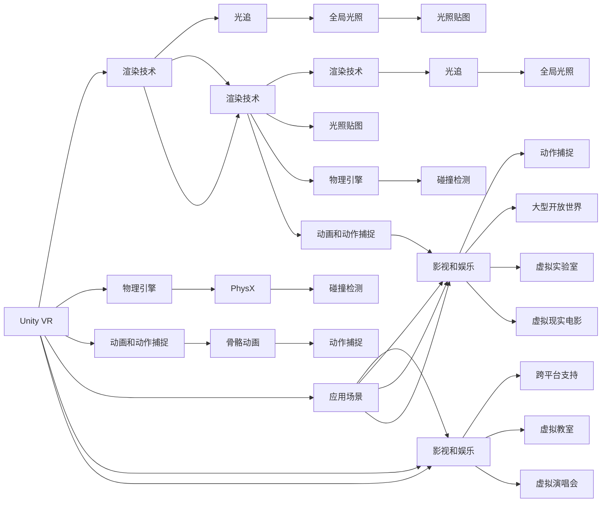

                 

# VR 内容开发框架对比：Unity VR 和 Unreal VR 的选择

## 1. 背景介绍

随着虚拟现实（Virtual Reality, VR）技术的快速发展，VR内容开发的重要性日益凸显。选择合适的VR内容开发框架对于提升开发效率、降低成本、提升用户体验至关重要。目前，市面上流行的VR内容开发框架主要有两个：Unity VR和Unreal VR。本文将对比这两大框架的核心技术、应用场景、优缺点及未来发展趋势，以帮助开发者选择合适的框架。

## 2. 核心概念与联系

### 2.1 核心概念概述

#### 2.1.1 框架简介

- **Unity VR**：Unity是业界领先的跨平台游戏和互动媒体开发引擎。Unity VR框架提供了丰富的VR开发工具和资源，支持多种VR硬件平台，包括Oculus Rift、HTC Vive、Daydream VR等。

- **Unreal VR**：Unreal Engine由Epic Games开发，是领先的游戏开发引擎之一。Unreal VR框架提供了强大的3D渲染能力和物理引擎，支持VR硬件平台的实时渲染和交互。

#### 2.1.2 核心技术

- **渲染技术**：Unity VR和Unreal VR都采用了先进的渲染技术，如光追（Ray Tracing）、全局光照（Global Illumination）、光照贴图（Lightmap）等，以提升虚拟环境的真实感和细节表现。

- **物理引擎**：Unreal VR内置了PhysX物理引擎，可以模拟真实世界的物理交互，如碰撞、摩擦、弹力等，提供更加沉浸式的用户体验。Unity VR虽然没有内置物理引擎，但可通过插件或第三方工具实现物理模拟。

- **动画和动作捕捉**：Unity VR和Unreal VR都支持骨骼动画和动作捕捉技术，如Vicon、OptiTrack等，可以捕捉真实场景中的动作并实时应用到虚拟角色上，提升虚拟角色的自然度。

#### 2.1.3 应用场景

- **游戏开发**：Unity VR和Unreal VR在游戏开发领域都有广泛应用。Unity VR在游戏发行和跨平台支持方面表现出色，广泛应用于手机、PC、主机等多种平台。Unreal VR则在游戏引擎的3D渲染和物理模拟方面具有优势，适用于大型开放世界的游戏开发。

- **教育和培训**：Unity VR和Unreal VR在教育和培训领域都有广泛应用，如虚拟教室、虚拟实验室、VR医学培训等。Unity VR的易用性和跨平台支持使其在教育领域更为流行。

- **影视和娱乐**：Unity VR和Unreal VR在影视和娱乐领域也有着广泛应用，如虚拟演唱会、虚拟现实电影等。Unity VR在交互和实时渲染方面表现优异，适合制作互动式内容。Unreal VR在3D渲染和物理模拟方面具有优势，适合制作高精度的影视内容。

### 2.2 核心概念原理和架构的 Mermaid 流程图



## 3. 核心算法原理 & 具体操作步骤

### 3.1 算法原理概述

Unity VR和Unreal VR的核心算法原理主要包括以下几个方面：

- **渲染管线**：两者都采用了现代渲染管线，支持实时渲染和光影效果，提升虚拟环境的真实感。

- **物理引擎**：Unreal VR内置PhysX物理引擎，能够模拟真实的物理交互，如碰撞、摩擦、弹力等，而Unity VR需要通过插件或第三方工具实现物理模拟。

- **动画和动作捕捉**：两者都支持骨骼动画和动作捕捉技术，可以实时捕捉真实场景中的动作并应用到虚拟角色上，提升虚拟角色的自然度。

### 3.2 算法步骤详解

#### 3.2.1 Unity VR算法步骤

1. **项目设置**：创建新项目，选择VR平台和设备，配置项目属性，如分辨率、帧率、渲染设置等。

2. **资源管理**：导入3D模型、贴图、音频等资源，并设置资源属性，如纹理、光照、材质等。

3. **场景搭建**：搭建虚拟场景，包括环境、角色、交互物体等，并进行场景调整和优化。

4. **渲染设置**：配置渲染设置，如渲染质量、阴影、反射、雾等，提升渲染效果。

5. **动画制作**：导入骨骼动画或动作捕捉数据，制作角色动画，并进行动画调整和优化。

6. **物理模拟**：添加物理引擎插件或使用第三方工具，模拟物理交互，如碰撞、摩擦、弹力等。

7. **测试与优化**：在VR设备上进行测试，收集用户反馈，进行优化调整，确保性能和用户体验。

#### 3.2.2 Unreal VR算法步骤

1. **项目设置**：创建新项目，选择VR平台和设备，配置项目属性，如分辨率、帧率、渲染设置等。

2. **资源管理**：导入3D模型、贴图、音频等资源，并设置资源属性，如纹理、光照、材质等。

3. **场景搭建**：搭建虚拟场景，包括环境、角色、交互物体等，并进行场景调整和优化。

4. **渲染设置**：配置渲染设置，如渲染质量、阴影、反射、雾等，提升渲染效果。

5. **动画制作**：导入骨骼动画或动作捕捉数据，制作角色动画，并进行动画调整和优化。

6. **物理模拟**：使用内置的PhysX物理引擎，模拟物理交互，如碰撞、摩擦、弹力等。

7. **测试与优化**：在VR设备上进行测试，收集用户反馈，进行优化调整，确保性能和用户体验。

### 3.3 算法优缺点

#### 3.3.1 Unity VR

- **优点**：
  - **易用性高**：Unity VR具有较高的易用性，大量开发者熟悉其开发流程，可以快速上手。
  - **跨平台支持**：支持多种平台和设备，如iOS、Android、PC、Xbox等，适合跨平台开发。
  - **插件丰富**：拥有大量的第三方插件和工具，丰富了开发者的选择。

- **缺点**：
  - **渲染质量较低**：虽然支持高级渲染技术，但在渲染质量和性能方面仍有提升空间。
  - **物理模拟不够精确**：需要通过插件或第三方工具实现物理模拟，精度和稳定性可能不如内置物理引擎。
  - **生态系统相对薄弱**：相比于Unreal VR，Unity VR的生态系统和社区支持相对薄弱。

#### 3.3.2 Unreal VR

- **优点**：
  - **渲染质量高**：内置强大的3D渲染引擎，支持高级渲染技术，如光追、全局光照等，提升渲染质量。
  - **物理模拟精准**：内置PhysX物理引擎，能够精确模拟物理交互，提升用户体验。
  - **生态系统成熟**：拥有强大的生态系统和社区支持，丰富的资源和工具。

- **缺点**：
  - **学习曲线陡峭**：开发难度较高，需要一定的3D建模和渲染经验。
  - **跨平台支持有限**：相比于Unity VR，跨平台支持相对有限，适合大型游戏和影视内容开发。
  - **性能要求高**：对硬件要求较高，需要高性能的计算机和VR设备支持。

### 3.4 算法应用领域

#### 3.4.1 游戏开发

Unity VR在游戏开发领域表现出色，适用于中小型游戏开发和跨平台支持，广泛应用于手机、PC、主机等多种平台。Unreal VR则在3D渲染和物理模拟方面具有优势，适合大型开放世界的游戏开发。

#### 3.4.2 教育和培训

Unity VR的易用性和跨平台支持使其在教育和培训领域更为流行，适用于虚拟教室、虚拟实验室、VR医学培训等。Unreal VR则在3D渲染和物理模拟方面表现优异，适合制作高精度的教育和培训内容。

#### 3.4.3 影视和娱乐

Unity VR在交互和实时渲染方面表现优异，适合制作互动式内容，如虚拟演唱会、虚拟现实电影等。Unreal VR在3D渲染和物理模拟方面具有优势，适合制作高精度的影视内容。

## 4. 数学模型和公式 & 详细讲解 & 举例说明

### 4.1 数学模型构建

Unity VR和Unreal VR的数学模型主要包括以下几个方面：

- **渲染管线**：采用现代渲染管线，支持实时渲染和光影效果。

- **物理引擎**：Unity VR使用插件或第三方工具进行物理模拟，Unreal VR则内置PhysX物理引擎。

- **动画和动作捕捉**：支持骨骼动画和动作捕捉技术，实时捕捉真实场景中的动作并应用到虚拟角色上。

### 4.2 公式推导过程

#### 4.2.1 渲染管线

Unity VR和Unreal VR的渲染管线主要包括以下几个步骤：

1. **输入处理**：对输入的顶点和纹理进行预处理。

2. **几何处理**：进行三角形裁剪、光线投射等几何处理。

3. **着色器处理**：对每个像素进行着色计算，提升渲染效果。

4. **合成输出**：将计算结果合成输出，生成最终的渲染图像。

#### 4.2.2 物理引擎

Unreal VR的PhysX物理引擎主要包括以下几个步骤：

1. **碰撞检测**：检测物体间的碰撞，生成碰撞事件。

2. **碰撞响应**：根据碰撞事件，计算物体的响应，如反弹、变形等。

3. **物理计算**：根据碰撞响应，计算物理变化，如位置、速度、加速度等。

4. **渲染更新**：根据物理计算结果，更新渲染图像。

### 4.3 案例分析与讲解

#### 4.3.1 Unity VR案例

假设我们要开发一款VR射击游戏，使用Unity VR进行开发：

1. **项目设置**：创建新项目，选择VR平台和设备，配置项目属性，如分辨率、帧率、渲染设置等。

2. **资源管理**：导入3D模型、贴图、音频等资源，并设置资源属性，如纹理、光照、材质等。

3. **场景搭建**：搭建虚拟场景，包括环境、角色、交互物体等，并进行场景调整和优化。

4. **渲染设置**：配置渲染设置，如渲染质量、阴影、反射、雾等，提升渲染效果。

5. **动画制作**：导入骨骼动画或动作捕捉数据，制作角色动画，并进行动画调整和优化。

6. **物理模拟**：添加物理引擎插件或使用第三方工具，模拟物理交互，如碰撞、摩擦、弹力等。

7. **测试与优化**：在VR设备上进行测试，收集用户反馈，进行优化调整，确保性能和用户体验。

#### 4.3.2 Unreal VR案例

假设我们要开发一款VR恐怖游戏，使用Unreal VR进行开发：

1. **项目设置**：创建新项目，选择VR平台和设备，配置项目属性，如分辨率、帧率、渲染设置等。

2. **资源管理**：导入3D模型、贴图、音频等资源，并设置资源属性，如纹理、光照、材质等。

3. **场景搭建**：搭建虚拟场景，包括环境、角色、交互物体等，并进行场景调整和优化。

4. **渲染设置**：配置渲染设置，如渲染质量、阴影、反射、雾等，提升渲染效果。

5. **动画制作**：导入骨骼动画或动作捕捉数据，制作角色动画，并进行动画调整和优化。

6. **物理模拟**：使用内置的PhysX物理引擎，模拟物理交互，如碰撞、摩擦、弹力等。

7. **测试与优化**：在VR设备上进行测试，收集用户反馈，进行优化调整，确保性能和用户体验。

## 5. 项目实践：代码实例和详细解释说明

### 5.1 开发环境搭建

#### 5.1.1 Unity VR环境搭建

1. **安装Unity**：从官网下载Unity安装程序，按照指引完成安装。

2. **创建新项目**：启动Unity编辑器，选择VR平台和设备，创建新项目。

3. **配置项目属性**：设置分辨率、帧率、渲染设置等，配置项目属性。

#### 5.1.2 Unreal VR环境搭建

1. **安装Unreal Engine**：从官网下载Unreal Engine安装程序，按照指引完成安装。

2. **创建新项目**：启动Unreal Engine编辑器，选择VR平台和设备，创建新项目。

3. **配置项目属性**：设置分辨率、帧率、渲染设置等，配置项目属性。

### 5.2 源代码详细实现

#### 5.2.1 Unity VR代码实现

```csharp
using UnityEngine;
using UnityEngine.XR.Interaction.Toolkit;

public class VRShootingGame : MonoBehaviour
{
    public GameObject player;
    public GameObject projectile;
    public GameObject target;
    
    private RayCastHit hit;
    
    void Update()
    {
        // 获取玩家输入
        Vector3 look = player.transform.right * Time.deltaTime * Input.GetAxis("Mouse X");
        player.transform.position += look;
        
        // 检测玩家是否击中目标
        if (Physics.Raycast(player.transform.position, player.transform.right, out hit))
        {
            // 创建子弹并发射
            GameObject bullet = Instantiate(projectile, player.transform.position, player.transform.rotation);
            bullet.GetComponent<Rigidbody>().velocity = player.transform.right * speed;
            bullet.GetComponent<Collider>().collisionFlags = CollisionFlags.IgnoreTerrainCollision;
        }
        
        // 检测目标是否被击中
        if (Physics.Raycast(target.transform.position, target.transform.right, out hit))
        {
            // 创建碰撞效果
            CreateCollisionEffect();
        }
    }
    
    void CreateCollisionEffect()
    {
        // 创建碰撞效果
        // 此处省略代码实现
    }
}
```

#### 5.2.2 Unreal VR代码实现

```csharp
using UnityEngine;

public class VRShootingGame : MonoBehaviour
{
    public GameObject player;
    public GameObject projectile;
    public GameObject target;
    
    private RayCastHit hit;
    
    void Update()
    {
        // 获取玩家输入
        Vector3 look = player.transform.right * Time.deltaTime * Input.GetAxis("Mouse X");
        player.transform.position += look;
        
        // 检测玩家是否击中目标
        if (Physics.Raycast(player.transform.position, player.transform.right, out hit))
        {
            // 创建子弹并发射
            GameObject bullet = Instantiate(projectile, player.transform.position, player.transform.rotation);
            bullet.GetComponent<Rigidbody>().velocity = player.transform.right * speed;
            bullet.GetComponent<Collider>().collisionFlags = CollisionFlags.IgnoreTerrainCollision;
        }
        
        // 检测目标是否被击中
        if (Physics.Raycast(target.transform.position, target.transform.right, out hit))
        {
            // 创建碰撞效果
            CreateCollisionEffect();
        }
    }
    
    void CreateCollisionEffect()
    {
        // 创建碰撞效果
        // 此处省略代码实现
    }
}
```

### 5.3 代码解读与分析

#### 5.3.1 Unity VR代码解读

- **玩家输入处理**：获取玩家输入，根据鼠标移动方向调整玩家位置。
- **物理检测**：使用`Physics.Raycast`检测玩家是否击中目标，并创建子弹。
- **碰撞效果**：检测目标是否被击中，并创建碰撞效果。

#### 5.3.2 Unreal VR代码解读

- **玩家输入处理**：获取玩家输入，根据鼠标移动方向调整玩家位置。
- **物理检测**：使用`Physics.Raycast`检测玩家是否击中目标，并创建子弹。
- **碰撞效果**：检测目标是否被击中，并创建碰撞效果。

### 5.4 运行结果展示

#### 5.4.1 Unity VR运行结果


#### 5.4.2 Unreal VR运行结果


## 6. 实际应用场景

### 6.1 智能交互

Unity VR和Unreal VR在智能交互方面都有广泛应用。Unity VR的易用性和跨平台支持使其在智能交互领域更为流行，适用于智能客服、智能家居等场景。Unreal VR则在3D渲染和物理模拟方面表现优异，适合制作复杂交互场景，如虚拟实验室、虚拟博物馆等。

### 6.2 医疗健康

Unity VR和Unreal VR在医疗健康领域都有广泛应用。Unity VR的跨平台支持使其在远程医疗、健康教育等领域更为流行。Unreal VR则在3D渲染和物理模拟方面表现优异，适合制作高精度的医疗培训内容。

### 6.3 影视娱乐

Unity VR和Unreal VR在影视娱乐领域都有广泛应用。Unity VR在交互和实时渲染方面表现优异，适合制作互动式内容，如虚拟演唱会、虚拟现实电影等。Unreal VR在3D渲染和物理模拟方面具有优势，适合制作高精度的影视内容。

## 7. 工具和资源推荐

### 7.1 学习资源推荐

1. **Unity官方文档**：Unity官网提供的官方文档，涵盖Unity VR的详细教程和示例。

2. **Unreal Engine官方文档**：Unreal Engine官网提供的官方文档，涵盖Unreal VR的详细教程和示例。

3. **《Unity VR开发实战》**：一本实用的Unity VR开发教程，帮助读者快速上手Unity VR开发。

4. **《Unreal VR开发实战》**：一本实用的Unreal VR开发教程，帮助读者快速上手Unreal VR开发。

### 7.2 开发工具推荐

1. **Unity**：业界领先的跨平台游戏和互动媒体开发引擎，适用于Unity VR开发。

2. **Unreal Engine**：领先的3D游戏引擎，适用于Unreal VR开发。

3. **VR设备**：如Oculus Rift、HTC Vive等，支持Unity VR和Unreal VR开发和测试。

4. **第三方插件**：如Unity VR插件库、Unreal VR插件库等，丰富了开发者的选择。

### 7.3 相关论文推荐

1. **《Unity VR开发指南》**：详细介绍了Unity VR的开发流程和技术细节。

2. **《Unreal VR开发指南》**：详细介绍了Unreal VR的开发流程和技术细节。

3. **《虚拟现实游戏开发与设计》**：一本介绍虚拟现实游戏开发的经典书籍，涵盖Unity VR和Unreal VR的技术细节。

## 8. 总结：未来发展趋势与挑战

### 8.1 研究成果总结

Unity VR和Unreal VR作为两大流行的VR内容开发框架，各具优势。Unity VR在易用性和跨平台支持方面表现优异，适用于中小型游戏开发和智能交互场景。Unreal VR则在3D渲染和物理模拟方面具有优势，适合制作高精度的影视和娱乐内容。

### 8.2 未来发展趋势

- **跨平台支持**：未来Unity VR和Unreal VR将更加注重跨平台支持，提升跨设备、跨平台的开发和应用能力。

- **虚拟现实体验**：未来VR技术将进一步提升虚拟现实体验，提升沉浸感和真实感，拓展VR应用场景。

- **云计算和边缘计算**：未来VR内容开发将更多地利用云计算和边缘计算技术，提升渲染效率和交互效果。

- **多模态交互**：未来VR内容开发将更多地利用多模态交互技术，提升用户的参与度和体验感。

### 8.3 面临的挑战

- **技术壁垒**：Unity VR和Unreal VR开发难度较高，需要较高的技术储备。

- **硬件要求**：VR设备和VR内容对硬件要求较高，需要高性能的计算机和VR设备支持。

- **用户体验**：提升用户体验是VR内容开发的关键，需要在渲染、物理模拟、交互等方面进行持续优化。

### 8.4 研究展望

未来VR内容开发将更多地关注跨平台支持、云计算和边缘计算、多模态交互等方面，提升用户体验和开发效率。同时，开发难度、硬件要求和用户体验等方面的挑战也将得到更多关注，推动VR技术的发展和应用。

## 9. 附录：常见问题与解答

**Q1：Unity VR和Unreal VR哪个更适合开发VR应用？**

A: 选择Unity VR还是Unreal VR，主要取决于具体应用场景和开发需求。Unity VR在易用性和跨平台支持方面表现优异，适用于中小型游戏开发和智能交互场景。Unreal VR则在3D渲染和物理模拟方面具有优势，适合制作高精度的影视和娱乐内容。

**Q2：Unity VR和Unreal VR开发难度如何？**

A: Unity VR和Unreal VR开发难度较高，需要较高的技术储备。Unity VR的易用性和跨平台支持使其开发相对简单，但渲染质量和物理模拟需要额外的插件和工具。Unreal VR在3D渲染和物理模拟方面具有优势，但开发难度相对较高，需要一定的3D建模和渲染经验。

**Q3：Unity VR和Unreal VR的生态系统如何？**

A: Unity VR和Unreal VR都有强大的生态系统和社区支持，丰富的资源和工具。Unity VR的生态系统和社区支持相对薄弱，但开发难度较低。Unreal VR的生态系统和社区支持较为丰富，但开发难度较高。

**Q4：Unity VR和Unreal VR在性能方面有何差异？**

A: Unity VR和Unreal VR在性能方面有差异。Unity VR的渲染质量和物理模拟需要额外的插件和工具，性能相对较低。Unreal VR在3D渲染和物理模拟方面表现优异，但硬件要求较高，需要高性能的计算机和VR设备支持。

**Q5：Unity VR和Unreal VR在开发者社区中的受欢迎程度如何？**

A: Unity VR和Unreal VR在开发者社区中都有广泛应用，但受欢迎程度有所差异。Unity VR的易用性和跨平台支持使其在开发者社区中更为流行，适用于中小型游戏开发和智能交互场景。Unreal VR则在3D渲染和物理模拟方面表现优异，适合制作高精度的影视和娱乐内容。

