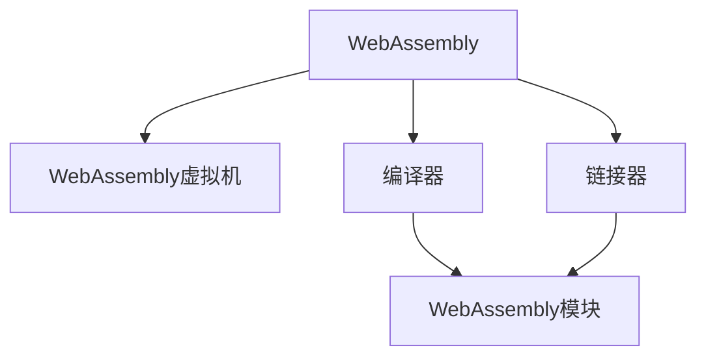
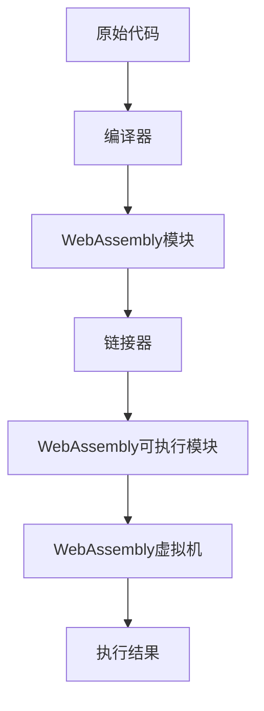

                 

## 1. 背景介绍

### 1.1 问题由来
随着Web技术的不断发展，Web应用程序的复杂度不断提升。传统的JavaScript虽能有效描述Web应用程序的交互行为，但在执行复杂计算、图形渲染等方面，性能瓶颈显现。与此同时，服务器端语言（如C/C++、Rust等）虽然提供了良好的执行性能，但由于Web标准的不兼容性，难以在Web浏览器中直接运行。

为了弥合这一性能鸿沟，WebAssembly（简称Wasm）应运而生。Wasm是一种针对Web平台的高效二进制格式，旨在通过编译现有的编译型语言，将高效率、高安全性的代码引入Web。本文将详细介绍WebAssembly的原理与实践，帮助读者全面理解其在Web平台上的高性能编程。

### 1.2 问题核心关键点
WebAssembly的诞生源自对现有Web技术局限性的反思。关键点在于：

- **跨平台兼容性**：解决JavaScript执行速度慢、资源消耗大的问题。
- **高性能计算**：提升Web应用程序的响应速度和执行效率，支持复杂计算和图形渲染。
- **安全运行**：在Web浏览器中安全执行编译型语言代码，避免潜在安全风险。
- **互操作性**：与JavaScript无缝结合，可共享模块、调用现有库，减少开发成本。

本文档将深入分析Wasm的核心原理，展示其具体应用，并探讨其未来发展趋势与挑战。

## 2. 核心概念与联系

### 2.1 核心概念概述

为更好地理解WebAssembly，本节将介绍几个关键概念及其相互关系：

- **WebAssembly（Wasm）**：一种二进制格式，用于在Web浏览器中执行编译型语言代码，如C/C++、Rust等。Wasm通过虚拟机执行，实现与JavaScript的无缝互操作。
- **WebAssembly虚拟机（WasmVM）**：Wasm的解释器，负责执行Wasm代码。由Web浏览器自带，无需开发者手动安装。
- **编译器**：将高级语言代码编译为Wasm二进制格式的工具。常见的编译器包括Emscripten、LLVM等。
- **链接器**：将多个Wasm模块合并为一个可执行模块的工具。常见的链接器包括LLVM的Linker、EMCC等。
- **模块（Module）**：Wasm代码的基本单位，由函数、表、全局变量、内存、数据段等组成。每个Wasm模块独立执行，与其他模块或JavaScript代码互操作。

这些概念通过以下Mermaid流程图展示：



以上流程图示意了WebAssembly的完整流程：原始代码通过编译器转换为Wasm二进制，Wasm模块通过链接器合并为可执行模块，最终在WasmVM中执行。

### 2.2 核心概念原理和架构的 Mermaid 流程图



## 3. 核心算法原理 & 具体操作步骤

### 3.1 算法原理概述

WebAssembly的核心思想是通过虚拟机执行二进制代码，以实现跨平台的高效编程。其原理如下：

1. **编译过程**：将高级语言代码（如C/C++、Rust等）编译为Wasm二进制。编译器通常会进行代码优化、生成中间表示等操作。
2. **链接过程**：将多个Wasm模块合并为一个可执行模块。链接器需要处理模块之间的函数引用、全局变量等依赖关系。
3. **执行过程**：在WebAssembly虚拟机中执行可执行模块。WasmVM解释执行二进制代码，提供与JavaScript的互操作接口。

### 3.2 算法步骤详解

WebAssembly的完整编译流程如下：

1. **编译器编译**：使用编译器（如Emscripten、LLVM）将源代码编译为中间表示（如IR或AST），再生成Wasm二进制。

2. **链接器链接**：将生成的Wasm模块进行链接，生成最终的可执行模块。链接器处理模块间的函数、全局变量等依赖关系。

3. **WebAssembly虚拟机执行**：在WebAssembly虚拟机中执行生成的可执行模块。WasmVM负责解释执行二进制代码，并处理与JavaScript的互操作。

### 3.3 算法优缺点

WebAssembly具有以下优点：

- **高性能**：通过直接执行二进制代码，避免了JavaScript的执行开销，提供接近本地程序的执行速度。
- **跨平台兼容性**：Wasm模块可以在多个平台上运行，无需重新编译。
- **与JavaScript互操作**：Wasm模块可以与JavaScript无缝互操作，调用现有库、共享模块。
- **安全性**：Wasm代码在执行前通过编译器进行优化和验证，降低了安全风险。

同时，WebAssembly也存在一些缺点：

- **开发复杂**：需要掌握编译器、链接器的配置和使用，增加了开发难度。
- **工具链依赖**：依赖于Emscripten、LLVM等编译器，可能存在兼容性问题。
- **体积大**：Wasm模块体积较大，可能影响页面加载速度。

### 3.4 算法应用领域

WebAssembly在多个领域展现出巨大的应用潜力，主要包括：

- **高性能计算**：支持复杂计算、图形渲染等高性能任务，广泛应用于Web游戏、动画、科学计算等领域。
- **Web应用优化**：通过替换JavaScript代码段，提升Web应用的性能和响应速度，广泛应用于Web应用优化和加速。
- **跨平台开发**：支持跨平台编译和部署，降低跨平台开发成本，广泛应用于跨平台开发和部署。
- **嵌入式应用**：Wasm模块体积小，执行速度快，适用于嵌入式设备的应用开发。

## 4. 数学模型和公式 & 详细讲解 & 举例说明

### 4.1 数学模型构建

WebAssembly的执行模型基于栈和寄存器，模型结构如下：

```plaintext
Stack:
    FunctionArgs (Arguments)
    LocalVariables (Local Variables)
    TempStorage (Temporary Storage)
    ReturnValues (Return Values)
Register:
    Memory (Memory Address)
    CallStack (Call Stack)
    CallFrame (Call Frame)
    Activation Records (Activation Records)
```

### 4.2 公式推导过程

WebAssembly的基本指令集包括算术指令、控制流指令、数据转移指令等。例如，`STORE`指令将内存地址的值存储到指定位置：

```plaintext
STORE i32/64/mem (memory, offset, value)
```

其中，`i32/64`表示数据类型，`memory`表示内存地址，`offset`表示偏移量，`value`表示要存储的值。

### 4.3 案例分析与讲解

以WebAssembly中的`add`指令为例，其执行过程如下：

1. 指令：`add i32`（将两个32位整数相加）
2. 寄存器：`R1`和`R2`存储操作数
3. 栈：`F0`和`F1`存储操作数
4. 执行过程：
   - `LOAD`指令从栈中加载`F0`到`R1`，`LOAD`指令从栈中加载`F1`到`R2`
   - `ADD`指令将`R1`和`R2`相加，结果存储到`R1`
   - `RETURN`指令返回`R1`作为结果

## 5. 项目实践：代码实例和详细解释说明

### 5.1 开发环境搭建

在开始项目实践前，需要搭建好WebAssembly的开发环境。以下是搭建步骤：

1. **安装Node.js**：WebAssembly的开发依赖Node.js。下载并安装最新版本的Node.js。
2. **安装Wasm编译器**：选择适合的Wasm编译器，如Emscripten或LLVM。
3. **配置环境变量**：配置`WASM_VM`、`WASM_COMPILER`等环境变量，以便调用编译器。

### 5.2 源代码详细实现

以下是一个简单的C代码示例，展示如何编译和执行WebAssembly模块：

1. **C代码**：

```c
#include <stdio.h>

int add(int a, int b) {
    return a + b;
}

int main() {
    printf("Result: %d\n", add(1, 2));
    return 0;
}
```

2. **编译过程**：使用Emscripten将C代码编译为Wasm模块：

```sh
emcc -o add.wasm add.c
```

3. **执行过程**：在JavaScript中调用Wasm模块：

```html
<!DOCTYPE html>
<html>
<body>
    <script>
        var add_module = new WebAssembly.instantiate(new WebAssembly.Module(fetch('add.wasm').then(function(data) {
            return data.buffer;
        })))["add"];
        var result = add_module(1, 2);
        console.log("Result: " + result);
    </script>
</body>
</html>
```

### 5.3 代码解读与分析

**WebAssembly编译器**：Emscripten将C代码编译为Wasm模块，包括代码优化、生成中间表示等过程。编译器生成的Wasm模块包含函数定义、全局变量等，结构清晰。

**Wasm模块执行**：在JavaScript中使用`WebAssembly.instantiate`方法加载Wasm模块，调用其中的函数。执行过程由WasmVM负责，WasmVM解释执行二进制代码。

## 6. 实际应用场景

### 6.1 高性能计算

WebAssembly广泛应用于高性能计算，如Web游戏、科学计算等。通过替换JavaScript代码段，Wasm模块可以提供接近本地程序的执行速度。例如，WebGL应用程序可以使用Wasm模块进行图形渲染，提升帧率，提供流畅的用户体验。

### 6.2 Web应用优化

WebAssembly可以替换JavaScript中的计算密集型代码，提升Web应用的性能和响应速度。例如，Web应用程序可以使用Wasm模块进行数据分析、算法计算等操作，减少页面加载时间和计算延迟。

### 6.3 跨平台开发

Wasm模块可以在多个平台上运行，降低了跨平台开发的难度和成本。例如，Web开发者可以在本地开发Wasm模块，直接发布到Web浏览器中，无需重新编译。

### 6.4 未来应用展望

未来，WebAssembly的应用将更加广泛，涵盖更多领域。例如，Wasm模块可以用于区块链应用、物联网设备应用等，实现跨平台、高性能的解决方案。随着WebAssembly的不断优化和完善，其应用前景将更加广阔。

## 7. 工具和资源推荐

### 7.1 学习资源推荐

- **Emscripten官方文档**：详细介绍了Emscripten的使用方法和相关工具。
- **WebAssembly入门教程**：提供了WebAssembly的基本概念和实践指南。
- **WasmBook**：一本全面介绍WebAssembly的书籍，涵盖从编译到执行的完整流程。

### 7.2 开发工具推荐

- **Emscripten**：高性能的Wasm编译器，支持C/C++、Rust等编译型语言。
- **LLVM**：功能强大的编译器框架，支持多种编译型语言。
- **EMCC**：Emscripten的命令行工具，支持快速编译Wasm模块。

### 7.3 相关论文推荐

- **"Compiling for the WebAssembly Target"**：详细介绍了Wasm的编译过程和技术细节。
- **"WebAssembly: A Sandbox for Trustworthy Execution"**：讨论了Wasm的安全性和执行环境。
- **"Improving Performance of JavaScript through Just-In-Time Compilation"**：研究了通过JIT编译提升JavaScript性能的方法。

## 8. 总结：未来发展趋势与挑战

### 8.1 总结

本文对WebAssembly的原理与实践进行了详细阐述。从编译、链接到执行，全面介绍了Wasm的工作流程和核心技术。通过实际代码示例，展示了Wasm在Web平台上的高性能编程能力。

### 8.2 未来发展趋势

未来，WebAssembly将在以下几个方面继续发展：

- **性能提升**：通过优化WasmVM和编译器，提升Wasm模块的执行速度和资源利用率。
- **跨平台优化**：增强Wasm模块的跨平台兼容性，降低开发和部署成本。
- **安全机制**：加强Wasm模块的安全性，确保其在Web浏览器中的安全执行。
- **与JavaScript深度融合**：探索Wasm与JavaScript的深度集成，实现更高效、更灵活的Web应用开发。

### 8.3 面临的挑战

尽管WebAssembly具有诸多优势，但其发展仍面临以下挑战：

- **开发复杂**：需要掌握编译器、链接器的配置和使用，增加了开发难度。
- **性能瓶颈**：Wasm模块的体积和加载时间仍可能影响页面性能。
- **兼容性问题**：不同浏览器和版本的支持程度不一，可能存在兼容性问题。

### 8.4 研究展望

未来，WebAssembly的研究方向包括：

- **优化WasmVM**：提升WasmVM的执行效率，减少内存占用和计算延迟。
- **优化编译器**：改进编译器的代码生成和优化策略，提升Wasm模块的性能和可读性。
- **增强安全性**：研究Wasm模块的安全性，确保其在Web浏览器中的安全执行。
- **探索深度集成**：探索Wasm与JavaScript的深度集成方法，实现更高效、更灵活的Web应用开发。

## 9. 附录：常见问题与解答

**Q1：WebAssembly和JavaScript有何区别？**

A: WebAssembly是一种二进制格式，主要用于在Web浏览器中执行编译型语言代码。JavaScript则是解释型语言，直接由浏览器解释执行。WebAssembly的执行速度更快，适用于高性能计算和复杂图形渲染。

**Q2：WebAssembly的体积大吗？**

A: WebAssembly模块体积较大，主要原因是其包含大量中间表示和元数据。可以通过优化编译器和链接器，减小Wasm模块的体积。

**Q3：WebAssembly在哪些浏览器中支持？**

A: WebAssembly目前已在主流浏览器中广泛支持，包括Chrome、Firefox、Edge等。但不同浏览器和版本的支持程度可能有所差异。

**Q4：如何优化WebAssembly的性能？**

A: 可以通过优化编译器和链接器，减小Wasm模块的体积和加载时间。还可以使用Wasm模块的预编译和缓存技术，提高性能。

**Q5：WebAssembly的安全性如何？**

A: WebAssembly的安全性主要依赖于编译器和WebAssembly虚拟机。Wasm模块在执行前经过编译器优化和验证，确保其安全性。但开发者仍需注意代码中的潜在安全漏洞，确保Web应用程序的安全性。

---

作者：禅与计算机程序设计艺术 / Zen and the Art of Computer Programming

