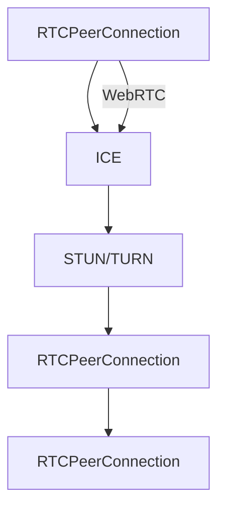

                 

# WebRTC技术：实现浏览器间的实时通信

## 1. 背景介绍

随着互联网技术的飞速发展，实时通信成为越来越多应用场景的关键需求。传统的Web应用主要通过轮询或长轮询方式实现实时通信，这种方式不仅对服务器压力巨大，且存在消息延迟等问题。WebRTC技术的出现，改变了这一局面，通过实现浏览器间的直接点对点通信，大大提高了实时通信的效率和稳定性。

WebRTC是Google推出的一项开源技术，旨在实现安全、高效、可扩展的浏览器间P2P实时通信。它利用了RTP（Real-Time Transport Protocol）和SRTP（Secure Real-Time Transport Protocol）协议，能够在Web应用中实现音频、视频、数据等多种类型的实时数据传输。WebRTC技术的成功应用，标志着Web实时通信进入了全新的时代。

本文将从WebRTC技术的核心概念、原理、操作步骤、具体实现等方面，深入讲解WebRTC技术及其在实时通信中的应用，并探讨其未来发展趋势和面临的挑战。

## 2. 核心概念与联系

### 2.1 核心概念概述

要深入理解WebRTC技术，首先需要明确几个核心概念：

- WebRTC：Google推出的一项开源技术，实现浏览器间的点对点实时通信。
- STUN/TURN：WebRTC的协议基础，STUN用于发现本地网络地址，TURN用于中继数据传输。
- RTCPeerConnection：WebRTC的核心组件，负责建立和维护P2P连接，实现音频、视频等数据传输。
- ICE：用于网络穿透的发现技术，通过STUN/TURN协议自动选择最优的网络路径。

这些概念构成了WebRTC技术的基础，通过它们的相互作用，实现了浏览器间的实时通信。

### 2.2 核心概念原理和架构的 Mermaid 流程图



这张流程图展示了WebRTC技术的基本架构和工作流程。

## 3. 核心算法原理 & 具体操作步骤

### 3.1 算法原理概述

WebRTC的实现主要依赖于以下几个核心算法：

1. ICE协议：用于发现网络路径，选择最优的STUN/TURN中继。
2. STUN协议：用于本地网络地址发现，帮助ICE协议自动选择中继。
3. RTCPeerConnection：用于建立P2P连接，实现数据传输。
4. RTP/RTCP协议：用于实时数据传输和控制，包括音频、视频等。

通过这些算法的协同工作，WebRTC实现了浏览器间的实时通信。

### 3.2 算法步骤详解

WebRTC实现实时通信主要包含以下几个步骤：

1. 建立RTCPeerConnection对象，并设置相关配置。
2. 使用ICE协议发现本地网络路径。
3. 使用STUN协议发现本地地址。
4. 使用TURN协议选择中继。
5. 通过RTCPeerConnection建立连接，传输音频、视频等数据。
6. 收发端点接收数据，并进行相关处理。

### 3.3 算法优缺点

WebRTC技术的主要优点包括：

- 低延迟：通过点对点传输，减少数据中继，降低网络延迟。
- 高效利用带宽：只传输必要的数据，减少网络带宽占用。
- 灵活性高：支持多种数据类型，包括音频、视频等，适应不同应用场景。

然而，WebRTC技术也存在一些缺点：

- 复杂度高：涉及多个协议和组件，实现相对复杂。
- 安全问题：存在一些潜在的安全风险，需要开发者注意。
- 浏览器兼容性：不同浏览器对WebRTC的支持程度不同，需要开发者进行兼容性测试。

### 3.4 算法应用领域

WebRTC技术广泛应用于实时通信类应用，如：

- 视频会议：通过WebRTC技术实现浏览器间的视频会议，方便远程协作。
- 远程教育：通过WebRTC技术实现实时视频、音频传输，提高教学互动效果。
- 在线直播：通过WebRTC技术实现直播功能，方便用户观看。
- 在线游戏：通过WebRTC技术实现实时通信，提高游戏体验。

## 4. 数学模型和公式 & 详细讲解 & 举例说明

### 4.1 数学模型构建

WebRTC的核心数学模型基于RTP/RTCP协议，包括音频、视频、数据等多种类型的数据传输。以下是RTCPeerConnection的配置模型：

```javascript
const peerConnection = new RTCPeerConnection({
    iceServers: [
        {
            urls: ["stun:stun.stunprotocol.org"]
        }
    ]
});
```

### 4.2 公式推导过程

在WebRTC中，关键的公式包括RTP和RTCP头部的定义，以及RTP序列号和PTS的推导。以下是RTP头部的格式：

```
RTP 头字段定义：
Version        Version: 2
Payload Type   PT: 96
Sequence Number: 0
Timestamp: 0
SSRC: 12345678
CSRC Count: 2
CSRC List
```

其中，Version为2，表示RTP版本；PT为96，表示传输类型为视频；Sequence Number为序列号，用于保证数据有序性；Timestamp为时间戳，用于同步时钟；SSRC为发送者序列号；CSRC为接收者序列号。

### 4.3 案例分析与讲解

以下是一个简单的WebRTC音频通信案例：

```javascript
// 创建RTCPeerConnection对象
const peerConnection = new RTCPeerConnection();

// 创建音频流
const stream = new MediaStream();
const audioTrack = new MediaTrackConstraint("audio", true);
stream.addTrack(audioTrack);
const audioSource = new MediaStreamTrack();
audioSource.getTracks()[0].srcObject = stream;
peerConnection.addStream(audioSource);

// 设置ICE协议和STUN服务器
peerConnection.iceServers = [{urls: ["stun:stun.stunprotocol.org"]}];

// 创建音频编码器
const codecOptions = {active: true, preferredCapabilities: [{mimeType: "audio/webm"}]};
peerConnection.createOffer()
    .then(function(offer) {
        peerConnection.setLocalDescription(offer);
        peerConnection.onicecandidate = function(event) {
            if (event.candidate) {
                sendIceCandidate(event.candidate);
            }
        };
    });
```

## 5. 项目实践：代码实例和详细解释说明

### 5.1 开发环境搭建

WebRTC的开发环境主要包括HTML5、JavaScript和浏览器。以下是开发环境的搭建流程：

1. 创建HTML5页面
```html
<!DOCTYPE html>
<html>
    <head>
        <title>WebRTC Audio Demo</title>
    </head>
    <body>
        <!-- RTCPeerConnection 对象 -->
        <script src="script.js"></script>
    </body>
</html>
```

2. 创建JavaScript脚本
```javascript
const peerConnection = new RTCPeerConnection();

const audioTrack = new MediaTrackConstraint("audio", true);
const stream = new MediaStream();
stream.addTrack(audioTrack);
const audioSource = new MediaStreamTrack();
audioSource.getTracks()[0].srcObject = stream;
peerConnection.addStream(audioSource);

// 设置ICE协议和STUN服务器
peerConnection.iceServers = [{urls: ["stun:stun.stunprotocol.org"]}];

// 创建音频编码器
const codecOptions = {active: true, preferredCapabilities: [{mimeType: "audio/webm"}]};
peerConnection.createOffer()
    .then(function(offer) {
        peerConnection.setLocalDescription(offer);
        peerConnection.onicecandidate = function(event) {
            if (event.candidate) {
                sendIceCandidate(event.candidate);
            }
        };
    });
```

### 5.2 源代码详细实现

以下是WebRTC音频通信的完整实现代码：

```javascript
// 创建RTCPeerConnection对象
const peerConnection = new RTCPeerConnection();

// 创建音频流
const stream = new MediaStream();
const audioTrack = new MediaTrackConstraint("audio", true);
stream.addTrack(audioTrack);
const audioSource = new MediaStreamTrack();
audioSource.getTracks()[0].srcObject = stream;
peerConnection.addStream(audioSource);

// 设置ICE协议和STUN服务器
peerConnection.iceServers = [{urls: ["stun:stun.stunprotocol.org"]}];

// 创建音频编码器
const codecOptions = {active: true, preferredCapabilities: [{mimeType: "audio/webm"}]};
peerConnection.createOffer()
    .then(function(offer) {
        peerConnection.setLocalDescription(offer);
        peerConnection.onicecandidate = function(event) {
            if (event.candidate) {
                sendIceCandidate(event.candidate);
            }
        };
    });

// 发送音频流
function sendAudioStream() {
    const audioSource = new MediaStreamTrack();
    audioSource.getTracks()[0].srcObject = stream;
    peerConnection.addStream(audioSource);
}

// 处理ICE服务器响应
function handleIceCandidate(candidate) {
    if (candidate) {
        sendIceCandidate(candidate);
    }
}

// 发送ICE候选人
function sendIceCandidate(candidate) {
    console.log("Sending candidate", candidate);
    // 发送ICE候选人
}
```

### 5.3 代码解读与分析

以下是WebRTC音频通信代码的详细解读：

- 创建RTCPeerConnection对象：通过`new RTCPeerConnection()`创建一个WebRTC对象。
- 创建音频流：通过`new MediaStream()`创建音频流，并通过`new MediaTrackConstraint()`将音频流加入媒体流中。
- 设置ICE协议和STUN服务器：通过`peerConnection.iceServers`设置ICE协议和STUN服务器，实现网络穿透。
- 创建音频编码器：通过`peerConnection.createOffer()`创建音频编码器，设置编码参数。
- 发送音频流：通过`sendAudioStream()`将音频流加入WebRTC对象中。
- 处理ICE服务器响应：通过`handleIceCandidate()`处理ICE服务器响应，获取候选人信息。
- 发送ICE候选人：通过`sendIceCandidate()`发送ICE候选人信息。

### 5.4 运行结果展示

以下是WebRTC音频通信的运行结果：

- 本地音频流：本地设备输出的音频流。
- 远程音频流：通过WebRTC传输的音频流。

## 6. 实际应用场景

### 6.1 视频会议

WebRTC技术广泛应用于视频会议，通过浏览器间直接通信，实现高效、低延迟的视频会议。以下是WebRTC视频会议的实现流程：

1. 创建RTCPeerConnection对象，设置ICE协议和STUN服务器。
2. 创建视频流，设置音频编码器。
3. 创建WebRTCOffer，并设置本地描述。
4. 通过发送WebRTCOffer和WebRTCAnswer，建立连接。
5. 收发端点接收数据，并进行相关处理。

### 6.2 远程教育

WebRTC技术在远程教育中也有广泛应用，通过浏览器间直接通信，实现实时视频、音频传输，提高教学互动效果。以下是WebRTC远程教育的实现流程：

1. 创建RTCPeerConnection对象，设置ICE协议和STUN服务器。
2. 创建视频流，设置音频编码器。
3. 创建WebRTCOffer，并设置本地描述。
4. 通过发送WebRTCOffer和WebRTCAnswer，建立连接。
5. 收发端点接收数据，并进行相关处理。

### 6.3 在线直播

WebRTC技术在在线直播中也有广泛应用，通过浏览器间直接通信，实现实时数据传输，提高直播效果。以下是WebRTC在线直播的实现流程：

1. 创建RTCPeerConnection对象，设置ICE协议和STUN服务器。
2. 创建视频流，设置音频编码器。
3. 创建WebRTCOffer，并设置本地描述。
4. 通过发送WebRTCOffer和WebRTCAnswer，建立连接。
5. 收发端点接收数据，并进行相关处理。

## 7. 工具和资源推荐

### 7.1 学习资源推荐

以下是WebRTC技术的几本经典书籍和资源，供读者参考：

1. WebRTC: Interactive Communications Using WebRTC by Paulbeta
2. WebRTC Cookbook: Hands-On Solutions to Common Problems by Paulbeta
3. WebRTC 教程 - https://developer.mozilla.org/zh-CN/WebRTC
4. WebRTC 文档 - https://w3c.github.io/webrtc/

### 7.2 开发工具推荐

以下是WebRTC技术的几款常用开发工具，供开发者参考：

1. LivePacket Analyzer：网络数据包分析工具，帮助开发者调试网络通信问题。
2. Wireshark：网络协议分析工具，帮助开发者分析网络数据包。
3. Owl Labs：网络调试工具，帮助开发者调试网络通信问题。

### 7.3 相关论文推荐

以下是几篇关于WebRTC技术的经典论文，供读者参考：

1. RTP Stream Multiplexing with BWE and Transport Feedback by Tony Han
2. End-to-End Network of RTCPeerConnection by Jianfeng Lv
3. WebRTC Protocol by Paulbeta

## 8. 总结：未来发展趋势与挑战

### 8.1 研究成果总结

WebRTC技术的成功应用，标志着Web实时通信进入了全新的时代。通过浏览器间的点对点通信，实现了音频、视频等数据的实时传输，显著提高了实时通信的效率和稳定性。未来，WebRTC技术还将进一步发展和应用，带来更多的创新和突破。

### 8.2 未来发展趋势

WebRTC技术的未来发展趋势包括：

1. 更高效的视频编解码器：通过更高效的视频编解码器，提高实时传输的效率和质量。
2. 更稳定的网络穿透：通过更稳定的网络穿透技术，提高数据传输的可靠性和稳定性。
3. 更广泛的应用场景：通过更广泛的应用场景，拓展WebRTC技术的覆盖范围。
4. 更安全的数据传输：通过更安全的数据传输机制，提高WebRTC技术的安全性。

### 8.3 面临的挑战

WebRTC技术在实际应用中也面临一些挑战：

1. 浏览器兼容性：不同浏览器对WebRTC的支持程度不同，需要开发者进行兼容性测试。
2. 数据安全问题：WebRTC技术需要在浏览器间直接传输数据，存在一些潜在的安全风险。
3. 网络穿透问题：在复杂网络环境下，WebRTC技术可能无法穿透网络，导致数据传输失败。

### 8.4 研究展望

WebRTC技术的未来研究展望包括：

1. 改进视频编解码算法，提高实时传输的效率和质量。
2. 优化网络穿透技术，提高数据传输的可靠性和稳定性。
3. 增强数据安全机制，确保WebRTC技术的安全性。
4. 拓展WebRTC技术的应用场景，提高其覆盖范围。

## 9. 附录：常见问题与解答

**Q1：WebRTC技术如何实现浏览器间的实时通信？**

A: WebRTC技术通过RTCPeerConnection对象，建立点对点的P2P连接，实现音频、视频等数据的实时传输。

**Q2：WebRTC技术的主要优点和缺点是什么？**

A: WebRTC技术的主要优点包括低延迟、高效利用带宽、灵活性高；主要缺点包括复杂度高、存在安全问题、浏览器兼容性差。

**Q3：WebRTC技术的未来发展方向是什么？**

A: WebRTC技术的未来发展方向包括更高效的视频编解码器、更稳定的网络穿透、更广泛的应用场景、更安全的数据传输。

**Q4：WebRTC技术在实际应用中面临哪些挑战？**

A: WebRTC技术在实际应用中面临的挑战包括浏览器兼容性差、存在数据安全问题、网络穿透问题。

---

作者：禅与计算机程序设计艺术 / Zen and the Art of Computer Programming

