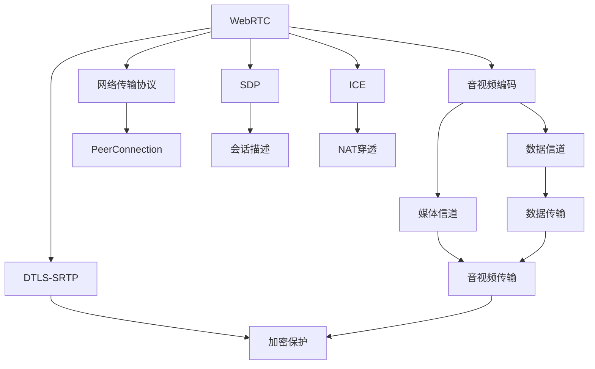

                 

# WebRTC技术：构建实时通信应用

> 关键词：WebRTC, 实时通信, 网络传输, 音视频编码, 点对点通信, 浏览器支持

## 1. 背景介绍

在现代数字化世界中，实时通信应用（Real-Time Communications, RTC）扮演着至关重要的角色。无论是远程会议、即时聊天还是游戏直播，RTC技术都提供了无缝、稳定的音视频传输体验，极大地促进了人与人之间的交流。其中，WebRTC（Web Real-Time Communications）技术以其在Web浏览器中的应用，使得RTC技术能够在网络中自由穿梭，无需额外的插件或软件支持。WebRTC基于开放标准和浏览器原生支持，为开发者提供了极大的便利和灵活性。

WebRTC的核心目标是通过浏览器实现点对点的音视频通信，其工作原理可以简单描述为：Web应用通过JavaScript API调用WebRTC接口，这些接口使用标准的P2P（Peer-to-Peer）通信技术，实现音视频流的端到端传输。WebRTC不仅支持传统的音视频传输，还包括文件共享、聊天室等应用场景。

WebRTC的广泛应用场景和其对音视频通信的强大支持，使得RTC技术在商业和个人领域都具有重要价值。因此，本文将深入探讨WebRTC的原理、实现技术以及其在实际应用中的挑战和前景，为开发者提供全面的技术指导和参考。

## 2. 核心概念与联系

### 2.1 核心概念概述

要理解WebRTC，首先需要了解以下几个核心概念：

- **WebRTC**：WebRTC是W3C制定的网络通信标准，旨在通过Web浏览器实现点对点音视频通信。WebRTC利用浏览器内置的音视频编码和网络传输技术，提供高质量的音视频传输服务。

- **音视频编码**：音视频编码是WebRTC技术的重要组成部分。通过压缩算法如VP8、VP9和H.264，WebRTC可以将音视频数据转换为适宜网络传输的格式，减少带宽占用，提高传输效率。

- **网络传输协议**：WebRTC利用数据信道（DataChannel）和媒体信道（PeerConnection），实现点对点的音视频通信。其中，数据信道用于传输数据，媒体信道用于音视频流的传输。

- **SDP（Session Description Protocol）**：SDP是WebRTC用于描述会话信息的协议。通过SDP，WebRTC可以协商双方的音视频编解码器、传输协议、网络地址等信息。

- **ICE（Interactive Connectivity Establishment）**：ICE是WebRTC用于建立P2P连接的协议。ICE通过一系列的NAT穿透技术，确保WebRTC客户端能够互相建立连接，即使它们处于不同的网络环境中。

- **DTLS-SRTP**：DTLS-SRTP是一种用于加密和保护的传输协议，确保音视频数据的机密性和完整性。

### 2.2 核心概念联系的Mermaid流程图



此图表展示了WebRTC核心组件和技术之间的关系，从音视频编码到网络传输协议、SDP、ICE和DTLS-SRTP，所有技术协同工作，保障WebRTC的音视频通信质量。

## 3. 核心算法原理 & 具体操作步骤

### 3.1 算法原理概述

WebRTC的实现原理可以简单概括为以下几个步骤：

1. **音视频采集和编码**：WebRTC应用通过JavaScript API调用浏览器的音视频设备，采集音频和视频流，并使用H.264、VP8、VP9等压缩算法进行编码，将数据转换为适宜网络传输的格式。

2. **创建WebRTC对象**：WebRTC应用通过JavaScript API调用浏览器提供的WebRTC API，创建PeerConnection、DataChannel和RTCPeerConnection等对象。这些对象负责建立和维护WebRTC连接。

3. **SDP交换**：WebRTC应用通过SDP协议，交换双方的媒体和数据通道信息，协商音视频编解码器和传输参数，并设置加密和保护措施。

4. **ICE连接建立**：WebRTC应用通过ICE协议，建立P2P连接，确保WebRTC客户端能够互相访问。ICE使用STUN和TURN等NAT穿透技术，解决NAT和防火墙带来的连接问题。

5. **音视频传输**：WebRTC应用通过RTCPeerConnection对象，建立媒体信道，实现音视频数据的传输。数据信道用于传输额外的元数据，如文字消息和文件共享。

6. **音视频流接收和播放**：WebRTC应用通过JavaScript API调用浏览器提供的媒体播放API，将音视频流播放到页面中。

### 3.2 算法步骤详解

**步骤1：音视频采集和编码**

音视频采集和编码是WebRTC实现的基础。WebRTC应用通过调用`navigator.mediaDevices.getUserMedia()`方法，获取用户的音视频流，并通过VP8、VP9或H.264等压缩算法进行编码。

```javascript
navigator.mediaDevices.getUserMedia({audio: true, video: true})
  .then(function(stream) {
    var videoElement = document.getElementById('localVideo');
    videoElement.srcObject = stream;
  })
  .catch(function(err) {
    console.log('Error: ' + err);
  });
```

**步骤2：创建WebRTC对象**

WebRTC应用通过调用`RTCPeerConnection()`方法，创建一个`RTCPeerConnection`对象。该对象用于管理音视频流的传输，并设置传输参数。

```javascript
var peerConnection = new RTCPeerConnection({iceServers: [/* ICE服务器配置 */]});
```

**步骤3：SDP交换**

WebRTC应用通过调用`setMediaDescription()`方法，设置媒体描述，并通过`RTCPeerConnection.getMediaDescription()`方法获取对方的媒体描述，进行SDP交换。

```javascript
peerConnection.setMediaDescription(description);
peerConnection.onicecandidate = function(event) {
  // 处理ICE候选人的事件
};
peerConnection.onnegotiationneeded = function() {
  // 处理negotiationneeded事件
};
```

**步骤4：ICE连接建立**

WebRTC应用通过调用`RTCPeerConnection.createOffer()`方法，创建`Offer`对象，并通过`setMediaDescription()`方法设置。随后通过`RTCPeerConnection.createAnswer()`方法，创建`Answer`对象，并通过`setMediaDescription()`方法设置。

```javascript
peerConnection.createOffer().then(function(offer) {
  peerConnection.setMediaDescription(offer);
  peerConnection.createAnswer().then(function(answer) {
    peerConnection.setMediaDescription(answer);
  });
});
```

**步骤5：音视频传输**

WebRTC应用通过调用`RTCPeerConnection.addTrack()`方法，将音视频流添加到媒体信道中。对于数据信道，则通过`RTCPeerConnection.addDataChannel()`方法进行创建。

```javascript
peerConnection.addTrack(stream.getAudioTracks()[0], videoElement);
peerConnection.addDataChannel('dataChannel');
```

**步骤6：音视频流接收和播放**

WebRTC应用通过调用`RTCPeerConnection.getMediaStreams()`方法，获取远程音视频流，并通过JavaScript API调用浏览器提供的媒体播放API，将其播放到页面中。

```javascript
var stream = peerConnection.getMediaStreams()[0];
var videoElement = document.getElementById('remoteVideo');
videoElement.srcObject = stream;
```

### 3.3 算法优缺点

WebRTC的优点在于其无需额外的插件或软件支持，基于浏览器原生实现，易于集成和部署。同时，WebRTC使用点对点通信技术，减少了服务器的负载，提高了音视频传输的稳定性和安全性。

然而，WebRTC也存在一些缺点。首先，由于其依赖浏览器实现，不同浏览器的兼容性和性能存在差异。其次，由于音视频编码和传输的标准化程度较低，不同编解码器的兼容性也有待提高。最后，WebRTC的NAT穿透技术，如STUN和TURN，依赖外部服务器，增加了服务成本和复杂度。

### 3.4 算法应用领域

WebRTC技术广泛应用于以下几个领域：

- **即时通信**：如微信、QQ等社交应用，使用WebRTC实现点对点音视频通信，提高用户体验。

- **远程会议**：如Zoom、Teams等视频会议系统，通过WebRTC技术，实现高质量的音视频传输。

- **游戏直播**：如斗鱼、虎牙等直播平台，使用WebRTC技术，实现点对点音视频和数据传输，提升直播互动体验。

- **教育在线**：如Coursera、EdX等在线教育平台，使用WebRTC技术，实现实时互动和远程教学。

## 4. 数学模型和公式 & 详细讲解

### 4.1 数学模型构建

WebRTC的核心数学模型涉及音视频编码、网络传输和加密保护等多个方面。以下将详细介绍这些模型。

**音视频编码**

音视频编码模型用于将原始音频和视频数据转换为适合网络传输的格式。常见音视频编码标准包括VP8、VP9和H.264。其数学模型基于不同的压缩算法，通过量化和熵编码等步骤，实现数据压缩。

**网络传输协议**

WebRTC使用数据信道和媒体信道进行音视频数据的传输。数据信道用于传输文本和二进制数据，媒体信道用于传输音视频流。数据信道的传输协议为TCP，而媒体信道的传输协议为UDP。

**SDP交换**

SDP协议用于描述WebRTC会话的信息，包括媒体和数据通道的编解码器、传输参数和加密保护等。SDP的数学模型如下：

```
v=0
o=- 5 9 00 14 98 IN IP4 127.0.0.1
s=- 5 9 00 14 98 IN IP4 127.0.0.1
t=0 0 IN IP4 127.0.0.1
a=rtcp:9 IN IP4 127.0.0.1
m=video 9 UDP/TCP RTP/AVP 96
c=IN IP4 0.0.0.0
a=ice-ufrag:user
a=ice-pwd:password
a=ice-lite
a=rtcp-mux
a=rtcp-bwe
```

**ICE连接建立**

ICE协议用于建立P2P连接，通过STUN和TURN等NAT穿透技术，确保WebRTC客户端能够互相访问。其数学模型如下：

```
1. 客户端A发送STUN请求
2. STUN服务器返回响应，包括本地和目标NAT地址
3. 客户端A使用响应地址发起ICE连接请求
4. ICE服务器返回响应，包括本地和目标NAT地址
5. 客户端A使用响应地址发起ICE连接请求
6. ICE服务器返回响应，包括本地和目标NAT地址
7. 客户端A和客户端B成功建立P2P连接
```

**DTLS-SRTP**

DTLS-SRTP用于加密和保护音视频数据的传输。其数学模型基于DTLS和SRTP协议，通过对称加密和非对称加密等技术，确保数据的安全性。

### 4.2 公式推导过程

以下以H.264编码为例，推导其压缩和解压缩的数学模型。

**H.264编码**

H.264编码的数学模型包括运动补偿预测、分块变换和熵编码等步骤。其中，运动补偿预测通过寻找当前帧与参考帧之间的运动矢量，实现帧内和帧间的预测。分块变换将帧分成多个块，对每个块进行DCT变换，然后通过量化和熵编码，实现数据压缩。

```
MPEG-4 AVC/AVC/H.264
Encryption
input
^
 |      data
 |         \
 |          |     data
 |          |          \        
 |          |            \         
 |          |              \         \
 |          |                \          \
 |          |                  \         /
 |          |                   \       /
 |          |                    \    /
 |          |                     \  
 |          |                       \
 |          |                         \
 |            |                           \
 |             |                          /
 |              |                        /
 |               |                      /
 |                |                    /
 |                 |                   /
 |                  |                  /
 |                   |                 /
 |                    |               /
 |                     |             /
 |                      |           /
 |                       |        /
 |                        |      /
 |                         |   /
 |                          | /
 |                           |/
-----------------------------|
```

**H.264解码**

H.264解码的数学模型与编码过程相反，包括逆量化、逆变换和运动补偿预测等步骤。其中，逆量化通过量化系数的重建，实现量化过程的逆向操作。逆变换将量化后的数据进行逆DCT变换，还原原始图像数据。运动补偿预测通过解算运动矢量，实现帧内和帧间的预测。

### 4.3 案例分析与讲解

**案例分析：视频会议**

假设客户端A和客户端B通过WebRTC进行视频会议。

1. 客户端A通过`navigator.mediaDevices.getUserMedia()`方法，获取音频和视频流，并通过VP8编码压缩数据。

2. 客户端A通过`RTCPeerConnection()`方法，创建一个`RTCPeerConnection`对象，设置传输参数和加密保护。

3. 客户端A通过`setMediaDescription()`方法，设置媒体描述，并通过`RTCPeerConnection.createOffer()`方法，创建`Offer`对象，设置`Answer`对象。

4. 客户端A通过`RTCPeerConnection.createAnswer()`方法，创建`Answer`对象，并通过`setMediaDescription()`方法设置。

5. 客户端A和客户端B通过SDP协议，交换媒体和数据通道信息，进行NAT穿透和加密保护。

6. 客户端A和客户端B通过`RTCPeerConnection.addTrack()`和`RTCPeerConnection.addDataChannel()`方法，将音视频流添加到媒体信道中，并进行数据传输。

7. 客户端A和客户端B通过`RTCPeerConnection.getMediaStreams()`方法，获取远程音视频流，并通过JavaScript API调用浏览器提供的媒体播放API，将其播放到页面中。

## 5. 项目实践：代码实例和详细解释说明

### 5.1 开发环境搭建

WebRTC的开发环境需要以下软件和工具：

- **浏览器**：谷歌Chrome或火狐Firefox等支持WebRTC的浏览器。
- **IDE**：Visual Studio Code或Sublime Text等轻量级代码编辑器。
- **WebRTC库**：例如Twilio提供的WebRTC库。

安装WebRTC库的步骤如下：

1. 通过npm安装Twilio的WebRTC库：

```bash
npm install twilio
```

2. 在项目中引入Twilio的WebRTC库：

```javascript
var Twilio = require('twilio');
var RTCPeerConnection = Twilio.Connection.RTCPeerConnection;
var PeerConnection = RTCPeerConnection;
var localStream = null;
var remoteStream = null;
var video = document.getElementById('localVideo');
var remoteVideo = document.getElementById('remoteVideo');
```

3. 创建WebRTC应用：

```javascript
var app = new RTCPeerConnection({ iceServers: [] });
```

### 5.2 源代码详细实现

以下是一个WebRTC音视频通信的完整代码实现。

```javascript
// 创建WebRTC对象
var app = new RTCPeerConnection({ iceServers: [] });

// 添加音频流
navigator.mediaDevices.getUserMedia({ video: true, audio: true })
  .then(function(stream) {
    localStream = stream;
    video.srcObject = localStream;
    app.addStream(localStream);
  });

// 添加远程音频流
app.onaddstream = function(event) {
  remoteStream = event.streams[0];
  remoteVideo.srcObject = remoteStream;
};

// 建立连接
app.createOffer()
  .then(function(offer) {
    app.setLocalDescription(offer);
    peerConnection.onicecandidate = function(event) {
      Twilio.Connection.onIceCandidate(event.candidate, function(event) {
        // 处理ICE候选人的事件
      });
    };
    peerConnection.onnegotiationneeded = function() {
      peerConnection.createAnswer().then(function(answer) {
        peerConnection.setLocalDescription(answer);
      });
    };
  });

// 设置本地描述
app.setLocalDescription(app.currentDescription);

// 设置远程描述
Twilio.Connection.setRemoteDescription(app.currentDescription, function(event) {
  // 处理远程描述的事件
});
```

### 5.3 代码解读与分析

以上代码实现了WebRTC音视频通信的基本功能。其中，`RTCPeerConnection`对象用于管理音视频流的传输，`navigator.mediaDevices.getUserMedia()`方法用于获取用户的音视频流，`addStream()`方法用于添加音视频流到`RTCPeerConnection`对象中，`setLocalDescription()`方法用于设置本地描述，`setRemoteDescription()`方法用于设置远程描述。

## 6. 实际应用场景

### 6.1 智能客服系统

WebRTC技术在智能客服系统中得到了广泛应用。通过WebRTC，客服系统可以实现实时音视频通信，提升客户咨询体验。在智能客服系统中，WebRTC不仅用于音视频通信，还可以与其他NLP技术结合，实现更智能的客户服务。例如，通过语音识别和自然语言处理，智能客服系统可以理解客户的问题，并提供自动化的答复。

### 6.2 远程医疗

WebRTC在远程医疗中的应用，可以实现医生和患者之间的实时音视频通信，提高医疗服务的效率和质量。在远程医疗中，WebRTC可以与其他医疗设备和技术结合，提供更全面的医疗服务。例如，通过WebRTC和医疗影像传输技术，医生可以实时查看患者的影像数据，进行远程诊断和治疗。

### 6.3 教育在线

WebRTC在教育在线中的应用，可以实现实时互动和远程教学，提高教育质量。在教育在线中，WebRTC可以与其他教学平台和技术结合，提供更灵活的教学方式。例如，通过WebRTC和视频直播技术，教师可以实时教授课程，学生可以实时参与互动和提问。

## 7. 工具和资源推荐

### 7.1 学习资源推荐

- **WebRTC官方文档**：Twilio提供的WebRTC官方文档，详细介绍了WebRTC的基本概念、实现方法和API使用。

- **WebRTC社区**：Twilio社区和WebRTC开发者论坛，提供丰富的资源和讨论平台，可以帮助开发者解决实际问题。

- **WebRTC教程**：Twilio提供的WebRTC教程，包括基础入门和进阶教程，适合不同水平的开发者。

### 7.2 开发工具推荐

- **Visual Studio Code**：轻量级代码编辑器，支持实时代码调试和测试，适合WebRTC开发。

- **Firefox Developer Tools**：火狐浏览器提供的开发工具，支持实时调试和监控WebRTC应用。

- **Wireshark**：网络分析工具，可以监控WebRTC应用的通信数据，帮助调试和优化网络传输。

### 7.3 相关论文推荐

- **WebRTC技术概述**：WebRTC技术白皮书，详细介绍了WebRTC的核心技术和实现方法。

- **WebRTC性能优化**：WebRTC性能优化技术研究，提供了WebRTC应用的性能优化方法和建议。

- **WebRTC安全与隐私**：WebRTC安全与隐私保护技术研究，提供了WebRTC应用的安全与隐私保护方法和建议。

## 8. 总结：未来发展趋势与挑战

### 8.1 研究成果总结

WebRTC技术自推出以来，在音视频通信领域取得了重要进展。通过点对点通信技术，WebRTC显著提高了音视频传输的稳定性和安全性。WebRTC还支持数据信道，可以实现多种应用场景，如实时聊天、视频会议、游戏直播等。WebRTC的广泛应用，使得RTC技术在互联网中得到普及。

### 8.2 未来发展趋势

未来，WebRTC技术将在以下几个方面继续发展：

1. **音视频编解码器优化**：WebRTC的音视频编解码器将继续优化，提高压缩比和音视频质量。

2. **网络传输协议改进**：WebRTC的网络传输协议将进一步改进，提升音视频传输的稳定性和安全性。

3. **跨平台支持**：WebRTC将在更多平台上得到支持，实现跨设备、跨网络环境的音视频通信。

4. **隐私保护和数据安全**：WebRTC将进一步加强隐私保护和数据安全，确保音视频数据的机密性和完整性。

### 8.3 面临的挑战

WebRTC技术在应用过程中也面临一些挑战：

1. **兼容性问题**：不同浏览器对WebRTC的支持程度不一，导致跨浏览器兼容性问题。

2. **网络稳定性**：WebRTC在网络不稳定的情况下，音视频传输效果不佳，需要进一步优化。

3. **安全问题**：WebRTC的NAT穿透技术依赖外部服务器，可能存在安全隐患。

### 8.4 研究展望

未来的WebRTC研究需要解决以下问题：

1. **跨浏览器兼容性**：开发统一的WebRTC API，提高跨浏览器兼容性。

2. **网络稳定性优化**：开发更好的网络传输协议，提高音视频传输的稳定性。

3. **安全保护措施**：开发更加安全的NAT穿透技术，确保音视频数据的安全性。

综上所述，WebRTC技术在音视频通信领域具有重要价值。通过点对点通信技术，WebRTC实现了高效、安全的音视频传输，广泛应用于各种应用场景。未来的WebRTC研究需要解决跨浏览器兼容性、网络稳定性和安全问题，推动RTC技术的普及和应用。

## 9. 附录：常见问题与解答

**Q1：WebRTC技术是否适用于所有设备？**

A: WebRTC技术在支持Web浏览器的设备上都能运行，但由于不同设备对WebRTC的支持程度不一，因此需要考虑兼容性问题。

**Q2：WebRTC技术的音视频编解码器有哪些？**

A: WebRTC支持多种音视频编解码器，包括VP8、VP9、H.264、VP7等。开发者可以根据需求选择合适的编解码器。

**Q3：WebRTC技术如何实现NAT穿透？**

A: WebRTC通过ICE协议，使用STUN和TURN等NAT穿透技术，实现NAT穿透。开发者可以使用Twilio提供的WebRTC库，自动处理NAT穿透问题。

**Q4：WebRTC技术在音视频传输中如何保障安全性？**

A: WebRTC使用DTLS-SRTP协议，对音视频数据进行加密和保护，确保数据的安全性。

**Q5：WebRTC技术在实际应用中如何优化音视频质量？**

A: 开发者可以通过调整音视频编解码器参数、优化网络传输协议、使用自适应码率控制等方法，优化音视频质量。

---

作者：禅与计算机程序设计艺术 / Zen and the Art of Computer Programming

