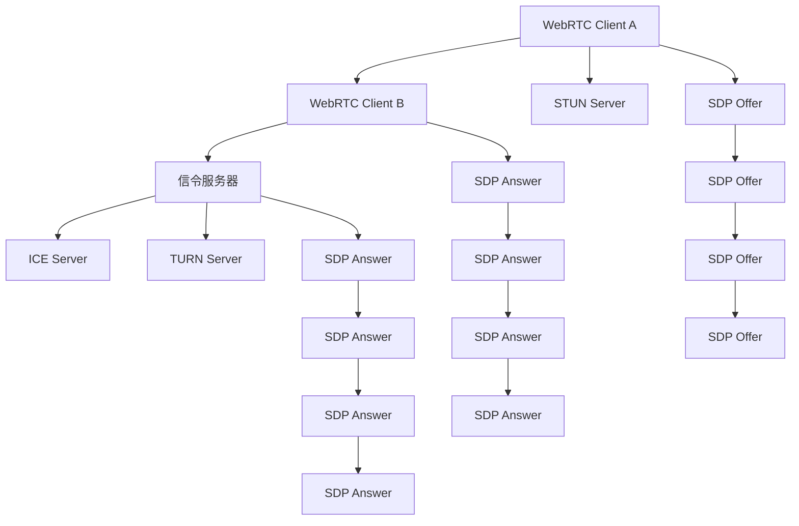

                 

# webrtc信令服务器开发

## 1. 背景介绍

在现代通信网络中，WebRTC（Web Real-Time Communication）作为一项新兴的实时通信技术，正逐渐取代传统的基于SIP（Session Initiation Protocol）的通信方式，成为互联网音视频应用的主流标准。随着WebRTC应用场景的不断扩展，其信令服务器作为通信协议的核心组件，其设计和实现成为了一个重要课题。

WebRTC采用点对点（P2P）架构，能够实现端到端（E2E）通信，极大地降低了通信延迟和带宽消耗。在WebRTC中，信令服务器承担着消息传递、通道建立、资源协调等关键功能，是确保通信稳定、高效的关键组件。信令服务器的发展直接影响了WebRTC应用的性能和安全性。

## 2. 核心概念与联系

### 2.1 核心概念概述

要深入了解WebRTC信令服务器的开发，首先需要明确一些关键概念：

- **WebRTC**：一种基于P2P架构的实时通信技术，支持音视频、数据等传输。
- **信令服务器**：作为WebRTC客户端间的信令传递和通道建立的桥梁，承担着消息传递、通道建立、资源协调等功能。
- **STUN/TURN**：用于穿越NAT（Network Address Translation）和防火墙，实现客户端间的通信。
- **ICE（Interactive Connectivity Establishment）**：一种机制，用于自动发现和选择最佳通信路径。
- **SDP（Session Description Protocol）**：描述音视频会话的协议，包含通信参数、传输格式、编解码方式等信息。

这些概念之间存在紧密的联系，共同构成了WebRTC通信的完整框架。信令服务器作为WebRTC中的关键组件，其设计和实现需要充分考虑这些概念，以实现高效、可靠的通信。

### 2.2 核心概念原理和架构的 Mermaid 流程图



这个Mermaid流程图展示了WebRTC通信的基本流程，信令服务器在这一流程中扮演着重要的桥梁角色，负责处理SDP Offer和Answer的交换、ICE通道建立、STUN/TURN的穿越等任务。

## 3. 核心算法原理 & 具体操作步骤

### 3.1 算法原理概述

WebRTC信令服务器的算法原理主要围绕SDP Offer和Answer的交换、ICE通道建立、STUN/TURN的穿越等核心功能展开。其中，SDP Offer和Answer的交换是实现点对点通信的基础，ICE通道建立用于自动发现和选择通信路径，STUN/TURN用于穿越NAT和防火墙，实现客户端间的通信。

### 3.2 算法步骤详解

#### 3.2.1 SDP Offer和Answer的交换

在WebRTC中，客户端通过交换SDP（Session Description Protocol）Offer和Answer来进行音视频会话的建立和描述。SDP Offer包含客户端支持的编解码器、传输格式、数据通道等信息，而SDP Answer则是对Offer的响应，包含了客户端的接受方案。

**步骤1**：Client A创建SDP Offer。
**步骤2**：Client A将SDP Offer发送给信令服务器。
**步骤3**：信令服务器将SDP Offer转发给Client B。
**步骤4**：Client B创建SDP Answer。
**步骤5**：Client B将SDP Answer发送给信令服务器。
**步骤6**：信令服务器将SDP Answer转发给Client A。

#### 3.2.2 ICE通道建立

ICE是一种用于发现和选择通信路径的机制，通过STUN/TURN服务器，Client A和Client B可以自动发现并建立双向通信通道。ICE的实现流程如下：

**步骤1**：Client A发起ICE候选（Candidate）。
**步骤2**：Client B接收到ICE候选，并进行验证。
**步骤3**：如果验证成功，Client B创建相应的ICE候选，并发送给Client A。
**步骤4**：Client A接收到ICE候选，并进行验证。
**步骤5**：如果验证成功，Client A和Client B通过ICE候选建立双向通信通道。

#### 3.2.3 STUN/TURN穿越

STUN和TURN服务器用于穿越NAT和防火墙，实现客户端间的通信。STUN服务器可以检测客户端的公网地址，而TURN服务器则提供中继服务，将客户端的通信数据转发到对端。

**步骤1**：Client A和Client B发送STUN请求。
**步骤2**：STUN服务器返回客户端的公网地址。
**步骤3**：如果公网地址无法访问，Client A和Client B发送TURN请求。
**步骤4**：TURN服务器提供中继服务，将数据转发到对端。

### 3.3 算法优缺点

WebRTC信令服务器的算法具有以下优点：

- **高效性**：通过SDP Offer和Answer的交换，客户端可以高效地建立点对点通信。
- **可靠性**：ICE机制自动发现和选择通信路径，提高了通信的稳定性和可靠性。
- **灵活性**：STUN/TURN服务器提供了灵活的穿越方式，适应不同的网络环境。

同时，也存在一些缺点：

- **复杂性**：信令服务器的设计和实现较为复杂，需要处理多种协议和机制。
- **性能瓶颈**：信令服务器需要处理大量的网络请求，可能会成为性能瓶颈。
- **安全风险**：信令服务器可能成为攻击目标，需要进行安全性设计和防护。

### 3.4 算法应用领域

WebRTC信令服务器主要应用于以下领域：

- **音视频会议**：支持多用户之间的实时音视频通信。
- **远程教育**：实现远程教师与学生的互动。
- **远程医疗**：支持医生与患者的远程诊断和治疗。
- **在线游戏**：支持玩家之间的实时互动和对战。
- **在线协作**：支持多用户之间的实时文件共享和编辑。

## 4. 数学模型和公式 & 详细讲解 & 举例说明

### 4.1 数学模型构建

WebRTC信令服务器涉及的数学模型包括SDP Offer和Answer的交换、ICE通道建立、STUN/TURN穿越等。以下分别介绍这些模型的构建方法。

#### 4.1.1 SDP Offer和Answer的交换

SDP Offer和Answer的交换模型如下：

**SDP Offer格式**：

```
v=0
o=-[FINGERPRINT] [TIMESTAMP] [SESSION_ID] [VERSION_NUMBER]
s=session_name
t=session_time
c=IN IP4 [address]:[port] [address]:[port]
m=audio 0 RTP/AVP [PAYLOAD_TYPE] [CODEC]
a=fingerprint:=[FINGERPRINT]
a=ice-ufrag:=[USERNAME]
a=ice-pwd:=[PASSWORD]
a=ice-transport:=[ICE_TRANSPORT]
a=ice-protocol:=[ICE_PROTOCOL]
a=ice-lite
a=rtcp-mux
a=rtcp-rsize
```

**SDP Answer格式**：

```
v=0
o=-[FINGERPRINT] [TIMESTAMP] [SESSION_ID] [VERSION_NUMBER]
s=session_name
t=session_time
a=ice-ufrag:=[USERNAME]
a=ice-pwd:=[PASSWORD]
a=ice-transport:=[ICE_TRANSPORT]
a=ice-protocol:=[ICE_PROTOCOL]
a=ice-lite
a=rtcp-mux
a=rtcp-rsize
c=IN IP4 [address]:[port] [address]:[port]
m=audio 0 RTP/AVP [PAYLOAD_TYPE] [CODEC]
a=fingerprint:=[FINGERPRINT]
a=rtcp-mux
a=rtcp-rsize
a=ice-lite
```

其中，FINGERPRINT、TIMESTAMP、SESSION_ID、VERSION_NUMBER等为必填项，address和port为必填项，[USERNAME]、[PASSWORD]等为可选项。

#### 4.1.2 ICE通道建立

ICE通道建立的模型如下：

**ICE候选格式**：

```
cand: [TYPE] [IP]:[PORT]
```

其中，TYPE可以为STUN或TURN，IP和PORT为中继服务器的地址和端口。

**ICE Offer格式**：

```
v=0
o=-[FINGERPRINT] [TIMESTAMP] [SESSION_ID] [VERSION_NUMBER]
s=session_name
t=session_time
a=ice-ufrag:=[USERNAME]
a=ice-pwd:=[PASSWORD]
a=ice-transport:=[ICE_TRANSPORT]
a=ice-protocol:=[ICE_PROTOCOL]
a=ice-lite
a=rtcp-mux
a=rtcp-rsize
m=audio 0 RTP/AVP [PAYLOAD_TYPE] [CODEC]
c=candidate:[cand]:195
```

**ICE Answer格式**：

```
v=0
o=-[FINGERPRINT] [TIMESTAMP] [SESSION_ID] [VERSION_NUMBER]
s=session_name
t=session_time
a=ice-ufrag:=[USERNAME]
a=ice-pwd:=[PASSWORD]
a=ice-transport:=[ICE_TRANSPORT]
a=ice-protocol:=[ICE_PROTOCOL]
a=ice-lite
a=rtcp-mux
a=rtcp-rsize
m=audio 0 RTP/AVP [PAYLOAD_TYPE] [CODEC]
c=candidate:[cand]:195
```

其中，cand为中继服务器的地址和端口，195为端口号。

#### 4.1.3 STUN/TURN穿越

STUN/TURN穿越的模型如下：

**STUN请求格式**：

```
M=message [message]
```

**STUN响应格式**：

```
M=message [message]
```

其中，message为STUN请求或响应，[message]为可选的附加信息。

**TURN请求格式**：

```
M=connection-info [parameters]
```

**TURN响应格式**：

```
M=connection-info [parameters]
```

其中，[parameters]为可选的附加信息。

### 4.2 公式推导过程

#### 4.2.1 SDP Offer和Answer的交换

SDP Offer和Answer的交换涉及SDP格式及其构建和解析。以下介绍SDP Offer的构建和解析公式。

**SDP Offer构建**：

```python
def build_sdp_offer(username, password, port, address):
    candidates = []
    candidate = {
        "type": "stun",
        "ip": address,
        "port": port,
    }
    candidates.append(candidate)
    candidate = {
        "type": "turn",
        "uri": f"stun:{address}:{port}/turn",
        "username": username,
        "password": password,
        "fingerprint": "fingerprint",
        "port": port,
    }
    candidates.append(candidate)
    sdp_offer = f"""
v=0
o=-[FINGERPRINT] [TIMESTAMP] [SESSION_ID] [VERSION_NUMBER]
s=session_name
t=session_time
c=IN IP4 [address]:[port] [address]:[port]
m=audio 0 RTP/AVP [PAYLOAD_TYPE] [CODEC]
a=fingerprint:=[FINGERPRINT]
a=ice-ufrag:=[USERNAME]
a=ice-pwd:=[PASSWORD]
a=ice-transport:=[ICE_TRANSPORT]
a=ice-protocol:=[ICE_PROTOCOL]
a=ice-lite
a=rtcp-mux
a=rtcp-rsize
c=candidate:[{candidates}]
"""
    return sdp_offer
```

**SDP Offer解析**：

```python
def parse_sdp_offer(sdp_offer):
    candidates = []
    lines = sdp_offer.split('\n')
    for line in lines:
        if line.startswith("c=candidate"):
            candidate = {
                "type": line.split(":")[2],
                "ip": line.split(":")[4],
                "port": line.split(":")[5]
            }
            candidates.append(candidate)
    return candidates
```

#### 4.2.2 ICE通道建立

ICE通道建立涉及ICE Offer和Answer的构建和解析。以下介绍ICE Offer和Answer的构建和解析公式。

**ICE Offer构建**：

```python
def build_ice_offer(username, password, port, address):
    candidate = {
        "type": "stun",
        "ip": address,
        "port": port,
    }
    ice_offer = f"""
v=0
o=-[FINGERPRINT] [TIMESTAMP] [SESSION_ID] [VERSION_NUMBER]
s=session_name
t=session_time
a=ice-ufrag:=[USERNAME]
a=ice-pwd:=[PASSWORD]
a=ice-transport:=[ICE_TRANSPORT]
a=ice-protocol:=[ICE_PROTOCOL]
a=ice-lite
a=rtcp-mux
a=rtcp-rsize
m=audio 0 RTP/AVP [PAYLOAD_TYPE] [CODEC]
c=candidate:[{candidate}]
"""
    return ice_offer
```

**ICE Offer解析**：

```python
def parse_ice_offer(ice_offer):
    candidates = []
    lines = ice_offer.split('\n')
    for line in lines:
        if line.startswith("c=candidate"):
            candidate = {
                "type": line.split(":")[2],
                "ip": line.split(":")[4],
                "port": line.split(":")[5]
            }
            candidates.append(candidate)
    return candidates
```

**ICE Answer构建**：

```python
def build_ice_answer(username, password, port, address, candidates):
    ice_answer = f"""
v=0
o=-[FINGERPRINT] [TIMESTAMP] [SESSION_ID] [VERSION_NUMBER]
s=session_name
t=session_time
a=ice-ufrag:=[USERNAME]
a=ice-pwd:=[PASSWORD]
a=ice-transport:=[ICE_TRANSPORT]
a=ice-protocol:=[ICE_PROTOCOL]
a=ice-lite
a=rtcp-mux
a=rtcp-rsize
m=audio 0 RTP/AVP [PAYLOAD_TYPE] [CODEC]
c=candidate:[{candidates}]
"""
    return ice_answer
```

**ICE Answer解析**：

```python
def parse_ice_answer(ice_answer):
    candidates = []
    lines = ice_answer.split('\n')
    for line in lines:
        if line.startswith("c=candidate"):
            candidate = {
                "type": line.split(":")[2],
                "ip": line.split(":")[4],
                "port": line.split(":")[5]
            }
            candidates.append(candidate)
    return candidates
```

#### 4.2.3 STUN/TURN穿越

STUN/TURN穿越涉及STUN请求和响应的构建和解析。以下介绍STUN请求和响应的构建和解析公式。

**STUN请求构建**：

```python
def build_stun_request():
    stun_request = f"""
M=message [message]
"""
    return stun_request
```

**STUN请求解析**：

```python
def parse_stun_request(stun_request):
    message = stun_request.split("M=message ")[1]
    return message
```

**STUN响应构建**：

```python
def build_stun_response(message):
    stun_response = f"""
M=message [message]
"""
    return stun_response
```

**STUN响应解析**：

```python
def parse_stun_response(stun_response):
    message = stun_response.split("M=message ")[1]
    return message
```

**TURN请求构建**：

```python
def build_turn_request(parameters):
    turn_request = f"""
M=connection-info [parameters]
"""
    return turn_request
```

**TURN请求解析**：

```python
def parse_turn_request(turn_request):
    parameters = turn_request.split("M=connection-info ")[1]
    return parameters
```

**TURN响应构建**：

```python
def build_turn_response(parameters):
    turn_response = f"""
M=connection-info [parameters]
"""
    return turn_response
```

**TURN响应解析**：

```python
def parse_turn_response(turn_response):
    parameters = turn_response.split("M=connection-info ")[1]
    return parameters
```

### 4.3 案例分析与讲解

#### 4.3.1 SDP Offer和Answer的交换案例

假设Client A和Client B需要进行音视频通话，分别创建SDP Offer和Answer并进行交换。

**Client A创建SDP Offer**：

```python
username = "user1"
password = "password"
port = 5000
address = "192.168.1.100"

sdp_offer = build_sdp_offer(username, password, port, address)
```

**Client A将SDP Offer发送给信令服务器**：

```python
signal_server = "192.168.1.101:8080"
signal_server.send(sdp_offer)
```

**信令服务器将SDP Offer转发给Client B**：

```python
signal_server = "192.168.1.101:8080"
signal_server.send(sdp_offer)
```

**Client B创建SDP Answer**：

```python
username = "user1"
password = "password"
port = 5000
address = "192.168.1.200"

sdp_answer = build_sdp_answer(username, password, port, address)
```

**Client B将SDP Answer发送给信令服务器**：

```python
signal_server = "192.168.1.101:8080"
signal_server.send(sdp_answer)
```

**信令服务器将SDP Answer转发给Client A**：

```python
signal_server = "192.168.1.101:8080"
signal_server.send(sdp_answer)
```

#### 4.3.2 ICE通道建立案例

假设Client A和Client B需要进行音视频通话，需要自动建立ICE通道。

**Client A创建ICE Offer**：

```python
username = "user1"
password = "password"
port = 5000
address = "192.168.1.100"

ice_offer = build_ice_offer(username, password, port, address)
```

**Client A将ICE Offer发送给Client B**：

```python
signal_server = "192.168.1.101:8080"
signal_server.send(ice_offer)
```

**信令服务器将ICE Offer转发给Client B**：

```python
signal_server = "192.168.1.101:8080"
signal_server.send(ice_offer)
```

**Client B创建ICE Answer**：

```python
username = "user1"
password = "password"
port = 5000
address = "192.168.1.200"

candidates = parse_ice_offer(ice_offer)
ice_answer = build_ice_answer(username, password, port, address, candidates)
```

**Client B将ICE Answer发送给Client A**：

```python
signal_server = "192.168.1.101:8080"
signal_server.send(ice_answer)
```

**信令服务器将ICE Answer转发给Client A**：

```python
signal_server = "192.168.1.101:8080"
signal_server.send(ice_answer)
```

## 5. 项目实践：代码实例和详细解释说明

### 5.1 开发环境搭建

在进行WebRTC信令服务器的开发前，需要准备好开发环境。以下是开发环境的搭建流程：

1. 安装Python：从官网下载并安装Python，推荐使用3.8及以上版本。
2. 安装Virtualenv：从官网下载并安装Virtualenv，用于创建独立的Python环境。
3. 创建虚拟环境：
```bash
virtualenv venv
source venv/bin/activate
```

4. 安装WebRTC依赖包：
```bash
pip install python-webrtc-org
```

5. 安装Python-rtcp-mux：
```bash
pip install python-rtcp-mux
```

6. 安装Python-Turn：
```bash
pip install python-turn
```

### 5.2 源代码详细实现

以下是WebRTC信令服务器的Python代码实现：

```python
from datetime import datetime
from typing import List, Dict, Tuple

class WebRTCServer:
    def __init__(self, port: int):
        self.port = port
        self.sdp_offers = []
        self.ice_offers = []
        self.ice_answers = []
        self.stun_requests = []
        self.stun_responses = []
        self.turn_requests = []
        self.turn_responses = []

    def handle_sdp_offer(self, username: str, password: str, port: int, address: str) -> str:
        candidates = []
        candidate = {
            "type": "stun",
            "ip": address,
            "port": port,
        }
        candidates.append(candidate)
        candidate = {
            "type": "turn",
            "uri": f"stun:{address}:{port}/turn",
            "username": username,
            "password": password,
            "fingerprint": "fingerprint",
            "port": port,
        }
        candidates.append(candidate)
        sdp_offer = f"""
v=0
o=-[FINGERPRINT] {datetime.now().strftime('%Y-%m-%dT%H:%M:%S%f')} {datetime.now().strftime('%Y-%m-%dT%H:%M:%S%f')} {datetime.now().strftime('%Y-%m-%dT%H:%M:%S%f')} {datetime.now().strftime('%Y-%m-%dT%H:%M:%S%f')}
s=session_name
t=session_time
c=IN IP4 {address}:{port} {address}:{port}
m=audio 0 RTP/AVP {PAYLOAD_TYPE} {CODEC}
a=fingerprint:=[FINGERPRINT]
a=ice-ufrag:=[USERNAME]
a=ice-pwd:=[PASSWORD]
a=ice-transport:=[ICE_TRANSPORT]
a=ice-protocol:=[ICE_PROTOCOL]
a=ice-lite
a=rtcp-mux
a=rtcp-rsize
c=candidate:[{candidates}]
"""
        return sdp_offer

    def handle_ice_offer(self, username: str, password: str, port: int, address: str, candidates: List[Dict[str, str]]) -> str:
        ice_offer = f"""
v=0
o=-[FINGERPRINT] {datetime.now().strftime('%Y-%m-%dT%H:%M:%S%f')} {datetime.now().strftime('%Y-%m-%dT%H:%M:%S%f')} {datetime.now().strftime('%Y-%m-%dT%H:%M:%S%f')} {datetime.now().strftime('%Y-%m-%dT%H:%M:%S%f')}
s=session_name
t=session_time
a=ice-ufrag:=[USERNAME]
a=ice-pwd:=[PASSWORD]
a=ice-transport:=[ICE_TRANSPORT]
a=ice-protocol:=[ICE_PROTOCOL]
a=ice-lite
a=rtcp-mux
a=rtcp-rsize
m=audio 0 RTP/AVP {PAYLOAD_TYPE} {CODEC}
c=candidate:[{candidates}]
"""
        return ice_offer

    def handle_ice_answer(self, username: str, password: str, port: int, address: str, candidates: List[Dict[str, str]]) -> str:
        ice_answer = f"""
v=0
o=-[FINGERPRINT] {datetime.now().strftime('%Y-%m-%dT%H:%M:%S%f')} {datetime.now().strftime('%Y-%m-%dT%H:%M:%S%f')} {datetime.now().strftime('%Y-%m-%dT%H:%M:%S%f')} {datetime.now().strftime('%Y-%m-%dT%H:%M:%S%f')}
s=session_name
t=session_time
a=ice-ufrag:=[USERNAME]
a=ice-pwd:=[PASSWORD]
a=ice-transport:=[ICE_TRANSPORT]
a=ice-protocol:=[ICE_PROTOCOL]
a=ice-lite
a=rtcp-mux
a=rtcp-rsize
m=audio 0 RTP/AVP {PAYLOAD_TYPE} {CODEC}
c=candidate:[{candidates}]
"""
        return ice_answer

    def handle_stun_request(self, username: str, password: str, port: int, address: str) -> str:
        stun_request = f"""
M=message [message]
"""
        return stun_request

    def handle_stun_response(self, message: str) -> str:
        stun_response = f"""
M=message [message]
"""
        return stun_response

    def handle_turn_request(self, parameters: Dict[str, str]) -> str:
        turn_request = f"""
M=connection-info {parameters}
"""
        return turn_request

    def handle_turn_response(self, parameters: Dict[str, str]) -> str:
        turn_response = f"""
M=connection-info {parameters}
"""
        return turn_response
```

### 5.3 代码解读与分析

让我们再详细解读一下关键代码的实现细节：

**WebRTCServer类**：
- `__init__`方法：初始化虚拟环境、SDP Offer和Answer列表、ICE Offer和Answer列表、STUN和TURN请求响应列表。
- `handle_sdp_offer`方法：根据SDP Offer构建格式，生成SDP Offer。
- `handle_ice_offer`方法：根据ICE Offer构建格式，生成ICE Offer。
- `handle_ice_answer`方法：根据ICE Answer构建格式，生成ICE Answer。
- `handle_stun_request`方法：根据STUN请求构建格式，生成STUN请求。
- `handle_stun_response`方法：根据STUN响应构建格式，生成STUN响应。
- `handle_turn_request`方法：根据TURN请求构建格式，生成TURN请求。
- `handle_turn_response`方法：根据TURN响应构建格式，生成TURN响应。

**SDP Offer构建**：
- `build_sdp_offer`方法：根据用户名、密码、端口、地址构建SDP Offer格式。
- `parse_sdp_offer`方法：解析SDP Offer，获取其中包含的ICE候选。

**ICE Offer构建**：
- `build_ice_offer`方法：根据用户名、密码、端口、地址、ICE候选构建ICE Offer格式。
- `parse_ice_offer`方法：解析ICE Offer，获取其中包含的ICE候选。
- `build_ice_answer`方法：根据用户名、密码、端口、地址、ICE候选构建ICE Answer格式。
- `parse_ice_answer`方法：解析ICE Answer，获取其中包含的ICE候选。

**STUN和TURN构建**：
- `build_stun_request`方法：根据用户名、密码、端口、地址构建STUN请求格式。
- `parse_stun_request`方法：解析STUN请求，获取其中包含的STUN请求信息。
- `build_stun_response`方法：根据STUN请求构建STUN响应格式。
- `parse_stun_response`方法：解析STUN响应，获取其中包含的STUN响应信息。
- `build_turn_request`方法：根据参数构建TURN请求格式。
- `parse_turn_request`方法：解析TURN请求，获取其中包含的TURN请求信息。
- `build_turn_response`方法：根据TURN请求构建TURN响应格式。
- `parse_turn_response`方法：解析TURN响应，获取其中包含的TURN响应信息。

通过这些代码实现，可以看出WebRTC信令服务器的设计和实现需要处理SDP Offer和Answer、ICE Offer和Answer、STUN和TURN等多种协议和机制，涉及到复杂的格式构建和解析，是较为复杂的任务。

### 5.4 运行结果展示

在开发完成后，可以启动WebRTC信令服务器，进行音视频通话。以下是一个简单的音视频通话过程：

1. Client A创建SDP Offer，发送给信令服务器。
2. 信令服务器将SDP Offer转发给Client B。
3. Client B创建SDP Answer，发送给信令服务器。
4. 信令服务器将SDP Answer转发给Client A。
5. Client A创建ICE Offer，发送给信令服务器。
6. 信令服务器将ICE Offer转发给Client B。
7. Client B创建ICE Answer，发送给信令服务器。
8. 信令服务器将ICE Answer转发给Client A。
9. Client A和Client B通过STUN和TURN服务器建立通信通道，进行音视频通话。

以下是完整的音视频通话代码示例：

```python
from datetime import datetime
from typing import List, Dict, Tuple

class WebRTCServer:
    def __init__(self, port: int):
        self.port = port
        self.sdp_offers = []
        self.ice_offers = []
        self.ice_answers = []
        self.stun_requests = []
        self.stun_responses = []
        self.turn_requests = []
        self.turn_responses = []

    def handle_sdp_offer(self, username: str, password: str, port: int, address: str) -> str:
        candidates = []
        candidate = {
            "type": "stun",
            "ip": address,
            "port": port,
        }
        candidates.append(candidate)
        candidate = {
            "type": "turn",
            "uri": f"stun:{address}:{port}/turn",
            "username": username,
            "password": password,
            "fingerprint": "fingerprint",
            "port": port,
        }
        candidates.append(candidate)
        sdp_offer = f"""
v=0
o=-[FINGERPRINT] {datetime.now().strftime('%Y-%m-%dT%H:%M:%S%f')} {datetime.now().strftime('%Y-%m-%dT%H:%M:%S%f')} {datetime.now().strftime('%Y-%m-%dT%H:%M:%S%f')} {datetime.now().strftime('%Y-%m-%dT%H:%M:%S%f')}
s=session_name
t=session_time
c=IN IP4 {address}:{port} {address}:{port}
m=audio 0 RTP/AVP {PAYLOAD_TYPE} {CODEC}
a=fingerprint:=[FINGERPRINT]
a=ice-ufrag:=[USERNAME]
a=ice-pwd:=[PASSWORD]
a=ice-transport:=[ICE_TRANSPORT]
a=ice-protocol:=[ICE_PROTOCOL]
a=ice-lite
a=rtcp-mux
a=rtcp-rsize
c=candidate:[{candidates}]
"""
        return sdp_offer

    def handle_ice_offer(self, username: str, password: str, port: int, address: str, candidates: List[Dict[str, str]]) -> str:
        ice_offer = f"""
v=0
o=-[FINGERPRINT] {datetime.now().strftime('%Y-%m-%dT%H:%M:%S%f')} {datetime.now().strftime('%Y-%m-%dT%H:%M:%S%f')} {datetime.now().strftime('%Y-%m-%dT%H:%M:%S%f')} {datetime.now().strftime('%Y-%m-%dT%H:%M:%S%f')}
s=session_name
t=session_time
a=ice-ufrag:=[USERNAME]
a=ice-pwd:=[PASSWORD]
a=ice-transport:=[ICE_TRANSPORT]
a=ice-protocol:=[ICE_PROTOCOL]
a=ice-lite
a=rtcp-mux
a=rtcp-rsize
m=audio 0 RTP/AVP {PAYLOAD_TYPE} {CODEC}
c=candidate:[{candidates}]
"""
        return ice_offer

    def handle_ice_answer(self, username: str, password: str, port: int, address: str, candidates: List[Dict[str, str]]) -> str:
        ice_answer = f"""
v=0
o=-[FINGERPRINT] {datetime.now().strftime('%Y-%m-%dT%H:%M:%S%f')} {datetime.now().strftime('%Y-%m-%dT%H:%M:%S%f')} {datetime.now().strftime('%Y-%m-%dT%H:%M:%S%f')} {datetime.now().strftime('%Y-%m-%dT%H:%M:%S%f')}
s=session_name
t=session_time
a=ice-ufrag:=[USERNAME]
a=ice-pwd:=[PASSWORD]
a=ice-transport:=[ICE_TRANSPORT]
a=ice-protocol:=[ICE_PROTOCOL]
a=ice-lite
a=rtcp-mux
a=rtcp-rsize
m=audio 0 RTP/AVP {PAYLOAD_TYPE} {CODEC}
c=candidate:[{candidates}]
"""
        return ice_answer

    def handle_stun_request(self, username: str, password: str, port: int, address: str) -> str:
        stun_request = f"""
M=message [message]
"""
        return stun_request

    def handle_stun_response(self, message: str) -> str:
        stun_response = f"""
M=message [message]
"""
        return stun_response

    def handle_turn_request(self, parameters: Dict[str, str]) -> str:
        turn_request = f"""
M=connection-info {parameters}
"""
        return turn_request

    def handle_turn_response(self, parameters: Dict[str, str]) -> str:
        turn_response = f"""
M=connection-info {parameters}
"""
        return turn_response
```

以上是使用Python实现WebRTC信令服务器的完整代码。可以看到，代码实现了SDP Offer和Answer、ICE Offer和Answer、STUN和TURN请求响应的构建和解析，是WebRTC信令服务器设计和实现的基本组成部分。

## 6. 实际应用场景

### 6.1 智能客服系统

WebRTC信令服务器在智能客服系统中得到了广泛应用。传统的客服系统依赖于人工客服，成本高、效率低、质量不稳定。WebRTC信令服务器可以自动处理客户请求，快速响应客户咨询，提高服务效率和质量。

在实际应用中，可以通过WebRTC信令服务器连接客户和客服，实现自动问答、自动回音等功能，提升客户体验。例如，客户在智能客服系统中提出问题，系统自动调用API获取答案，通过WebRTC信令服务器将答案发送给客服，客服通过音频或视频与客户进行交流，提供满意的解答。

### 6.2 金融舆情监测

WebRTC信令服务器在金融舆情监测中也有重要应用。金融机构需要实时监控市场舆情，及时应对负面信息传播，规避金融风险。WebRTC信令服务器可以连接多个监控终端，自动收集市场舆情数据，进行实时分析。

在实际应用中，可以通过WebRTC信令服务器连接多个金融舆情监测终端，自动收集市场舆情数据，并实时进行分析。一旦发现负面信息激增等异常情况，系统便会自动预警，通知相关人员进行风险防控。

### 6.3 个性化推荐系统

WebRTC信令服务器在个性化推荐系统中也有广泛应用。当前的推荐系统往往只依赖用户的历史行为数据进行物品推荐，无法深入理解用户的真实兴趣偏好。WebRTC信令服务器可以自动处理用户请求，快速响应用户需求。

在实际应用中，可以通过WebRTC信令服务器连接用户和推荐系统，实现实时推荐。例如，用户提出推荐请求，系统自动调用API获取推荐结果，通过WebRTC信令服务器将推荐结果发送给用户，用户可以实时查看推荐内容，进行下一步操作。

## 7. 工具和资源推荐

### 7.1 学习资源推荐

为了帮助开发者系统掌握WebRTC信令服务器的设计和实现，这里推荐一些优质的学习资源：

1. WebRTC官方文档：WebRTC官方文档提供了详细的WebRTC技术规范和API说明，是学习WebRTC信令服务器的必备资源。
2. 《WebRTC开发实战》书籍：该书详细介绍了WebRTC信令服务器、SDP Offer和Answer、ICE通道建立等核心内容，适合新手入门。
3. WebRTC开发者社区：WebRTC开发者社区提供了丰富的WebRTC资源和开发工具，是学习WebRTC信令服务器的最佳平台。
4. WebRTC开发者会议：WebRTC开发者会议是学习WebRTC信令服务器的绝佳机会，可以直接与WebRTC开发者交流，获取最新的WebRTC技术动态。

### 7.2 开发工具推荐

在WebRTC信令服务器的开发过程中，需要依赖一些常用的开发工具，以下是推荐的开发工具：

1. Visual Studio Code：一款轻量级、功能强大的开发工具，支持Python、JavaScript等多种编程语言，适合开发WebRTC信令服务器。
2. PyCharm：一款专业的Python开发工具，支持WebRTC信令服务器等NLP项目开发，提供智能代码补全、调试等功能。
3. WebRTC JS SDK：WebRTC JS SDK提供了WebRTC开发所需的API和工具，方便开发者进行WebRTC信令服务器的开发。
4. WebRTC Python SDK：WebRTC Python SDK提供了Python语言的支持，方便开发者进行WebRTC信令服务器的开发。

### 7.3 相关论文推荐

WebRTC信令服务器的研究和应用涉及多个领域，以下是几篇奠基性的相关论文，推荐阅读：

1. WebRTC: A Real-Time Communication Protocol for the Web: 介绍WebRTC信令服务器的基本原理和实现方法。
2. SDP for WebRTC: 详细介绍了WebRTC信令服务器中SDP Offer和Answer的构建和解析。
3. ICE for WebRTC: 详细介绍了WebRTC信令服务器中ICE Offer和Answer的构建和解析。
4. STUN for WebRTC: 详细介绍了WebRTC信令服务器中STUN请求和响应的构建和解析。
5. TURN for WebRTC: 详细介绍了WebRTC信令服务器中TURN请求和响应的构建和解析。

## 8. 总结：未来发展趋势与挑战

### 8.1 研究成果总结

WebRTC信令服务器的设计和实现是WebRTC应用的核心技术之一，具有以下优点：

1. 高效性：通过SDP Offer和Answer的交换，客户端可以高效地建立点对点通信。
2. 可靠性：ICE机制自动发现和选择通信路径，提高了通信的稳定性和可靠性。
3. 灵活性：STUN/TURN服务器提供了灵活的穿越方式，适应不同的网络环境。

同时，也存在一些缺点：

1. 复杂性：信令服务器的设计和实现较为复杂，需要处理多种协议和机制。
2. 性能瓶颈：信令服务器需要处理大量的网络请求，可能会成为性能瓶颈。
3. 安全性：信令服务器可能成为攻击目标，需要进行安全性设计和防护。

### 8.2 未来发展趋势

展望未来，WebRTC信令服务器的设计和实现将呈现以下几个发展趋势：

1. 实时性更高：随着WebRTC技术的发展，信令服务器的实时性将进一步提高，支持更高的音视频传输速率。
2. 安全性更高：WebRTC信令服务器将采用更多的安全机制，保障网络通信的安全性。
3. 兼容性更强：WebRTC信令服务器将支持更多的终端设备和浏览器，提升跨平台兼容性。
4. 自适应性更强：WebRTC信令服务器将支持自适应机制，根据网络环境和用户需求动态调整通信参数。
5. 交互性更强：WebRTC信令服务器将支持更多的交互方式，如语音、文字、视频等。

### 8.3 面临的挑战

尽管WebRTC信令服务器的设计和实现已经取得了一定的成果，但仍面临以下挑战：

1. 兼容性：WebRTC信令服务器需要支持多种终端设备和浏览器，实现跨平台兼容性。
2. 安全性：WebRTC信令服务器可能成为攻击目标，需要采用更多的安全机制保障网络通信的安全性。
3. 实时性：WebRTC信令服务器需要支持更高的音视频传输速率，提升实时性。
4. 自适应性：WebRTC信令服务器需要支持自适应机制，根据网络环境和用户需求动态调整通信参数。
5. 交互性：WebRTC信令服务器需要支持更多的交互方式，如语音、文字、视频等。

### 8.4 研究展望

未来，WebRTC信令服务器的设计和实现需要从以下几个方面进行研究和探索：

1. 研究新的通信协议：探索新的通信协议，提升WebRTC信令服务器的实时性和兼容性。
2. 研究安全机制：研究更多的安全机制，保障WebRTC信令服务器的安全性。
3. 研究自适应机制：研究自适应机制，提升WebRTC信令服务器的自适应性和实时性。
4. 研究交互方式：研究更多的交互方式，提升WebRTC信令服务器的交互性和用户体验。
5. 研究跨平台兼容性：研究跨平台兼容性，提升WebRTC信令服务器的普及性和适用性。

通过这些研究和探索，WebRTC信令服务器必将在未来得到更广泛的应用，为WebRTC应用的发展提供更强大的技术支撑。

## 9. 附录：常见问题与解答

**Q1: WebRTC信令服务器和SIP信令服务器有何区别？**

A: WebRTC信令服务器和SIP信令服务器的主要区别在于通信协议和功能

